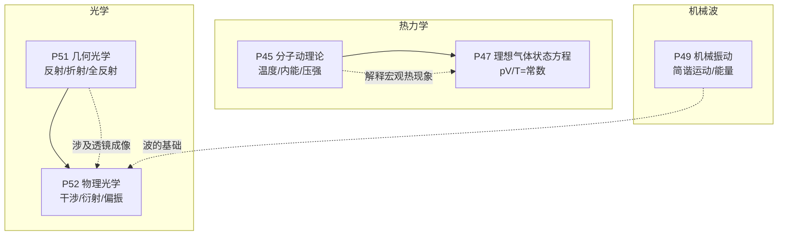
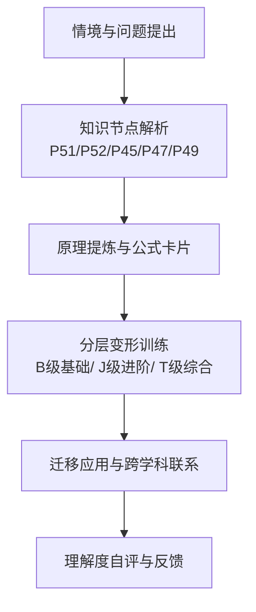
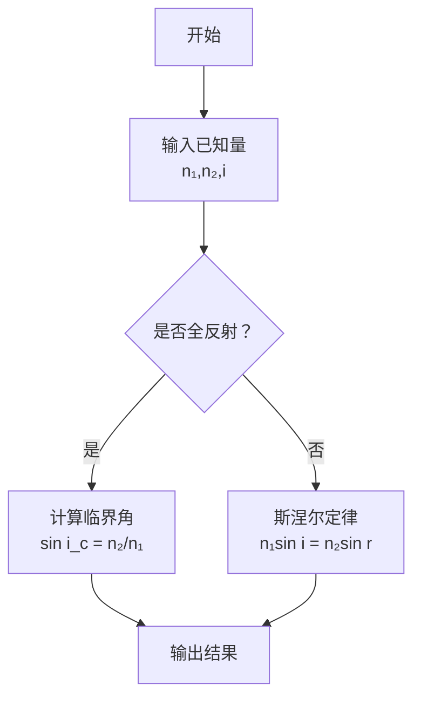
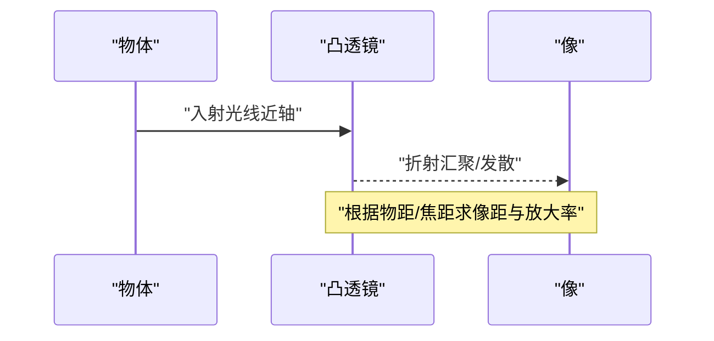
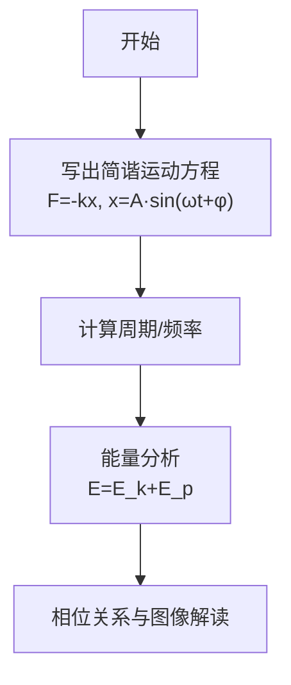
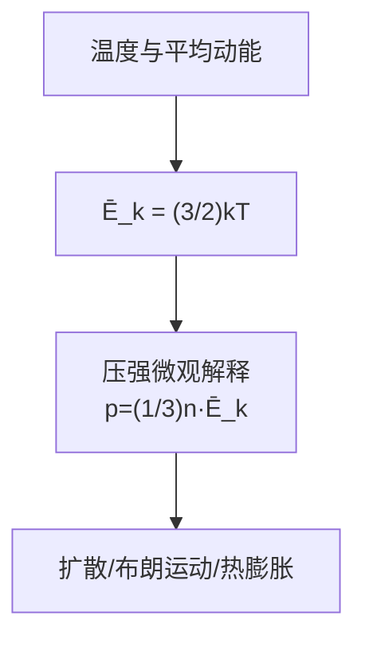
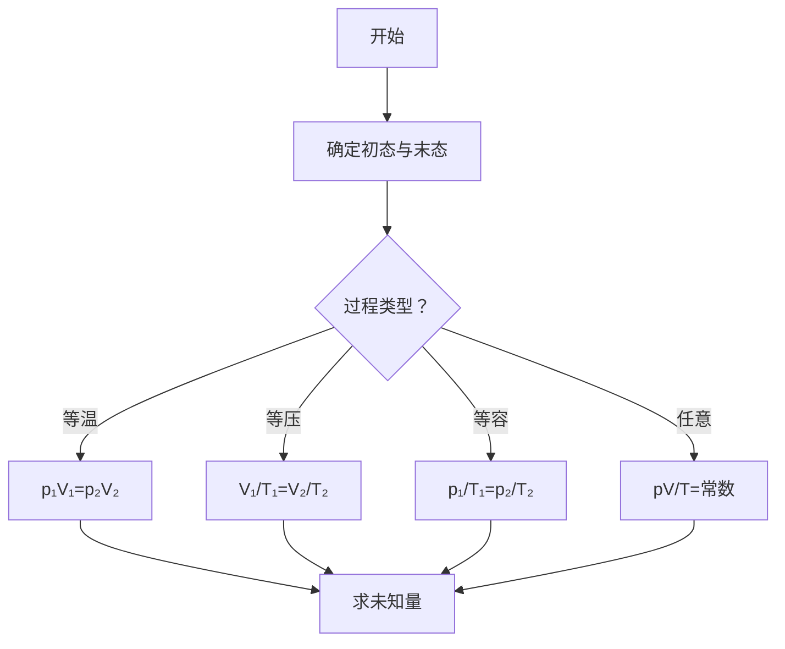
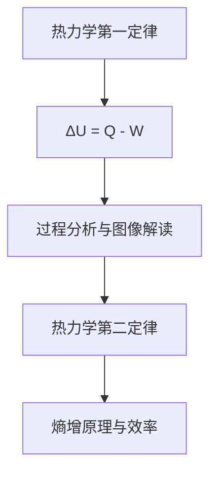
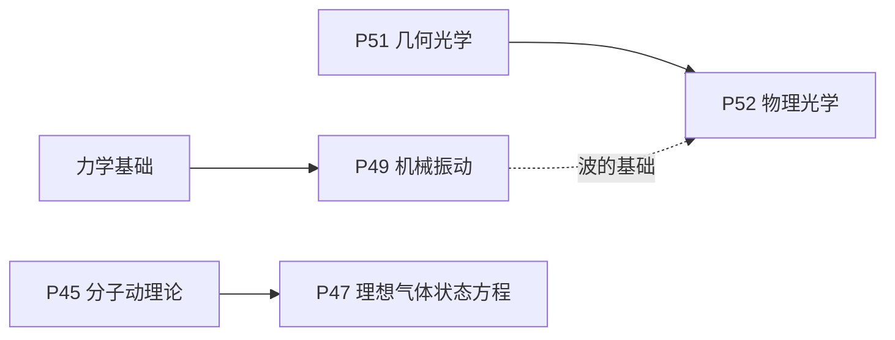

# 光学与热力学解题套路

<cite>
**本文引用的文件**
- [P51_几何光学.md](file://docs/knowledge/physics/P51_几何光学.md)
- [P52_物理光学.md](file://docs/knowledge/physics/P52_物理光学.md)
- [P45_分子动理论.md](file://docs/knowledge/physics/P45_分子动理论.md)
- [P47_理想气体状态方程.md](file://docs/knowledge/physics/P47_理想气体状态方程.md)
- [P49_机械振动.md](file://docs/knowledge/physics/P49_机械振动.md)
</cite>

## 目录
1. [引言](#引言)
2. [项目结构](#项目结构)
3. [核心组件](#核心组件)
4. [架构总览](#架构总览)
5. [详细组件分析](#详细组件分析)
6. [依赖分析](#依赖分析)
7. [性能考虑](#性能考虑)
8. [故障排查指南](#故障排查指南)
9. [结论](#结论)
10. [附录](#附录)

## 引言
本文件面向星耀平台物理学科的光学与热力学解题套路，系统梳理“光的折射与全反射”“透镜成像规律”“干涉与衍射”“机械振动”“机械波”“波的干涉与衍射”“分子动理论”“气体状态方程”“热力学第一定律”“热力学第二定律”等主题的解题方法。文档以知识节点为载体，给出适用情境、物理原理、解题步骤与技巧要点，并通过示例与图示帮助学生建立“微观—宏观”的物理认知桥梁。

## 项目结构
本仓库中与光学和热力学直接相关的知识节点位于 docs/knowledge/physics 目录，包含：
- 几何光学（P51）
- 物理光学（P52）
- 分子动理论（P45）
- 理想气体状态方程（P47）
- 机械振动（P49）

这些文件采用统一的“叙事六段式”结构：情境锚定、困惑预设、实验/现象呈现、概念涌现、推导叙事、迁移应用，并配套前置检测、分层变形（B/J/T）、公式卡片与跨学科关联，便于形成“知识—方法—应用”的闭环。



图表来源
- [P51_几何光学.md:1-213](file://docs/knowledge/physics/P51_几何光学.md#L1-L213)
- [P52_物理光学.md:1-218](file://docs/knowledge/physics/P52_物理光学.md#L1-L218)
- [P45_分子动理论.md:1-216](file://docs/knowledge/physics/P45_分子动理论.md#L1-L216)
- [P47_理想气体状态方程.md:1-200](file://docs/knowledge/physics/P47_理想气体状态方程.md#L1-L200)
- [P49_机械振动.md:1-215](file://docs/knowledge/physics/P49_机械振动.md#L1-L215)

章节来源
- [P51_几何光学.md:1-213](file://docs/knowledge/physics/P51_几何光学.md#L1-L213)
- [P52_物理光学.md:1-218](file://docs/knowledge/physics/P52_物理光学.md#L1-L218)
- [P45_分子动理论.md:1-216](file://docs/knowledge/physics/P45_分子动理论.md#L1-L216)
- [P47_理想气体状态方程.md:1-200](file://docs/knowledge/physics/P47_理想气体状态方程.md#L1-L200)
- [P49_机械振动.md:1-215](file://docs/knowledge/physics/P49_机械振动.md#L1-L215)

## 核心组件
- 几何光学（P51）：聚焦反射定律、斯涅尔定律、全反射条件与临界角，强调“光的直线传播近似下的几何描述”，并提供光纤通信等迁移应用。
- 物理光学（P52）：聚焦干涉、衍射与偏振，强调“光的波动性”，并提供双缝、薄膜、牛顿环、偏振片等典型实验与应用。
- 分子动理论（P45）：聚焦温度、平均动能、内能与压强的微观解释，强调“大量分子无规则运动的统计平均”。
- 理想气体状态方程（P47）：聚焦 pV/T=常数与 pV=nRT，强调“统一描述气体初末状态”，并提供多过程与图像分析。
- 机械振动（P49）：聚焦简谐运动的回复力、位移、周期与能量转化，强调“匀变速运动”的误区与相位关系。

章节来源
- [P51_几何光学.md:170-180](file://docs/knowledge/physics/P51_几何光学.md#L170-L180)
- [P52_物理光学.md:175-184](file://docs/knowledge/physics/P52_物理光学.md#L175-L184)
- [P45_分子动理论.md:173-182](file://docs/knowledge/physics/P45_分子动理论.md#L173-L182)
- [P47_理想气体状态方程.md:157-166](file://docs/knowledge/physics/P47_理想气体状态方程.md#L157-L166)
- [P49_机械振动.md:171-180](file://docs/knowledge/physics/P49_机械振动.md#L171-L180)

## 架构总览
光学与热力学解题套路的“知识—方法—应用”架构如下：



该架构确保学生从“现象—原理—建模—计算—迁移”的完整路径掌握解题套路。

## 详细组件分析

### 组件A：光的折射与全反射（P51）
- 适用情境
  - 光从一种介质斜射入另一种介质（折射）
  - 光从光密介质射向光疏介质且入射角超过临界角（全反射）
  - 光纤通信、眼镜、棱镜等实际应用
- 物理原理
  - 反射定律：反射角等于入射角
  - 斯涅尔定律：n₁sin i = n₂sin r
  - 全反射条件：从光密到光疏，入射角大于临界角 i_c，满足 sin i_c = n₂/n₁
- 解题步骤与技巧
  - 正确识别界面与介质，标注入射角、折射角与法线
  - 使用斯涅尔定律求折射角或相对折射率
  - 判断是否发生全反射：比较入射角与临界角
  - 注意单位换算与有效数字
- 示例与关键环节
  - 已知 n=4/3、i=30°，求折射角 r 的近似值
  - 已知玻璃 n=1.5，求临界角 i_c
  - 解释光纤通信利用全反射的原理
- 与相关知识节点/模型的关联
  - 与 P52 的“透镜成像”在几何光学基础上建立联系
  - 与 M38、M39（相关模型）协同用于成像与色散分析



图表来源
- [P51_几何光学.md:66-71](file://docs/knowledge/physics/P51_几何光学.md#L66-L71)
- [P51_几何光学.md:129-137](file://docs/knowledge/physics/P51_几何光学.md#L129-L137)

章节来源
- [P51_几何光学.md:30-96](file://docs/knowledge/physics/P51_几何光学.md#L30-L96)
- [P51_几何光学.md:98-167](file://docs/knowledge/physics/P51_几何光学.md#L98-L167)
- [P51_几何光学.md:170-179](file://docs/knowledge/physics/P51_几何光学.md#L170-L179)

### 组件B：透镜成像规律（P51→P52）
- 适用情境
  - 凸透镜/凹透镜成像，物距、像距、焦距关系
  - 放大率与像的性质（实/虚、正立/倒立、大小）
- 物理原理
  - 几何光学基础上的成像模型（近轴光线）
  - 与物理光学中的“波的干涉/衍射”在“光的波动性”层面建立联系
- 解题步骤与技巧
  - 画光路图，确定物距 u、像距 v、焦距 f
  - 使用透镜成像公式（可基于几何光学推导）
  - 结合成像规律判断像的性质
- 示例与关键环节
  - 已知 u、f，求 v 与放大率
  - 利用双缝/薄膜实验解释光的波动性与相干条件



图表来源
- [P51_几何光学.md:86-95](file://docs/knowledge/physics/P51_几何光学.md#L86-L95)
- [P52_物理光学.md:90-99](file://docs/knowledge/physics/P52_物理光学.md#L90-L99)

章节来源
- [P51_几何光学.md:86-95](file://docs/knowledge/physics/P51_几何光学.md#L86-L95)
- [P52_物理光学.md:90-99](file://docs/knowledge/physics/P52_物理光学.md#L90-L99)

### 组件C：干涉与衍射（P52）
- 适用情境
  - 双缝干涉条纹间距、薄膜干涉增减反、单缝衍射中央明纹宽度
  - 偏振片分析自然光与线偏振光
- 物理原理
  - 干涉：光程差 Δ = kλ（加强）或 Δ = (2k+1)λ/2（减弱）
  - 双缝：Δx = λD/d
  - 单缝：a sin θ = kλ（暗纹）
  - 薄膜：2ne = kλ（垂直入射）
  - 偏振：马吕斯定律（I ∝ cos²θ）
- 解题步骤与技巧
  - 区分干涉与衍射：双缝/薄膜为相干叠加，单缝为绕射
  - 明暗条纹判定与位置计算
  - 偏振片后的光强变化
- 示例与关键环节
  - 已知 d、D、λ，求 Δx
  - 已知 a、Δx、D，求 λ
  - 薄膜厚度 e 与可见光波长 λ 的关系

```mermaid
flowchart TD
A["双缝/单缝/薄膜"] --> B["相干叠加条件"]
B --> C{"光程差 Δ"}
C --> |Δ=kλ| D["明纹"]
C --> |Δ=(2k+1)λ/2| E["暗纹"]
A --> F["偏振片"]
F --> G["光强衰减"]
```

图表来源
- [P52_物理光学.md:65-73](file://docs/knowledge/physics/P52_物理光学.md#L65-L73)
- [P52_物理光学.md:179-184](file://docs/knowledge/physics/P52_物理光学.md#L179-L184)

章节来源
- [P52_物理光学.md:30-100](file://docs/knowledge/physics/P52_物理光学.md#L30-L100)
- [P52_物理光学.md:129-173](file://docs/knowledge/physics/P52_物理光学.md#L129-L173)
- [P52_物理光学.md:175-184](file://docs/knowledge/physics/P52_物理光学.md#L175-L184)

### 组件D：机械振动（P49）
- 适用情境
  - 弹簧振子、单摆的简谐运动
  - 能量转化与相位关系
- 物理原理
  - 回复力 F = -kx
  - 位移 x = A sin(ωt + φ)
  - 周期 T = 2π√(m/k) 或 T = 2π√(L/g)
- 解题步骤与技巧
  - 明确系统参数（m、k、L），写出运动方程
  - 计算周期/频率，注意与振幅无关
  - 能量守恒：E = E_k + E_p
- 示例与关键环节
  - 已知 k、m，求 T
  - 已知 A、F_max，求 k
  - 位移 x = A/2 时，E_k : E_p



图表来源
- [P49_机械振动.md:62-71](file://docs/knowledge/physics/P49_机械振动.md#L62-L71)
- [P49_机械振动.md:144-148](file://docs/knowledge/physics/P49_机械振动.md#L144-L148)

章节来源
- [P49_机械振动.md:30-97](file://docs/knowledge/physics/P49_机械振动.md#L30-L97)
- [P49_机械振动.md:126-170](file://docs/knowledge/physics/P49_机械振动.md#L126-L170)
- [P49_机械振动.md:171-180](file://docs/knowledge/physics/P49_机械振动.md#L171-L180)

### 组件E：分子动理论（P45）
- 适用情境
  - 温度与分子平均动能的关系
  - 扩散、布朗运动、热膨胀等现象的微观解释
- 物理原理
  - 分子动理论：物质由大量分子组成，分子永不停息做无规则运动，分子间存在相互作用力
  - 温度是分子平均动能的量度：Ē_k = (3/2)kT
  - 压强的微观解释：p = (1/3)n·Ē_k
- 解题步骤与技巧
  - 区分温度与热量（状态量 vs 过程量）
  - 用平均动能解释温度高低与分子运动剧烈程度
  - 阿伏伽德罗常数与分子数计算
- 示例与关键环节
  - 已知 T，求 Ē_k
  - 已知 n、T，求 p（结合理想气体状态方程）



图表来源
- [P45_分子动理论.md:70-74](file://docs/knowledge/physics/P45_分子动理论.md#L70-L74)
- [P45_分子动理论.md:160-164](file://docs/knowledge/physics/P45_分子动理论.md#L160-L164)

章节来源
- [P45_分子动理论.md:30-99](file://docs/knowledge/physics/P45_分子动理论.md#L30-L99)
- [P45_分子动理论.md:128-171](file://docs/knowledge/physics/P45_分子动理论.md#L128-L171)
- [P45_分子动理论.md:173-182](file://docs/knowledge/physics/P45_分子动理论.md#L173-L182)

### 组件F：理想气体状态方程（P47）
- 适用情境
  - 初末状态的 p、V、T 描述与计算
  - 多过程（等温/等压/等容/绝热）分析
- 物理原理
  - 状态方程：pV/T = 常数 或 pV = nRT
  - 气体常数 R = 8.31 J/(mol·K)
- 解题步骤与技巧
  - 识别过程类型，选择合适的等式形式
  - 注意温度必须用热力学温标（K）
  - 图像分析：p-V 图上等温线为双曲线
- 示例与关键环节
  - 已知 n、p、T，求 V
  - 已知初态与末态两组参量，求第三组
  - 多过程：先用盖吕萨克/玻意耳，再用查理定律



图表来源
- [P47_理想气体状态方程.md:52-59](file://docs/knowledge/physics/P47_理想气体状态方程.md#L52-L59)
- [P47_理想气体状态方程.md:130-134](file://docs/knowledge/physics/P47_理想气体状态方程.md#L130-L134)

章节来源
- [P47_理想气体状态方程.md:30-83](file://docs/knowledge/physics/P47_理想气体状态方程.md#L30-L83)
- [P47_理想气体状态方程.md:112-154](file://docs/knowledge/physics/P47_理想气体状态方程.md#L112-L154)
- [P47_理想气体状态方程.md:157-166](file://docs/knowledge/physics/P47_理想气体状态方程.md#L157-L166)

### 组件G：热力学第一定律与第二定律（P45→P47）
- 适用情境
  - 热机循环、等值过程的能量转化
  - 熵增原理与不可逆过程
- 物理原理
  - 第一定律：ΔU = Q - W（做功与传热改变内能）
  - 第二定律：熵增原理（孤立系统）
- 解题步骤与技巧
  - 明确研究对象与过程类型
  - 区分 Q（热传递）、W（做功）、ΔU（内能变化）
  - 结合 p-V 图分析做功与吸放热
- 示例与关键环节
  - 等温过程：ΔU = 0，Q = W
  - 绝热线：Q = 0，ΔU = -W
  - 卡诺循环效率与熵增



图表来源
- [P47_理想气体状态方程.md:144-148](file://docs/knowledge/physics/P47_理想气体状态方程.md#L144-L148)
- [P45_分子动理论.md:83-85](file://docs/knowledge/physics/P45_分子动理论.md#L83-L85)

章节来源
- [P47_理想气体状态方程.md:144-148](file://docs/knowledge/physics/P47_理想气体状态方程.md#L144-L148)
- [P45_分子动理论.md:83-85](file://docs/knowledge/physics/P45_分子动理论.md#L83-L85)

## 依赖分析
光学与热力学知识节点之间存在清晰的前后序依赖与跨模块关联：
- P51（几何光学）为 P52（物理光学）的前置知识，二者共同构成“光的几何与波动”完整图景
- P45（分子动理论）为 P47（理想气体状态方程）的微观基础，二者共同构成“热现象的微观与宏观描述”
- P49（机械振动）为“波”的基础，与 P52（物理光学）中的波动现象形成呼应



图表来源
- [P49_机械振动.md:14-16](file://docs/knowledge/physics/P49_机械振动.md#L14-L16)
- [P51_几何光学.md:15-16](file://docs/knowledge/physics/P51_几何光学.md#L15-L16)
- [P52_物理光学.md:15-16](file://docs/knowledge/physics/P52_物理光学.md#L15-L16)
- [P45_分子动理论.md:15-16](file://docs/knowledge/physics/P45_分子动理论.md#L15-L16)
- [P47_理想气体状态方程.md:15-16](file://docs/knowledge/physics/P47_理想气体状态方程.md#L15-L16)

章节来源
- [P49_机械振动.md:14-16](file://docs/knowledge/physics/P49_机械振动.md#L14-L16)
- [P51_几何光学.md:15-16](file://docs/knowledge/physics/P51_几何光学.md#L15-L16)
- [P52_物理光学.md:15-16](file://docs/knowledge/physics/P52_物理光学.md#L15-L16)
- [P45_分子动理论.md:15-16](file://docs/knowledge/physics/P45_分子动理论.md#L15-L16)
- [P47_理想气体状态方程.md:15-16](file://docs/knowledge/physics/P47_理想气体状态方程.md#L15-L16)

## 性能考虑
- 计算精度与单位换算：注意温度单位（K）、压强单位（Pa/atm）、长度单位（m/L）
- 近似处理：远场双缝近似 Δx = λD/d，单缝近似需满足 a ≪ D
- 图像分析：p-V 图等温线为双曲线，等容线为竖线，等压线为水平线
- 模型适用范围：理想气体在常温常压下近似良好，高压低温需考虑偏差

## 故障排查指南
- 常见错误
  - 将温度与热量混淆（状态量 vs 过程量）
  - 全反射条件仅记“光密到光疏”，忽略入射角需大于临界角
  - 简谐运动误认为“匀变速运动”
  - 折射与干涉/衍射混用概念
- 自检清单
  - 是否正确标注介质与界面
  - 是否区分了“加强/减弱”的光程差条件
  - 是否使用热力学温标
  - 是否明确过程类型并选用合适公式
- 反馈与提升
  - A级：完成迁移应用与跨学科联系
  - B级：完成J级变形强化
  - C级：回看“概念涌现”与“困惑预设”

章节来源
- [P51_几何光学.md:25-27](file://docs/knowledge/physics/P51_几何光学.md#L25-L27)
- [P45_分子动理论.md:25-27](file://docs/knowledge/physics/P45_分子动理论.md#L25-L27)
- [P49_机械振动.md:25-27](file://docs/knowledge/physics/P49_机械振动.md#L25-L27)
- [P52_物理光学.md:25-27](file://docs/knowledge/physics/P52_物理光学.md#L25-L27)

## 结论
通过将光学与热力学知识节点系统化为“情境—原理—建模—计算—迁移”的解题套路，学生可在掌握基本公式的同时，深入理解“几何光学—物理光学—分子动理论—理想气体状态方程—机械振动”的知识脉络与跨学科联系。建议按“B级基础—J级进阶—T级综合”的路径逐步提升，并结合图像与实验加深理解。

## 附录
- 公式卡片（节选）
  - 几何光学：斯涅尔定律、临界角、光速与折射率
  - 物理光学：双缝/单缝/薄膜干涉公式、偏振定律
  - 分子动理论：平均动能、压强微观解释、阿伏伽德罗常数
  - 理想气体：pV/T=常数、pV=nRT、气体常数
  - 机械振动：F=-kx、周期公式、能量关系

章节来源
- [P51_几何光学.md:170-179](file://docs/knowledge/physics/P51_几何光学.md#L170-L179)
- [P52_物理光学.md:175-184](file://docs/knowledge/physics/P52_物理光学.md#L175-L184)
- [P45_分子动理论.md:173-182](file://docs/knowledge/physics/P45_分子动理论.md#L173-L182)
- [P47_理想气体状态方程.md:157-166](file://docs/knowledge/physics/P47_理想气体状态方程.md#L157-L166)
- [P49_机械振动.md:171-180](file://docs/knowledge/physics/P49_机械振动.md#L171-L180)