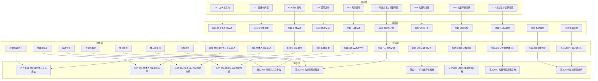
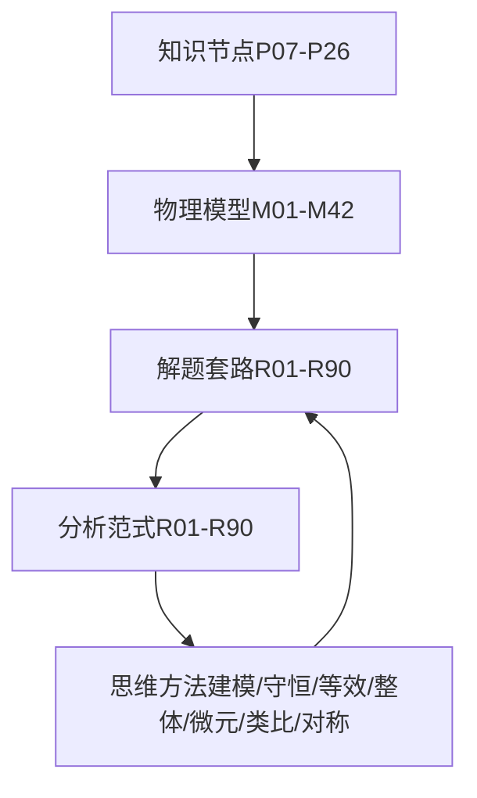
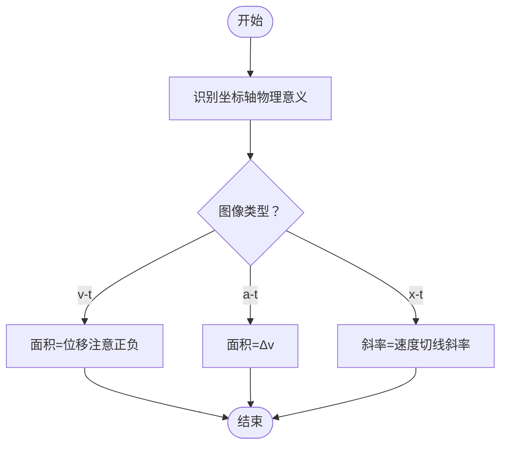
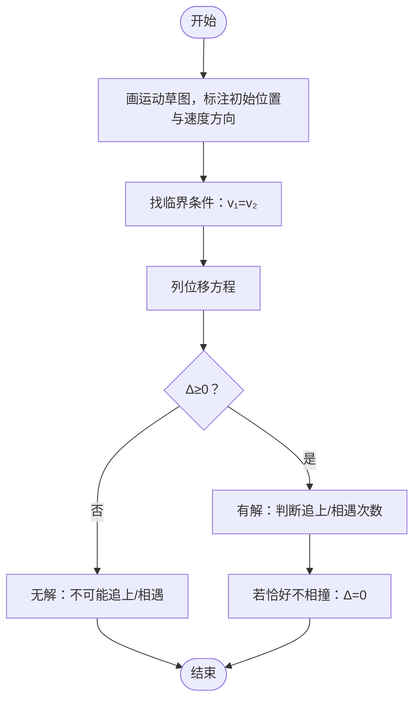
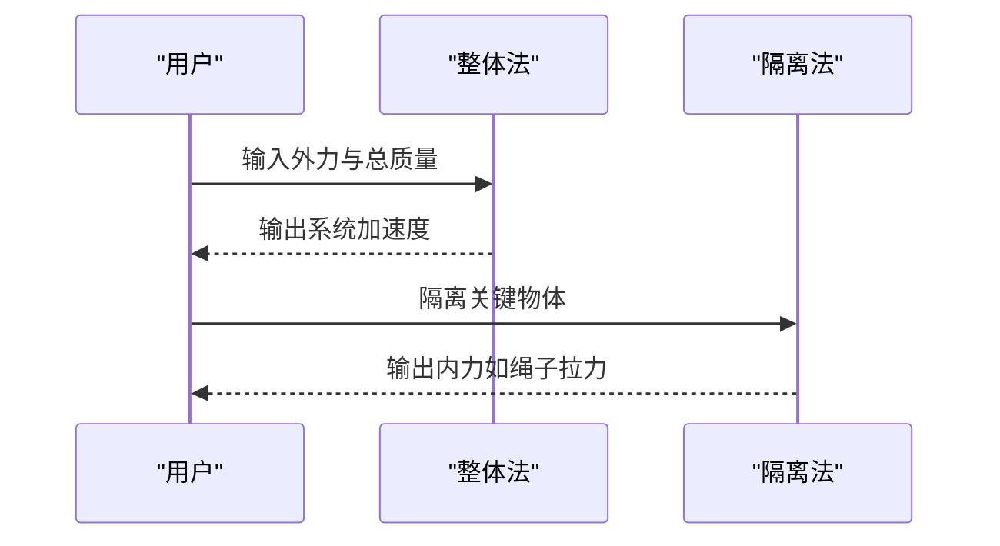
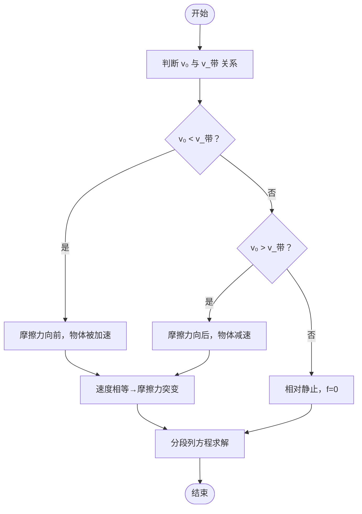
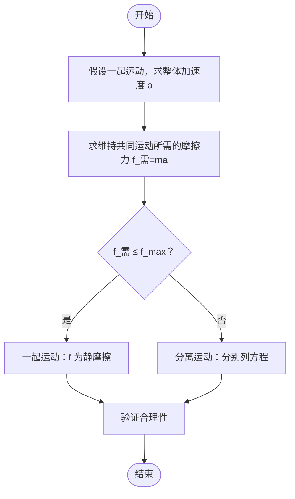
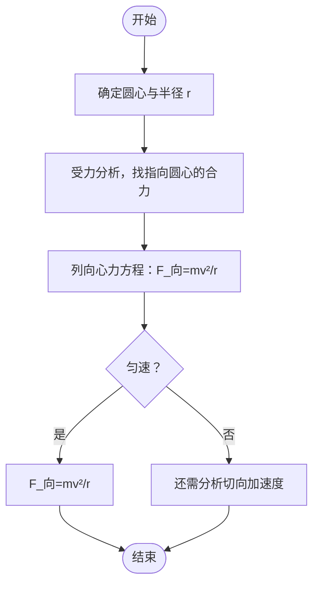
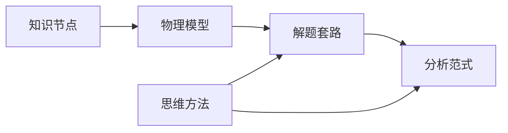

# 力学解题套路

<cite>
**本文档引用的文件**
- [物理解题套路库（R01-R90）](file://src/data/physics/strategies.ts)
- [分析范式库（R01-R90）](file://src/data/physics/paradigms.ts)
- [物理思维方法数据](file://src/data/physics/thinkingMethods.ts)
- [物理模型元数据](file://src/data/physics/physicsModels.ts)
- [力学常见力](file://docs/knowledge/physics/P07_力学常见力.md)
- [连接体问题](file://docs/knowledge/physics/P11_连接体问题.md)
- [抛体运动](file://docs/knowledge/physics/P14_抛体运动.md)
- [圆周运动](file://docs/knowledge/physics/P15_圆周运动.md)
- [天体运动](file://docs/knowledge/physics/P17_天体运动.md)
- [功能关系与能量守恒](file://docs/knowledge/physics/P23_功能关系与能量守恒.md)
- [动量与冲量](file://docs/knowledge/physics/P24_动量与冲量.md)
- [动量守恒定律](file://docs/knowledge/physics/P26_动量守恒定律.md)
- [多过程与临界极值](file://docs/knowledge/physics/P12_多过程与临界极值.md)
</cite>

## 目录
1. [引言](#引言)
2. [项目结构](#项目结构)
3. [核心组件](#核心组件)
4. [架构总览](#架构总览)
5. [详细组件分析](#详细组件分析)
6. [依赖分析](#依赖分析)
7. [性能考虑](#性能考虑)
8. [故障排除指南](#故障排除指南)
9. [结论](#结论)
10. [附录](#附录)

## 引言
本文件系统梳理星耀平台物理学科的力学解题套路，覆盖运动学图像分析、追击与相遇、连接体、传送带、弹簧、板块、圆周运动、万有引力、机械能守恒、动量定理、动量守恒、碰撞等核心主题。通过对“套路”“范式”“思维方法”“模型”“知识节点”的多维度整合，帮助学生建立“题型识别—受力/运动分析—解题步骤—技巧要点—易错防范”的完整思维框架。

## 项目结构
星耀平台的力学知识与解题体系由以下层次构成：
- 知识节点：对基础概念与规律进行系统化讲解（如P07、P11、P14、P15、P17、P23、P24、P26、P12）。
- 物理模型：对典型物理模型进行元数据管理（如M01~M42）。
- 解题套路（Routine）：以“题型+方法+步骤+陷阱”为核心的实战模板（R01~R90）。
- 分析范式（Paradigm）：将套路进一步抽象为“触发信号—思考路径—错因图谱—本质回溯”的分析框架。
- 思维方法：建模与理想化、守恒思想、等效替代、对称与极限、整体与隔离、微元与累积、类比推理等。

**图表来源**
- [物理模型元数据:22-65](file://src/data/physics/physicsModels.ts#L22-L65)
- [物理解题套路库（R01-R90）:19-1920](file://src/data/physics/strategies.ts#L19-L1920)
- [分析范式库（R01-R90）:56-800](file://src/data/physics/paradigms.ts#L56-L800)
- [物理思维方法数据:51-691](file://src/data/physics/thinkingMethods.ts#L51-L691)

**章节来源**
- [物理模型元数据:22-65](file://src/data/physics/physicsModels.ts#L22-L65)
- [物理解题套路库（R01-R90）:19-1920](file://src/data/physics/strategies.ts#L19-L1920)
- [分析范式库（R01-R90）:56-800](file://src/data/physics/paradigms.ts#L56-L800)
- [物理思维方法数据:51-691](file://src/data/physics/thinkingMethods.ts#L51-L691)

## 核心组件
- 解题套路（Routine）：以“题型识别—核心步骤—适用类型—易错点—记忆口诀—内容要点”为结构，覆盖运动学、力学、能量、动量等板块。
- 分析范式（Paradigm）：将套路抽象为“触发信号—思考路径—错因图谱—本质回溯”，便于迁移与诊断。
- 思维方法（Thinking Method）：提供建模、守恒、等效、整体隔离、微元、类比、对称等通用策略。
- 知识节点（Knowledge Node）：对基础概念进行系统讲解，提供公式、例题、分层变形与跨学科关联。
- 物理模型（Physics Model）：对典型模型进行元数据管理，便于检索与关联。

**章节来源**
- [物理解题套路库（R01-R90）:5-1920](file://src/data/physics/strategies.ts#L5-L1920)
- [分析范式库（R01-R90）:15-800](file://src/data/physics/paradigms.ts#L15-L800)
- [物理思维方法数据:4-691](file://src/data/physics/thinkingMethods.ts#L4-L691)
- [力学常见力:1-252](file://docs/knowledge/physics/P07_力学常见力.md#L1-L252)
- [连接体问题:1-248](file://docs/knowledge/physics/P11_连接体问题.md#L1-L248)
- [抛体运动:1-245](file://docs/knowledge/physics/P14_抛体运动.md#L1-L245)
- [圆周运动:1-253](file://docs/knowledge/physics/P15_圆周运动.md#L1-L253)
- [天体运动:1-248](file://docs/knowledge/physics/P17_天体运动.md#L1-L248)
- [功能关系与能量守恒:1-234](file://docs/knowledge/physics/P23_功能关系与能量守恒.md#L1-L234)
- [动量与冲量:1-242](file://docs/knowledge/physics/P24_动量与冲量.md#L1-L242)
- [动量守恒定律:1-225](file://docs/knowledge/physics/P26_动量守恒定律.md#L1-L225)
- [多过程与临界极值:1-219](file://docs/knowledge/physics/P12_多过程与临界极值.md#L1-L219)

## 架构总览
力学解题体系采用“知识—模型—套路—范式—思维”的五层架构：
- 知识层：提供基础概念与规律（如重力、弹力、摩擦力；连接体、抛体、圆周、天体、功能关系、动量等）。
- 模型层：对典型物理模型进行元数据管理，便于检索与跨板块映射。
- 套路层：以实战为导向的解题模板，强调“适用情境—核心步骤—技巧要点—易错防范”。
- 范式层：将套路抽象为“触发信号—思考路径—错因图谱—本质回溯”，提升迁移能力。
- 思维层：提供通用思维方法，贯穿各板块与题型。

**图表来源**
- [物理解题套路库（R01-R90）:19-1920](file://src/data/physics/strategies.ts#L19-L1920)
- [分析范式库（R01-R90）:56-800](file://src/data/physics/paradigms.ts#L56-L800)
- [物理思维方法数据:51-691](file://src/data/physics/thinkingMethods.ts#L51-L691)
- [物理模型元数据:22-65](file://src/data/physics/physicsModels.ts#L22-L65)

## 详细组件分析

### 运动学图像分析（R06 图像面积法）
- 适用情境：v-t 图求位移、a-t 图求速度变化、x-t 图求速度。
- 核心步骤：
  1) 明确坐标轴含义；
  2) v-t 图面积=位移（注意正负）；
  3) a-t 图面积=Δv；
  4) x-t 图斜率=速度（切线斜率）。
- 技巧要点：面积在 t 轴下方时位移为负；斜率是切线斜率，非割线。
- 易错防范：把 v-t 图纵坐标当位移；混淆 x-t 图斜率与加速度。

**图表来源**
- [物理解题套路库（R01-R90）:125-144](file://src/data/physics/strategies.ts#L125-L144)
- [分析范式库（R01-R90）:82-101](file://src/data/physics/paradigms.ts#L82-L101)

**章节来源**
- [物理解题套路库（R01-R90）:125-144](file://src/data/physics/strategies.ts#L125-L144)
- [分析范式库（R01-R90）:82-101](file://src/data/physics/paradigms.ts#L82-L101)

### 追及与相遇问题（R03 追及相遇临界分析）
- 适用情境：两物体速度相等时刻往往对应相距极值；恰好不相撞时位移差等于初始间距。
- 核心步骤：
  1) 画运动草图，标初始位置和速度方向；
  2) 找临界条件—两物体速度相等时（v₁=v₂）；
  3) 列位移方程：追及 x_追-x_被=初始间距；相遇 x₁+x₂=总间距；
  4) 讨论是否有解—Δ≥0 才有实际意义；
  5) 若恰好不相撞，临界条件 Δ=0。
- 技巧要点：速度相等常为极值点；注意初始间距与相对运动方向。
- 易错防范：混淆追及和相遇的位移关系；忘记两物体初始间距；不判断是否能追上。

**图表来源**
- [物理解题套路库（R01-R90）:65-83](file://src/data/physics/strategies.ts#L65-L83)
- [分析范式库（R01-R90）:146-164](file://src/data/physics/paradigms.ts#L146-L164)

**章节来源**
- [物理解题套路库（R01-R90）:65-83](file://src/data/physics/strategies.ts#L65-L83)
- [分析范式库（R01-R90）:146-164](file://src/data/physics/paradigms.ts#L146-L164)

### 连接体问题（R16 整体法与隔离法）
- 适用情境：系统无外力→整体有共同加速度；有外力→先整体法求加速度，隔离法求内力。
- 核心步骤：
  1) 先整体法：对整体列动力学方程 ΣF=Ma；
  2) 整体法不能求内力时，用隔离法；
  3) 隔离关键物体，列受力方程；
  4) 联立方程求解。
- 技巧要点：外力用整体，内力靠隔离；加速度一起算，内力单独求。
- 易错防范：整体法中把内力当外力；隔离时漏掉其他物体对它的力；加速度方向判断错误。

**图表来源**
- [物理解题套路库（R01-R90）:336-353](file://src/data/physics/strategies.ts#L336-L353)
- [分析范式库（R01-R90）:340-357](file://src/data/physics/paradigms.ts#L340-L357)

**章节来源**
- [物理解题套路库（R01-R90）:336-353](file://src/data/physics/strategies.ts#L336-L353)
- [分析范式库（R01-R90）:340-357](file://src/data/physics/paradigms.ts#L340-L357)
- [连接体问题:66-105](file://docs/knowledge/physics/P11_连接体问题.md#L66-L105)

### 传送带模型（R24 传送带模型）
- 适用情境：物体初速度与传送带速度的关系；速度相等的临界点。
- 核心步骤：
  1) 分析传送带运动方向和速度 v_带；
  2) 判断物体初速度 v₀ 与 v_带的关系；
  3) 计算滑动摩擦力方向和大小 f=μmg；
  4) 找速度相等时刻（临界点），此时摩擦力突变；
  5) 分段列运动方程，注意每段的初速度和加速度。
- 技巧要点：传送带问题的灵魂是找速度相等临界点；临界前后加速度不同。
- 易错防范：忽略速度相等后运动状态的改变；摩擦力方向判断错误；不分析临界条件就套公式。

**图表来源**
- [物理解题套路库（R01-R90）:500-518](file://src/data/physics/strategies.ts#L500-L518)
- [分析范式库（R01-R90）:381-399](file://src/data/physics/paradigms.ts#L381-L399)

**章节来源**
- [物理解题套路库（R01-R90）:500-518](file://src/data/physics/strategies.ts#L500-L518)
- [分析范式库（R01-R90）:381-399](file://src/data/physics/paradigms.ts#L381-L399)

### 板块模型（R25 板块模型）
- 适用情境：相对静止→共同加速度；相对滑动→分别列方程，找临界条件。
- 核心步骤：
  1) 假设接触面光滑，判断是否相对滑动；
  2) 比较最大静摩擦与所需摩擦力：f_max=μ_sN；
  3) 若 f_max≥所需力→共同加速度；
  4) 若 f_max<所需力→分离，分别列动力学方程；
  5) 找两物体加速度相等（若再次共速）或相对位移。
- 技巧要点：f_max 是判断临界的关键；先假设一起运动，再验证。
- 易错防范：混淆静摩擦和滑动摩擦的方向；不判断临界条件直接套公式。

**图表来源**
- [物理解题套路库（R01-R90）:521-539](file://src/data/physics/strategies.ts#L521-L539)
- [分析范式库（R01-R90）:408-420](file://src/data/physics/paradigms.ts#L408-L420)

**章节来源**
- [物理解题套路库（R01-R90）:521-539](file://src/data/physics/strategies.ts#L521-L539)
- [分析范式库（R01-R90）:408-420](file://src/data/physics/paradigms.ts#L408-L420)

### 弹簧模型（R17 弹簧的力与形变）
- 适用情境：弹簧平衡、弹簧振子、弹簧串并联。
- 核心步骤：
  1) 明确弹簧原长（自然状态）；
  2) 判断是伸长还是压缩；
  3) 计算形变量 x=|L-L₀|；
  4) 弹力 F=kx，方向沿弹簧轴线。
- 技巧要点：F=kx，x 是形变量（非长度）；串联并联公式；动态问题中加速度往往与弹力方向相反。
- 易错防范：把伸长量当弹簧长度；混淆压缩和伸长；忽略弹簧方向。

**章节来源**
- [物理解题套路库（R01-R90）:356-373](file://src/data/physics/strategies.ts#L356-L373)
- [力学常见力:71-115](file://docs/knowledge/physics/P07_力学常见力.md#L71-L115)

### 圆周运动（R36 圆周运动动力学）
- 适用情境：水平面圆周、竖直平面圆周（绳/杆）、圆锥摆。
- 核心步骤：
  1) 找圆心（弯曲方向指向的一侧）；
  2) 受力分析，列出指向圆心方向的合力；
  3) F_向=mv²/r=mω²r=m(4π²/T²)r；
  4) 判断是匀速还是变速圆周，选择合适公式。
- 技巧要点：向心力是效果力，由其他力提供；速度方向沿切线。
- 易错防范：把某个分力当向心力；竖直圆周最高点时弄错向心力来源。

**图表来源**
- [物理解题套路库（R01-R90）:752-769](file://src/data/physics/strategies.ts#L752-L769)
- [分析范式库（R01-R90）:467-483](file://src/data/physics/paradigms.ts#L467-L483)

**章节来源**
- [物理解题套路库（R01-R90）:752-769](file://src/data/physics/strategies.ts#L752-L769)
- [分析范式库（R01-R90）:467-483](file://src/data/physics/paradigms.ts#L467-L483)
- [圆周运动:68-107](file://docs/knowledge/physics/P15_圆周运动.md#L68-L107)

### 万有引力（R38 万有引力定律）
- 适用情境：近地卫星、远地卫星、同步卫星、双星系统、变轨问题。
- 核心步骤：
  1) 明确两个物体，r 是质心间距；
  2) 地面附近：r≈R_地，F≈mg → GM=gR²（黄金代换）；
  3) 环绕问题：F=GMm/r²=mg'=mv²/r=mω²r=m(4π²/T²)r；
  4) 根据已知量选用合适公式。
- 技巧要点：万有引力提供向心力；近地用黄金代换；同步卫星轨道高度与周期固定。
- 易错防范：把近地卫星和同步卫星混用同一公式；把“卫星在轨道上”当成不受重力。

**章节来源**
- [物理解题套路库（R01-R90）:792-800](file://src/data/physics/strategies.ts#L792-L800)
- [分析范式库（R01-R90）:487-504](file://src/data/physics/paradigms.ts#L487-L504)
- [天体运动:68-106](file://docs/knowledge/physics/P17_天体运动.md#L68-L106)

### 机械能守恒（R37 机械能守恒判断）
- 适用情境：只有重力/弹力做功的系统。
- 核心步骤：
  1) 明确研究对象（单个物体还是系统）；
  2) 检查是否只有重力、弹力做功（内外部都算）；
  3) 若有摩擦力、空气阻力、非弹性碰撞 → 机械能不守恒；
  4) 守恒时写 E₁ = E₂ 或 ΔEk = -ΔEp，标好初末状态高度和速度。
- 技巧要点：机械能守恒的条件是“只有重力/弹力做功”；判断守恒优先于列方程。
- 易错防范：认为“有摩擦力机械能一定不守恒”（若摩擦力不做功则仍守恒）；把“机械能守恒”和“动量守恒”混用。

**章节来源**
- [物理解题套路库（R01-R90）:638-655](file://src/data/physics/strategies.ts#L638-L655)
- [分析范式库（R01-R90）:639-655](file://src/data/physics/paradigms.ts#L639-L655)
- [功能关系与能量守恒:62-93](file://docs/knowledge/physics/P23_功能关系与能量守恒.md#L62-L93)

### 动量定理（R35 动能定理全程法）
- 适用情境：变质量问题、流体问题、连续作用问题，求冲击力或平均力。
- 核心步骤：
  1) 明确研究对象（流体元、粒子团）；
  2) 列动量定理：F·Δt = Δp = p末 - p初；
  3) 处理连续流体：取一段时间 Δt 内的流体元质量 Δm = ρ·v·S·Δt；
  4) 代入求平均力 F = Δm·Δv/Δt，注意方向。
- 技巧要点：变质量问题的关键是“选取正确的系统”——取一段时间内进入/离开的流体元。
- 易错防范：把 Δm 当成总质量而非单位时间内流过的质量；在有重力时，混淆动量定理和动量守恒的适用条件。

**章节来源**
- [分析范式库（R01-R90）:783-797](file://src/data/physics/paradigms.ts#L783-L797)
- [功能关系与能量守恒:76-93](file://docs/knowledge/physics/P23_功能关系与能量守恒.md#L76-L93)

### 动量守恒（R40 动量守恒定律应用）
- 适用情境：系统所受合外力为零，总动量不变。
- 核心步骤：
  1) 判断系统所受合外力为零；
  2) 列动量守恒方程：m₁v₁ + m₂v₂ = m₁v₁' + m₂v₂'；
  3) 联立方程求解未知量。
- 技巧要点：内力不影响总动量；外力为零是条件；注意矢量方向。
- 易错防范：把动量守恒和机械能守恒混淆；忽略外力分析。

**章节来源**
- [动量守恒定律:61-91](file://docs/knowledge/physics/P26_动量守恒定律.md#L61-L91)
- [分析范式库（R01-R90）:763-781](file://src/data/physics/paradigms.ts#L763-L781)

### 碰撞模型（R41 碰撞模型分析）
- 适用情境：弹性碰撞、非弹性碰撞、完全非弹性碰撞。
- 核心步骤：
  1) 判断碰撞类型：弹性碰撞（ΔEk=0）；非弹性（ΔEk<0）；完全非弹性（共速）；
  2) 完全非弹性 → 动量守恒直接求 v共；
  3) 弹性碰撞 → 动量守恒 + 动能守恒，联立两方程；
  4) 验证合理性：碰撞后相对速度方向应与碰撞前相反。
- 技巧要点：弹性碰撞的判定是 ΔEk=0，不是“碰后不粘”那么简单。
- 易错防范：把“非弹性碰撞”当成“完全非弹性碰撞”；弹性碰撞直接套公式不验证。

**章节来源**
- [分析范式库（R01-R90）:742-760](file://src/data/physics/paradigms.ts#L742-L760)
- [动量守恒定律:162-170](file://docs/knowledge/physics/P26_动量守恒定律.md#L162-L170)

### 多过程与临界极值（R12 临界问题处理）
- 适用情境：复杂过程的分段分析与临界条件判断。
- 核心步骤：
  1) 识别转折点：速度变号（v=0）、力变方向（临界力）、加速度变号（a=0）；
  2) 分段原则：转折点即分段点，每段用不同的方程；
  3) 临界条件：a=0（极速条件）、N=0（脱离条件）、v=0（折返条件）。
- 技巧要点：找转折点是关键；分段后逐段求解。
- 易错防范：过程分不清；忽略临界条件。

**章节来源**
- [多过程与临界极值:59-88](file://docs/knowledge/physics/P12_多过程与临界极值.md#L59-L88)
- [分析范式库（R01-R90）:569-587](file://src/data/physics/paradigms.ts#L569-L587)

## 依赖分析
- 知识节点与模型：知识节点为模型提供概念基础，模型为套路提供结构化载体。
- 套路与范式：套路是范式的具体化，范式是套路的抽象化。
- 思维方法贯穿：建模与理想化、守恒思想、等效替代、整体与隔离、微元与累积、类比推理、对称与极限，为各套路提供通用策略。

**图表来源**
- [物理解题套路库（R01-R90）:19-1920](file://src/data/physics/strategies.ts#L19-L1920)
- [分析范式库（R01-R90）:56-800](file://src/data/physics/paradigms.ts#L56-L800)
- [物理思维方法数据:51-691](file://src/data/physics/thinkingMethods.ts#L51-L691)

**章节来源**
- [物理解题套路库（R01-R90）:19-1920](file://src/data/physics/strategies.ts#L19-L1920)
- [分析范式库（R01-R90）:56-800](file://src/data/physics/paradigms.ts#L56-L800)
- [物理思维方法数据:51-691](file://src/data/physics/thinkingMethods.ts#L51-L691)

## 性能考虑
- 数据结构优化：Routine 与 Paradigm 采用统一接口，便于前端渲染与检索。
- 思维方法模块化：将通用策略抽离为独立模块，提高复用性与可维护性。
- 模型与套路解耦：通过 modelId 关联模型与套路，降低耦合度，便于扩展。

## 故障排除指南
- 常见错误类型与纠正路径：
  - 公式误用：对照“易错防范”与“本质回溯”，确认适用条件。
  - 步骤遗漏：对照“核心步骤”，逐项检查。
  - 思维偏差：对照“思维方法”，调整分析视角。
- 诊断流程：
  1) 题型识别（触发信号）→ 2) 选择套路/范式 → 3) 执行步骤 → 4) 校验与反思（本质回溯）。

**章节来源**
- [分析范式库（R01-R90）:24-54](file://src/data/physics/paradigms.ts#L24-L54)
- [物理思维方法数据:171-175](file://src/data/physics/thinkingMethods.ts#L171-L175)

## 结论
星耀平台的力学解题体系以“知识—模型—套路—范式—思维”五层架构为核心，既保证了知识点的系统性，又提供了可迁移的解题模板与思维策略。通过将具体题型与通用方法相结合，学生能够建立从“题型识别—受力/运动分析—解题步骤—技巧要点—易错防范”的完整思维框架，有效提升解题效率与准确性。

## 附录
- 相关模型索引：M01、M05、M06、M07、M08、M11、M12、M13、M16、M17、M18。
- 相关范式索引：R01、R16、R24、R25、R36、R38、R35、R37、R39、R40、R41。
- 相关思维方法：建模与理想化、守恒思想、等效替代、整体与隔离、微元与累积、类比推理、对称与极限。

**章节来源**
- [物理模型元数据:22-65](file://src/data/physics/physicsModels.ts#L22-L65)
- [分析范式库（R01-R90）:56-800](file://src/data/physics/paradigms.ts#L56-L800)
- [物理思维方法数据:51-691](file://src/data/physics/thinkingMethods.ts#L51-L691)