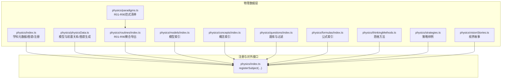
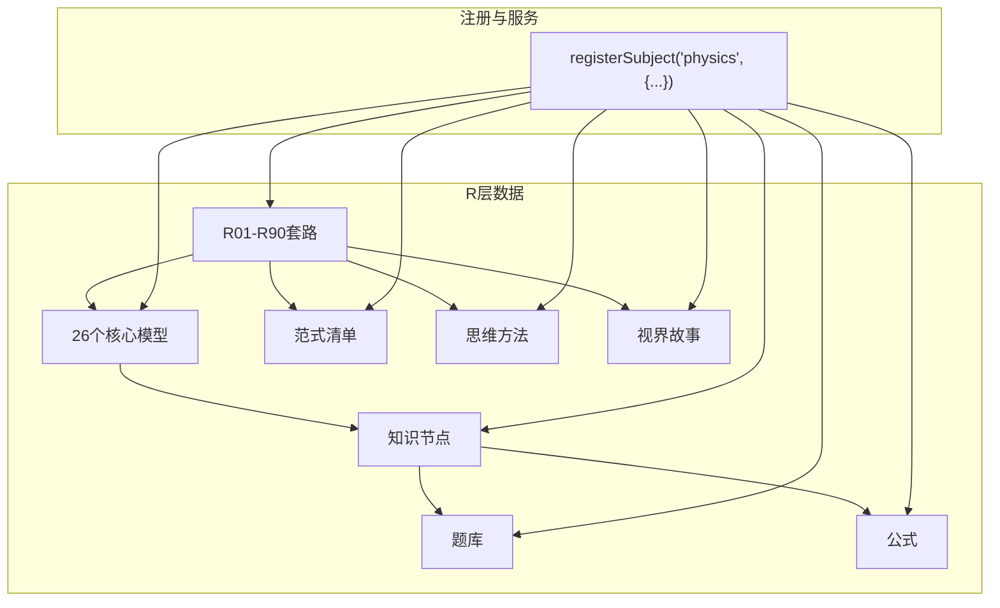
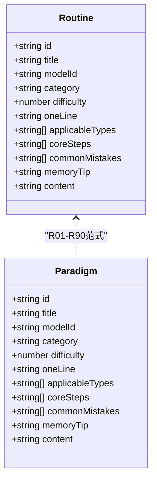
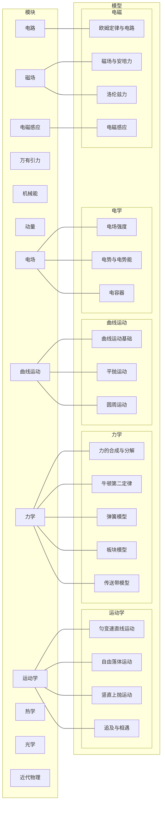
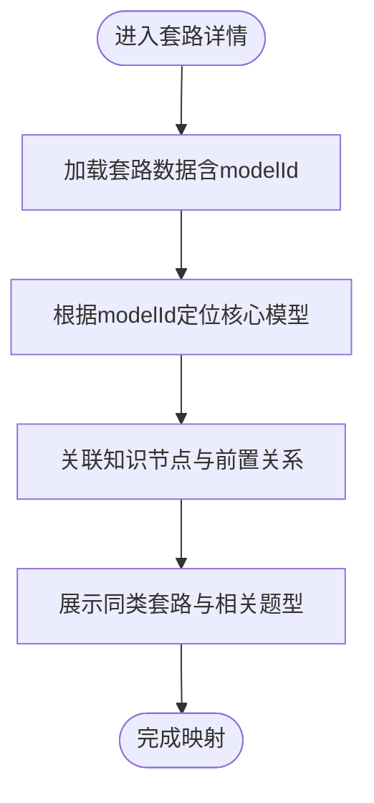
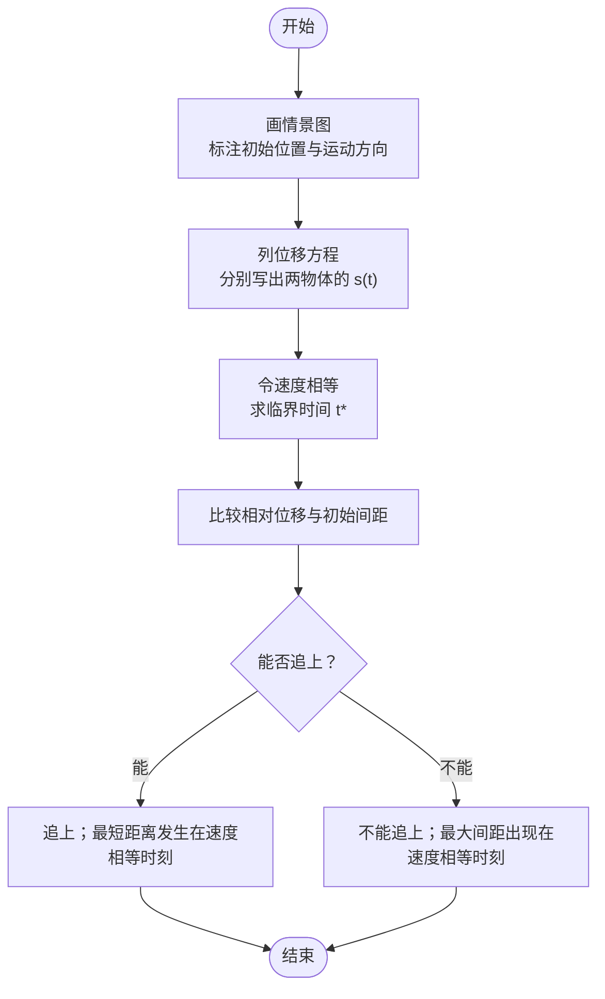
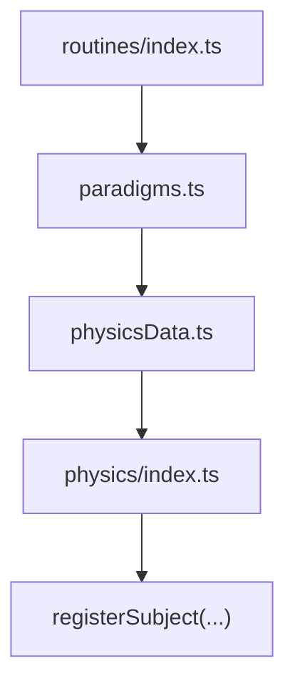

# 物理解题套路（R层）

<cite>
**本文引用的文件**
- [src/data/physics/index.ts](file://src/data/physics/index.ts)
- [src/data/physics/physicsData.ts](file://src/data/physics/physicsData.ts)
- [src/data/physics/paradigms.ts](file://src/data/physics/paradigms.ts)
- [src/data/physics/routines/index.ts](file://src/data/physics/routines/index.ts)
- [src/data/physics/models/index.ts](file://src/data/physics/models/index.ts)
- [src/data/physics/concepts/index.ts](file://src/data/physics/concepts/index.ts)
- [src/data/physics/questions/index.ts](file://src/data/physics/questions/index.ts)
- [src/data/physics/formulas/index.ts](file://src/data/physics/formulas/index.ts)
- [src/data/physics/thinkingMethods.ts](file://src/data/physics/thinkingMethods.ts)
- [src/data/physics/strategies.ts](file://src/data/physics/strategies.ts)
- [src/data/physics/visionStories.ts](file://src/data/physics/visionStories.ts)
</cite>

## 目录
1. [引言](#引言)
2. [项目结构](#项目结构)
3. [核心组件](#核心组件)
4. [架构总览](#架构总览)
5. [详细组件分析](#详细组件分析)
6. [依赖分析](#依赖分析)
7. [性能考虑](#性能考虑)
8. [故障排查指南](#故障排查指南)
9. [结论](#结论)
10. [附录](#附录)

## 引言
本文件面向“星耀平台物理学科”的“解题套路（R层）”建设目标，系统梳理并文档化90个物理解题套路的设计理念、组织结构与实施路径。文档以“R01-R90”为主线，覆盖运动学图像分析、追击与相遇、连接体、传送带、弹簧、板块、圆周运动、万有引力、机械能守恒、动量定理与守恒、电场强度、电势与电势能、电容器、欧姆定律与电路、磁场与安培力、洛伦兹力、电磁感应、交变电流、理想变压器、分子动理论、气体状态方程、热力学第一定律、热力学第二定律、光的折射与全反射、透镜成像、干涉与衍射、机械振动、机械波、波的干涉与衍射、光电效应与波粒二象性、原子结构、核反应与核能等主题。

文档旨在帮助教师与学习者：
- 明确每个套路的适用类型、核心思想、解题步骤与技巧要点；
- 理解套路与知识节点、核心模型的关联关系；
- 通过系统化的套路提升解题效率与迁移能力；
- 提供典型示例与常见错误分析，强化诊断与改进。

## 项目结构
物理R层数据在前端代码中采用“主题域 + 数据层 + 组件层”的分层组织方式：
- 主题域：src/data/physics 下按“概念、模型、套路、题目、公式、范式、思维方法、视界故事”等维度组织；
- 数据层：index.ts 汇总导出物理学科的元数据、图谱、过滤器、统计等；
- 组件层：sections 与 components 展示与交互。

图表来源
- [src/data/physics/index.ts:383-431](file://src/data/physics/index.ts#L383-L431)
- [src/data/physics/physicsData.ts:80-120](file://src/data/physics/physicsData.ts#L80-L120)
- [src/data/physics/paradigms.ts:1-60](file://src/data/physics/paradigms.ts#L1-L60)
- [src/data/physics/routines/index.ts:1-279](file://src/data/physics/routines/index.ts#L1-L279)

章节来源
- [src/data/physics/index.ts:19-76](file://src/data/physics/index.ts#L19-L76)
- [src/data/physics/physicsData.ts:4-120](file://src/data/physics/physicsData.ts#L4-L120)
- [src/data/physics/paradigms.ts:1-60](file://src/data/physics/paradigms.ts#L1-L60)
- [src/data/physics/routines/index.ts:1-279](file://src/data/physics/routines/index.ts#L1-L279)

## 核心组件
- 物理学科元数据与模块划分：定义力学、机械振动与机械波、热学、电学、磁学、光学、原子物理等模块与章节，形成知识地图。
- 物理模型体系：26个核心模型（如匀变速直线运动、圆周运动、电容器、电磁感应等）及其模块归属与难度等级。
- 物理解题套路（R01-R90）：系统化范式，覆盖适用类型、核心思想、步骤、技巧与常见错误，并与知识节点、模型建立映射。
- 认知图谱与前置关系：基于模型与知识点的依赖关系，生成可导航的学习路径。
- 题库与公式：配套题库与公式索引，支撑“以题带法、以法带题”。

章节来源
- [src/data/physics/index.ts:19-76](file://src/data/physics/index.ts#L19-L76)
- [src/data/physics/physicsData.ts:4-120](file://src/data/physics/physicsData.ts#L4-L120)
- [src/data/physics/paradigms.ts:1-60](file://src/data/physics/paradigms.ts#L1-L60)
- [src/data/physics/routines/index.ts:1-279](file://src/data/physics/routines/index.ts#L1-L279)

## 架构总览
R层的总体架构围绕“套路—模型—知识—题库—公式—范式—思维方法—视界故事”的闭环展开，通过 registerSubject 对外暴露统一接口，支持页面按需加载与动态渲染。

图表来源
- [src/data/physics/index.ts:383-431](file://src/data/physics/index.ts#L383-L431)
- [src/data/physics/physicsData.ts:80-120](file://src/data/physics/physicsData.ts#L80-L120)
- [src/data/physics/paradigms.ts:1-60](file://src/data/physics/paradigms.ts#L1-L60)
- [src/data/physics/routines/index.ts:1-279](file://src/data/physics/routines/index.ts#L1-L279)

## 详细组件分析

### 组件A：R01-R90套路体系
- 设计理念：以“适用类型—核心思想—解题步骤—技巧要点—常见错误—关联知识/模型”为主线，形成可迁移的解题范式。
- 组织结构：按主题域分组（运动学、力学、曲线运动、万有引力、机械能、动量、电场、电路、磁场、电磁感应、热学、光学、近代物理等），每类下再细分具体套路。
- 关联关系：每个套路标注 modelId（指向核心模型）、relatedKnowledge（知识节点）、relatedStrategies（同类套路）等，便于交叉检索与路径导航。

图表来源
- [src/data/physics/paradigms.ts:15-20](file://src/data/physics/paradigms.ts#L15-L20)
- [src/data/physics/paradigms.ts:60-120](file://src/data/physics/paradigms.ts#L60-L120)

章节来源
- [src/data/physics/paradigms.ts:1-60](file://src/data/physics/paradigms.ts#L1-L60)
- [src/data/physics/routines/index.ts:1-279](file://src/data/physics/routines/index.ts#L1-L279)

### 组件B：核心模型与前置关系
- 模型清单：26个核心模型覆盖运动学、力学、曲线运动、万有引力、机械能、动量、电场、电路、磁场、电磁感应、热学、光学、近代物理等。
- 前置关系：通过 prerequisiteEdges 定义模型间的依赖顺序，确保学习与应用的逻辑连贯性。
- 认知图谱：generatePhysicsGraphData 将模块、模型、前置关系转化为可渲染的图数据，支持路径规划与可视化。

图表来源
- [src/data/physics/physicsData.ts:4-120](file://src/data/physics/physicsData.ts#L4-L120)

章节来源
- [src/data/physics/physicsData.ts:4-120](file://src/data/physics/physicsData.ts#L4-L120)

### 组件C：套路与知识/模型的映射
- 关联方式：每个套路通过 modelId 与核心模型关联，同时在 content 中体现与知识节点的对应关系，便于“以法带题、以题促法”。
- 应用价值：通过映射实现“题—法—模—知”的双向检索，支持个性化学习路径推荐与错题回看。

图表来源
- [src/data/physics/routines/index.ts:1-279](file://src/data/physics/routines/index.ts#L1-L279)
- [src/data/physics/physicsData.ts:4-120](file://src/data/physics/physicsData.ts#L4-L120)

章节来源
- [src/data/physics/routines/index.ts:1-279](file://src/data/physics/routines/index.ts#L1-L279)
- [src/data/physics/physicsData.ts:4-120](file://src/data/physics/physicsData.ts#L4-L120)

### 组件D：典型套路流程（以追及与相遇为例）

图表来源
- [src/data/physics/paradigms.ts:60-120](file://src/data/physics/paradigms.ts#L60-L120)

章节来源
- [src/data/physics/paradigms.ts:60-120](file://src/data/physics/paradigms.ts#L60-L120)

### 组件E：套路与题库的结合
- 题目标签：题库按“模块—知识点—难度—类型”组织，套路可与题型标签匹配，实现“题—法—模—知”的闭环。
- 过滤与统计：提供难度、类型、目标等过滤选项，支持按套路筛选题目，辅助练习与测评。

章节来源
- [src/data/physics/questions/index.ts:1-200](file://src/data/physics/questions/index.ts#L1-L200)

## 依赖分析
- 组件耦合：routines/index.ts 聚合 R01-R90，paradigms.ts 提供范式清单，physicsData.ts 提供模型与前置关系，index.ts 注册对外接口，四者协同构成R层数据主干。
- 外部依赖：registerSubject 将物理数据注册为“subject”，供页面按需调用；图谱生成函数 generatePhysicsGraphData 为前端渲染提供数据基础。
- 循环依赖：当前文件组织清晰，未见循环导入；建议后续扩展时保持“数据层→注册层→组件层”的单向依赖。

图表来源
- [src/data/physics/routines/index.ts:1-279](file://src/data/physics/routines/index.ts#L1-L279)
- [src/data/physics/paradigms.ts:1-60](file://src/data/physics/paradigms.ts#L1-L60)
- [src/data/physics/physicsData.ts:80-120](file://src/data/physics/physicsData.ts#L80-L120)
- [src/data/physics/index.ts:383-431](file://src/data/physics/index.ts#L383-L431)

章节来源
- [src/data/physics/routines/index.ts:1-279](file://src/data/physics/routines/index.ts#L1-L279)
- [src/data/physics/paradigms.ts:1-60](file://src/data/physics/paradigms.ts#L1-L60)
- [src/data/physics/physicsData.ts:80-120](file://src/data/physics/physicsData.ts#L80-L120)
- [src/data/physics/index.ts:383-431](file://src/data/physics/index.ts#L383-L431)

## 性能考虑
- 数据懒加载：通过 registerSubject 暴露按需获取接口，避免一次性加载全部R01-R90数据；
- 图谱缓存：generatePhysicsGraphData 结果可缓存至内存，减少重复计算；
- 前端渲染优化：使用虚拟列表与分页展示大量套路与题库，降低首屏压力；
- 搜索与过滤：对题库与套路进行索引化与分片存储，提升检索效率。

## 故障排查指南
- 套路缺失：确认 routines/index.ts 是否包含目标套路文件，paradigms.ts 是否声明对应范式；
- 模型映射错误：核对 physicsData.ts 中 modelId 与 routines 中的 modelId 是否一致；
- 图谱异常：检查 generatePhysicsGraphData 的 edges 是否包含合法的前置关系；
- 页面无法渲染：确认 registerSubject 已正确注册物理学科数据，且前端路由已接入相应页面组件。

章节来源
- [src/data/physics/routines/index.ts:1-279](file://src/data/physics/routines/index.ts#L1-L279)
- [src/data/physics/physicsData.ts:80-120](file://src/data/physics/physicsData.ts#L80-L120)
- [src/data/physics/index.ts:383-431](file://src/data/physics/index.ts#L383-L431)

## 结论
R层以“套路—模型—知识—题库—公式—范式—思维方法—视界故事”为核心，构建了可迁移、可评测、可可视化的物理解题体系。通过系统化的90个套路与26个核心模型，配合认知图谱与题库过滤，能够有效提升学习者的解题效率与迁移能力。建议在后续迭代中持续完善题库与范式的数量与质量，强化“以法带题”的闭环训练。

## 附录
- 术语说明
  - 套路（R范式）：针对特定题型或情境的标准化解题流程与策略；
  - 核心模型：承载物理现象与规律的典型模型，如“圆周运动”“电容器”等；
  - 认知图谱：由模块、模型、知识节点与前置关系构成的可导航学习路径；
  - 范式清单：R01-R90套路的聚合导出，便于统一管理与检索。