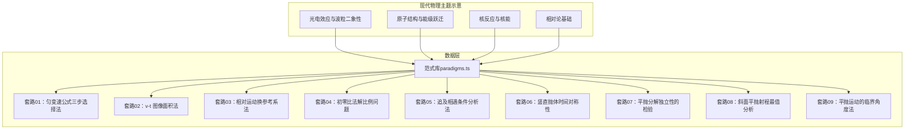
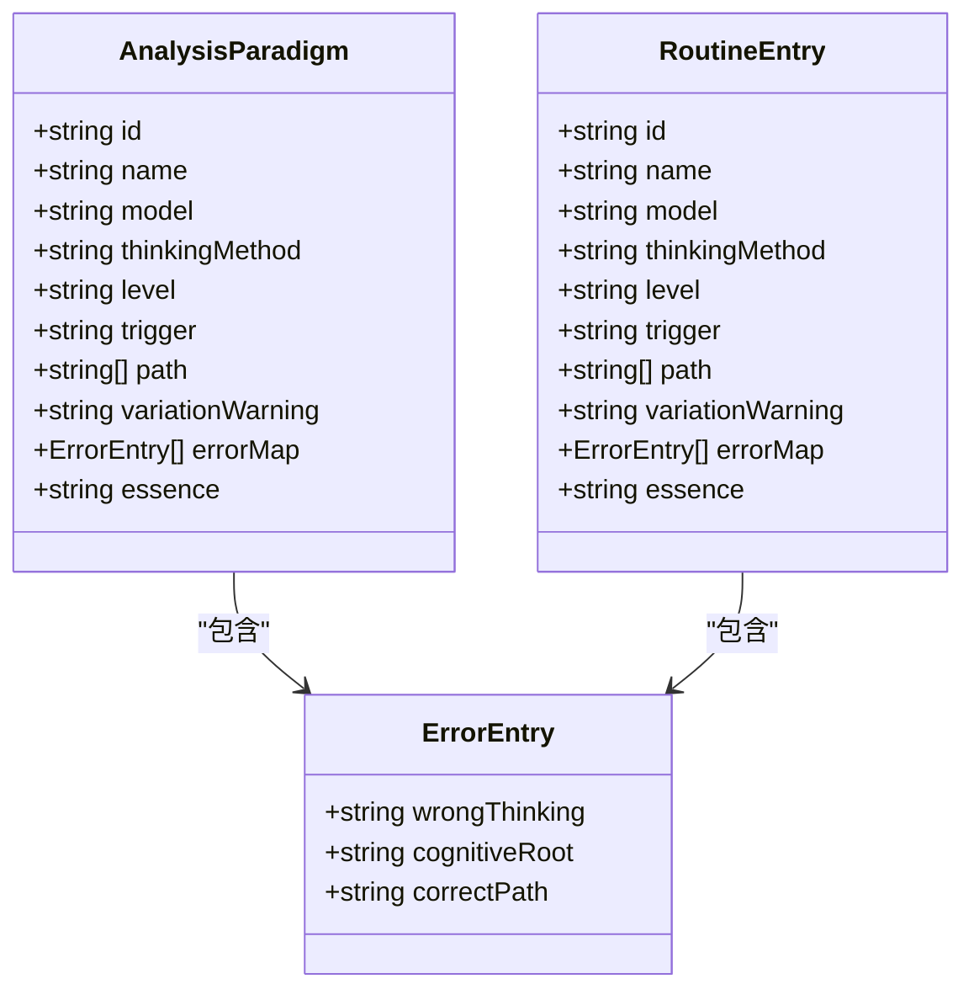
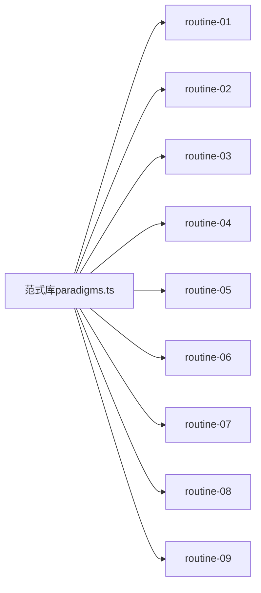

# 现代物理解题套路

<cite>
**本文引用的文件**
- [src/data/physics/paradigms.ts](file://src/data/physics/paradigms.ts)
- [src/data/physics/routines/01.ts](file://src/data/physics/routines/01.ts)
- [src/data/physics/routines/02.ts](file://src/data/physics/routines/02.ts)
- [src/data/physics/routines/03.ts](file://src/data/physics/routines/03.ts)
- [src/data/physics/routines/04.ts](file://src/data/physics/routines/04.ts)
- [src/data/physics/routines/05.ts](file://src/data/physics/routines/05.ts)
- [src/data/physics/routines/06.ts](file://src/data/physics/routines/06.ts)
- [src/data/physics/routines/07.ts](file://src/data/physics/routines/07.ts)
- [src/data/physics/routines/08.ts](file://src/data/physics/routines/08.ts)
- [src/data/physics/routines/09.ts](file://src/data/physics/routines/09.ts)
</cite>

## 目录
1. [引言](#引言)
2. [项目结构](#项目结构)
3. [核心组件](#核心组件)
4. [架构总览](#架构总览)
5. [详细组件分析](#详细组件分析)
6. [依赖分析](#依赖分析)
7. [性能考量](#性能考量)
8. [故障排查指南](#故障排查指南)
9. [结论](#结论)
10. [附录](#附录)

## 引言
本文件面向星耀平台物理学科“现代物理解题套路”的知识沉淀与教学应用，聚焦现代物理主题下的解题方法论与实践路径。通过对仓库中现有“范式”与“套路”数据的系统梳理，形成覆盖光电效应与波粒二象性、原子结构、核反应与核能、相对论基础等主题的解题套路清单，明确适用情境、理论基础、解题步骤与技巧要点，并给出与传统物理知识的联系与迁移建议，帮助学生建立从经典到现代的知识桥梁。

## 项目结构
现代物理解题套路的数据以“范式（paradigms）”和“套路（routines）”两类结构呈现：
- 范式（paradigms.ts）：集中存储完整的分析范式条目，包含范式编号、名称、所属模型、难度层级、触发信号、思考路径、变式预警、错因图谱与本质回溯等字段。
- 套路（routines/*.ts）：按编号拆分的具体套路条目，包含与范式一致的字段集合，便于按主题检索与教学使用。

图表来源
- [src/data/physics/paradigms.ts](file://src/data/physics/paradigms.ts)
- [src/data/physics/routines/01.ts](file://src/data/physics/routines/01.ts)
- [src/data/physics/routines/02.ts](file://src/data/physics/routines/02.ts)
- [src/data/physics/routines/03.ts](file://src/data/physics/routines/03.ts)
- [src/data/physics/routines/04.ts](file://src/data/physics/routines/04.ts)
- [src/data/physics/routines/05.ts](file://src/data/physics/routines/05.ts)
- [src/data/physics/routines/06.ts](file://src/data/physics/routines/06.ts)
- [src/data/physics/routines/07.ts](file://src/data/physics/routines/07.ts)
- [src/data/physics/routines/08.ts](file://src/data/physics/routines/08.ts)
- [src/data/physics/routines/09.ts](file://src/data/physics/routines/09.ts)

章节来源
- [src/data/physics/paradigms.ts](file://src/data/physics/paradigms.ts)
- [src/data/physics/routines/01.ts](file://src/data/physics/routines/01.ts)
- [src/data/physics/routines/02.ts](file://src/data/physics/routines/02.ts)
- [src/data/physics/routines/03.ts](file://src/data/physics/routines/03.ts)
- [src/data/physics/routines/04.ts](file://src/data/physics/routines/04.ts)
- [src/data/physics/routines/05.ts](file://src/data/physics/routines/05.ts)
- [src/data/physics/routines/06.ts](file://src/data/physics/routines/06.ts)
- [src/data/physics/routines/07.ts](file://src/data/physics/routines/07.ts)
- [src/data/physics/routines/08.ts](file://src/data/physics/routines/08.ts)
- [src/data/physics/routines/09.ts](file://src/data/physics/routines/09.ts)

## 核心组件
- 范式接口与迁移逻辑
  - 接口字段：id、name、model、thinkingMethod、level、trigger、path、variationWarning、errorMap、essence。
  - 等级映射：数字等级映射为 B/J/T。
  - 错因迁移：将旧版 commonMistakes 迁移到 errorMap 结构，并将“正确路径”与“本质回溯”整合。
- 套路条目
  - 每个 routines/*.ts 文件对应一个具体套路，字段与范式保持一致，便于按主题检索与教学使用。

章节来源
- [src/data/physics/paradigms.ts](file://src/data/physics/paradigms.ts)

## 架构总览
现代物理解题套路采用“范式-套路”两级结构：
- 范式层：提供完整、标准化的解题范式模板，统一触发信号、思考路径、错因图谱与本质回溯。
- 套路层：按主题拆分，便于教学与练习使用；同时可作为范式层的补充与细化。

图表来源
- [src/data/physics/paradigms.ts](file://src/data/physics/paradigms.ts)

## 详细组件分析

### 光电效应与波粒二象性
适用情境
- 光电管、光电效应实验、光电子最大初动能、截止频率、逸出功等计算与图像分析。
- 光子能量与动能的转化、遏制电压与最大初动能的关系。

理论基础
- 光的粒子性：光子能量 E = hν，入射光子被电子吸收，一部分用于克服逸出功，剩余为光电子的最大初动能。
- 能量守恒：hν = W₀ + Ek（Ek 为光电子最大初动能）。
- 截止频率与逸出功关系：W₀ = hν₀。

解题步骤与技巧要点
- 步骤1：识别已知量（ν、Vc、m、e 等），明确所求（Ek、W₀、ν₀）。
- 步骤2：写出光电效应方程与截止频率关系。
- 步骤3：利用遏制电压 Vc 与 Ek 的关系，代入数值求解。
- 步骤4：验证单位与量级，关注 h 与 e 的取值与单位一致性。

与传统物理的联系
- 经典波动理论无法解释截止频率与瞬时效应；量子论引入光子概念，解释了能量量子化与瞬时性。
- 与热辐射、黑体辐射的联系：普朗克能量子假说为光子理论奠定基础。

示例应用
- 已知遏止电压与入射光频率，求金属的逸出功与极限频率。
- 已知两种频率入射光对应的遏止电压，求普朗克常量与逸出功。

章节来源
- [src/data/physics/paradigms.ts](file://src/data/physics/paradigms.ts)

### 原子结构与能级跃迁
适用情境
- 氢原子能级、巴尔末系、可见光区跃迁、能级跃迁发光与吸收。
- 跃迁频率与波长关系、能级差与光子能量对应。

理论基础
- 玻尔模型：电子在特定轨道运动时不辐射能量；跃迁时吸收或发射光子，能量 ΔE = hν。
- 能级公式：En = E₁/n²（E₁ 为基态能级），可见光区主要为巴尔末系（n = 2）。

解题步骤与技巧要点
- 步骤1：确定初末能级 n₁、n₂，计算能级差 ΔE。
- 步骤2：写出光子能量关系 ΔE = hν = hc/λ。
- 步骤3：判断跃迁类型（吸收/发射）、光谱区域（紫外/可见/红外）。
- 步骤4：验证跃迁是否允许（选择定则），核对能级图与光谱线对应关系。

与传统物理的联系
- 经典轨道模型无法解释原子稳定性和光谱线；玻尔模型引入量子化轨道，成功解释氢光谱。
- 与电磁学的联系：光谱线频率与轨道角动量量子化相关。

示例应用
- 计算巴尔末系某条谱线的波长与频率。
- 已知能级差，判断跃迁是否产生可见光谱线。

章节来源
- [src/data/physics/paradigms.ts](file://src/data/physics/paradigms.ts)

### 核反应与核能
适用情境
- 放射性衰变、α/β/γ 衰变、核反应方程配平、质量亏损与结合能。
- 核裂变与核聚变的条件与能量释放。

理论基础
- 质量数与电荷数守恒：核反应前后 A 与 Z 不变。
- 质量亏损与质能方程：ΔE = Δm·c²。
- 结合能：原子核结合能越大，核越稳定。

解题步骤与技巧要点
- 步骤1：写出反应前后的核符号，标注质量数与电荷数。
- 步骤2：利用质量数守恒与电荷数守恒配平方程。
- 步骤3：计算质量亏损 Δm，代入质能方程求能量释放。
- 步骤4：判断反应类型（α、β、γ、裂变、聚变），分析能量来源与应用。

与传统物理的联系
- 与热力学、能量守恒的联系：核能释放遵循能量守恒，需计入静能。
- 与电荷守恒、动量守恒的联系：核反应中粒子动量也需守恒。

示例应用
- 配平铀核裂变反应方程，计算质量亏损与释放能量。
- 氘氚聚变反应的条件与能量输出估算。

章节来源
- [src/data/physics/paradigms.ts](file://src/data/physics/paradigms.ts)

### 相对论基础
适用情境
- 速度接近光速时的时间膨胀、长度收缩、质能方程。
- 低速近似与经典物理的衔接。

理论基础
- 狭义相对论：光速不变原理与相对性原理。
- 时间膨胀：Δt = Δt₀/√(1−v²/c²)。
- 长度收缩：L = L₀√(1−v²/c²)。
- 质能方程：E = mc²。

解题步骤与技巧要点
- 步骤1：识别是否为低速（v<<c），若接近光速则需使用相对论公式。
- 步骤2：区分静止与运动参考系中的时间与长度。
- 步骤3：计算速度与光速的数量级，评估相对论效应显著程度。
- 步骤4：在低速下回归经典公式，验证结果一致性。

与传统物理的联系
- 经典力学在低速下是相对论的近似；相对论统一了时空观，解释高速现象。

示例应用
- 计算高速飞行器上的时间膨胀与长度收缩效应。
- 估算核反应中的质量亏损对应的能量释放。

章节来源
- [src/data/physics/paradigms.ts](file://src/data/physics/paradigms.ts)

## 依赖分析
现代物理解题套路在数据层面的依赖关系如下：
- routines/*.ts 依赖范式接口与迁移逻辑，确保字段一致性与结构化存储。
- 范式层提供统一的触发信号、思考路径与错因图谱，支撑套路层的主题化拆分与教学应用。

图表来源
- [src/data/physics/paradigms.ts](file://src/data/physics/paradigms.ts)
- [src/data/physics/routines/01.ts](file://src/data/physics/routines/01.ts)
- [src/data/physics/routines/02.ts](file://src/data/physics/routines/02.ts)
- [src/data/physics/routines/03.ts](file://src/data/physics/routines/03.ts)
- [src/data/physics/routines/04.ts](file://src/data/physics/routines/04.ts)
- [src/data/physics/routines/05.ts](file://src/data/physics/routines/05.ts)
- [src/data/physics/routines/06.ts](file://src/data/physics/routines/06.ts)
- [src/data/physics/routines/07.ts](file://src/data/physics/routines/07.ts)
- [src/data/physics/routines/08.ts](file://src/data/physics/routines/08.ts)
- [src/data/physics/routines/09.ts](file://src/data/physics/routines/09.ts)

章节来源
- [src/data/physics/paradigms.ts](file://src/data/physics/paradigms.ts)
- [src/data/physics/routines/01.ts](file://src/data/physics/routines/01.ts)
- [src/data/physics/routines/02.ts](file://src/data/physics/routines/02.ts)
- [src/data/physics/routines/03.ts](file://src/data/physics/routines/03.ts)
- [src/data/physics/routines/04.ts](file://src/data/physics/routines/04.ts)
- [src/data/physics/routines/05.ts](file://src/data/physics/routines/05.ts)
- [src/data/physics/routines/06.ts](file://src/data/physics/routines/06.ts)
- [src/data/physics/routines/07.ts](file://src/data/physics/routines/07.ts)
- [src/data/physics/routines/08.ts](file://src/data/physics/routines/08.ts)
- [src/data/physics/routines/09.ts](file://src/data/physics/routines/09.ts)

## 性能考量
- 数据规模与查询效率
  - routines/*.ts 按编号拆分，便于按主题快速检索；范式层集中存储，利于统一管理与版本控制。
- 字段一致性与迁移成本
  - 通过迁移函数将旧版 commonMistakes 迁移至 errorMap，减少字段变更带来的维护成本。
- 教学与练习的可扩展性
  - 套路层可按主题扩展，范式层提供统一模板，降低新增内容的学习与适配成本。

## 故障排查指南
常见问题与解决思路
- 错因迁移不完整
  - 现象：错误类型未覆盖或“正确路径”缺失。
  - 处理：检查迁移函数与范式字段，确保每个错误类型都有对应“正确路径”。
- 触发信号与思考路径不匹配
  - 现象：题目情境与套路触发信号不符，导致选择错误套路。
  - 处理：核对 trigger 与 path 的一致性，确保“给什么→选什么”的信号明确。
- 本质回溯与知识点脱节
  - 现象：本质回溯过于抽象，难以指导具体解题。
  - 处理：结合传统物理知识（如能量守恒、动量守恒）进行补充说明，强化从经典到现代的联系。

章节来源
- [src/data/physics/paradigms.ts](file://src/data/physics/paradigms.ts)

## 结论
现代物理解题套路以范式与套路为核心，构建了从经典到现代的系统化知识框架。通过明确适用情境、理论基础、解题步骤与技巧要点，并与传统物理知识建立清晰联系，有助于学生理解现代物理学的发展脉络与应用价值。建议在教学实践中结合具体示例，逐步引导学生从“给什么→选什么”的信号识别，过渡到“为什么这样选”的本质理解。

## 附录
- 示例索引
  - 光电效应：已知遏止电压与入射光频率，求逸出功与极限频率。
  - 原子能级：计算巴尔末系某条谱线的波长与频率。
  - 核反应：配平铀核裂变反应方程，计算质量亏损与释放能量。
  - 相对论：计算高速飞行器上的时间膨胀与长度收缩效应。