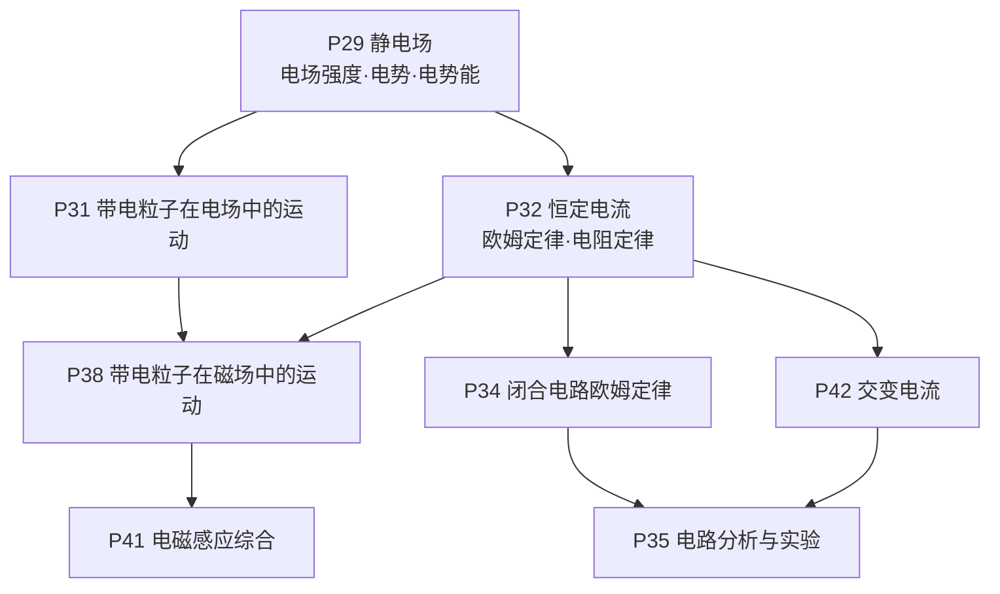
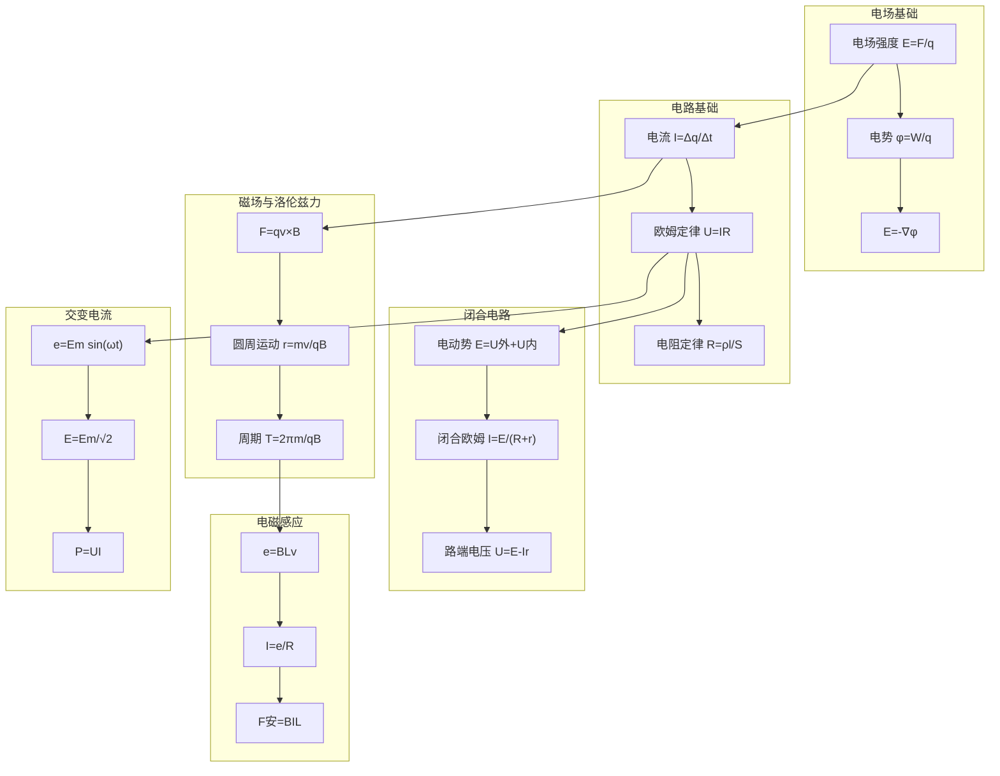
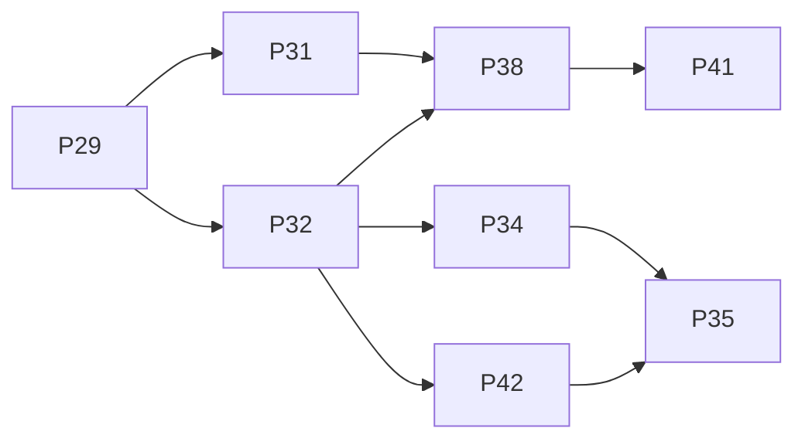

# 电学解题套路

<cite>
**本文引用的文件**
- [P29_静电场.md](file://docs/knowledge/physics/P29_静电场.md)
- [P31_带电粒子在电场中的运动.md](file://docs/knowledge/physics/P31_带电粒子在电场中的运动.md)
- [P32_恒定电流.md](file://docs/knowledge/physics/P32_恒定电流.md)
- [P34_闭合电路欧姆定律.md](file://docs/knowledge/physics/P34_闭合电路欧姆定律.md)
- [P35_电路分析与实验.md](file://docs/knowledge/physics/P35_电路分析与实验.md)
- [P38_带电粒子在磁场中的运动.md](file://docs/knowledge/physics/P38_带电粒子在磁场中的运动.md)
- [P41_电磁感应综合.md](file://docs/knowledge/physics/P41_电磁感应综合.md)
- [P42_交变电流.md](file://docs/knowledge/physics/P42_交变电流.md)
</cite>

## 目录
1. [引言](#引言)
2. [项目结构](#项目结构)
3. [核心组件](#核心组件)
4. [架构总览](#架构总览)
5. [详细组件分析](#详细组件分析)
6. [依赖分析](#依赖分析)
7. [性能考量](#性能考量)
8. [故障排查指南](#故障排查指南)
9. [结论](#结论)
10. [附录](#附录)

## 引言
本文件面向星耀平台物理学科的电学板块，系统梳理“电场强度分析、电势与电势能计算、电容器问题、欧姆定律应用、电路分析、磁场与安培力、洛伦兹力、电磁感应、交变电流、理想变压器、电学实验”等核心解题套路。通过对知识节点的结构化解读与图示化展示，帮助学生建立“知识点—模型—解题套路—规范步骤”的闭环认知，提升解题的系统性与规范性。

## 项目结构
电学知识以“知识节点”形式组织，每个节点包含：
- 基本信息：节点ID、名称、所属章节、前置与后续节点、相关模型
- 学科本质：对概念的深层理解与常见误区澄清
- 叙事正文：情境锚定、困惑预设、实验/现象呈现、概念涌现、推导叙事、迁移应用
- 分层变形：B/J/T三级例题与核心要点
- 公式卡片：核心公式与适用条件
- 理解度自评与跨学科关联
- 填写检查清单

图表来源
- [P29_静电场.md:10-17](file://docs/knowledge/physics/P29_静电场.md#L10-L17)
- [P31_带电粒子在电场中的运动.md:9-17](file://docs/knowledge/physics/P31_带电粒子在电场中的运动.md#L9-L17)
- [P32_恒定电流.md:9-17](file://docs/knowledge/physics/P32_恒定电流.md#L9-L17)
- [P34_闭合电路欧姆定律.md:9-17](file://docs/knowledge/physics/P34_闭合电路欧姆定律.md#L9-L17)
- [P35_电路分析与实验.md:9-17](file://docs/knowledge/physics/P35_电路分析与实验.md#L9-L17)
- [P38_带电粒子在磁场中的运动.md:9-17](file://docs/knowledge/physics/P38_带电粒子在磁场中的运动.md#L9-L17)
- [P41_电磁感应综合.md:9-17](file://docs/knowledge/physics/P41_电磁感应综合.md#L9-L17)
- [P42_交变电流.md:9-17](file://docs/knowledge/physics/P42_交变电流.md#L9-L17)

章节来源
- [P29_静电场.md:7-17](file://docs/knowledge/physics/P29_静电场.md#L7-L17)
- [P31_带电粒子在电场中的运动.md:7-17](file://docs/knowledge/physics/P31_带电粒子在电场中的运动.md#L7-L17)
- [P32_恒定电流.md:7-17](file://docs/knowledge/physics/P32_恒定电流.md#L7-L17)
- [P34_闭合电路欧姆定律.md:7-17](file://docs/knowledge/physics/P34_闭合电路欧姆定律.md#L7-L17)
- [P35_电路分析与实验.md:7-17](file://docs/knowledge/physics/P35_电路分析与实验.md#L7-L17)
- [P38_带电粒子在磁场中的运动.md:7-17](file://docs/knowledge/physics/P38_带电粒子在磁场中的运动.md#L7-L17)
- [P41_电磁感应综合.md:7-17](file://docs/knowledge/physics/P41_电磁感应综合.md#L7-L17)
- [P42_交变电流.md:7-17](file://docs/knowledge/physics/P42_交变电流.md#L7-L17)

## 核心组件
- 电场强度与电势：定义、公式、场强与电势关系、典型模型（点电荷、均匀带电球体）
- 带电粒子在电场中的运动：受力、加速度、类平抛、速度偏转角、实验设计
- 恒定电流与欧姆定律：电流定义、欧姆定律、电阻定律、串并联、温度与非线性
- 闭合电路欧姆定律：电动势、内阻、路端电压、功率与效率、最大输出功率
- 电路分析与实验：串并联、电表内接外接原则、节点电流与回路电压定律、电桥平衡
- 磁场与洛伦兹力：洛伦兹力方向与大小、带电粒子在匀强磁场中圆周运动、回旋运动
- 电磁感应综合：感应电动势、感应电流、安培力、能量转化与功率平衡
- 交变电流：瞬时值表达式、峰值与有效值、功率计算、远距离输电与理想变压器

章节来源
- [P29_静电场.md:186-196](file://docs/knowledge/physics/P29_静电场.md#L186-L196)
- [P31_带电粒子在电场中的运动.md:173-182](file://docs/knowledge/physics/P31_带电粒子在电场中的运动.md#L173-L182)
- [P32_恒定电流.md:177-187](file://docs/knowledge/physics/P32_恒定电流.md#L177-L187)
- [P34_闭合电路欧姆定律.md:178-187](file://docs/knowledge/physics/P34_闭合电路欧姆定律.md#L178-L187)
- [P35_电路分析与实验.md:170-180](file://docs/knowledge/physics/P35_电路分析与实验.md#L170-L180)
- [P38_带电粒子在磁场中的运动.md:175-184](file://docs/knowledge/physics/P38_带电粒子在磁场中的运动.md#L175-L184)
- [P41_电磁感应综合.md:165-175](file://docs/knowledge/physics/P41_电磁感应综合.md#L165-L175)
- [P42_交变电流.md:218-229](file://docs/knowledge/physics/P42_交变电流.md#L218-L229)

## 架构总览
电学知识节点围绕“电场—电路—磁场—电磁感应—交流电”主线展开，形成“基础概念—模型应用—综合分析—实验验证”的学习闭环。

图表来源
- [P29_静电场.md:65-78](file://docs/knowledge/physics/P29_静电场.md#L65-L78)
- [P32_恒定电流.md:63-78](file://docs/knowledge/physics/P32_恒定电流.md#L63-L78)
- [P34_闭合电路欧姆定律.md:63-73](file://docs/knowledge/physics/P34_闭合电路欧姆定律.md#L63-L73)
- [P38_带电粒子在磁场中的运动.md:61-71](file://docs/knowledge/physics/P38_带电粒子在磁场中的运动.md#L61-L71)
- [P41_电磁感应综合.md:60-70](file://docs/knowledge/physics/P41_电磁感应综合.md#L60-L70)
- [P42_交变电流.md:61-74](file://docs/knowledge/physics/P42_交变电流.md#L61-L74)

## 详细组件分析

### 电场强度分析与电势计算
- 适用情境
  - 已知点电荷或带电体，求某点电场强度与电势
  - 已知电势分布，求电场强度（梯度关系）
  - 均匀带电球体内外场强分布
- 基本定律
  - 电场强度定义：E = F/q
  - 点电荷场强：E = kQ/r²
  - 电势定义：φ = Ep/q
  - 点电荷电势：φ = kQ/r
  - 场强与电势关系：E = -dφ/dr
- 解题步骤与技巧
  - 步骤1：明确研究对象与参考点（通常取无穷远为零点）
  - 步骤2：选择合适公式（点电荷、叠加原理、对称性）
  - 步骤3：注意矢量与标量的区别（场强为矢量，电势为标量）
  - 步骤4：利用E = -∇φ进行微分关系验证
- 示例与要点
  - 例题：点电荷Q=2μC，求距0.1m处E；或已知φ=100V，求Q
  - 要点：叠加原理用于多电荷；均匀带电球体内外场强分布

章节来源
- [P29_静电场.md:80-99](file://docs/knowledge/physics/P29_静电场.md#L80-L99)
- [P29_静电场.md:140-183](file://docs/knowledge/physics/P29_静电场.md#L140-L183)

### 带电粒子在电场中的运动
- 适用情境
  - 电子枪、示波器、粒子加速器中的偏转与聚焦
  - 类平抛运动与速度偏转角计算
- 基本定律
  - 电场力：F = qE
  - 加速度：a = qE/m
  - 运动类型：初速为0（匀加速直线）；垂直E（类平抛）
- 解题步骤与技巧
  - 步骤1：确定初速度方向与电场方向
  - 步骤2：分解运动（水平匀速、竖直匀加速）
  - 步骤3：利用运动学公式求位移、速度、偏转角
  - 步骤4：注意“电场力做功=电势能变化”的能量关系
- 示例与要点
  - 例题：电子在E=1000V/m中从静止加速；质子垂直进入E=5000V/m电场求偏转距离
  - 要点：多过程分析（加速+偏转）

章节来源
- [P31_带电粒子在电场中的运动.md:72-87](file://docs/knowledge/physics/P31_带电粒子在电场中的运动.md#L72-L87)
- [P31_带电粒子在电场中的运动.md:127-170](file://docs/knowledge/physics/P31_带电粒子在电场中的运动.md#L127-L170)

### 恒定电流与欧姆定律
- 适用情境
  - 电路简单计算（串联、并联、分压、分流）
  - 电阻定律与材料属性（ρ、l、S）关系
  - 温度对电阻的影响与非线性元件处理
- 基本定律
  - 电流定义：I = q/t
  - 欧姆定律：U = IR
  - 电阻定律：R = ρl/S
- 解题步骤与技巧
  - 步骤1：识别串并联关系，逐步等效
  - 步骤2：应用欧姆定律求电流、电压、功率
  - 步骤3：注意电表内阻带来的系统误差（内接/外接）
  - 步骤4：温度影响：R = R₀(1 + αΔt)
- 示例与要点
  - 例题：R=10Ω，U=5V求I；导线l=10m，S=1mm²，ρ=1.7×10⁻⁸Ω·m求R
  - 要点：串联分压、并联分流；内接测大电阻、外接测小电阻

章节来源
- [P32_恒定电流.md:79-91](file://docs/knowledge/physics/P32_恒定电流.md#L79-L91)
- [P32_恒定电流.md:131-174](file://docs/knowledge/physics/P32_恒定电流.md#L131-L174)

### 闭合电路欧姆定律
- 适用情境
  - 电源有内阻时的路端电压、电流、功率分析
  - 最大输出功率条件与效率
- 基本定律
  - 电动势：E = U外 + U内
  - 闭合欧姆：I = E/(R + r)
  - 路端电压：U = E - Ir
- 解题步骤与技巧
  - 步骤1：区分电动势E与路端电压U
  - 步骤2：计算电流I与热功率I²r
  - 步骤3：输出功率I²R与电源总功率EI的关系
  - 步骤4：证明R=r时输出功率最大
- 示例与要点
  - 例题：E=12V，r=1Ω，R=5Ω求I与U；短路电流求内阻
  - 要点：动态分析（增大R时I、U、P输的变化趋势）

章节来源
- [P34_闭合电路欧姆定律.md:74-85](file://docs/knowledge/physics/P34_闭合电路欧姆定律.md#L74-L85)
- [P34_闭合电路欧姆定律.md:125-175](file://docs/knowledge/physics/P34_闭合电路欧姆定律.md#L125-L175)

### 电路分析与实验
- 适用情境
  - 复杂电路的等效变换与节点/回路分析
  - 伏安法测电阻的内接/外接选择与误差分析
  - 电桥平衡与仪器选择
- 基本定律
  - 串并联电阻：R串 = ΣR，1/R并 = Σ(1/R)
  - 节点电流定律：ΣI = 0
  - 回路电压定律：ΣU = 0
- 解题步骤与技巧
  - 步骤1：识别串并联关系，逐步等效
  - 步骤2：节点电流与回路电压列方程
  - 步骤3：电表内阻引入的系统误差与“大内小外”口诀
  - 步骤4：电桥平衡条件R1/R2 = R3/R4
- 示例与要点
  - 例题：三个10Ω串联求总电阻；两电阻10Ω并联求总电阻
  - 要点：复杂电路简化；电桥平衡证明

章节来源
- [P35_电路分析与实验.md:74-85](file://docs/knowledge/physics/P35_电路分析与实验.md#L74-L85)
- [P35_电路分析与实验.md:125-167](file://docs/knowledge/physics/P35_电路分析与实验.md#L125-L167)

### 磁场与安培力、洛伦兹力
- 适用情境
  - 带电粒子在匀强磁场中做圆周运动（回旋运动）
  - 螺旋运动与磁聚焦
  - 安培力在导体棒切割磁感线中的应用
- 基本定律
  - 洛伦兹力：F = q(v × B)
  - 圆周运动半径：r = mv/qB
  - 周期：T = 2πm/qB
  - 安培力：F = BIL
- 解题步骤与技巧
  - 步骤1：判断洛伦兹力提供向心力
  - 步骤2：写出半径与周期公式，注意与速度无关
  - 步骤3：螺旋运动分解为圆周与匀速直线的合成
  - 步骤4：导体棒切割时e=BLv，I=e/R，F安=BIL
- 示例与要点
  - 例题：电子在B=0.01T、v=10⁷m/s求r与T；α粒子动能1MeV求r
  - 要点：周期不变性；磁聚焦与回旋加速器原理

章节来源
- [P38_带电粒子在磁场中的运动.md:72-86](file://docs/knowledge/physics/P38_带电粒子在磁场中的运动.md#L72-L86)
- [P38_带电粒子在磁场中的运动.md:126-172](file://docs/knowledge/physics/P38_带电粒子在磁场中的运动.md#L126-L172)

### 电磁感应综合
- 适用情境
  - 导体棒在磁场中切割磁感线，涉及安培力、感应电流、能量转化
  - 稳态分析（a=0时F外=F安）与全过程分析
- 基本定律
  - 感应电动势：e = BLv
  - 感应电流：I = e/R
  - 安培力：F安 = BIL
  - 热功率：P热 = I²R
- 解题步骤与技巧
  - 步骤1：电路分析求e与I
  - 步骤2：力学分析求安培力与加速度
  - 步骤3：能量转化：外力功=动能变化+焦耳热
  - 步骤4：稳态条件F外=F安
- 示例与要点
  - 例题：m=1kg，L=1m，B=1T，R=1Ω，v₀=10m/s求最大加速度与最大高度
  - 要点：功率平衡与能量守恒

章节来源
- [P41_电磁感应综合.md:71-81](file://docs/knowledge/physics/P41_电磁感应综合.md#L71-L81)
- [P41_电磁感应综合.md:117-162](file://docs/knowledge/physics/P41_电磁感应综合.md#L117-L162)

### 交变电流
- 适用情境
  - 正弦交流电的瞬时值、峰值、有效值与功率计算
  - 远距离输电与理想变压器的电压/电流/功率关系
- 基本定律
  - 瞬时值：e = Em sin(ωt)，i = Im sin(ωt)
  - 有效值：E = Em/√2，I = Im/√2，U = Um/√2
  - 功率：P = UI = I²R = U²/R
  - 变压器：U1/U2 = n1/n2，I1/I2 = n2/n1（理想变压器）
- 解题步骤与技巧
  - 步骤1：从线圈转动推导瞬时值表达式
  - 步骤2：有效值定义与热效应等效
  - 步骤3：功率计算统一使用有效值
  - 步骤4：远距离输电中U损=I·R线，P损=I²R线
- 示例与要点
  - 例题：E_m=311V，f=50Hz求瞬时值表达式与有效值；“220V 100W”灯泡接入u=311sin(100πt)V求电流有效值与电阻
  - 要点：有效值≠平均值；非正弦波需重新积分

章节来源
- [P42_交变电流.md:75-110](file://docs/knowledge/physics/P42_交变电流.md#L75-L110)
- [P42_交变电流.md:152-215](file://docs/knowledge/physics/P42_交变电流.md#L152-L215)

## 依赖分析
- 知识依赖
  - P29（库仑定律）→ P31（电场运动）
  - P29（静电场）→ P32（恒定电流）
  - P32（恒定电流）→ P34（闭合电路）
  - P34（闭合电路）→ P35（电路分析）
  - P31（电场运动）→ P38（磁场运动）
  - P32（恒定电流）→ P38（磁场运动）
  - P38（磁场运动）→ P41（电磁感应）
  - P32（恒定电流）→ P42（交变电流）
  - P42（交变电流）→ P35（电路分析）
- 模型依赖
  - 静电场模型（点电荷、对称分布）
  - 电路模型（串并联、电表内阻）
  - 粒子运动模型（类平抛、圆周运动、螺旋运动）
  - 电磁感应模型（切割、安培力、能量转化）
  - 交变电流模型（正弦波、有效值、远距离输电）

图表来源
- [P29_静电场.md:15-16](file://docs/knowledge/physics/P29_静电场.md#L15-L16)
- [P31_带电粒子在电场中的运动.md:15-16](file://docs/knowledge/physics/P31_带电粒子在电场中的运动.md#L15-L16)
- [P32_恒定电流.md:15-16](file://docs/knowledge/physics/P32_恒定电流.md#L15-L16)
- [P34_闭合电路欧姆定律.md:15-16](file://docs/knowledge/physics/P34_闭合电路欧姆定律.md#L15-L16)
- [P35_电路分析与实验.md:15-16](file://docs/knowledge/physics/P35_电路分析与实验.md#L15-L16)
- [P38_带电粒子在磁场中的运动.md:15-16](file://docs/knowledge/physics/P38_带电粒子在磁场中的运动.md#L15-L16)
- [P41_电磁感应综合.md:15-16](file://docs/knowledge/physics/P41_电磁感应综合.md#L15-L16)
- [P42_交变电流.md:15-16](file://docs/knowledge/physics/P42_交变电流.md#L15-L16)

## 性能考量
- 计算精度
  - 使用有效值进行功率计算，避免用平均值导致错误
  - 对称性与叠加原理可显著简化计算
- 算法复杂度
  - 串并联等效变换为线性复杂度，适合程序化处理
  - 电磁感应综合问题涉及微分与能量守恒，需数值积分时注意步长与稳定性
- 实验误差
  - 电表内阻引入系统误差，应根据待测电阻大小选择内接或外接
  - 多组数据拟合可降低随机误差

## 故障排查指南
- 常见误区与纠正
  - 电场与电场力混淆：电场是空间属性，不做功；电场力做功W=qU
  - 电流方向：在电源外部从正极到负极，内部从负极到正极
  - 有效值与平均值：有效值基于热效应等效，非算术平均
  - 电场强度与电势关系：二者无直接比例关系
  - 安培力与速度：导体棒匀速时安培力与外力平衡，不一定是零
- 自我评估与改进
  - A级：能熟练区分概念、应用公式、进行多过程分析
  - B级：公式掌握但分析不熟练，建议完成J级变形
  - C级：概念混淆，建议重读“概念涌现”，完成B级变形

章节来源
- [P29_静电场.md:25-47](file://docs/knowledge/physics/P29_静电场.md#L25-L47)
- [P31_带电粒子在电场中的运动.md:25-46](file://docs/knowledge/physics/P31_带电粒子在电场中的运动.md#L25-L46)
- [P32_恒定电流.md:25-45](file://docs/knowledge/physics/P32_恒定电流.md#L25-L45)
- [P34_闭合电路欧姆定律.md:25-45](file://docs/knowledge/physics/P34_闭合电路欧姆定律.md#L25-L45)
- [P35_电路分析与实验.md:25-46](file://docs/knowledge/physics/P35_电路分析与实验.md#L25-L46)
- [P41_电磁感应综合.md:25-46](file://docs/knowledge/physics/P41_电磁感应综合.md#L25-L46)
- [P42_交变电流.md:25-46](file://docs/knowledge/physics/P42_交变电流.md#L25-L46)

## 结论
通过将电学知识节点与解题套路相结合，学生可以：
- 建立从“基本概念—模型应用—综合分析—实验验证”的完整思维链
- 掌握规范的解题步骤与技巧，避免常见误区
- 提升对电学知识系统性与内在联系的理解，增强解决复杂问题的信心与能力

## 附录
- 公式速查
  - 电场：E = F/q，E = kQ/r²，φ = kQ/r，E = -dφ/dr
  - 电场运动：a = qE/m，类平抛偏转位移公式
  - 电流与电阻：I = q/t，U = IR，R = ρl/S
  - 闭合电路：E = U外 + U内，I = E/(R + r)，U = E - Ir
  - 磁场：F = q(v × B)，r = mv/qB，T = 2πm/qB
  - 电磁感应：e = BLv，I = e/R，F安 = BIL，P热 = I²R
  - 交变电流：e = Em sin(ωt)，E = Em/√2，P = UI

章节来源
- [P29_静电场.md:186-196](file://docs/knowledge/physics/P29_静电场.md#L186-L196)
- [P31_带电粒子在电场中的运动.md:173-182](file://docs/knowledge/physics/P31_带电粒子在电场中的运动.md#L173-L182)
- [P32_恒定电流.md:177-187](file://docs/knowledge/physics/P32_恒定电流.md#L177-L187)
- [P34_闭合电路欧姆定律.md:178-187](file://docs/knowledge/physics/P34_闭合电路欧姆定律.md#L178-L187)
- [P35_电路分析与实验.md:170-180](file://docs/knowledge/physics/P35_电路分析与实验.md#L170-L180)
- [P38_带电粒子在磁场中的运动.md:175-184](file://docs/knowledge/physics/P38_带电粒子在磁场中的运动.md#L175-L184)
- [P41_电磁感应综合.md:165-175](file://docs/knowledge/physics/P41_电磁感应综合.md#L165-L175)
- [P42_交变电流.md:218-229](file://docs/knowledge/physics/P42_交变电流.md#L218-L229)