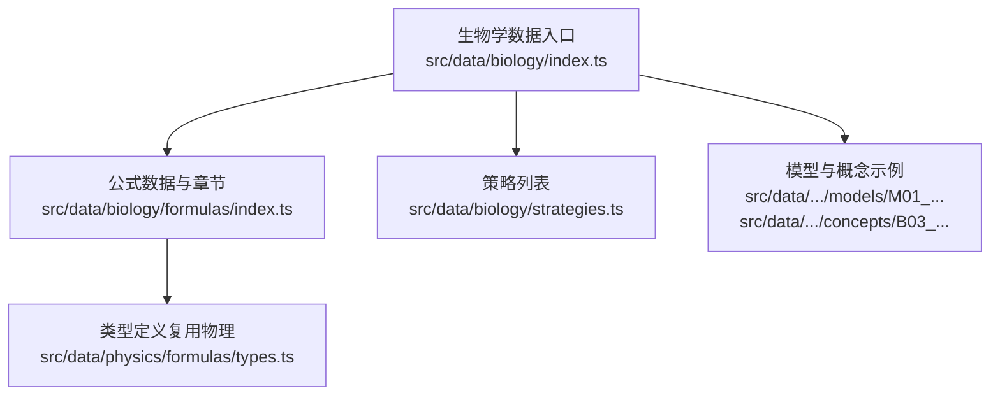
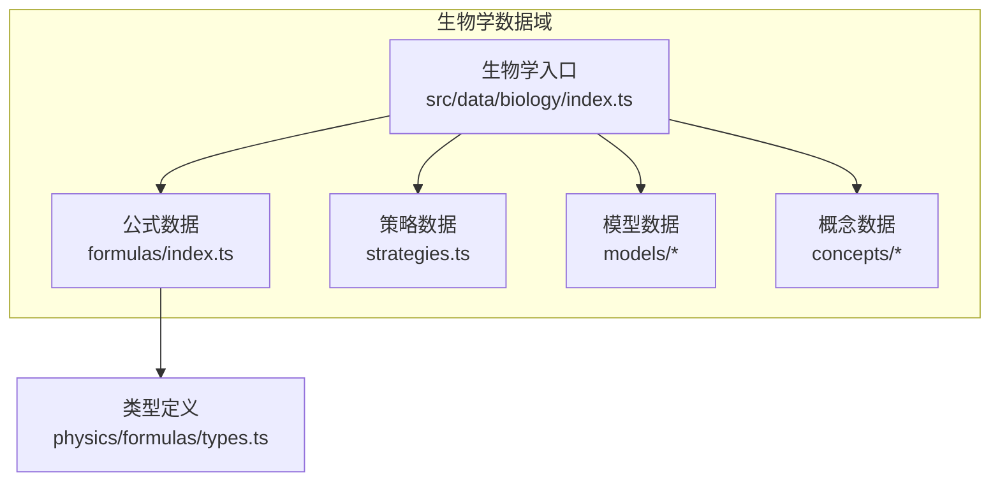
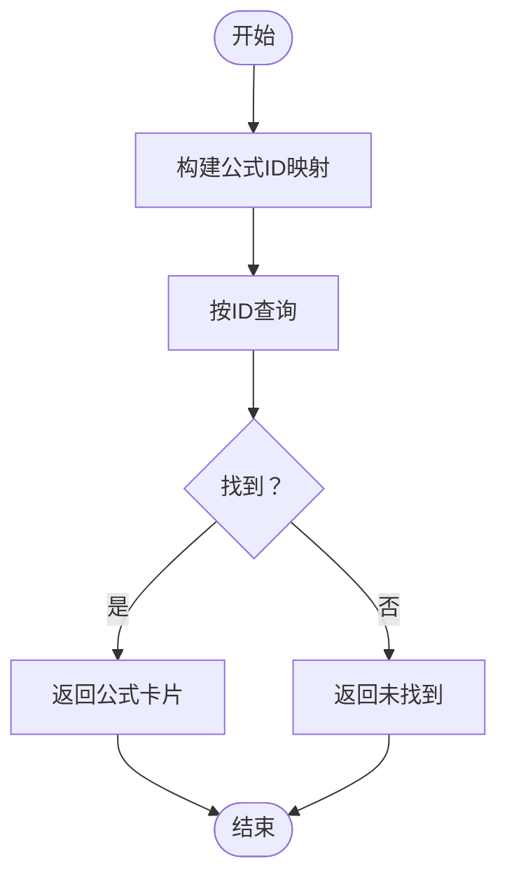
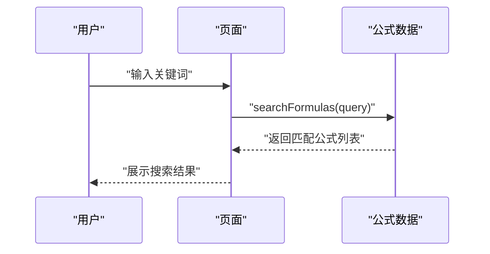
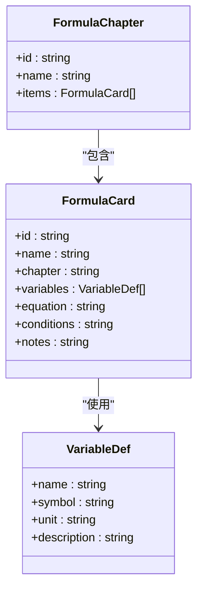
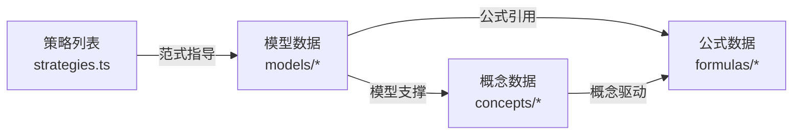
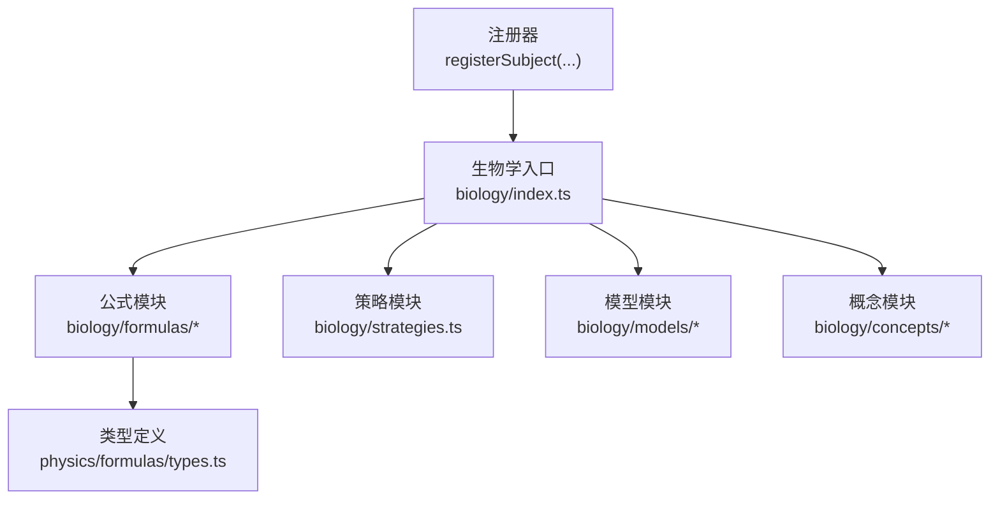

# 生物公式章节

<cite>
**本文档引用的文件**
- [src/data/biology/index.ts](file://src/data/biology/index.ts)
- [src/data/biology/formulas/index.ts](file://src/data/biology/formulas/index.ts)
- [src/data/biology/formulas/types.ts](file://src/data/biology/formulas/types.ts)
- [src/data/physics/formulas/types.ts](file://src/data/physics/formulas/types.ts)
- [src/data/biology/strategies.ts](file://src/data/biology/strategies.ts)
- [src/data/biology/models/M01_生物大分子组成模型.ts](file://src/data/biology/models/M01_生物大分子组成模型.ts)
- [src/data/biology/concepts/B03_核酸的结构与功能.ts](file://src/data/biology/concepts/B03_核酸的结构与功能.ts)
</cite>

## 目录
1. [引言](#引言)
2. [项目结构](#项目结构)
3. [核心组件](#核心组件)
4. [架构总览](#架构总览)
5. [详细组件分析](#详细组件分析)
6. [依赖分析](#依赖分析)
7. [性能考虑](#性能考虑)
8. [故障排查指南](#故障排查指南)
9. [结论](#结论)
10. [附录](#附录)

## 引言
本章节面向星耀平台生物学科的“公式”内容建设，聚焦于公式体系的组织结构与使用方法，覆盖生物化学反应式、遗传计算、生态学与生理学计算等核心领域。文档旨在帮助教师与学生理解公式来源、适用场景、适用条件与使用方法；梳理公式之间的逻辑关系与相互引用；总结记忆技巧与应用策略；提供推导与验证方法；并通过公式索引与检索能力提升学习效率。

## 项目结构
生物公式数据层位于生物学数据注册模块之下，采用“注册-查询-检索”的分层设计：
- 数据注册：通过生物学数据入口统一注册概念、模型、公式、策略与题库等资源。
- 公式数据：当前公式数组为空，公式章节预留章节结构与检索接口。
- 类型定义：复用物理学科公式类型，确保跨学科一致的结构与扩展性。

图表来源
- [src/data/biology/index.ts:1-151](file://src/data/biology/index.ts#L1-L151)
- [src/data/chemistry/formulas/index.ts:1-13](file://src/data/chemistry/formulas/index.ts#L1-L13)
- [src/data/physics/formulas/types.ts:1-3](file://src/data/physics/formulas/types.ts#L1-L3)

章节来源
- [src/data/chemistry/formulas/index.ts:1-13](file://src/data/chemistry/formulas/index.ts#L1-L13)
- [src/data/physics/formulas/types.ts:1-3](file://src/data/physics/formulas/types.ts#L1-L3)

## 核心组件
- 公式卡片与章节
  - 公式卡片集合与章节集合当前为空，为后续按主题填充留出结构。
  - 提供基于 ID 的快速查询函数，便于按需检索。
- 公式检索
  - 支持按名称或所属章节进行模糊检索，返回匹配结果集。
- 数据注册
  - 将生物学概念、模型、公式、策略与题库统一注册到学科数据注册器，形成可查询的知识图谱式数据结构。

章节来源
- [src/data/chemistry/formulas/index.ts:1-13](file://src/data/chemistry/formulas/index.ts#L1-L13)
- [src/data/physics/formulas/types.ts:1-3](file://src/data/physics/formulas/types.ts#L1-L3)
- [src/data/chemistry/index.ts:126-151](file://src/data/chemistry/index.ts#L126-L151)

## 架构总览
下图展示了生物学数据入口如何聚合公式、模型、概念与策略，并提供检索与查询能力：

图表来源
- [src/data/chemistry/index.ts:126-151](file://src/data/chemistry/index.ts#L126-L151)
- [src/data/physics/formulas/types.ts:1-3](file://src/data/physics/formulas/types.ts#L1-L3)

## 详细组件分析

### 组件A：公式数据与检索
- 结构与职责
  - 公式数组与章节数组作为占位容器，未来将按主题填充。
  - 通过 Map 构建 ID 到公式卡片的映射，支持 O(1) 查询。
  - 提供按名称与章节的模糊检索函数，便于快速定位。
- 使用建议
  - 在新增公式时，统一维护 id、名称、章节、变量定义与适用条件。
  - 检索接口可用于页面搜索框与智能推荐。

图表来源
- [src/data/chemistry/formulas/index.ts:7-13](file://src/data/chemistry/formulas/index.ts#L7-L13)

章节来源
- [src/data/chemistry/formulas/index.ts:1-13](file://src/data/chemistry/formulas/index.ts#L1-L13)

### 组件B：公式检索序列
- 流程说明
  - 输入检索关键词。
  - 对公式数组执行过滤：名称或章节包含关键词即命中。
  - 返回匹配结果集。
- 应用场景
  - 页面搜索框输入后实时提示。
  - 批量导出或统计命中公式清单。

图表来源
- [src/data/chemistry/index.ts:51-56](file://src/data/chemistry/index.ts#L51-L56)

章节来源
- [src/data/chemistry/index.ts:51-56](file://src/data/chemistry/index.ts#L51-L56)

### 组件C：类型与复用
- 类型复用
  - 生物学公式类型直接复用物理学科的类型定义，保证结构一致性与扩展性。
- 设计意义
  - 降低跨学科重复定义成本，统一变量、公式卡片与章节的字段约定。

图表来源
- [src/data/physics/formulas/types.ts:1-3](file://src/data/physics/formulas/types.ts#L1-L3)
- [src/data/chemistry/formulas/types.ts:1-3](file://src/data/chemistry/formulas/types.ts#L1-L3)

章节来源
- [src/data/physics/formulas/types.ts:1-3](file://src/data/physics/formulas/types.ts#L1-L3)
- [src/data/chemistry/formulas/types.ts:1-3](file://src/data/chemistry/formulas/types.ts#L1-L3)

### 组件D：策略与模型的关联
- 策略与模型
  - 策略列表提供“范式”维度的学习方法论，如“性质-方向-能量范式”“基因型拆分范式”等。
  - 模型与概念之间存在双向关联：概念指向模型，模型也指向核心思维与相关概念。
- 公式与策略/模型的关系
  - 公式可与特定模型/策略对应，例如“物质跨膜运输判断模型”对应“性质-方向-能量范式”，便于在模型学习中自然引入相关公式。
  - 建议在公式卡片中增加“适用模型/策略”字段，实现跨资源的导航与交叉引用。

图表来源
- [src/data/chemistry/strategies.ts:9-78](file://src/data/chemistry/strategies.ts#L9-L78)
- [src/data/chemistry/models/M01_生物大分子组成模型.ts:3-12](file://src/data/chemistry/models/M01_生物大分子组成模型.ts#L3-L12)
- [src/data/chemistry/concepts/B03_核酸的结构与功能.ts:3-13](file://src/data/chemistry/concepts/B03_核酸的结构与功能.ts#L3-L13)

章节来源
- [src/data/chemistry/strategies.ts:9-78](file://src/data/chemistry/strategies.ts#L9-L78)
- [src/data/chemistry/models/M01_生物大分子组成模型.ts:3-12](file://src/data/chemistry/models/M01_生物大分子组成模型.ts#L3-L12)
- [src/data/chemistry/concepts/B03_核酸的结构与功能.ts:3-13](file://src/data/chemistry/concepts/B03_核酸的结构与功能.ts#L3-L13)

## 依赖分析
- 内部依赖
  - 生物学入口依赖模型、概念、公式与策略模块，形成完整的知识域数据结构。
  - 公式模块依赖物理学科的类型定义，确保跨学科一致性。
- 外部依赖
  - 注册器负责将学科数据暴露给上层页面与服务，形成稳定的 API 接口。

图表来源
- [src/data/chemistry/index.ts:126-151](file://src/data/chemistry/index.ts#L126-L151)
- [src/data/physics/formulas/types.ts:1-3](file://src/data/physics/formulas/types.ts#L1-L3)

章节来源
- [src/data/chemistry/index.ts:126-151](file://src/data/chemistry/index.ts#L126-L151)
- [src/data/physics/formulas/types.ts:1-3](file://src/data/physics/formulas/types.ts#L1-L3)

## 性能考虑
- 查询性能
  - 使用 Map 构建 ID 到公式卡片的映射，查询复杂度为 O(1)，适合高频检索场景。
- 检索性能
  - 当前检索为线性过滤，适合中小规模数据；若公式量级增大，建议引入索引或分词检索以提升性能。
- 渲染优化
  - 页面按需加载与懒渲染，避免一次性渲染大量公式卡片。

## 故障排查指南
- 公式未显示
  - 检查公式数组是否已填充，确认 ID 是否唯一且正确。
  - 确认注册器中是否调用了公式相关接口。
- 检索无结果
  - 确认关键词大小写与拼写；当前检索为大小写不敏感的包含匹配。
- 类型不兼容
  - 若自定义字段，请确保与复用类型保持一致，避免运行时报错。

章节来源
- [src/data/chemistry/formulas/index.ts:1-13](file://src/data/chemistry/formulas/index.ts#L1-L13)
- [src/data/chemistry/index.ts:51-56](file://src/data/chemistry/index.ts#L51-L56)

## 结论
生物公式章节当前处于“预留结构+检索接口”的阶段。建议下一步：
- 按主题填充公式卡片，明确变量、单位、适用条件与典型题型。
- 建立公式与模型/策略的交叉索引，增强学习路径的连贯性。
- 优化检索体验，引入更高效的索引与高亮展示。
- 提供公式推导与验证模板，辅助学生掌握核心技能。

## 附录
- 公式索引与检索
  - 可通过名称或章节进行模糊检索，返回匹配公式列表。
  - 建议在页面中提供“按主题筛选”“按难度排序”等交互，提升查找效率。
- 记忆技巧与应用策略
  - 建议结合“范式”与“模型”进行串联记忆，例如将“物质跨膜运输”与“性质-方向-能量范式”结合。
  - 通过典型题型与变式训练强化应用能力。