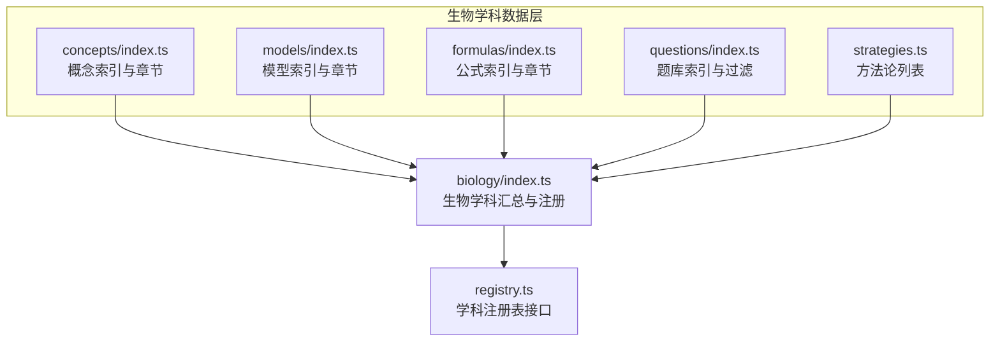
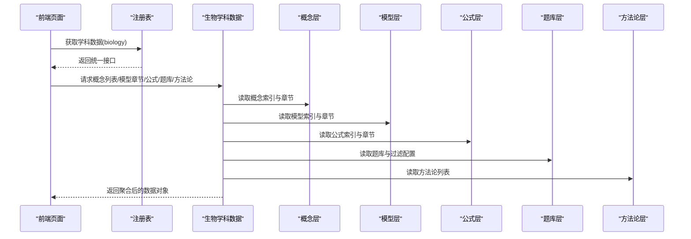
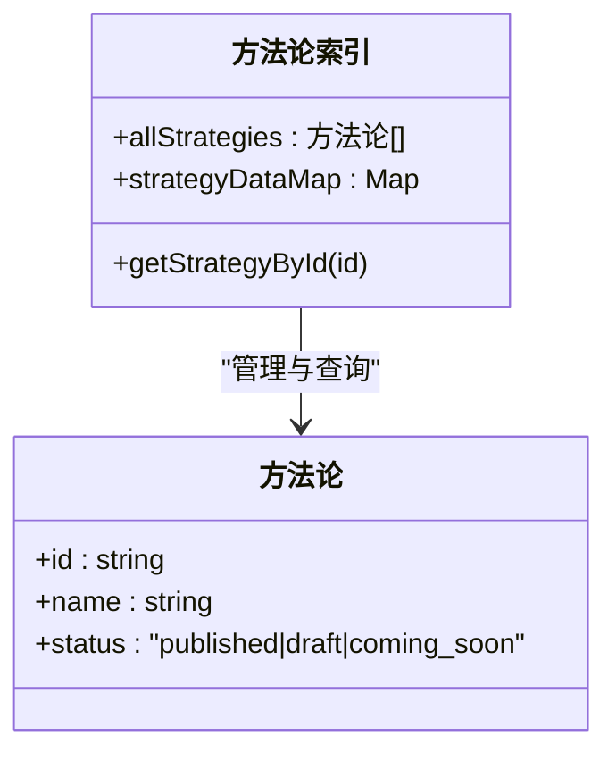
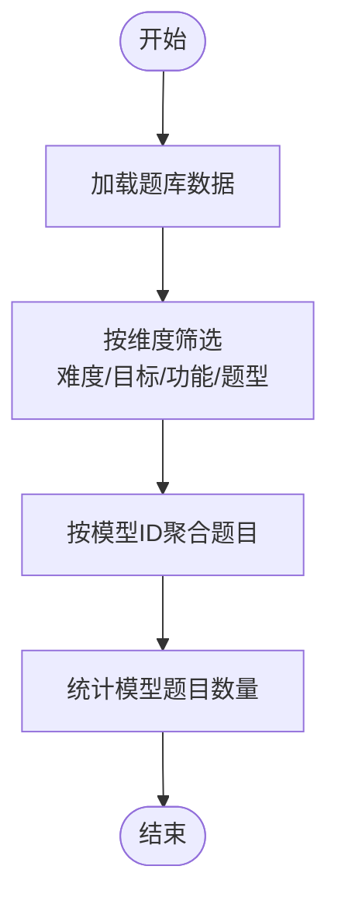
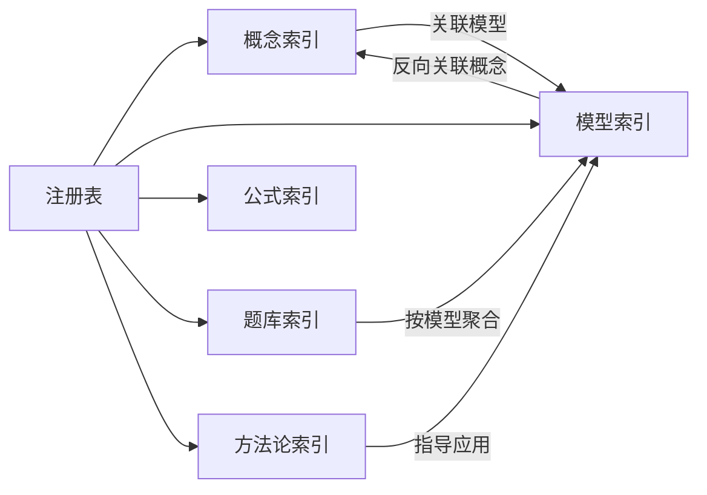

# 生物学科

<cite>
**本文引用的文件**
- [src/data/registry.ts](file://src/data/registry.ts)
- [src/data/biology/index.ts](file://src/data/biology/index.ts)
- [src/data/biology/concepts/index.ts](file://src/data/biology/concepts/index.ts)
- [src/data/biology/concepts/types.ts](file://src/data/biology/concepts/types.ts)
- [src/data/biology/concepts/B01_细胞的分子组成.ts](file://src/data/biology/concepts/B01_细胞的分子组成.ts)
- [src/data/biology/models/index.ts](file://src/data/biology/models/index.ts)
- [src/data/biology/models/types.ts](file://src/data/biology/models/types.ts)
- [src/data/biology/models/M01_生物大分子组成模型.ts](file://src/data/biology/models/M01_生物大分子组成模型.ts)
- [src/data/biology/strategies.ts](file://src/data/biology/strategies.ts)
- [src/data/biology/formulas/index.ts](file://src/data/biology/formulas/index.ts)
- [src/data/biology/formulas/types.ts](file://src/data/biology/formulas/types.ts)
- [src/data/biology/questions/index.ts](file://src/data/biology/questions/index.ts)
- [src/data/biology/questions/filters.ts](file://src/data/biology/questions/filters.ts)
- [src/sections/BiologyGuidePage.tsx](file://src/sections/BiologyGuidePage.tsx)
</cite>

## 目录
1. [引言](#引言)
2. [项目结构](#项目结构)
3. [核心组件](#核心组件)
4. [架构总览](#架构总览)
5. [详细组件分析](#详细组件分析)
6. [依赖分析](#依赖分析)
7. [性能考虑](#性能考虑)
8. [故障排查指南](#故障排查指南)
9. [结论](#结论)
10. [附录](#附录)

## 引言
本文件面向“星耀平台”的生物学科知识体系，系统化阐述K层知识节点（52个）、M层核心模型（48个）、R层解题套路（48条已发布，另有若干待发布）、P层练习题库的设计理念与实现方式。文档覆盖模块划分与章节组织（分子与细胞、遗传与进化、稳态与调节、生物与环境、生物技术与工程），并提炼生物学科特有的思维方法（结构与功能观、系统与层次观、物质与能量观、信息与调控观）与解题策略（如遗传计算、生态分析、实验设计）。通过模块化设计实现知识的系统化呈现与学习路径优化。

## 项目结构
生物学科数据在平台中的组织遵循统一的“学科注册表”模式：每个学科通过注册表暴露统一接口，供前端页面按需调用。生物学科数据位于 src/data/biology 下，包含概念、模型、公式、题库、方法论等子模块，并由 src/data/biology/index.ts 汇总导出，最终通过注册表对外提供查询与统计能力。



图示来源
- [src/data/biology/index.ts:1-151](file://src/data/biology/index.ts#L1-L151)
- [src/data/biology/concepts/index.ts:1-201](file://src/data/biology/concepts/index.ts#L1-L201)
- [src/data/biology/models/index.ts:1-191](file://src/data/biology/models/index.ts#L1-L191)
- [src/data/biology/formulas/index.ts:1-13](file://src/data/biology/formulas/index.ts#L1-L13)
- [src/data/biology/questions/index.ts:1-15](file://src/data/biology/questions/index.ts#L1-L15)
- [src/data/biology/strategies.ts:1-78](file://src/data/biology/strategies.ts#L1-L78)
- [src/data/registry.ts:1-48](file://src/data/registry.ts#L1-L48)

章节来源
- [src/data/biology/index.ts:1-151](file://src/data/biology/index.ts#L1-L151)
- [src/data/registry.ts:1-48](file://src/data/registry.ts#L1-L48)

## 核心组件
- 概念层（K层）：以“概念数据”为核心，包含52个知识点条目，按“分子与细胞、遗传与进化、稳态与调节、生物与环境、生物技术与工程”五大模块组织，支持难度映射、前置知识与关联模型标注。
- 模型层（M层）：以“模型数据”为核心，包含48个核心模型，覆盖物质跨膜运输、酶特性、细胞呼吸、光合作用、遗传定律、神经体液调节、生态系统、生物技术等关键主题，强调“结构功能观、系统观、能量观、信息观”等思维范式。
- 方法论（R层）：提供48条已发布方法论与若干待发布条目，围绕实验设计、过程建模、信息传递、稳态调节、生态分析等主题，形成可迁移的解题范式。
- 题库层（P层）：提供题库数据、难度与目标维度、功能维度、题型维度及颜色标识，支持按模型聚合题目与统计模型题目完成情况。
- 公式层：提供公式卡片与章节组织，便于跨概念与模型的公式检索与学习。
- 注册表：统一暴露学科数据访问接口，便于前端页面按需获取概念列表、模型章节、公式数据、题库配置与统计信息。

章节来源
- [src/data/biology/concepts/index.ts:60-197](file://src/data/biology/concepts/index.ts#L60-L197)
- [src/data/biology/models/index.ts:56-187](file://src/data/biology/models/index.ts#L56-L187)
- [src/data/biology/strategies.ts:9-78](file://src/data/biology/strategies.ts#L9-L78)
- [src/data/biology/questions/index.ts:3-15](file://src/data/biology/questions/index.ts#L3-L15)
- [src/data/biology/questions/filters.ts:1-38](file://src/data/biology/questions/filters.ts#L1-L38)
- [src/data/biology/formulas/index.ts:1-13](file://src/data/biology/formulas/index.ts#L1-L13)
- [src/data/biology/index.ts:126-151](file://src/data/biology/index.ts#L126-L151)
- [src/data/registry.ts:4-48](file://src/data/registry.ts#L4-L48)

## 架构总览
生物学科数据通过“注册表”对外提供统一接口，前端页面通过学科ID获取对应数据，实现概念、模型、公式、题库与方法论的一体化访问。



图示来源
- [src/data/registry.ts:40-48](file://src/data/registry.ts#L40-L48)
- [src/data/biology/index.ts:126-151](file://src/data/biology/index.ts#L126-L151)

## 详细组件分析

### 概念层（K层：52个知识点）
- 组织结构：按“分子与细胞、遗传与进化、稳态与调节、生物与环境、生物技术与工程”五大模块组织，每个模块包含若干概念条目。
- 数据结构：概念条目包含ID、名称、所属模块与章节、难度、前置知识、关联模型、状态等字段，便于构建学习路径与知识图谱。
- 关联关系：概念与模型之间建立双向关联，支撑“以模型驱动概念学习、以概念支撑模型应用”。

```mermaid
classDiagram
class 概念数据 {
+id : string
+name : string
+chapter : string
+module : string
+difficulty : "core|extended|basic"
+prerequisites : string[]
+relatedModels : string[]
+status : "published|draft|coming_soon"
}
class 概念索引 {
+allConcepts : 概念数据[]
+conceptDataMap : Map
+conceptList : {chapter, items[]}[]
+getConceptById(id)
}
概念索引 --> 概念数据 : "管理与查询"
```

图示来源
- [src/data/biology/concepts/types.ts:1-3](file://src/data/biology/concepts/types.ts#L1-L3)
- [src/data/biology/concepts/index.ts:60-197](file://src/data/biology/concepts/index.ts#L60-L197)
- [src/data/biology/concepts/B01_细胞的分子组成.ts:3-13](file://src/data/biology/concepts/B01_细胞的分子组成.ts#L3-L13)

章节来源
- [src/data/biology/concepts/index.ts:60-197](file://src/data/biology/concepts/index.ts#L60-L197)
- [src/data/biology/concepts/B01_细胞的分子组成.ts:3-13](file://src/data/biology/concepts/B01_细胞的分子组成.ts#L3-L13)

### 模型层（M层：48个核心模型）
- 分类体系：覆盖分子与细胞、遗传与进化、稳态与调节、生物与环境、生物技术与工程五大模块，每个模块围绕关键主题构建分析模型。
- 思维范式：强调“结构功能观、系统观、能量观、信息观”，模型命名与描述体现核心思维方法。
- 关联关系：模型与概念、方法论建立关联，支撑“以模型串联知识、以范式指导应用”。

```mermaid
classDiagram
class 模型数据 {
+id : string
+name : string
+chapter : string
+difficulty : "B|J|T"
+coreThinking : string
+relatedConcepts : string[]
+relatedStrategies : string[]
+status : "published|draft|coming_soon"
}
class 模型索引 {
+allModels : 模型数据[]
+modelDataMap : Map
+ALL_MODEL_IDS : string[]
+biologyModels : {chapter, models[]}[]
+getModelById(id)
}
模型索引 --> 模型数据 : "管理与查询"
```

图示来源
- [src/data/biology/models/types.ts:1-3](file://src/data/biology/models/types.ts#L1-L3)
- [src/data/biology/models/index.ts:56-187](file://src/data/biology/models/index.ts#L56-L187)
- [src/data/biology/models/M01_生物大分子组成模型.ts:3-12](file://src/data/biology/models/M01_生物大分子组成模型.ts#L3-L12)

章节来源
- [src/data/biology/models/index.ts:56-187](file://src/data/biology/models/index.ts#L56-L187)
- [src/data/biology/models/M01_生物大分子组成模型.ts:3-12](file://src/data/biology/models/M01_生物大分子组成模型.ts#L3-L12)

### 方法论（R层：48条已发布，若干待发布）
- 内容构成：围绕实验设计、过程建模、信息传递、稳态调节、生态分析等主题，形成可迁移的解题范式，编号从 BIO-S01 到 BIO-S60。
- 发布状态：部分已发布，部分处于草稿或即将上线状态，体现持续迭代与扩展能力。
- 应用场景：指导学生在不同模块中采用一致的思维范式解决实际问题。



图示来源
- [src/data/biology/strategies.ts:1-78](file://src/data/biology/strategies.ts#L1-L78)

章节来源
- [src/data/biology/strategies.ts:9-78](file://src/data/biology/strategies.ts#L9-L78)

### 题库层（P层：筛选机制与统计）
- 题库数据：提供题目数组、按模型聚合的映射以及按ID查询的映射。
- 筛选维度：难度（L1/L2/L3）、目标（同步学习/期中期末/高考专项/竞赛拓展）、功能（巩固练习/复习检测/诊断评估/真题演练）、题型（选择/填空/判断/解答）。
- 统计能力：支持按模型统计题目总量与正确率（预留），便于个性化学习与错题强化。



图示来源
- [src/data/biology/questions/index.ts:3-15](file://src/data/biology/questions/index.ts#L3-L15)
- [src/data/biology/questions/filters.ts:1-38](file://src/data/biology/questions/filters.ts#L1-L38)

章节来源
- [src/data/biology/questions/index.ts:3-15](file://src/data/biology/questions/index.ts#L3-L15)
- [src/data/biology/questions/filters.ts:1-38](file://src/data/biology/questions/filters.ts#L1-L38)

### 公式层（F层：公式与章节）
- 功能：提供公式卡片与章节组织，支持按名称或章节搜索，便于跨概念与模型的公式检索与学习。
- 结构：与物理等其他学科共享类型定义，确保跨学科一致性。

章节来源
- [src/data/biology/formulas/index.ts:1-13](file://src/data/biology/formulas/index.ts#L1-L13)
- [src/data/biology/formulas/types.ts:1-3](file://src/data/biology/formulas/types.ts#L1-L3)

### 注册表与统一接口
- 接口职责：统一暴露概念、模型、公式、题库、方法论的查询与统计接口，支持前端按需获取。
- 扩展性：通过注册函数将新学科接入统一数据面，保证平台级一致性。

章节来源
- [src/data/registry.ts:4-48](file://src/data/registry.ts#L4-L48)
- [src/data/biology/index.ts:126-151](file://src/data/biology/index.ts#L126-L151)

## 依赖分析
- 概念与模型：概念与模型之间存在双向关联，概念指向模型，模型反向指向概念，形成“以模型驱动概念学习”的闭环。
- 方法论与模型：方法论作为思维范式，与模型形成“范式-模型”协同，提升解题迁移能力。
- 题库与模型：题库按模型聚合，便于针对特定模型进行专项训练与统计分析。
- 注册表：所有数据通过注册表统一暴露，降低前端耦合度，增强可维护性。



图示来源
- [src/data/biology/concepts/index.ts:115-117](file://src/data/biology/concepts/index.ts#L115-L117)
- [src/data/biology/models/index.ts:107-109](file://src/data/biology/models/index.ts#L107-L109)
- [src/data/biology/strategies.ts:72-74](file://src/data/biology/strategies.ts#L72-L74)
- [src/data/biology/questions/index.ts:5-7](file://src/data/biology/questions/index.ts#L5-L7)
- [src/data/biology/index.ts:126-151](file://src/data/biology/index.ts#L126-L151)
- [src/data/registry.ts:40-48](file://src/data/registry.ts#L40-L48)

章节来源
- [src/data/biology/concepts/index.ts:115-117](file://src/data/biology/concepts/index.ts#L115-L117)
- [src/data/biology/models/index.ts:107-109](file://src/data/biology/models/index.ts#L107-L109)
- [src/data/biology/strategies.ts:72-74](file://src/data/biology/strategies.ts#L72-L74)
- [src/data/biology/questions/index.ts:5-7](file://src/data/biology/questions/index.ts#L5-L7)
- [src/data/biology/index.ts:126-151](file://src/data/biology/index.ts#L126-L151)
- [src/data/registry.ts:40-48](file://src/data/registry.ts#L40-L48)

## 性能考虑
- 数据结构：使用Map进行O(1)级别的概念与模型查找，减少遍历开销。
- 聚合与统计：题库按模型聚合与统计在内存中完成，建议在数据量增大时引入服务端聚合或缓存策略。
- 搜索与过滤：公式搜索基于数组过滤，建议在数据量较大时引入索引或全文检索。
- 前端渲染：概念与模型章节按模块分组，有利于懒加载与分页展示，提升首屏性能。

## 故障排查指南
- 概念/模型未显示：检查概念与模型索引是否正确导入与导出，确认ID命名规范与唯一性。
- 方法论缺失：确认方法论列表是否完整，状态字段是否正确（published/draft/coming_soon）。
- 题库统计异常：检查题库数据是否包含modelId字段，确认按模型聚合逻辑与统计初始化逻辑。
- 注册表未生效：确认注册函数是否被调用，学科ID是否与前端请求一致。

章节来源
- [src/data/biology/concepts/index.ts:115-117](file://src/data/biology/concepts/index.ts#L115-L117)
- [src/data/biology/models/index.ts:107-109](file://src/data/biology/models/index.ts#L107-L109)
- [src/data/biology/questions/index.ts:5-7](file://src/data/biology/questions/index.ts#L5-L7)
- [src/data/biology/strategies.ts:72-74](file://src/data/biology/strategies.ts#L72-L74)
- [src/data/biology/index.ts:126-151](file://src/data/biology/index.ts#L126-L151)
- [src/data/registry.ts:40-48](file://src/data/registry.ts#L40-L48)

## 结论
星耀平台的生物学科通过K-M-R-P的分层设计，实现了知识、模型、方法与题库的系统化组织。概念与模型的双向关联、方法论的范式化输出、题库的多维筛选与统计，共同构成了可迁移、可扩展、可评测的学习体系。结合统一注册表接口，前端能够以最小耦合获取全量数据，支撑多样化的学习路径与教学场景。

## 附录

### 模块划分与章节组织
- 分子与细胞：细胞的分子组成、蛋白质与核酸结构功能、糖类与脂质、细胞膜与细胞器、物质跨膜运输、酶与ATP、细胞呼吸与光合作用、细胞生命历程等。
- 遗传与进化：孟德尔定律、减数分裂与受精作用、基因在染色体上、DNA是主要遗传物质、DNA复制、基因表达、基因突变与重组、染色体变异、生物变异与育种、现代生物进化理论、共同进化与生物多样性。
- 稳态与调节：内环境与稳态、神经调节结构基础、兴奋在神经纤维与神经元间的传导、神经系统分级调节与人脑高级功能、体液调节、激素调节实例、神经体液协调、免疫系统组成与功能、特异性免疫、免疫失调、植物激素调节。
- 生物与环境：种群特征、种群数量变化、群落结构与演替、生态系统结构、能量流动、物质循环、信息传递、生态系统稳定性。
- 生物技术与工程：基因工程基本工具、操作步骤与应用、细胞工程、胚胎工程、发酵工程。

章节来源
- [src/data/biology/concepts/index.ts:119-197](file://src/data/biology/concepts/index.ts#L119-L197)

### 生物学科思维方法与解题策略
- 结构与功能观：强调“形式追随功能”，用于解释细胞器分工、蛋白质结构与功能、物质跨膜运输等。
- 系统与层次观：从分子到个体再到种群与生态系统的层级视角，用于理解稳态、进化与生态。
- 物质与能量观：关注物质转化与能量流动，用于分析细胞呼吸、光合作用、生态系统的能量传递。
- 信息与调控观：聚焦信号传导与反馈调节，用于理解神经、体液与免疫调节，以及生态系统的信息传递。

章节来源
- [src/sections/BiologyGuidePage.tsx:67-71](file://src/sections/BiologyGuidePage.tsx#L67-L71)

### 生物概念的完整结构
- 情境：真实或典型的生命现象背景。
- 困惑：引发认知冲突的问题或矛盾点。
- 实验：验证假设或揭示机制的实验设计。
- 概念：对现象的抽象与定义。
- 推导：从实验到概念的逻辑推导过程。
- 应用：将概念迁移到新情境的实践。

章节来源
- [src/sections/BiologyGuidePage.tsx:67-71](file://src/sections/BiologyGuidePage.tsx#L67-L71)