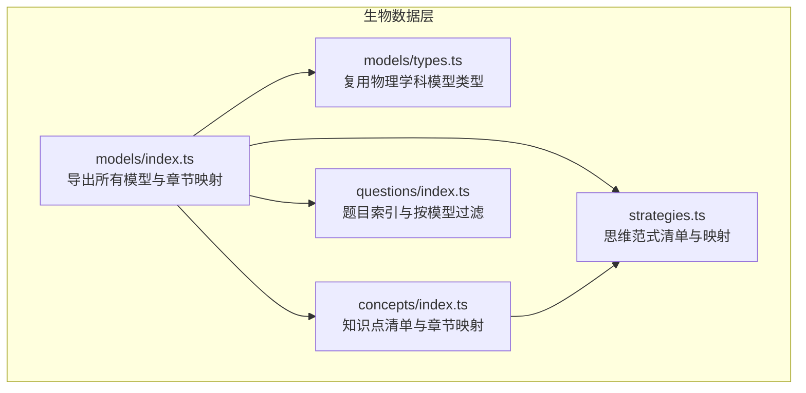
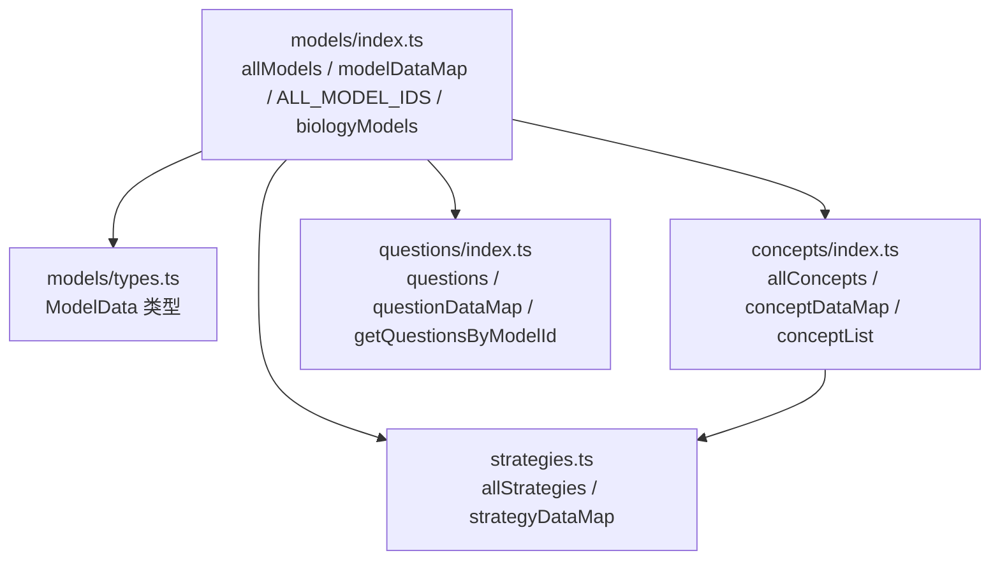
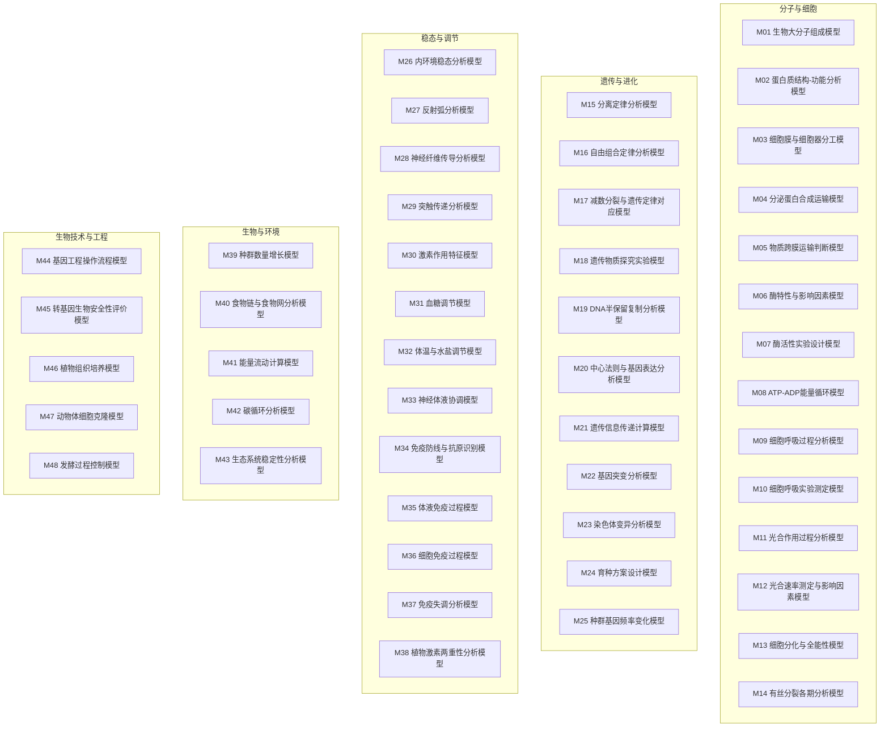
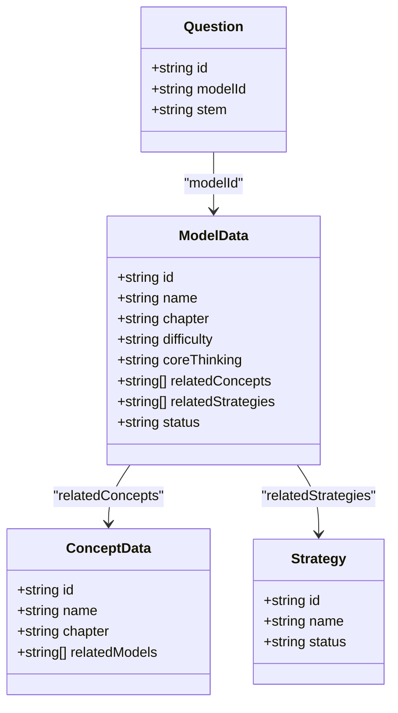
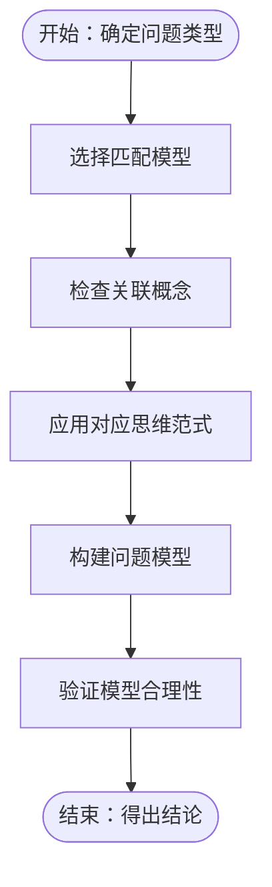
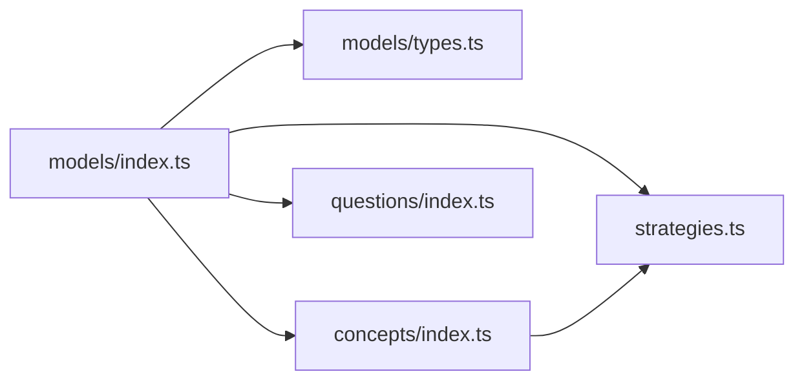

# 生物核心模型

<cite>
**本文引用的文件**
- [src/data/biology/models/index.ts](file://src/data/biology/models/index.ts)
- [src/data/biology/models/types.ts](file://src/data/biology/models/types.ts)
- [src/data/biology/models/M01_生物大分子组成模型.ts](file://src/data/biology/models/M01_生物大分子组成模型.ts)
- [src/data/biology/models/M02_蛋白质结构功能分析模型.ts](file://src/data/biology/models/M02_蛋白质结构功能分析模型.ts)
- [src/data/biology/models/M48_发酵过程控制模型.ts](file://src/data/biology/models/M48_发酵过程控制模型.ts)
- [src/data/biology/concepts/index.ts](file://src/data/biology/concepts/index.ts)
- [src/data/biology/concepts/types.ts](file://src/data/biology/concepts/types.ts)
- [src/data/biology/strategies.ts](file://src/data/biology/strategies.ts)
- [src/data/biology/questions/index.ts](file://src/data/biology/questions/index.ts)
</cite>

## 目录
1. [引言](#引言)
2. [项目结构](#项目结构)
3. [核心组件](#核心组件)
4. [架构总览](#架构总览)
5. [详细组件分析](#详细组件分析)
6. [依赖分析](#依赖分析)
7. [性能考虑](#性能考虑)
8. [故障排查指南](#故障排查指南)
9. [结论](#结论)
10. [附录](#附录)

## 引言
本文件面向星耀平台生物学科“M层核心模型”体系，系统梳理并文档化48个关键模型的分类、适用场景、解题思路与应用技巧，并阐明模型间的关联关系与迁移应用路径。通过对模型的结构化呈现与可视化图示，帮助教师与学习者建立“模型化思维”，以应对复杂生物学问题。

## 项目结构
生物M层核心模型位于数据层，采用按主题分模块的组织方式：models（模型）、concepts（概念）、strategies（思维范式）、questions（题目）。其中：
- models 提供48个模型的统一数据结构与分章聚合；
- concepts 提供与模型相关联的知识点清单；
- strategies 提供与模型配套的思维范式；
- questions 提供与模型绑定的题目索引。

图表来源
- [src/data/biology/models/index.ts:1-191](file://src/data/biology/models/index.ts#L1-L191)
- [src/data/biology/models/types.ts:1-3](file://src/data/biology/models/types.ts#L1-L3)
- [src/data/biology/concepts/index.ts:1-201](file://src/data/biology/concepts/index.ts#L1-L201)
- [src/data/biology/strategies.ts:1-78](file://src/data/biology/strategies.ts#L1-L78)
- [src/data/biology/questions/index.ts:1-15](file://src/data/biology/questions/index.ts#L1-L15)

章节来源
- [src/data/biology/models/index.ts:1-191](file://src/data/biology/models/index.ts#L1-L191)
- [src/data/biology/concepts/index.ts:1-201](file://src/data/biology/concepts/index.ts#L1-L201)
- [src/data/biology/strategies.ts:1-78](file://src/data/biology/strategies.ts#L1-L78)
- [src/data/biology/questions/index.ts:1-15](file://src/data/biology/questions/index.ts#L1-L15)

## 核心组件
- 模型数据结构：统一使用 ModelData 类型，包含模型标识、名称、所属章节、难度、核心思维、关联知识点、关联策略、状态等字段。
- 模型聚合：按章节分组导出，便于前端导航与检索；同时提供全局映射与ID列表，支持快速查询。
- 知识点与策略：模型通过ID关联到概念与策略，形成“模型—概念—策略”的知识链路。
- 题目索引：提供按模型ID过滤题目集合的能力，支撑“模型驱动的练习”。

章节来源
- [src/data/biology/models/index.ts:56-191](file://src/data/biology/models/index.ts#L56-L191)
- [src/data/biology/models/types.ts:1-3](file://src/data/biology/models/types.ts#L1-L3)
- [src/data/biology/strategies.ts:1-78](file://src/data/biology/strategies.ts#L1-L78)
- [src/data/biology/questions/index.ts:1-15](file://src/data/biology/questions/index.ts#L1-L15)

## 架构总览
下图展示了模型层的整体架构与数据流：模型注册与分组、与概念/策略的关联、以及与题目的索引关系。

图表来源
- [src/data/biology/models/index.ts:1-191](file://src/data/biology/models/index.ts#L1-L191)
- [src/data/biology/models/types.ts:1-3](file://src/data/biology/models/types.ts#L1-L3)
- [src/data/biology/concepts/index.ts:1-201](file://src/data/biology/concepts/index.ts#L1-L201)
- [src/data/biology/strategies.ts:1-78](file://src/data/biology/strategies.ts#L1-L78)
- [src/data/biology/questions/index.ts:1-15](file://src/data/biology/questions/index.ts#L1-L15)

## 详细组件分析

### 模型分类与章节映射
生物M层核心模型按知识领域分为五大类：
- 分子与细胞
- 遗传与进化
- 稳态与调节
- 生物与环境
- 生物技术与工程

每类模型均对应若干核心概念与思维范式，形成“模型—概念—策略”的闭环。

图表来源
- [src/data/biology/models/index.ts:113-187](file://src/data/biology/models/index.ts#L113-L187)

章节来源
- [src/data/biology/models/index.ts:113-187](file://src/data/biology/models/index.ts#L113-L187)

### 模型数据结构与类型
- 统一类型：ModelData 复用物理学科模型类型，确保跨学科一致的数据契约。
- 字段说明（以通用形式描述）：id、name、chapter、difficulty、coreThinking、relatedConcepts、relatedStrategies、status。
- 关联关系：模型通过ID关联概念与策略；questions 通过 modelId 关联模型。

图表来源
- [src/data/biology/models/types.ts:1-3](file://src/data/biology/models/types.ts#L1-L3)
- [src/data/biology/concepts/types.ts:1-3](file://src/data/biology/concepts/types.ts#L1-L3)
- [src/data/biology/strategies.ts:1-78](file://src/data/biology/strategies.ts#L1-L78)
- [src/data/biology/questions/index.ts:1-15](file://src/data/biology/questions/index.ts#L1-L15)

章节来源
- [src/data/biology/models/types.ts:1-3](file://src/data/biology/models/types.ts#L1-L3)
- [src/data/biology/concepts/types.ts:1-3](file://src/data/biology/concepts/types.ts#L1-L3)
- [src/data/biology/strategies.ts:1-78](file://src/data/biology/strategies.ts#L1-L78)
- [src/data/biology/questions/index.ts:1-15](file://src/data/biology/questions/index.ts#L1-L15)

### 模型示例与应用要点

#### 示例一：M01 生物大分子组成模型
- 适用场景：理解生物体内四大类生物大分子的组成与功能定位。
- 解题思路：以“结构与功能观”为主线，结合相关概念（如蛋白质、核酸、糖类、脂质）进行归类与对比。
- 应用技巧：强调“结构决定功能”的思维范式，构建“组成—结构—功能”的知识链。
- 关联策略：S01（性质-方向-能量范式）、S47（定量分析范式）等可作为辅助。

章节来源
- [src/data/biology/models/M01_生物大分子组成模型.ts:1-12](file://src/data/biology/models/M01_生物大分子组成模型.ts#L1-L12)
- [src/data/biology/strategies.ts:1-78](file://src/data/biology/strategies.ts#L1-L78)

#### 示例二：M02 蛋白质结构-功能分析模型
- 适用场景：分析蛋白质的空间结构与其功能的关系。
- 解题思路：从一级到高级结构逐层分析，结合变性、活性中心等关键点。
- 应用技巧：使用“结构功能对应范式”，建立“结构—稳定性—功能”的因果链。
- 关联策略：S06（结构功能对应范式）、S49（能量守恒范式）。

章节来源
- [src/data/biology/models/M02_蛋白质结构功能分析模型.ts:1-12](file://src/data/biology/models/M02_蛋白质结构功能分析模型.ts#L1-L12)
- [src/data/biology/strategies.ts:1-78](file://src/data/biology/strategies.ts#L1-L78)

#### 示例三：M48 发酵过程控制模型
- 适用场景：工业发酵过程中对温度、pH、溶氧、补料等参数的控制策略。
- 解题思路：以“过程优化”为核心，建立“输入—过程—输出”的控制回路。
- 应用技巧：采用“过程优化范式”，结合监测与反馈机制实现稳定生产。
- 关联策略：S37（过程优化范式）、S40（因果推断范式）。

章节来源
- [src/data/biology/models/M48_发酵过程控制模型.ts:1-12](file://src/data/biology/models/M48_发酵过程控制模型.ts#L1-L12)
- [src/data/biology/strategies.ts:1-78](file://src/data/biology/strategies.ts#L1-L78)

### 模型选择与使用指导
- 依据问题类型选择模型：若涉及物质组成与功能，优先考虑“分子与细胞”类模型；若涉及遗传规律，优先考虑“遗传与进化”类模型；若涉及稳态调节，优先考虑“稳态与调节”类模型；若涉及生态与环境，优先考虑“生物与环境”类模型；若涉及技术应用，优先考虑“生物技术与工程”类模型。
- 结合核心思维与策略：每个模型都标注了核心思维（如“结构决定功能”“过程优化”等），并配有对应的思维范式，用于指导解题步骤与方法论。
- 迁移应用：同一范式可在不同模型间迁移。例如，“过程建模范式”既可用于细胞呼吸分析，也可用于光合作用或发酵过程控制。

章节来源
- [src/data/biology/models/index.ts:56-191](file://src/data/biology/models/index.ts#L56-L191)
- [src/data/biology/strategies.ts:1-78](file://src/data/biology/strategies.ts#L1-L78)

### 概念与策略的关联
- 概念关联：模型通过 relatedConcepts 指向具体知识点，便于知识溯源与复习。
- 策略关联：模型通过 relatedStrategies 指向思维范式，形成“方法—模型—知识”的联动。

图表来源
- [src/data/biology/models/index.ts:56-191](file://src/data/biology/models/index.ts#L56-L191)
- [src/data/biology/concepts/index.ts:1-201](file://src/data/biology/concepts/index.ts#L1-L201)
- [src/data/biology/strategies.ts:1-78](file://src/data/biology/strategies.ts#L1-L78)

章节来源
- [src/data/biology/concepts/index.ts:1-201](file://src/data/biology/concepts/index.ts#L1-L201)
- [src/data/biology/strategies.ts:1-78](file://src/data/biology/strategies.ts#L1-L78)

## 依赖分析
- 模型依赖：models/index.ts 导出 allModels、modelDataMap、ALL_MODEL_IDS、biologyModels，作为前端导航与检索的基础。
- 类型依赖：models/types.ts 复用物理学科的 ModelData 类型，保证跨学科一致性。
- 关联依赖：模型依赖 concepts 与 strategies 的 ID 列表；questions 依赖模型ID进行过滤。
- 数据一致性：通过 Map 与数组的双重结构，确保 O(1) 查询与顺序遍历的灵活性。

图表来源
- [src/data/biology/models/index.ts:1-191](file://src/data/biology/models/index.ts#L1-L191)
- [src/data/biology/models/types.ts:1-3](file://src/data/biology/models/types.ts#L1-L3)
- [src/data/biology/concepts/index.ts:1-201](file://src/data/biology/concepts/index.ts#L1-L201)
- [src/data/biology/strategies.ts:1-78](file://src/data/biology/strategies.ts#L1-L78)
- [src/data/biology/questions/index.ts:1-15](file://src/data/biology/questions/index.ts#L1-L15)

章节来源
- [src/data/biology/models/index.ts:1-191](file://src/data/biology/models/index.ts#L1-L191)
- [src/data/biology/models/types.ts:1-3](file://src/data/biology/models/types.ts#L1-L3)
- [src/data/biology/concepts/index.ts:1-201](file://src/data/biology/concepts/index.ts#L1-L201)
- [src/data/biology/strategies.ts:1-78](file://src/data/biology/strategies.ts#L1-L78)
- [src/data/biology/questions/index.ts:1-15](file://src/data/biology/questions/index.ts#L1-L15)

## 性能考虑
- 查询效率：modelDataMap、conceptDataMap、strategyDataMap 使用 Map 结构，提供 O(1) 的按ID查找能力。
- 批量访问：ALL_MODEL_IDS 与 conceptList 支持顺序遍历与分页加载。
- 数据规模：当前模型与概念数量可控，建议保持扁平化存储与按需懒加载，避免一次性渲染全部内容。

## 故障排查指南
- 模型缺失：若出现“模型不存在”提示，检查模型ID是否正确，确认 models/index.ts 中是否存在该模型导出。
- 关联错误：若模型无法关联到概念或策略，检查 relatedConcepts 与 relatedStrategies 的ID拼写与存在性。
- 题目过滤异常：若按模型ID过滤题目为空，检查 questions 中的 modelId 字段是否与目标模型ID一致。
- 类型不兼容：若类型报错，确认 models/types.ts 是否与物理学科类型保持一致。

章节来源
- [src/data/biology/models/index.ts:107-111](file://src/data/biology/models/index.ts#L107-L111)
- [src/data/biology/questions/index.ts:13-15](file://src/data/biology/questions/index.ts#L13-L15)

## 结论
星耀平台生物M层核心模型以“模型—概念—策略—题目”为主线，构建了覆盖五大领域的48个关键模型。通过统一的数据结构、清晰的章节映射与配套的思维范式，能够有效支撑教学与学习中的“模型化思维”。建议在实际使用中遵循“问题类型—模型选择—范式应用—模型验证”的流程，逐步提升解决复杂生物学问题的能力。

## 附录
- 模型与章节映射：见“章节来源”中 models/index.ts 的 biologyModels 定义。
- 概念与策略清单：分别见 concepts/index.ts 与 strategies.ts 的 allConcepts/allStrategies。
- 题目索引：见 questions/index.ts 的 getQuestionsByModelId 方法。