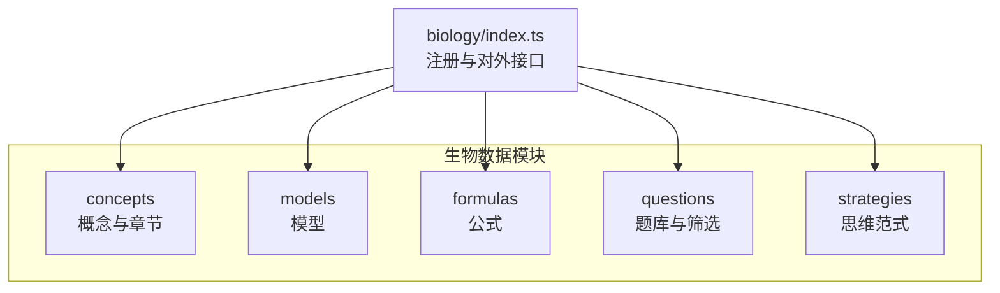
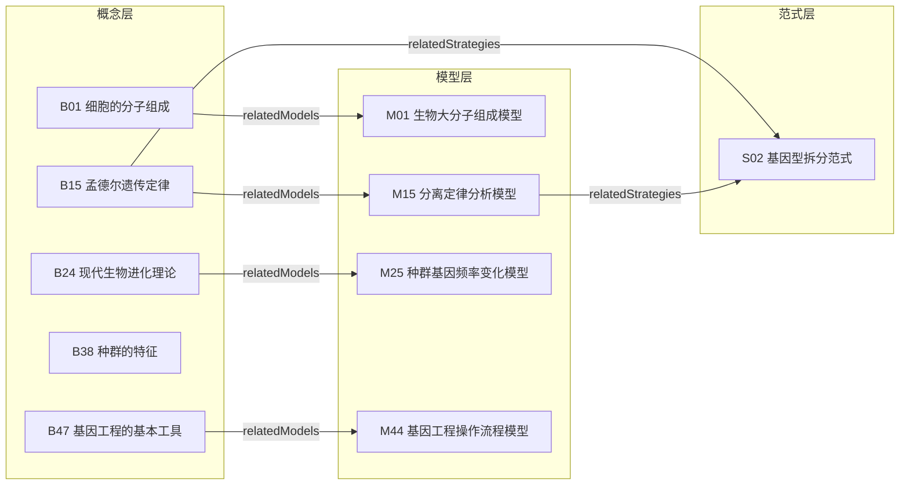
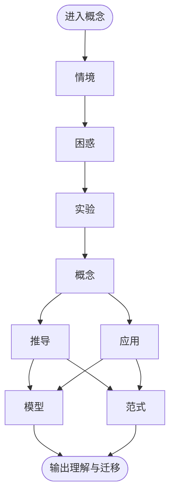
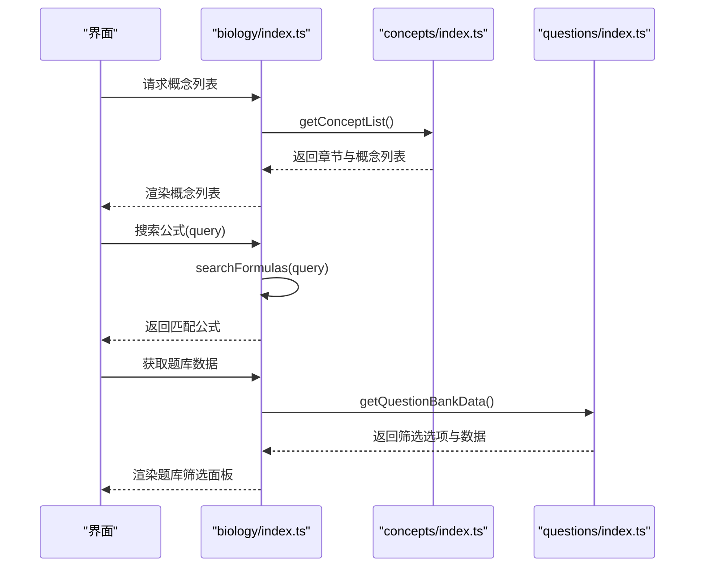
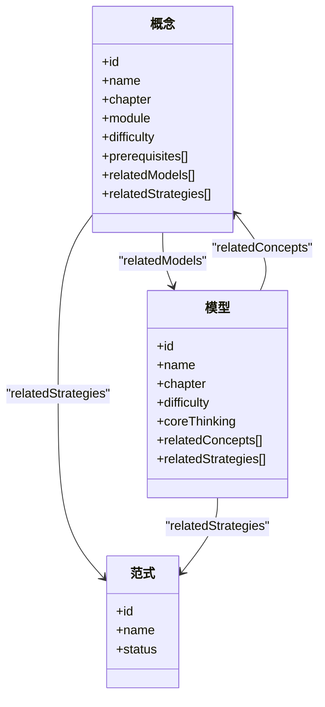
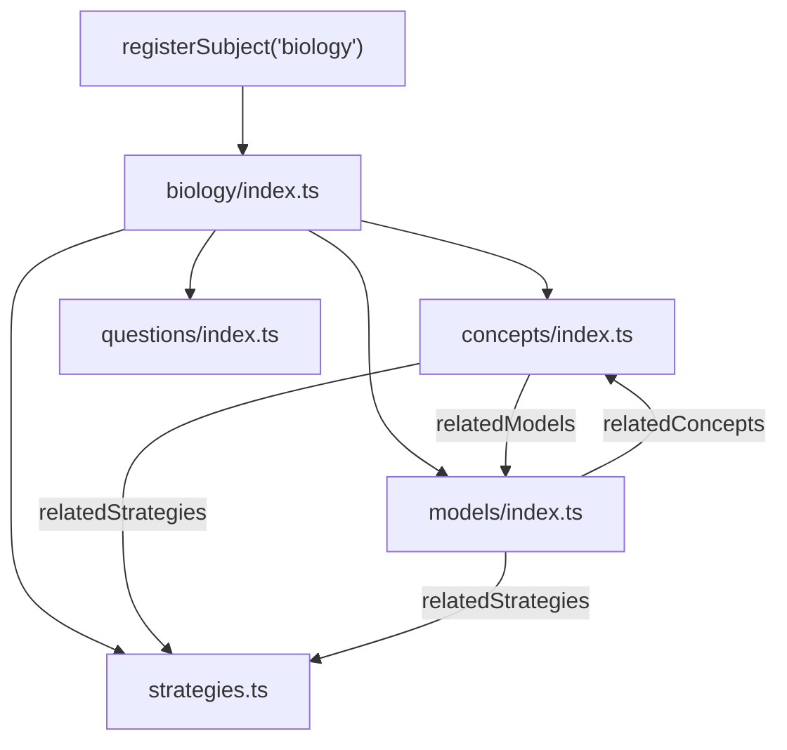

# 生物知识节点

<cite>
**本文引用的文件**
- [src/data/biology/index.ts](file://src/data/biology/index.ts)
- [src/data/biology/concepts/index.ts](file://src/data/biology/concepts/index.ts)
- [src/data/biology/concepts/types.ts](file://src/data/biology/concepts/types.ts)
- [src/data/biology/concepts/B01_细胞的分子组成.ts](file://src/data/biology/concepts/B01_细胞的分子组成.ts)
- [src/data/biology/concepts/B15_孟德尔遗传定律.ts](file://src/data/biology/concepts/B15_孟德尔遗传定律.ts)
- [src/data/biology/concepts/B24_现代生物进化理论.ts](file://src/data/biology/concepts/B24_现代生物进化理论.ts)
- [src/data/biology/concepts/B38_种群的特征.ts](file://src/data/biology/concepts/B38_种群的特征.ts)
- [src/data/biology/concepts/B47_基因工程的基本工具.ts](file://src/data/biology/concepts/B47_基因工程的基本工具.ts)
- [src/data/biology/models/M01_生物大分子组成模型.ts](file://src/data/biology/models/M01_生物大分子组成模型.ts)
- [src/data/biology/models/M15_分离定律分析模型.ts](file://src/data/biology/models/M15_分离定律分析模型.ts)
- [src/data/biology/models/M25_种群基因频率变化模型.ts](file://src/data/biology/models/M25_种群基因频率变化模型.ts)
- [src/data/biology/models/M44_基因工程操作流程模型.ts](file://src/data/biology/models/M44_基因工程操作流程模型.ts)
- [src/data/biology/questions/filters.ts](file://src/data/biology/questions/filters.ts)
- [src/data/biology/questions/index.ts](file://src/data/biology/questions/index.ts)
- [src/data/registry.ts](file://src/data/registry.ts)
</cite>

## 目录
1. [引言](#引言)
2. [项目结构](#项目结构)
3. [核心组件](#核心组件)
4. [架构总览](#架构总览)
5. [详细组件分析](#详细组件分析)
6. [依赖分析](#依赖分析)
7. [性能考虑](#性能考虑)
8. [故障排查指南](#故障排查指南)
9. [结论](#结论)
10. [附录](#附录)

## 引言
本文件面向“星耀平台”生物学科的知识节点，系统化梳理并文档化K层（概念）知识节点的组织结构与体系。围绕52个核心概念，明确其层级结构（情境、困惑、实验、概念、推导、应用）、难度分级（基础、核心、扩展），并给出六大模块（分子与细胞、遗传与进化、稳态与调节、生物与环境、生物技术与工程、生物与技术）的分类体系。同时，文档化概念检索与过滤机制，解释如何通过模块化设计实现知识的系统化组织，并展示概念间的逻辑关系与学习路径，帮助学生建立完整的生物学知识框架。

## 项目结构
生物学科数据位于 src/data/biology 目录下，采用“按主题域划分”的模块化组织方式：
- concepts：概念定义与章节组织（52个概念）
- models：模型定义（用于承载“推导”与“应用”）
- formulas：公式章节与数据
- questions：题库与筛选配置
- strategies：思维范式（用于承载“推导”与“应用”中的方法论）

图表来源
- [src/data/biology/index.ts:126-151](file://src/data/biology/index.ts#L126-L151)
- [src/data/biology/concepts/index.ts:119-197](file://src/data/biology/concepts/index.ts#L119-L197)

章节来源
- [src/data/biology/index.ts:1-151](file://src/data/biology/index.ts#L1-151)
- [src/data/biology/concepts/index.ts:1-201](file://src/data/biology/concepts/index.ts#L1-L201)

## 核心组件
- 概念（ConceptData）：描述单个知识点的元数据，包含章节、模块、难度、前置概念、关联模型与范式等。
- 模型（ModelData）：承载“推导/应用”阶段的结构化知识载体，体现核心思维与相关概念。
- 思维范式（Strategy）：抽象的学习方法与思维模型，贯穿“推导/应用”环节。
- 题目（Question）：题库条目，支持按难度、目标、功能、类型等维度筛选。
- 注册中心（registerSubject）：统一注册生物学科数据接口，供前端页面与工具使用。

章节来源
- [src/data/biology/concepts/types.ts:1-3](file://src/data/biology/concepts/types.ts#L1-L3)
- [src/data/biology/concepts/index.ts:60-117](file://src/data/biology/concepts/index.ts#L60-L117)
- [src/data/biology/models/M01_生物大分子组成模型.ts:1-12](file://src/data/biology/models/M01_生物大分子组成模型.ts#L1-L12)
- [src/data/biology/strategies.ts:1-78](file://src/data/biology/strategies.ts#L1-L78)
- [src/data/biology/questions/filters.ts:1-38](file://src/data/biology/questions/filters.ts#L1-L38)
- [src/data/registry.ts](file://src/data/registry.ts)

## 架构总览
生物数据的对外接口由 biology/index.ts 统一导出，内部通过 Map/数组聚合概念、模型、公式、题库与范式，并提供查询、统计与检索能力。概念与模型之间通过 relatedConcepts/relatedModels 建立双向关联，形成“概念—模型—范式”的知识闭环。

图表来源
- [src/data/biology/concepts/B01_细胞的分子组成.ts:3-13](file://src/data/biology/concepts/B01_细胞的分子组成.ts#L3-L13)
- [src/data/biology/concepts/B15_孟德尔遗传定律.ts:3-13](file://src/data/biology/concepts/B15_孟德尔遗传定律.ts#L3-L13)
- [src/data/biology/concepts/B24_现代生物进化理论.ts:3-13](file://src/data/biology/concepts/B24_现代生物进化理论.ts#L3-L13)
- [src/data/biology/concepts/B47_基因工程的基本工具.ts:3-13](file://src/data/biology/concepts/B47_基因工程的基本工具.ts#L3-L13)
- [src/data/biology/models/M01_生物大分子组成模型.ts:3-12](file://src/data/biology/models/M01_生物大分子组成模型.ts#L3-L12)
- [src/data/biology/models/M15_分离定律分析模型.ts:3-12](file://src/data/biology/models/M15_分离定律分析模型.ts#L3-L12)
- [src/data/biology/models/M25_种群基因频率变化模型.ts:3-12](file://src/data/biology/models/M25_种群基因频率变化模型.ts#L3-L12)
- [src/data/biology/models/M44_基因工程操作流程模型.ts:3-12](file://src/data/biology/models/M44_基因工程操作流程模型.ts#L3-L12)
- [src/data/biology/strategies.ts:9-70](file://src/data/biology/strategies.ts#L9-L70)

## 详细组件分析

### 概念层级结构与难度分级
- 层级结构（情境、困惑、实验、概念、推导、应用）：概念作为“概念”层级的载体，通过 relatedModels 与模型对接“推导/应用”，并通过 relatedStrategies 与范式对接“推导/应用”的方法论。
- 难度分级：概念的 difficulty 字段分为基础（B）、核心（J）、扩展（T），在对外接口中映射为数值以便排序与筛选。

图表来源
- [src/data/biology/concepts/types.ts:1-3](file://src/data/biology/concepts/types.ts#L1-L3)
- [src/data/biology/concepts/B01_细胞的分子组成.ts:3-13](file://src/data/biology/concepts/B01_细胞的分子组成.ts#L3-L13)
- [src/data/biology/strategies.ts:9-70](file://src/data/biology/strategies.ts#L9-L70)

章节来源
- [src/data/biology/concepts/B01_细胞的分子组成.ts:3-13](file://src/data/biology/concepts/B01_细胞的分子组成.ts#L3-L13)
- [src/data/biology/concepts/B15_孟德尔遗传定律.ts:3-13](file://src/data/biology/concepts/B15_孟德尔遗传定律.ts#L3-L13)
- [src/data/biology/concepts/B24_现代生物进化理论.ts:3-13](file://src/data/biology/concepts/B24_现代生物进化理论.ts#L3-L13)
- [src/data/biology/concepts/B38_种群的特征.ts:3-13](file://src/data/biology/concepts/B38_种群的特征.ts#L3-L13)
- [src/data/biology/concepts/B47_基因工程的基本工具.ts:3-13](file://src/data/biology/concepts/B47_基因工程的基本工具.ts#L3-L13)

### 六大模块分类体系
- 分子与细胞（必修1）
- 遗传与进化（必修2）
- 稳态与调节（选择性必修1）
- 生物与环境（选择性必修2）
- 生物技术与工程（选择性必修3）
- 生物与技术（跨模块整合）

章节来源
- [src/data/biology/concepts/index.ts:119-197](file://src/data/biology/concepts/index.ts#L119-L197)

### 概念检索与过滤机制
- 概念列表检索：通过 getConceptList 将章节与概念映射为可浏览结构；通过 getAllConceptIds 获取全部概念ID；通过 getConceptMeta 获取概念元信息（含模块、章节、难度）。
- 公式检索：searchFormulas 支持按名称或章节模糊匹配。
- 题目筛选：questions/filters.ts 定义了难度、目标、功能、类型等选项，questions/index.ts 提供按模型ID筛选题目与统计的能力。

图表来源
- [src/data/biology/index.ts:11-25](file://src/data/biology/index.ts#L11-L25)
- [src/data/biology/index.ts:51-64](file://src/data/biology/index.ts#L51-L64)
- [src/data/biology/index.ts:66-100](file://src/data/biology/index.ts#L66-L100)
- [src/data/biology/concepts/index.ts:119-197](file://src/data/biology/concepts/index.ts#L119-L197)
- [src/data/biology/questions/index.ts:1-15](file://src/data/biology/questions/index.ts#L1-L15)
- [src/data/biology/questions/filters.ts:1-38](file://src/data/biology/questions/filters.ts#L1-L38)

章节来源
- [src/data/biology/index.ts:11-25](file://src/data/biology/index.ts#L11-L25)
- [src/data/biology/index.ts:51-64](file://src/data/biology/index.ts#L51-L64)
- [src/data/biology/index.ts:66-100](file://src/data/biology/index.ts#L66-L100)
- [src/data/biology/questions/filters.ts:1-38](file://src/data/biology/questions/filters.ts#L1-L38)
- [src/data/biology/questions/index.ts:1-15](file://src/data/biology/questions/index.ts#L1-L15)

### 概念—模型—范式的关联与学习路径
- 关联方式：概念通过 relatedModels 指向模型，模型通过 relatedConcepts 反向指向概念；部分概念通过 relatedStrategies 指向范式，模型亦可指向范式。
- 学习路径：以“概念—模型—范式”为主线，先通过概念建立认知，再借助模型深化推导与应用，最后以范式提升迁移与迁移能力。

图表来源
- [src/data/biology/concepts/B01_细胞的分子组成.ts:3-13](file://src/data/biology/concepts/B01_细胞的分子组成.ts#L3-L13)
- [src/data/biology/models/M01_生物大分子组成模型.ts:3-12](file://src/data/biology/models/M01_生物大分子组成模型.ts#L3-L12)
- [src/data/biology/strategies.ts:9-70](file://src/data/biology/strategies.ts#L9-L70)

章节来源
- [src/data/biology/models/M01_生物大分子组成模型.ts:3-12](file://src/data/biology/models/M01_生物大分子组成模型.ts#L3-L12)
- [src/data/biology/models/M15_分离定律分析模型.ts:3-12](file://src/data/biology/models/M15_分离定律分析模型.ts#L3-L12)
- [src/data/biology/models/M25_种群基因频率变化模型.ts:3-12](file://src/data/biology/models/M25_种群基因频率变化模型.ts#L3-L12)
- [src/data/biology/models/M44_基因工程操作流程模型.ts:3-12](file://src/data/biology/models/M44_基因工程操作流程模型.ts#L3-L12)

## 依赖分析
- 概念到模型：概念定义中通过 relatedModels 指向具体模型ID，模型定义中通过 relatedConcepts 指回概念ID，形成双向索引。
- 概念到范式：部分概念通过 relatedStrategies 指向范式ID，模型亦可指向范式ID。
- 注册与暴露：biology/index.ts 使用 registerSubject 将上述数据与接口统一注册，供前端页面与工具调用。

图表来源
- [src/data/biology/index.ts:126-151](file://src/data/biology/index.ts#L126-L151)
- [src/data/biology/concepts/index.ts:115-117](file://src/data/biology/concepts/index.ts#L115-L117)
- [src/data/biology/models/M01_生物大分子组成模型.ts:3-12](file://src/data/biology/models/M01_生物大分子组成模型.ts#L3-L12)
- [src/data/biology/strategies.ts:72-74](file://src/data/biology/strategies.ts#L72-L74)

章节来源
- [src/data/biology/index.ts:126-151](file://src/data/biology/index.ts#L126-L151)
- [src/data/biology/concepts/index.ts:115-117](file://src/data/biology/concepts/index.ts#L115-L117)
- [src/data/biology/strategies.ts:72-74](file://src/data/biology/strategies.ts#L72-L74)

## 性能考虑
- 数据聚合：概念、模型、范式均以 Map/数组形式在内存中聚合，查询复杂度为 O(1)/O(n) 的典型操作，适合前端直接消费。
- 检索策略：公式搜索采用字符串包含匹配，建议在数据量增大时引入索引或分词策略以提升性能。
- 题库统计：getModelQuestionStats 与 getQuestionsByModel 通过一次遍历完成统计与分组，复杂度 O(n)，在当前规模下性能可接受。

## 故障排查指南
- 概念缺失：若 getConceptMeta 返回空，检查 conceptDataMap 中是否存在该ID，确认 concepts/index.ts 是否正确导出并注册。
- 模型缺失：若 relatedModels 指向不存在的模型ID，需在 models/index.ts 中补齐或修正概念的 relatedModels。
- 题目筛选异常：确认 questions/index.ts 的 questionDataMap 与过滤选项 filters.ts 的配置一致，避免ID不匹配导致筛选失效。
- 注册失败：若 registerSubject('biology') 未生效，检查 biology/index.ts 的导出是否完整，以及调用端是否正确加载该模块。

章节来源
- [src/data/biology/index.ts:27-36](file://src/data/biology/index.ts#L27-L36)
- [src/data/biology/concepts/index.ts:115-117](file://src/data/biology/concepts/index.ts#L115-L117)
- [src/data/biology/questions/index.ts:5-7](file://src/data/biology/questions/index.ts#L5-L7)
- [src/data/biology/questions/filters.ts:1-38](file://src/data/biology/questions/filters.ts#L1-L38)

## 结论
通过“概念—模型—范式”的三层结构，结合六大模块的系统化组织，星耀平台的生物K层知识节点实现了从“情境—困惑—实验—概念—推导—应用”的完整学习闭环。模块化设计与统一注册机制使得概念检索、公式检索与题库筛选具备良好的可维护性与扩展性。建议在后续迭代中完善概念的前置依赖图谱与范式覆盖度，进一步强化学习路径的可导航性与个性化推荐能力。

## 附录
- 52个核心概念分布于六大模块，章节组织清晰，便于按模块与章节进行检索与学习。
- 模型与范式作为“推导—应用”的桥梁，应持续补充与完善，以支撑更高阶的迁移与创新学习。