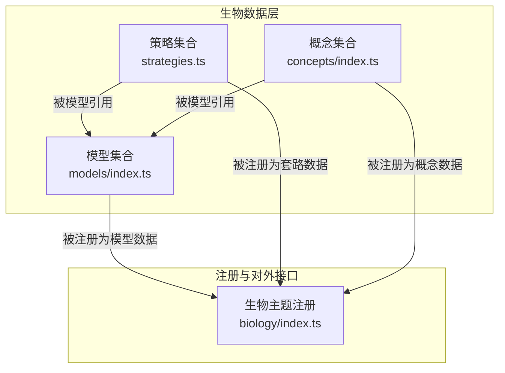
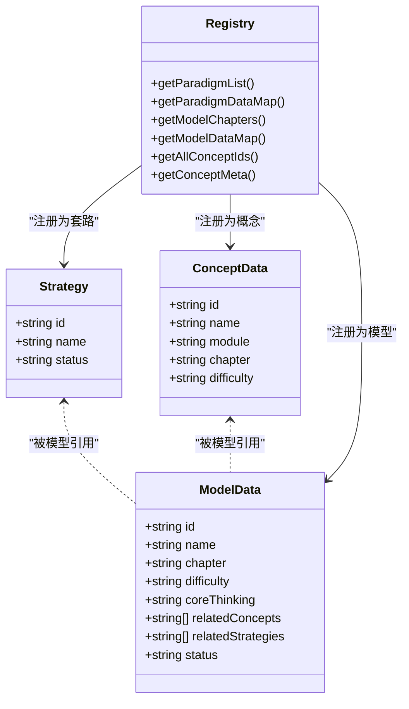
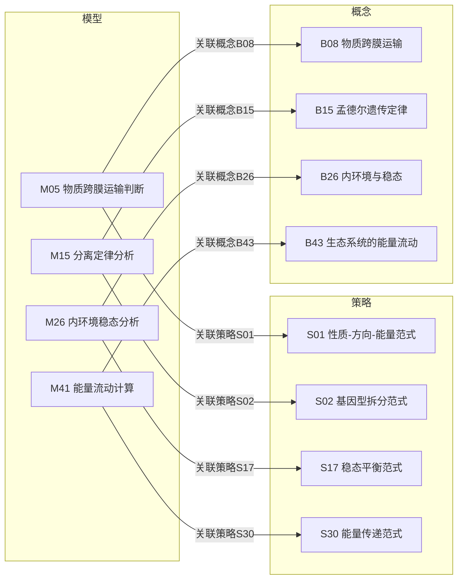
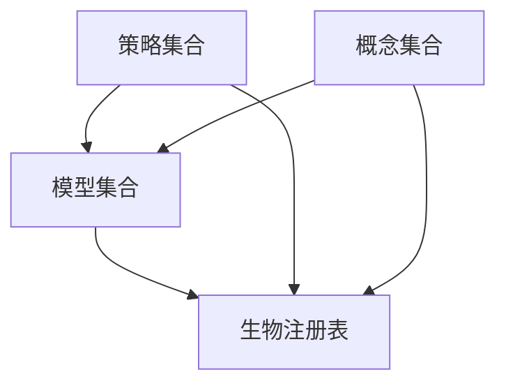

# 生物解题套路

<cite>
**本文引用的文件**
- [strategies.ts](file://src/data/biology/strategies.ts)
- [index.ts](file://src/data/biology/index.ts)
- [models/index.ts](file://src/data/biology/models/index.ts)
- [models/types.ts](file://src/data/biology/models/types.ts)
- [concepts/index.ts](file://src/data/biology/concepts/index.ts)
- [concepts/types.ts](file://src/data/biology/concepts/types.ts)
- [questions/index.ts](file://src/data/biology/questions/index.ts)
- [M15_分离定律分析模型.ts](file://src/data/biology/models/M15_分离定律分析模型.ts)
- [M05_物质跨膜运输判断模型.ts](file://src/data/biology/models/M05_物质跨膜运输判断模型.ts)
- [M26_内环境稳态分析模型.ts](file://src/data/biology/models/M26_内环境稳态分析模型.ts)
- [M41_能量流动计算模型.ts](file://src/data/biology/models/M41_能量流动计算模型.ts)
</cite>

## 目录
1. [引言](#引言)
2. [项目结构](#项目结构)
3. [核心组件](#核心组件)
4. [架构总览](#架构总览)
5. [详细组件分析](#详细组件分析)
6. [依赖分析](#依赖分析)
7. [性能考虑](#性能考虑)
8. [故障排查指南](#故障排查指南)
9. [结论](#结论)
10. [附录](#附录)

## 引言
本文件面向星耀平台生物学科“解题套路”体系，系统化梳理并呈现生物R层（解题套路）的完整框架。基于仓库现有数据结构，我们将：
- 解释套路的类型划分与命名范式
- 对照模型与概念，给出适用题型、解题步骤与技巧要点
- 展示套路间的组合与迁移应用
- 提供系统化训练方法与实战演练建议
- 以可视化图示辅助理解与记忆

## 项目结构
生物R层数据由三层构成：策略（Strategies）、模型（Models）、概念（Concepts）。策略作为顶层“套路”，模型承载“具体题型+核心思维”，概念提供“知识点锚点”。三者通过ID建立关联，形成“套路—模型—概念”的知识闭环。

图表来源
- [strategies.ts:1-78](file://src/data/biology/strategies.ts#L1-L78)
- [models/index.ts:1-191](file://src/data/biology/models/index.ts#L1-L191)
- [concepts/index.ts:1-201](file://src/data/biology/concepts/index.ts#L1-L201)
- [index.ts:126-151](file://src/data/biology/index.ts#L126-L151)

章节来源
- [index.ts:1-151](file://src/data/biology/index.ts#L1-L151)

## 核心组件
- 策略（Strategies）
  - 定义：生物解题套路的抽象集合，每条策略含唯一ID、名称与状态
  - 结构：数组+映射，支持按ID快速检索
  - 入口：对外暴露获取策略列表、映射与按ID查询的方法
- 模型（Models）
  - 定义：具体题型与核心思维的载体，包含章节、难度、核心思维、关联概念与策略、状态
  - 结构：按模块分章汇总，统一导出映射与ID列表
  - 关联：通过relatedStrategies指向策略，通过relatedConcepts指向概念
- 概念（Concepts）
  - 定义：知识点清单，按模块分章
  - 结构：章节化列表+映射，支持按ID查询
- 注册（Registry）
  - 定义：将生物学科的数据能力注册到全局主题注册表
  - 能力：提供概念、模型、公式、套路、题库等查询接口

章节来源
- [strategies.ts:1-78](file://src/data/biology/strategies.ts#L1-L78)
- [models/index.ts:1-191](file://src/data/biology/models/index.ts#L1-L191)
- [concepts/index.ts:1-201](file://src/data/biology/concepts/index.ts#L1-L201)
- [index.ts:126-151](file://src/data/biology/index.ts#L126-L151)

## 架构总览
下图展示“套路—模型—概念”的关联关系与注册入口：

图表来源
- [strategies.ts:1-78](file://src/data/biology/strategies.ts#L1-L78)
- [models/index.ts:107-191](file://src/data/biology/models/index.ts#L107-L191)
- [concepts/index.ts:115-201](file://src/data/biology/concepts/index.ts#L115-L201)
- [index.ts:126-151](file://src/data/biology/index.ts#L126-L151)

## 详细组件分析

### 策略（Strategies）体系
- 类型划分与命名范式
  - 命名采用“领域+核心思维+范式”的结构，如“性质-方向-能量范式（物质跨膜运输判断）”
  - 通过“核心思维”提炼解题抓手，便于迁移与组合
- 分类维度（基于现有策略命名与模型映射）
  - 遗传计算套路：如“基因型拆分范式（分离定律分析）”、“独立分配范式（自由组合定律）”等
  - 生态分析套路：如“能量传递范式（能量流动）”、“物质循环范式（碳循环）”等
  - 实验设计套路：如“变量控制范式（酶活性实验）”、“对照实验范式”等
  - 生理调节套路：如“稳态平衡范式（内环境分析）”、“负反馈调节范式（血糖调节）”等
  - 进化分析套路：如“进化计算范式（基因频率）”、“系统稳定范式（生态系统稳定性）”等
  - 技术工程套路：如“工程流程范式（基因工程）”、“风险评估范式（转基因安全）”等
  - 思维方法套路：如“系统观范式（细胞结构分析）”、“类比推理范式（知识迁移）”等
- 适用题型与解题步骤（以代表性策略为例）
  - 物质跨膜运输判断（S01）
    - 适用题型：判断物质进出方式、跨膜运输类型、是否消耗能量
    - 步骤要点：依据物质性质、浓度梯度、是否耗能、通道/载体参与
    - 技巧要点：优先看浓度差与是否耗能；通道不耗能，载体可能耗能
  - 分离定律分析（S02）
    - 适用题型：单因子性状遗传、显隐性判断、亲本基因型推断
    - 步骤要点：拆分基因型、统计表现型比例、结合分离比验证
    - 技巧要点：先确定显隐性，再拆分纯合/杂合
  - 能量传递范式（S30）
    - 适用题型：能量流动计算、能量利用率、相邻营养级间传递效率
    - 步骤要点：列出食物链、计算同化量、求传递效率
    - 技巧要点：注意能量去向与散失，遵循10%-20%传递规律
  - 稳态平衡范式（S17）
    - 适用题型：内环境稳态维持、调节机制、失衡症状
    - 步骤要点：识别稳态指标、分析调节途径、判断正负反馈
    - 技巧要点：区分神经、体液与免疫调节的协同关系
  - 工程流程范式（S33）
    - 适用题型：基因工程操作流程、工具使用、产物检测
    - 步骤要点：目的基因获取→载体处理→重组→转化→筛选→表达
    - 技巧要点：注意限制酶识别位点与DNA连接酶的作用
- 组合应用与灵活运用
  - 多策略叠加：如“能量传递范式+S17稳态平衡范式”用于生态-生理综合题
  - 知识迁移：将“类比推理范式（S42）”迁移到新情境，利用已知模型快速定位解题路径
  - 模板化训练：以“模型→策略→概念”的顺序，形成“题型—方法—知识”的三元组记忆

章节来源
- [strategies.ts:9-70](file://src/data/biology/strategies.ts#L9-L70)

### 模型（Models）与概念（Concepts）映射
- 模型与策略的映射
  - 模型通过relatedStrategies指向策略，体现“题型—套路”的直接对应
  - 示例：M15（分离定律分析）关联S02（基因型拆分范式）
- 模型与概念的映射
  - 模型通过relatedConcepts指向概念，体现“题型—知识点”的直接对应
  - 示例：M05（物质跨膜运输判断）关联B08（物质跨膜运输）

图表来源
- [models/index.ts:56-105](file://src/data/biology/models/index.ts#L56-L105)
- [M15_分离定律分析模型.ts:3-12](file://src/data/biology/models/M15_分离定律分析模型.ts#L3-L12)
- [M05_物质跨膜运输判断模型.ts:3-12](file://src/data/biology/models/M05_物质跨膜运输判断模型.ts#L3-L12)
- [M26_内环境稳态分析模型.ts:3-12](file://src/data/biology/models/M26_内环境稳态分析模型.ts#L3-L12)
- [M41_能量流动计算模型.ts:3-12](file://src/data/biology/models/M41_能量流动计算模型.ts#L3-L12)

章节来源
- [models/index.ts:107-191](file://src/data/biology/models/index.ts#L107-L191)
- [concepts/index.ts:115-201](file://src/data/biology/concepts/index.ts#L115-L201)

### 系统化训练方法
- 三步训练法
  - 第一步：模型—概念匹配
    - 通过模型定位相关概念，明确知识边界与关键术语
  - 第二步：模型—策略匹配
    - 将模型与策略对应，掌握该题型的核心思维抓手
  - 第三步：套路—迁移应用
    - 在新题中迁移策略，形成“题型—方法—知识”的自动检索
- 训练路径建议
  - 从基础模型（难度B）入手，逐步过渡到进阶模型（难度J）
  - 每学完一个模型，配套回顾其关联策略与概念，强化三元组记忆
  - 定期进行跨模块组合题训练，提升综合应用能力

### 典型例题与实战演练
- 例题类型建议
  - 遗传类：分离定律、自由组合定律、DNA复制与表达
  - 代谢类：细胞呼吸、光合作用、ATP循环
  - 调节类：内环境稳态、神经体液调节、血糖调节
  - 生态类：能量流动、物质循环、生态系统稳定性
  - 技术类：基因工程流程、转基因安全、植物组织培养
- 实战演练步骤
  - 识别题型（模型）→定位策略（套路）→回扣概念（知识点）→组织答案
  - 对易错题建立“错误—策略—正确路径”的对比卡，反复强化

## 依赖分析
- 组件耦合
  - 策略与模型：通过relatedStrategies建立弱耦合，利于策略复用与模型扩展
  - 概念与模型：通过relatedConcepts建立弱耦合，便于知识点串联
  - 注册层：统一暴露查询接口，降低上层调用复杂度
- 可能的循环依赖
  - 当前结构为单向依赖（模型→策略/概念），未见循环依赖迹象
- 外部依赖与集成点
  - 注册表（registry）作为统一入口，便于与前端页面与题库系统对接

图表来源
- [strategies.ts:72-78](file://src/data/biology/strategies.ts#L72-L78)
- [models/index.ts:107-111](file://src/data/biology/models/index.ts#L107-L111)
- [concepts/index.ts:115-117](file://src/data/biology/concepts/index.ts#L115-L117)
- [index.ts:126-151](file://src/data/biology/index.ts#L126-L151)

章节来源
- [index.ts:126-151](file://src/data/biology/index.ts#L126-L151)

## 性能考虑
- 数据结构选择
  - 使用Map进行ID到对象的O(1)查找，适合高频查询场景
  - 数组用于有序遍历与分章展示，兼顾可读性与性能
- 扩展性建议
  - 新增策略或模型时，保持ID命名规范与related字段完整
  - 对于大规模题库，可引入分页与缓存策略，减少渲染压力

## 故障排查指南
- 常见问题
  - 策略/模型/概念ID缺失或重复：导致映射失败与页面异常
  - related字段不完整：无法正确建立“题型—方法—知识”关联
  - 注册接口未暴露：前端无法获取数据
- 排查步骤
  - 校验ID唯一性与格式规范
  - 核对relatedStrategies与relatedConcepts的ID是否存在
  - 确认注册表中相应getter已实现并返回有效数据
- 参考接口
  - 获取策略列表与映射：参见注册表中的套路相关接口
  - 获取模型列表与映射：参见注册表中的模型相关接口
  - 获取概念列表与映射：参见注册表中的概念相关接口

章节来源
- [index.ts:126-151](file://src/data/biology/index.ts#L126-L151)

## 结论
星耀平台生物R层解题套路以“策略—模型—概念”为核心，形成可迁移、可组合、可训练的知识体系。通过规范化的命名与映射，学生可快速定位题型、提取方法、回扣知识，从而提升解题效率与准确率。建议持续完善题库与实战演练，配合系统化训练方法，实现从“会做”到“高效做”的跃迁。

## 附录
- 术语表
  - 策略：解题套路的抽象定义
  - 模型：具体题型与核心思维的载体
  - 概念：知识点清单，支撑模型与策略
- 参考文件
  - 策略集合：[strategies.ts](file://src/data/biology/strategies.ts)
  - 模型集合：[models/index.ts](file://src/data/biology/models/index.ts)
  - 概念集合：[concepts/index.ts](file://src/data/biology/concepts/index.ts)
  - 生物注册表：[index.ts](file://src/data/biology/index.ts)
  - 模型类型定义：[models/types.ts](file://src/data/biology/models/types.ts)
  - 概念类型定义：[concepts/types.ts](file://src/data/biology/concepts/types.ts)
  - 题目集合：[questions/index.ts](file://src/data/biology/questions/index.ts)