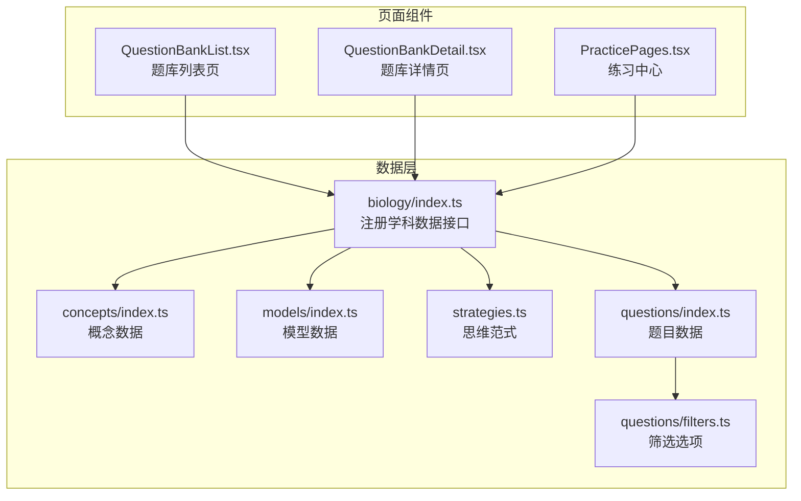
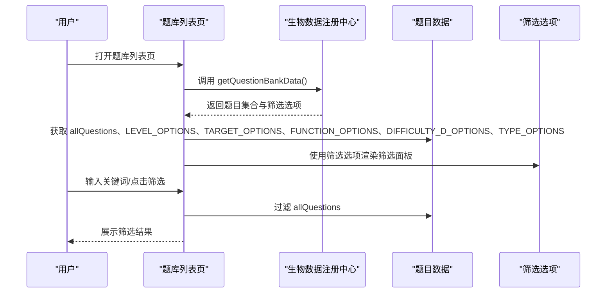
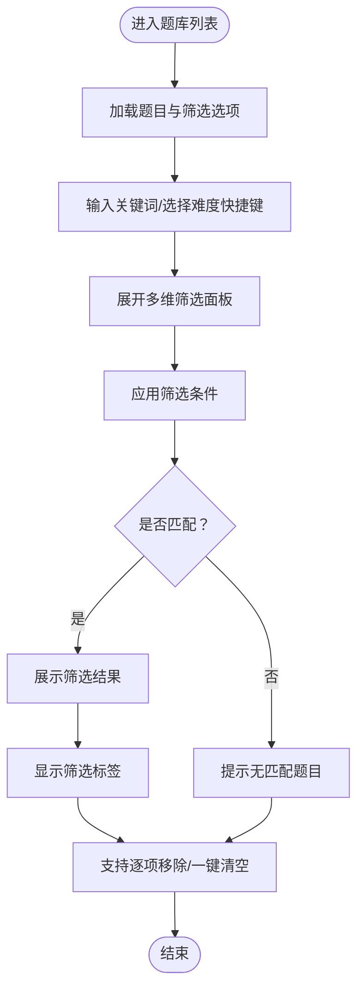
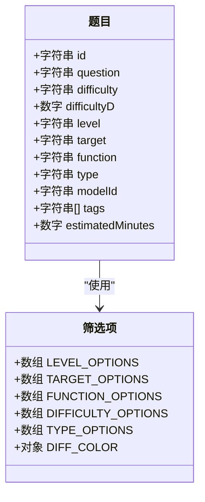
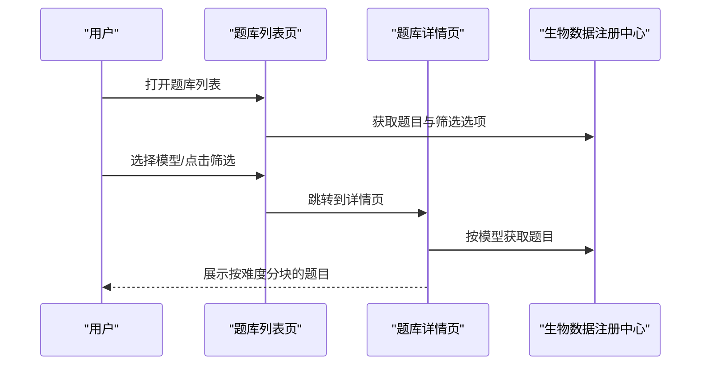
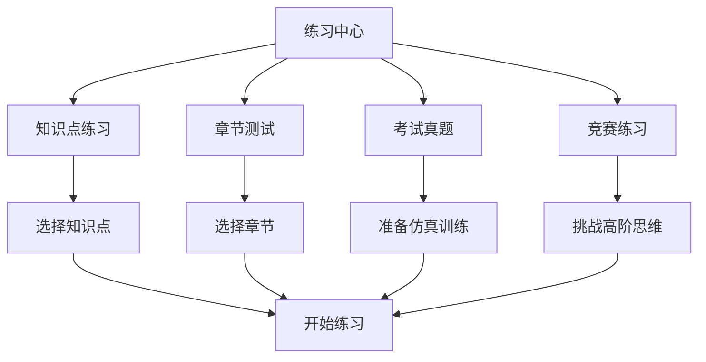
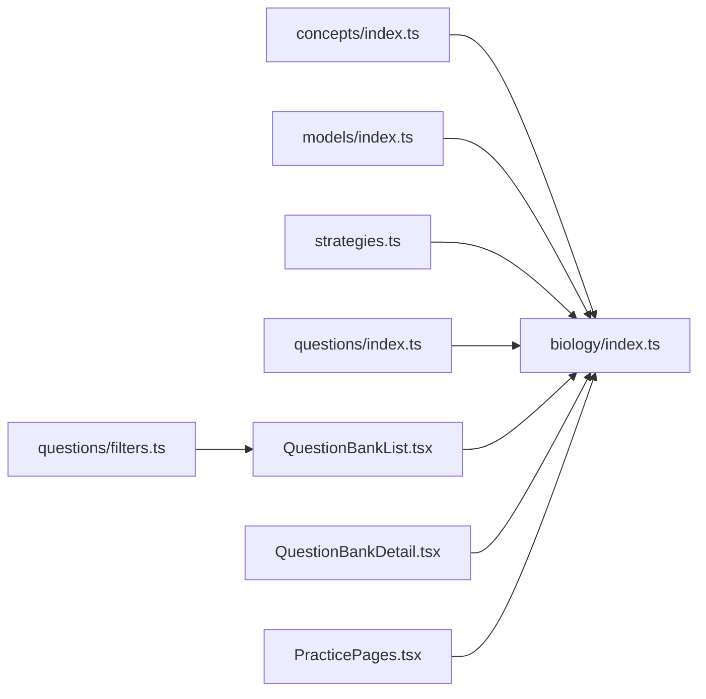

# 生物题库系统

<cite>
**本文档引用的文件**
- [src/data/biology/index.ts](file://src/data/biology/index.ts)
- [src/data/biology/questions/index.ts](file://src/data/biology/questions/index.ts)
- [src/data/biology/questions/filters.ts](file://src/data/biology/questions/filters.ts)
- [src/data/biology/concepts/index.ts](file://src/data/biology/concepts/index.ts)
- [src/data/biology/models/index.ts](file://src/data/biology/models/index.ts)
- [src/data/biology/strategies.ts](file://src/data/biology/strategies.ts)
- [src/sections/QuestionBankList.tsx](file://src/sections/QuestionBankList.tsx)
- [src/sections/QuestionBankDetail.tsx](file://src/sections/QuestionBankDetail.tsx)
- [src/sections/PracticePages.tsx](file://src/sections/PracticePages.tsx)
- [src/data/biology/concepts/B01_细胞的分子组成.ts](file://src/data/biology/concepts/B01_细胞的分子组成.ts)
- [src/data/biology/models/M01_生物大分子组成模型.ts](file://src/data/biology/models/M01_生物大分子组成模型.ts)
- [src/data/biology/models/M02_蛋白质结构功能分析模型.ts](file://src/data/biology/models/M02_蛋白质结构功能分析模型.ts)
</cite>

## 目录
1. [简介](#简介)
2. [项目结构](#项目结构)
3. [核心组件](#核心组件)
4. [架构总览](#架构总览)
5. [详细组件分析](#详细组件分析)
6. [依赖关系分析](#依赖关系分析)
7. [性能考虑](#性能考虑)
8. [故障排除指南](#故障排除指南)
9. [结论](#结论)

## 简介
本文件面向星耀平台生物学科的题库系统，系统性梳理了生物P层练习题库的完整体系，包括题目分类、难度分级与筛选机制，并对题库组织结构、目标分类、筛选与过滤功能、使用策略与学习路径、错题管理与学习分析等方面进行深入说明。文档以代码为依据，结合前端页面组件与数据层定义，帮助开发者与教师快速理解与使用该题库系统。

## 项目结构
生物题库系统采用“数据层 + 页面组件”的分层架构：
- 数据层：负责概念、模型、策略、题目等数据的组织与查询接口注册
- 页面组件：负责题库列表、题库详情、练习中心等用户交互界面
- 筛选与过滤：在页面组件中实现多维筛选，调用数据层提供的选项与数据

**图表来源**
- [src/data/biology/index.ts:126-151](file://src/data/biology/index.ts#L126-L151)
- [src/sections/QuestionBankList.tsx:29-113](file://src/sections/QuestionBankList.tsx#L29-L113)
- [src/sections/QuestionBankDetail.tsx:92-117](file://src/sections/QuestionBankDetail.tsx#L92-L117)
- [src/sections/PracticePages.tsx:88-183](file://src/sections/PracticePages.tsx#L88-L183)

**章节来源**
- [src/data/biology/index.ts:1-151](file://src/data/biology/index.ts#L1-L151)
- [src/sections/QuestionBankList.tsx:1-424](file://src/sections/QuestionBankList.tsx#L1-L424)

## 核心组件
- 生物学科数据注册中心：统一暴露概念、模型、策略、题目等数据接口，供页面组件调用
- 题目数据与筛选选项：提供题目集合、按模型分组、难度与目标等筛选项
- 页面组件：题库列表页支持关键词搜索与多维筛选；题库详情页按难度分块展示；练习中心提供多种练习模式入口

关键职责与接口：
- 概念与模型：提供概念列表、模型章节、模型数据映射、模型题目统计等
- 题库数据：提供题目集合、难度与目标等筛选选项、按模型分组的题目
- 页面交互：题库列表页实现搜索、难度快捷切换、多维筛选面板、筛选标签与清除功能；题库详情页按难度分块展示题目

**章节来源**
- [src/data/biology/index.ts:11-151](file://src/data/biology/index.ts#L11-L151)
- [src/data/biology/questions/index.ts:1-15](file://src/data/biology/questions/index.ts#L1-L15)
- [src/data/biology/questions/filters.ts:1-38](file://src/data/biology/questions/filters.ts#L1-L38)
- [src/sections/QuestionBankList.tsx:29-113](file://src/sections/QuestionBankList.tsx#L29-L113)
- [src/sections/QuestionBankDetail.tsx:92-117](file://src/sections/QuestionBankDetail.tsx#L92-L117)

## 架构总览
系统遵循“数据层集中管理 + 页面组件按需消费”的模式。数据层通过注册函数统一导出学科数据接口，页面组件通过自定义Hook或直接导入的方式获取所需数据与筛选选项，实现解耦与复用。

**图表来源**
- [src/sections/QuestionBankList.tsx:50-83](file://src/sections/QuestionBankList.tsx#L50-L83)
- [src/data/biology/index.ts:66-100](file://src/data/biology/index.ts#L66-L100)

## 详细组件分析

### 题库筛选与过滤机制
- 支持的筛选维度：
  - 难度级别：L1（基础）、L2（进阶）、L3（挑战）
  - 学习目标：同步学习、期中期末、高考专项、竞赛拓展
  - 题目功能：巩固练习、复习检测、诊断评估、真题演练
  - 难度等级：D1（基础）、D2（进阶）、D3（挑战）
  - 题型：选择题、填空题、判断题、解答题
- 列表页筛选逻辑：
  - 关键词搜索：匹配题目正文与标签
  - 难度快捷切换：快速筛选 B/J/T
  - 多维筛选：能力层级、学习目标、题目功能、难度等级、题型
  - 筛选标签：显示当前激活的筛选条件，支持逐项移除与一键清空
- 详情页筛选逻辑：
  - 按模型分组展示题目，支持按题型进一步筛选

**图表来源**
- [src/sections/QuestionBankList.tsx:69-100](file://src/sections/QuestionBankList.tsx#L69-L100)
- [src/data/biology/questions/filters.ts:1-38](file://src/data/biology/questions/filters.ts#L1-L38)

**章节来源**
- [src/sections/QuestionBankList.tsx:29-113](file://src/sections/QuestionBankList.tsx#L29-L113)
- [src/data/biology/questions/filters.ts:1-38](file://src/data/biology/questions/filters.ts#L1-L38)

### 题库组织结构与难度分级
- 题目难度分级（B/J/T）：
  - B层：基础，直接套公式、基本概念辨析
  - J层：进阶，多步推导、综合应用两个以上知识点
  - T层：挑战，创新题型、跨章节综合
- 能力层级（L1/L2/L3）：
  - L1：基础
  - L2：进阶
  - L3：挑战
- 题型分类：选择题、填空题、判断题、解答题
- 学习目标分类：同步学习、期中期末、高考专项、竞赛拓展
- 题目功能分类：巩固练习、复习检测、诊断评估、真题演练

**图表来源**
- [src/data/biology/questions/filters.ts:1-38](file://src/data/biology/questions/filters.ts#L1-L38)
- [src/data/biology/questions/index.ts:1-15](file://src/data/biology/questions/index.ts#L1-L15)

**章节来源**
- [src/data/biology/questions/filters.ts:1-38](file://src/data/biology/questions/filters.ts#L1-L38)
- [src/data/biology/index.ts:66-100](file://src/data/biology/index.ts#L66-L100)

### 题库列表页与详情页
- 题库列表页：
  - 提供关键词搜索框
  - 难度快捷按钮（B/J/T）
  - 多维筛选面板（能力层级、学习目标、题目功能、难度等级、题型）
  - 筛选标签与清除功能
  - 结果为空时的提示与引导
- 题库详情页：
  - 按难度分块展示题目（B/J/T）
  - 支持按题型进一步筛选
  - 提供“随机练习”入口

**图表来源**
- [src/sections/QuestionBankList.tsx:387-418](file://src/sections/QuestionBankList.tsx#L387-L418)
- [src/sections/QuestionBankDetail.tsx:95-117](file://src/sections/QuestionBankDetail.tsx#L95-L117)
- [src/data/biology/index.ts:144-147](file://src/data/biology/index.ts#L144-L147)

**章节来源**
- [src/sections/QuestionBankList.tsx:29-113](file://src/sections/QuestionBankList.tsx#L29-L113)
- [src/sections/QuestionBankDetail.tsx:92-117](file://src/sections/QuestionBankDetail.tsx#L92-L117)

### 练习中心与学习路径
- 练习中心提供四种模式：
  - 知识点练习：针对具体知识点进行巩固
  - 章节测试：按章节综合检测
  - 考试真题：仿真训练（当前未开放）
  - 竞赛练习：高阶思维挑战（当前未开放）
- 难度说明：B/J/T三层说明与颜色标识，便于学生选择合适难度
- 章节浏览：可直接跳转至章节对应的练习入口

**图表来源**
- [src/sections/PracticePages.tsx:16-65](file://src/sections/PracticePages.tsx#L16-L65)
- [src/sections/PracticePages.tsx:88-183](file://src/sections/PracticePages.tsx#L88-L183)

**章节来源**
- [src/sections/PracticePages.tsx:88-183](file://src/sections/PracticePages.tsx#L88-L183)

### 错题管理与学习分析（建议）
基于现有数据结构，可扩展以下能力：
- 错题管理：
  - 记录用户作答历史与正确率
  - 收集错题并标记，形成个人错题本
  - 提供错题再练与针对性复习
- 学习分析：
  - 统计各模型/知识点的正确率与错误分布
  - 生成学习报告与薄弱环节提醒
  - 建议个性化练习计划与复习策略

（本节为概念性建议，不直接分析具体文件）

## 依赖关系分析
- 数据层依赖：
  - concepts/index.ts：提供概念列表与数据映射
  - models/index.ts：提供模型列表、章节划分与数据映射
  - strategies.ts：提供思维范式列表与映射
  - questions/index.ts：提供题目集合与按模型分组
  - questions/filters.ts：提供筛选选项与颜色映射
- 页面组件依赖：
  - QuestionBankList.tsx：依赖数据层的 getQuestionBankData 与 useSubjectData Hook
  - QuestionBankDetail.tsx：依赖数据层的按模型分组题目
  - PracticePages.tsx：依赖数据层的模型列表与难度说明

**图表来源**
- [src/data/biology/index.ts:1-151](file://src/data/biology/index.ts#L1-L151)
- [src/sections/QuestionBankList.tsx:29-59](file://src/sections/QuestionBankList.tsx#L29-L59)
- [src/sections/QuestionBankDetail.tsx:92-95](file://src/sections/QuestionBankDetail.tsx#L92-L95)
- [src/sections/PracticePages.tsx:88-183](file://src/sections/PracticePages.tsx#L88-L183)

**章节来源**
- [src/data/biology/index.ts:1-151](file://src/data/biology/index.ts#L1-L151)
- [src/sections/QuestionBankList.tsx:29-59](file://src/sections/QuestionBankList.tsx#L29-L59)

## 性能考虑
- 题目数据加载：页面组件在首次渲染时会一次性加载全部题目，建议在数据量增大时引入分页或懒加载策略
- 筛选性能：当前筛选为内存过滤，复杂筛选条件可能影响性能，建议引入索引或服务端筛选
- 渲染优化：列表页对题目内容进行截断与标签展示，避免长文本渲染压力

（本节为通用建议，不直接分析具体文件）

## 故障排除指南
- 题库为空：
  - 检查数据层 questions/index.ts 中的题目集合是否已填充
  - 确认筛选条件是否过于严格导致无匹配
- 筛选无效：
  - 检查筛选选项是否正确传入页面组件
  - 确认筛选逻辑中字段名称与数据结构一致
- 练习入口异常：
  - 检查模型ID与题目modelId是否匹配
  - 确认页面路由参数与实际路径一致

**章节来源**
- [src/sections/QuestionBankList.tsx:375-385](file://src/sections/QuestionBankList.tsx#L375-L385)
- [src/data/biology/questions/index.ts:1-15](file://src/data/biology/questions/index.ts#L1-L15)

## 结论
星耀平台生物学科题库系统以清晰的数据层与直观的页面组件实现了完整的题库体系：从概念与模型出发，到题目组织与多维筛选，再到练习中心与学习路径，形成了可扩展、可维护的知识与题目生态。建议在后续迭代中完善错题管理与学习分析能力，以更好地支撑个性化学习与复习策略制定。