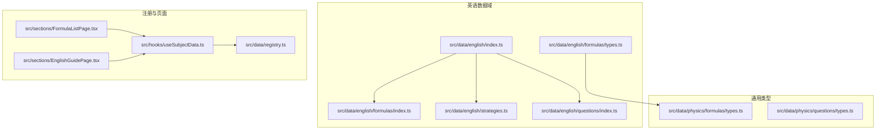
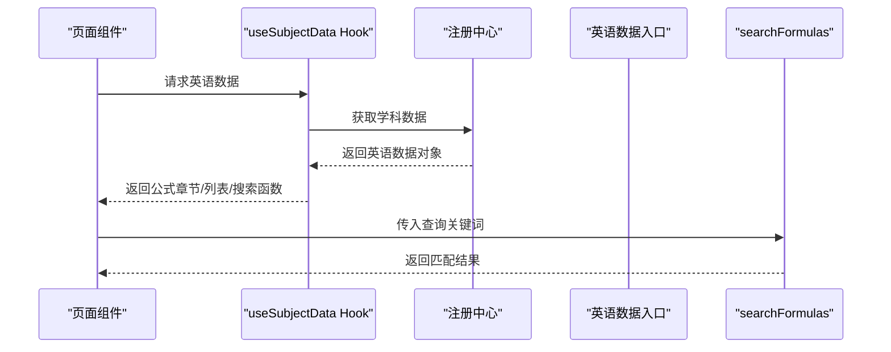
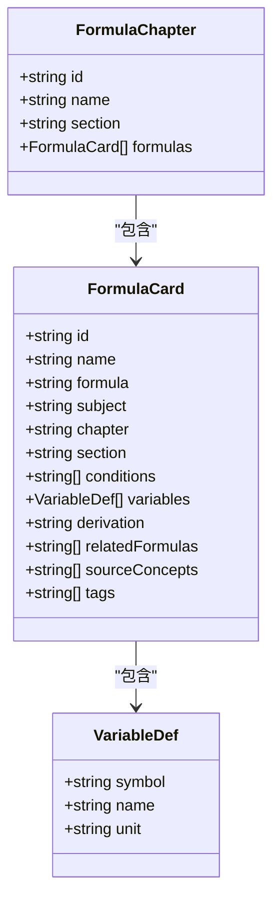
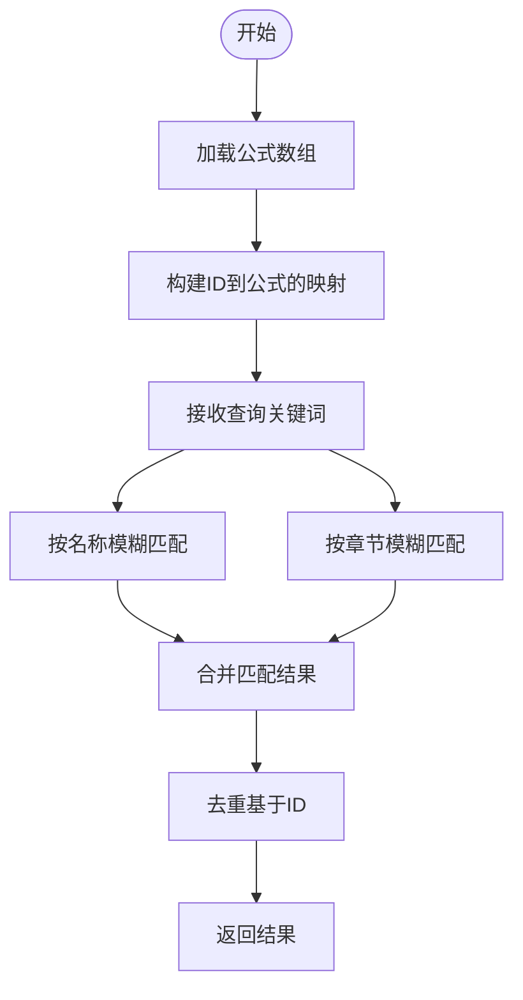
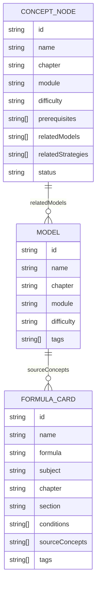
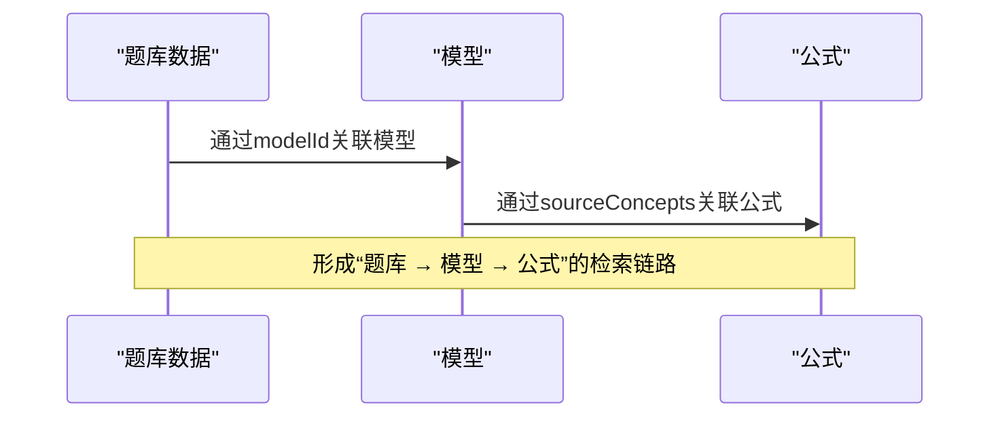
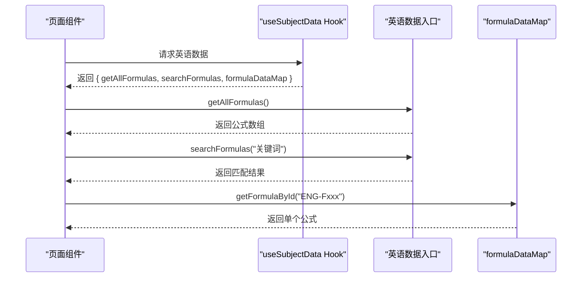
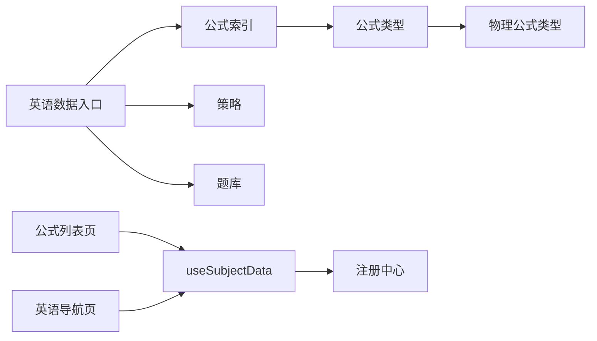

# 英语公式章节

<cite>
**本文引用的文件**
- [src/data/english/index.ts](file://src/data/english/index.ts)
- [src/data/english/formulas/index.ts](file://src/data/english/formulas/index.ts)
- [src/data/english/formulas/types.ts](file://src/data/english/formulas/types.ts)
- [src/data/physics/formulas/types.ts](file://src/data/physics/formulas/types.ts)
- [src/data/physics/questions/types.ts](file://src/data/physics/questions/types.ts)
- [src/data/english/questions/index.ts](file://src/data/english/questions/index.ts)
- [src/data/english/questions/types.ts](file://src/data/english/questions/types.ts)
- [src/data/english/strategies.ts](file://src/data/english/strategies.ts)
- [src/data/registry.ts](file://src/data/registry.ts)
- [src/sections/FormulaListPage.tsx](file://src/sections/FormulaListPage.tsx)
- [src/sections/EnglishGuidePage.tsx](file://src/sections/EnglishGuidePage.tsx)
- [src/hooks/useSubjectData.ts](file://src/hooks/useSubjectData.ts)
</cite>

## 目录
1. [简介](#简介)
2. [项目结构](#项目结构)
3. [核心组件](#核心组件)
4. [架构总览](#架构总览)
5. [详细组件分析](#详细组件分析)
6. [依赖分析](#依赖分析)
7. [性能考虑](#性能考虑)
8. [故障排查指南](#故障排查指南)
9. [结论](#结论)
10. [附录](#附录)

## 简介
本文件面向星耀平台“英语公式章节”的系统化文档，聚焦以下目标：
- 解释英语学科公式组织结构：构词法公式、语法规则、阅读技巧、写作模板等核心公式体系的分类与适用范围。
- 文档化公式章节的数据结构：公式名称、章节归属、公式内容、应用场景等字段。
- 说明公式搜索功能的实现机制：模糊匹配、关键词检索与相关性排序思路。
- 提供具体使用示例：如何获取公式列表、执行公式搜索、构建公式索引。
- 描述公式章节与知识节点、核心模型的关联关系，以及如何通过公式实现知识的系统化整理与高效检索。

## 项目结构
英语公式章节位于数据层的英语学科子模块中，采用“学科 → 数据域”的分层组织方式：
- 英语数据入口：注册学科、聚合概念、模型、公式、题库与策略。
- 公式数据域：公式卡片、章节划分、查询接口与索引。
- 类型定义：复用物理学科的公式类型，确保跨学科一致性和扩展性。
- 页面与Hook：通过页面组件与Hook消费数据，提供前端展示与交互。

图表来源
- [src/data/english/index.ts:125-150](file://src/data/english/index.ts#L125-L150)
- [src/data/registry.ts](file://src/data/registry.ts)
- [src/sections/FormulaListPage.tsx](file://src/sections/FormulaListPage.tsx)
- [src/sections/EnglishGuidePage.tsx](file://src/sections/EnglishGuidePage.tsx)
- [src/hooks/useSubjectData.ts](file://src/hooks/useSubjectData.ts)

章节来源
- [src/data/english/index.ts:1-150](file://src/data/english/index.ts#L1-L150)
- [src/data/registry.ts](file://src/data/registry.ts)

## 核心组件
- 英语数据入口与注册
  - 聚合概念、模型、公式、题库与策略，并通过注册中心暴露统一接口。
  - 提供公式章节、公式列表、公式搜索等能力。
- 英语公式数据
  - 公式卡片与章节定义来自类型文件，复用物理学科的结构以保证一致性。
  - 当前公式数据为空数组占位，便于后续填充。
- 英语策略（范式）
  - 定义了覆盖句法、词汇、阅读、写作、听力等多个维度的范式清单。
- 英语题库
  - 提供题库数据、按模型分组与按ID查询的能力。
- 页面与Hook
  - 页面组件通过Hook访问学科数据，实现公式列表页与英语导航页的功能。

章节来源
- [src/data/english/index.ts:1-150](file://src/data/english/index.ts#L1-L150)
- [src/data/english/formulas/index.ts:1-13](file://src/data/english/formulas/index.ts#L1-L13)
- [src/data/physics/formulas/types.ts:1-30](file://src/data/physics/formulas/types.ts#L1-L30)
- [src/data/physics/questions/types.ts:1-35](file://src/data/physics/questions/types.ts#L1-L35)
- [src/data/english/questions/index.ts:1-15](file://src/data/english/questions/index.ts#L1-L15)
- [src/data/english/strategies.ts:1-77](file://src/data/english/strategies.ts#L1-L77)

## 架构总览
英语公式章节的运行时架构围绕“数据入口 → 查询接口 → 前端消费”展开：
- 数据入口负责加载与聚合英语学科下的公式、模型、概念、题库与策略。
- 查询接口提供公式搜索、章节与列表访问。
- 前端页面通过Hook订阅学科数据，渲染公式列表与详情。

图表来源
- [src/hooks/useSubjectData.ts](file://src/hooks/useSubjectData.ts)
- [src/data/registry.ts](file://src/data/registry.ts)
- [src/data/english/index.ts:50-55](file://src/data/english/index.ts#L50-L55)

章节来源
- [src/data/registry.ts](file://src/data/registry.ts)
- [src/data/english/index.ts:50-63](file://src/data/english/index.ts#L50-L63)

## 详细组件分析

### 组件A：英语公式数据结构与类型
- 公式卡片字段
  - 唯一ID、名称、LaTeX公式、所属学科、章节、小节、适用条件、变量说明、推导过程、关联公式ID、来源知识节点ID、搜索标签等。
- 公式章节
  - 包含章节ID、名称、小节与公式列表。
- 类型复用
  - 英语公式类型复用物理学科的定义，确保跨学科一致性与扩展性。

图表来源
- [src/data/physics/formulas/types.ts:4-30](file://src/data/physics/formulas/types.ts#L4-L30)
- [src/data/english/formulas/types.ts:1-3](file://src/data/english/formulas/types.ts#L1-L3)

章节来源
- [src/data/physics/formulas/types.ts:1-30](file://src/data/physics/formulas/types.ts#L1-L30)
- [src/data/english/formulas/types.ts:1-3](file://src/data/english/formulas/types.ts#L1-L3)

### 组件B：公式搜索与索引
- 搜索实现
  - 基于名称与章节进行不区分大小写的模糊匹配。
- 索引构建
  - 通过Map以ID为键建立公式数据索引，支持O(1)按ID查询。
- 列表与章节
  - 提供公式列表与章节列表的访问接口，便于前端渲染。

图表来源
- [src/data/english/index.ts:50-55](file://src/data/english/index.ts#L50-L55)
- [src/data/english/formulas/index.ts:7-13](file://src/data/english/formulas/index.ts#L7-L13)

章节来源
- [src/data/english/index.ts:50-63](file://src/data/english/index.ts#L50-L63)
- [src/data/english/formulas/index.ts:1-13](file://src/data/english/formulas/index.ts#L1-L13)

### 组件C：公式章节与知识节点、核心模型的关联
- 章节归属
  - 公式卡片包含“章节/小节”字段，用于描述公式所属的知识板块。
- 来源知识节点
  - 公式卡片包含“sourceConcepts”字段，指向来源知识节点ID，实现公式与知识节点的关联。
- 关联模型
  - 概念数据中包含“relatedModels”，用于将知识节点与核心模型关联，从而形成“知识 → 模型 → 公式”的链路。
- 应用场景
  - 通过该链路，用户可在阅读知识节点后，自动关联到对应的公式与模型，实现系统化整理与高效检索。

图表来源
- [src/data/physics/formulas/types.ts:10-23](file://src/data/physics/formulas/types.ts#L10-L23)
- [src/data/physics/formulas/types.ts:25-30](file://src/data/physics/formulas/types.ts#L25-L30)

章节来源
- [src/data/physics/formulas/types.ts:10-30](file://src/data/physics/formulas/types.ts#L10-L30)

### 组件D：英语题库与公式的关系
- 题库类型
  - 题目包含模型ID、难度、类型、标签、问题、答案、解析、关联知识点等字段。
- 公式与题库
  - 通过模型ID将题目与模型关联；模型再与公式建立链路，实现“题库 → 模型 → 公式”的检索路径。
- 统计与分组
  - 提供按模型统计与按模型分组的能力，辅助教学与复习。

图表来源
- [src/data/physics/questions/types.ts:4-35](file://src/data/physics/questions/types.ts#L4-L35)
- [src/data/physics/formulas/types.ts:10-23](file://src/data/physics/formulas/types.ts#L10-L23)

章节来源
- [src/data/physics/questions/types.ts:1-35](file://src/data/physics/questions/types.ts#L1-L35)
- [src/data/physics/formulas/types.ts:10-23](file://src/data/physics/formulas/types.ts#L10-L23)

### 组件E：页面与Hook的使用示例
- 获取公式列表
  - 通过Hook访问学科数据，调用“getAllFormulas”获取全部公式。
- 执行公式搜索
  - 调用“searchFormulas”传入关键词，返回匹配结果。
- 构建公式索引
  - 使用“formulaDataMap”以ID为键访问单个公式。

图表来源
- [src/sections/FormulaListPage.tsx](file://src/sections/FormulaListPage.tsx)
- [src/sections/EnglishGuidePage.tsx](file://src/sections/EnglishGuidePage.tsx)
- [src/hooks/useSubjectData.ts](file://src/hooks/useSubjectData.ts)
- [src/data/english/index.ts:135-138](file://src/data/english/index.ts#L135-L138)
- [src/data/english/formulas/index.ts:7-13](file://src/data/english/formulas/index.ts#L7-L13)

章节来源
- [src/sections/FormulaListPage.tsx](file://src/sections/FormulaListPage.tsx)
- [src/sections/EnglishGuidePage.tsx](file://src/sections/EnglishGuidePage.tsx)
- [src/hooks/useSubjectData.ts](file://src/hooks/useSubjectData.ts)
- [src/data/english/index.ts:135-138](file://src/data/english/index.ts#L135-L138)
- [src/data/english/formulas/index.ts:7-13](file://src/data/english/formulas/index.ts#L7-L13)

## 依赖分析
- 内部依赖
  - 英语数据入口依赖公式、策略、题库等子模块。
  - 公式类型复用物理学科类型，降低重复成本。
- 外部依赖
  - 注册中心提供学科数据的统一出口。
  - 页面与Hook作为消费者，驱动数据的展示与交互。

图表来源
- [src/data/english/index.ts:1-150](file://src/data/english/index.ts#L1-L150)
- [src/data/physics/formulas/types.ts:1-30](file://src/data/physics/formulas/types.ts#L1-L30)
- [src/data/registry.ts](file://src/data/registry.ts)
- [src/sections/FormulaListPage.tsx](file://src/sections/FormulaListPage.tsx)
- [src/sections/EnglishGuidePage.tsx](file://src/sections/EnglishGuidePage.tsx)
- [src/hooks/useSubjectData.ts](file://src/hooks/useSubjectData.ts)

章节来源
- [src/data/registry.ts](file://src/data/registry.ts)
- [src/data/physics/formulas/types.ts:1-30](file://src/data/physics/formulas/types.ts#L1-L30)

## 性能考虑
- 搜索复杂度
  - 当前搜索为线性过滤，时间复杂度为O(n)，适合中小规模数据。
- 索引优化
  - 已通过Map实现O(1)按ID查询；建议在公式量增长时引入更复杂的索引或缓存策略。
- 前端渲染
  - 将搜索结果与列表分页/虚拟滚动结合，提升大列表渲染性能。
- 数据懒加载
  - 在页面进入时仅加载必要数据，避免一次性加载全部公式。

## 故障排查指南
- 公式列表为空
  - 检查公式数组是否正确初始化与填充。
  - 确认注册中心已正确注册英语学科数据。
- 搜索无结果
  - 确认关键词大小写处理与匹配逻辑。
  - 检查公式名称与章节字段是否填写完整。
- 按ID查询失败
  - 确认ID格式与Map键是否一致。
  - 检查Map构建逻辑与公式数组是否同步更新。

章节来源
- [src/data/english/formulas/index.ts:1-13](file://src/data/english/formulas/index.ts#L1-L13)
- [src/data/registry.ts](file://src/data/registry.ts)

## 结论
英语公式章节通过清晰的数据结构与统一的查询接口，实现了公式、模型、知识节点与题库的系统化关联。当前以占位数据为主，具备良好的扩展性与一致性。建议后续完善公式内容、建立更完善的索引与搜索策略，并在前端引入分页/缓存与更丰富的检索能力，以支撑大规模知识体系的高效使用。

## 附录
- 术语
  - 公式卡片：承载公式名称、LaTeX表达式、章节归属、变量说明等信息的数据单元。
  - 章节：公式所属的知识板块，通常与课程或知识点主题对应。
  - 来源知识节点：公式所依据的基础知识条目，用于溯源与关联。
  - 模型：对知识与技能的抽象化表达，常与题型或解题范式对应。
- 使用建议
  - 在新增公式时，同步维护“章节/小节”、“来源知识节点ID”与“标签”字段。
  - 为高频搜索关键词建立标签，提升检索效率。
  - 与策略（范式）协同，形成“知识 → 模型 → 公式 → 策略”的闭环。