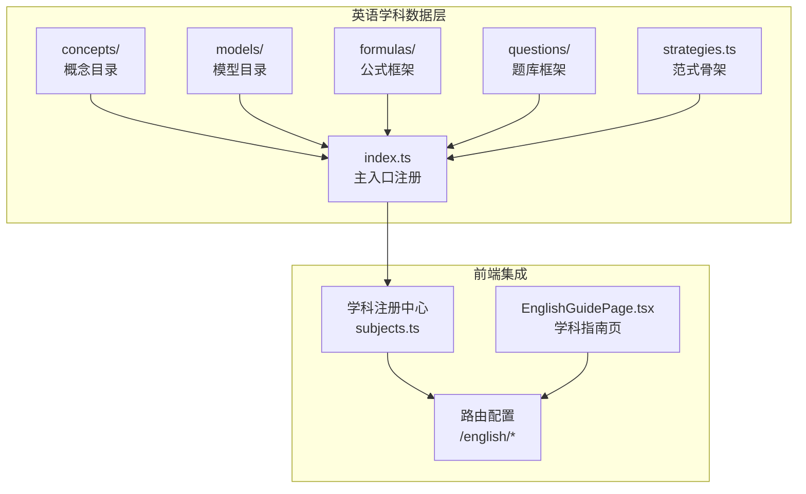
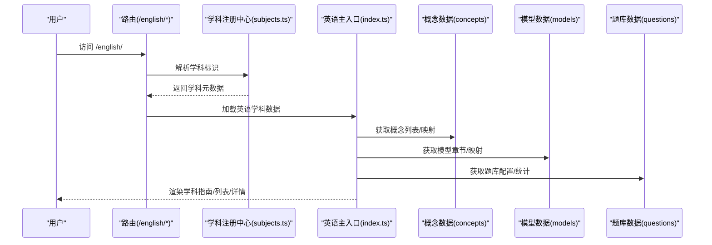
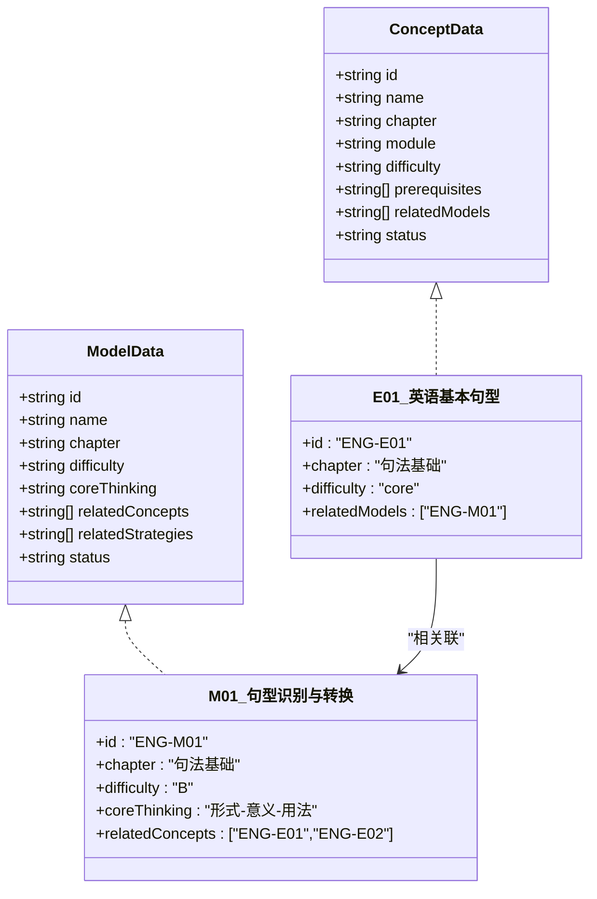
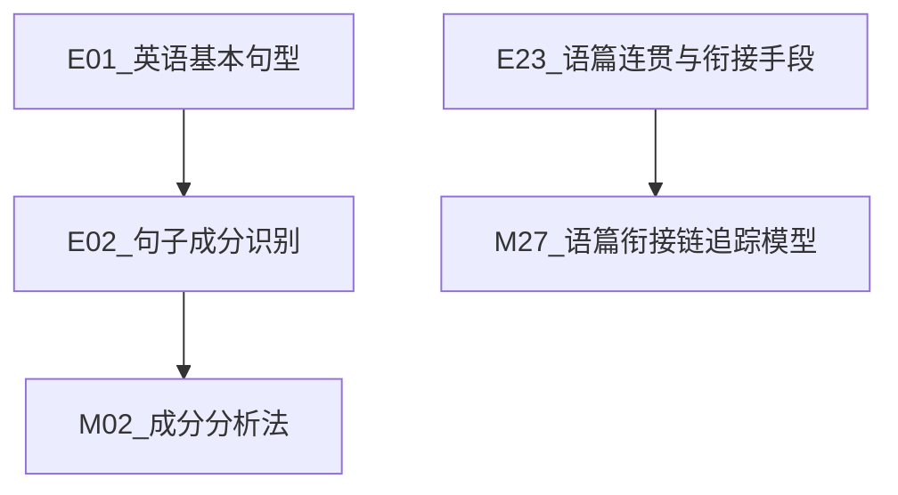
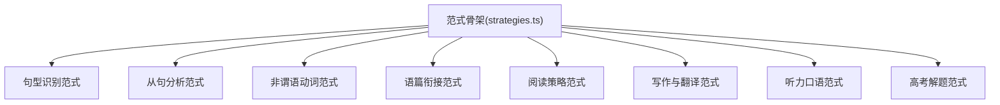
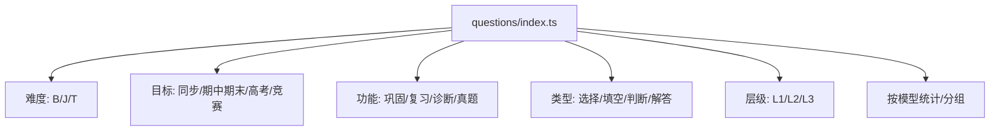
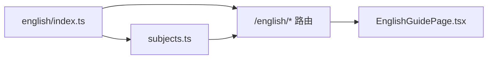

# 英语学科

<cite>
**本文引用的文件**
- [FEATURE-英语学科数据骨架完成记录.md](file://docs/FEATURE-英语学科数据骨架完成记录.md)
- [english/index.ts](file://src/data/english/index.ts)
- [concepts/types.ts](file://src/data/english/concepts/types.ts)
- [models/types.ts](file://src/data/english/models/types.ts)
- [questions/types.ts](file://src/data/english/questions/types.ts)
- [E01_英语基本句型.ts](file://src/data/english/concepts/E01_英语基本句型.ts)
- [E02_句子成分识别.ts](file://src/data/english/concepts/E02_句子成分识别.ts)
- [M01_句型识别与转换模型.ts](file://src/data/english/models/M01_句型识别与转换模型.ts)
- [M02_成分分析法.ts](file://src/data/english/models/M02_成分分析法.ts)
- [M27_语篇衔接链追踪模型.ts](file://src/data/english/models/M27_语篇衔接链追踪模型.ts)
- [strategies.ts](file://src/data/english/strategies.ts)
- [EnglishGuidePage.tsx](file://src/sections/EnglishGuidePage.tsx)
- [subjects.ts](file://src/data/subjects.ts)
</cite>

## 目录
1. [简介](#简介)
2. [项目结构](#项目结构)
3. [核心组件](#核心组件)
4. [架构总览](#架构总览)
5. [详细组件分析](#详细组件分析)
6. [依赖分析](#依赖分析)
7. [性能考量](#性能考量)
8. [故障排查指南](#故障排查指南)
9. [结论](#结论)
10. [附录](#附录)

## 简介
本文件面向星耀平台的英语学科，系统化阐述其知识组织结构与模块化设计：以K层知识节点（49个）、M层核心模型（52个）、R层解题套路（59条范式骨架）、P层练习题库（五维筛选框架）为主线，结合语法、词汇、阅读、写作、听力、口语等核心领域，给出概念-模型-范式-题库的完整数据骨架与前端集成方案。文档还总结英语学科特有的“形式-意义-用法”思维方法、“语篇分析”范式、以及“输入-重组-输出”的学习路径策略，帮助用户高效构建英语知识体系与应试能力。

## 项目结构
英语学科数据骨架位于 src/data/english 下，采用“概念-模型-公式-题库-范式-主入口注册”的分层组织，配合前端路由与学科注册中心，形成可扩展、可维护的内容体系。

图示来源
- [english/index.ts:1-150](file://src/data/english/index.ts#L1-L150)
- [subjects.ts:12-19](file://src/data/subjects.ts#L12-L19)
- [EnglishGuidePage.tsx:1-139](file://src/sections/EnglishGuidePage.tsx#L1-L139)

章节来源
- [FEATURE-英语学科数据骨架完成记录.md:36-78](file://docs/FEATURE-英语学科数据骨架完成记录.md#L36-L78)
- [english/index.ts:1-150](file://src/data/english/index.ts#L1-L150)
- [subjects.ts:12-19](file://src/data/subjects.ts#L12-L19)

## 核心组件
- 概念层（K层）：49个概念，按9大板块组织，覆盖句法基础、三大从句、非谓语动词与特殊结构、时态与语态、词汇与语义系统、语篇与阅读能力、写作与翻译、听力与口语、高考衔接策略。
- 模型层（M层）：52个模型，按板块分组，围绕“形式-意义-用法”“语境中的语篇分析”等核心思维展开，支撑语法、阅读、写作、听力、口语等能力模型。
- 范式层（R层）：59条分析范式骨架，覆盖句型识别、从句分析、非谓语动词、时态语态、词汇语义、语篇衔接、阅读策略、写作与翻译、听力口语、高考解题策略等。
- 题库层（P层）：五维筛选框架（难度、目标、功能、类型、层级），支持按模型维度统计与题目分组，为后续题库内容填充奠定基础。
- 主入口与注册：通过 registerSubject 接口向学科注册中心注入英语学科数据，前端路由统一挂载于 /english 前缀。

章节来源
- [FEATURE-英语学科数据骨架完成记录.md:81-123](file://docs/FEATURE-英语学科数据骨架完成记录.md#L81-L123)
- [english/index.ts:125-150](file://src/data/english/index.ts#L125-L150)

## 架构总览
英语学科数据骨架遵循“概念-模型-范式-题库”的知识组织范式，前端通过路由与注册中心实现模块化接入；主入口 index.ts 提供概念列表、模型章节、公式检索、题库配置、范式数据映射、图谱数据占位等统一接口，便于后续内容填充与页面渲染。

图示来源
- [english/index.ts:101-150](file://src/data/english/index.ts#L101-L150)
- [subjects.ts:21-29](file://src/data/subjects.ts#L21-L29)

章节来源
- [english/index.ts:101-150](file://src/data/english/index.ts#L101-L150)
- [subjects.ts:12-19](file://src/data/subjects.ts#L12-L19)

## 详细组件分析

### 概念与模型的结构与关系
英语概念与模型均采用统一的数据契约（ConceptData/ModelData），通过前置依赖（prerequisites）与关联关系（relatedConcepts/relatedModels）建立知识网络。概念层强调“基础-进阶-核心”难度分级，模型层以“B/J/T”难度标注，便于学习路径与题库匹配。

图示来源
- [concepts/types.ts:1-3](file://src/data/english/concepts/types.ts#L1-L3)
- [models/types.ts:1-3](file://src/data/english/models/types.ts#L1-L3)
- [E01_英语基本句型.ts:3-12](file://src/data/english/concepts/E01_英语基本句型.ts#L3-L12)
- [M01_句型识别与转换模型.ts:3-11](file://src/data/english/models/M01_句型识别与转换模型.ts#L3-L11)

章节来源
- [E01_英语基本句型.ts:3-12](file://src/data/english/concepts/E01_英语基本句型.ts#L3-L12)
- [M01_句型识别与转换模型.ts:3-11](file://src/data/english/models/M01_句型识别与转换模型.ts#L3-L11)

### 概念与模型的依赖与关联
- E02_句子成分识别 依赖 E01_英语基本句型，体现从“句型识别”到“成分分析”的递进。
- M02_成分分析法 关联 E02_句子成分识别，形成“模型-概念”的双向映射。
- M27_语篇衔接链追踪模型 关联 E23_语篇连贯与衔接手段（概念骨架），支撑阅读与写作衔接策略。

图示来源
- [E02_句子成分识别.ts:3-12](file://src/data/english/concepts/E02_句子成分识别.ts#L3-L12)
- [M02_成分分析法.ts:3-11](file://src/data/english/models/M02_成分分析法.ts#L3-L11)
- [M27_语篇衔接链追踪模型.ts:3-11](file://src/data/english/models/M27_语篇衔接链追踪模型.ts#L3-L11)

章节来源
- [E02_句子成分识别.ts:3-12](file://src/data/english/concepts/E02_句子成分识别.ts#L3-L12)
- [M02_成分分析法.ts:3-11](file://src/data/english/models/M02_成分分析法.ts#L3-L11)
- [M27_语篇衔接链追踪模型.ts:3-11](file://src/data/english/models/M27_语篇衔接链追踪模型.ts#L3-L11)

### 范式体系与英语思维方法
英语范式骨架覆盖“句型识别、从句分析、非谓语动词、时态语态、词汇语义、语篇衔接、阅读策略、写作与翻译、听力口语、高考解题策略”等主题，形成“方法论-策略-应用”的闭环。例如：
- “形式-意义-用法”三维关联：强调语法形式背后的意义与使用语境。
- “语境中的语篇分析”：通过逻辑线与指代线追踪语篇骨架。
- “输入-重组-输出”：从阅读到写作的策略性桥梁。

图示来源
- [strategies.ts:9-69](file://src/data/english/strategies.ts#L9-L69)

章节来源
- [strategies.ts:1-77](file://src/data/english/strategies.ts#L1-L77)

### 题库五维筛选机制
题库框架提供五维筛选常量与统计接口，便于按难度、目标、功能、类型、层级进行题目分组与检索，同时支持按模型维度统计题目完成情况，为个性化学习与错题归因提供数据基础。

图示来源
- [english/index.ts:65-99](file://src/data/english/index.ts#L65-L99)

章节来源
- [english/index.ts:65-99](file://src/data/english/index.ts#L65-L99)

### 英语学科模块划分与章节组织
- 9大板块：句法基础、三大从句、非谓语动词与特殊结构、时态与语态、词汇与语义系统、语篇与阅读能力、写作与翻译、听力与口语、高考衔接策略。
- 概念与模型分布：句法基础（5概念/4模型）、三大从句（3概念/6模型）、非谓语动词与特殊结构（5概念/6模型）、时态与语态（6概念/4模型）、词汇与语义系统（6概念/6模型）、语篇与阅读能力（8概念/9模型）、写作与翻译（7概念/8模型）、听力与口语（5概念/5模型）、高考衔接策略（4概念/4模型）。

章节来源
- [FEATURE-英语学科数据骨架完成记录.md:83-96](file://docs/FEATURE-英语学科数据骨架完成记录.md#L83-L96)

### 英语概念的完整结构与方法论
- 完整结构：情境（Context）→困惑（Confusion）→实验（Experiment）→概念（Concept）→推导（Derivation）→应用（Application）。
- 方法论：以“形式-意义-用法”为核心，强调“为什么用这个形式而非那个”，并通过语篇分析、跨语言对比、元认知监控等策略提升语言运用能力。
- 生活应用：学术资源获取、技术文档理解、跨文化沟通、语用得体表达等。

章节来源
- [EnglishGuidePage.tsx:15-134](file://src/sections/EnglishGuidePage.tsx#L15-L134)

### 英语模型的分类体系与公式章节组织
- 分类体系：按“句法基础-语篇与阅读-写作与翻译-听力口语-高考衔接”九板块组织，每个板块内按“核心-扩展-进阶”难度递进。
- 公式章节：当前为框架（formulas/types.ts + formulas/index.ts），后续可按语法公式、词汇规律、阅读策略公式等维度填充。

章节来源
- [FEATURE-英语学科数据骨架完成记录.md:25-26](file://docs/FEATURE-英语学科数据骨架完成记录.md#L25-L26)

### 题库的筛选机制与学习路径优化
- 筛选维度：难度（B/J/T）、目标（同步/期中期末/高考/竞赛）、功能（巩固/复习/诊断/真题）、类型（选择/填空/判断/解答）、层级（L1/L2/L3）。
- 学习路径：基于模型-概念关联与题库统计，实现“错题归因→定向训练→效果评估”的闭环，优化学习效率。

章节来源
- [english/index.ts:65-99](file://src/data/english/index.ts#L65-L99)

## 依赖分析
英语学科数据层通过主入口统一注册至学科注册中心，前端路由统一挂载于 /english 前缀，确保概念、模型、范式、题库的访问路径一致且可扩展。

图示来源
- [english/index.ts:125-150](file://src/data/english/index.ts#L125-L150)
- [subjects.ts:12-19](file://src/data/subjects.ts#L12-L19)
- [EnglishGuidePage.tsx:1-139](file://src/sections/EnglishGuidePage.tsx#L1-L139)

章节来源
- [english/index.ts:125-150](file://src/data/english/index.ts#L125-L150)
- [subjects.ts:12-19](file://src/data/subjects.ts#L12-L19)

## 性能考量
- 数据加载：主入口提供按需查询接口（概念列表/映射、模型章节/映射、题库配置、范式映射），避免一次性加载全部数据。
- 图谱占位：图谱数据接口返回空结构，后续可按需扩展。
- 类型安全：沿用物理/化学学科类型契约，保证概念与模型字段一致性，降低耦合风险。

章节来源
- [english/index.ts:101-150](file://src/data/english/index.ts#L101-L150)
- [concepts/types.ts:1-3](file://src/data/english/concepts/types.ts#L1-L3)
- [models/types.ts:1-3](file://src/data/english/models/types.ts#L1-L3)

## 故障排查指南
- 路由不可达：确认 /english 前缀路由已在 App 中注册，且学科注册中心 available=true。
- 数据为空：检查 english/index.ts 的数据接口是否返回有效结构，确认 concepts/models/questions/strategies 的 barrel 导出是否正确。
- 类型报错：确认 concepts/types.ts 与 models/types.ts 与物理/化学学科类型契约保持一致，避免字段不匹配。

章节来源
- [subjects.ts:12-19](file://src/data/subjects.ts#L12-L19)
- [english/index.ts:125-150](file://src/data/english/index.ts#L125-L150)

## 结论
英语学科数据骨架已完成概念、模型、范式、题库的框架搭建，并通过主入口与注册中心实现模块化接入。依托“形式-意义-用法”“语境中的语篇分析”等方法论，结合五维题库筛选与“输入-重组-输出”学习路径，可为用户提供系统化、可扩展的英语学习体验。后续建议按编号逐步填充内容，完善题库与范式细节，持续优化学习路径与效果评估。

## 附录
- 访问地址（示例）：/english/、/english/models、/english/concepts、/english/formulas、/english/strategies、/english/exercises
- 数据结构：概念（49个）、模型（52个）、范式骨架（59条）、题库五维筛选框架

章节来源
- [FEATURE-英语学科数据骨架完成记录.md:66-78](file://docs/FEATURE-英语学科数据骨架完成记录.md#L66-L78)