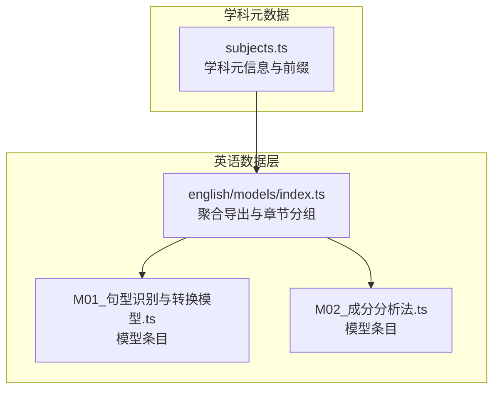
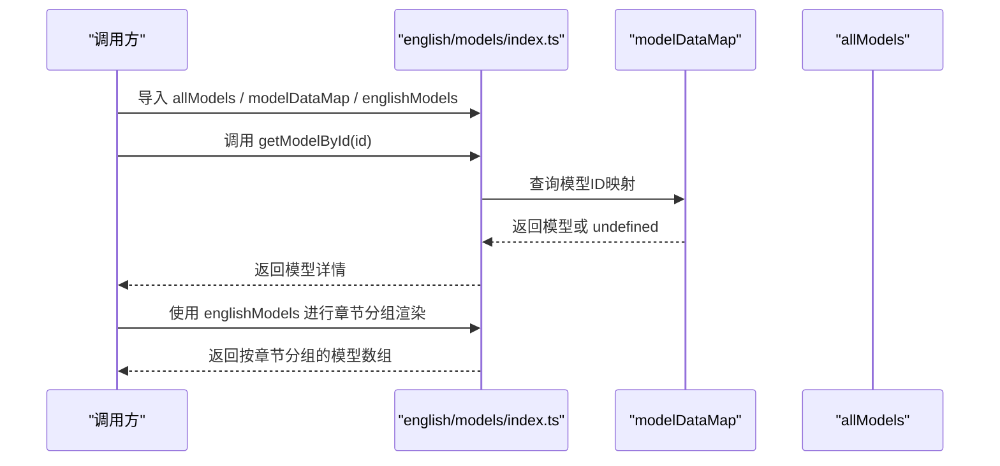
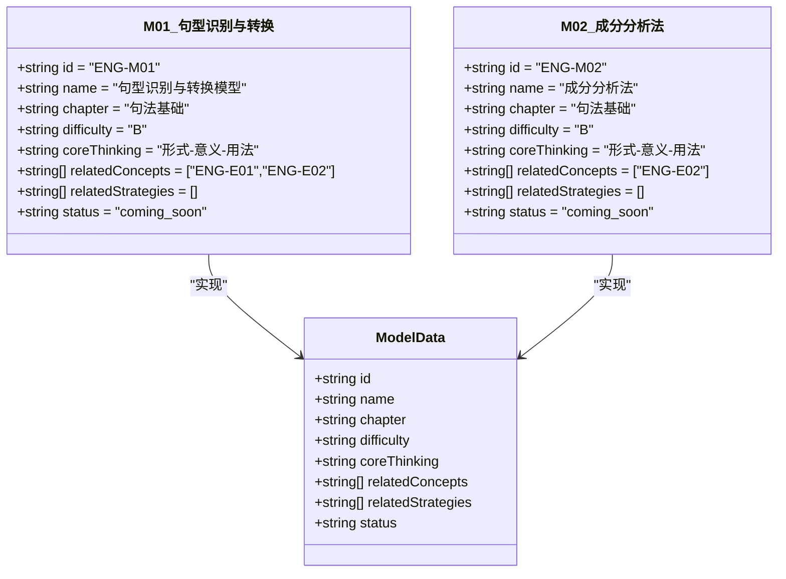
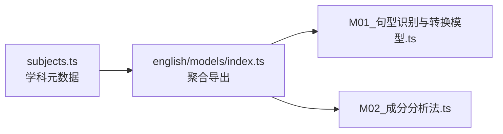

# 英语核心模型

<cite>
**本文引用的文件**
- [src/data/english/models/index.ts](file://src/data/english/models/index.ts)
- [src/data/subjects.ts](file://src/data/subjects.ts)
- [src/data/english/models/M01_句型识别与转换模型.ts](file://src/data/english/models/M01_句型识别与转换模型.ts)
- [src/data/english/models/M02_成分分析法.ts](file://src/data/english/models/M02_成分分析法.ts)
</cite>

## 目录
1. [简介](#简介)
2. [项目结构](#项目结构)
3. [核心组件](#核心组件)
4. [架构总览](#架构总览)
5. [详细组件分析](#详细组件分析)
6. [依赖分析](#依赖分析)
7. [性能考虑](#性能考虑)
8. [故障排查指南](#故障排查指南)
9. [结论](#结论)
10. [附录](#附录)

## 简介
本文件面向“星耀平台”的英语学科，系统化梳理并文档化其“英语核心模型”数据骨架与运行机制。该体系包含52个核心模型，覆盖句型识别与转换、成分分析法、并列结构平行、主从复合句解析、时态一致性分析、语义场构建、阅读与写作策略、听力口语技能以及高考衔接策略等关键领域。文档将从数据结构、分类体系、层级关系、集成应用与教学价值等维度进行深入说明，并给出可复用的代码示例路径，帮助开发者快速实现模型列表获取、详情查询与索引构建。

## 项目结构
英语核心模型位于英语数据目录下，采用“按模型编号命名”的模块化组织方式，统一通过入口文件聚合导出，形成完整的模型清单、索引与章节分组。同时，学科元数据定义了模型前缀与路由前缀，确保模型ID与前端路由的一致性。

图表来源
- [src/data/english/models/index.ts:1-225](file://src/data/english/models/index.ts#L1-L225)
- [src/data/subjects.ts:1-30](file://src/data/subjects.ts#L1-L30)

章节来源
- [src/data/english/models/index.ts:1-225](file://src/data/english/models/index.ts#L1-L225)
- [src/data/subjects.ts:12-19](file://src/data/subjects.ts#L12-L19)

## 核心组件
- 模型聚合与导出：入口文件负责导入全部模型条目，构建完整列表、ID映射与章节分组，并提供按ID查询的便捷函数。
- 模型条目：每个模型以独立TS模块导出，包含标准化字段，便于统一管理与扩展。
- 学科元数据：定义英语学科的模型前缀（如 ENG-M）、概念前缀（如 E）等，确保全局一致。

章节来源
- [src/data/english/models/index.ts:62-125](file://src/data/english/models/index.ts#L62-L125)
- [src/data/subjects.ts:12-19](file://src/data/subjects.ts#L12-L19)

## 架构总览
英语核心模型的数据流由“模型条目 → 聚合导出 → 章节分组 → 查询接口”构成，形成稳定的只读数据层，供前端页面与服务端逻辑消费。

图表来源
- [src/data/english/models/index.ts:117-121](file://src/data/english/models/index.ts#L117-L121)
- [src/data/english/models/index.ts:223-225](file://src/data/english/models/index.ts#L223-L225)
- [src/data/english/models/index.ts:123-221](file://src/data/english/models/index.ts#L123-L221)

## 详细组件分析

### 数据结构与字段说明
每个模型条目遵循统一的数据契约，字段含义如下：
- id：模型唯一标识符，采用学科前缀+两位序号的格式（如 ENG-M01）。
- name：模型名称，用于展示与检索。
- chapter：所属章节，用于模型的分类与导航。
- difficulty：难度等级（示例为字母等级）。
- coreThinking：核心思维维度（如 形式-意义-用法）。
- relatedConcepts：相关知识点ID列表（如 ENG-E01）。
- relatedStrategies：相关解题套路ID列表（预留）。
- status：状态（如 coming_soon）。

章节来源
- [src/data/english/models/M01_句型识别与转换模型.ts:3-11](file://src/data/english/models/M01_句型识别与转换模型.ts#L3-L11)
- [src/data/english/models/M02_成分分析法.ts:3-11](file://src/data/english/models/M02_成分分析法.ts#L3-L11)

### 分类体系与层级关系
英语核心模型按“语法结构、修辞手法、语篇功能、应试策略”等维度进行分组，形成8个章节：
- 句法基础：句型识别与转换、成分分析法、并列结构平行、主从复合句解析。
- 三大从句：名词性/定语/状语从句相关模型。
- 非谓语动词与特殊结构：不定式/动名词/分词/with复合结构/独立主格/倒装句。
- 时态与语态：时态一致性、完成时时间轴、将来时表达、被动语态。
- 词汇与语义系统：词根词缀、一词多义、熟词生义、短语动词、搭配网络、近义词辨析。
- 语篇与阅读能力：衔接链追踪、记叙/说明/议论文阅读、主旨/细节/推理/词义猜测、长难句精读。
- 写作与翻译：书信邮件、演讲稿通知、段落展开、连贯性与衔接、读后续写、概要写作、翻译技巧。
- 听力与口语：短/长对话听力、语音解码、口语话题展开、跨文化交际。
- 高考衔接策略：语法填空、七选五、语法改错、卷面书写规范。

章节来源
- [src/data/english/models/index.ts:123-221](file://src/data/english/models/index.ts#L123-L221)

### 模型数据结构类图

图表来源
- [src/data/english/models/M01_句型识别与转换模型.ts:3-11](file://src/data/english/models/M01_句型识别与转换模型.ts#L3-L11)
- [src/data/english/models/M02_成分分析法.ts:3-11](file://src/data/english/models/M02_成分分析法.ts#L3-L11)

### 获取模型列表与查询详情
- 获取全部模型列表：从入口文件导入 allModels。
- 构建模型索引：使用 modelDataMap（基于 Map 的 id→模型映射）提升查询效率。
- 按ID查询模型：调用 getModelById(id)。
- 获取按章节分组的模型：使用 englishModels（按章节分组的二维数组）。

章节来源
- [src/data/english/models/index.ts:62-125](file://src/data/english/models/index.ts#L62-L125)
- [src/data/english/models/index.ts:117-121](file://src/data/english/models/index.ts#L117-L121)
- [src/data/english/models/index.ts:223-225](file://src/data/english/models/index.ts#L223-L225)
- [src/data/english/models/index.ts:123-221](file://src/data/english/models/index.ts#L123-L221)

### 代码示例路径（不展示具体代码）
- 获取全部模型列表：[src/data/english/models/index.ts:62-115](file://src/data/english/models/index.ts#L62-L115)
- 构建模型索引（Map）：[src/data/english/models/index.ts:117-119](file://src/data/english/models/index.ts#L117-L119)
- 按ID查询模型：[src/data/english/models/index.ts:223-225](file://src/data/english/models/index.ts#L223-L225)
- 获取按章节分组的模型：[src/data/english/models/index.ts:123-221](file://src/data/english/models/index.ts#L123-L221)

### 与知识节点、解题套路、题库练习的集成关系
- 知识节点集成：模型通过 relatedConcepts 字段关联到具体知识点（如 ENG-E01、ENG-E02），实现“模型→知识点”的单向关联，便于学习路径规划与知识图谱联动。
- 解题套路集成：relatedStrategies 字段预留，未来可接入“解题套路”资源，形成“模型→套路→题目”的闭环。
- 题库练习集成：结合章节分组与模型ID，可将题目按模型维度进行筛选与推送，支持“按模型刷题”的精准训练。

章节来源
- [src/data/english/models/M01_句型识别与转换模型.ts:9-9](file://src/data/english/models/M01_句型识别与转换模型.ts#L9-L9)
- [src/data/english/models/M02_成分分析法.ts:9-9](file://src/data/english/models/M02_成分分析法.ts#L9-L9)
- [src/data/english/models/index.ts:123-221](file://src/data/english/models/index.ts#L123-L221)

### 教学应用价值
- 结构化教学：按章节分组呈现，便于教师组织单元教学与阶段性复习。
- 精准学习：模型ID与知识点/题库绑定，支持个性化学习路径与错题巩固。
- 高考衔接：专门的“高考衔接策略”章节，直指应试能力提升，强化实战演练。

章节来源
- [src/data/english/models/index.ts:213-221](file://src/data/english/models/index.ts#L213-L221)

## 依赖分析
- 入口文件依赖所有模型条目模块，形成集中式聚合。
- 模型条目依赖统一的 ModelData 类型（来自学科通用类型定义）。
- 学科元数据提供模型前缀与路由前缀，保证ID与前端路由的一致性。

图表来源
- [src/data/subjects.ts:12-19](file://src/data/subjects.ts#L12-L19)
- [src/data/english/models/index.ts:1-20](file://src/data/english/models/index.ts#L1-L20)

章节来源
- [src/data/subjects.ts:12-19](file://src/data/subjects.ts#L12-L19)
- [src/data/english/models/index.ts:1-20](file://src/data/english/models/index.ts#L1-L20)

## 性能考虑
- 查询性能：使用 Map 构建的 modelDataMap 提升按ID查询效率，避免线性扫描 allModels。
- 渲染优化：englishModels 已按章节分组，前端可直接使用，减少重复计算。
- 数据体积：模型条目为轻量对象，建议保持字段最小化，避免冗余字段导致的内存占用。

章节来源
- [src/data/english/models/index.ts:117-121](file://src/data/english/models/index.ts#L117-L121)
- [src/data/english/models/index.ts:123-221](file://src/data/english/models/index.ts#L123-L221)

## 故障排查指南
- 模型ID缺失或拼写错误：检查 relatedConcepts 与 relatedStrategies 中的ID是否与对应知识点/套路一致。
- 查询不到模型：确认传入的ID是否符合 ENG-MXX 格式，且已在 modelDataMap 中注册。
- 章节分组异常：检查 englishModels 中的模型是否正确归属章节，避免重复或遗漏。

章节来源
- [src/data/english/models/index.ts:117-121](file://src/data/english/models/index.ts#L117-L121)
- [src/data/subjects.ts:12-19](file://src/data/subjects.ts#L12-L19)

## 结论
英语核心模型以清晰的数据结构、明确的分类体系与稳定的聚合导出机制，为星耀平台的英语教学提供了可扩展、可维护的知识载体。通过与知识点、解题套路、题库的深度集成，模型能够支撑从基础语法到高考实战的全链路教学应用，具备良好的教学价值与工程实践意义。

## 附录
- 英语学科元数据（含模型前缀与概念前缀）：[src/data/subjects.ts:12-19](file://src/data/subjects.ts#L12-L19)
- 模型聚合与章节分组入口：[src/data/english/models/index.ts:62-221](file://src/data/english/models/index.ts#L62-L221)
- 示例模型条目（两条）：
  - [M01_句型识别与转换模型.ts:3-11](file://src/data/english/models/M01_句型识别与转换模型.ts#L3-L11)
  - [M02_成分分析法.ts:3-11](file://src/data/english/models/M02_成分分析法.ts#L3-L11)