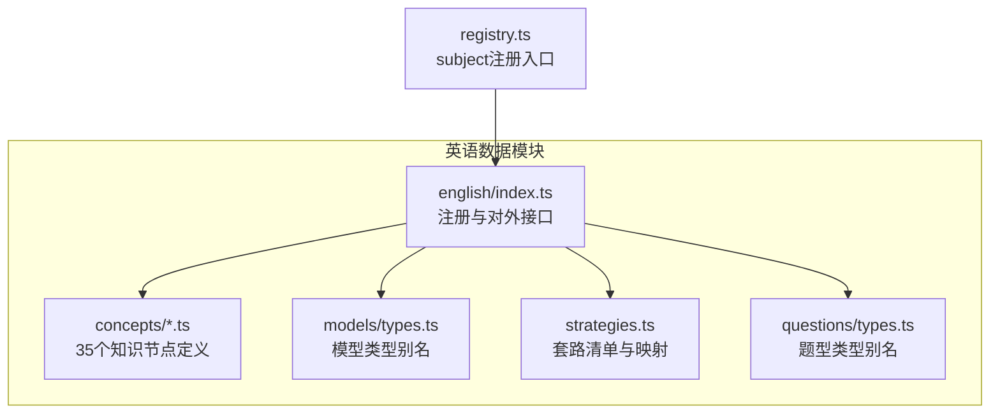
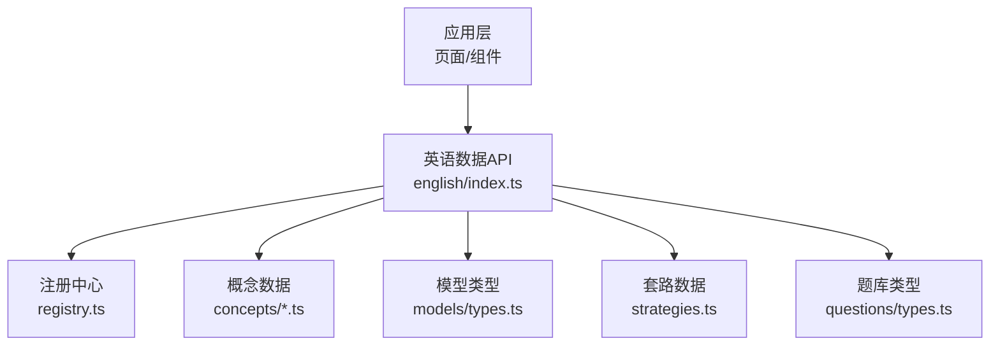
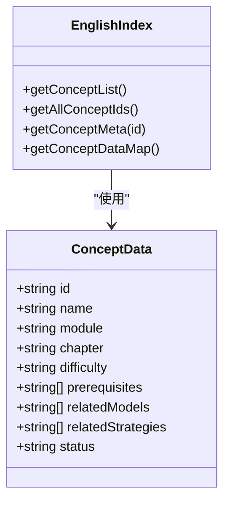
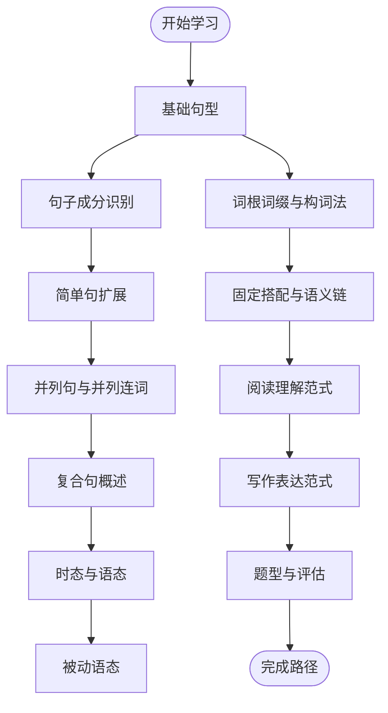
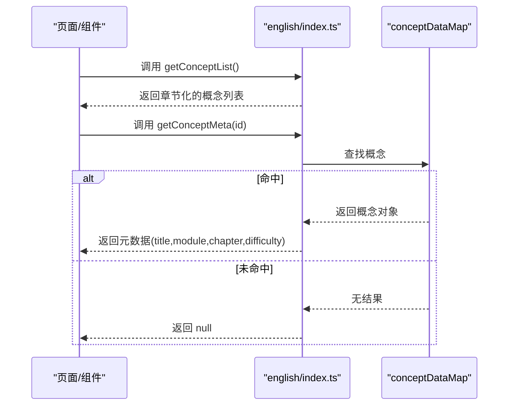
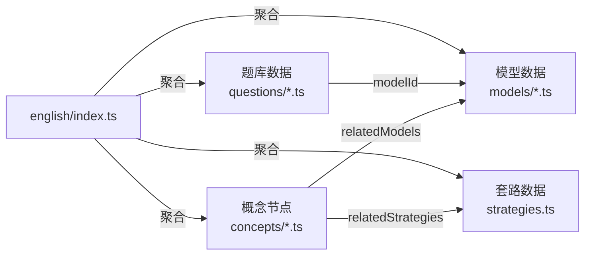
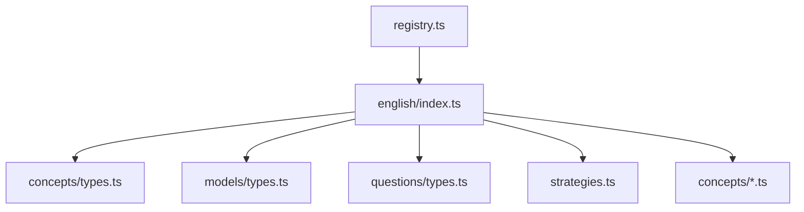

# 英语知识节点

<cite>
**本文引用的文件**
- [src/data/registry.ts](file://src/data/registry.ts)
- [src/data/english/index.ts](file://src/data/english/index.ts)
- [src/data/english/concepts/types.ts](file://src/data/english/concepts/types.ts)
- [src/data/english/models/types.ts](file://src/data/english/models/types.ts)
- [src/data/english/questions/types.ts](file://src/data/english/questions/types.ts)
- [src/data/english/strategies.ts](file://src/data/english/strategies.ts)
- [src/data/english/concepts/E01_英语基本句型.ts](file://src/data/english/concepts/E01_英语基本句型.ts)
- [src/data/english/concepts/E02_句子成分识别.ts](file://src/data/english/concepts/E02_句子成分识别.ts)
- [src/data/english/concepts/E03_简单句的扩展.ts](file://src/data/english/concepts/E03_简单句的扩展.ts)
- [src/data/english/concepts/E04_并列句与并列连词.ts](file://src/data/english/concepts/E04_并列句与并列连词.ts)
- [src/data/english/concepts/E05_复合句概述.ts](file://src/data/english/concepts/E05_复合句概述.ts)
- [src/data/english/concepts/E14_一般现在时与一般过去时.ts](file://src/data/english/concepts/E14_一般现在时与一般过去时.ts)
- [src/data/english/concepts/E15_进行时态.ts](file://src/data/english/concepts/E15_进行时态.ts)
- [src/data/english/concepts/E16a_现在完成时.ts](file://src/data/english/concepts/E16a_现在完成时.ts)
- [src/data/english/concepts/E18_被动语态.ts](file://src/data/english/concepts/E18_被动语态.ts)
- [src/data/english/concepts/E19_词根词缀与构词法.ts](file://src/data/english/concepts/E19_词根词缀与构词法.ts)
</cite>

## 目录
1. [简介](#简介)
2. [项目结构](#项目结构)
3. [核心组件](#核心组件)
4. [架构总览](#架构总览)
5. [详细组件分析](#详细组件分析)
6. [依赖分析](#依赖分析)
7. [性能考虑](#性能考虑)
8. [故障排查指南](#故障排查指南)
9. [结论](#结论)
10. [附录](#附录)

## 简介
本文件面向星耀平台的英语学科知识节点，系统梳理35个核心知识点的组织结构、层级关系、难度等级与学习路径，并定义知识节点的数据结构与检索管理机制。同时说明英语知识节点与模型、套路、题库的关联关系及数据流转方式，帮助开发者与内容团队高效维护与扩展英语知识体系。

## 项目结构
英语知识节点位于英语数据模块下，采用“按主题分文件”的概念清单组织方式，配合统一的注册与查询接口，形成可扩展的知识服务层。

图表来源
- [src/data/english/index.ts:1-150](file://src/data/english/index.ts#L1-L150)
- [src/data/registry.ts](file://src/data/registry.ts)

章节来源
- [src/data/english/index.ts:1-150](file://src/data/english/index.ts#L1-L150)

## 核心组件
- 英语知识节点数据结构
  - 字段说明
    - id: 全局唯一标识，形如 ENG-E01
    - name: 节点名称，用于展示
    - module: 所属学习板块（如“学习板块”）
    - chapter: 所属章节（如“句法基础”、“时态与语态”等）
    - difficulty: 难度等级，取值为 core（核心）、extended（进阶）、basic（基础）
    - prerequisites: 前置知识节点ID数组
    - relatedModels: 关联模型ID数组
    - relatedStrategies: 关联套路ID数组
    - status: 发布状态（如 coming_soon）
  - 示例参考
    - [E01_英语基本句型.ts:3-13](file://src/data/english/concepts/E01_英语基本句型.ts#L3-L13)
    - [E02_句子成分识别.ts:3-13](file://src/data/english/concepts/E02_句子成分识别.ts#L3-L13)
    - [E14_一般现在时与一般过去时.ts:3-13](file://src/data/english/concepts/E14_一般现在时与一般过去时.ts#L3-L13)

- 英语知识节点检索与管理
  - 获取概念列表
    - 接口：getConceptList()
    - 输出：按章节聚合的概念简目（id、name、difficulty），module为空字符串占位
    - 参考：[src/data/english/index.ts:10-20](file://src/data/english/index.ts#L10-L20)
  - 获取全部概念ID
    - 接口：getAllConceptIds()
    - 输出：所有概念id数组
    - 参考：[src/data/english/index.ts:22-24](file://src/data/english/index.ts#L22-L24)
  - 查询概念元数据
    - 接口：getConceptMeta(id)
    - 输出：title、module、chapter、difficulty（核心=2，进阶=3，基础=1）
    - 参考：[src/data/english/index.ts:26-35](file://src/data/english/index.ts#L26-L35)
  - 构建概念索引
    - 数据源：conceptDataMap（由各概念文件导出）
    - 对外：getConceptDataMap()
    - 参考：[src/data/english/index.ts:125-129](file://src/data/english/index.ts#L125-L129)

- 英语模型与套路
  - 模型类型别名
    - 类型：ModelData
    - 来源：[src/data/english/models/types.ts:1-3](file://src/data/english/models/types.ts#L1-L3)
  - 套路清单与映射
    - 数据：allStrategies（59条，含扩展项）
    - 映射：strategyDataMap（id->Strategy）
    - 查询：getStrategyById(id)
    - 参考：[src/data/english/strategies.ts:1-77](file://src/data/english/strategies.ts#L1-L77)

- 英语题库类型别名
  - 类型：Question
  - 来源：[src/data/english/questions/types.ts:1-3](file://src/data/english/questions/types.ts#L1-L3)

章节来源
- [src/data/english/concepts/types.ts:1-3](file://src/data/english/concepts/types.ts#L1-L3)
- [src/data/english/models/types.ts:1-3](file://src/data/english/models/types.ts#L1-L3)
- [src/data/english/questions/types.ts:1-3](file://src/data/english/questions/types.ts#L1-L3)
- [src/data/english/strategies.ts:1-77](file://src/data/english/strategies.ts#L1-L77)
- [src/data/english/concepts/E01_英语基本句型.ts:3-13](file://src/data/english/concepts/E01_英语基本句型.ts#L3-L13)
- [src/data/english/concepts/E02_句子成分识别.ts:3-13](file://src/data/english/concepts/E02_句子成分识别.ts#L3-L13)
- [src/data/english/concepts/E14_一般现在时与一般过去时.ts:3-13](file://src/data/english/concepts/E14_一般现在时与一般过去时.ts#L3-L13)

## 架构总览
英语知识节点通过统一注册入口向平台暴露能力，支持概念列表、元数据查询、模型与套路索引、题库数据等。

图表来源
- [src/data/english/index.ts:125-150](file://src/data/english/index.ts#L125-L150)
- [src/data/registry.ts](file://src/data/registry.ts)

## 详细组件分析

### 组件A：英语知识节点数据结构与索引
- 设计要点
  - 概念文件采用单一导出对象，集中声明id/name/module/chapter/difficulty/prerequisites/relatedModels/relatedStrategies/status
  - 通过english/index.ts聚合为conceptList、conceptDataMap，供上层查询
  - difficulty映射：core→2，extended→3，basic→1；概念列表中使用“基础/进阶/核心”语义，内部统一为数值编码
- 复杂度与性能
  - 概念列表构建：O(N)，N为概念数量
  - 元数据查询：O(1)，基于Map查找
- 错误处理
  - getConceptMeta未命中返回null，调用侧需判空
- 优化建议
  - 若概念数量增长，可考虑章节维度的二级索引
  - 将prerequisites预处理为拓扑序，便于路径规划

图表来源
- [src/data/english/concepts/E01_英语基本句型.ts:3-13](file://src/data/english/concepts/E01_英语基本句型.ts#L3-L13)
- [src/data/english/index.ts:10-35](file://src/data/english/index.ts#L10-L35)

章节来源
- [src/data/english/concepts/E01_英语基本句型.ts:3-13](file://src/data/english/concepts/E01_英语基本句型.ts#L3-L13)
- [src/data/english/concepts/E02_句子成分识别.ts:3-13](file://src/data/english/concepts/E02_句子成分识别.ts#L3-L13)
- [src/data/english/concepts/E03_简单句的扩展.ts:3-13](file://src/data/english/concepts/E03_简单句的扩展.ts#L3-L13)
- [src/data/english/concepts/E04_并列句与并列连词.ts:3-13](file://src/data/english/concepts/E04_并列句与并列连词.ts#L3-L13)
- [src/data/english/concepts/E05_复合句概述.ts:3-13](file://src/data/english/concepts/E05_复合句概述.ts#L3-L13)
- [src/data/english/index.ts:10-35](file://src/data/english/index.ts#L10-L35)

### 组件B：英语学习路径设计与层级关系
- 层级关系
  - 基础句型 → 句子成分识别 → 简单句扩展 → 并列句 → 复合句
  - 时态与语态：基础时态（一般现在/过去）→ 进行时态 → 完成时态（现在/过去/将来）→ 被动语态
  - 词汇与语义：词根词缀与构词法为前置能力
- 难度等级
  - 基础：入门级，如基础句型、基础时态
  - 进阶：需要前后文理解与复杂结构，如复合句、完成时
  - 核心：高频考点与高阶应用，如被动语态、篇章衔接
- 学习路径建议
  - 语法主线：句型→成分→并列→复合→时态/语态
  - 词汇主线：构词法→搭配→语义场→语境推断
  - 阅读主线：体裁特征→衔接手段→主旨/细节→推理/态度→词义猜测
  - 写作主线：应用文范式→段落展开→衔接手段→语言润色→卷面规范

章节来源
- [src/data/english/concepts/E01_英语基本句型.ts:3-13](file://src/data/english/concepts/E01_英语基本句型.ts#L3-L13)
- [src/data/english/concepts/E02_句子成分识别.ts:3-13](file://src/data/english/concepts/E02_句子成分识别.ts#L3-L13)
- [src/data/english/concepts/E03_简单句的扩展.ts:3-13](file://src/data/english/concepts/E03_简单句的扩展.ts#L3-L13)
- [src/data/english/concepts/E04_并列句与并列连词.ts:3-13](file://src/data/english/concepts/E04_并列句与并列连词.ts#L3-L13)
- [src/data/english/concepts/E05_复合句概述.ts:3-13](file://src/data/english/concepts/E05_复合句概述.ts#L3-L13)
- [src/data/english/concepts/E14_一般现在时与一般过去时.ts:3-13](file://src/data/english/concepts/E14_一般现在时与一般过去时.ts#L3-L13)
- [src/data/english/concepts/E15_进行时态.ts:3-13](file://src/data/english/concepts/E15_进行时态.ts#L3-L13)
- [src/data/english/concepts/E16a_现在完成时.ts:3-13](file://src/data/english/concepts/E16a_现在完成时.ts#L3-L13)
- [src/data/english/concepts/E18_被动语态.ts:3-13](file://src/data/english/concepts/E18_被动语态.ts#L3-L13)
- [src/data/english/concepts/E19_词根词缀与构词法.ts:3-13](file://src/data/english/concepts/E19_词根词缀与构词法.ts#L3-L13)

### 组件C：概念检索与元数据查询流程
- 流程说明
  - 列表检索：getConceptList()按章节聚合概念，简化前端渲染
  - 元数据查询：getConceptMeta(id)返回title/module/chapter/difficulty
  - 索引构建：getConceptDataMap()将Map转为普通对象，便于序列化与缓存
- 错误处理
  - 未找到概念ID时getConceptMeta返回null，调用侧应做防御性检查

图表来源
- [src/data/english/index.ts:10-35](file://src/data/english/index.ts#L10-L35)

章节来源
- [src/data/english/index.ts:10-35](file://src/data/english/index.ts#L10-L35)

### 组件D：英语知识节点与模型、套路、题库的关联
- 关联关系
  - 概念与模型：prerequisites/relatedModels指向具体模型ID，支撑“模型驱动的学习路径”
  - 概念与套路：relatedStrategies指向套路ID，实现“范式化教学”
  - 题库与模型：question.modelId用于统计与筛选，支撑“以题带学”
- 数据流转
  - 注册阶段：english/index.ts将allModels/allStrategies/questions等聚合为统一API
  - 运行阶段：getQuestionsByModel()按模型ID分组题目，getModelQuestionStats()统计正确率与总量

图表来源
- [src/data/english/index.ts:125-150](file://src/data/english/index.ts#L125-L150)
- [src/data/english/strategies.ts:1-77](file://src/data/english/strategies.ts#L1-L77)

章节来源
- [src/data/english/index.ts:125-150](file://src/data/english/index.ts#L125-L150)
- [src/data/english/strategies.ts:1-77](file://src/data/english/strategies.ts#L1-L77)

## 依赖分析
- 模块耦合
  - english/index.ts作为聚合层，向上提供稳定API，向下依赖各子模块
  - concepts/types.ts/models/types.ts/questions/types.ts仅提供类型别名，降低耦合
  - strategies.ts提供套路清单与映射，与概念节点通过relatedStrategies建立弱耦合关联
- 外部依赖
  - registry.ts负责subject注册，确保english模块被平台发现

图表来源
- [src/data/registry.ts](file://src/data/registry.ts)
- [src/data/english/index.ts:1-150](file://src/data/english/index.ts#L1-L150)
- [src/data/english/concepts/types.ts:1-3](file://src/data/english/concepts/types.ts#L1-L3)
- [src/data/english/models/types.ts:1-3](file://src/data/english/models/types.ts#L1-L3)
- [src/data/english/questions/types.ts:1-3](file://src/data/english/questions/types.ts#L1-L3)
- [src/data/english/strategies.ts:1-77](file://src/data/english/strategies.ts#L1-L77)

章节来源
- [src/data/registry.ts](file://src/data/registry.ts)
- [src/data/english/index.ts:1-150](file://src/data/english/index.ts#L1-L150)

## 性能考虑
- 概念列表与索引
  - getConceptList()与getConceptDataMap()均为O(N)，N为概念数量；建议在应用启动时一次性加载并缓存
- 元数据查询
  - getConceptMeta()基于Map查找，O(1)；建议在路由切换前预热常用ID
- 题库统计
  - getModelQuestionStats()与getQuestionsByModel()遍历题库，O(Q)；Q为题库规模；可在后台任务或构建期生成快照

## 故障排查指南
- 现象：getConceptMeta(id)返回null
  - 排查：确认id格式是否正确（ENG-Exx），确认conceptDataMap是否包含该id
  - 参考：[src/data/english/index.ts:26-35](file://src/data/english/index.ts#L26-L35)
- 现象：概念列表为空或缺失章节
  - 排查：确认conceptList与chapter/items结构是否符合预期
  - 参考：[src/data/english/index.ts:10-20](file://src/data/english/index.ts#L10-L20)
- 现象：套路查询不到
  - 排查：确认strategyDataMap是否包含目标ID，或allStrategies中是否存在
  - 参考：[src/data/english/strategies.ts:71-77](file://src/data/english/strategies.ts#L71-L77)

章节来源
- [src/data/english/index.ts:26-35](file://src/data/english/index.ts#L26-L35)
- [src/data/english/strategies.ts:71-77](file://src/data/english/strategies.ts#L71-L77)

## 结论
英语知识节点以清晰的数据结构与稳定的API为核心，结合模型、套路与题库形成“教—学—评”闭环。通过概念索引、元数据查询与学习路径设计，能够有效支撑个性化学习与智能推荐。建议持续完善前置依赖与关联关系，逐步开放更多实战范式与题型策略，提升知识节点的实用性与可扩展性。

## 附录
- 代码示例（以路径代替具体代码）
  - 获取概念列表
    - [src/data/english/index.ts:10-20](file://src/data/english/index.ts#L10-L20)
  - 查询概念元数据
    - [src/data/english/index.ts:26-35](file://src/data/english/index.ts#L26-L35)
  - 构建概念索引
    - [src/data/english/index.ts:125-129](file://src/data/english/index.ts#L125-L129)
  - 获取模型章节与模型映射
    - [src/data/english/index.ts:37-48](file://src/data/english/index.ts#L37-L48)
    - [src/data/english/index.ts:131-133](file://src/data/english/index.ts#L131-L133)
  - 获取套路列表与映射
    - [src/data/english/index.ts:140-141](file://src/data/english/index.ts#L140-L141)
    - [src/data/english/strategies.ts:71-77](file://src/data/english/strategies.ts#L71-L77)
  - 题库数据与统计
    - [src/data/english/index.ts:65-99](file://src/data/english/index.ts#L65-L99)
    - [src/data/english/index.ts:105-123](file://src/data/english/index.ts#L105-L123)