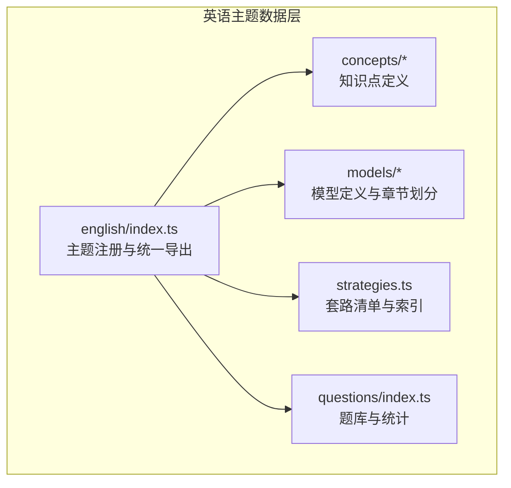
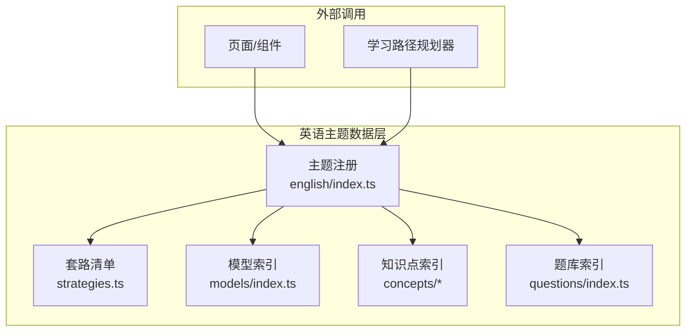
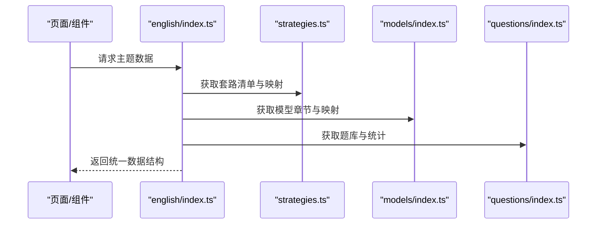
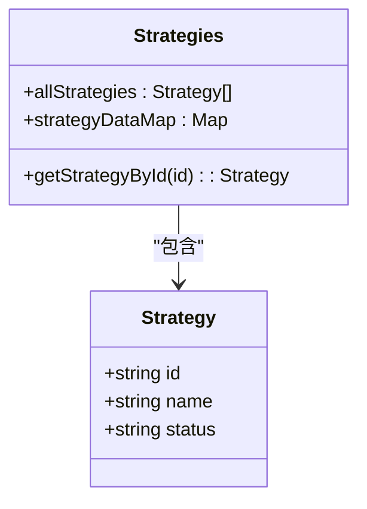
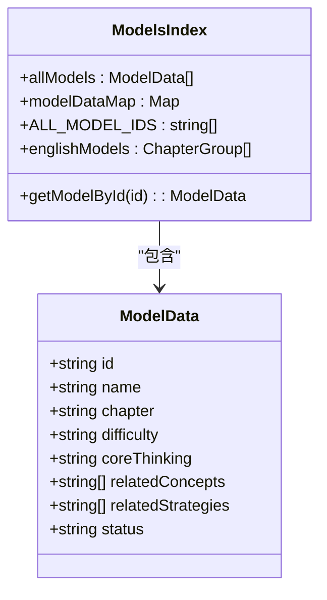
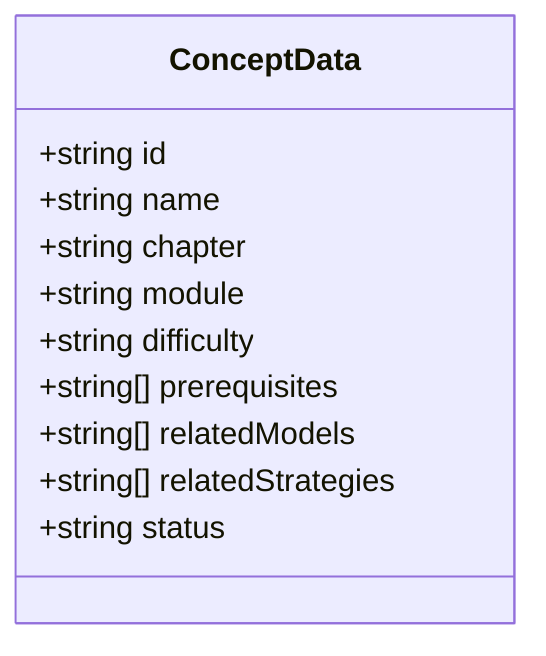
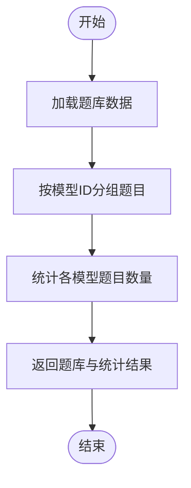
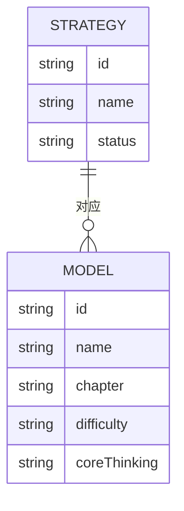
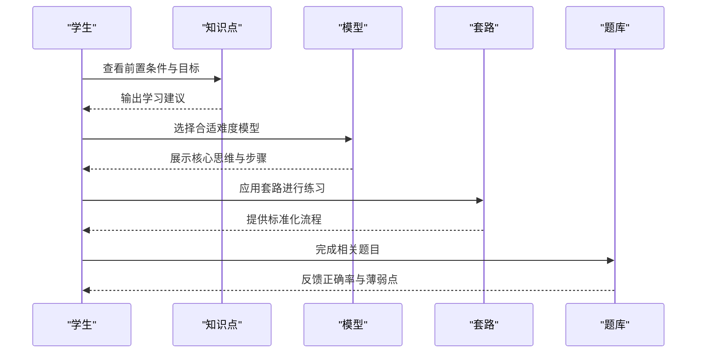
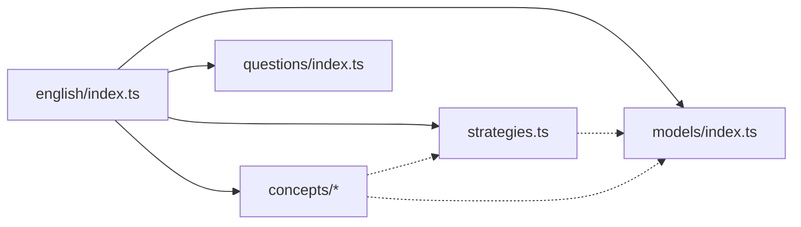

# 英语解题套路

<cite>
**本文引用的文件**
- [src/data/english/index.ts](file://src/data/english/index.ts)
- [src/data/english/strategies.ts](file://src/data/english/strategies.ts)
- [src/data/english/models/index.ts](file://src/data/english/models/index.ts)
- [src/data/english/models/M49_语法填空解题模型.ts](file://src/data/english/models/M49_语法填空解题模型.ts)
- [src/data/english/models/M50_七选五语篇衔接模型.ts](file://src/data/english/models/M50_七选五语篇衔接模型.ts)
- [src/data/english/models/M35_长难句精读模型.ts](file://src/data/english/models/M35_长难句精读模型.ts)
- [src/data/english/concepts/E35_语法填空解题策略.ts](file://src/data/english/concepts/E35_语法填空解题策略.ts)
- [src/data/english/concepts/E36_七选五语篇衔接策略.ts](file://src/data/english/concepts/E36_七选五语篇衔接策略.ts)
- [src/data/english/concepts/E26_长难句分析方法.ts](file://src/data/english/concepts/E26_长难句分析方法.ts)
- [src/data/english/concepts/E25a_主旨概括与标题选择.ts](file://src/data/english/concepts/E25a_主旨概括与标题选择.ts)
- [src/data/english/questions/index.ts](file://src/data/english/questions/index.ts)
</cite>

## 目录
1. [引言](#引言)
2. [项目结构](#项目结构)
3. [核心组件](#核心组件)
4. [架构总览](#架构总览)
5. [详细组件分析](#详细组件分析)
6. [依赖分析](#依赖分析)
7. [性能考虑](#性能考虑)
8. [故障排查指南](#故障排查指南)
9. [结论](#结论)
10. [附录](#附录)

## 引言
本文件面向“星耀平台”的英语学科，系统化梳理并文档化“英语解题套路”体系。该体系以“90个解题套路”为核心，覆盖语法填空、阅读理解、写作表达、听力技巧、口语表达等题型，形成可执行、可迁移、可评测的标准化流程。文档同时解释套路与核心模型的映射关系，给出分类体系（按题型、难度、知识点），并通过数据结构与查询接口展示如何在系统中落地使用，最后说明如何基于学生水平进行个性化学习路径推荐。

## 项目结构
英语学科数据层采用“主题注册 + 知识点/模型/策略/题库”的分层组织方式：
- 主题注册：在英语主题入口集中导出概念、模型、公式、策略、题库等数据与查询方法
- 知识点（Concepts）：描述学习目标、前置条件、关联模型与策略
- 模型（Models）：对应具体“套路”的可执行模型，包含章节、难度、核心思维、关联知识点等
- 策略（Strategies）：以编号命名的套路清单，作为教学与训练的抓手
- 题库（Questions）：按模型维度组织的题目集合，支持统计与筛选

图表来源
- [src/data/english/index.ts:125-150](file://src/data/english/index.ts#L125-L150)
- [src/data/english/models/index.ts:123-221](file://src/data/english/models/index.ts#L123-L221)
- [src/data/english/strategies.ts:9-69](file://src/data/english/strategies.ts#L9-L69)
- [src/data/english/questions/index.ts:1-15](file://src/data/english/questions/index.ts#L1-L15)

章节来源
- [src/data/english/index.ts:1-150](file://src/data/english/index.ts#L1-L150)
- [src/data/english/models/index.ts:1-225](file://src/data/english/models/index.ts#L1-L225)
- [src/data/english/strategies.ts:1-77](file://src/data/english/strategies.ts#L1-L77)
- [src/data/english/questions/index.ts:1-15](file://src/data/english/questions/index.ts#L1-L15)

## 核心组件
- 英语主题注册与导出
  - 提供概念列表、概念元数据、模型章节、公式数据、套路清单、题库配置与统计等统一入口
  - 关键函数：getConceptList、getConceptMeta、getModelChapters、getFormulaData、getParadigmList、getQuestionBankData、getModelQuestionStats、getQuestionsByModel
- 套路（Strategies）
  - 以编号 ENG-Fxx 表示的90个套路，覆盖句法、语义、阅读、写作、听力、口语、高考衔接等
  - 支持按ID查询与数据映射
- 模型（Models）
  - 以 ENG-Mxx 编号的模型，对应具体套路的可执行模板，包含章节、难度、核心思维、关联知识点等
  - 按“句法基础、三大从句、非谓语动词与特殊结构、时态与语态、词汇与语义系统、语篇与阅读能力、写作与翻译、听力与口语、高考衔接策略”等章节组织
- 知识点（Concepts）
  - 描述学习目标、前置条件、关联模型与策略，支撑“先学后练”的闭环
- 题库（Questions）
  - 以模型维度组织的题目集合，支持统计与筛选，便于学习路径与诊断评估

章节来源
- [src/data/english/index.ts:101-150](file://src/data/english/index.ts#L101-L150)
- [src/data/english/strategies.ts:9-77](file://src/data/english/strategies.ts#L9-L77)
- [src/data/english/models/index.ts:62-121](file://src/data/english/models/index.ts#L62-L121)
- [src/data/english/questions/index.ts:1-15](file://src/data/english/questions/index.ts#L1-L15)

## 架构总览
下图展示了英语主题数据层的对外接口与内部模块的关系，体现“套路—模型—知识点—题库”的闭环：

图表来源
- [src/data/english/index.ts:125-150](file://src/data/english/index.ts#L125-L150)
- [src/data/english/strategies.ts:71-77](file://src/data/english/strategies.ts#L71-L77)
- [src/data/english/models/index.ts:117-121](file://src/data/english/models/index.ts#L117-L121)
- [src/data/english/questions/index.ts:5-11](file://src/data/english/questions/index.ts#L5-L11)

## 详细组件分析

### 组件A：英语主题注册与统一导出
- 职责
  - 将概念、模型、公式、策略、题库等数据统一注册到“英语主题”，提供查询与统计接口
  - 为上层UI与学习路径规划器提供稳定的数据契约
- 关键点
  - 概念与模型的元数据转换：难度映射、章节/模块标注
  - 套路数据映射：以ID为键的Map，便于快速查询
  - 题库统计：按模型维度统计题目数量，支持学习进度与诊断
- 使用场景
  - 页面加载时一次性拉取主题数据
  - 学习路径规划器按模型/知识点筛选题目
  - 教师端/运营端进行题库与模型的可视化管理

图表来源
- [src/data/english/index.ts:125-150](file://src/data/english/index.ts#L125-L150)
- [src/data/english/strategies.ts:71-77](file://src/data/english/strategies.ts#L71-L77)
- [src/data/english/models/index.ts:117-121](file://src/data/english/models/index.ts#L117-L121)
- [src/data/english/questions/index.ts:5-11](file://src/data/english/questions/index.ts#L5-L11)

章节来源
- [src/data/english/index.ts:101-150](file://src/data/english/index.ts#L101-L150)

### 组件B：套路（Strategies）——90个解题套路
- 结构
  - ID：ENG-Fxx
  - 名称：对应题型或技能的“范式”
  - 状态：published/draft/coming_soon
- 分类
  - 按题型：语法填空、七选五、语法改错、阅读理解、写作表达、听力、口语等
  - 按难度：与模型难度一致（基础/进阶/挑战）
  - 按知识点：与模型/概念的关联
- 查询
  - 通过ID查询单个套路
  - 通过Map按ID快速检索

图表来源
- [src/data/english/strategies.ts:1-77](file://src/data/english/strategies.ts#L1-L77)

章节来源
- [src/data/english/strategies.ts:9-77](file://src/data/english/strategies.ts#L9-L77)

### 组件C：模型（Models）——套路的可执行模板
- 结构
  - ID：ENG-Mxx
  - 名称：模型名称
  - 章节：如“高考衔接策略”“语篇与阅读能力”等
  - 难度：J/T（对应基础/进阶/挑战）
  - 核心思维：指导解题的关键思维
  - 关联知识点/策略：建立与概念、套路的双向链接
- 章节划分
  - 句法基础、三大从句、非谓语动词与特殊结构、时态与语态、词汇与语义系统、语篇与阅读能力、写作与翻译、听力与口语、高考衔接策略
- 查询
  - 通过ID查询模型
  - 通过章节聚合模型

图表来源
- [src/data/english/models/index.ts:62-121](file://src/data/english/models/index.ts#L62-L121)
- [src/data/english/models/index.ts:123-221](file://src/data/english/models/index.ts#L123-L221)

章节来源
- [src/data/english/models/index.ts:62-121](file://src/data/english/models/index.ts#L62-L121)
- [src/data/english/models/index.ts:123-221](file://src/data/english/models/index.ts#L123-L221)

### 组件D：知识点（Concepts）——学习目标与前置条件
- 结构
  - ID：ENG-Exx
  - 名称：知识点名称
  - 章节/模块：所属板块
  - 难度：core/extended
  - 前置条件：先修知识点ID列表
  - 关联模型/策略：建立与模型、套路的双向链接
- 作用
  - 规划学习顺序
  - 支撑“先学后练”闭环

图表来源
- [src/data/english/concepts/E35_语法填空解题策略.ts:3-13](file://src/data/english/concepts/E35_语法填空解题策略.ts#L3-L13)
- [src/data/english/concepts/E36_七选五语篇衔接策略.ts:3-13](file://src/data/english/concepts/E36_七选五语篇衔接策略.ts#L3-L13)
- [src/data/english/concepts/E26_长难句分析方法.ts:3-13](file://src/data/english/concepts/E26_长难句分析方法.ts#L3-L13)
- [src/data/english/concepts/E25a_主旨概括与标题选择.ts:3-13](file://src/data/english/concepts/E25a_主旨概括与标题选择.ts#L3-L13)

章节来源
- [src/data/english/concepts/E35_语法填空解题策略.ts:3-13](file://src/data/english/concepts/E35_语法填空解题策略.ts#L3-L13)
- [src/data/english/concepts/E36_七选五语篇衔接策略.ts:3-13](file://src/data/english/concepts/E36_七选五语篇衔接策略.ts#L3-L13)
- [src/data/english/concepts/E26_长难句分析方法.ts:3-13](file://src/data/english/concepts/E26_长难句分析方法.ts#L3-L13)
- [src/data/english/concepts/E25a_主旨概括与标题选择.ts:3-13](file://src/data/english/concepts/E25a_主旨概括与标题选择.ts#L3-L13)

### 组件E：题库（Questions）——按模型组织的题目
- 结构
  - 题目对象包含模型ID字段，用于按模型维度组织
  - 提供按模型ID过滤题目、统计题目数量等能力
- 作用
  - 支撑“以模型为中心”的练习与测评
  - 为学习路径推荐提供素材

图表来源
- [src/data/english/questions/index.ts:1-15](file://src/data/english/questions/index.ts#L1-L15)
- [src/data/english/index.ts:105-123](file://src/data/english/index.ts#L105-L123)

章节来源
- [src/data/english/questions/index.ts:1-15](file://src/data/english/questions/index.ts#L1-L15)
- [src/data/english/index.ts:105-123](file://src/data/english/index.ts#L105-L123)

### 组件F：套路与模型的对应关系
- 对应关系
  - 每个套路（Strategy）对应一个或多个模型（Model）
  - 模型承载“可执行”的套路模板，包含章节、难度、核心思维、关联知识点
- 示例
  - 语法填空解题套路 ENG-F48 对应模型 ENG-M49
  - 七选五语篇衔接套路 ENG-F49 对应模型 ENG-M50
  - 长难句精读套路 ENG-F34 对应模型 ENG-M35

图表来源
- [src/data/english/strategies.ts:9-69](file://src/data/english/strategies.ts#L9-L69)
- [src/data/english/models/M49_语法填空解题模型.ts:3-12](file://src/data/english/models/M49_语法填空解题模型.ts#L3-L12)
- [src/data/english/models/M50_七选五语篇衔接模型.ts:3-12](file://src/data/english/models/M50_七选五语篇衔接模型.ts#L3-L12)
- [src/data/english/models/M35_长难句精读模型.ts:3-12](file://src/data/english/models/M35_长难句精读模型.ts#L3-L12)

章节来源
- [src/data/english/strategies.ts:9-69](file://src/data/english/strategies.ts#L9-L69)
- [src/data/english/models/M49_语法填空解题模型.ts:3-12](file://src/data/english/models/M49_语法填空解题模型.ts#L3-L12)
- [src/data/english/models/M50_七选五语篇衔接模型.ts:3-12](file://src/data/english/models/M50_七选五语篇衔接模型.ts#L3-L12)
- [src/data/english/models/M35_长难句精读模型.ts:3-12](file://src/data/english/models/M35_长难句精读模型.ts#L3-L12)

### 组件G：知识点、模型、套路的联动
- 学习路径闭环
  - 从知识点（Concept）出发，明确前置条件与学习目标
  - 通过模型（Model）承载套路（Strategy）进行训练
  - 以题库（Question）进行巩固与评估
- 推荐策略
  - 先行掌握前置知识点，再进入相关模型与套路
  - 基于模型难度与学生水平匹配练习

图表来源
- [src/data/english/concepts/E35_语法填空解题策略.ts:3-13](file://src/data/english/concepts/E35_语法填空解题策略.ts#L3-L13)
- [src/data/english/models/M49_语法填空解题模型.ts:3-12](file://src/data/english/models/M49_语法填空解题模型.ts#L3-L12)
- [src/data/english/strategies.ts:9-69](file://src/data/english/strategies.ts#L9-L69)
- [src/data/english/questions/index.ts:1-15](file://src/data/english/questions/index.ts#L1-L15)

章节来源
- [src/data/english/concepts/E35_语法填空解题策略.ts:3-13](file://src/data/english/concepts/E35_语法填空解题策略.ts#L3-L13)
- [src/data/english/models/M49_语法填空解题模型.ts:3-12](file://src/data/english/models/M49_语法填空解题模型.ts#L3-L12)
- [src/data/english/strategies.ts:9-69](file://src/data/english/strategies.ts#L9-L69)
- [src/data/english/questions/index.ts:1-15](file://src/data/english/questions/index.ts#L1-L15)

## 依赖分析
- 组件耦合
  - 英语主题注册集中导出所有数据，降低上层依赖复杂度
  - 套路与模型之间为“一对多”关系，便于扩展与复用
  - 知识点与模型/策略之间为“多对多”关系，支撑灵活的学习路径
- 外部依赖
  - 与UI组件、学习路径规划器、题库系统等模块对接
- 循环依赖
  - 当前结构清晰，未发现循环依赖

图表来源
- [src/data/english/index.ts:125-150](file://src/data/english/index.ts#L125-L150)
- [src/data/english/strategies.ts:71-77](file://src/data/english/strategies.ts#L71-L77)
- [src/data/english/models/index.ts:117-121](file://src/data/english/models/index.ts#L117-L121)
- [src/data/english/questions/index.ts:5-11](file://src/data/english/questions/index.ts#L5-L11)

章节来源
- [src/data/english/index.ts:125-150](file://src/data/english/index.ts#L125-L150)

## 性能考虑
- 数据加载
  - 建议在应用启动阶段一次性加载英语主题数据，减少重复请求
- 查询优化
  - 利用Map按ID快速查询（套路、模型、题库）
  - 对题库统计采用一次遍历生成，避免重复计算
- 渲染优化
  - 按需渲染章节与模型列表，结合虚拟滚动提升大数据量下的交互体验

## 故障排查指南
- 套路/模型ID不存在
  - 现象：按ID查询返回空
  - 排查：确认ID格式是否符合 ENG-Fxx 或 ENG-Mxx；检查数据是否已注册
- 题库统计异常
  - 现象：某模型题目数不正确
  - 排查：确认题目对象是否包含正确的 modelId 字段；检查数据初始化逻辑
- 知识点前置条件缺失
  - 现象：学习路径规划失败
  - 排查：确认 prerequisites 是否完整；确保前置知识点已上线

章节来源
- [src/data/english/strategies.ts:75-77](file://src/data/english/strategies.ts#L75-L77)
- [src/data/english/models/index.ts:223-225](file://src/data/english/models/index.ts#L223-L225)
- [src/data/english/questions/index.ts:9-15](file://src/data/english/questions/index.ts#L9-L15)

## 结论
英语解题套路体系以“知识点—模型—套路—题库”为主线，构建了可执行、可迁移、可评测的学习闭环。通过主题注册与统一导出，系统实现了对90个套路的标准化管理，并为个性化学习路径推荐提供了坚实的数据基础。建议在实际应用中：
- 优先完成模型与知识点的完善，确保“先学后练”
- 逐步补齐题库，支撑练习与评估
- 基于难度与学生水平动态调整推荐策略

## 附录
- 分类体系建议
  - 按题型：选择题、填空题、解答题、判断题
  - 按难度：基础（B）、进阶（J）、挑战（T）
  - 按知识点：语法、词汇、阅读、写作、听力、口语、高考衔接
- 代码示例（路径）
  - 套路查询：[src/data/english/strategies.ts:75-77](file://src/data/english/strategies.ts#L75-L77)
  - 模型查询：[src/data/english/models/index.ts:223-225](file://src/data/english/models/index.ts#L223-L225)
  - 题库统计：[src/data/english/index.ts:105-123](file://src/data/english/index.ts#L105-L123)
  - 题目按模型过滤：[src/data/english/questions/index.ts:13-15](file://src/data/english/questions/index.ts#L13-L15)