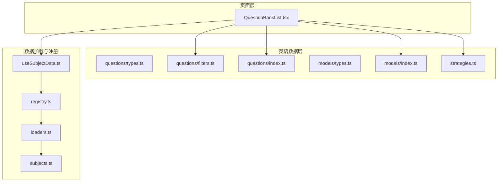
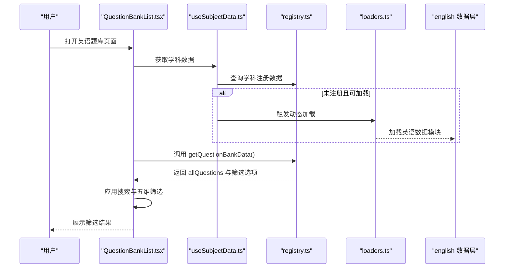
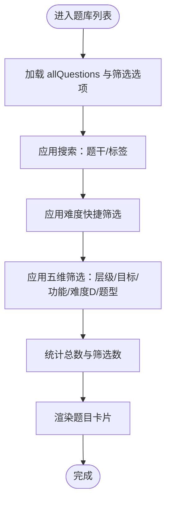
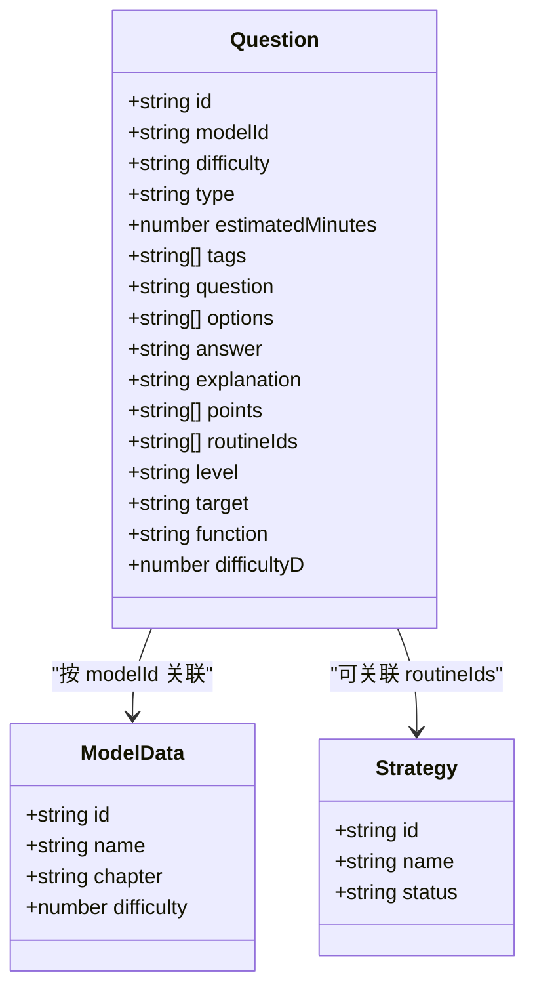
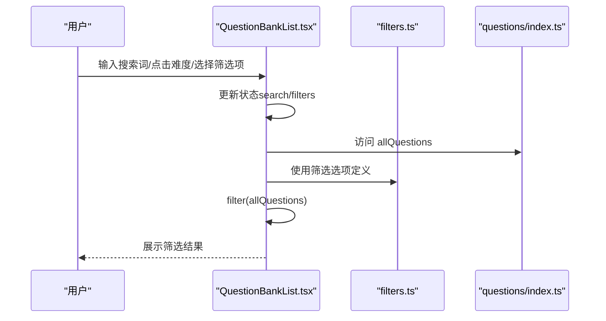
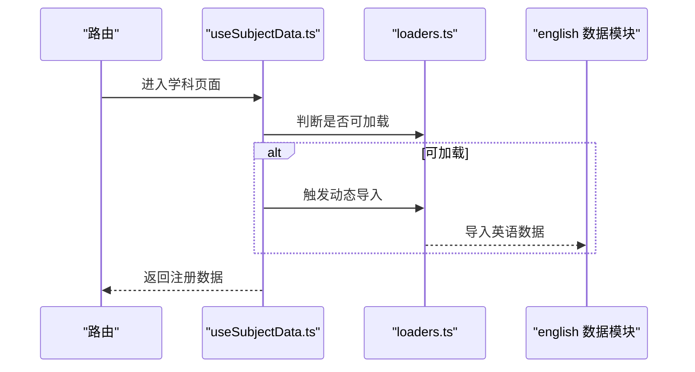
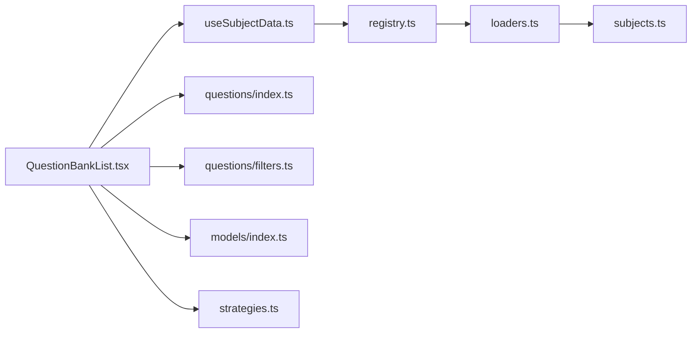

# 英语题库系统

<cite>
**本文引用的文件**
- [src/data/physics/questions/types.ts](file://src/data/physics/questions/types.ts)
- [src/data/english/questions/types.ts](file://src/data/english/questions/types.ts)
- [src/data/english/questions/filters.ts](file://src/data/english/questions/filters.ts)
- [src/data/english/questions/index.ts](file://src/data/english/questions/index.ts)
- [src/data/english/models/types.ts](file://src/data/english/models/types.ts)
- [src/data/english/models/index.ts](file://src/data/english/models/index.ts)
- [src/data/english/strategies.ts](file://src/data/english/strategies.ts)
- [src/sections/QuestionBankList.tsx](file://src/sections/QuestionBankList.tsx)
- [src/hooks/useSubjectData.ts](file://src/hooks/useSubjectData.ts)
- [src/data/registry.ts](file://src/data/registry.ts)
- [src/data/loaders.ts](file://src/data/loaders.ts)
- [src/data/subjects.ts](file://src/data/subjects.ts)
- [src/sections/EnglishGuidePage.tsx](file://src/sections/EnglishGuidePage.tsx)
</cite>

## 目录
1. [引言](#引言)
2. [项目结构](#项目结构)
3. [核心组件](#核心组件)
4. [架构总览](#架构总览)
5. [详细组件分析](#详细组件分析)
6. [依赖分析](#依赖分析)
7. [性能考虑](#性能考虑)
8. [故障排查指南](#故障排查指南)
9. [结论](#结论)
10. [附录](#附录)

## 引言
本文件面向“星耀平台”的英语题库系统，系统性阐述英语学科题库的组织架构、题目数据结构、筛选机制、难度分级与功能分类，并结合前端页面与数据加载机制，给出题库查询、筛选与统计的实现要点与最佳实践。文档同时说明题库与核心模型、解题套路的集成关系，以及如何基于现有结构实现个性化题目推荐与学习路径优化。

## 项目结构
英语题库相关代码主要分布在以下位置：
- 数据层（英语学科）：src/data/english/questions、src/data/english/models、src/data/english/strategies
- 页面层（英语题库列表页）：src/sections/QuestionBankList.tsx
- 数据加载与注册：src/hooks/useSubjectData.ts、src/data/registry.ts、src/data/loaders.ts、src/data/subjects.ts
- 参考结构（物理题库类型）：src/data/physics/questions/types.ts

图表来源
- [src/sections/QuestionBankList.tsx:1-424](file://src/sections/QuestionBankList.tsx#L1-L424)
- [src/hooks/useSubjectData.ts:1-46](file://src/hooks/useSubjectData.ts#L1-L46)
- [src/data/registry.ts:1-52](file://src/data/registry.ts#L1-L52)
- [src/data/loaders.ts:1-27](file://src/data/loaders.ts#L1-L27)
- [src/data/subjects.ts:1-30](file://src/data/subjects.ts#L1-L30)
- [src/data/english/questions/types.ts:1-3](file://src/data/english/questions/types.ts#L1-L3)
- [src/data/english/questions/filters.ts:1-38](file://src/data/english/questions/filters.ts#L1-L38)
- [src/data/english/questions/index.ts:1-15](file://src/data/english/questions/index.ts#L1-L15)
- [src/data/english/models/types.ts:1-3](file://src/data/english/models/types.ts#L1-L3)
- [src/data/english/models/index.ts:1-225](file://src/data/english/models/index.ts#L1-L225)
- [src/data/english/strategies.ts:1-77](file://src/data/english/strategies.ts#L1-L77)

章节来源
- [src/sections/QuestionBankList.tsx:1-424](file://src/sections/QuestionBankList.tsx#L1-L424)
- [src/hooks/useSubjectData.ts:1-46](file://src/hooks/useSubjectData.ts#L1-L46)
- [src/data/registry.ts:1-52](file://src/data/registry.ts#L1-L52)
- [src/data/loaders.ts:1-27](file://src/data/loaders.ts#L1-L27)
- [src/data/subjects.ts:1-30](file://src/data/subjects.ts#L1-L30)

## 核心组件
- 题目数据结构与筛选选项
  - 英语题库题目接口参考物理题库的 Question 接口，包含基础字段与五维筛选字段（难度、能力层级、学习目标、题目功能、六级难度），便于统一管理与扩展。
  - 筛选选项集中于 filters.ts，涵盖难度分级（B/J/T）、能力层级（L1/L2/L3）、学习目标（同步学习、期中期末、高考专项、竞赛拓展）、题目功能（巩固练习、复习检测、诊断评估、真题演练）、题型与六级难度 D1-D6。
- 题库数据访问
  - questions/index.ts 提供题目数组、ID 到题目的映射、按 modelId 查询题目等基础方法。
- 模型与套路
  - models/index.ts 提供英语模型列表、分章节组织、ID 到模型映射与查询方法。
  - strategies.ts 提供英语解题套路列表、ID 到套路映射与查询方法。
- 页面与筛选交互
  - QuestionBankList.tsx 实现题库列表页，包含搜索、难度快捷筛选、五维筛选面板、结果计数与清空筛选等交互逻辑。

章节来源
- [src/data/physics/questions/types.ts:1-35](file://src/data/physics/questions/types.ts#L1-L35)
- [src/data/english/questions/types.ts:1-3](file://src/data/english/questions/types.ts#L1-L3)
- [src/data/english/questions/filters.ts:1-38](file://src/data/english/questions/filters.ts#L1-L38)
- [src/data/english/questions/index.ts:1-15](file://src/data/english/questions/index.ts#L1-L15)
- [src/data/english/models/index.ts:1-225](file://src/data/english/models/index.ts#L1-L225)
- [src/data/english/strategies.ts:1-77](file://src/data/english/strategies.ts#L1-L77)
- [src/sections/QuestionBankList.tsx:1-424](file://src/sections/QuestionBankList.tsx#L1-L424)

## 架构总览
英语题库系统采用“页面层 + 数据加载钩子 + 注册表 + 动态加载 + 数据层”的分层架构：
- 页面层负责用户交互与筛选展示；
- 数据加载钩子负责按学科动态加载数据；
- 注册表统一暴露题库数据与选项；
- 数据层提供题目、模型、套路等数据与查询方法。

图表来源
- [src/sections/QuestionBankList.tsx:29-83](file://src/sections/QuestionBankList.tsx#L29-L83)
- [src/hooks/useSubjectData.ts:7-46](file://src/hooks/useSubjectData.ts#L7-L46)
- [src/data/registry.ts:25-34](file://src/data/registry.ts#L25-L34)
- [src/data/loaders.ts:11-22](file://src/data/loaders.ts#L11-L22)

章节来源
- [src/sections/QuestionBankList.tsx:1-424](file://src/sections/QuestionBankList.tsx#L1-L424)
- [src/hooks/useSubjectData.ts:1-46](file://src/hooks/useSubjectData.ts#L1-L46)
- [src/data/registry.ts:1-52](file://src/data/registry.ts#L1-L52)
- [src/data/loaders.ts:1-27](file://src/data/loaders.ts#L1-L27)

## 详细组件分析

### 组件A：题目数据结构与筛选机制
- 数据结构要点
  - 参考物理题库的 Question 接口，英语题库可复用该结构，包含基础字段（id、modelId、question、options、answer、explanation、points、tags 等）与五维筛选字段（difficulty、level、target、function、difficultyD、type）。
  - 英语 questions/types.ts 通过重新导出物理 Question 类型，确保类型一致性与可扩展性。
- 筛选机制
  - filters.ts 定义难度（B/J/T）、能力层级（L1/L2/L3）、学习目标（SYNC/EXAM/GAOKAO/COMP）、题目功能（PRAC/REV/DIAG/REAL）、题型（CHOICE/FILL/JUDGE/ANSWER）与六级难度（D1-D6）选项。
  - QuestionBankList.tsx 在渲染前对 allQuestions 应用多条件过滤：难度快捷筛选、搜索题干与标签、五维筛选项（level/target/function/difficultyD/type）。
- 示例（代码片段路径）
  - 题目类型定义参考：[src/data/physics/questions/types.ts:4-35](file://src/data/physics/questions/types.ts#L4-L35)
  - 英语类型复用：[src/data/english/questions/types.ts:1-3](file://src/data/english/questions/types.ts#L1-L3)
  - 筛选选项定义：[src/data/english/questions/filters.ts:1-38](file://src/data/english/questions/filters.ts#L1-L38)
  - 页面筛选逻辑：[src/sections/QuestionBankList.tsx:69-83](file://src/sections/QuestionBankList.tsx#L69-L83)

图表来源
- [src/sections/QuestionBankList.tsx:69-83](file://src/sections/QuestionBankList.tsx#L69-L83)
- [src/data/english/questions/filters.ts:1-38](file://src/data/english/questions/filters.ts#L1-L38)

章节来源
- [src/data/physics/questions/types.ts:1-35](file://src/data/physics/questions/types.ts#L1-L35)
- [src/data/english/questions/types.ts:1-3](file://src/data/english/questions/types.ts#L1-L3)
- [src/data/english/questions/filters.ts:1-38](file://src/data/english/questions/filters.ts#L1-L38)
- [src/sections/QuestionBankList.tsx:1-424](file://src/sections/QuestionBankList.tsx#L1-L424)

### 组件B：模型与套路集成
- 模型集成
  - models/index.ts 提供英语模型列表、章节划分、ID 映射与查询方法；页面通过 modelId 关联题目，实现“按模型筛选”。
- 套路集成
  - strategies.ts 提供英语解题套路列表与查询方法；可作为题目关联的“解题套路 ID”来源，用于题目与套路的双向关联。
- 示例（代码片段路径）
  - 模型列表与章节：[src/data/english/models/index.ts:123-221](file://src/data/english/models/index.ts#L123-L221)
  - 套路列表与查询：[src/data/english/strategies.ts:9-77](file://src/data/english/strategies.ts#L9-L77)
  - 按模型筛选调用：[src/data/english/questions/index.ts:13-15](file://src/data/english/questions/index.ts#L13-L15)

图表来源
- [src/data/physics/questions/types.ts:4-35](file://src/data/physics/questions/types.ts#L4-L35)
- [src/data/english/models/index.ts:117-119](file://src/data/english/models/index.ts#L117-L119)
- [src/data/english/strategies.ts:1-5](file://src/data/english/strategies.ts#L1-L5)

章节来源
- [src/data/english/models/index.ts:1-225](file://src/data/english/models/index.ts#L1-L225)
- [src/data/english/strategies.ts:1-77](file://src/data/english/strategies.ts#L1-L77)
- [src/data/english/questions/index.ts:1-15](file://src/data/english/questions/index.ts#L1-L15)

### 组件C：页面交互与筛选流程
- 搜索与难度快捷筛选
  - 支持在题干与标签中搜索；难度快捷筛选（全部/B/J/T）即时生效。
- 五维筛选面板
  - 能力层级、学习目标、题目功能、难度等级（D1-D6）、题型，均可单独或组合筛选。
- 结果展示与统计
  - 展示题目总数与筛选后数量；支持清除全部筛选；题目卡片包含难度徽章、难度D徽章、题型、模型标签、标签云与预计时长。
- 示例（代码片段路径）
  - 搜索与筛选逻辑：[src/sections/QuestionBankList.tsx:69-83](file://src/sections/QuestionBankList.tsx#L69-L83)
  - 面板与按钮交互：[src/sections/QuestionBankList.tsx:225-372](file://src/sections/QuestionBankList.tsx#L225-L372)
  - 卡片渲染与跳转：[src/sections/QuestionBankList.tsx:387-418](file://src/sections/QuestionBankList.tsx#L387-L418)

图表来源
- [src/sections/QuestionBankList.tsx:69-83](file://src/sections/QuestionBankList.tsx#L69-L83)
- [src/data/english/questions/filters.ts:1-38](file://src/data/english/questions/filters.ts#L1-L38)
- [src/data/english/questions/index.ts:1-15](file://src/data/english/questions/index.ts#L1-L15)

章节来源
- [src/sections/QuestionBankList.tsx:1-424](file://src/sections/QuestionBankList.tsx#L1-L424)
- [src/data/english/questions/filters.ts:1-38](file://src/data/english/questions/filters.ts#L1-L38)
- [src/data/english/questions/index.ts:1-15](file://src/data/english/questions/index.ts#L1-L15)

### 组件D：数据加载与注册
- 动态加载
  - loaders.ts 中为 english 提供动态导入；useSubjectData.ts 在路由切换时触发加载。
- 注册表
  - registry.ts 定义 SubjectDataRegistry 接口，统一暴露 getQuestionBankData、getAllQuestions、getQuestionsByModel、getModelQuestionStats 等方法。
- 示例（代码片段路径）
  - 动态加载配置：[src/data/loaders.ts:1-7](file://src/data/loaders.ts#L1-L7)
  - 加载流程与取消：[src/hooks/useSubjectData.ts:19-43](file://src/hooks/useSubjectData.ts#L19-L43)
  - 注册表接口：[src/data/registry.ts:25-34](file://src/data/registry.ts#L25-L34)

图表来源
- [src/hooks/useSubjectData.ts:19-43](file://src/hooks/useSubjectData.ts#L19-L43)
- [src/data/loaders.ts:11-22](file://src/data/loaders.ts#L11-L22)

章节来源
- [src/hooks/useSubjectData.ts:1-46](file://src/hooks/useSubjectData.ts#L1-L46)
- [src/data/loaders.ts:1-27](file://src/data/loaders.ts#L1-L27)
- [src/data/registry.ts:1-52](file://src/data/registry.ts#L1-L52)

## 依赖分析
- 组件耦合
  - QuestionBankList.tsx 依赖 useSubjectData.ts 提供的 SubjectDataRegistry；registry.ts 作为统一入口，屏蔽具体数据模块差异。
  - 英语 questions 与 models、strategies 通过 index.ts 暴露查询方法，页面通过 modelId 与 ID 映射实现关联。
- 外部依赖
  - 动态导入由 loaders.ts 控制；subjects.ts 提供学科元信息与路由前缀。
- 潜在风险
  - 若 filters.ts 与 Question 接口字段不一致，可能导致筛选异常。
  - 动态加载失败需兜底提示与重试。

图表来源
- [src/sections/QuestionBankList.tsx:1-424](file://src/sections/QuestionBankList.tsx#L1-L424)
- [src/hooks/useSubjectData.ts:1-46](file://src/hooks/useSubjectData.ts#L1-L46)
- [src/data/registry.ts:1-52](file://src/data/registry.ts#L1-L52)
- [src/data/loaders.ts:1-27](file://src/data/loaders.ts#L1-L27)
- [src/data/subjects.ts:1-30](file://src/data/subjects.ts#L1-L30)
- [src/data/english/questions/index.ts:1-15](file://src/data/english/questions/index.ts#L1-L15)
- [src/data/english/questions/filters.ts:1-38](file://src/data/english/questions/filters.ts#L1-L38)
- [src/data/english/models/index.ts:1-225](file://src/data/english/models/index.ts#L1-L225)
- [src/data/english/strategies.ts:1-77](file://src/data/english/strategies.ts#L1-L77)

章节来源
- [src/sections/QuestionBankList.tsx:1-424](file://src/sections/QuestionBankList.tsx#L1-L424)
- [src/hooks/useSubjectData.ts:1-46](file://src/hooks/useSubjectData.ts#L1-L46)
- [src/data/registry.ts:1-52](file://src/data/registry.ts#L1-L52)
- [src/data/loaders.ts:1-27](file://src/data/loaders.ts#L1-L27)
- [src/data/subjects.ts:1-30](file://src/data/subjects.ts#L1-L30)

## 性能考虑
- 数据访问
  - questions/index.ts 使用 Map 缓存 ID 到题目的映射，getQuestionById 查询为 O(1)，建议在高频场景复用。
- 筛选性能
  - QuestionBankList.tsx 的 filter 为一次性遍历 allQuestions，若题目规模扩大，可考虑：
    - 增加索引（如按 modelId、difficulty、target 建立二级索引）；
    - 分页加载与虚拟列表；
    - 将搜索与筛选逻辑迁移到服务端或本地索引（如 Fuse.js）。
- 渲染优化
  - 对题目卡片使用 React.memo 或 key 合理设置，避免不必要的重渲染。
- 动态加载
  - loaders.ts 已缓存加载 Promise，避免重复请求；可在 UI 层增加加载状态与错误提示。

## 故障排查指南
- 页面空白或“配套题库尚未开放”
  - 检查 useSubjectData.ts 是否触发动态加载；确认 loaders.ts 中是否存在 english 的加载器。
  - 确认 registry.ts 的 getQuestionBankData 是否返回 allQuestions 与筛选选项。
- 筛选无效或报错
  - 检查 filters.ts 的选项值与 Question 接口字段是否一致（如 difficulty、level、target、function、type、difficultyD）。
  - 确认 QuestionBankList.tsx 的过滤条件是否覆盖所有筛选项。
- 按模型筛选无结果
  - 检查 questions/index.ts 的 getQuestionsByModelId 是否正确传入 modelId。
  - 确认模型 ID 前缀与页面传参一致（如 ENG-M）。

章节来源
- [src/hooks/useSubjectData.ts:19-43](file://src/hooks/useSubjectData.ts#L19-L43)
- [src/data/loaders.ts:11-22](file://src/data/loaders.ts#L11-L22)
- [src/data/registry.ts:25-34](file://src/data/registry.ts#L25-L34)
- [src/sections/QuestionBankList.tsx:69-83](file://src/sections/QuestionBankList.tsx#L69-L83)
- [src/data/english/questions/index.ts:13-15](file://src/data/english/questions/index.ts#L13-L15)

## 结论
英语题库系统以统一的五维筛选与清晰的页面交互为核心，结合动态加载与注册表，实现了良好的扩展性与可维护性。通过复用物理题库的 Question 接口与 filters 选项，英语题库在保持一致性的基础上，具备进一步完善统计与推荐能力的空间。建议在后续迭代中引入更细粒度的统计指标与个性化推荐策略，以支撑学习路径优化与自适应练习。

## 附录
- 英语学科指南页面（概念与学习路径引导）
  - EnglishGuidePage.tsx 提供英语学习的四个维度与习惯、升级路径等内容，有助于用户理解题库与模型、套路的关系。
  - 示例（代码片段路径）：[src/sections/EnglishGuidePage.tsx:1-139](file://src/sections/EnglishGuidePage.tsx#L1-L139)

章节来源
- [src/sections/EnglishGuidePage.tsx:1-139](file://src/sections/EnglishGuidePage.tsx#L1-L139)