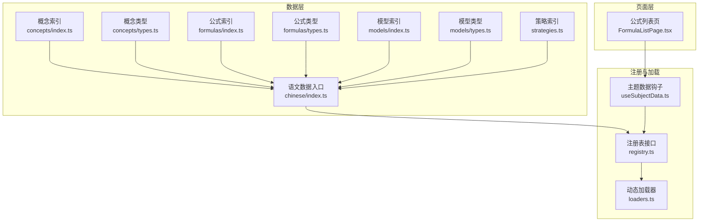
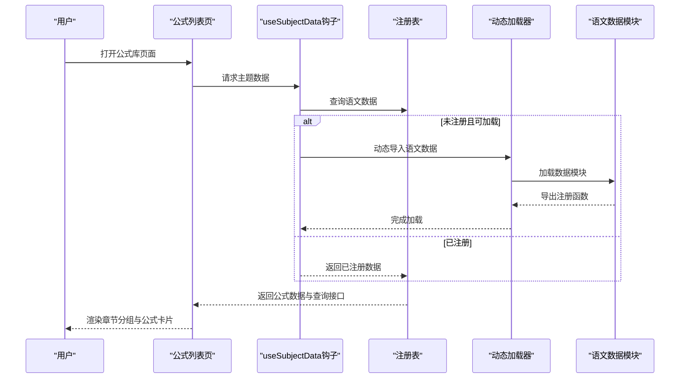
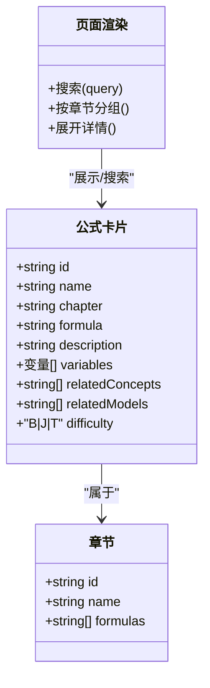
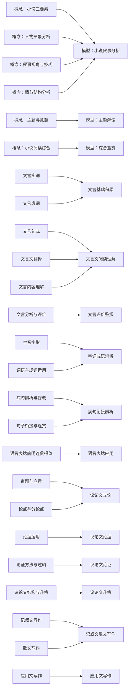
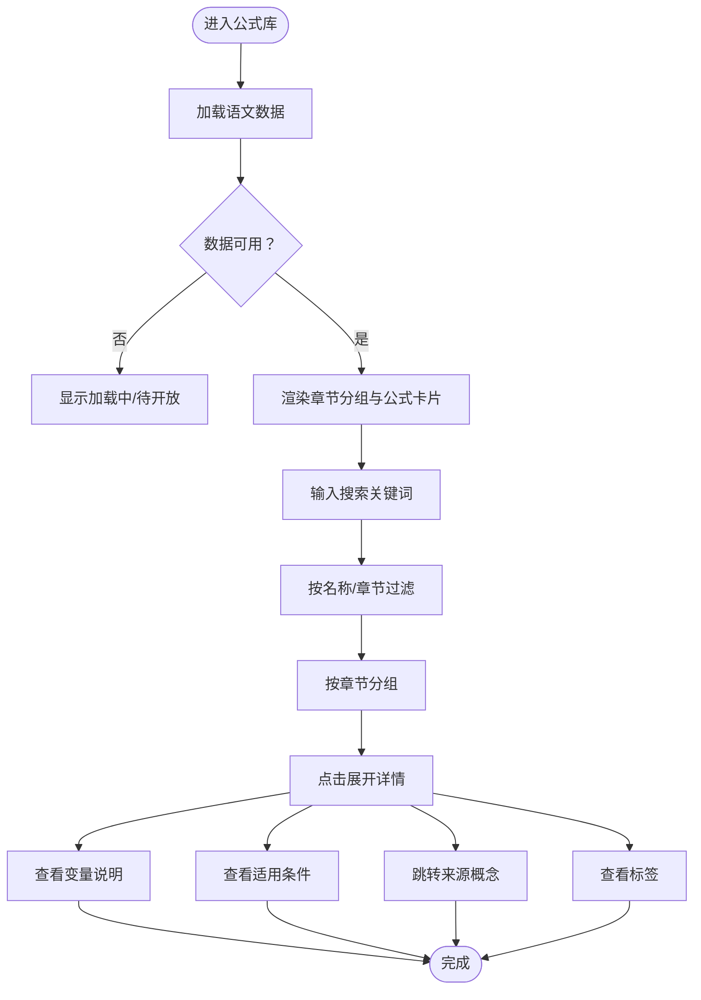
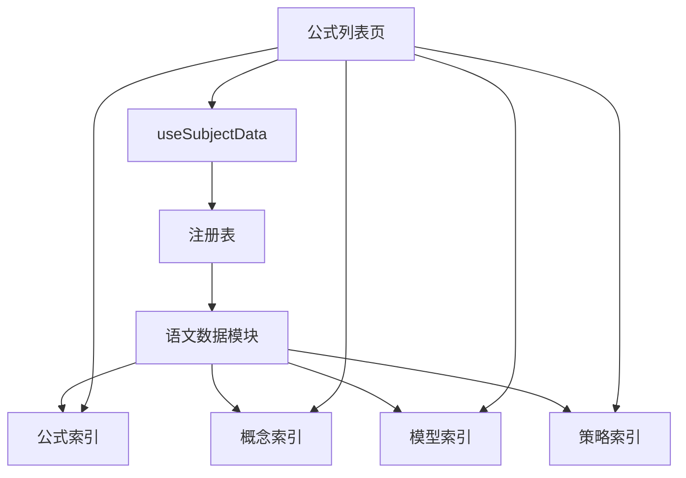

# 语文公式章节

<cite>
**本文引用的文件**
- [src/data/chinese/formulas/index.ts](file://src/data/chinese/formulas/index.ts)
- [src/data/chinese/formulas/types.ts](file://src/data/chinese/formulas/types.ts)
- [src/data/chinese/concepts/index.ts](file://src/data/chinese/concepts/index.ts)
- [src/data/chinese/concepts/Y01Y43.ts](file://src/data/chinese/concepts/Y01Y43.ts)
- [src/data/chinese/models/index.ts](file://src/data/chinese/models/index.ts)
- [src/data/chinese/models/C01C29.ts](file://src/data/chinese/models/C01C29.ts)
- [src/data/chinese/strategies.ts](file://src/data/chinese/strategies.ts)
- [src/data/chinese/index.ts](file://src/data/chinese/index.ts)
- [src/sections/FormulasListPage.tsx](file://src/sections/FormulasListPage.tsx)
- [src/hooks/useSubjectData.ts](file://src/hooks/useSubjectData.ts)
- [src/data/registry.ts](file://src/data/registry.ts)
- [src/data/loaders.ts](file://src/data/loaders.ts)
</cite>

## 目录
1. [引言](#引言)
2. [项目结构](#项目结构)
3. [核心组件](#核心组件)
4. [架构总览](#架构总览)
5. [详细组件分析](#详细组件分析)
6. [依赖分析](#依赖分析)
7. [性能考虑](#性能考虑)
8. [故障排查指南](#故障排查指南)
9. [结论](#结论)
10. [附录](#附录)

## 引言
本章节面向“星耀平台”的语文公式体系，系统化梳理语文公式章节的组织结构与应用价值，覆盖语言文字运用、文言文理解、现代文阅读、写作等核心板块。文档将阐明公式化思维如何帮助学生建立“可迁移”的解题与表达范式，并给出分类体系、层级结构、检索机制与实践示例，助力教师与学习者高效构建语文知识的系统性与科学性。

## 项目结构
语文公式数据与页面由“数据层-注册层-页面层”三层构成：
- 数据层：语文概念、模型、公式、策略等数据定义与聚合
- 注册层：将语文数据注册到全局注册表，暴露统一查询接口
- 页面层：公式库页面按章节分组展示，支持搜索与折叠展开

图示来源
- [src/data/chinese/concepts/index.ts:1-138](file://src/data/chinese/concepts/index.ts#L1-L138)
- [src/data/chinese/formulas/index.ts:1-13](file://src/data/chinese/formulas/index.ts#L1-L13)
- [src/data/chinese/models/index.ts:1-112](file://src/data/chinese/models/index.ts#L1-L112)
- [src/data/chinese/strategies.ts:1-67](file://src/data/chinese/strategies.ts#L1-L67)
- [src/data/chinese/index.ts:1-151](file://src/data/chinese/index.ts#L1-L151)
- [src/data/registry.ts:1-52](file://src/data/registry.ts#L1-L52)
- [src/data/loaders.ts:1-27](file://src/data/loaders.ts#L1-L27)
- [src/hooks/useSubjectData.ts:1-46](file://src/hooks/useSubjectData.ts#L1-L46)
- [src/sections/FormulasListPage.tsx:1-261](file://src/sections/FormulasListPage.tsx#L1-L261)

章节来源
- [src/data/chinese/index.ts:1-151](file://src/data/chinese/index.ts#L1-L151)
- [src/data/registry.ts:1-52](file://src/data/registry.ts#L1-L52)
- [src/data/loaders.ts:1-27](file://src/data/loaders.ts#L1-L27)
- [src/hooks/useSubjectData.ts:1-46](file://src/hooks/useSubjectData.ts#L1-L46)
- [src/sections/FormulasListPage.tsx:1-261](file://src/sections/FormulasListPage.tsx#L1-L261)

## 核心组件
- 公式卡片与章节
  - 公式卡片包含：标识、名称、所属章节、LaTeX 表达式、变量定义、相关概念/模型、难度等级等字段
  - 章节列表用于前端分组展示与筛选
- 概念体系
  - 按“现代文阅读·文学类文本”“现代文阅读·实用类文本”“古代诗文·文言文”“古代诗文·古诗鉴赏”“语言文字运用”“写作”“文学文化常识”等划分
  - 每个概念标注模块（输入理解层/输出表达层等）、前置概念、关联模型与策略
- 模型体系
  - 与概念一一对应，强调“思维范式”与“能力层级”
- 策略体系
  - 以编号命名的“范式”，如“人物形象多维分析法”“文言文翻译法”等，作为可迁移的方法论
- 页面与检索
  - 公式列表页支持按章节过滤与关键词搜索，展开后显示变量说明、适用条件、来源知识节点与标签

章节来源
- [src/data/chinese/formulas/types.ts:1-17](file://src/data/chinese/formulas/types.ts#L1-L17)
- [src/data/chinese/formulas/index.ts:1-13](file://src/data/chinese/formulas/index.ts#L1-L13)
- [src/data/chinese/concepts/index.ts:55-134](file://src/data/chinese/concepts/index.ts#L55-L134)
- [src/data/chinese/concepts/Y01Y43.ts:1-517](file://src/data/chinese/concepts/Y01Y43.ts#L1-L517)
- [src/data/chinese/models/index.ts:43-108](file://src/data/chinese/models/index.ts#L43-L108)
- [src/data/chinese/models/C01C29.ts:1-200](file://src/data/chinese/models/C01C29.ts#L1-L200)
- [src/data/chinese/strategies.ts:1-67](file://src/data/chinese/strategies.ts#L1-L67)
- [src/sections/FormulasListPage.tsx:40-261](file://src/sections/FormulasListPage.tsx#L40-L261)

## 架构总览
语文公式章节遵循“数据-注册-页面”的分层架构，通过注册表统一暴露查询接口，页面通过钩子按需加载主题数据，实现延迟加载与可扩展。

图示来源
- [src/hooks/useSubjectData.ts:1-46](file://src/hooks/useSubjectData.ts#L1-L46)
- [src/data/registry.ts:1-52](file://src/data/registry.ts#L1-L52)
- [src/data/loaders.ts:1-27](file://src/data/loaders.ts#L1-L27)
- [src/data/chinese/index.ts:126-151](file://src/data/chinese/index.ts#L126-L151)
- [src/sections/FormulasListPage.tsx:20-41](file://src/sections/FormulasListPage.tsx#L20-L41)

## 详细组件分析

### 组件A：语文公式数据模型与页面交互
- 数据模型
  - 公式卡片字段：id、name、chapter、formula、description、variables、relatedConcepts、relatedModels、difficulty
  - 章节字段：id、name、formulas（id 列表）
- 页面交互
  - 支持搜索（名称/章节），按章节折叠分组，展开后展示变量、适用条件、来源概念与标签
  - 使用 KaTeX 渲染 LaTeX 表达式，便于直观呈现公式形态

图示来源
- [src/data/chinese/formulas/types.ts:1-17](file://src/data/chinese/formulas/types.ts#L1-L17)
- [src/sections/FormulasListPage.tsx:115-242](file://src/sections/FormulasListPage.tsx#L115-L242)

章节来源
- [src/data/chinese/formulas/types.ts:1-17](file://src/data/chinese/formulas/types.ts#L1-L17)
- [src/sections/FormulasListPage.tsx:40-261](file://src/sections/FormulasListPage.tsx#L40-L261)

### 组件B：语文概念-模型-策略的关联关系
- 概念（ConceptData）
  - 包含模块（输入理解层/输出表达层等）、前置概念、关联模型与策略
- 模型（ModelData）
  - 对应概念，强调“核心思维”与“能力层级”
- 策略（Strategy）
  - 方法论范式，编号管理，便于迁移与复用

图示来源
- [src/data/chinese/concepts/Y01Y43.ts:3-517](file://src/data/chinese/concepts/Y01Y43.ts#L3-L517)
- [src/data/chinese/models/C01C29.ts:3-200](file://src/data/chinese/models/C01C29.ts#L3-L200)
- [src/data/chinese/strategies.ts:9-59](file://src/data/chinese/strategies.ts#L9-L59)

章节来源
- [src/data/chinese/concepts/Y01Y43.ts:1-517](file://src/data/chinese/concepts/Y01Y43.ts#L1-L517)
- [src/data/chinese/models/C01C29.ts:1-200](file://src/data/chinese/models/C01C29.ts#L1-L200)
- [src/data/chinese/strategies.ts:1-67](file://src/data/chinese/strategies.ts#L1-L67)

### 组件C：语文公式检索与分组机制
- 检索
  - 前端搜索：名称/章节模糊匹配
  - 后端聚合：按章节分组，仅展示命中公式
- 分组
  - 章节列表来源于概念与模型的章节划分，确保“概念-模型-公式-策略”的一致映射

图示来源
- [src/sections/FormulasListPage.tsx:20-261](file://src/sections/FormulasListPage.tsx#L20-L261)
- [src/data/chinese/index.ts:51-64](file://src/data/chinese/index.ts#L51-L64)

章节来源
- [src/sections/FormulasListPage.tsx:40-261](file://src/sections/FormulasListPage.tsx#L40-L261)
- [src/data/chinese/index.ts:51-64](file://src/data/chinese/index.ts#L51-L64)

### 组件D：语文公式应用示例（概念化范式）
以下示例基于现有概念-模型-策略体系，体现“公式化思维”的迁移与应用：

- 文言文句式转换公式
  - 适用条件：遇到“判断句/被动句/倒装句/省略句”等典型句式
  - 使用方法：依据“文言实词+虚词+句式”三要素，按“断句→译词→调序→补主谓宾”的步骤执行
  - 注意事项：注意古今词义差异与文化背景还原
  - 关联概念与模型：文言实词、文言虚词、文言句式、文言文阅读理解
  - 关联策略：文言文翻译法、文言内容概括法

- 现代文信息提取公式
  - 适用条件：实用类文本与非连续性文本
  - 使用方法：按“标题→图表→关键句→数据点→结论”的路径提取
  - 注意事项：避免主观臆测，严格区分事实与推断
  - 关联概念与模型：信息筛选与概括、论述类文本分析、非连续文本整合
  - 关联策略：信息角度比较法、图表信息提取法

- 作文结构搭建公式
  - 适用条件：议论文、记叙文、应用文写作
  - 使用方法：议论文采用“正-反-合”三段式；记叙文采用“起承转合”；应用文遵循“格式-称谓-正文-落款-日期”
  - 注意事项：结构服务于内容，避免模板化堆砌
  - 关联概念与模型：审题与立意、议论文立论、议论文论证、记叙文散文写作、应用文写作
  - 关联策略：审题立意多维分析法、分论点结构设计法、应用文格式规范法

章节来源
- [src/data/chinese/concepts/Y01Y43.ts:123-193](file://src/data/chinese/concepts/Y01Y43.ts#L123-L193)
- [src/data/chinese/models/C01C29.ts:47-200](file://src/data/chinese/models/C01C29.ts#L47-L200)
- [src/data/chinese/strategies.ts:9-59](file://src/data/chinese/strategies.ts#L9-L59)

## 依赖分析
- 概念-模型-策略的耦合关系
  - 概念决定模型与策略的边界与难度层级
  - 模型承载“核心思维”，策略提供“可迁移范式”
- 页面-数据的解耦
  - 页面通过注册表统一访问，避免直接依赖具体模块
  - 动态加载确保按需获取，降低首屏负担

图示来源
- [src/sections/FormulasListPage.tsx:1-261](file://src/sections/FormulasListPage.tsx#L1-L261)
- [src/hooks/useSubjectData.ts:1-46](file://src/hooks/useSubjectData.ts#L1-L46)
- [src/data/registry.ts:1-52](file://src/data/registry.ts#L1-L52)
- [src/data/chinese/index.ts:126-151](file://src/data/chinese/index.ts#L126-L151)

章节来源
- [src/data/registry.ts:1-52](file://src/data/registry.ts#L1-L52)
- [src/data/loaders.ts:1-27](file://src/data/loaders.ts#L1-L27)
- [src/data/chinese/index.ts:126-151](file://src/data/chinese/index.ts#L126-L151)

## 性能考虑
- 按需加载
  - 通过动态导入与缓存 Promise，避免重复加载
- 展开渲染
  - 详情面板采用折叠展开，减少一次性渲染压力
- 搜索优化
  - 前端轻量搜索，建议配合服务端分页与索引（当前为内存搜索）

## 故障排查指南
- 页面空白或“待开放”
  - 检查主题是否已注册，确认动态加载器是否存在对应主题
- 搜索无结果
  - 确认搜索关键词是否匹配“名称/章节”，当前不支持变量内容搜索
- 章节筛选无效
  - 确认章节列表是否为空，检查概念与模型的章节划分是否一致

章节来源
- [src/data/loaders.ts:1-27](file://src/data/loaders.ts#L1-L27)
- [src/sections/FormulasListPage.tsx:25-41](file://src/sections/FormulasListPage.tsx#L25-L41)

## 结论
语文公式章节以“概念-模型-策略-公式”的闭环体系为核心，通过页面化的检索与分组展示，帮助学习者建立“可迁移”的方法论与范式。建议在教学实践中：
- 以概念为锚点，串联模型与策略
- 以公式为工具箱，沉淀可复用的解题与表达范式
- 以检索与分组为抓手，提升学习效率与系统性

## 附录
- 公式字段说明
  - id：唯一标识
  - name：公式名称
  - chapter：所属章节
  - formula：LaTeX 表达式
  - description：简要说明
  - variables：变量定义（名称、符号、单位）
  - relatedConcepts/relatedModels：关联知识点与模型
  - difficulty：难度等级（B/J/T）
- 章节划分参考
  - 现代文阅读·文学类文本、现代文阅读·实用类文本、古代诗文·文言文、古代诗文·古诗鉴赏、语言文字运用、写作、文学文化常识