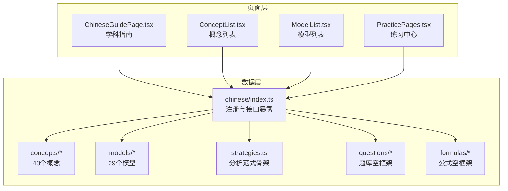
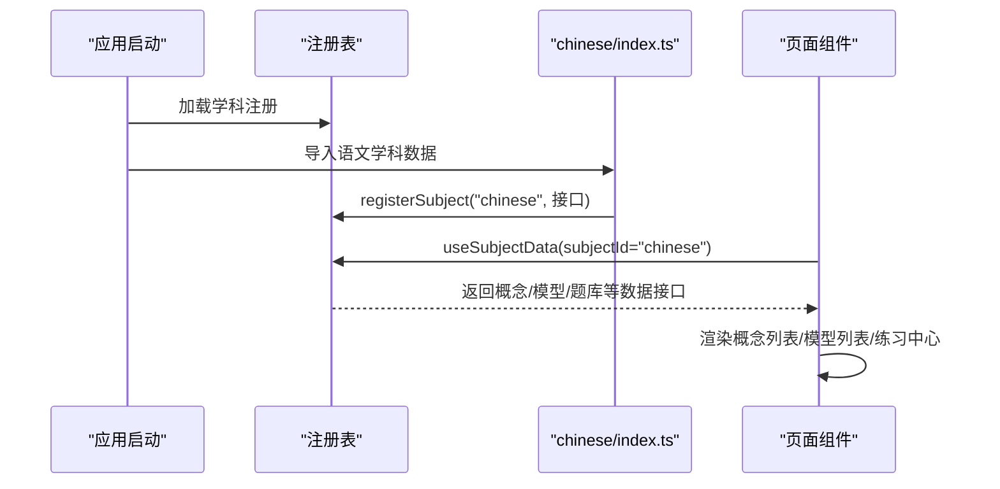
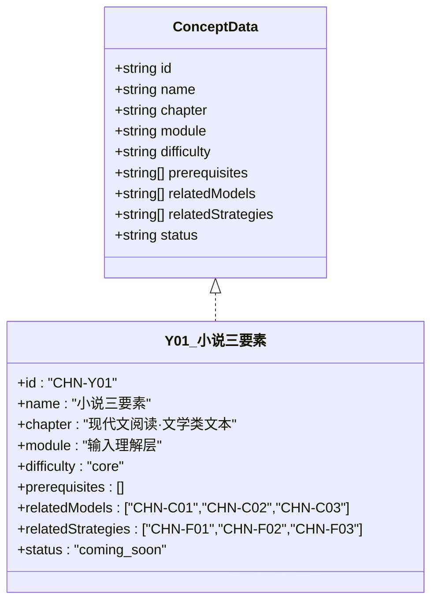
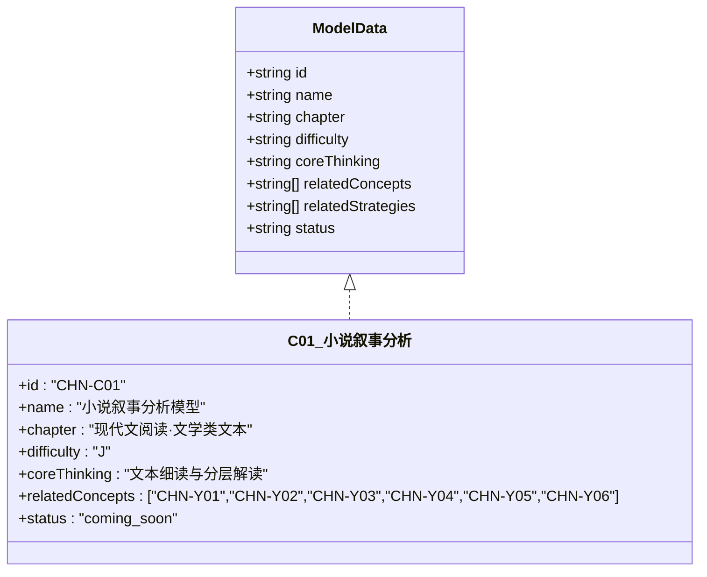
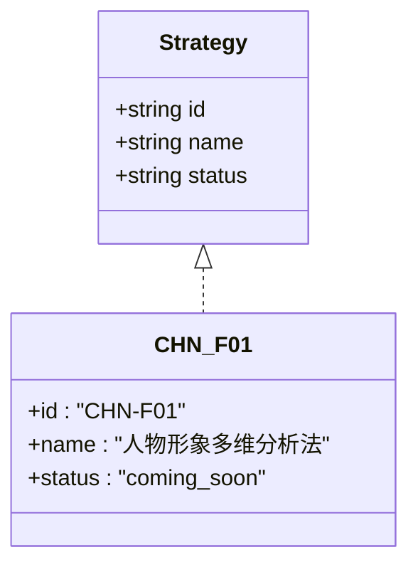
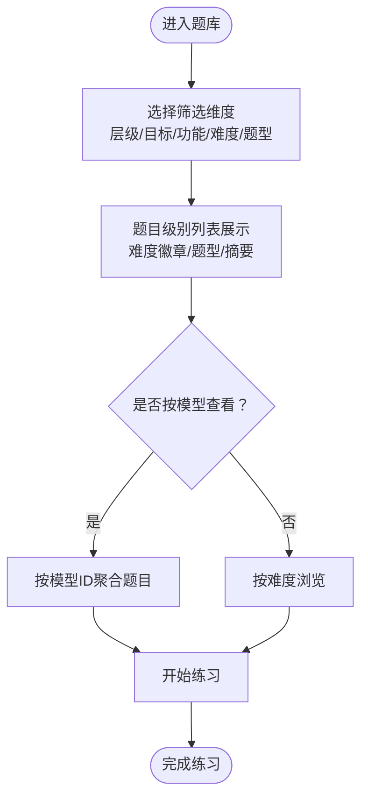
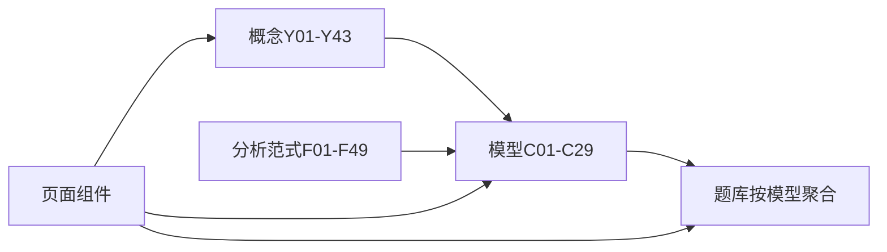

# 语文学科

<cite>
**本文引用的文件**
- [src/data/chinese/index.ts](file://src/data/chinese/index.ts)
- [src/data/chinese/concepts/Y01Y43.ts](file://src/data/chinese/concepts/Y01Y43.ts)
- [src/data/chinese/models/C01C29.ts](file://src/data/chinese/models/C01C29.ts)
- [src/data/chinese/strategies.ts](file://src/data/chinese/strategies.ts)
- [src/data/chinese/concepts/types.ts](file://src/data/chinese/concepts/types.ts)
- [src/data/chinese/models/types.ts](file://src/data/chinese/models/types.ts)
- [src/data/chinese/questions/types.ts](file://src/data/chinese/questions/types.ts)
- [src/data/chinese/questions/filters.ts](file://src/data/chinese/questions/filters.ts)
- [src/sections/ChineseGuidePage.tsx](file://src/sections/ChineseGuidePage.tsx)
- [src/sections/ConceptList.tsx](file://src/sections/ConceptList.tsx)
- [src/sections/ModelList.tsx](file://src/sections/ModelList.tsx)
- [src/sections/PracticePages.tsx](file://src/sections/PracticePages.tsx)
- [docs/FEATURE-语文学科数据骨架完成记录.md](file://docs/FEATURE-语文学科数据骨架完成记录.md)
- [docs/FEATURE-题库五维筛选完成记录.md](file://docs/FEATURE-题库五维筛选完成记录.md)
</cite>

## 目录
1. [引言](#引言)
2. [项目结构](#项目结构)
3. [核心组件](#核心组件)
4. [架构总览](#架构总览)
5. [详细组件分析](#详细组件分析)
6. [依赖分析](#依赖分析)
7. [性能考虑](#性能考虑)
8. [故障排查指南](#故障排查指南)
9. [结论](#结论)
10. [附录](#附录)

## 引言
本文件面向“星耀平台”的语文学科，系统化阐述其知识组织结构与模块化设计思路。依据项目现状，语文数据骨架已完成：包含43个K层知识节点、29个M层核心模型、49条分析范式骨架、公式/题库空框架，并在前端完成注册与路由配置。本文将围绕以下目标展开：
- 解释K层（43个）、M层（29个）、R层（分析范式）与P层（题库）的设计理念与组织方式
- 说明模块划分与章节组织：语言文字应用、古诗文鉴赏、现代文阅读、写作表达、文学常识等
- 文档化语文概念的完整结构（情境、困惑、实验、概念、推导、应用），方法论与生活应用
- 展示语文模型分类体系、公式章节组织与题库筛选机制
- 提供语文学科特有的思维方法与解题策略，包括文言文翻译、现代文阅读、作文写作等
- 说明如何通过模块化设计实现系统化呈现与学习路径优化

## 项目结构
语文数据与前端页面采用“学科数据层 + 通用UI组件 + 页面路由”的分层组织：
- 数据层：src/data/chinese 下按“概念/模型/公式/题库/分析范式”分目录，统一通过 index.ts 暴露接口并注册到学科注册表
- 页面层：src/sections 下提供学科指南、概念列表、模型列表、练习中心等页面组件
- 路由层：App.tsx 中挂载 /chinese 子路由，配合 subjects.ts 注册语文学科

图示来源
- [src/data/chinese/index.ts:126-151](file://src/data/chinese/index.ts#L126-L151)
- [src/sections/ChineseGuidePage.tsx:1-139](file://src/sections/ChineseGuidePage.tsx#L1-L139)
- [src/sections/ConceptList.tsx:1-139](file://src/sections/ConceptList.tsx#L1-L139)
- [src/sections/ModelList.tsx:1-150](file://src/sections/ModelList.tsx#L1-L150)
- [src/sections/PracticePages.tsx:1-375](file://src/sections/PracticePages.tsx#L1-L375)

章节来源
- [src/data/chinese/index.ts:126-151](file://src/data/chinese/index.ts#L126-L151)
- [docs/FEATURE-语文学科数据骨架完成记录.md:66-78](file://docs/FEATURE-语文学科数据骨架完成记录.md#L66-L78)

## 核心组件
- 概念层（K层）：43个概念，按7大板块组织，覆盖现代文阅读、古代诗文、语言文字运用、写作、文学文化常识等
- 模型层（M层）：29个模型，每个模型定义核心思维、难度与关联概念/范式
- 分析范式（R层）：49条范式骨架，覆盖阅读、翻译、写作、文化常识等关键能力
- 题库（P层）：五维筛选体系（能力层级、学习目标、题目功能、难度等级、题型），支持按模型聚合与难度浏览

章节来源
- [src/data/chinese/concepts/Y01Y43.ts:1-517](file://src/data/chinese/concepts/Y01Y43.ts#L1-L517)
- [src/data/chinese/models/C01C29.ts:1-320](file://src/data/chinese/models/C01C29.ts#L1-L320)
- [src/data/chinese/strategies.ts:1-67](file://src/data/chinese/strategies.ts#L1-L67)
- [src/data/chinese/questions/filters.ts:1-38](file://src/data/chinese/questions/filters.ts#L1-L38)
- [docs/FEATURE-语文学科数据骨架完成记录.md:83-95](file://docs/FEATURE-语文学科数据骨架完成记录.md#L83-L95)

## 架构总览
语文数据通过 registerSubject 注册到全局学科系统，前端页面通过 useSubjectData 钩子获取数据并渲染。

图示来源
- [src/data/chinese/index.ts:126-151](file://src/data/chinese/index.ts#L126-L151)
- [src/sections/ConceptList.tsx:23-34](file://src/sections/ConceptList.tsx#L23-L34)
- [src/sections/ModelList.tsx:17-28](file://src/sections/ModelList.tsx#L17-L28)

## 详细组件分析

### 概念层（K层：43个）
- 结构：每个概念包含ID、名称、所属章节、模块、难度、前置概念、关联模型与范式、状态
- 组织：按7大板块分组，体现“输入理解层/输出表达层/文化积淀层”等层级
- 关联：概念与模型、范式双向关联，支撑“概念→模型→范式→题库”的学习闭环

图示来源
- [src/data/chinese/concepts/types.ts:1-13](file://src/data/chinese/concepts/types.ts#L1-L13)
- [src/data/chinese/concepts/Y01Y43.ts:3-13](file://src/data/chinese/concepts/Y01Y43.ts#L3-L13)

章节来源
- [src/data/chinese/concepts/Y01Y43.ts:1-517](file://src/data/chinese/concepts/Y01Y43.ts#L1-L517)
- [src/data/chinese/concepts/types.ts:1-13](file://src/data/chinese/concepts/types.ts#L1-L13)

### 模型层（M层：29个）
- 结构：每个模型包含ID、名称、章节、难度、核心思维、关联概念/范式、状态
- 分类：按板块组织，覆盖现代文阅读、古代诗文、语言文字运用、写作、文学文化常识
- 难度：使用 B/J/T 三级，与题库难度一致，便于学练结合

图示来源
- [src/data/chinese/models/types.ts:1-10](file://src/data/chinese/models/types.ts#L1-L10)
- [src/data/chinese/models/C01C29.ts:3-12](file://src/data/chinese/models/C01C29.ts#L3-L12)

章节来源
- [src/data/chinese/models/C01C29.ts:1-320](file://src/data/chinese/models/C01C29.ts#L1-L320)
- [src/data/chinese/models/types.ts:1-10](file://src/data/chinese/models/types.ts#L1-L10)

### 分析范式（R层：49条）
- 结构：每条范式包含ID、名称、状态
- 范畴：覆盖阅读、翻译、写作、文化常识等关键能力，如“人物形象多维分析法”“文言文翻译法”“议论文论证逻辑链条构建法”等
- 作用：作为“解题套路”，与模型/概念形成“范式→模型→概念”的能力支撑链

图示来源
- [src/data/chinese/strategies.ts:1-67](file://src/data/chinese/strategies.ts#L1-L67)

章节来源
- [src/data/chinese/strategies.ts:1-67](file://src/data/chinese/strategies.ts#L1-L67)

### 题库（P层：五维筛选）
- 结构：题目类型扩展为包含 level/target/function/difficultyD/type 等字段
- 筛选：能力层级（L1/L2/L3）、学习目标（同步/期中期末/高考/竞赛）、题目功能（巩固/复习/诊断/真题）、难度等级（B/J/T）、题型（选择/填空/判断/解答）
- 聚合：按模型ID聚合题目，支持统计与导航

图示来源
- [src/data/chinese/questions/types.ts:1-16](file://src/data/chinese/questions/types.ts#L1-L16)
- [src/data/chinese/questions/filters.ts:1-38](file://src/data/chinese/questions/filters.ts#L1-L38)
- [src/sections/PracticePages.tsx:309-375](file://src/sections/PracticePages.tsx#L309-L375)

章节来源
- [src/data/chinese/questions/types.ts:1-16](file://src/data/chinese/questions/types.ts#L1-L16)
- [src/data/chinese/questions/filters.ts:1-38](file://src/data/chinese/questions/filters.ts#L1-L38)
- [docs/FEATURE-题库五维筛选完成记录.md:63-73](file://docs/FEATURE-题库五维筛选完成记录.md#L63-L73)

### 模块划分与章节组织
- 现代文阅读
  - 文学类文本：小说三要素、人物形象、叙事视角、情节结构、主题意蕴、综合阅读
  - 实用类文本：信息筛选、论述类文本、实用类文本、非连续性文本、图文转换
- 古代诗文
  - 文言文：实词/虚词/句式/翻译/内容理解/分析评价
  - 古诗鉴赏：意象意境、语言炼字、表现手法、情感主旨、比较鉴赏、现代诗歌
- 语言文字运用：字音字形、词语成语、病句修改、句式衔接、修辞辨析、语言表达、仿写扩展压缩
- 写作：审题立意、议论文论点/论据/论证/结构、记叙文/散文/应用文写作、材料分析与思辨写作
- 文学文化常识：先秦至现当代文学、文化典故、传统思想、名篇名句

章节来源
- [docs/FEATURE-语文学科数据骨架完成记录.md:83-95](file://docs/FEATURE-语文学科数据骨架完成记录.md#L83-L95)
- [src/data/chinese/concepts/Y01Y43.ts:1-517](file://src/data/chinese/concepts/Y01Y43.ts#L1-L517)

### 方法论与思维方法
- 四种对话场域
  - 准确传达：语言文字运用（精确表达）
  - 深度对话：现代文阅读（分层解读、文体意识）
  - 理性交锋：写作（议论文结构与逻辑）
  - 跨时空对话：古诗文阅读（文化语境还原）
- 四个习惯
  - 分层解读、文体意识、修辞思维、思辨读写
- 四次升级
  - 从“读懂字面”到“分层解读”
  - 从“背答题模板”到“文体意识自动化”
  - 从“好词好句”到“语言逻辑与修辞思维”
  - 从“想到什么写什么”到“思辨读写与观点建构”

章节来源
- [src/sections/ChineseGuidePage.tsx:15-134](file://src/sections/ChineseGuidePage.tsx#L15-L134)

### 生活应用与学习路径
- 生活应用：批判性阅读、信息甄别、表达与沟通、文化理解与传承
- 学习路径：以概念为起点，经由模型建立方法论，借助范式形成套路，通过题库巩固提升，最终实现“理解—应用—迁移”的闭环

章节来源
- [src/sections/ChineseGuidePage.tsx:115-134](file://src/sections/ChineseGuidePage.tsx#L115-L134)

## 依赖分析
- 数据层依赖
  - concepts 与 models 通过 relatedConcepts/relatedModels 形成双向关联
  - strategies 与 models 通过 relatedStrategies 形成范式支撑
  - questions 通过 modelId 与 models 关联
- 前端依赖
  - 页面组件通过 useSubjectData 获取数据
  - 路由挂载于 /chinese，页面按模块组织

图示来源
- [src/data/chinese/concepts/Y01Y43.ts:1-517](file://src/data/chinese/concepts/Y01Y43.ts#L1-L517)
- [src/data/chinese/models/C01C29.ts:1-320](file://src/data/chinese/models/C01C29.ts#L1-L320)
- [src/data/chinese/strategies.ts:1-67](file://src/data/chinese/strategies.ts#L1-L67)
- [src/sections/ConceptList.tsx:23-34](file://src/sections/ConceptList.tsx#L23-L34)
- [src/sections/ModelList.tsx:17-28](file://src/sections/ModelList.tsx#L17-L28)

章节来源
- [src/data/chinese/index.ts:126-151](file://src/data/chinese/index.ts#L126-L151)

## 性能考虑
- 数据加载：通过 registerSubject 统一注册，前端按需加载，避免重复导入
- 列表渲染：概念/模型/题库均采用分组与筛选，减少一次性渲染压力
- 题库浏览：按难度/题型分页展示，支持快速筛选与标签化管理

## 故障排查指南
- 页面空白或未显示数据
  - 检查 subjects.ts 中 chinese 是否启用且 modelPrefix 正确
  - 确认 main.tsx 已导入语文学科数据
- 路由无法访问
  - 检查 App.tsx 中 /chinese 子路由是否正确挂载
- 题库筛选无效
  - 检查 questions/types.ts 与 filters.ts 字段是否一致
  - 确认页面筛选逻辑与常量定义匹配

章节来源
- [docs/FEATURE-语文学科数据骨架完成记录.md:56-63](file://docs/FEATURE-语文学科数据骨架完成记录.md#L56-L63)
- [src/data/chinese/questions/types.ts:1-16](file://src/data/chinese/questions/types.ts#L1-L16)
- [src/data/chinese/questions/filters.ts:1-38](file://src/data/chinese/questions/filters.ts#L1-L38)

## 结论
语文学科数据骨架已完成K/M/R/P四层结构搭建，模块化设计与五维题库筛选为后续内容填充与学习路径优化奠定了坚实基础。建议下一步优先完善概念与模型内容，逐步展开分析范式与题库数据，持续迭代以实现“知识—方法—应用”的一体化教学体验。

## 附录
- 术语说明
  - K层：知识节点（43个）
  - M层：核心模型（29个）
  - R层：分析范式（49条）
  - P层：练习题库（五维筛选）
- 访问路径
  - 语文学科首页：/chinese/
  - 概念列表：/chinese/concepts
  - 模型列表：/chinese/models
  - 题库浏览：/chinese/exercises

章节来源
- [docs/FEATURE-语文学科数据骨架完成记录.md:66-78](file://docs/FEATURE-语文学科数据骨架完成记录.md#L66-L78)