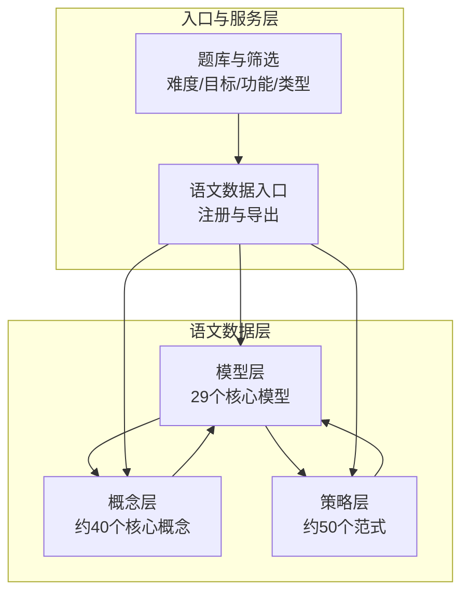
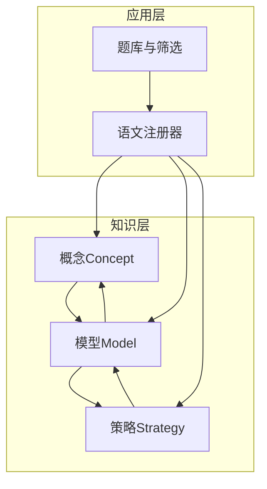
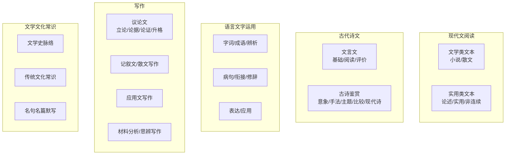
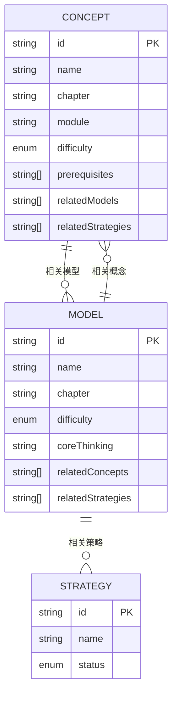
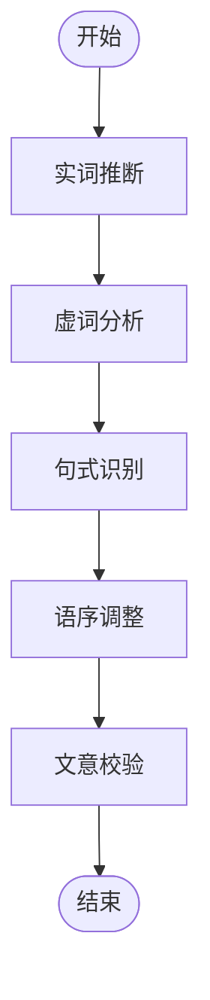
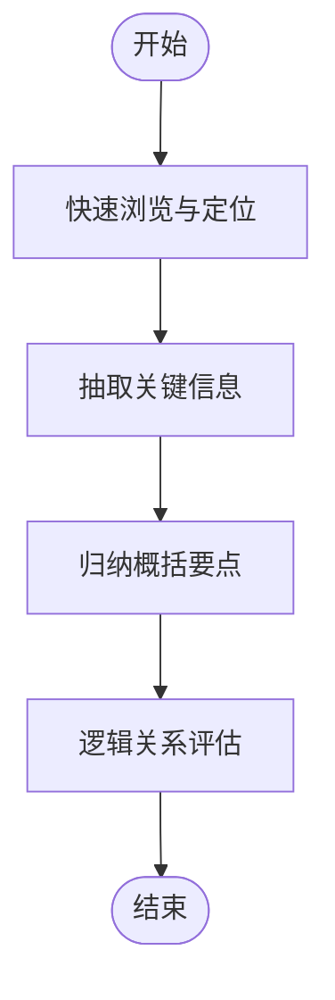
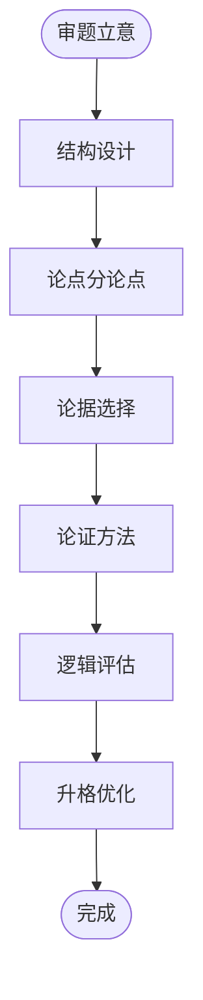

# 语文核心模型

<cite>
**本文引用的文件**
- [C01C29.ts](file://src/data/chinese/models/C01C29.ts)
- [index.ts（模型索引）](file://src/data/chinese/models/index.ts)
- [types.ts（模型类型）](file://src/data/chinese/models/types.ts)
- [Y01Y43.ts（概念清单）](file://src/data/chinese/concepts/Y01Y43.ts)
- [types.ts（概念类型）](file://src/data/chinese/concepts/types.ts)
- [strategies.ts（策略清单）](file://src/data/chinese/strategies.ts)
- [index.ts（语文数据入口）](file://src/data/chinese/index.ts)
- [filters.ts（题库筛选选项）](file://src/data/chinese/questions/filters.ts)
- [types.ts（题型类型）](file://src/data/chinese/questions/types.ts)
</cite>

## 目录
1. [简介](#简介)
2. [项目结构](#项目结构)
3. [核心组件](#核心组件)
4. [架构总览](#架构总览)
5. [详细组件分析](#详细组件分析)
6. [依赖分析](#依赖分析)
7. [性能考虑](#性能考虑)
8. [故障排查指南](#故障排查指南)
9. [结论](#结论)
10. [附录](#附录)

## 简介
本文件系统化梳理星耀平台“语文”学科的29个核心模型，覆盖现代文阅读（文学类与实用类）、文言文、古诗鉴赏、语言文字运用、写作与文学文化常识等板块。文档基于仓库现有数据结构与类型定义，阐述模型的分类体系、理论基础、适用范围、解题步骤、数据结构、难度标识与关联关系，并给出可落地的应用示例与实践建议，帮助教师与学生以“模型化思维”提升语文学习效率与解题能力。

## 项目结构
语文数据采用“学科-层级-模型/概念/策略”的分层组织方式：
- 模型层：定义29个核心模型，包含模型ID、名称、所属章节、难度、核心思维、关联概念与策略等元数据。
- 概念层：定义支撑模型的知识概念，标注模块、难度、前置要求、关联模型与策略。
- 策略层：定义可复用的解题范式或方法名称，作为模型的“方法论”支撑。
- 入口层：统一注册与导出语文数据，提供查询、统计与可视化所需的基础接口。

图示来源
- [index.ts（模型索引）:37-41](file://src/data/chinese/models/index.ts#L37-L41)
- [Y01Y43.ts（概念清单）:1-13](file://src/data/chinese/concepts/Y01Y43.ts#L1-L13)
- [strategies.ts（策略清单）:9-59](file://src/data/chinese/strategies.ts#L9-L59)
- [index.ts（语文数据入口）:126-151](file://src/data/chinese/index.ts#L126-L151)

章节来源
- [index.ts（模型索引）:1-112](file://src/data/chinese/models/index.ts#L1-L112)
- [Y01Y43.ts（概念清单）:1-517](file://src/data/chinese/concepts/Y01Y43.ts#L1-L517)
- [strategies.ts（策略清单）:1-67](file://src/data/chinese/strategies.ts#L1-L67)
- [index.ts（语文数据入口）:1-151](file://src/data/chinese/index.ts#L1-L151)

## 核心组件
- 模型数据结构（ModelData）
  - 字段：id、name、chapter、difficulty、coreThinking、relatedConcepts、relatedStrategies、status
  - 难度标识：B（基础）、J（进阶）、T（挑战）
  - 关联：与概念、策略双向关联，形成“知识—模型—方法”的闭环
- 概念数据结构（ConceptData）
  - 字段：id、name、chapter、module、difficulty、prerequisites、relatedModels、relatedStrategies、status
  - 模块：输入理解层、输出表达层、语言基础层、文化积淀层
  - 难度：core（核心）、extended（拓展）、basic（基础）
- 策略数据结构（Strategy）
  - 字段：id、name、status
  - 用途：为模型提供可迁移的解题范式
- 语文数据入口（Chinese Registry）
  - 提供概念/模型/公式/策略/题库的查询、统计与导出接口

章节来源
- [types.ts（模型类型）:1-10](file://src/data/chinese/models/types.ts#L1-L10)
- [types.ts（概念类型）:1-13](file://src/data/chinese/concepts/types.ts#L1-L13)
- [strategies.ts（策略清单）:1-67](file://src/data/chinese/strategies.ts#L1-L67)
- [index.ts（语文数据入口）:126-151](file://src/data/chinese/index.ts#L126-L151)

## 架构总览
语文核心模型的“知识—模型—策略—题库”一体化架构如下：

图示来源
- [Y01Y43.ts（概念清单）:1-13](file://src/data/chinese/concepts/Y01Y43.ts#L1-L13)
- [C01C29.ts（模型清单）:1-12](file://src/data/chinese/models/C01C29.ts#L1-L12)
- [strategies.ts（策略清单）:9-59](file://src/data/chinese/strategies.ts#L9-L59)
- [index.ts（语文数据入口）:126-151](file://src/data/chinese/index.ts#L126-L151)

## 详细组件分析

### 分类体系与章节划分
语文核心模型按“现代文阅读”“古代诗文”“语言文字运用”“写作”“文学文化常识”五大板块组织，每个板块下再细分若干子章节，便于教学与训练的模块化推进。

图示来源
- [index.ts（模型索引）:43-108](file://src/data/chinese/models/index.ts#L43-L108)

章节来源
- [index.ts（模型索引）:43-108](file://src/data/chinese/models/index.ts#L43-L108)

### 模型数据结构与难度标识
- 数据结构字段
  - id：模型唯一标识
  - name：模型名称
  - chapter：所属章节
  - difficulty：B/J/T
  - coreThinking：核心思维
  - relatedConcepts：关联概念ID列表
  - relatedStrategies：关联策略ID列表
  - status：发布状态
- 难度映射
  - B：基础（对应题库难度标签“基础”）
  - J：进阶（对应题库难度标签“进阶”）
  - T：挑战（对应题库难度标签“挑战”）

章节来源
- [types.ts（模型类型）:1-10](file://src/data/chinese/models/types.ts#L1-L10)
- [filters.ts（题库筛选选项）:21-25](file://src/data/chinese/questions/filters.ts#L21-L25)

### 关联关系与构建逻辑
- 概念到模型：概念作为“输入理解层/语言基础层/文化积淀层”的知识基础，驱动模型的建立与应用
- 模型到策略：模型内置“核心思维”，并通过策略清单提供可迁移的方法范式
- 双向关联：模型与概念之间存在“相关模型/相关概念”的互指，便于知识网络化组织

图示来源
- [types.ts（模型类型）:1-10](file://src/data/chinese/models/types.ts#L1-L10)
- [types.ts（概念类型）:1-13](file://src/data/chinese/concepts/types.ts#L1-L13)
- [strategies.ts（策略清单）:1-67](file://src/data/chinese/strategies.ts#L1-L67)

章节来源
- [Y01Y43.ts（概念清单）:1-13](file://src/data/chinese/concepts/Y01Y43.ts#L1-L13)
- [C01C29.ts（模型清单）:1-12](file://src/data/chinese/models/C01C29.ts#L1-L12)
- [strategies.ts（策略清单）:9-59](file://src/data/chinese/strategies.ts#L9-L59)

### 典型模型与应用示例

#### 文言文断句与翻译模型（示例：文言文翻译）
- 理论基础：以“文言实词—虚词—句式—翻译”为主线，强调语境还原与文化理解
- 适用范围：文言文阅读理解、文言文内容理解、文言文分析与评价
- 解题步骤（示例流程）
  1) 实词推断：结合上下文与通假、活用、一词多义
  2) 虚词分析：判断词性与语法功能（主谓宾、补语、连词等）
  3) 句式识别：判断判断句、被动句、倒装句、省略句等
  4) 语序调整：依据现代汉语规范调整语序与表达
  5) 文意校验：对照全文主旨与人物事件，确保通顺与准确
- 关键要素：实词词义推断法、虚词用法分析法、文言文翻译法
- 应用技巧：先易后难、逐句落实、整体把握

图示来源
- [Y01Y43.ts（概念清单）:123-169](file://src/data/chinese/concepts/Y01Y43.ts#L123-L169)
- [strategies.ts（策略清单）:20-24](file://src/data/chinese/strategies.ts#L20-L24)

章节来源
- [Y01Y43.ts（概念清单）:123-169](file://src/data/chinese/concepts/Y01Y43.ts#L123-L169)
- [strategies.ts（策略清单）:20-24](file://src/data/chinese/strategies.ts#L20-L24)

#### 现代文信息筛选模型（示例：论述类文本阅读）
- 理论基础：以“信息筛选—概括—逻辑链条追踪”为核心
- 适用范围：论述类文本、实用类文本、非连续性文本
- 解题步骤（示例流程）
  1) 快速浏览：确定文本类型与中心论点
  2) 定位关键：识别每段首句、关键词、过渡句
  3) 抽取信息：提取支撑论点的事实、数据、引用
  4) 归纳概括：将零散信息整合为要点
  5) 逻辑评估：识别论证方法与逻辑关系
- 关键要素：信息筛选与概括法、论证链条追踪法、论证方法辨识法
- 应用技巧：带着问题读，边读边标记；关注转折、因果、递进等逻辑词

图示来源
- [Y01Y43.ts（概念清单）:75-121](file://src/data/chinese/concepts/Y01Y43.ts#L75-L121)
- [strategies.ts（策略清单）:16-18](file://src/data/chinese/strategies.ts#L16-L18)

章节来源
- [Y01Y43.ts（概念清单）:75-121](file://src/data/chinese/concepts/Y01Y43.ts#L75-L121)
- [strategies.ts（策略清单）:16-18](file://src/data/chinese/strategies.ts#L16-L18)

#### 作文结构模型（示例：议论文论证）
- 理论基础：以“论点—分论点—论据—论证方法—结构升格”为主线
- 适用范围：议论文写作、材料分析与思辨写作
- 解题步骤（示例流程）
  1) 审题立意：明确题目要求与价值取向
  2) 结构设计：确定总分总或并列式等结构
  3) 论点分论点：提炼中心论点与分论点
  4) 论据选择：围绕分论点选取典型事实/理论/数据
  5) 论证方法：恰当使用举例、对比、因果、引用等
  6) 逻辑评估：检查前后一致、环环相扣
  7) 升格优化：丰富语言表达与思想深度
- 关键要素：分论点结构设计法、论据选取加工法、论证方法选择法、辩证论证法、论证逻辑链条构建法
- 应用技巧：先骨架后血肉，再回看逻辑与语言

图示来源
- [Y01Y43.ts（概念清单）:339-397](file://src/data/chinese/concepts/Y01Y43.ts#L339-L397)
- [strategies.ts（策略清单）:36-42](file://src/data/chinese/strategies.ts#L36-L42)

章节来源
- [Y01Y43.ts（概念清单）:339-397](file://src/data/chinese/concepts/Y01Y43.ts#L339-L397)
- [strategies.ts（策略清单）:36-42](file://src/data/chinese/strategies.ts#L36-L42)

### 模型化思维与学习路径
- 以“模型”为单位组织知识点与方法论，形成“知识—模型—策略—题库”的闭环
- 通过难度标识（B/J/T）与题库目标（同步/期中期末/高考/竞赛）匹配训练强度
- 利用前置要求与关联关系，构建“输入理解层—语言基础层—输出表达层—文化积淀层”的进阶路径

章节来源
- [filters.ts（题库筛选选项）:1-38](file://src/data/chinese/questions/filters.ts#L1-L38)
- [Y01Y43.ts（概念清单）:1-13](file://src/data/chinese/concepts/Y01Y43.ts#L1-L13)

## 依赖分析
语文核心模型的依赖关系体现为“概念—模型—策略”的相互支撑与反馈：

```mermaid
graph LR
Y01["小说三要素"] --> C01["小说叙事分析"]
Y02["人物形象分析"] --> C01
Y03["叙事视角与技巧"] --> C01
Y04["情节结构分析"] --> C01
Y05["小说主题与意蕴"] --> C02["小说主题解读"]
Y06["小说阅读综合"] --> C03["小说综合鉴赏"]
Y11["文言实词"] --> C08["文言基础积累"]
Y12["文言虚词"] --> C08
Y13["文言句式"] --> C08
Y14["文言文翻译"] --> C09["文言文阅读理解"]
Y15["文言文内容理解"] --> C09
Y16["文言文分析与评价"] --> C10["文言文评价鉴赏"]
Y17["诗歌意象与意境"] --> C11["诗歌意象语言"]
Y18["诗歌语言鉴赏"] --> C11
Y19["诗歌表现手法"] --> C12["诗歌手法分析"]
Y20["诗歌情感与主旨"] --> C13["诗歌主题情感"]
Y16 --> C25["诗文比较鉴赏"]
Y20 --> C25
Y21["字音字形"] --> C14["字词成语辨析"]
Y22["词语与成语运用"] --> C14
Y23["病句辨析与修改"] --> C15["病句衔接辨析"]
Y24["句子衔接与连贯"] --> C15
Y25["修辞手法辨析"] --> C14
Y26["语言表达简明连贯得体"] --> C16["语言表达应用"]
Y29["审题与立意"] --> C17["议论文立论"]
Y30["议论文论点与分论点"] --> C17
Y31["议论文论据运用"] --> C18["议论文论据"]
Y32["议论文论证方法与逻辑"] --> C19["议论文论证"]
Y33["议论文结构与升格"] --> C20["议论文升格"]
Y29 --> C28["作文材料分析"]
Y30 --> C28
Y31 --> C28
Y32 --> C28
Y33 --> C28
Y29 --> C29["作文思辨写作"]
Y30 --> C29
Y31 --> C29
Y32 --> C29
Y33 --> C29
Y34["记叙文写作"] --> C21["记叙文散文写作"]
Y35["散文写作"] --> C21
Y36["应用文写作"] --> C22
Y37["先秦文学与文化"] --> C23["文学史脉络"]
Y38["秦汉魏晋文学"] --> C23
Y39["唐宋文学"] --> C23
Y40["元明清文学"] --> C23
Y41["现当代文学"] --> C23
Y37 --> C27["名句名篇默写"]
Y38 --> C27
Y39 --> C27
Y40 --> C27
Y41 --> C27
Y42["古代文化常识"] --> C24["传统文化常识"]
Y43["传统文化思想"] --> C24
```

图示来源
- [Y01Y43.ts（概念清单）:1-517](file://src/data/chinese/concepts/Y01Y43.ts#L1-L517)
- [C01C29.ts（模型清单）:1-320](file://src/data/chinese/models/C01C29.ts#L1-L320)

章节来源
- [Y01Y43.ts（概念清单）:1-517](file://src/data/chinese/concepts/Y01Y43.ts#L1-L517)
- [C01C29.ts（模型清单）:1-320](file://src/data/chinese/models/C01C29.ts#L1-L320)

## 性能考虑
- 数据访问：通过Map索引（模型Map、概念Map、策略Map）实现O(1)查询，适合高频检索场景
- 统计聚合：题库按模型分组统计时，遍历一次即可完成，时间复杂度O(n)
- 可扩展性：新增模型/概念/策略只需遵循现有类型定义，保持接口稳定

章节来源
- [index.ts（模型索引）:37-41](file://src/data/chinese/models/index.ts#L37-L41)
- [index.ts（语文数据入口）:106-124](file://src/data/chinese/index.ts#L106-L124)

## 故障排查指南
- 模型/概念/策略缺失
  - 症状：根据ID无法查到对象
  - 排查：确认ID拼写、是否已发布（status），检查Map初始化是否包含该ID
- 关联不一致
  - 症状：模型关联的概念或策略不存在
  - 排查：核对relatedConcepts/relatedStrategies中的ID是否存在于对应Map
- 题库筛选异常
  - 症状：难度标签显示或筛选结果不符合预期
  - 排查：确认题库难度与模型难度映射一致，检查DIFFICULTY_OPTIONS与DIFF_COLOR配置

章节来源
- [index.ts（语文数据入口）:106-124](file://src/data/chinese/index.ts#L106-L124)
- [filters.ts（题库筛选选项）:21-38](file://src/data/chinese/questions/filters.ts#L21-L38)

## 结论
语文核心模型以“知识—模型—策略—题库”一体化架构为基础，通过清晰的分类体系、严谨的数据结构与难度标识、以及双向关联关系，为语文教学与学习提供了可迁移、可评估、可进阶的模型化路径。建议在实际应用中：
- 以模型为单位组织教学与训练，配套策略范式强化迁移能力
- 依据难度标识与题库目标进行分层练习，逐步提升
- 借助前置要求与关联关系构建知识网络，避免碎片化学习

## 附录

### 29个语文核心模型一览（按章节）
- 现代文阅读·文学类文本
  - 小说叙事分析模型
  - 小说主题解读模型
  - 小说综合鉴赏模型
  - 散文阅读分析模型
- 现代文阅读·实用类文本
  - 论述类文本分析模型
  - 实用类文本分析模型
  - 非连续文本整合模型
- 古代诗文·文言文
  - 文言基础积累模型
  - 文言文阅读理解模型
  - 文言文评价鉴赏模型
- 古代诗文·古诗鉴赏
  - 诗歌意象语言模型
  - 诗歌手法分析模型
  - 诗歌主题情感模型
  - 诗文比较鉴赏模型
  - 现代诗歌阅读模型
- 语言文字运用
  - 字词成语辨析模型
  - 病句衔接辨析模型
  - 语言表达应用模型
- 写作
  - 议论文立论模型
  - 议论文论据模型
  - 议论文论证模型
  - 议论文升格模型
  - 记叙文散文写作模型
  - 应用文写作模型
  - 作文材料分析模型
  - 作文思辨写作模型
- 文学文化常识
  - 文学史脉络模型
  - 传统文化常识模型
  - 名句名篇默写模型

章节来源
- [index.ts（模型索引）:43-108](file://src/data/chinese/models/index.ts#L43-L108)