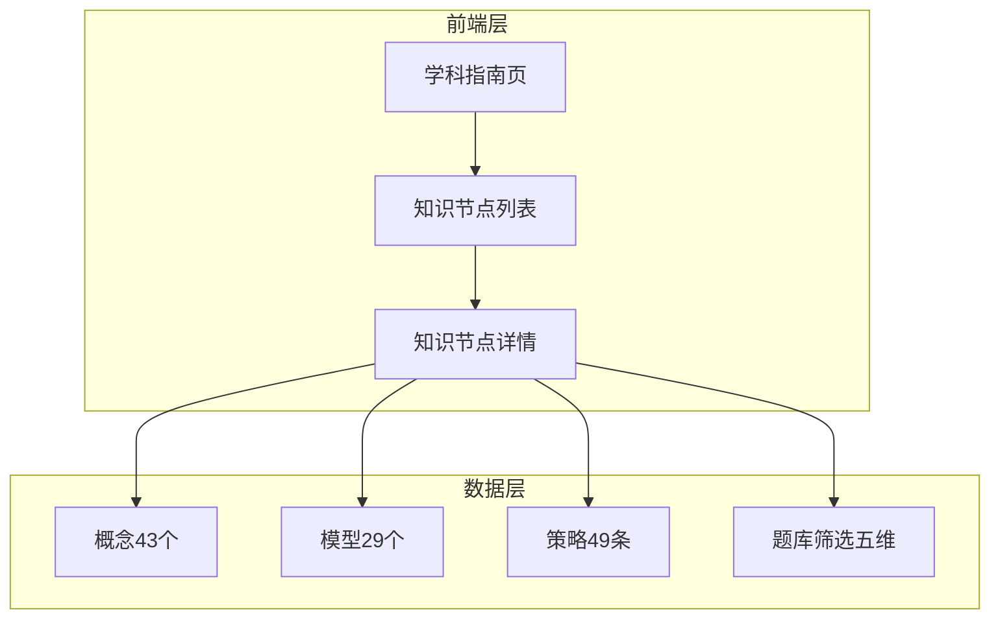
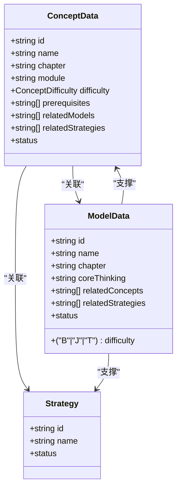
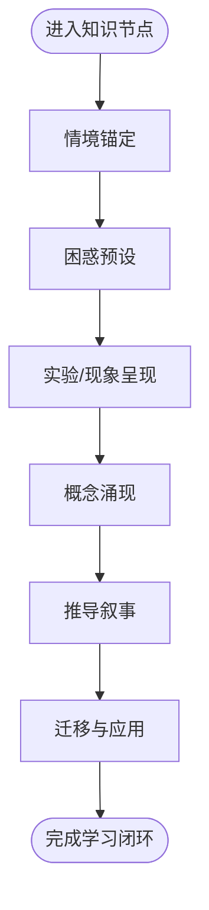
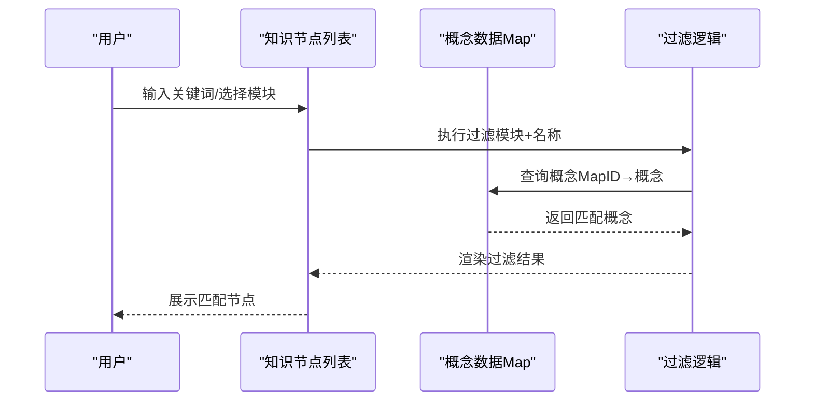
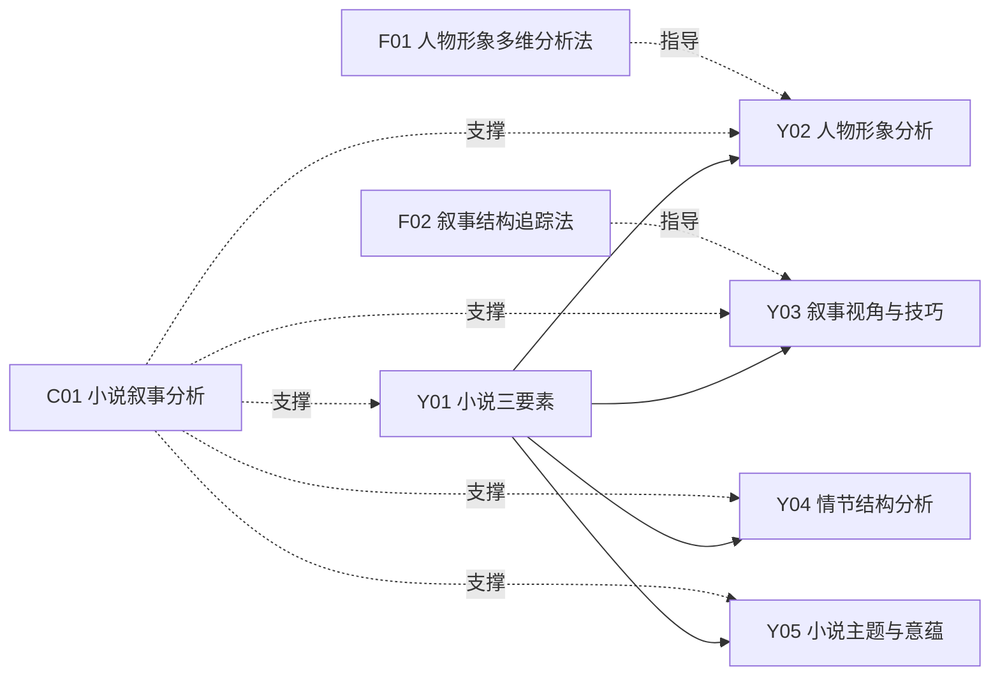

# 语文知识节点

<cite>
**本文引用的文件**   
- [Y01Y43.ts](file://src/data/chinese/concepts/Y01Y43.ts)
- [index.ts（概念聚合）](file://src/data/chinese/concepts/index.ts)
- [types.ts（概念类型）](file://src/data/chinese/concepts/types.ts)
- [C01C29.ts](file://src/data/chinese/models/C01C29.ts)
- [index.ts（模型聚合）](file://src/data/chinese/models/index.ts)
- [types.ts（模型类型）](file://src/data/chinese/models/types.ts)
- [strategies.ts](file://src/data/chinese/strategies.ts)
- [filters.ts（题库筛选）](file://src/data/chinese/questions/filters.ts)
- [ChineseGuidePage.tsx](file://src/sections/ChineseGuidePage.tsx)
- [ConceptList.tsx](file://src/sections/ConceptList.tsx)
- [ConceptPage.tsx](file://src/sections/ConceptPage.tsx)
- [FEATURE-语文学科数据骨架完成记录.md](file://docs/FEATURE-语文学科数据骨架完成记录.md)
- [FEATURE-英语学科数据骨架完成记录.md](file://docs/FEATURE-英语学科数据骨架完成记录.md)
</cite>

## 目录
1. [简介](#简介)
2. [项目结构](#项目结构)
3. [核心组件](#核心组件)
4. [架构总览](#架构总览)
5. [详细组件分析](#详细组件分析)
6. [依赖分析](#依赖分析)
7. [性能考虑](#性能考虑)
8. [故障排查指南](#故障排查指南)
9. [结论](#结论)
10. [附录](#附录)

## 简介
本文件面向“星耀平台”的语文知识节点，系统化阐述43个语文知识节点的组织结构与设计理念，覆盖语言文字应用、古诗文鉴赏、现代文阅读、写作表达、文学常识等核心领域。文档重点解释知识节点的层级结构（情境、困惑、实验、概念、推导、应用），并给出概念难度分级（基础、核心、扩展）与模块划分（语言基础层、输入理解层、输出表达层、文化积淀层）的落地方式。同时，文档化知识节点的数据结构、元数据管理与检索机制，提供具体知识点示例与模块化设计如何优化学习路径的实践建议。

## 项目结构
语文知识节点的数据与前端展示由以下部分构成：
- 数据层
  - 概念层：43个概念（Y01–Y43），按7大板块分组，包含难度、模块、前置概念、关联模型与策略等元数据
  - 模型层：29个文体模型（C01–C29），按板块分组，标注核心思维与难度等级
  - 策略层：49条分析范式骨架（F01–F59），用于指导阅读、写作与鉴赏的思维路径
  - 题库筛选：五维筛选常量（难度、目标、功能、类型、等级）
- 前端层
  - 学科指南页：概述语文四种对话场域与学习升级路径
  - 知识节点列表页：支持按模块与关键词过滤
  - 知识节点详情页：按“情境—困惑—实验—概念—推导—应用”叙事结构组织内容，配套“分层变形”“公式卡片”“理解度自评”等模块

**图示来源**
- [ChineseGuidePage.tsx:1-139](file://src/sections/ChineseGuidePage.tsx#L1-L139)
- [ConceptList.tsx:1-151](file://src/sections/ConceptList.tsx#L1-L151)
- [ConceptPage.tsx:1-387](file://src/sections/ConceptPage.tsx#L1-L387)
- [Y01Y43.ts:1-517](file://src/data/chinese/concepts/Y01Y43.ts#L1-L517)
- [C01C29.ts:1-320](file://src/data/chinese/models/C01C29.ts#L1-L320)
- [strategies.ts:1-67](file://src/data/chinese/strategies.ts#L1-L67)
- [filters.ts:1-38](file://src/data/chinese/questions/filters.ts#L1-L38)

**章节来源**
- [FEATURE-语文学科数据骨架完成记录.md:81-96](file://docs/FEATURE-语文学科数据骨架完成记录.md#L81-L96)
- [FEATURE-英语学科数据骨架完成记录.md:81-97](file://docs/FEATURE-英语学科数据骨架完成记录.md#L81-L97)

## 核心组件
- 概念数据结构（ConceptData）
  - 字段：id、name、chapter、module、difficulty、prerequisites、relatedModels、relatedStrategies、status
  - 用途：统一描述知识节点的元信息与依赖关系
- 模型数据结构（ModelData）
  - 字段：id、name、chapter、difficulty、coreThinking、relatedConcepts、relatedStrategies、status
  - 用途：承载阅读与写作的思维模型，标注难度与核心思维
- 策略数据结构（Strategy）
  - 字段：id、name、status
  - 用途：提供可复用的分析范式与写作方法
- 题库筛选（五维）
  - 等级：L1/L2/L3；目标：同步/期中期末/高考/竞赛；功能：巩固/复习/诊断/真题；难度：B/J/T；类型：选择/填空/判断/解答

**章节来源**
- [types.ts（概念类型）:1-13](file://src/data/chinese/concepts/types.ts#L1-L13)
- [types.ts（模型类型）:1-10](file://src/data/chinese/models/types.ts#L1-L10)
- [strategies.ts:1-67](file://src/data/chinese/strategies.ts#L1-L67)
- [filters.ts（题库筛选）:1-38](file://src/data/chinese/questions/filters.ts#L1-L38)

## 架构总览
语文知识节点采用“概念—模型—策略—题库”的四层协同架构：
- 概念层：以43个节点为核心，按模块与难度组织，明确前置与关联关系
- 模型层：以29个文体模型为载体，将“核心思维”与“难度等级”显性化
- 策略层：以分析范式为工具，贯穿阅读与写作的思维路径
- 题库层：以五维筛选为入口，支持不同学习阶段与目标的练习

**图示来源**
- [types.ts（概念类型）:1-13](file://src/data/chinese/concepts/types.ts#L1-L13)
- [types.ts（模型类型）:1-10](file://src/data/chinese/models/types.ts#L1-L10)
- [strategies.ts:1-67](file://src/data/chinese/strategies.ts#L1-L67)

## 详细组件分析

### 概念层级与模块划分
- 层级结构（基于前端页面的叙事结构）
  - 情境锚定：提供真实或典型的问题情境，帮助学生建立问题意识
  - 困惑预设：揭示常见误区或易错点，引导学生主动辨析
  - 实验/现象呈现：通过典型文本或现象，引导观察与归纳
  - 概念涌现：在情境与现象基础上，提炼核心概念
  - 推导叙事：从概念出发，推演出方法、规律或评价标准
  - 迁移与应用：将所学迁移至新情境，解决实际问题
- 模块划分
  - 语言基础层：字词、病句、衔接、表达等基础能力
  - 输入理解层：文本细读、结构分析、文化理解、审美评价
  - 输出表达层：审题立意、议论文写作、记叙/散文写作、应用文写作
  - 文化积淀层：文学史脉络、文化常识、名篇默写
- 难度分级
  - 基础（core）：入门级，强调识记与常规应用
  - 核心（core）：中等难度，强调理解与迁移
  - 扩展（extended）：较高难度，强调综合与批判

**图示来源**
- [ConceptPage.tsx:54-61](file://src/sections/ConceptPage.tsx#L54-L61)

**章节来源**
- [ConceptPage.tsx:190-216](file://src/sections/ConceptPage.tsx#L190-L216)
- [ConceptPage.tsx:320-350](file://src/sections/ConceptPage.tsx#L320-L350)

### 43个语文知识节点的组织与设计
- 7大板块与节点分布
  - 现代文阅读·文学类文本：6个节点（小说三要素、人物形象、叙事视角、情节结构、主题意蕴、阅读综合）
  - 现代文阅读·实用类文本：4个节点（信息筛选、论述类文本、实用类文本、非连续性文本）
  - 古代诗文·文言文：6个节点（实词、虚词、句式、翻译、内容理解、分析评价）
  - 古代诗文·古诗鉴赏：4个节点（意象意境、语言鉴赏、表现手法、情感主旨）
  - 语言文字运用：8个节点（字音字形、词语成语、病句修改、句子衔接、修辞辨析、表达应用、图文转换、仿写压缩）
  - 写作：8个节点（审题立意、论点分论点、论据运用、论证逻辑、结构升格、记叙文写作、散文写作、应用文写作）
  - 文学文化常识：7个节点（先秦—现当代文学、文化常识、传统思想）
- 设计理念
  - 以“模块—难度—前置—关联”为主线，确保学习路径的结构性与渐进性
  - 概念与模型双向映射：概念驱动模型，模型反哺概念深化
  - 策略作为思维工具，贯穿阅读与写作全过程

**章节来源**
- [FEATURE-语文学科数据骨架完成记录.md:83-96](file://docs/FEATURE-语文学科数据骨架完成记录.md#L83-L96)
- [Y01Y43.ts:1-517](file://src/data/chinese/concepts/Y01Y43.ts#L1-L517)
- [index.ts（概念聚合）:55-134](file://src/data/chinese/concepts/index.ts#L55-L134)

### 模型与策略的协同
- 模型（C01–C29）与概念（Y01–Y43）的映射
  - 每个模型明确标注“核心思维”与“相关概念”，便于在概念学习中调用模型
  - 示例：小说叙事分析模型支撑小说三要素、人物形象、叙事视角、情节结构、主题意蕴等概念
- 策略（F01–F59）的落地
  - 以“范式”形式提供可迁移的思维方法，如“人物形象多维分析法”“论证链条追踪法”“文言文翻译法”等
  - 与概念和模型联动，形成“概念—模型—策略”的学习闭环

**章节来源**
- [C01C29.ts:1-320](file://src/data/chinese/models/C01C29.ts#L1-L320)
- [strategies.ts:1-67](file://src/data/chinese/strategies.ts#L1-L67)

### 元数据管理与检索机制
- 概念元数据管理
  - 通过Map与数组聚合，提供按ID查询、按章节分组、按模块过滤等能力
  - 支持“前置知识检测”“分层变形”“公式卡片”“理解度自评”等模块化展示
- 检索与过滤
  - 列表页支持按模块与关键词过滤，提升查找效率
  - 详情页支持“同模块推荐”，促进知识间的横向联系

**图示来源**
- [ConceptList.tsx:44-57](file://src/sections/ConceptList.tsx#L44-L57)
- [index.ts（概念聚合）:51-53](file://src/data/chinese/concepts/index.ts#L51-L53)

**章节来源**
- [index.ts（概念聚合）:51-53](file://src/data/chinese/concepts/index.ts#L51-L53)
- [ConceptList.tsx:44-57](file://src/sections/ConceptList.tsx#L44-L57)

### 前端页面与交互
- 学科指南页（ChineseGuidePage）
  - 提供“四种对话场域”“四种习惯”“四次升级”的学习蓝图，帮助学生建立整体认知
- 知识节点列表页（ConceptList）
  - 支持模块筛选与关键词搜索，直观展示节点数量与难度标签
- 知识节点详情页（ConceptPage）
  - 以“叙事正文”“分层变形”“公式卡片”“理解度自评”等模块组织内容
  - 提供“前置知识检测”“关联模型/跨学科链接”“同模块推荐”等辅助学习功能

**章节来源**
- [ChineseGuidePage.tsx:1-139](file://src/sections/ChineseGuidePage.tsx#L1-L139)
- [ConceptList.tsx:1-151](file://src/sections/ConceptList.tsx#L1-L151)
- [ConceptPage.tsx:1-387](file://src/sections/ConceptPage.tsx#L1-L387)

## 依赖分析
- 概念与模型的依赖
  - 概念的prerequisites指向其他概念ID，体现学习顺序
  - 概念的relatedModels与relatedStrategies分别指向模型与策略ID
- 模型与概念的依赖
  - 模型的relatedConcepts指向多个概念，体现模型的支撑范围
- 策略与概念/模型的依赖
  - 策略作为通用工具，可跨概念与模型复用

**图示来源**
- [Y01Y43.ts:3-73](file://src/data/chinese/concepts/Y01Y43.ts#L3-L73)
- [C01C29.ts:3-33](file://src/data/chinese/models/C01C29.ts#L3-L33)
- [strategies.ts:9-15](file://src/data/chinese/strategies.ts#L9-L15)

**章节来源**
- [Y01Y43.ts:3-73](file://src/data/chinese/concepts/Y01Y43.ts#L3-L73)
- [C01C29.ts:3-33](file://src/data/chinese/models/C01C29.ts#L3-L33)

## 性能考虑
- 数据加载与渲染
  - 使用Map进行O(1)的按ID查询，减少遍历成本
  - 列表页采用前端过滤，结合关键词与模块筛选，降低后端压力
- 渲染优化
  - 详情页按模块分段渲染，避免一次性渲染大量内容
  - “同模块推荐”仅展示少量节点，避免过度渲染
- 可扩展性
  - 采用barrel导出与分组结构，便于新增节点与模型时快速接入

## 故障排查指南
- 页面空白或“内容整理中”
  - 现象：节点详情页显示“内容整理中”
  - 排查：确认概念数据是否已填充，ID是否与模型/策略一致
- 无法跳转到详情页
  - 现象：点击节点无响应
  - 排查：确认概念数据Map中是否存在该ID，路由是否正确注册
- 列表页无结果
  - 现象：搜索或筛选后无结果
  - 排查：确认过滤逻辑是否正确，关键词是否存在于概念名称中
- 难度标签异常
  - 现象：难度标签颜色或文字不匹配
  - 排查：确认概念difficulty字段与前端映射表一致

**章节来源**
- [ConceptList.tsx:29-42](file://src/sections/ConceptList.tsx#L29-L42)
- [ConceptPage.tsx:107-118](file://src/sections/ConceptPage.tsx#L107-L118)

## 结论
语文知识节点以“概念—模型—策略—题库”四层协同架构为基础，通过模块化、难度分级与前置依赖管理，实现了语文知识的系统化呈现与学习路径优化。前端页面围绕“情境—困惑—实验—概念—推导—应用”的叙事结构组织内容，辅以“分层变形”“公式卡片”“理解度自评”等模块，帮助学生建立从“理解”到“迁移”的完整能力闭环。未来可在内容填充、策略展开与题库建设方面持续迭代，进一步提升教学与学习效果。

## 附录
- 43个语文知识节点示例（摘自概念定义）
  - 现代文阅读·文学类文本：Y01 小说三要素、Y02 人物形象分析、Y03 叙事视角与技巧、Y04 情节结构分析、Y05 小说主题与意蕴、Y06 小说阅读综合
  - 现代文阅读·实用类文本：Y07 信息筛选与概括、Y08 论述类文本阅读、Y09 实用类文本阅读、Y10 非连续性文本阅读
  - 古代诗文·文言文：Y11 文言实词、Y12 文言虚词、Y13 文言句式、Y14 文言文翻译、Y15 文言文内容理解、Y16 文言文分析与评价
  - 古代诗文·古诗鉴赏：Y17 诗歌意象与意境、Y18 诗歌语言鉴赏、Y19 诗歌表现手法、Y20 诗歌情感与主旨
  - 语言文字运用：Y21 字音字形、Y22 词语与成语运用、Y23 病句辨析与修改、Y24 句子衔接与连贯、Y25 修辞手法辨析、Y26 语言表达简明连贯得体、Y27 图文转换、Y28 仿写与扩展压缩
  - 写作：Y29 审题与立意、Y30 议论文论点与分论点、Y31 议论文论据运用、Y32 议论文论证方法与逻辑、Y33 议论文结构与升格、Y34 记叙文写作、Y35 散文写作、Y36 应用文写作
  - 文学文化常识：Y37 先秦文学与文化、Y38 秦汉魏晋文学、Y39 唐宋文学、Y40 元明清文学、Y41 现当代文学、Y42 古代文化常识、Y43 传统文化思想

**章节来源**
- [Y01Y43.ts:3-517](file://src/data/chinese/concepts/Y01Y43.ts#L3-L517)
- [FEATURE-语文学科数据骨架完成记录.md:83-96](file://docs/FEATURE-语文学科数据骨架完成记录.md#L83-L96)