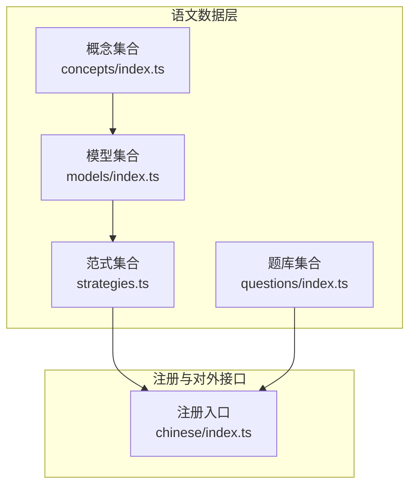
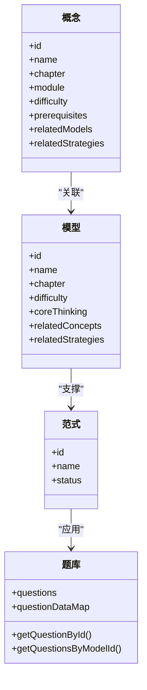
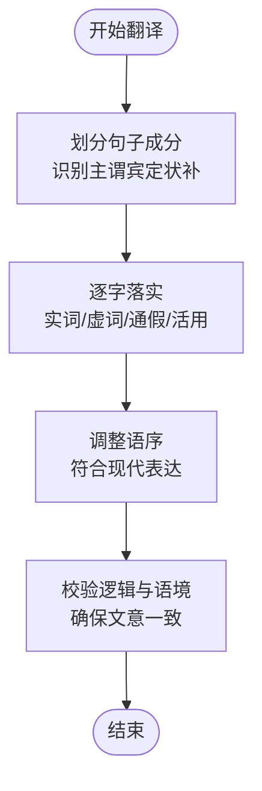
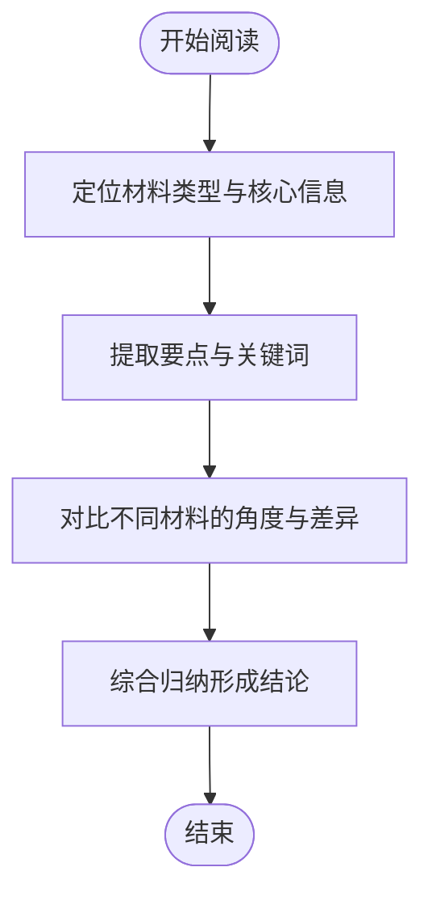
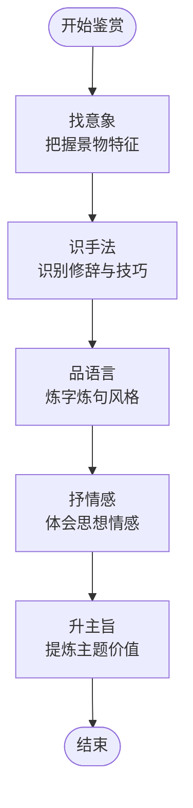
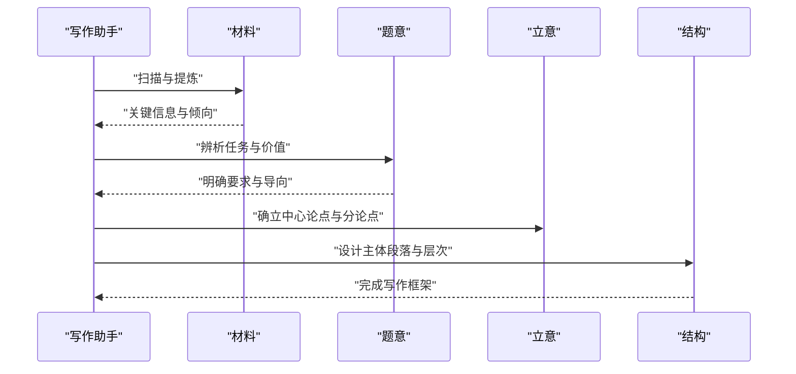
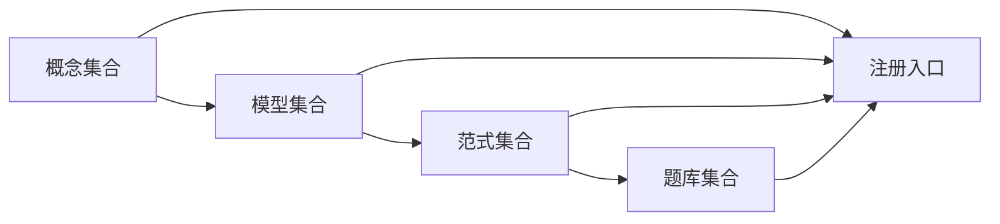

# 语文解题套路

<cite>
**本文档引用的文件**
- [strategies.ts](file://src/data/chinese/strategies.ts)
- [index.ts](file://src/data/chinese/index.ts)
- [concepts/index.ts](file://src/data/chinese/concepts/index.ts)
- [concepts/Y01Y43.ts](file://src/data/chinese/concepts/Y01Y43.ts)
- [models/index.ts](file://src/data/chinese/models/index.ts)
- [models/C01C29.ts](file://src/data/chinese/models/C01C29.ts)
- [questions/index.ts](file://src/data/chinese/questions/index.ts)
- [ChineseGuidePage.tsx](file://src/sections/ChineseGuidePage.tsx)
</cite>

## 目录
1. [引言](#引言)
2. [项目结构](#项目结构)
3. [核心组件](#核心组件)
4. [架构总览](#架构总览)
5. [详细组件分析](#详细组件分析)
6. [依赖分析](#依赖分析)
7. [性能考虑](#性能考虑)
8. [故障排查指南](#故障排查指南)
9. [结论](#结论)
10. [附录](#附录)

## 引言
本文件面向“星耀平台”的语文教学与备考体系，系统化梳理并文档化语文解题套路（简称“范式”），覆盖文言文翻译、现代文阅读、作文写作、诗词鉴赏等核心板块。通过对知识点（概念）、模型（思维模型）、范式（解题套路）的三层结构化组织，帮助教师与学生建立“问题类型→思维模型→解题范式”的条件反射，提升应试能力与解题效率。

## 项目结构
语文数据模块采用“概念-模型-范式-题库-注册入口”的分层组织方式：
- 概念层：按“现代文阅读、古代诗文、语言文字运用、写作、文学文化常识”划分章节，定义每个知识点的层级、前置关系与关联模型/范式。
- 模型层：以“思维模型”为核心，明确每类题型的“核心思维”与“知识关联”，作为范式的理论支撑。
- 范式层：以“解题套路”命名与编号，描述可迁移的步骤、技巧与适用场景，作为操作手册。
- 题库层：承载题目资源，支持按模型检索与统计。
- 注册入口：统一暴露查询接口，供前端页面与工具使用。

**图示来源**
- [index.ts:126-151](file://src/data/chinese/index.ts#L126-L151)
- [concepts/index.ts:1-138](file://src/data/chinese/concepts/index.ts#L1-L138)
- [models/index.ts:1-112](file://src/data/chinese/models/index.ts#L1-L112)
- [strategies.ts:1-67](file://src/data/chinese/strategies.ts#L1-L67)
- [questions/index.ts:1-15](file://src/data/chinese/questions/index.ts#L1-L15)

**章节来源**
- [index.ts:126-151](file://src/data/chinese/index.ts#L126-L151)

## 核心组件
- 概念（知识点）：以“章节-模块-难度-前置-关联模型/范式”描述，形成“知识网络”。例如“诗歌意象与意境”“议论文论证方法与逻辑”等。
- 模型（思维模型）：以“核心思维-相关概念-关联范式”描述，形成“思维框架”。例如“文言文阅读理解模型”“议论文论证模型”等。
- 范式（解题套路）：以“编号-名称-状态”描述，形成“操作手册”。例如“实词词义推断法”“诗文比较鉴赏法”“审题立意多维分析法”等。
- 题库：提供题目集合与按模型检索能力，支撑训练与评估。

**章节来源**
- [concepts/index.ts:51-138](file://src/data/chinese/concepts/index.ts#L51-L138)
- [models/index.ts:37-112](file://src/data/chinese/models/index.ts#L37-L112)
- [strategies.ts:9-67](file://src/data/chinese/strategies.ts#L9-L67)
- [questions/index.ts:1-15](file://src/data/chinese/questions/index.ts#L1-L15)

## 架构总览
语文范式体系通过“概念→模型→范式”的三级联动，实现“知识→思维→操作”的闭环。注册入口统一暴露查询与统计能力，前端页面基于此构建学习路径与练习页面。

**图示来源**
- [concepts/Y01Y43.ts:195-394](file://src/data/chinese/concepts/Y01Y43.ts#L195-L394)
- [models/C01C29.ts:91-290](file://src/data/chinese/models/C01C29.ts#L91-L290)
- [strategies.ts:9-67](file://src/data/chinese/strategies.ts#L9-L67)
- [questions/index.ts:1-15](file://src/data/chinese/questions/index.ts#L1-L15)

## 详细组件分析

### 文言文解题套路
- 文言文翻译法（范式）
  - 关联概念：文言文翻译、文言文内容理解
  - 关联模型：文言文阅读理解模型、文言文评价鉴赏模型
  - 设计理念：以“文化理解与语境还原”为核心，强调“直译为主、意译为辅、补出成分、调整语序、落实词义”的步骤化流程。
  - 解题步骤（示意）：
    1) 划分句子成分，识别主谓宾、定状补。
    2) 逐字落实，结合上下文确定实词、虚词、通假、活用。
    3) 调整语序，使译文符合现代汉语表达习惯。
    4) 校验逻辑与语境，确保与文意一致。
  - 关键技巧：实词推断、虚词用法、特殊句式、文化背景还原。
  - 适用场景：文言文断句、翻译、内容概括、人物事件分析。
  - 效果评估：以“得分点覆盖度、语言表达规范度、文化理解准确度”衡量。
- 文言基础积累法（范式）
  - 关联概念：文言实词、文言虚词、文言句式
  - 关联模型：文言基础积累模型
  - 设计理念：以高频实词、常用虚词、典型句式为载体，构建“语感—迁移—应用”的路径。
  - 解题步骤（示意）：
    1) 归纳高频实词与虚词的多义项。
    2) 总结常见句式与特殊语法现象。
    3) 通过例句与变式强化记忆与辨析。
    4) 在阅读中持续复现与应用。
  - 关键技巧：词义迁移、句式类比、语境印证。
  - 适用场景：文言基础题、翻译题、文言文整体理解。
  - 效果评估：以“识记准确率、迁移应用正确率、阅读速度与准确率”衡量。

**图示来源**
- [models/C01C29.ts:91-111](file://src/data/chinese/models/C01C29.ts#L91-L111)
- [concepts/Y01Y43.ts:16-21](file://src/data/chinese/concepts/Y01Y43.ts#L16-L21)

**章节来源**
- [strategies.ts:22-25](file://src/data/chinese/strategies.ts#L22-L25)
- [models/C01C29.ts:91-111](file://src/data/chinese/models/C01C29.ts#L91-L111)
- [concepts/Y01Y43.ts:16-21](file://src/data/chinese/concepts/Y01Y43.ts#L16-L21)

### 现代文阅读套路
- 信息角度比较法（范式）
  - 关联概念：信息筛选与概括、论述类文本阅读、实用类文本阅读、非连续性文本阅读
  - 关联模型：论述类文本分析、实用类文本分析、非连续文本整合
  - 设计理念：以“信息提取—角度对比—归纳整合”为主线，强调“多角度、多材料”的横向比较。
  - 解题步骤（示意）：
    1) 快速浏览，定位材料类型与核心信息。
    2) 提取要点，标注关键词与信息源。
    3) 对比角度，梳理不同材料的侧重点与差异。
    4) 综合归纳，形成统一结论或提出新见解。
  - 关键技巧：信息定位、关键词提取、角度切换、整合归纳。
  - 适用场景：非连续文本、图表信息、多则材料对比题。
  - 效果评估：以“信息提取完整度、角度覆盖度、归纳准确性”衡量。

**图示来源**
- [models/C01C29.ts:157-166](file://src/data/chinese/models/C01C29.ts#L157-L166)
- [concepts/Y01Y43.ts:12-15](file://src/data/chinese/concepts/Y01Y43.ts#L12-L15)

**章节来源**
- [strategies.ts:18-19](file://src/data/chinese/strategies.ts#L18-L19)
- [models/C01C29.ts:157-166](file://src/data/chinese/models/C01C29.ts#L157-L166)
- [concepts/Y01Y43.ts:12-15](file://src/data/chinese/concepts/Y01Y43.ts#L12-L15)

### 诗词鉴赏套路
- 意象意境情感分析法（范式）
  - 关联概念：诗歌意象与意境、诗歌语言鉴赏、诗歌情感与主旨
  - 关联模型：诗歌意象语言模型、诗歌主题情感模型
  - 设计理念：以“意象—手法—语言—情感—主旨”的多维分析链路，强调“由表及里、由景入情”的解读路径。
  - 解题步骤（示意）：
    1) 找意象，把握景物特征与情感指向。
    2) 识手法，识别修辞与表现技巧。
    3) 品语言，关注炼字、炼句与风格。
    4) 抒情感，体会诗人思想情感与时代背景。
    5) 升主旨，提炼作品主题与思想价值。
  - 关键技巧：意象识别、手法辨析、语言品味、情感共鸣。
  - 适用场景：古典诗歌与现代诗歌的鉴赏题。
  - 效果评估：以“意象把握度、手法识别度、语言品鉴度、情感与主旨契合度”衡量。

**图示来源**
- [models/C01C29.ts:113-144](file://src/data/chinese/models/C01C29.ts#L113-L144)
- [concepts/Y01Y43.ts:195-241](file://src/data/chinese/concepts/Y01Y43.ts#L195-L241)

**章节来源**
- [strategies.ts:26-27](file://src/data/chinese/strategies.ts#L26-L27)
- [models/C01C29.ts:113-144](file://src/data/chinese/models/C01C29.ts#L113-L144)
- [concepts/Y01Y43.ts:195-241](file://src/data/chinese/concepts/Y01Y43.ts#L195-L241)

### 作文写作套路
- 审题立意多维分析法（范式）
  - 关联概念：审题与立意、议论文论点与分论点、议论文论证方法与逻辑
  - 关联模型：议论文立论模型、作文材料分析模型、作文思辨写作模型
  - 设计理念：以“材料→题意→立意→结构”的多维分析，强调“审准题、立好意、理清思路”的写作起点。
  - 解题步骤（示意）：
    1) 材料扫描，提取关键信息与倾向。
    2) 题意辨析，明确任务驱动与价值导向。
    3) 立意确立，形成中心论点与分论点。
    4) 结构设计，安排主体段落与论证层次。
  - 关键技巧：材料提炼、题意聚焦、立意新颖、结构清晰。
  - 适用场景：材料作文、任务驱动写作。
  - 效果评估：以“审题准确度、立意深刻度、结构完整性、语言表达规范度”衡量。
- 议论文论证方法选择法（范式）
  - 关联概念：议论文论证方法与逻辑
  - 关联模型：议论文论证模型、议论文升格模型
  - 设计理念：以“论点—论据—论证方法—逻辑链条”为主线，强调“方法适配与逻辑严密”。
  - 解题步骤（示意）：
    1) 明确论点，锁定核心主张。
    2) 选择论据，确保典型性与代表性。
    3) 选定方法，匹配事实、道理、对比、类比等。
    4) 构建链条，确保前后呼应、环环相扣。
  - 关键技巧：论据精选、方法适配、逻辑闭环。
  - 适用场景：议论文写作与点评。
  - 效果评估：以“论据恰当度、方法适配度、逻辑严密度”衡量。

**图示来源**
- [models/C01C29.ts:179-221](file://src/data/chinese/models/C01C29.ts#L179-L221)
- [concepts/Y01Y43.ts:339-385](file://src/data/chinese/concepts/Y01Y43.ts#L339-L385)

**章节来源**
- [strategies.ts:36-39](file://src/data/chinese/strategies.ts#L36-L39)
- [models/C01C29.ts:179-221](file://src/data/chinese/models/C01C29.ts#L179-L221)
- [concepts/Y01Y43.ts:339-385](file://src/data/chinese/concepts/Y01Y43.ts#L339-L385)

### 语言文字运用套路
- 病句六类型诊断法（范式）
  - 关联概念：病句辨析与修改、句子衔接与连贯
  - 关联模型：病句衔接辨析模型
  - 设计理念：以“结构—成分—逻辑—语感”六维度诊断，强调“先结构后语感”的系统化筛查。
  - 解题步骤（示意）：
    1) 判断结构，识别主谓宾是否齐全。
    2) 检查成分，排查定状补位置与搭配。
    3) 审视逻辑，确认因果、转折、递进关系。
    4) 体察语感，修正语序不当与搭配不当。
  - 关键技巧：结构优先、成分对号、逻辑贯通、语感微调。
  - 适用场景：病句辨析与修改题。
  - 效果评估：以“结构完整度、成分搭配度、逻辑清晰度、语言流畅度”衡量。
- 字词成语语境辨析法（范式）
  - 关联概念：字音字形、词语与成语运用
  - 关联模型：字词成语辨析模型
  - 设计理念：以“语境—词义—搭配—色彩”四维辨析，强调“因境定义、因境选词”。
  - 解题步骤（示意）：
    1) 分析语境，把握对象、场合、语气。
    2) 推断词义，结合近义词辨析与语义链。
    3) 检验搭配，确认语法与习惯用法。
    4) 判断色彩，注意感情色彩与语体色彩。
  - 关键技巧：语境优先、词义辨析、搭配验证、色彩把握。
  - 适用场景：词语与成语运用题。
  - 效果评估：以“语境契合度、词义准确度、搭配规范度、色彩恰当度”衡量。

**章节来源**
- [strategies.ts:32-33](file://src/data/chinese/strategies.ts#L32-L33)
- [strategies.ts:31](file://src/data/chinese/strategies.ts#L31)
- [models/C01C29.ts:146-166](file://src/data/chinese/models/C01C29.ts#L146-L166)
- [concepts/Y01Y43.ts:243-265](file://src/data/chinese/concepts/Y01Y43.ts#L243-L265)

## 依赖分析
语文范式体系的耦合关系如下：
- 概念层为模型层提供“知识锚点”，模型层为范式层提供“思维框架”，范式层为题库层提供“操作依据”。
- 注册入口统一暴露查询与统计能力，避免前端直接依赖具体实现。

**图示来源**
- [index.ts:126-151](file://src/data/chinese/index.ts#L126-L151)
- [concepts/index.ts:1-138](file://src/data/chinese/concepts/index.ts#L1-L138)
- [models/index.ts:1-112](file://src/data/chinese/models/index.ts#L1-L112)
- [strategies.ts:1-67](file://src/data/chinese/strategies.ts#L1-L67)
- [questions/index.ts:1-15](file://src/data/chinese/questions/index.ts#L1-L15)

**章节来源**
- [index.ts:126-151](file://src/data/chinese/index.ts#L126-L151)

## 性能考虑
- 数据访问：通过 Map 查询（概念、模型、范式、题库）实现 O(1) 访问，减少遍历成本。
- 注册接口：集中暴露查询与统计方法，便于前端缓存与懒加载。
- 扩展性：新增范式/模型/概念时，遵循统一的数据结构与注册流程，降低耦合风险。

## 故障排查指南
- 无法获取范式详情
  - 检查范式 ID 是否存在于映射表中。
  - 确认范式状态是否为“发布”而非“待发布/即将上线”。
- 无法获取模型或概念列表
  - 检查注册入口是否正确导出相应方法。
  - 确认章节划分与模型/概念映射是否一致。
- 题目按模型检索为空
  - 检查题目 modelId 字段是否正确设置。
  - 确认题库集合是否包含目标题目。

**章节来源**
- [strategies.ts:61-67](file://src/data/chinese/strategies.ts#L61-L67)
- [index.ts:126-151](file://src/data/chinese/index.ts#L126-L151)
- [questions/index.ts:1-15](file://src/data/chinese/questions/index.ts#L1-L15)

## 结论
语文解题套路通过“概念→模型→范式”的分层设计，将抽象的语文能力转化为可操作、可迁移的解题流程。建议在教学实践中：
- 先以“模型”建立思维框架，再以“范式”固化操作步骤。
- 将范式与题库结合，开展“范式—题目—反馈”的循环训练。
- 注重“文体意识自动化”“语篇意识”“文化理解”等高阶能力的培养，提升迁移与应用水平。

## 附录
- 语文教学与学习建议（摘自页面内容）
  - 从“读懂字面”到“读出多层含义”：建立“字面—修辞—结构—文化”四层分析框架。
  - 从“背答题模板”到“文体意识自动化”：不同文体启动不同阅读框架。
  - 语文是所有学科的底层操作系统：提升语文能力有助于其他学科的学习与表达。
  - 从“背注释”到“文化理解”：通过作者生平、时代背景、文化编码理解深层含义。
  - 最终的馈赠：一种人文思维，能在复杂信息时代保持独立思考与意义阐释能力。

**章节来源**
- [ChineseGuidePage.tsx:20-127](file://src/sections/ChineseGuidePage.tsx#L20-L127)