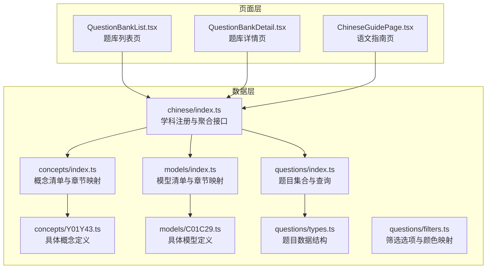
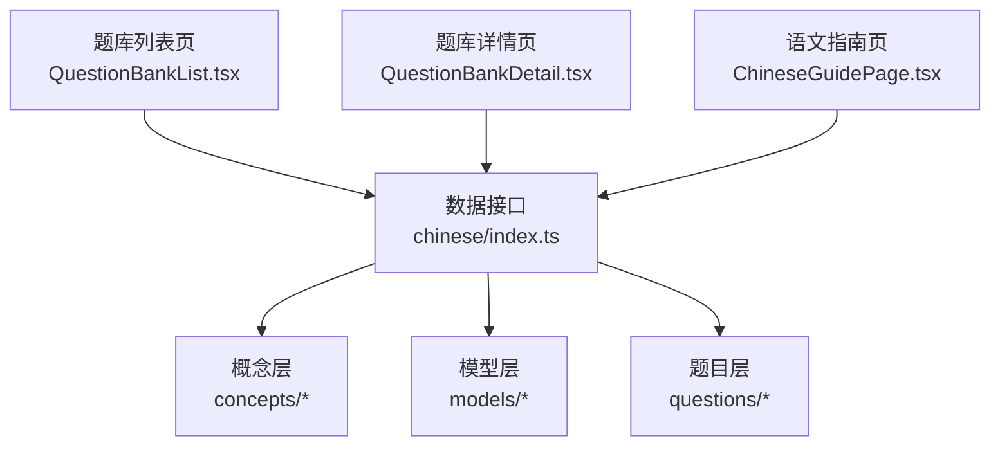
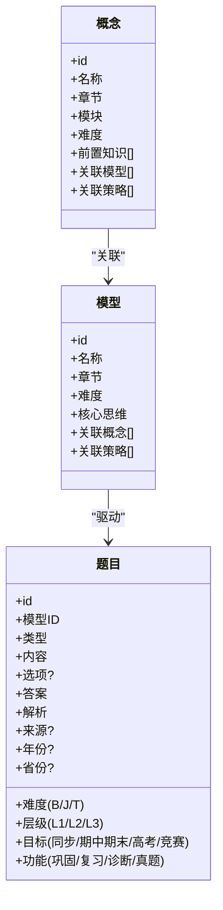
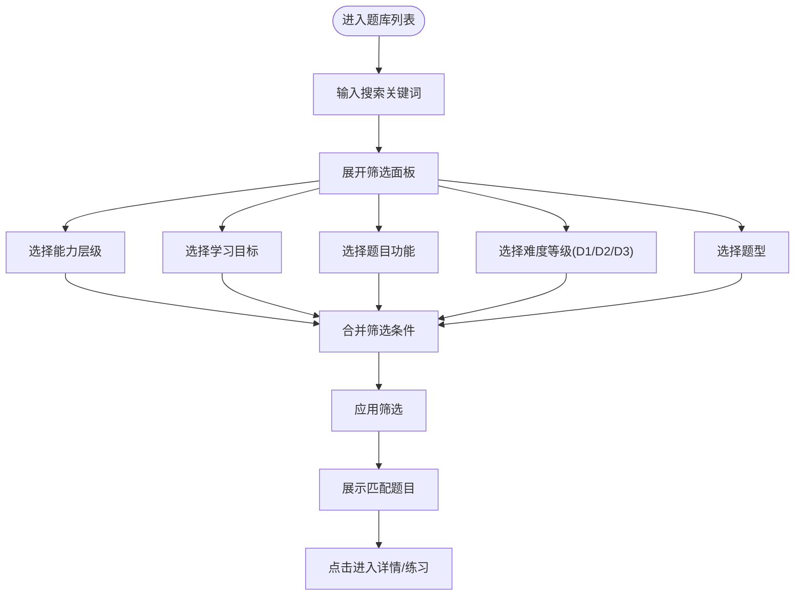
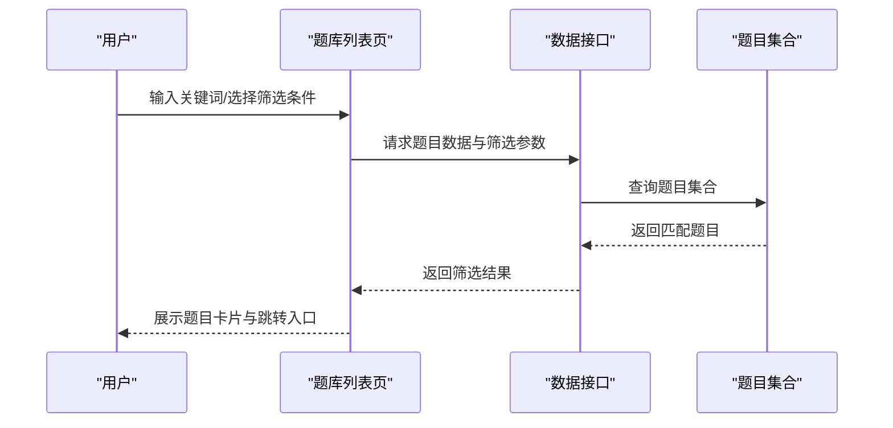
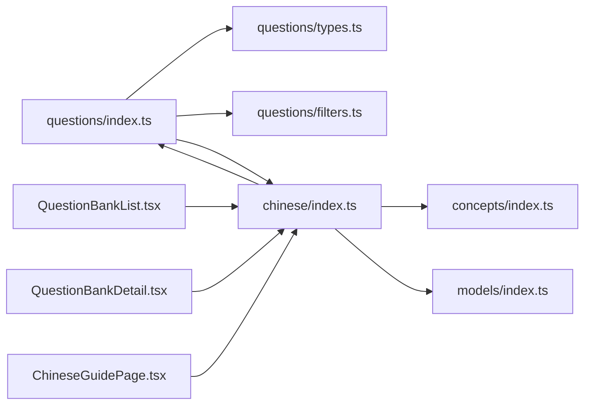

# 语文题库系统

<cite>
**本文档引用的文件**
- [src/data/chinese/index.ts](file://src/data/chinese/index.ts)
- [src/data/chinese/questions/index.ts](file://src/data/chinese/questions/index.ts)
- [src/data/chinese/questions/types.ts](file://src/data/chinese/questions/types.ts)
- [src/data/chinese/questions/filters.ts](file://src/data/chinese/questions/filters.ts)
- [src/data/chinese/models/index.ts](file://src/data/chinese/models/index.ts)
- [src/data/chinese/models/C01C29.ts](file://src/data/chinese/models/C01C29.ts)
- [src/data/chinese/concepts/index.ts](file://src/data/chinese/concepts/index.ts)
- [src/data/chinese/concepts/Y01Y43.ts](file://src/data/chinese/concepts/Y01Y43.ts)
- [src/sections/ChineseGuidePage.tsx](file://src/sections/ChineseGuidePage.tsx)
- [src/sections/QuestionBankList.tsx](file://src/sections/QuestionBankList.tsx)
- [src/sections/QuestionBankDetail.tsx](file://src/sections/QuestionBankDetail.tsx)
</cite>

## 目录
1. [引言](#引言)
2. [项目结构](#项目结构)
3. [核心组件](#核心组件)
4. [架构总览](#架构总览)
5. [详细组件分析](#详细组件分析)
6. [依赖关系分析](#依赖关系分析)
7. [性能考虑](#性能考虑)
8. [故障排除指南](#故障排除指南)
9. [结论](#结论)
10. [附录](#附录)

## 引言
本文件面向星耀平台的语文题库系统，系统性梳理语文知识图谱、题库数据结构、筛选与匹配机制，并结合前端页面组件，给出可操作的使用场景与实践建议。语文题库采用“知识点-模型-题目”的三层组织方式，围绕现代文阅读、古代诗文、语言文字运用、写作四大板块，构建覆盖“能力层级（L1/L2/L3）”“学习目标（同步/期中期末/高考/竞赛）”“题目功能（巩固/复习/诊断/真题）”“难度等级（B/J/T）”“题型（选择/填空/判断/解答）”的多维筛选体系，辅以标签与统计分析，支持个性化推荐与精准化学习。

## 项目结构
语文题库相关代码主要分布在以下区域：
- 数据层：语文学科注册入口、概念、模型、题目与筛选配置
- 页面层：语文指南页、题库列表页、题库详情页
- 组件层：通用UI组件（如按钮、输入框、卡片、徽章等）

**图表来源**
- [src/data/chinese/index.ts:1-151](file://src/data/chinese/index.ts#L1-L151)
- [src/data/chinese/concepts/index.ts:1-138](file://src/data/chinese/concepts/index.ts#L1-L138)
- [src/data/chinese/concepts/Y01Y43.ts:1-517](file://src/data/chinese/concepts/Y01Y43.ts#L1-L517)
- [src/data/chinese/models/index.ts:1-112](file://src/data/chinese/models/index.ts#L1-L112)
- [src/data/chinese/models/C01C29.ts:1-320](file://src/data/chinese/models/C01C29.ts#L1-L320)
- [src/data/chinese/questions/index.ts:1-15](file://src/data/chinese/questions/index.ts#L1-L15)
- [src/data/chinese/questions/types.ts:1-16](file://src/data/chinese/questions/types.ts#L1-L16)
- [src/data/chinese/questions/filters.ts:1-38](file://src/data/chinese/questions/filters.ts#L1-L38)
- [src/sections/ChineseGuidePage.tsx:1-139](file://src/sections/ChineseGuidePage.tsx#L1-L139)
- [src/sections/QuestionBankList.tsx:1-424](file://src/sections/QuestionBankList.tsx#L1-L424)
- [src/sections/QuestionBankDetail.tsx:1-185](file://src/sections/QuestionBankDetail.tsx#L1-L185)

**章节来源**
- [src/data/chinese/index.ts:1-151](file://src/data/chinese/index.ts#L1-L151)
- [src/sections/QuestionBankList.tsx:1-424](file://src/sections/QuestionBankList.tsx#L1-L424)

## 核心组件
- 学科注册与聚合接口：提供概念、模型、公式、策略、题目等统一访问入口，包含难度标签、颜色映射、选项枚举、统计与分组方法。
- 概念层：按“现代文阅读/古代诗文/语言文字运用/写作/文学文化常识”划分章节，每个概念标注模块层级（输入理解层/语言基础层/输出表达层/文化积淀层）、前置知识、关联模型与策略。
- 模型层：以“阅读/鉴赏/表达/文化”为主线，将概念与题型、目标、功能、难度进行映射，形成可训练、可测评的知识模型。
- 题目层：统一题型、难度、层级、目标、功能、分析、来源等字段，支持按模型ID分组与按标签检索。
- 页面组件：题库列表页支持多维筛选与标签过滤；题库详情页按难度分块展示题目；语文指南页提供学习理念与方法论。

**章节来源**
- [src/data/chinese/index.ts:66-151](file://src/data/chinese/index.ts#L66-L151)
- [src/data/chinese/concepts/index.ts:55-134](file://src/data/chinese/concepts/index.ts#L55-L134)
- [src/data/chinese/models/index.ts:43-108](file://src/data/chinese/models/index.ts#L43-L108)
- [src/data/chinese/questions/types.ts:1-16](file://src/data/chinese/questions/types.ts#L1-L16)
- [src/sections/QuestionBankList.tsx:29-424](file://src/sections/QuestionBankList.tsx#L29-L424)
- [src/sections/QuestionBankDetail.tsx:92-185](file://src/sections/QuestionBankDetail.tsx#L92-L185)

## 架构总览
语文题库系统采用“数据-页面-组件”三层架构：
- 数据层负责领域建模与接口暴露，提供统一的查询、统计与分组能力。
- 页面层负责交互与筛选，调用数据层接口渲染列表与详情。
- 组件层提供通用UI能力，保证一致的交互体验。

**图表来源**
- [src/sections/QuestionBankList.tsx:29-424](file://src/sections/QuestionBankList.tsx#L29-L424)
- [src/sections/QuestionBankDetail.tsx:92-185](file://src/sections/QuestionBankDetail.tsx#L92-L185)
- [src/sections/ChineseGuidePage.tsx:5-139](file://src/sections/ChineseGuidePage.tsx#L5-L139)
- [src/data/chinese/index.ts:126-151](file://src/data/chinese/index.ts#L126-L151)

## 详细组件分析

### 数据模型与组织结构
语文题库采用“概念-模型-题目”三级结构：
- 概念（Concept）：描述知识点与能力层级，标注模块、难度、前置知识与关联模型/策略。
- 模型（Model）：以“阅读/鉴赏/表达/文化”为核心，定义章节、难度、核心思维、关联概念与策略。
- 题目（Question）：统一字段，包含类型、难度、层级、目标、功能、内容、选项、答案、分析、来源、年份、省份等。

**图表来源**
- [src/data/chinese/concepts/Y01Y43.ts:3-517](file://src/data/chinese/concepts/Y01Y43.ts#L3-L517)
- [src/data/chinese/models/C01C29.ts:3-320](file://src/data/chinese/models/C01C29.ts#L3-L320)
- [src/data/chinese/questions/types.ts:1-16](file://src/data/chinese/questions/types.ts#L1-L16)

**章节来源**
- [src/data/chinese/concepts/index.ts:55-134](file://src/data/chinese/concepts/index.ts#L55-L134)
- [src/data/chinese/models/index.ts:43-108](file://src/data/chinese/models/index.ts#L43-L108)
- [src/data/chinese/questions/types.ts:1-16](file://src/data/chinese/questions/types.ts#L1-L16)

### 筛选机制与标签系统
题库支持多维筛选：
- 能力层级：L1（基础）、L2（进阶）、L3（挑战）
- 学习目标：同步学习、期中期末、高考专项、竞赛拓展
- 题目功能：巩固练习、复习检测、诊断评估、真题演练
- 难度等级：B（基础）、J（进阶）、T（挑战），另提供D数值化难度（D1/D2/D3）
- 题型：选择题、填空题、判断题、解答题
- 标签：题目内容与标签的模糊匹配，支持快速检索

**图表来源**
- [src/sections/QuestionBankList.tsx:69-83](file://src/sections/QuestionBankList.tsx#L69-L83)
- [src/data/chinese/questions/filters.ts:1-38](file://src/data/chinese/questions/filters.ts#L1-L38)

**章节来源**
- [src/sections/QuestionBankList.tsx:29-424](file://src/sections/QuestionBankList.tsx#L29-L424)
- [src/data/chinese/questions/filters.ts:1-38](file://src/data/chinese/questions/filters.ts#L1-L38)

### 智能匹配与个性化推荐策略
- 概念-模型-题目的三层映射：通过概念的前置知识与关联模型，确定模型的适用范围；通过模型ID将题目归类，形成“模型-题目”分组。
- 题目统计与分组：按模型统计题目数量，便于评估模型覆盖度与练习强度。
- 推荐策略建议：
  - 基于前置知识的顺序推荐：根据概念的prerequisites构建学习路径，优先推荐前置概念对应的模型与题目。
  - 基于模型难度的阶梯推荐：从L1到L3逐步提升，结合D数值化难度进行分层练习。
  - 基于目标与功能的定向推荐：按“同步/期中期末/高考/竞赛”与“巩固/复习/诊断/真题”进行组合筛选，匹配学习阶段与训练目标。
  - 基于标签的精准检索：利用题目标签快速定位特定知识点或题型，提高练习针对性。

**章节来源**
- [src/data/chinese/concepts/Y01Y43.ts:3-517](file://src/data/chinese/concepts/Y01Y43.ts#L3-L517)
- [src/data/chinese/models/C01C29.ts:3-320](file://src/data/chinese/models/C01C29.ts#L3-L320)
- [src/data/chinese/index.ts:106-124](file://src/data/chinese/index.ts#L106-L124)

### 数据结构与统计分析
- 题目数据结构：统一的Question接口，包含类型、难度、层级、目标、功能、内容、选项、答案、解析、来源、年份、省份等字段，便于前端渲染与后端存储。
- 统计分析：
  - 模型题目统计：按模型ID统计总数，辅助评估模型覆盖度与练习强度。
  - 模型题目分组：按模型ID分组，支持“题库详情页”按难度分块展示。
  - 难度标签与颜色：提供难度标签与颜色映射，用于界面可视化与用户感知。

**章节来源**
- [src/data/chinese/questions/types.ts:1-16](file://src/data/chinese/questions/types.ts#L1-L16)
- [src/data/chinese/index.ts:106-124](file://src/data/chinese/index.ts#L106-L124)
- [src/data/chinese/questions/filters.ts:34-38](file://src/data/chinese/questions/filters.ts#L34-L38)

### 页面与交互流程
- 题库列表页：支持关键词搜索、难度快捷筛选、多维筛选面板（能力层级、学习目标、题目功能、难度等级、题型），并展示匹配结果与清除筛选。
- 题库详情页：按模型分组展示题目，支持按题型筛选与难度分块折叠，提供“随机练习”入口。
- 语文指南页：提供学习理念、对话场域、习惯与升级路径，帮助学生建立正确的语文学习方法论。

**图表来源**
- [src/sections/QuestionBankList.tsx:69-83](file://src/sections/QuestionBankList.tsx#L69-L83)
- [src/data/chinese/questions/index.ts:5-15](file://src/data/chinese/questions/index.ts#L5-L15)
- [src/data/chinese/index.ts:66-100](file://src/data/chinese/index.ts#L66-L100)

**章节来源**
- [src/sections/QuestionBankList.tsx:29-424](file://src/sections/QuestionBankList.tsx#L29-L424)
- [src/sections/QuestionBankDetail.tsx:92-185](file://src/sections/QuestionBankDetail.tsx#L92-L185)
- [src/sections/ChineseGuidePage.tsx:5-139](file://src/sections/ChineseGuidePage.tsx#L5-L139)

## 依赖关系分析
语文题库的数据与页面之间存在明确的依赖关系：
- 页面组件依赖数据接口提供的枚举、映射与查询方法。
- 概念与模型定义决定题目的分组与推荐策略。
- 题目集合与分组方法决定页面渲染与统计展示。

**图表来源**
- [src/data/chinese/questions/index.ts:1-15](file://src/data/chinese/questions/index.ts#L1-L15)
- [src/data/chinese/questions/types.ts:1-16](file://src/data/chinese/questions/types.ts#L1-L16)
- [src/data/chinese/questions/filters.ts:1-38](file://src/data/chinese/questions/filters.ts#L1-L38)
- [src/data/chinese/index.ts:1-151](file://src/data/chinese/index.ts#L1-L151)
- [src/sections/QuestionBankList.tsx:1-424](file://src/sections/QuestionBankList.tsx#L1-L424)
- [src/sections/QuestionBankDetail.tsx:1-185](file://src/sections/QuestionBankDetail.tsx#L1-L185)
- [src/sections/ChineseGuidePage.tsx:1-139](file://src/sections/ChineseGuidePage.tsx#L1-L139)

**章节来源**
- [src/data/chinese/index.ts:126-151](file://src/data/chinese/index.ts#L126-L151)
- [src/sections/QuestionBankList.tsx:29-424](file://src/sections/QuestionBankList.tsx#L29-L424)

## 性能考虑
- 前端筛选性能：题目集合较小规模时，本地过滤即可满足性能需求；若数据量增大，建议引入服务端分页与条件索引。
- 渲染优化：列表页采用懒加载与分块渲染，详情页按难度折叠，减少一次性渲染压力。
- 缓存策略：将常用枚举与映射缓存至内存，避免重复计算与重复请求。
- 图标与样式：使用轻量图标库与CSS类名，减少包体积与渲染开销。

## 故障排除指南
- 题目为空或筛选无结果：确认筛选条件是否过于严格，尝试清除筛选或放宽条件。
- 题目标签无法匹配：检查标签拼写与大小写，确保与题目数据一致。
- 模型无题库：确认模型ID是否正确，以及题目集合中是否存在对应模型的题目。
- 页面加载缓慢：检查网络状况与数据接口响应时间，必要时启用缓存与分页。

**章节来源**
- [src/sections/QuestionBankList.tsx:35-48](file://src/sections/QuestionBankList.tsx#L35-L48)
- [src/sections/QuestionBankList.tsx:375-386](file://src/sections/QuestionBankList.tsx#L375-L386)

## 结论
语文题库系统通过“概念-模型-题目”的三层组织，结合多维筛选与标签检索，实现了从知识点到题目的精准映射与个性化推荐。配合指南页的学习理念与方法论，能够帮助学生建立科学的学习路径，实现精准化学习与高效备考。未来可在服务端分页、缓存策略与推荐算法上进一步优化，提升大规模数据下的性能与体验。

## 附录
- 使用场景示例
  - 同步学习：选择“同步学习”目标与“巩固练习”功能，结合L1层级与基础题型，进行日常巩固。
  - 期中期末：选择“期中期末”目标与“复习检测”功能，结合L2/L3层级与多种题型，进行阶段性检测。
  - 高考专项：选择“高考专项”目标与“真题演练”功能，结合D3难度与解答题，强化应试能力。
  - 竞赛拓展：选择“竞赛拓展”目标与“挑战题”，结合高阶模型与综合题型，提升思维深度。
- 实践建议
  - 建议以概念为起点，按前置知识顺序推进，逐步提升到模型与题目。
  - 利用标签与关键词快速定位薄弱环节，进行有针对性的练习。
  - 定期查看模型题目统计，评估掌握情况并调整学习计划。