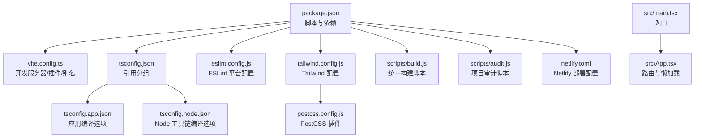
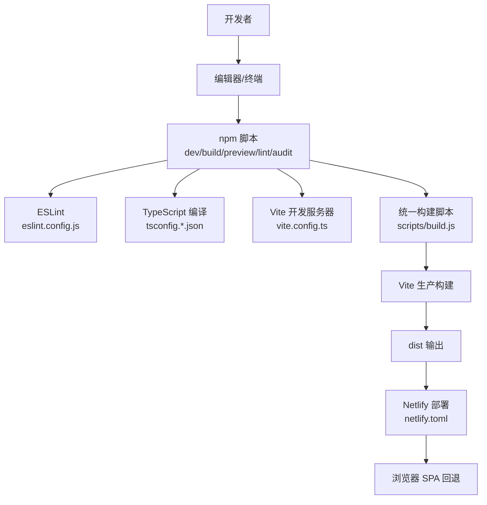
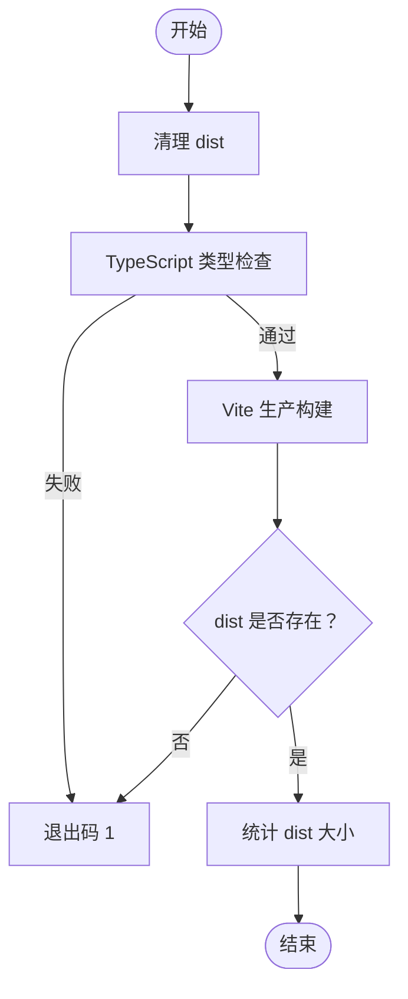
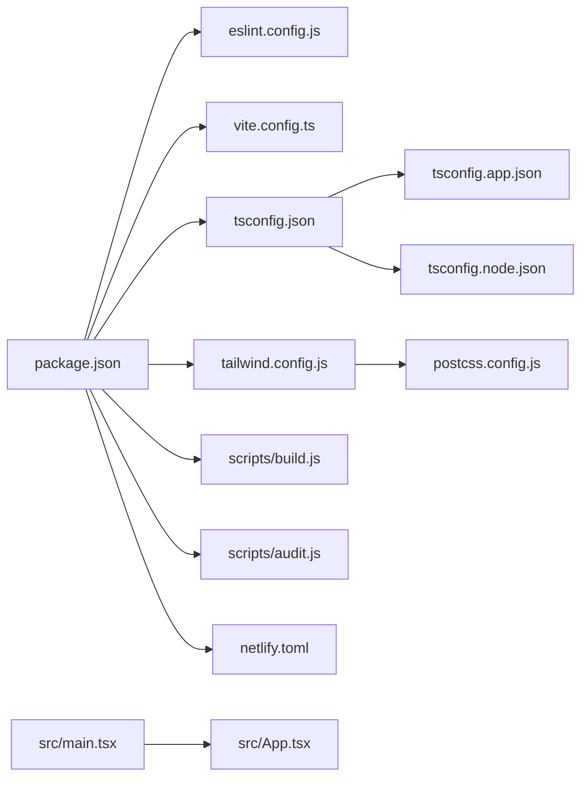
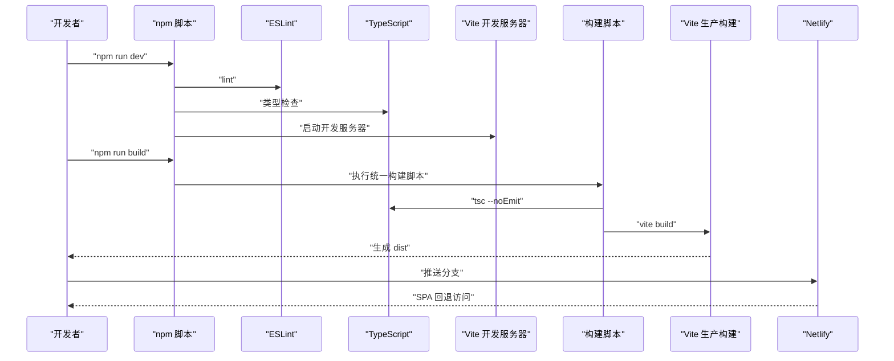

# 开发工具与测试

<cite>
**本文引用的文件**
- [package.json](file://package.json)
- [eslint.config.js](file://eslint.config.js)
- [vite.config.ts](file://vite.config.ts)
- [tsconfig.json](file://tsconfig.json)
- [tsconfig.app.json](file://tsconfig.app.json)
- [tsconfig.node.json](file://tsconfig.node.json)
- [netlify.toml](file://netlify.toml)
- [tailwind.config.js](file://tailwind.config.js)
- [postcss.config.js](file://postcss.config.js)
- [scripts/build.js](file://scripts/build.js)
- [scripts/audit.js](file://scripts/audit.js)
- [src/App.tsx](file://src/App.tsx)
- [src/main.tsx](file://src/main.tsx)
- [CODE_STANDARDS.md](file://CODE_STANDARDS.md)
</cite>

## 目录
1. [简介](#简介)
2. [项目结构](#项目结构)
3. [核心组件](#核心组件)
4. [架构总览](#架构总览)
5. [详细组件分析](#详细组件分析)
6. [依赖分析](#依赖分析)
7. [性能考虑](#性能考虑)
8. [故障排查指南](#故障排查指南)
9. [结论](#结论)
10. [附录](#附录)

## 简介
本文件系统化梳理星耀平台的开发工具与测试体系，覆盖 ESLint 配置、TypeScript 检查、开发服务器与构建脚本、部署与自动化部署机制、代码质量检查、性能监控与错误处理、开发环境优化与调试策略、测试策略、开发工作流程、代码规范与最佳实践，并给出开发效率提升工具推荐与使用指南，帮助团队通过完善的开发工具链提升协作效率与项目质量。

## 项目结构
项目采用 Vite + React + TypeScript 技术栈，配合 TailwindCSS 与 PostCSS 实现样式管线；通过多配置文件实现应用与 Node 工具链的类型隔离；构建脚本提供统一的类型检查与打包流程；Netlify 配置用于静态站点部署与 SPA 回退。

图表来源
- [package.json:1-86](file://package.json#L1-L86)
- [vite.config.ts:1-14](file://vite.config.ts#L1-L14)
- [tsconfig.json:1-8](file://tsconfig.json#L1-L8)
- [tsconfig.app.json:1-27](file://tsconfig.app.json#L1-L27)
- [tsconfig.node.json:1-25](file://tsconfig.node.json#L1-L25)
- [eslint.config.js:1-24](file://eslint.config.js#L1-L24)
- [tailwind.config.js:1-52](file://tailwind.config.js#L1-L52)
- [postcss.config.js:1-7](file://postcss.config.js#L1-L7)
- [scripts/build.js:1-96](file://scripts/build.js#L1-L96)
- [scripts/audit.js:1-360](file://scripts/audit.js#L1-L360)
- [netlify.toml:1-13](file://netlify.toml#L1-L13)
- [src/main.tsx:1-19](file://src/main.tsx#L1-L19)
- [src/App.tsx:1-214](file://src/App.tsx#L1-L214)

章节来源
- [package.json:1-86](file://package.json#L1-L86)
- [vite.config.ts:1-14](file://vite.config.ts#L1-L14)
- [tsconfig.json:1-8](file://tsconfig.json#L1-L8)
- [tsconfig.app.json:1-27](file://tsconfig.app.json#L1-L27)
- [tsconfig.node.json:1-25](file://tsconfig.node.json#L1-L25)
- [eslint.config.js:1-24](file://eslint.config.js#L1-L24)
- [tailwind.config.js:1-52](file://tailwind.config.js#L1-L52)
- [postcss.config.js:1-7](file://postcss.config.js#L1-L7)
- [scripts/build.js:1-96](file://scripts/build.js#L1-L96)
- [scripts/audit.js:1-360](file://scripts/audit.js#L1-L360)
- [netlify.toml:1-13](file://netlify.toml#L1-L13)
- [src/main.tsx:1-19](file://src/main.tsx#L1-L19)
- [src/App.tsx:1-214](file://src/App.tsx#L1-L214)

## 核心组件
- 开发服务器与别名：基于 Vite，启用 React 插件与路径别名，设置应用基础路径，便于多级子路径部署。
- ESLint 平台：统一推荐规则、TS/TSX 支持、React Hooks 与 React Refresh 规则，限定浏览器全局变量。
- TypeScript 编译：应用与 Node 工具链分别配置，确保严格性与 bundler 模式兼容。
- 样式管线：TailwindCSS + PostCSS（Autoprefixer），按需扫描内容，支持暗色模式与动画插件。
- 统一构建脚本：清理 dist、执行 TypeScript 类型检查、运行 Vite 生产构建，并输出产物大小摘要。
- 项目审计脚本：覆盖中文引号、内嵌引号、组件结构、数据导入来源、路由一致性、文档交接区完整性、Git 工作区状态等检查。
- 部署配置：Netlify 静态发布与 SPA 回退，指定 Node 版本。

章节来源
- [vite.config.ts:1-14](file://vite.config.ts#L1-L14)
- [eslint.config.js:1-24](file://eslint.config.js#L1-L24)
- [tsconfig.app.json:1-27](file://tsconfig.app.json#L1-L27)
- [tsconfig.node.json:1-25](file://tsconfig.node.json#L1-L25)
- [tailwind.config.js:1-52](file://tailwind.config.js#L1-L52)
- [postcss.config.js:1-7](file://postcss.config.js#L1-L7)
- [scripts/build.js:1-96](file://scripts/build.js#L1-L96)
- [scripts/audit.js:1-360](file://scripts/audit.js#L1-L360)
- [netlify.toml:1-13](file://netlify.toml#L1-L13)

## 架构总览
下图展示从开发到部署的关键流程：本地开发（Vite HMR）、代码质量（ESLint/审计）、类型安全（TypeScript）、构建（Vite + 构建脚本）、发布（Netlify SPA 回退）。

图表来源
- [package.json:6-12](file://package.json#L6-L12)
- [eslint.config.js:8-23](file://eslint.config.js#L8-L23)
- [tsconfig.app.json:2-26](file://tsconfig.app.json#L2-L26)
- [tsconfig.node.json:2-24](file://tsconfig.node.json#L2-L24)
- [vite.config.ts:5-13](file://vite.config.ts#L5-L13)
- [scripts/build.js:58-95](file://scripts/build.js#L58-L95)
- [netlify.toml:1-13](file://netlify.toml#L1-L13)

## 详细组件分析

### ESLint 配置与使用
- 配置要点
  - 忽略 dist 目录，避免对构建产物进行检查。
  - 对 TS/TSX 文件启用推荐规则集，包含 JS 推荐、TS ESLint 推荐、React Hooks 推荐、React Refresh Vite 适配。
  - 设置 ECMAScript 版本为 2020，浏览器全局变量。
- 使用方式
  - 通过 npm 脚本执行 lint，可在 CI 或本地提交前运行，保证风格与潜在问题统一。

章节来源
- [eslint.config.js:8-23](file://eslint.config.js#L8-L23)
- [package.json:10](file://package.json#L10)

### TypeScript 检查与编译
- 配置要点
  - 应用侧：目标 ES2023，启用 DOM/Iterable，模块解析 bundler，JSX 使用 react-jsx，路径别名 @/* 指向 src。
  - Node 侧：目标 ES2023，模块解析 bundler，开启未使用局部变量/参数检查，禁用 emit。
- 类型检查流程
  - 统一构建脚本先执行 tsc --noEmit，确保类型安全后再进行生产构建，避免产出含类型错误。

章节来源
- [tsconfig.app.json:2-26](file://tsconfig.app.json#L2-L26)
- [tsconfig.node.json:2-24](file://tsconfig.node.json#L2-L24)
- [scripts/build.js:68-75](file://scripts/build.js#L68-L75)

### 开发服务器设置（Vite）
- 功能
  - 启用 React 插件，自动热更新。
  - 设置路径别名 @ 指向 src，提升导入可读性。
  - 设置 base 为 /stellar-glory，适配子路径部署。
- 本地开发
  - 通过 npm run dev 启动，结合 ESLint 与类型检查，保障开发体验与质量。

章节来源
- [vite.config.ts:5-13](file://vite.config.ts#L5-L13)
- [package.json:7](file://package.json#L7)

### 构建脚本实现原理
- 流程
  - 清理 dist。
  - TypeScript 类型检查（tsc --noEmit）。
  - Vite 生产构建。
  - 统计 dist 大小并输出摘要。
- 错误处理
  - 任一步骤失败即终止并返回非零退出码，便于 CI/CD 捕获。
- 与脚本的关系
  - package.json 中的 build 脚本委托给 scripts/build.js，便于扩展与维护。

图表来源
- [scripts/build.js:58-95](file://scripts/build.js#L58-L95)

章节来源
- [scripts/build.js:1-96](file://scripts/build.js#L1-L96)
- [package.json:8](file://package.json#L8)

### 部署流程与自动化部署机制
- Netlify 配置
  - 构建命令：npm run build。
  - 发布目录：dist。
  - Node 版本：18。
  - SPA 回退：所有路由回退到 index.html，支持前端路由。
- 自动化部署
  - 构建脚本提示“推送至 main 分支后由 GitHub Actions 自动部署”，结合仓库 CI/CD 可实现自动化发布。

章节来源
- [netlify.toml:1-13](file://netlify.toml#L1-L13)
- [scripts/build.js:91](file://scripts/build.js#L91)

### 代码质量检查与审计
- 审计范围
  - 中文引号检测、双引号内嵌引号检测、组件结构检查（顶层 return 数量）、数据导入来源校验、占位组件有效性、思维方法内容同步、路由与导航一致性、docs 交接区完整性、Git 工作区状态。
- 执行方式
  - 通过 npm run audit 执行 scripts/audit.js，失败时输出问题总数并退出非零码，确保部署前质量门禁。

章节来源
- [scripts/audit.js:28-44](file://scripts/audit.js#L28-L44)
- [scripts/audit.js:351-359](file://scripts/audit.js#L351-L359)
- [package.json:12](file://package.json#L12)

### 性能监控与错误处理机制
- 性能相关
  - 路由懒加载：题库、高考/强基、竞赛等页面采用 lazy()，减少首屏包体。
  - 静态导入：稳定页面与工具页面使用静态导入，降低网络开销。
  - Suspense：统一加载占位，改善用户体验。
- 错误处理
  - 组件层面：占位页 ComingSoon 提示模块建设中。
  - 构建阶段：类型检查失败直接中断，避免产出含类型错误。
  - 审计阶段：工作区状态检查过滤“本次有意更改”的文件，避免误报。

章节来源
- [src/App.tsx:7-50](file://src/App.tsx#L7-L50)
- [src/App.tsx:52-67](file://src/App.tsx#L52-L67)
- [src/App.tsx:69-211](file://src/App.tsx#L69-L211)
- [CODE_STANDARDS.md:80-117](file://CODE_STANDARDS.md#L80-L117)

### 开发环境配置优化与调试工具
- 路径别名与类型感知
  - Vite 别名 @ -> src，TypeScript 路径映射一致，提升导入体验与 IDE 类型提示。
- 样式与主题
  - TailwindCSS 按需扫描，支持暗色模式与动画插件；PostCSS 自动前缀，提升兼容性。
- 调试建议
  - 本地开发使用 Vite HMR，结合 ESLint 与类型检查即时反馈。
  - 构建前运行审计脚本，确保质量门禁通过。

章节来源
- [vite.config.ts:8-12](file://vite.config.ts#L8-L12)
- [tsconfig.app.json:21-23](file://tsconfig.app.json#L21-L23)
- [tailwind.config.js:6-9](file://tailwind.config.js#L6-L9)
- [tailwind.config.js:5](file://tailwind.config.js#L5)
- [postcss.config.js:1-7](file://postcss.config.js#L1-L7)

### 测试策略
- 单元/集成测试建议
  - 针对数据层（题库、模型、策略）建立快照或结构化断言，确保数据接口稳定性。
  - 针对路由与导航一致性，可编写端到端测试验证 SPA 回退与链接可达性。
- 文档与数据同步
  - 将 docs 与数据源同步纳入测试矩阵，防止内容脱节。
- 质量门禁
  - 在 CI 中串联 lint、audit、类型检查与构建，确保每次变更均通过质量门禁。

章节来源
- [scripts/audit.js:223-253](file://scripts/audit.js#L223-L253)
- [netlify.toml:8-12](file://netlify.toml#L8-L12)

### 开发工作流程、代码规范与最佳实践
- 工作流程
  - 本地开发：npm run dev；修改后运行 npm run lint 与 npm run audit；通过后再构建与预览。
  - 构建与预览：npm run build 与 npm run preview；确认无误后推送分支触发自动化部署。
- 代码规范
  - 组件导出单一页面组件；路由懒加载策略明确；静态导入优先于动态导入；填空/计算题答案标准化比对。
  - Supabase 客户端空值保护与初始化时机规范。
- 最佳实践
  - 避免在顶层静态导入大型数据文件；避免在模块初始化时调用未保护的 Supabase 方法；生产构建禁用额外调试输出。

章节来源
- [CODE_STANDARDS.md:8-36](file://CODE_STANDARDS.md#L8-L36)
- [CODE_STANDARDS.md:66-76](file://CODE_STANDARDS.md#L66-L76)
- [CODE_STANDARDS.md:80-117](file://CODE_STANDARDS.md#L80-L117)
- [CODE_STANDARDS.md:156-171](file://CODE_STANDARDS.md#L156-L171)
- [CODE_STANDARDS.md:175-205](file://CODE_STANDARDS.md#L175-L205)
- [CODE_STANDARDS.md:206-212](file://CODE_STANDARDS.md#L206-L212)

### 开发效率提升工具推荐与使用指南
- 编辑器与插件
  - VS Code：安装 ESLint、Tailwind CSS IntelliSense、TypeScript TSServer 插件，启用保存自动格式化与错误提示。
- 命令行工具
  - 使用 npm run lint 与 npm run audit 作为 pre-commit 钩子，确保每次提交前通过质量门禁。
- 构建与预览
  - 使用 npm run preview 在本地模拟生产环境，提前发现打包与路由问题。

章节来源
- [package.json:6-12](file://package.json#L6-L12)

## 依赖分析
- 组件耦合
  - 构建脚本与 Vite/TypeScript 紧密耦合，确保类型安全优先。
  - 审计脚本与 src/docs 结构耦合，保障内容与数据一致性。
- 外部依赖
  - Vite、React、TailwindCSS、ESLint 生态为核心，保证开发体验与样式一致性。
- 潜在风险
  - Node 侧与应用侧配置分离，需保持 tsconfig.*.json 的一致性，避免类型检查遗漏。

图表来源
- [package.json:1-86](file://package.json#L1-L86)
- [tsconfig.json:1-8](file://tsconfig.json#L1-L8)
- [tsconfig.app.json:1-27](file://tsconfig.app.json#L1-L27)
- [tsconfig.node.json:1-25](file://tsconfig.node.json#L1-L25)
- [vite.config.ts:1-14](file://vite.config.ts#L1-L14)
- [eslint.config.js:1-24](file://eslint.config.js#L1-L24)
- [tailwind.config.js:1-52](file://tailwind.config.js#L1-L52)
- [postcss.config.js:1-7](file://postcss.config.js#L1-L7)
- [scripts/build.js:1-96](file://scripts/build.js#L1-L96)
- [scripts/audit.js:1-360](file://scripts/audit.js#L1-L360)
- [netlify.toml:1-13](file://netlify.toml#L1-L13)
- [src/main.tsx:1-19](file://src/main.tsx#L1-L19)
- [src/App.tsx:1-214](file://src/App.tsx#L1-L214)

章节来源
- [package.json:1-86](file://package.json#L1-L86)
- [tsconfig.json:1-8](file://tsconfig.json#L1-L8)
- [tsconfig.app.json:1-27](file://tsconfig.app.json#L1-L27)
- [tsconfig.node.json:1-25](file://tsconfig.node.json#L1-L25)
- [vite.config.ts:1-14](file://vite.config.ts#L1-L14)
- [eslint.config.js:1-24](file://eslint.config.js#L1-L24)
- [tailwind.config.js:1-52](file://tailwind.config.js#L1-L52)
- [postcss.config.js:1-7](file://postcss.config.js#L1-L7)
- [scripts/build.js:1-96](file://scripts/build.js#L1-L96)
- [scripts/audit.js:1-360](file://scripts/audit.js#L1-L360)
- [netlify.toml:1-13](file://netlify.toml#L1-L13)
- [src/main.tsx:1-19](file://src/main.tsx#L1-L19)
- [src/App.tsx:1-214](file://src/App.tsx#L1-L214)

## 性能考虑
- 路由懒加载与代码分割
  - 题库、高考/强基、竞赛等页面使用 lazy()，减少首屏体积；静态导入稳定页面与工具页面，降低网络请求。
- 构建与产物分析
  - 构建脚本统计 dist 大小，便于持续关注体积变化；生产构建关闭 emit，避免重复编译。
- 样式与资源
  - Tailwind 按需扫描，避免无用样式；字体与 KaTeX 资源按需加载，减少初始传输。

章节来源
- [src/App.tsx:7-50](file://src/App.tsx#L7-L50)
- [scripts/build.js:84-95](file://scripts/build.js#L84-L95)
- [tailwind.config.js:6-9](file://tailwind.config.js#L6-L9)

## 故障排查指南
- 构建失败
  - 检查 TypeScript 类型错误；确认 tsc --noEmit 通过；查看构建日志定位具体文件。
- 审计失败
  - 关注审计脚本输出的问题列表，逐项修复；对于 Git 工作区检查，排除“本次有意更改”的文件。
- 路由与导航不一致
  - 对照 App.tsx 中的 path 与 Navigation.tsx 中的 href，确保一一对应；检查通配路由匹配逻辑。
- Netlify 部署异常
  - 确认 Node 版本与构建命令；检查 dist 是否存在；验证 SPA 回退规则是否生效。

章节来源
- [scripts/build.js:68-82](file://scripts/build.js#L68-L82)
- [scripts/audit.js:320-347](file://scripts/audit.js#L320-L347)
- [src/App.tsx:256-277](file://src/App.tsx#L256-L277)
- [netlify.toml:1-13](file://netlify.toml#L1-L13)

## 结论
通过统一的 ESLint 配置、严格的 TypeScript 类型检查、Vite 开发服务器与 TailwindCSS 样式管线、可扩展的统一构建脚本与 Netlify 部署配置，以及完善的项目审计与质量门禁，星耀平台建立了高效、可维护且可扩展的开发工具链。配合明确的开发工作流程、代码规范与最佳实践，能够显著提升团队协作效率与项目质量。

## 附录
- 关键流程时序：从本地开发到部署的端到端序列

图表来源
- [package.json:6-12](file://package.json#L6-L12)
- [scripts/build.js:68-82](file://scripts/build.js#L68-L82)
- [netlify.toml:1-13](file://netlify.toml#L1-L13)