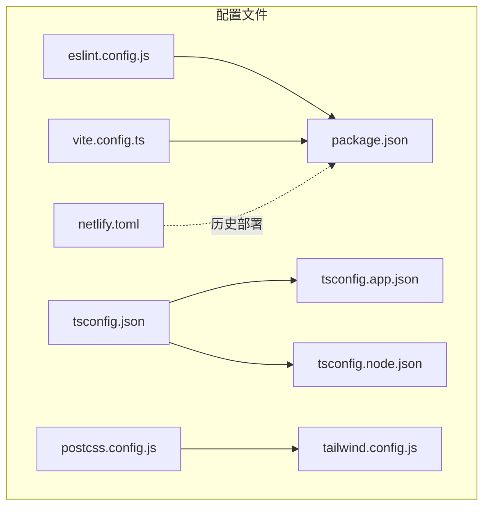
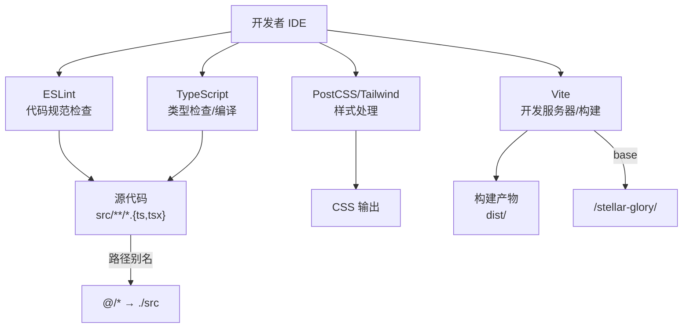
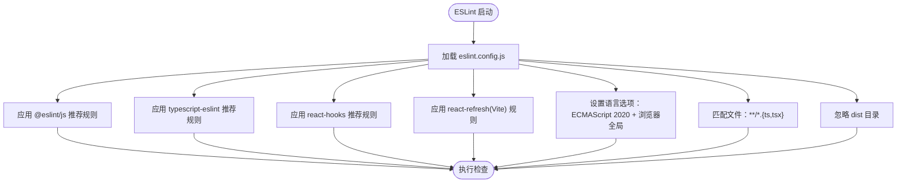
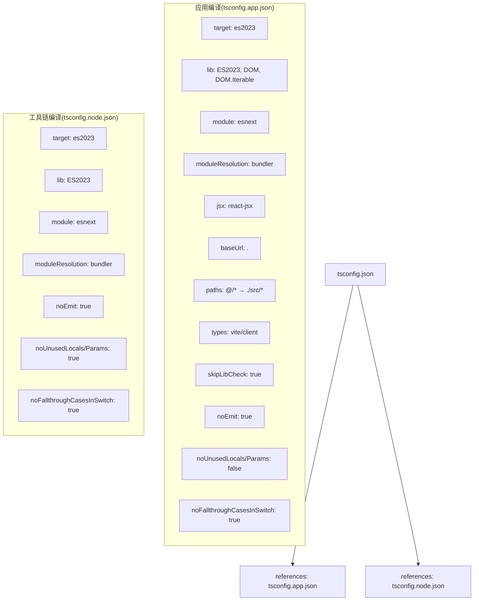
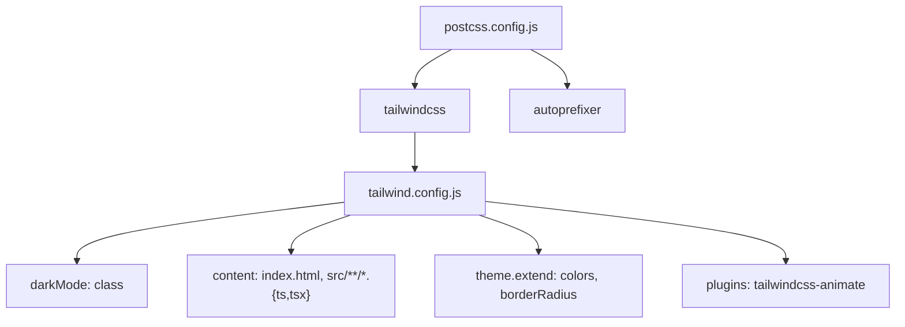
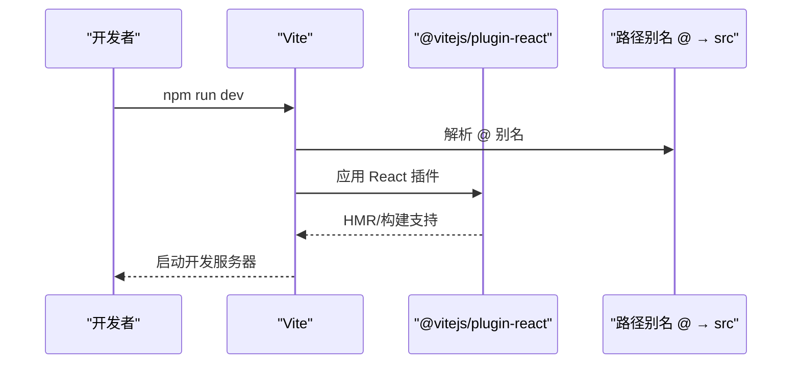
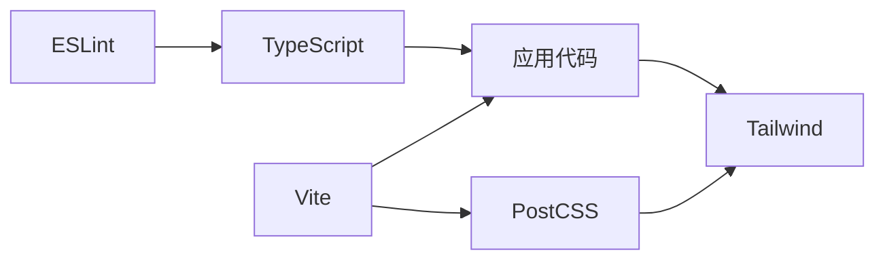

# 开发环境配置

<cite>
**本文档引用的文件**
- [eslint.config.js](file://eslint.config.js)
- [tsconfig.json](file://tsconfig.json)
- [tsconfig.app.json](file://tsconfig.app.json)
- [tsconfig.node.json](file://tsconfig.node.json)
- [postcss.config.js](file://postcss.config.js)
- [tailwind.config.js](file://tailwind.config.js)
- [vite.config.ts](file://vite.config.ts)
- [package.json](file://package.json)
- [CODE_STANDARDS.md](file://CODE_STANDARDS.md)
- [ARCHITECTURE.md](file://ARCHITECTURE.md)
- [SPEC.md](file://SPEC.md)
- [netlify.toml](file://netlify.toml)
</cite>

## 目录
1. [简介](#简介)
2. [项目结构](#项目结构)
3. [核心组件](#核心组件)
4. [架构总览](#架构总览)
5. [详细组件分析](#详细组件分析)
6. [依赖分析](#依赖分析)
7. [性能考虑](#性能考虑)
8. [故障排查指南](#故障排查指南)
9. [结论](#结论)
10. [附录](#附录)

## 简介
本文件系统化梳理星耀平台的开发环境配置，重点覆盖以下方面：
- ESLint 配置详解：规则集、插件集成与代码规范检查机制
- TypeScript 配置：编译选项、路径映射、类型检查策略
- PostCSS 与 Tailwind：样式处理流程与主题扩展
- 全局配置文件组织与继承关系
- 开发环境初始化、IDE 推荐与调试工具设置
- 常见问题与性能优化建议
- 如何通过合理配置提升开发效率与代码质量

## 项目结构
星耀平台采用 React 19 + Vite 5 + TypeScript 技术栈，结合 Tailwind CSS 实现样式体系，并通过多份 tsconfig 文件实现应用与 Node 工具链的分离编译。关键配置文件分布如下：
- ESLint：eslint.config.js（Flat Config）
- TypeScript：tsconfig.json（聚合）、tsconfig.app.json（应用）、tsconfig.node.json（工具链）
- 样式：postcss.config.js、tailwind.config.js
- 构建：vite.config.ts、package.json 脚本
- 部署：netlify.toml（历史配置）

**图表来源**
- [eslint.config.js:1-24](file://eslint.config.js#L1-L24)
- [tsconfig.json:1-8](file://tsconfig.json#L1-L8)
- [tsconfig.app.json:1-27](file://tsconfig.app.json#L1-L27)
- [tsconfig.node.json:1-25](file://tsconfig.node.json#L1-L25)
- [postcss.config.js:1-7](file://postcss.config.js#L1-L7)
- [tailwind.config.js:1-52](file://tailwind.config.js#L1-L52)
- [vite.config.ts:1-14](file://vite.config.ts#L1-L14)
- [package.json:1-86](file://package.json#L1-L86)
- [netlify.toml:1-13](file://netlify.toml#L1-L13)

**章节来源**
- [eslint.config.js:1-24](file://eslint.config.js#L1-L24)
- [tsconfig.json:1-8](file://tsconfig.json#L1-L8)
- [tsconfig.app.json:1-27](file://tsconfig.app.json#L1-L27)
- [tsconfig.node.json:1-25](file://tsconfig.node.json#L1-L25)
- [postcss.config.js:1-7](file://postcss.config.js#L1-L7)
- [tailwind.config.js:1-52](file://tailwind.config.js#L1-L52)
- [vite.config.ts:1-14](file://vite.config.ts#L1-L14)
- [package.json:1-86](file://package.json#L1-L86)
- [netlify.toml:1-13](file://netlify.toml#L1-L13)

## 核心组件
本节聚焦四大核心配置域：ESLint、TypeScript、PostCSS/Tailwind、Vite。

- ESLint（Flat Config）
  - 使用 @eslint/js、typescript-eslint、eslint-plugin-react-hooks、eslint-plugin-react-refresh
  - 针对 ts/tsx 文件启用推荐规则集与 Vite 专用刷新规则
  - 全局忽略 dist 目录
  - 语言环境：ECMAScript 2020，浏览器全局

- TypeScript（多配置文件）
  - tsconfig.json 作为聚合入口，引用 app 与 node 两套配置
  - tsconfig.app.json：应用侧编译目标 ES2023，模块解析 bundler，路径别名 @/* → ./src/*
  - tsconfig.node.json：工具链侧（如 vite.config.ts）编译目标 ES2023，严格未使用检查与开关规则

- PostCSS/Tailwind
  - postcss.config.js 启用 tailwindcss 与 autoprefixer
  - tailwind.config.js 配置暗色模式、内容扫描范围、主题扩展与插件

- Vite
  - 基座路径 base 设置为 /stellar-glory/
  - 路径别名 @ 指向 src
  - 插件：@vitejs/plugin-react

**章节来源**
- [eslint.config.js:8-23](file://eslint.config.js#L8-L23)
- [tsconfig.json:3-6](file://tsconfig.json#L3-L6)
- [tsconfig.app.json:2-26](file://tsconfig.app.json#L2-L26)
- [tsconfig.node.json:2-24](file://tsconfig.node.json#L2-L24)
- [postcss.config.js:1-7](file://postcss.config.js#L1-L7)
- [tailwind.config.js:4-51](file://tailwind.config.js#L4-L51)
- [vite.config.ts:5-13](file://vite.config.ts#L5-L13)

## 架构总览
下图展示开发环境配置在整体技术栈中的位置与交互：

**图表来源**
- [eslint.config.js:10-22](file://eslint.config.js#L10-L22)
- [tsconfig.app.json:21-23](file://tsconfig.app.json#L21-L23)
- [vite.config.ts:8-12](file://vite.config.ts#L8-L12)
- [postcss.config.js:2-5](file://postcss.config.js#L2-L5)
- [tailwind.config.js:6-9](file://tailwind.config.js#L6-L9)

## 详细组件分析

### ESLint 配置详解
- 规则集
  - @eslint/js.recommended：基础 JS 推荐规则
  - typescript-eslint.recommended：TS 推荐规则
  - react-hooks：React Hooks 推荐规则
  - react-refresh（vite）：Vite 环境下的 React Refresh 规则
- 语言选项
  - ecmaVersion：2020
  - globals：browser
- 文件范围
  - 仅对 **/*.{ts,tsx} 应用规则
- 忽略项
  - dist 目录

**图表来源**
- [eslint.config.js:8-23](file://eslint.config.js#L8-L23)

**章节来源**
- [eslint.config.js:8-23](file://eslint.config.js#L8-L23)

### TypeScript 配置详解
- 聚合配置 tsconfig.json
  - 通过 references 引用 app 与 node 两套配置，实现分层编译
- 应用配置 tsconfig.app.json
  - 目标：ES2023，库：ES2023 + DOM + DOM.Iterable
  - 模块：esnext，模块解析：bundler，允许 TS 扩展导入
  - JSX：react-jsx，路径别名：@/* → ./src/*
  - 跳过库检查 skipLibCheck，类型：vite/client
  - 严格性：关闭未使用局部变量/参数检查，开启 switch fallthrough 检查
- 工具链配置 tsconfig.node.json
  - 目标：ES2023，库：ES2023
  - 模块：esnext，模块解析：bundler，严格未使用检查与开关规则
  - 仅包含 vite.config.ts

**图表来源**
- [tsconfig.json:3-6](file://tsconfig.json#L3-L6)
- [tsconfig.app.json:2-26](file://tsconfig.app.json#L2-L26)
- [tsconfig.node.json:2-24](file://tsconfig.node.json#L2-L24)

**章节来源**
- [tsconfig.json:3-6](file://tsconfig.json#L3-L6)
- [tsconfig.app.json:2-26](file://tsconfig.app.json#L2-L26)
- [tsconfig.node.json:2-24](file://tsconfig.node.json#L2-L24)

### PostCSS 与 Tailwind 配置
- PostCSS
  - 启用 tailwindcss 与 autoprefixer 插件
- Tailwind
  - darkMode: class
  - content：扫描 index.html 与 src/**/*.{ts,tsx}
  - 主题扩展：颜色、圆角变量
  - 插件：tailwindcss-animate

**图表来源**
- [postcss.config.js:1-7](file://postcss.config.js#L1-L7)
- [tailwind.config.js:4-51](file://tailwind.config.js#L4-L51)

**章节来源**
- [postcss.config.js:1-7](file://postcss.config.js#L1-L7)
- [tailwind.config.js:4-51](file://tailwind.config.js#L4-L51)

### Vite 配置与脚本
- 基座路径 base：/stellar-glory/
- 路径别名：@ → src
- 插件：@vitejs/plugin-react
- 脚本：
  - dev：vite
  - build：node scripts/build.js
  - build:fast：vite build
  - lint：eslint .
  - preview：vite preview
  - audit：node scripts/audit.js

**图表来源**
- [vite.config.ts:5-13](file://vite.config.ts#L5-L13)
- [package.json:6-12](file://package.json#L6-L12)

**章节来源**
- [vite.config.ts:5-13](file://vite.config.ts#L5-L13)
- [package.json:6-12](file://package.json#L6-L12)

## 依赖分析
- ESLint 与 TypeScript
  - ESLint 通过 typescript-eslint 对 TS 代码进行静态检查
  - tsconfig.app.json 的 noUnusedLocals/Params 与 ESLint 规则互补
- Vite 与 Tailwind
  - Vite 通过 @vitejs/plugin-react 提供开发体验
  - Tailwind 通过 postcss.config.js 注入，实现按需样式生成
- 路径别名与模块解析
  - tsconfig.app.json 与 vite.config.ts 的 @/* 别名保持一致，确保编辑器与编译器行为一致

**图表来源**
- [eslint.config.js:12-16](file://eslint.config.js#L12-L16)
- [tsconfig.app.json:21-23](file://tsconfig.app.json#L21-L23)
- [vite.config.ts:8-12](file://vite.config.ts#L8-L12)
- [postcss.config.js:2-5](file://postcss.config.js#L2-L5)

**章节来源**
- [eslint.config.js:12-16](file://eslint.config.js#L12-L16)
- [tsconfig.app.json:21-23](file://tsconfig.app.json#L21-L23)
- [vite.config.ts:8-12](file://vite.config.ts#L8-L12)
- [postcss.config.js:2-5](file://postcss.config.js#L2-L5)

## 性能考虑
- 构建与检查
  - 使用 fast build 脚本（vite build）进行快速构建
  - 通过 lint 脚本在提交前进行静态检查，减少运行时错误
- 编译与模块解析
  - tsconfig.app.json 使用 bundler 模式，提升模块解析性能
  - 路径别名减少深层路径拼写开销
- 样式处理
  - Tailwind content 扫描范围限定在 src/**/*.{ts,tsx} 与 index.html，避免不必要的样式扫描
- 开发体验
  - Vite HMR 与 React 插件配合，缩短热更新时间

[本节为通用性能建议，不直接分析具体文件]

## 故障排查指南
- ESLint 报错
  - 确认文件扩展名与匹配规则（**/*.{ts,tsx}）
  - 检查是否遗漏必要的插件（react-hooks、react-refresh）
  - 若需临时忽略，可在 eslint.config.js 中调整 ignore 配置
- TypeScript 类型错误
  - 检查 tsconfig.app.json 的 baseUrl 与 paths 是否与 Vite 别名一致
  - 确认 noUnusedLocals/Params 与实际代码是否冲突
- 样式未生效
  - 确认 tailwind.config.js 的 content 范围是否包含目标文件
  - 检查 postcss.config.js 是否正确启用 tailwindcss 与 autoprefixer
- Vite 路径别名无效
  - 确认 vite.config.ts 的 alias 与 tsconfig.app.json 的 paths 保持一致
- 构建产物路径异常
  - 检查 vite.config.ts 的 base 设置是否符合部署路径（/stellar-glory/）

**章节来源**
- [eslint.config.js:8-23](file://eslint.config.js#L8-L23)
- [tsconfig.app.json:21-23](file://tsconfig.app.json#L21-L23)
- [tailwind.config.js:6-9](file://tailwind.config.js#L6-L9)
- [postcss.config.js:2-5](file://postcss.config.js#L2-L5)
- [vite.config.ts:8-12](file://vite.config.ts#L8-L12)

## 结论
通过将 ESLint、TypeScript、PostCSS/Tailwind 与 Vite 的配置进行系统化梳理与协同，星耀平台实现了：
- 统一的代码规范与类型约束
- 高效的样式处理与主题扩展
- 一致的路径别名与模块解析
- 可维护的开发与构建流程

建议在团队协作中持续遵循 CODE_STANDARDS.md 与 ARCHITECTURE.md 的约定，以保证代码质量与可扩展性。

[本节为总结性内容，不直接分析具体文件]

## 附录

### 开发环境初始化步骤
- 安装依赖
  - 使用包管理器安装依赖（基于 package.json 的 scripts）
- 启动开发
  - npm run dev 启动 Vite 开发服务器
- 代码检查
  - npm run lint 执行 ESLint 检查
- 构建产物
  - npm run build 使用脚本构建
  - npm run build:fast 使用 Vite 快速构建
- 预览
  - npm run preview 本地预览构建结果
- 审计
  - npm run audit 执行审计脚本

**章节来源**
- [package.json:6-12](file://package.json#L6-L12)

### IDE 配置推荐
- VS Code
  - 安装 ESLint、Tailwind CSS IntelliSense、TypeScript TSServer
  - 确保编辑器使用工作区内的 TypeScript 版本（~6.0.2）
  - 启用 ESLint 自动修复与保存时检查
- 路径别名
  - 确保编辑器识别 tsconfig.app.json 与 vite.config.ts 的 @/* 别名
- 样式智能感知
  - 启用 Tailwind CSS IntelliSense，确保 content 范围正确

[本节为通用建议，不直接分析具体文件]

### 调试工具设置
- 浏览器 DevTools
  - 使用 React Developer Tools 检查组件树与状态
- Vite HMR
  - 修改代码后观察热更新效果
- ESLint 与 TypeScript
  - 在编辑器中启用实时错误提示与类型提示

[本节为通用建议，不直接分析具体文件]

### 常见配置问题与解决方案
- ESLint 未识别 TS 文件
  - 确认 eslint.config.js 的 files 匹配规则与扩展名
- Tailwind 样式未生成
  - 检查 tailwind.config.js 的 content 范围与 postcss.config.js 插件启用
- 路径别名在编辑器与编译器不一致
  - 统一 tsconfig.app.json 与 vite.config.ts 的 @/* 别名
- 构建后路由 404
  - 确认部署路径与 vite.config.ts 的 base 设置一致

**章节来源**
- [eslint.config.js:11-17](file://eslint.config.js#L11-L17)
- [tailwind.config.js:6-9](file://tailwind.config.js#L6-L9)
- [vite.config.ts:8-12](file://vite.config.ts#L8-L12)

### 性能优化建议
- 使用 fast build 脚本进行快速迭代
- 合理拆分大型数据文件，避免首屏加载阻塞
- 通过路由懒加载减少初始包体
- 保持 Tailwind content 范围最小化，避免全量扫描

**章节来源**
- [package.json:8-9](file://package.json#L8-L9)
- [ARCHITECTURE.md:29-44](file://ARCHITECTURE.md#L29-L44)
- [tailwind.config.js:6-9](file://tailwind.config.js#L6-L9)