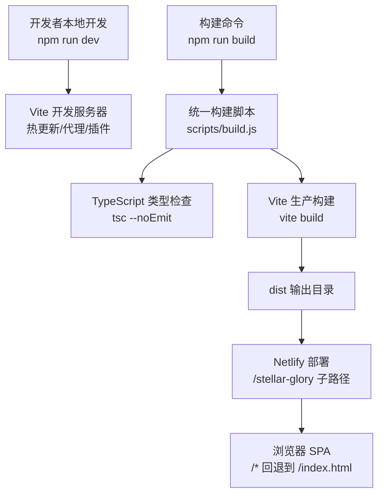
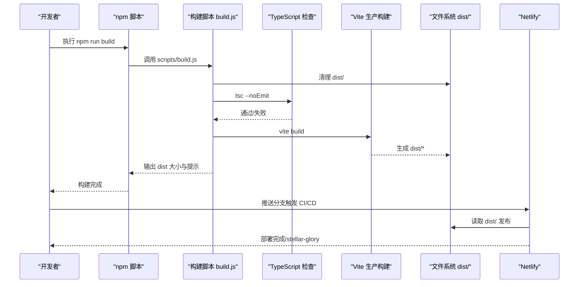
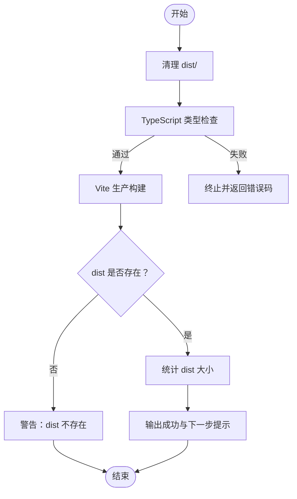
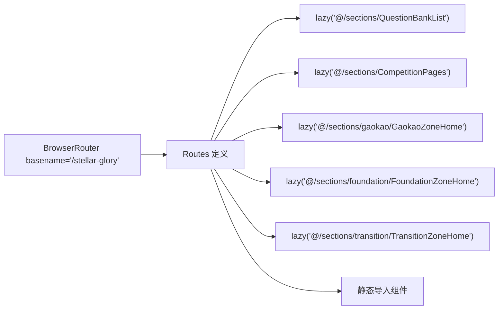
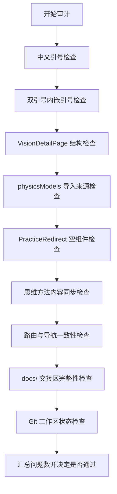
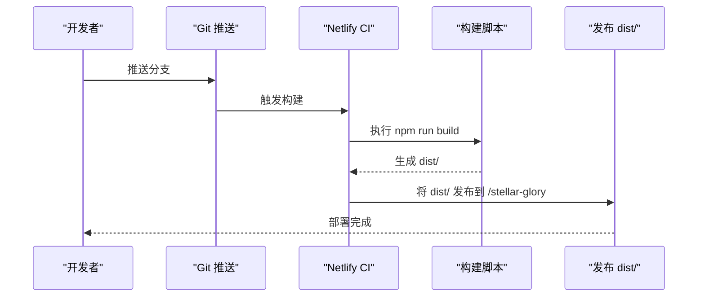
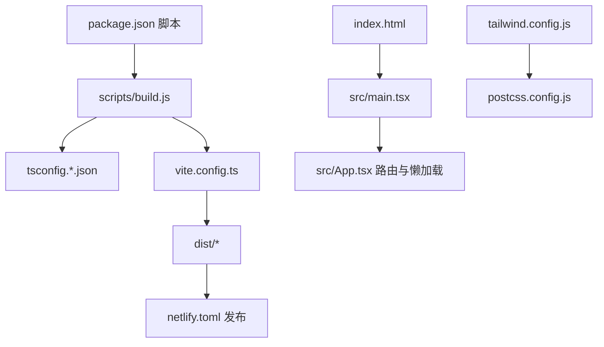

# 构建与部署系统

<cite>
**本文引用的文件**
- [package.json](file://package.json)
- [vite.config.ts](file://vite.config.ts)
- [netlify.toml](file://netlify.toml)
- [scripts/build.js](file://scripts/build.js)
- [scripts/audit.js](file://scripts/audit.js)
- [tsconfig.json](file://tsconfig.json)
- [tsconfig.app.json](file://tsconfig.app.json)
- [tsconfig.node.json](file://tsconfig.node.json)
- [postcss.config.js](file://postcss.config.js)
- [tailwind.config.js](file://tailwind.config.js)
- [index.html](file://index.html)
- [src/App.tsx](file://src/App.tsx)
- [src/main.tsx](file://src/main.tsx)
- [ARCHITECTURE.md](file://ARCHITECTURE.md)
</cite>

## 目录
1. [简介](#简介)
2. [项目结构](#项目结构)
3. [核心组件](#核心组件)
4. [架构总览](#架构总览)
5. [详细组件分析](#详细组件分析)
6. [依赖分析](#依赖分析)
7. [性能考虑](#性能考虑)
8. [故障排除指南](#故障排除指南)
9. [结论](#结论)
10. [附录](#附录)

## 简介
本文件系统化梳理星耀平台的构建与部署体系，覆盖 Vite 开发服务器与生产构建配置、资源处理策略、构建脚本实现原理（打包流程、代码分割与资源优化）、自动化部署（Netlify 部署与 SPA 回退）、审计脚本功能与使用方法、构建性能优化与缓存策略、版本管理与回滚机制，以及通过完善构建部署系统确保项目稳定发布的最佳实践。

## 项目结构
本项目采用前端单页应用（SPA）架构，基于 Vite 5 + React 19 + TypeScript，使用 Tailwind CSS 作为样式基础，配合 React Router v7 实现路由与懒加载。构建产物输出至 dist 目录，部署于 Netlify 的子路径 /stellar-glory。

图表来源
- [package.json:6-12](file://package.json#L6-L12)
- [scripts/build.js:58-83](file://scripts/build.js#L58-L83)
- [vite.config.ts:5-13](file://vite.config.ts#L5-L13)
- [netlify.toml:1-13](file://netlify.toml#L1-L13)

章节来源
- [package.json:6-12](file://package.json#L6-L12)
- [vite.config.ts:5-13](file://vite.config.ts#L5-L13)
- [netlify.toml:1-13](file://netlify.toml#L1-L13)
- [ARCHITECTURE.md:9-23](file://ARCHITECTURE.md#L9-L23)

## 核心组件
- Vite 构建配置：定义 base 路径、路径别名、React 插件与解析规则。
- 统一构建脚本：执行清理、类型检查、生产构建，并统计 dist 大小。
- 审计脚本：对代码风格、结构、路由一致性、内容同步与 Git 工作区状态进行检查。
- 部署配置：Netlify 指定构建命令、发布目录与 SPA 回退规则。
- 样式与工具链：PostCSS + Tailwind CSS，TS 编译配置分层管理。

章节来源
- [vite.config.ts:5-13](file://vite.config.ts#L5-L13)
- [scripts/build.js:58-95](file://scripts/build.js#L58-L95)
- [scripts/audit.js:28-44](file://scripts/audit.js#L28-L44)
- [netlify.toml:1-13](file://netlify.toml#L1-L13)
- [postcss.config.js:1-7](file://postcss.config.js#L1-L7)
- [tailwind.config.js:1-52](file://tailwind.config.js#L1-L52)
- [tsconfig.json:1-8](file://tsconfig.json#L1-L8)

## 架构总览
下图展示了从开发到生产的端到端流程，以及 Netlify 的静态托管与路由回退策略：

图表来源
- [package.json:6-12](file://package.json#L6-L12)
- [scripts/build.js:58-83](file://scripts/build.js#L58-L83)
- [netlify.toml:1-13](file://netlify.toml#L1-L13)

## 详细组件分析

### Vite 构建配置
- base 路径：设置为 /stellar-glory，适配 Netlify 子路径部署。
- 路径别名：@ 指向 src，提升导入可读性。
- 插件：集成 @vitejs/plugin-react，启用 React 快速刷新与 JSX 优化。
- 解析：通过路径别名与模块解析策略，保证开发与构建一致性。

章节来源
- [vite.config.ts:5-13](file://vite.config.ts#L5-L13)

### 统一构建脚本（打包流程与资源优化）
- 步骤一：清理 dist 目录，确保构建产物纯净。
- 步骤二：TypeScript 类型检查，防止类型错误进入生产包。
- 步骤三：调用 Vite 生产构建，生成最小化与分块的静态资源。
- 产出统计：遍历 dist 目录计算大小，便于性能监控与回归对比。
- 退出策略：任一步骤失败即终止并返回非零退出码，保障质量门禁。

图表来源
- [scripts/build.js:58-95](file://scripts/build.js#L58-L95)

章节来源
- [scripts/build.js:58-95](file://scripts/build.js#L58-L95)

### 代码分割与懒加载策略
- 懒加载组件：题库、竞赛、高考/强基/衔接等路由较多的页面采用 lazy() 按需加载，降低首屏体积与启动时间。
- 共享 chunk：竞赛专区多个路由共享同一懒加载组，减少重复下载。
- 静态导入：首页与常用工具页面保持静态导入，保证首次访问体验。

图表来源
- [src/App.tsx:1-200](file://src/App.tsx#L1-L200)

章节来源
- [src/App.tsx:1-200](file://src/App.tsx#L1-L200)
- [ARCHITECTURE.md:27-84](file://ARCHITECTURE.md#L27-L84)

### 审计脚本（质量门禁与合规检查）
审计脚本执行十项检查，失败即阻断部署：
- 中文引号检测：扫描 TS/TSX 文件，禁止使用中文引号。
- 双引号内嵌引号检测：针对特定数据文件，避免 JSON/对象字符串内误嵌双引号。
- VisionDetailPage 结构校验：限制顶层 return 数量，避免复杂控制流。
- physicsModels 导入来源检查：确保从正确入口导入，避免绕过数据注册。
- PracticeRedirect 空组件检测：确认无实质功能的占位已被清理。
- 思维方法内容同步检查：校验 docs/thinks-methods 与数据文件一致性。
- 路由与导航一致性检查：校验 App 路由与导航 href 对应关系。
- docs/ 交接区完整性检查：校验关键目录与文件是否存在。
- Git 工作区状态检查：过滤允许的有意更改，识别意外提交。

图表来源
- [scripts/audit.js:28-44](file://scripts/audit.js#L28-L44)
- [scripts/audit.js:351-360](file://scripts/audit.js#L351-L360)

章节来源
- [scripts/audit.js:28-44](file://scripts/audit.js#L28-L44)
- [scripts/audit.js:351-360](file://scripts/audit.js#L351-L360)

### 自动化部署（Netlify）
- 构建命令：npm run build。
- 发布目录：dist。
- Node 版本：18。
- SPA 回退：所有路由回退到 /index.html，确保前端路由正常工作。

图表来源
- [netlify.toml:1-13](file://netlify.toml#L1-L13)
- [package.json:6-12](file://package.json#L6-L12)

章节来源
- [netlify.toml:1-13](file://netlify.toml#L1-L13)
- [package.json:6-12](file://package.json#L6-L12)

### 样式与工具链配置
- PostCSS：启用 Tailwind CSS 与 Autoprefixer，自动添加厂商前缀与按需生成样式。
- Tailwind CSS：content 覆盖 src 与模板文件，darkMode 使用 class 策略，主题变量通过 CSS 变量注入。
- TypeScript：分层配置（app/node），分别约束浏览器端与构建工具链编译行为，配合 Vite 的 bundler 模式。

章节来源
- [postcss.config.js:1-7](file://postcss.config.js#L1-L7)
- [tailwind.config.js:1-52](file://tailwind.config.js#L1-L52)
- [tsconfig.json:1-8](file://tsconfig.json#L1-L8)
- [tsconfig.app.json:1-27](file://tsconfig.app.json#L1-L27)
- [tsconfig.node.json:1-25](file://tsconfig.node.json#L1-L25)

## 依赖分析
- 构建链路：npm 脚本 -> 构建脚本 -> TypeScript -> Vite -> dist -> Netlify。
- 运行链路：index.html 引入 main.tsx -> App.tsx 路由与懒加载 -> 组件按需加载。
- 样式链路：Tailwind + PostCSS 在构建阶段生成 CSS，运行时通过 class 应用主题。

图表来源
- [package.json:6-12](file://package.json#L6-L12)
- [scripts/build.js:58-83](file://scripts/build.js#L58-L83)
- [vite.config.ts:5-13](file://vite.config.ts#L5-L13)
- [netlify.toml:1-13](file://netlify.toml#L1-L13)
- [index.html:1-14](file://index.html#L1-L14)
- [src/main.tsx:1-19](file://src/main.tsx#L1-L19)
- [src/App.tsx:1-200](file://src/App.tsx#L1-L200)
- [tailwind.config.js:1-52](file://tailwind.config.js#L1-L52)
- [postcss.config.js:1-7](file://postcss.config.js#L1-L7)

章节来源
- [package.json:6-12](file://package.json#L6-L12)
- [vite.config.ts:5-13](file://vite.config.ts#L5-L13)
- [netlify.toml:1-13](file://netlify.toml#L1-L13)
- [index.html:1-14](file://index.html#L1-L14)
- [src/main.tsx:1-19](file://src/main.tsx#L1-L19)
- [src/App.tsx:1-200](file://src/App.tsx#L1-L200)
- [tailwind.config.js:1-52](file://tailwind.config.js#L1-L52)
- [postcss.config.js:1-7](file://postcss.config.js#L1-L7)

## 性能考虑
- 代码分割与懒加载：通过 React.lazy 与路由分组，显著降低首屏 JS 体积与 TTI。
- 资源最小化：Vite 生产构建默认压缩 JS/CSS/HTML，结合 Tree-shaking 与 ES 模块解析，减少冗余。
- 路径别名与模块解析：避免深层相对路径，提升构建缓存命中率与可维护性。
- 样式按需：Tailwind content 覆盖范围明确，避免生成未使用样式。
- 构建缓存：TypeScript 与 Vite 的中间产物缓存可缩短二次构建时间（需配合 CI 缓存策略）。
- CDN 与子路径：Netlify 子路径部署与静态资源分发，结合浏览器缓存策略可进一步优化加载速度。

## 故障排除指南
- 构建失败
  - 现象：构建脚本输出失败并退出。
  - 排查：检查 TypeScript 报错、Vite 构建日志；确认 dist 生成。
  - 参考：[scripts/build.js:71-82](file://scripts/build.js#L71-L82)
- SPA 路由 404
  - 现象：刷新或直接访问二级路由返回 404。
  - 排查：确认 netlify.toml 的 redirects 配置与 basename 设置一致。
  - 参考：[netlify.toml:8-13](file://netlify.toml#L8-L13)，[src/App.tsx:78](file://src/App.tsx#L78)
- 子路径显示异常
  - 现象：资源 404 或图标丢失。
  - 排查：确认 vite.config.ts 的 base 与 netlify.toml 发布路径一致。
  - 参考：[vite.config.ts:6](file://vite.config.ts#L6)，[netlify.toml:2-3](file://netlify.toml#L2-L3)
- 首屏过大
  - 现象：首屏 JS 体积过大导致 TTI 差。
  - 排查：检查静态导入组件数量、路由懒加载覆盖率；评估图片与字体资源。
  - 参考：[ARCHITECTURE.md:27-84](file://ARCHITECTURE.md#L27-L84)
- 审计未通过
  - 现象：scripts/audit.js 返回非零退出码。
  - 排查：逐项查看问题清单，修复代码风格、结构或数据同步问题。
  - 参考：[scripts/audit.js:351-360](file://scripts/audit.js#L351-L360)

章节来源
- [scripts/build.js:71-82](file://scripts/build.js#L71-L82)
- [netlify.toml:8-13](file://netlify.toml#L8-L13)
- [vite.config.ts:6](file://vite.config.ts#L6)
- [src/App.tsx:78](file://src/App.tsx#L78)
- [ARCHITECTURE.md:27-84](file://ARCHITECTURE.md#L27-L84)
- [scripts/audit.js:351-360](file://scripts/audit.js#L351-L360)

## 结论
通过统一的构建脚本、严格的审计门禁、合理的代码分割与懒加载策略，以及 Netlify 的子路径部署与 SPA 回退机制，星耀平台实现了稳定、可复现且高性能的前端发布流水线。建议持续完善 CI 缓存、监控 dist 体积趋势、定期审查路由与导航一致性，以保障长期可维护性与用户体验。

## 附录
- 版本管理与回滚
  - 使用 Git 标签与分支策略标记发布版本；Netlify 支持基于分支的环境与回滚。
  - 回滚步骤：在 Netlify 控制台选择目标发布版本或回退到上一个稳定构建。
- 最佳实践清单
  - 保持路由与导航一致，避免遗漏。
  - 严格控制顶层 return 数量，保持函数职责单一。
  - 定期运行审计脚本，确保代码风格与数据同步。
  - 监控 dist 体积变化，及时发现回归。
  - 在 CI 中缓存 node_modules 与 Vite/TypeScript 缓存目录，缩短构建时间。