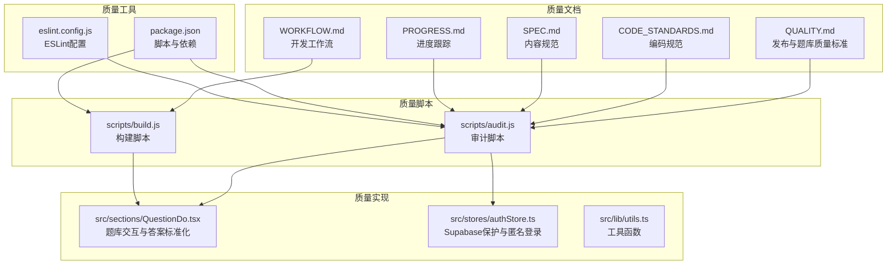
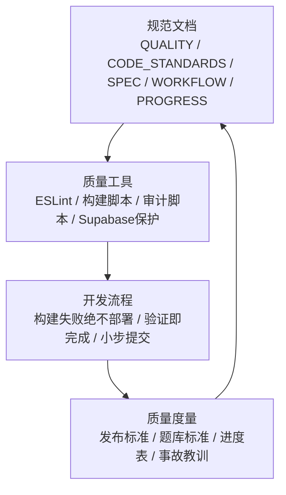
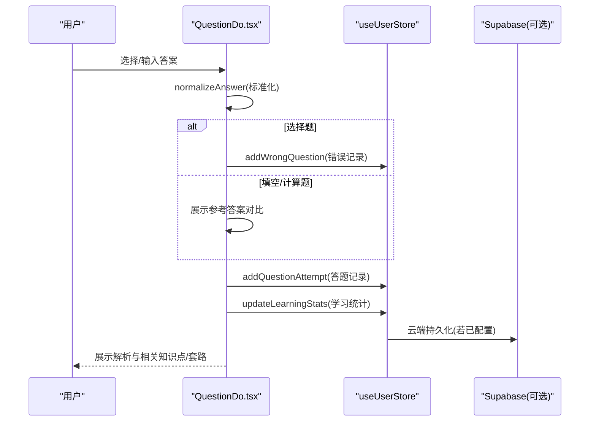
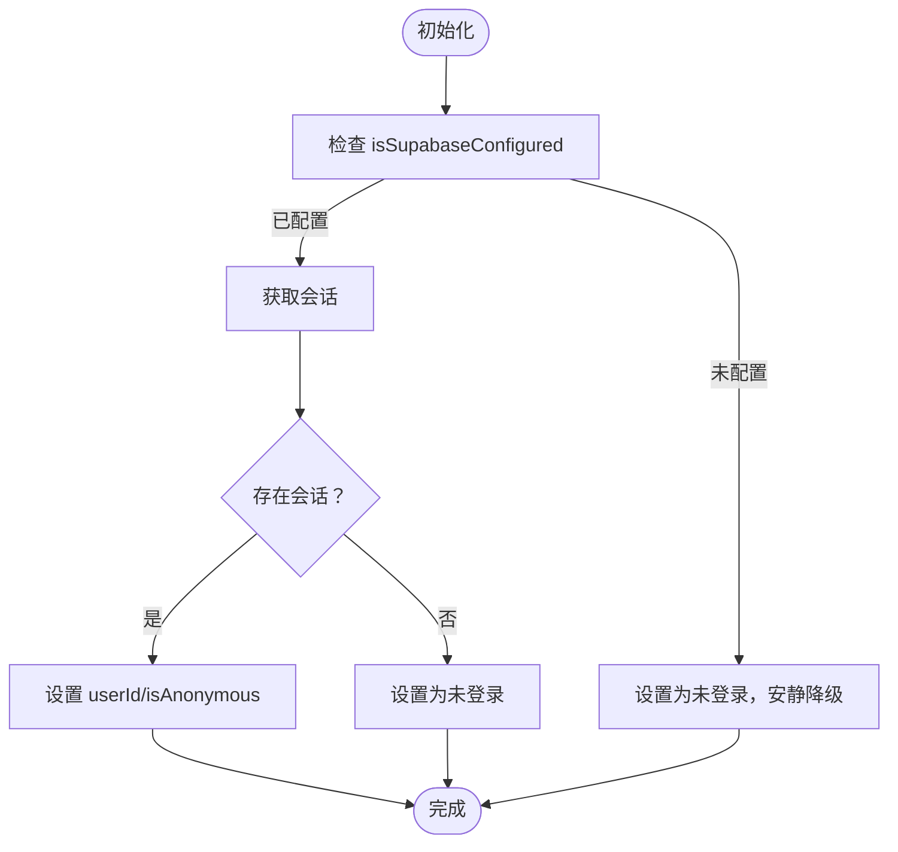
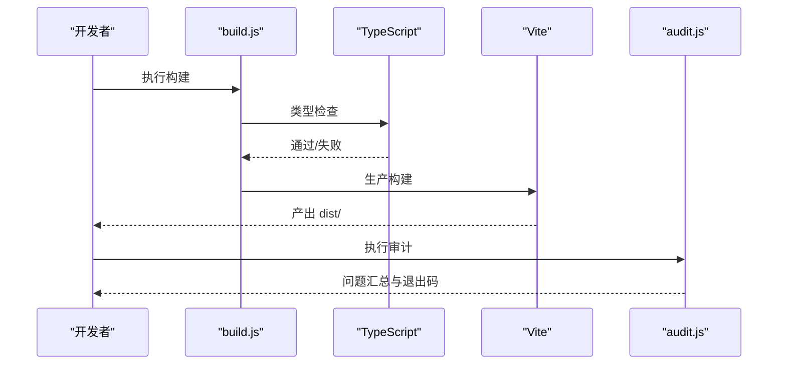
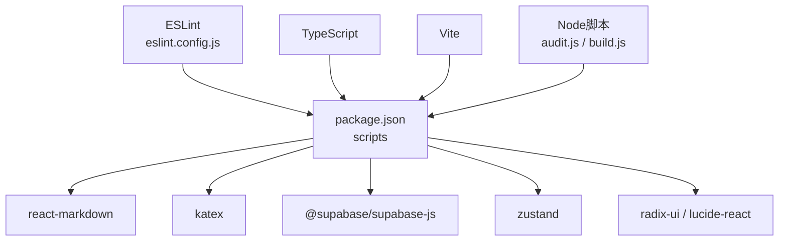

# 质量保证体系

<cite>
**本文档引用的文件**
- [QUALITY.md](file://QUALITY.md)
- [CODE_STANDARDS.md](file://CODE_STANDARDS.md)
- [WORKFLOW.md](file://WORKFLOW.md)
- [SPEC.md](file://SPEC.md)
- [PROGRESS.md](file://PROGRESS.md)
- [package.json](file://package.json)
- [eslint.config.js](file://eslint.config.js)
- [scripts/audit.js](file://scripts/audit.js)
- [scripts/build.js](file://scripts/build.js)
- [src/sections/QuestionDo.tsx](file://src/sections/QuestionDo.tsx)
- [src/stores/authStore.ts](file://src/stores/authStore.ts)
- [src/lib/utils.ts](file://src/lib/utils.ts)
</cite>

## 目录
1. [简介](#简介)
2. [项目结构](#项目结构)
3. [核心组件](#核心组件)
4. [架构总览](#架构总览)
5. [详细组件分析](#详细组件分析)
6. [依赖分析](#依赖分析)
7. [性能考虑](#性能考虑)
8. [故障排查指南](#故障排查指南)
9. [结论](#结论)
10. [附录](#附录)

## 简介
本文件系统化梳理星耀平台的质量保证体系，覆盖编码规范、内容规范、构建与部署流程、自动化审计与检查、进度跟踪与里程碑管理、质量度量与KPI、以及持续改进策略。旨在通过标准化流程与工具化手段，确保项目在快速迭代的同时保持高质量与可维护性。

## 项目结构
围绕质量保证的关键文件与职责划分如下：
- 质量与规范文档：QUALITY.md（发布与题库质量标准）、CODE_STANDARDS.md（编码规范）、SPEC.md（内容规范）、WORKFLOW.md（开发工作流）、PROGRESS.md（进度跟踪）
- 质量保障脚本：scripts/audit.js（代码质量与结构审计）、scripts/build.js（统一构建流程）
- 质量相关实现：src/sections/QuestionDo.tsx（题库交互与答案标准化）、src/stores/authStore.ts（Supabase保护与匿名登录）、src/lib/utils.ts（工具函数）
- 质量工具配置：package.json（脚本与依赖）、eslint.config.js（ESLint配置）

图表来源
- [QUALITY.md](file://QUALITY.md)
- [CODE_STANDARDS.md](file://CODE_STANDARDS.md)
- [SPEC.md](file://SPEC.md)
- [WORKFLOW.md](file://WORKFLOW.md)
- [PROGRESS.md](file://PROGRESS.md)
- [scripts/audit.js](file://scripts/audit.js)
- [scripts/build.js](file://scripts/build.js)
- [src/sections/QuestionDo.tsx](file://src/sections/QuestionDo.tsx)
- [src/stores/authStore.ts](file://src/stores/authStore.ts)
- [src/lib/utils.ts](file://src/lib/utils.ts)
- [package.json](file://package.json)
- [eslint.config.js](file://eslint.config.js)

章节来源
- [QUALITY.md](file://QUALITY.md)
- [CODE_STANDARDS.md](file://CODE_STANDARDS.md)
- [SPEC.md](file://SPEC.md)
- [WORKFLOW.md](file://WORKFLOW.md)
- [PROGRESS.md](file://PROGRESS.md)
- [package.json](file://package.json)
- [eslint.config.js](file://eslint.config.js)
- [scripts/audit.js](file://scripts/audit.js)
- [scripts/build.js](file://scripts/build.js)
- [src/sections/QuestionDo.tsx](file://src/sections/QuestionDo.tsx)
- [src/stores/authStore.ts](file://src/stores/authStore.ts)
- [src/lib/utils.ts](file://src/lib/utils.ts)

## 核心组件
- 发布与题库质量标准：定义构建、首屏加载、题库可用性、控制台错误等发布标准；题库题量、题型结构、题干/提示/解析/标签规范；Supabase启用与数据保护原则；部署流程与版本命名；已知限制。
- 编码规范：组件使用、数据接口、路由懒加载、样式渲染、答案标准化、禁止事项等。
- 内容规范：内容体系架构、模块模板、三层难度、题库交互、数据流转、后续待补内容。
- 开发工作流：构建失败绝不部署、验证即完成、小步提交与回退、依赖管理、KaTeX渲染开关、变量声明顺序、部署检查清单、题库数据工作流、日志与回溯、检查工具脚本、事故教训清单。
- 进度跟踪：页面实现状态、路由与页面对照、数据规模、优先级建议。

章节来源
- [QUALITY.md](file://QUALITY.md)
- [CODE_STANDARDS.md](file://CODE_STANDARDS.md)
- [SPEC.md](file://SPEC.md)
- [WORKFLOW.md](file://WORKFLOW.md)
- [PROGRESS.md](file://PROGRESS.md)

## 架构总览
质量保证体系由“规范—工具—流程—度量”构成闭环：
- 规范：文档化质量标准与内容模板，形成统一的“事实依据”
- 工具：ESLint、构建脚本、审计脚本、Supabase保护，形成“自动把关”
- 流程：开发—构建—验证—部署—回退，形成“可追溯的变更路径”
- 度量：发布标准、题库标准、进度表、事故教训，形成“持续改进依据”

图表来源
- [QUALITY.md](file://QUALITY.md)
- [CODE_STANDARDS.md](file://CODE_STANDARDS.md)
- [SPEC.md](file://SPEC.md)
- [WORKFLOW.md](file://WORKFLOW.md)
- [PROGRESS.md](file://PROGRESS.md)
- [package.json](file://package.json)
- [eslint.config.js](file://eslint.config.js)
- [scripts/audit.js](file://scripts/audit.js)
- [scripts/build.js](file://scripts/build.js)
- [src/stores/authStore.ts](file://src/stores/authStore.ts)

## 详细组件分析

### 组件A：题库交互与答案标准化（QuestionDo.tsx）
- 功能要点
  - 题干渲染：支持Markdown与KaTeX
  - 答案标准化：统一去除LaTeX美元符、反斜杠、空白字符，转小写，便于填空/计算题比对
  - 交互逻辑：选择题即时判定、填空/计算题提交后展示对比与解析
  - 提示系统：可折叠提示，逐步引导
  - 学习记录：提交后写入错题与答题记录，更新学习统计
- 质量保障
  - 变量声明顺序：严格在使用前声明，避免TDZ崩溃
  - 答案比对：统一normalize函数，减少格式差异导致的误判
  - 错题记录：错误时自动写入错题本，便于后续复习

图表来源
- [src/sections/QuestionDo.tsx](file://src/sections/QuestionDo.tsx)
- [src/stores/authStore.ts](file://src/stores/authStore.ts)

章节来源
- [src/sections/QuestionDo.tsx](file://src/sections/QuestionDo.tsx)
- [CODE_STANDARDS.md](file://CODE_STANDARDS.md)
- [SPEC.md](file://SPEC.md)

### 组件B：Supabase保护与匿名登录（authStore.ts）
- 功能要点
  - 初始化：检查isSupabaseConfigured，未配置时安静降级
  - 匿名登录：仅在已配置时允许匿名登录，失败时记录错误
  - 登出：仅在已配置时执行登出
- 质量保障
  - 防护性编程：所有Supabase调用前检查配置状态
  - 降级策略：调试阶段localStorage，部署阶段云端

图表来源
- [src/stores/authStore.ts](file://src/stores/authStore.ts)
- [QUALITY.md](file://QUALITY.md)

章节来源
- [src/stores/authStore.ts](file://src/stores/authStore.ts)
- [QUALITY.md](file://QUALITY.md)

### 组件C：统一构建与审计（build.js 与 audit.js）
- 构建脚本
  - 清理dist
  - TypeScript类型检查
  - Vite生产构建
  - 输出构建摘要与下一步指引
- 审计脚本
  - 中文引号检查
  - 双引号字符串内嵌引号检查
  - VisionDetailPage结构检查（顶层return数量）
  - physicsModels导入来源检查
  - PracticeRedirect空组件检查
  - 思维方法内容同步检查
  - 路由与导航一致性检查
  - docs/交接区完整性检查
  - Git工作区状态检查
  - 汇总并退出码控制

图表来源
- [scripts/build.js](file://scripts/build.js)
- [scripts/audit.js](file://scripts/audit.js)

章节来源
- [scripts/build.js](file://scripts/build.js)
- [scripts/audit.js](file://scripts/audit.js)
- [WORKFLOW.md](file://WORKFLOW.md)

### 组件D：编码与内容规范（CODE_STANDARDS.md 与 SPEC.md）
- 编码规范
  - 组件使用：AppLayout与锚点导航的正确搭配
  - 数据接口：Question接口字段与空值处理
  - 路由懒加载：题库与专区页面使用lazy()，稳定页面使用静态导入
  - 样式与渲染：MarkdownRenderer与KaTeX开关
  - 答案标准化：normalizeAnswer函数与题型行为差异
  - 禁止事项：大型数据静态导入、未保护的Supabase调用、数组越界、生产构建调试输出
- 内容规范
  - 三层架构：K/M/R/P/V/G，物理为模板学科
  - 题库交互：B/J/T三层难度与做题页行为
  - 数据流转：错题本、收藏夹、学习报告
  - 后续待补：K层骨架、R层拆分、各学科指南页、题库扩充等

章节来源
- [CODE_STANDARDS.md](file://CODE_STANDARDS.md)
- [SPEC.md](file://SPEC.md)

### 组件E：开发工作流与发布标准（WORKFLOW.md 与 QUALITY.md）
- 核心原则
  - 构建失败绝不部署
  - 不验证即未完成
  - 小步提交，及时回退
- 构建检查清单
  - 无error关键字、构建完成标识、退出码0、dist存在、相关JS文件时间戳更新
- 部署检查清单
  - 新URL、验证通过后告知用户、旧URL保留回退能力
- KaTeX渲染开关
  - 开发时关闭，上线前测试；崩溃时降级为原文显示
- 事故教训
  - DNS问题误判为代码问题、构建失败被当作成功、依赖缺失、TDZ错误、URL混淆

章节来源
- [WORKFLOW.md](file://WORKFLOW.md)
- [QUALITY.md](file://QUALITY.md)

### 组件F：进度跟踪与优先级（PROGRESS.md）
- 页面实现状态：按路由统计“已完整上线/部分实现/完全未实现”
- 数据规模：物理数据文件数量与体量
- 优先级建议：P0/P1/P2/P3，指导内容方决策与资源分配

章节来源
- [PROGRESS.md](file://PROGRESS.md)

## 依赖分析
- 质量工具依赖
  - ESLint：统一语言规则与React Hooks规则
  - TypeScript：类型检查
  - Vite：生产构建
  - Node脚本：审计与构建
- 运行时依赖
  - react-markdown、katex：题干与解析渲染
  - @supabase/supabase-js：云端存储与认证
  - radix-ui、lucide-react：UI组件与图标
  - zustand：状态管理

图表来源
- [package.json](file://package.json)
- [eslint.config.js](file://eslint.config.js)
- [scripts/audit.js](file://scripts/audit.js)
- [scripts/build.js](file://scripts/build.js)

章节来源
- [package.json](file://package.json)
- [eslint.config.js](file://eslint.config.js)

## 性能考虑
- 构建性能
  - 清理dist与类型检查前置，缩短构建时间
  - 避免Vite缓存命中导致的假更新，必要时清理缓存
- 运行时性能
  - 题库页面使用懒加载，减少首屏包体
  - 静态导入题库数据，避免网络延迟
  - KaTeX渲染开关与降级策略，确保稳定性优先
- 存储性能
  - Supabase保护：未配置时安静降级，避免阻塞

章节来源
- [CODE_STANDARDS.md](file://CODE_STANDARDS.md)
- [WORKFLOW.md](file://WORKFLOW.md)
- [QUALITY.md](file://QUALITY.md)

## 故障排查指南
- 构建失败
  - 检查构建输出是否包含“built in”、退出码是否为0、dist是否存在
  - 如构建时间异常短，清理Vite缓存后重试
- 题库相关
  - “该模型暂无题库”：确认URL后缀为/do
  - 重复导入：检查index.ts中重复import
  - 题目为空：确认questionsByModel对象包含对应modelId
- KaTeX渲染
  - DNS不稳定导致字体CDN不可用：临时降级为原文显示
- Supabase
  - 未配置：调试阶段为预期行为，部署时补齐.env
  - 匿名登录失败：检查配置与网络
- 事故回退
  - 保留旧URL，快速回退到最近一次正常版本

章节来源
- [WORKFLOW.md](file://WORKFLOW.md)
- [PROGRESS.md](file://PROGRESS.md)
- [QUALITY.md](file://QUALITY.md)

## 结论
通过规范先行、工具把关、流程约束与度量驱动，星耀平台建立了可执行的质量保证体系。建议持续：
- 将审计脚本纳入CI，实现“提交即检查”
- 将发布标准纳入自动化验收
- 基于事故教训持续优化工作流
- 以进度表与KPI为依据，滚动调整优先级与资源配置

## 附录

### 质量度量指标与KPI
- 发布质量
  - 构建成功率（100%无error）
  - 首屏加载时间（<3秒）
  - 题库可用性（列表/做题页可访问且无崩溃）
  - 控制台错误（仅允许无害404）
- 内容质量
  - 题库题量达标率（按模型范围统计）
  - 题型结构符合度（B/J/T分布与提示率）
  - 题干/解析/标签合规率
- 工程质量
  - 代码审计通过率（10项检查全部通过）
  - 路由与导航一致性
  - docs/交接区完整性
- 进度质量
  - 页面实现状态（已上线/部分实现/未实现占比）
  - 数据规模与填充进度
  - 事故次数与平均修复时长

章节来源
- [QUALITY.md](file://QUALITY.md)
- [SPEC.md](file://SPEC.md)
- [PROGRESS.md](file://PROGRESS.md)
- [scripts/audit.js](file://scripts/audit.js)