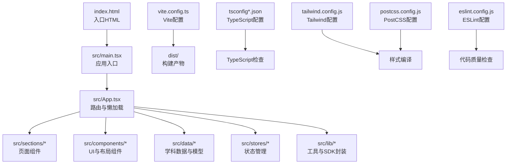
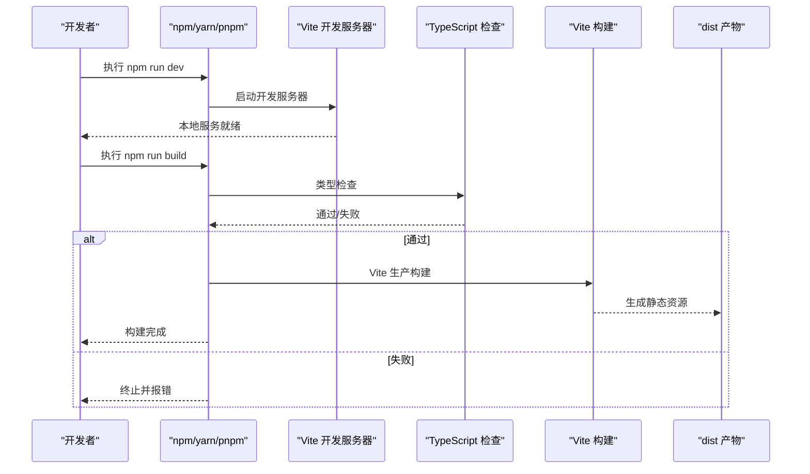

# 快速开始

<cite>
**本文引用的文件**   
- [package.json](file://package.json)
- [vite.config.ts](file://vite.config.ts)
- [tsconfig.json](file://tsconfig.json)
- [tsconfig.app.json](file://tsconfig.app.json)
- [tsconfig.node.json](file://tsconfig.node.json)
- [netlify.toml](file://netlify.toml)
- [ARCHITECTURE.md](file://ARCHITECTURE.md)
- [scripts/build.js](file://scripts/build.js)
- [src/main.tsx](file://src/main.tsx)
- [src/App.tsx](file://src/App.tsx)
- [tailwind.config.js](file://tailwind.config.js)
- [postcss.config.js](file://postcss.config.js)
- [eslint.config.js](file://eslint.config.js)
- [src/lib/utils.ts](file://src/lib/utils.ts)
- [src/stores/index.ts](file://src/stores/index.ts)
- [src/data/subjects.ts](file://src/data/subjects.ts)
- [index.html](file://index.html)
</cite>

## 目录
1. [简介](#简介)
2. [项目结构](#项目结构)
3. [核心组件](#核心组件)
4. [架构总览](#架构总览)
5. [详细组件分析](#详细组件分析)
6. [依赖分析](#依赖分析)
7. [性能考虑](#性能考虑)
8. [故障排查指南](#故障排查指南)
9. [结论](#结论)
10. [附录](#附录)

## 简介
本指南面向初学者与有经验的开发者，帮助你在本地快速搭建并运行星耀平台。你将了解：
- Node.js 与包管理器版本要求
- 依赖安装与开发环境准备
- 开发服务器启动与访问方式
- 生产构建流程与产物说明
- 关键配置文件的作用与注意事项
- 常见问题与解决方案
- 基本使用示例与导航路径

## 项目结构
星耀平台采用 React 19 + Vite 5 + TypeScript 技术栈，结合 Tailwind CSS 样式与 shadcn/ui 组件库，路由基于 React Router v7，状态管理使用 Zustand，并集成 Supabase 云端能力（按配置启用）。项目采用多学科模块化组织，路由与组件按主题域划分。

图表来源
- [index.html:1-14](file://index.html#L1-L14)
- [src/main.tsx:1-19](file://src/main.tsx#L1-L19)
- [src/App.tsx:1-214](file://src/App.tsx#L1-L214)
- [vite.config.ts:1-14](file://vite.config.ts#L1-L14)
- [tsconfig.json:1-8](file://tsconfig.json#L1-L8)
- [tailwind.config.js:1-52](file://tailwind.config.js#L1-L52)
- [postcss.config.js:1-7](file://postcss.config.js#L1-L7)
- [eslint.config.js:1-24](file://eslint.config.js#L1-L24)

章节来源
- [ARCHITECTURE.md:1-369](file://ARCHITECTURE.md#L1-L369)
- [src/main.tsx:1-19](file://src/main.tsx#L1-L19)
- [src/App.tsx:1-214](file://src/App.tsx#L1-L214)

## 核心组件
- 应用入口与挂载
  - 入口 HTML 与应用挂载点位于 [index.html:1-14](file://index.html#L1-L14) 与 [src/main.tsx:1-19](file://src/main.tsx#L1-L19)，负责初始化样式与渲染根组件。
- 路由与懒加载
  - 主应用路由与懒加载组件在 [src/App.tsx:1-214](file://src/App.tsx#L1-L214) 中集中声明，支持多学科与专区路由。
- 构建与打包
  - Vite 配置在 [vite.config.ts:1-14](file://vite.config.ts#L1-L14)，统一构建脚本在 [scripts/build.js:1-96](file://scripts/build.js#L1-L96)。
- 样式与工具
  - Tailwind 与 PostCSS 配置分别在 [tailwind.config.js:1-52](file://tailwind.config.js#L1-L52) 与 [postcss.config.js:1-7](file://postcss.config.js#L1-L7)，工具函数在 [src/lib/utils.ts:1-7](file://src/lib/utils.ts#L1-L7)。
- 状态管理
  - Zustand 状态导出在 [src/stores/index.ts:1-3](file://src/stores/index.ts#L1-L3)，主题初始化在 [src/App.tsx:69-75](file://src/App.tsx#L69-L75)。
- 学科与路由元数据
  - 学科元数据与路径解析在 [src/data/subjects.ts:1-30](file://src/data/subjects.ts#L1-L30)。

章节来源
- [src/main.tsx:1-19](file://src/main.tsx#L1-L19)
- [src/App.tsx:1-214](file://src/App.tsx#L1-L214)
- [vite.config.ts:1-14](file://vite.config.ts#L1-L14)
- [scripts/build.js:1-96](file://scripts/build.js#L1-L96)
- [tailwind.config.js:1-52](file://tailwind.config.js#L1-L52)
- [postcss.config.js:1-7](file://postcss.config.js#L1-L7)
- [src/lib/utils.ts:1-7](file://src/lib/utils.ts#L1-L7)
- [src/stores/index.ts:1-3](file://src/stores/index.ts#L1-L3)
- [src/data/subjects.ts:1-30](file://src/data/subjects.ts#L1-L30)

## 架构总览
星耀平台采用“按需懒加载 + 多学科路由 + 统一布局”的前端架构。路由以学科为单位组织，部分高频页面采用静态导入，题库与竞赛等大体量页面通过懒加载减少首屏体积。构建阶段先执行 TypeScript 类型检查，再进行 Vite 生产构建，最终输出 dist 目录。

图表来源
- [package.json:6-12](file://package.json#L6-L12)
- [scripts/build.js:68-82](file://scripts/build.js#L68-L82)
- [vite.config.ts:1-14](file://vite.config.ts#L1-L14)

章节来源
- [ARCHITECTURE.md:27-84](file://ARCHITECTURE.md#L27-L84)
- [src/App.tsx:7-22](file://src/App.tsx#L7-L22)

## 详细组件分析

### 开发服务器启动流程
- 启动命令
  - 使用 npm 脚本启动开发服务器：[package.json:6-12](file://package.json#L6-L12) 中的 dev 脚本指向 Vite。
- 本地访问
  - 默认在本地端口启动，浏览器打开根路径即可访问首页。
- 路由与基础路径
  - 应用在 [src/App.tsx:78-78](file://src/App.tsx#L78-L78) 设置了 basename，确保在子路径部署场景下的路由正确性。

章节来源
- [package.json:6-12](file://package.json#L6-L12)
- [src/App.tsx:78-78](file://src/App.tsx#L78-L78)

### 生产构建流程
- 构建脚本
  - 统一构建脚本 [scripts/build.js:1-96](file://scripts/build.js#L1-L96) 负责：
    - 清理 dist 目录
    - TypeScript 类型检查（通过 tsc）
    - Vite 生产构建
  - 产物输出至 dist 目录，大小会打印在控制台。
- 产物说明
  - 构建产物包含 HTML、JS、CSS、字体与图片等静态资源，入口 HTML 为 [index.html:1-14](file://index.html#L1-L14)。

章节来源
- [scripts/build.js:58-95](file://scripts/build.js#L58-L95)
- [index.html:1-14](file://index.html#L1-L14)

### 路由与页面组件
- 路由清单与懒加载
  - 路由在 [src/App.tsx:80-206](file://src/App.tsx#L80-L206) 中集中声明，包含学科主页、模型/概念/公式/策略、题库、竞赛专区、学习工具等。
  - 题库与竞赛等页面采用懒加载，减少首屏体积。
- 旧路由兼容
  - 旧路由通过 [src/App.tsx:100-104](file://src/App.tsx#L100-L104) 的重定向组件处理，保持现有链接可用。

章节来源
- [src/App.tsx:7-22](file://src/App.tsx#L7-L22)
- [src/App.tsx:80-206](file://src/App.tsx#L80-L206)

### 样式系统与工具函数
- Tailwind 配置
  - Tailwind 在 [tailwind.config.js:1-52](file://tailwind.config.js#L1-L52) 中启用暗色模式与内容扫描范围，PostCSS 在 [postcss.config.js:1-7](file://postcss.config.js#L1-L7) 中启用 Tailwind 与 Autoprefixer。
- 工具函数
  - [src/lib/utils.ts:1-7](file://src/lib/utils.ts#L1-L7) 提供 cn 合并类名的便捷函数。

章节来源
- [tailwind.config.js:1-52](file://tailwind.config.js#L1-L52)
- [postcss.config.js:1-7](file://postcss.config.js#L1-L7)
- [src/lib/utils.ts:1-7](file://src/lib/utils.ts#L1-L7)

### 状态管理与 Supabase 保护
- 主题初始化
  - 在 [src/App.tsx:69-75](file://src/App.tsx#L69-L75) 初始化主题，Zustand 状态导出在 [src/stores/index.ts:1-3](file://src/stores/index.ts#L1-L3)。
- Supabase 保护
  - 通过 [src/App.tsx:72-74](file://src/App.tsx#L72-L74) 的条件初始化，遵循 [ARCHITECTURE.md:207-223](file://ARCHITECTURE.md#L207-L223) 的保护原则：未配置时安静降级。

章节来源
- [src/App.tsx:69-75](file://src/App.tsx#L69-L75)
- [src/stores/index.ts:1-3](file://src/stores/index.ts#L1-L3)
- [ARCHITECTURE.md:207-223](file://ARCHITECTURE.md#L207-L223)

### 学科与路由元数据
- 学科元数据
  - [src/data/subjects.ts:1-30](file://src/data/subjects.ts#L1-L30) 定义学科 ID、路由前缀、模型/概念前缀与颜色等元信息。
- 路径解析
  - 提供从路径解析学科的方法，用于导航与高亮。

章节来源
- [src/data/subjects.ts:1-30](file://src/data/subjects.ts#L1-L30)

## 依赖分析
- Node.js 与包管理器
  - 项目使用 Node.js 18（Netlify 环境变量指定），建议本地也使用 Node.js 18.x 以保证一致。
  - 包管理器推荐使用 npm（项目脚本基于 npm run）。
- 依赖与脚本
  - 依赖与开发依赖在 [package.json:14-84](file://package.json#L14-L84) 中声明，常用脚本：
    - dev：启动 Vite 开发服务器
    - build：执行统一构建脚本
    - build:fast：直接调用 Vite 构建（跳过类型检查）
    - lint：ESLint 检查
    - preview：本地预览构建产物
    - audit：审计脚本
- TypeScript 配置
  - [tsconfig.json:1-8](file://tsconfig.json#L1-L8) 作为多项目引用入口，实际编译目标在 [tsconfig.app.json:1-27](file://tsconfig.app.json#L1-L27) 与 [tsconfig.node.json:1-25](file://tsconfig.node.json#L1-L25)。
- 样式与代码质量
  - Tailwind 与 PostCSS 配置在 [tailwind.config.js:1-52](file://tailwind.config.js#L1-L52) 与 [postcss.config.js:1-7](file://postcss.config.js#L1-L7)。
  - ESLint 配置在 [eslint.config.js:1-24](file://eslint.config.js#L1-L24)。

章节来源
- [package.json:1-86](file://package.json#L1-L86)
- [tsconfig.json:1-8](file://tsconfig.json#L1-L8)
- [tsconfig.app.json:1-27](file://tsconfig.app.json#L1-L27)
- [tsconfig.node.json:1-25](file://tsconfig.node.json#L1-L25)
- [tailwind.config.js:1-52](file://tailwind.config.js#L1-L52)
- [postcss.config.js:1-7](file://postcss.config.js#L1-L7)
- [eslint.config.js:1-24](file://eslint.config.js#L1-L24)

## 性能考虑
- 懒加载与代码分割
  - 题库与竞赛等页面采用懒加载，减少首屏体积，提升首屏性能。
- 构建优化
  - 统一构建脚本先进行类型检查，再执行 Vite 构建，有助于在 CI/本地尽早发现类型错误。
- 样式体积
  - Tailwind 内容扫描范围在 [tailwind.config.js:6-9](file://tailwind.config.js#L6-L9) 中限定，避免打包无关样式。

章节来源
- [src/App.tsx:7-22](file://src/App.tsx#L7-L22)
- [scripts/build.js:68-82](file://scripts/build.js#L68-L82)
- [tailwind.config.js:6-9](file://tailwind.config.js#L6-L9)

## 故障排查指南
- Node.js 版本不匹配
  - Netlify 环境变量指定 Node 18，建议本地也使用 Node.js 18.x，避免运行或构建差异。
  - 参考：[netlify.toml:5-6](file://netlify.toml#L5-L6)
- 构建失败（TypeScript）
  - 统一构建脚本会在 [scripts/build.js:68-75](file://scripts/build.js#L68-L75) 中执行类型检查，失败时请根据终端输出修正类型问题。
- 路由 404 或 SPA 回退异常
  - 应用在 [src/App.tsx:78-78](file://src/App.tsx#L78-L78) 设置了 basename，若部署在子路径，请确保与部署路径一致。
  - Netlify SPA 回退规则在 [netlify.toml:8-12](file://netlify.toml#L8-L12) 中配置。
- 本地开发无法访问
  - 确认 [package.json:6-12](file://package.json#L6-L12) 中 dev 脚本正常，Vite 默认端口未被占用。
- 样式未生效
  - 确认 Tailwind 内容扫描范围与文件路径一致，参考 [tailwind.config.js:6-9](file://tailwind.config.js#L6-L9)。
- ESLint 报错
  - 使用 [package.json:10-10](file://package.json#L10-L10) 中 lint 脚本修复或忽略，参考 [eslint.config.js:1-24](file://eslint.config.js#L1-L24)。

章节来源
- [netlify.toml:5-12](file://netlify.toml#L5-L12)
- [scripts/build.js:68-75](file://scripts/build.js#L68-L75)
- [src/App.tsx:78-78](file://src/App.tsx#L78-L78)
- [package.json:6-12](file://package.json#L6-L12)
- [tailwind.config.js:6-9](file://tailwind.config.js#L6-L9)
- [eslint.config.js:1-24](file://eslint.config.js#L1-L24)

## 结论
通过本指南，你可以完成星耀平台的本地安装、开发与构建全流程。建议优先使用 Node.js 18.x，按脚本顺序执行开发与构建，遇到问题可依据“故障排查指南”逐项排除。随着项目推进，可逐步完善 Supabase 集成、样式与路由细节，持续优化性能与开发体验。

## 附录

### 安装与配置步骤
- 安装依赖
  - 使用 npm 安装项目依赖（首次安装后可跳过）。
- 启动开发服务器
  - 执行 npm run dev，在浏览器打开默认地址。
- 本地预览构建
  - 执行 npm run preview，预览 dist 产物。
- 生产构建
  - 执行 npm run build，产物输出至 dist 目录。

章节来源
- [package.json:6-12](file://package.json#L6-L12)
- [scripts/build.js:77-82](file://scripts/build.js#L77-L82)

### 关键配置文件速览
- Vite 配置
  - 基础路径与别名在 [vite.config.ts:5-12](file://vite.config.ts#L5-L12)。
- TypeScript 配置
  - 多项目引用入口在 [tsconfig.json:1-8](file://tsconfig.json#L1-L8)，应用与 Node 配置在 [tsconfig.app.json:1-27](file://tsconfig.app.json#L1-L27) 与 [tsconfig.node.json:1-25](file://tsconfig.node.json#L1-L25)。
- 样式与工具
  - Tailwind 配置在 [tailwind.config.js:1-52](file://tailwind.config.js#L1-L52)，PostCSS 在 [postcss.config.js:1-7](file://postcss.config.js#L1-L7)，工具函数在 [src/lib/utils.ts:1-7](file://src/lib/utils.ts#L1-L7)。
- 代码质量
  - ESLint 配置在 [eslint.config.js:1-24](file://eslint.config.js#L1-L24)。

章节来源
- [vite.config.ts:1-14](file://vite.config.ts#L1-L14)
- [tsconfig.json:1-8](file://tsconfig.json#L1-L8)
- [tsconfig.app.json:1-27](file://tsconfig.app.json#L1-L27)
- [tsconfig.node.json:1-25](file://tsconfig.node.json#L1-L25)
- [tailwind.config.js:1-52](file://tailwind.config.js#L1-L52)
- [postcss.config.js:1-7](file://postcss.config.js#L1-L7)
- [src/lib/utils.ts:1-7](file://src/lib/utils.ts#L1-L7)
- [eslint.config.js:1-24](file://eslint.config.js#L1-L24)

### 基本使用示例
- 访问首页
  - 在本地开发服务器中打开根路径，进入站点首页。
- 学科导航
  - 通过学科路由访问对应模块，如 /physics、/chemistry、/math 等。
- 题库练习
  - 进入 /physics/exercises 查看题库列表，点击模型卡片查看详情并开始练习。
- 学习工具
  - 访问 /diagnosis、/planner、/methods 获取诊断、规划与方法卡片。
- 竞赛专区
  - 访问 /competition 或 /competition/physics 等路由，查看竞赛相关内容。

章节来源
- [src/App.tsx:80-206](file://src/App.tsx#L80-L206)
- [src/data/subjects.ts:12-19](file://src/data/subjects.ts#L12-L19)