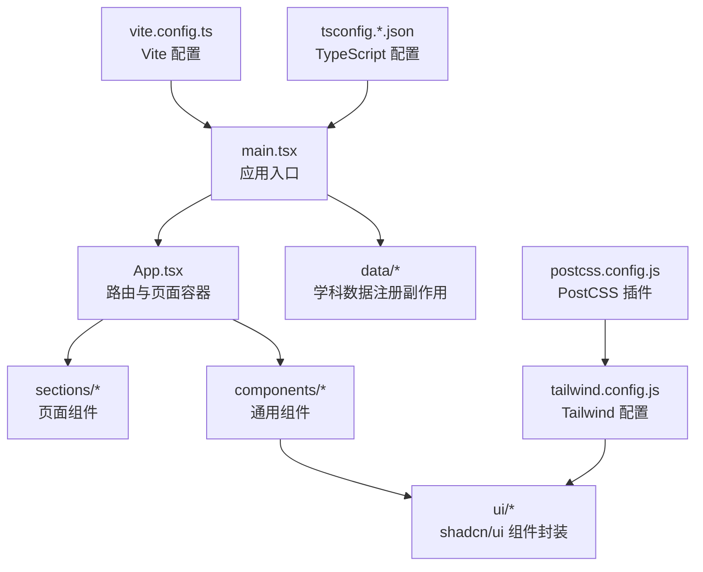
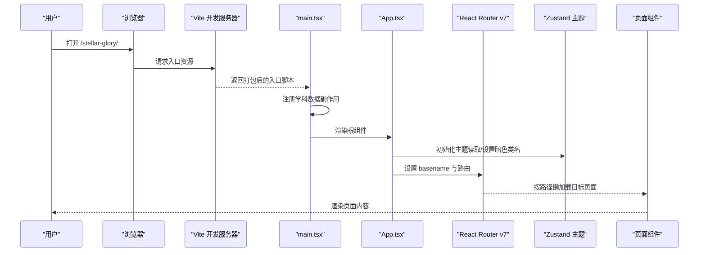
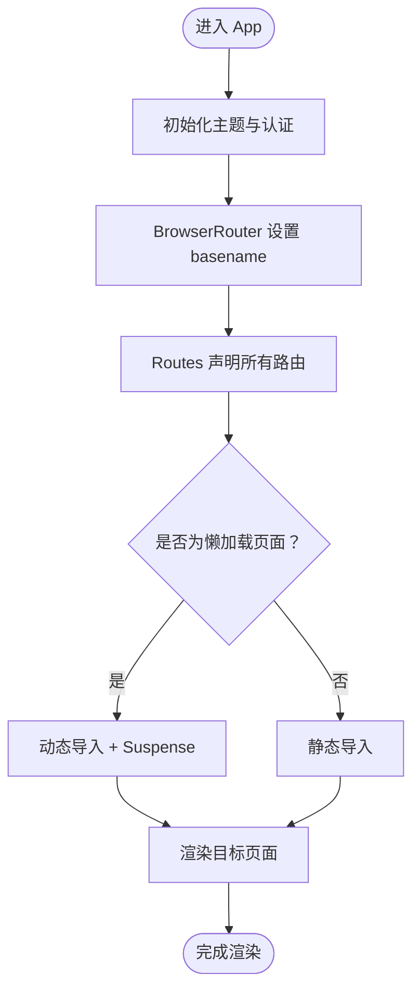
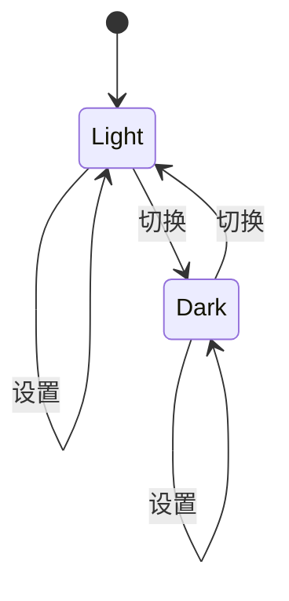
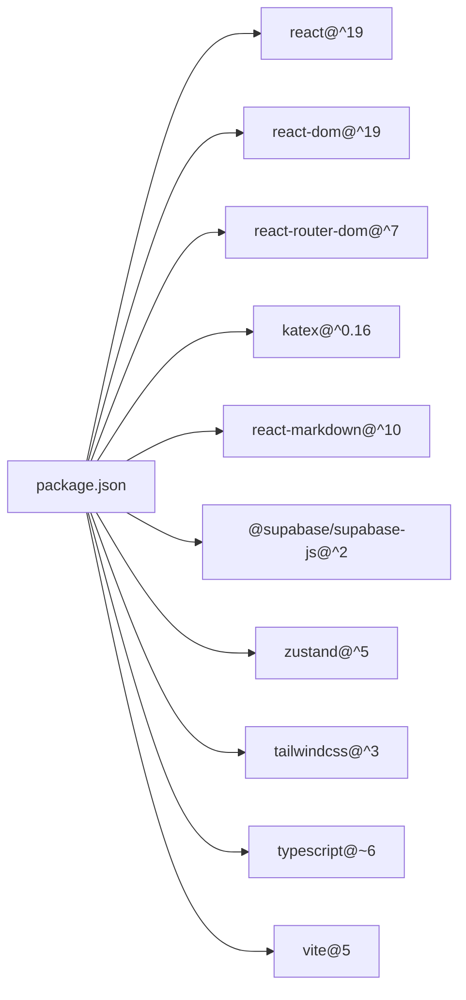

# 前端技术栈

<cite>
**本文引用的文件**
- [package.json](file://package.json)
- [vite.config.ts](file://vite.config.ts)
- [tsconfig.json](file://tsconfig.json)
- [tsconfig.app.json](file://tsconfig.app.json)
- [tsconfig.node.json](file://tsconfig.node.json)
- [tailwind.config.js](file://tailwind.config.js)
- [postcss.config.js](file://postcss.config.js)
- [src/main.tsx](file://src/main.tsx)
- [src/App.tsx](file://src/App.tsx)
- [src/lib/utils.ts](file://src/lib/utils.ts)
- [src/hooks/use-mobile.ts](file://src/hooks/use-mobile.ts)
- [src/stores/themeStore.ts](file://src/stores/themeStore.ts)
- [src/components/layout/Navigation.tsx](file://src/components/layout/Navigation.tsx)
- [src/components/MarkdownRenderer.tsx](file://src/components/MarkdownRenderer.tsx)
- [WORKFLOW.md](file://WORKFLOW.md)
</cite>

## 目录
1. [引言](#引言)
2. [项目结构](#项目结构)
3. [核心组件](#核心组件)
4. [架构总览](#架构总览)
5. [详细组件分析](#详细组件分析)
6. [依赖分析](#依赖分析)
7. [性能考虑](#性能考虑)
8. [故障排查指南](#故障排查指南)
9. [结论](#结论)
10. [附录](#附录)

## 引言
本文件面向星耀平台前端团队与协作开发者，系统化阐述当前技术栈：React 19 + TypeScript + Vite 5，并结合实际代码落地说明。重点覆盖以下方面：
- 技术选型理由与收益：TypeScript 的类型安全、Vite 5 的构建性能与开发体验、Tailwind CSS 的实用主义样式体系、shadcn/ui 组件库的可定制化集成、React Router v7 的路由配置与懒加载、KaTeX 数学公式渲染的启用条件与降级策略。
- 实战配置与最佳实践：路径别名、构建基座、主题持久化、移动端适配、组件样式合并工具、路由懒加载策略与共享 chunk。
- 升级与兼容性：版本范围、迁移注意事项、潜在风险与规避建议。

## 项目结构
星耀平台采用以功能域为中心的组织方式，前端源码位于 src 目录，核心入口为 main.tsx，应用根组件为 App.tsx；样式通过 Tailwind CSS 与 PostCSS 配置驱动；构建由 Vite 5 提供支持；类型系统由 TypeScript 多配置文件协同保障。

图表来源
- [src/main.tsx:1-19](file://src/main.tsx#L1-L19)
- [src/App.tsx:1-214](file://src/App.tsx#L1-L214)
- [vite.config.ts:1-14](file://vite.config.ts#L1-L14)
- [tsconfig.json:1-8](file://tsconfig.json#L1-L8)
- [tailwind.config.js:1-52](file://tailwind.config.js#L1-L52)
- [postcss.config.js:1-7](file://postcss.config.js#L1-L7)

章节来源
- [src/main.tsx:1-19](file://src/main.tsx#L1-L19)
- [src/App.tsx:1-214](file://src/App.tsx#L1-L214)
- [vite.config.ts:1-14](file://vite.config.ts#L1-L14)
- [tsconfig.json:1-8](file://tsconfig.json#L1-L8)
- [tailwind.config.js:1-52](file://tailwind.config.js#L1-L52)
- [postcss.config.js:1-7](file://postcss.config.js#L1-L7)

## 核心组件
- 应用入口与数据注册：入口文件负责注册全部学科数据（副作用导入），随后挂载根组件。
- 路由与懒加载：App 组件集中声明路由，大量页面采用动态导入与 Suspense 加载兜底，竞赛专区统一共享一个 chunk。
- 主题与持久化：基于 Zustand 的主题状态，结合 localStorage 持久化，初始化时设置 HTML 根元素的暗色类名。
- 移动端适配：自定义 hook 使用媒体查询检测断点，便于组件按需响应。
- 样式工具：cn 工具整合 clsx 与 tailwind-merge，确保类名冲突最小化。
- 导航与布局：导航组件提供桌面/移动端双态导航、学科模块切换、学习工具入口与锚点目录。
- Markdown 渲染：MarkdownRenderer 支持可选的 KaTeX 渲染开关，当前默认关闭以保证稳定性。

章节来源
- [src/main.tsx:6-18](file://src/main.tsx#L6-L18)
- [src/App.tsx:7-54](file://src/App.tsx#L7-L54)
- [src/stores/themeStore.ts:1-37](file://src/stores/themeStore.ts#L1-L37)
- [src/hooks/use-mobile.ts:1-20](file://src/hooks/use-mobile.ts#L1-L20)
- [src/lib/utils.ts:1-7](file://src/lib/utils.ts#L1-L7)
- [src/components/layout/Navigation.tsx:368-719](file://src/components/layout/Navigation.tsx#L368-L719)
- [src/components/MarkdownRenderer.tsx:1-33](file://src/components/MarkdownRenderer.tsx#L1-L33)

## 架构总览
下图展示从浏览器请求到页面渲染的关键路径，以及懒加载与主题初始化的时序。

图表来源
- [src/main.tsx:1-19](file://src/main.tsx#L1-L19)
- [src/App.tsx:69-75](file://src/App.tsx#L69-L75)
- [src/App.tsx:77-210](file://src/App.tsx#L77-L210)
- [src/stores/themeStore.ts:26-30](file://src/stores/themeStore.ts#L26-L30)

章节来源
- [src/main.tsx:1-19](file://src/main.tsx#L1-L19)
- [src/App.tsx:69-210](file://src/App.tsx#L69-L210)
- [src/stores/themeStore.ts:13-34](file://src/stores/themeStore.ts#L13-L34)

## 详细组件分析

### 路由与懒加载（React Router v7）
- 路由基座：BrowserRouter 使用 basename 为“/stellar-glory”，适配子路径部署。
- 懒加载策略：
  - 题库相关页面：独立 chunk，按需加载。
  - 竞赛专区：统一懒加载，多个路由指向同一组件，共享下载的 bundle。
  - 高考/强基/过渡区：按区域懒加载，减少首屏体积。
  - 静态导入：首页与工具页采用静态导入，保证首屏关键路径稳定。
- Suspense 兜底：统一 Loading 组件，避免空白闪烁。
- 动态参数：支持 :modelId、:methodId、:storyId 等参数化路由。

图表来源
- [src/App.tsx:69-210](file://src/App.tsx#L69-L210)
- [src/App.tsx:7-22](file://src/App.tsx#L7-L22)

章节来源
- [src/App.tsx:77-210](file://src/App.tsx#L77-L210)
- [src/App.tsx:7-22](file://src/App.tsx#L7-L22)

### 主题系统与持久化（Zustand + localStorage）
- 状态模型：light/dark 切换、设置与切换函数、初始化。
- 初始化：在客户端首次渲染时设置 HTML 根元素的暗色类名。
- 持久化：使用 persist 中间件将主题保存至 localStorage，刷新后仍保持。

图表来源
- [src/stores/themeStore.ts:13-34](file://src/stores/themeStore.ts#L13-L34)

章节来源
- [src/stores/themeStore.ts:1-37](file://src/stores/themeStore.ts#L1-L37)

### 移动端断点检测（useIsMobile）
- 使用媒体查询监听窗口宽度，小于断点返回 true，用于组件条件渲染与布局调整。

章节来源
- [src/hooks/use-mobile.ts:1-20](file://src/hooks/use-mobile.ts#L1-L20)

### 样式工具与 Tailwind 集成（cn）
- cn 封装 clsx 与 tailwind-merge，解决重复/冲突类名合并问题，提升样式可控性。

章节来源
- [src/lib/utils.ts:1-7](file://src/lib/utils.ts#L1-L7)
- [tailwind.config.js:1-52](file://tailwind.config.js#L1-L52)

### 导航与布局（Navigation）
- 桌面端：学科切换按钮、当前学科下拉菜单、学习工具下拉。
- 移动端：左侧抽屉菜单，包含学习工具、学科选择与模块导航。
- 锚点目录：右侧固定目录，基于 IntersectionObserver 实时高亮当前锚点。

章节来源
- [src/components/layout/Navigation.tsx:368-719](file://src/components/layout/Navigation.tsx#L368-L719)

### Markdown 渲染与 KaTeX 启用条件
- 渲染器支持可选的 KaTeX 渲染开关，当前默认关闭以保证稳定性。
- 上线前需将开关置为开启并进行网络环境测试，若出现渲染异常则回退为原文显示。

章节来源
- [src/components/MarkdownRenderer.tsx:1-33](file://src/components/MarkdownRenderer.tsx#L1-L33)
- [WORKFLOW.md:101-120](file://WORKFLOW.md#L101-L120)

## 依赖分析
- 核心运行时依赖
  - React 19 与 React DOM：应用 UI 基础。
  - React Router v7：路由声明与懒加载。
  - KaTeX：数学公式渲染。
  - react-markdown：Markdown 渲染管线。
  - @supabase/supabase-js：云服务集成。
  - shadcn/ui 生态（Radix UI 组合）：语义化 UI 组件。
  - 图表与可视化：AntV G6、Recharts。
  - 状态管理：Zustand。
- 构建与类型
  - Vite 5：快速开发与生产构建。
  - TypeScript ~6.0：严格类型约束。
  - Tailwind CSS + PostCSS：原子化样式与自动前缀。
  - ESLint + TypeScript ESLint：代码质量与风格。

图表来源
- [package.json:14-67](file://package.json#L14-L67)

章节来源
- [package.json:14-84](file://package.json#L14-L84)

## 性能考虑
- 懒加载与共享 chunk
  - 题库与竞赛专区采用动态导入，降低首屏体积。
  - 竞赛专区多路由共享同一组件，减少重复下载。
- Suspense 兜底
  - 统一 Loading 组件，避免空白闪烁，改善感知性能。
- 构建基座与别名
  - Vite 基于子路径部署，路径别名缩短导入路径，提升 DX。
- 样式合并
  - 使用 cn 工具合并类名，避免重复与冲突，减少无效样式。
- 主题初始化
  - 在入口阶段完成主题初始化，避免闪烁与重绘。

章节来源
- [src/App.tsx:7-22](file://src/App.tsx#L7-L22)
- [src/App.tsx:52-54](file://src/App.tsx#L52-L54)
- [vite.config.ts:6-12](file://vite.config.ts#L6-L12)
- [src/lib/utils.ts:4-6](file://src/lib/utils.ts#L4-L6)
- [src/stores/themeStore.ts:26-30](file://src/stores/themeStore.ts#L26-L30)

## 故障排查指南
- KaTeX 渲染问题
  - 当前默认关闭，如遇渲染崩溃或网络不稳定，保持关闭并使用原文显示作为降级。
  - 上线前务必开启并进行多网络环境测试。
- 路由 404 或空白页
  - 确认 BrowserRouter 的 basename 与部署路径一致。
  - 检查动态导入的模块导出是否为默认导出。
- 样式异常
  - 检查 Tailwind 内容扫描路径与类名拼写。
  - 使用 cn 工具合并类名，避免冲突。
- 主题不生效
  - 确保初始化调用在客户端执行，且 HTML 根元素具备暗色类名。
- 构建失败
  - 检查 TypeScript 配置与 Vite 插件版本兼容性。
  - 关注 peer 依赖警告并及时修复。

章节来源
- [src/components/MarkdownRenderer.tsx:1-33](file://src/components/MarkdownRenderer.tsx#L1-L33)
- [WORKFLOW.md:101-120](file://WORKFLOW.md#L101-L120)
- [src/App.tsx:77-210](file://src/App.tsx#L77-L210)
- [tailwind.config.js:6-9](file://tailwind.config.js#L6-L9)
- [src/stores/themeStore.ts:26-30](file://src/stores/themeStore.ts#L26-L30)

## 结论
星耀平台前端技术栈以 React 19 为核心，配合 TypeScript 与 Vite 5，在开发体验与构建性能上形成良好平衡；Tailwind CSS 与 shadcn/ui 提供一致、可定制的视觉语言；路由懒加载与主题持久化进一步优化了用户体验。KaTeX 渲染遵循“稳定优先”的原则，确保在复杂网络环境下仍能提供可用的学习内容。

## 附录

### TypeScript 配置要点
- 多配置文件组织：app 与 node 分离，分别针对应用与构建工具链。
- bundler 模式：moduleResolution 使用 bundler，提升与现代打包器的兼容性。
- JSX 与路径别名：统一 JSX 运行时与路径映射，简化导入。

章节来源
- [tsconfig.json:1-8](file://tsconfig.json#L1-L8)
- [tsconfig.app.json:1-27](file://tsconfig.app.json#L1-L27)
- [tsconfig.node.json:1-25](file://tsconfig.node.json#L1-L25)

### Vite 配置要点
- 子路径部署：base 设置为“/stellar-glory”。
- 路径别名：@ 指向 src，提升可读性与可维护性。
- React 插件：内置 React Refresh 与 JSX 优化。

章节来源
- [vite.config.ts:1-14](file://vite.config.ts#L1-L14)

### Tailwind CSS 与 PostCSS
- Tailwind 配置：深色模式基于类名，内容扫描覆盖 src 与模板文件，主题变量映射到 CSS 变量。
- PostCSS：启用 Tailwind 与 Autoprefixer，确保跨浏览器兼容。

章节来源
- [tailwind.config.js:1-52](file://tailwind.config.js#L1-L52)
- [postcss.config.js:1-7](file://postcss.config.js#L1-L7)

### shadcn/ui 集成与定制
- 组件来源：项目中大量使用 Radix UI 组合（来自 shadcn/ui 生态），通过 src/components/ui 下的封装实现统一风格。
- 定制策略：通过 Tailwind 主题变量与 cn 工具实现样式一致性与可扩展性。

章节来源
- [src/components/layout/Navigation.tsx:14-16](file://src/components/layout/Navigation.tsx#L14-L16)
- [src/lib/utils.ts:4-6](file://src/lib/utils.ts#L4-L6)

### 技术栈升级与兼容性建议
- React 19：关注新并发特性与 Hooks 行为变化，逐步迁移 Suspense 边界与错误边界。
- Vite 5：留意插件生态与 esbuild 版本差异，升级前先在本地与 CI 验证。
- TypeScript 6.0：注意新增的 erasableSyntaxOnly 与 ignoreDeprecations 等编译选项，确保迁移平滑。
- Tailwind CSS：升级时检查内容扫描路径与未使用样式清理策略。
- KaTeX：升级时验证公式渲染与字体加载，必要时回退原文显示。

章节来源
- [package.json:52-83](file://package.json#L52-L83)
- [tsconfig.app.json:17-19](file://tsconfig.app.json#L17-L19)
- [WORKFLOW.md:101-120](file://WORKFLOW.md#L101-L120)