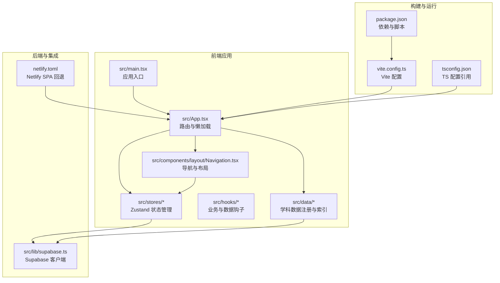
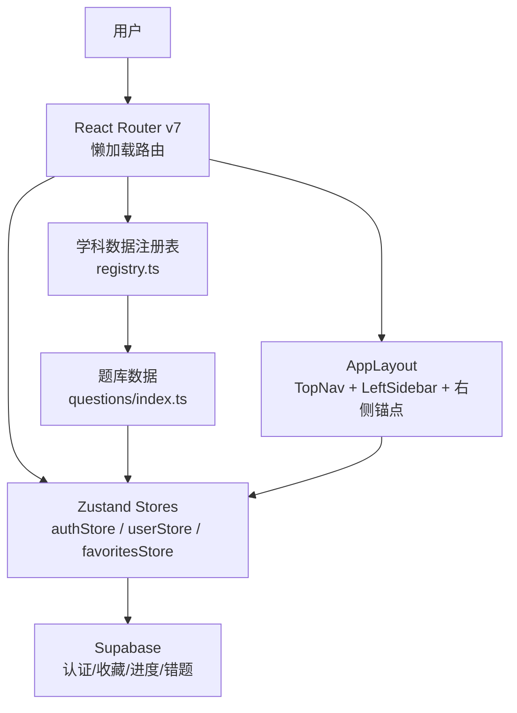
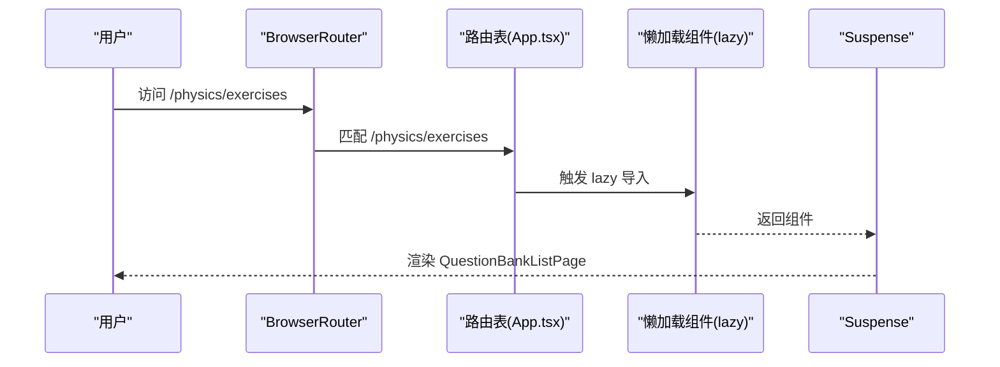
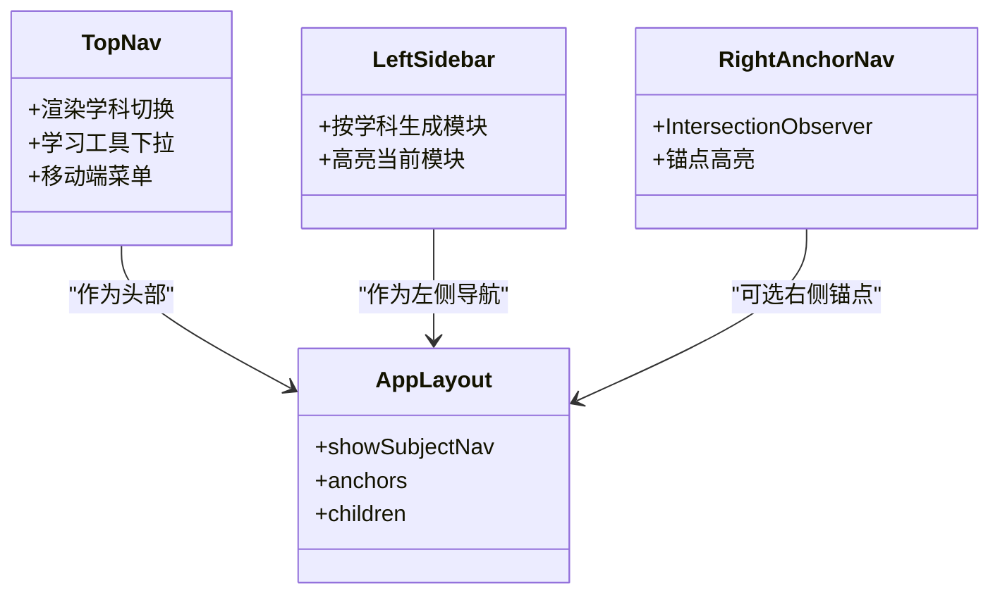
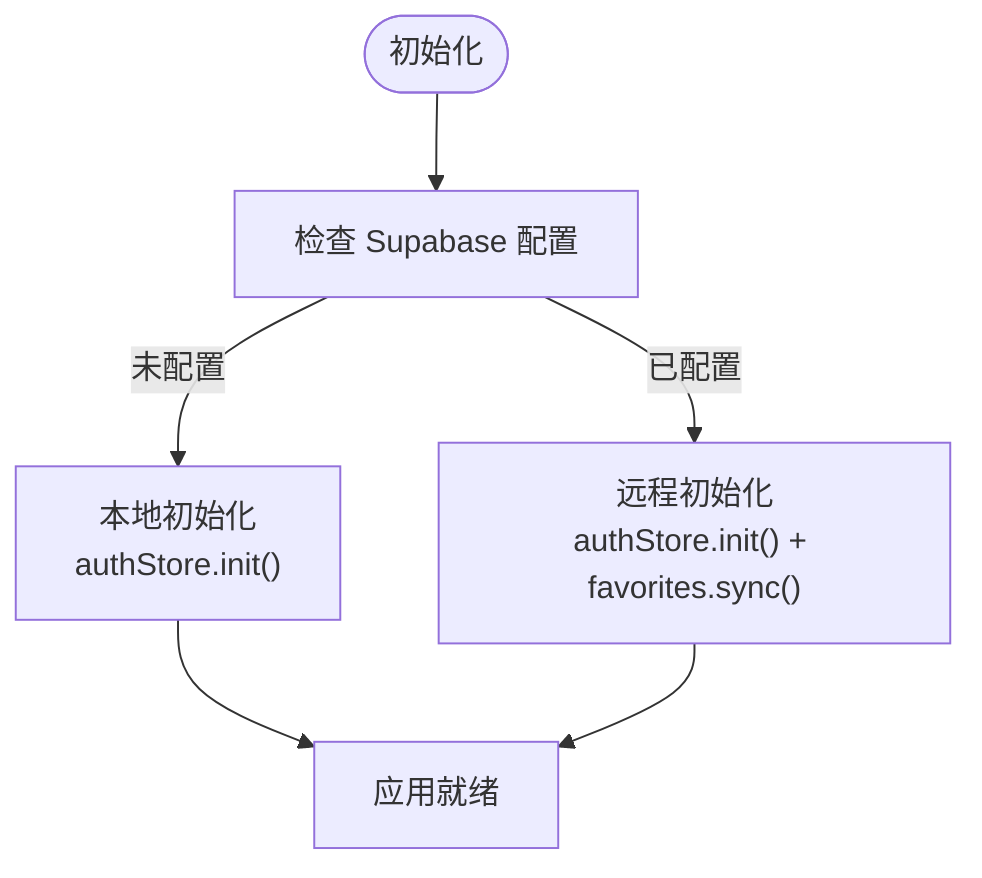
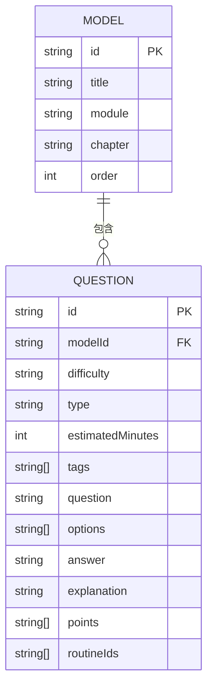
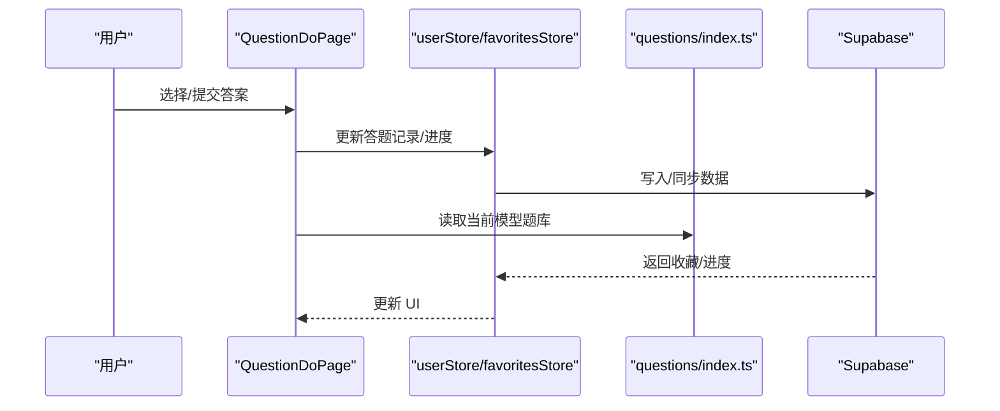
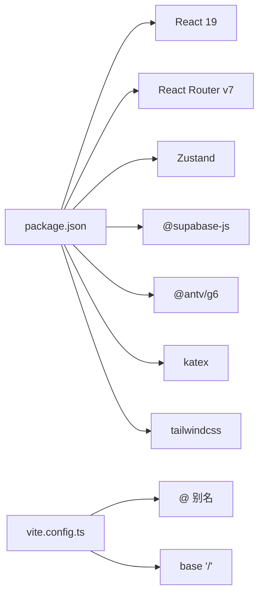

# 技术架构

<cite>
**本文档引用的文件**
- [ARCHITECTURE.md](file://ARCHITECTURE.md)
- [TECH_ARCHITECTURE.md](file://TECH_ARCHITECTURE.md)
- [SPEC.md](file://SPEC.md)
- [package.json](file://package.json)
- [vite.config.ts](file://vite.config.ts)
- [src/App.tsx](file://src/App.tsx)
- [src/main.tsx](file://src/main.tsx)
- [src/components/layout/Navigation.tsx](file://src/components/layout/Navigation.tsx)
- [src/lib/supabase.ts](file://src/lib/supabase.ts)
- [src/stores/authStore.ts](file://src/stores/authStore.ts)
- [src/stores/userStore.ts](file://src/stores/userStore.ts)
- [src/stores/favoritesStore.ts](file://src/stores/favoritesStore.ts)
- [src/hooks/useSubjectData.ts](file://src/hooks/useSubjectData.ts)
- [src/data/registry.ts](file://src/data/registry.ts)
- [src/data/physics/physicsModels.ts](file://src/data/physics/physicsModels.ts)
- [src/data/physics/questions/index.ts](file://src/data/physics/questions/index.ts)
- [netlify.toml](file://netlify.toml)
- [tsconfig.json](file://tsconfig.json)
</cite>

## 目录
1. [引言](#引言)
2. [项目结构](#项目结构)
3. [核心组件](#核心组件)
4. [架构总览](#架构总览)
5. [详细组件分析](#详细组件分析)
6. [依赖分析](#依赖分析)
7. [性能考量](#性能考量)
8. [故障排查指南](#故障排查指南)
9. [结论](#结论)
10. [附录](#附录)

## 引言
本技术架构文档面向星耀平台的实现层与方案层，系统阐述基于 React 19 + TypeScript + Vite 5 的前端技术栈选型、组件化与模块化设计、数据驱动渲染与响应式设计、组件交互与数据流、集成模式、技术决策与权衡、基础设施与部署拓扑、以及安全性、监控与灾备等横切关注点。文档同时提供系统上下文图与组件分解图，帮助开发者与产品人员快速理解平台的实现方式与扩展路径。

## 项目结构
星耀平台采用“内容即数据”的模块化组织方式，围绕“学科-模块-内容”三层结构展开，前端通过路由与组件实现模块化拼装，数据通过 TypeScript 文件与 Supabase 云服务协同，形成“静态内容 + 动态状态 + 云端同步”的混合架构。

图表来源
- [src/main.tsx:1-19](file://src/main.tsx#L1-L19)
- [src/App.tsx:1-214](file://src/App.tsx#L1-L214)
- [src/components/layout/Navigation.tsx:1-719](file://src/components/layout/Navigation.tsx#L1-L719)
- [vite.config.ts:1-14](file://vite.config.ts#L1-L14)
- [package.json:1-86](file://package.json#L1-L86)
- [src/lib/supabase.ts:1-18](file://src/lib/supabase.ts#L1-L18)
- [netlify.toml:1-13](file://netlify.toml#L1-L13)

章节来源
- [ARCHITECTURE.md:335-369](file://ARCHITECTURE.md#L335-L369)
- [TECH_ARCHITECTURE.md:10-35](file://TECH_ARCHITECTURE.md#L10-L35)

## 核心组件
- 路由与懒加载：通过 React Router v7 的 lazy 与 Suspense 实现按需加载，显著降低首屏体积与崩溃传播风险。
- 导航与布局：AppLayout 统一承载 TopNav、LeftSidebar、RightAnchorNav，支持学科导航与章节锚点。
- 状态管理：Zustand 管理主题、用户进度、收藏夹与认证状态，结合 localStorage 与 Supabase 实现本地与云端同步。
- 数据层：学科数据通过 registry 注册，提供概念、模型、公式、题库等查询接口；题库数据以 TypeScript 文件组织，按模型分组。
- 集成层：Supabase 提供认证、收藏夹、进度、错题等云端持久化能力，具备优雅降级与配置开关。

章节来源
- [ARCHITECTURE.md:27-84](file://ARCHITECTURE.md#L27-L84)
- [ARCHITECTURE.md:121-202](file://ARCHITECTURE.md#L121-L202)
- [src/App.tsx:1-214](file://src/App.tsx#L1-L214)
- [src/components/layout/Navigation.tsx:1-719](file://src/components/layout/Navigation.tsx#L1-L719)
- [src/stores/index.ts:1-3](file://src/stores/index.ts#L1-L3)

## 架构总览
星耀平台采用“静态内容 + 动态状态 + 云端同步”的混合架构。静态内容以 TS 文件承载，动态状态通过 Zustand 管理，云端同步通过 Supabase 实现。路由采用懒加载，导航与布局组件化，数据访问通过注册表与钩子抽象。

图表来源
- [src/App.tsx:1-214](file://src/App.tsx#L1-L214)
- [src/components/layout/Navigation.tsx:689-719](file://src/components/layout/Navigation.tsx#L689-L719)
- [src/stores/authStore.ts:1-63](file://src/stores/authStore.ts#L1-L63)
- [src/stores/userStore.ts:1-236](file://src/stores/userStore.ts#L1-L236)
- [src/stores/favoritesStore.ts:1-172](file://src/stores/favoritesStore.ts#L1-L172)
- [src/data/registry.ts:1-48](file://src/data/registry.ts#L1-L48)
- [src/data/physics/questions/index.ts:1-45](file://src/data/physics/questions/index.ts#L1-L45)
- [src/lib/supabase.ts:1-18](file://src/lib/supabase.ts#L1-L18)

## 详细组件分析

### 路由与懒加载
- 懒加载策略：题库、竞赛、高考/强基/衔接专区等大体量模块采用 lazy 按需加载，减少首屏负担。
- 路由注册：App.tsx 中集中注册静态与懒加载路由，支持学科级路由与专题路由。
- 旧路由兼容：通过 PracticeRedirect 统一跳转，避免路由污染。

图表来源
- [src/App.tsx:7-22](file://src/App.tsx#L7-L22)
- [src/App.tsx:96-98](file://src/App.tsx#L96-L98)

章节来源
- [ARCHITECTURE.md:27-44](file://ARCHITECTURE.md#L27-L44)
- [ARCHITECTURE.md:193-201](file://ARCHITECTURE.md#L193-L201)
- [src/App.tsx:1-214](file://src/App.tsx#L1-L214)

### 导航与布局系统
- TopNav：学科切换、学习工具下拉、移动端菜单。
- LeftSidebar：按学科动态生成模块导航，支持高亮与交互。
- RightAnchorNav：基于 IntersectionObserver 的章节锚点导航。
- AppLayout：统一布局骨架，支持是否显示左侧导航与右侧锚点。

图表来源
- [src/components/layout/Navigation.tsx:369-547](file://src/components/layout/Navigation.tsx#L369-L547)
- [src/components/layout/Navigation.tsx:550-631](file://src/components/layout/Navigation.tsx#L550-L631)
- [src/components/layout/Navigation.tsx:634-687](file://src/components/layout/Navigation.tsx#L634-L687)
- [src/components/layout/Navigation.tsx:698-718](file://src/components/layout/Navigation.tsx#L698-L718)

章节来源
- [ARCHITECTURE.md:87-118](file://ARCHITECTURE.md#L87-L118)
- [ARCHITECTURE.md:175-191](file://ARCHITECTURE.md#L175-L191)
- [src/components/layout/Navigation.tsx:1-719](file://src/components/layout/Navigation.tsx#L1-L719)

### 状态管理与数据流
- 认证状态：authStore 管理匿名登录与会话，支持 Supabase 未配置时的优雅降级。
- 用户状态：userStore 管理进度、错题、答题记录与学习统计，结合 localStorage 与 Supabase。
- 收藏夹：favoritesStore 与 Supabase 同步，监听认证变化自动重同步。
- 数据注册表：registry.ts 提供学科数据的统一查询接口，支持概念、模型、公式、题库等。

图表来源
- [src/stores/authStore.ts:20-37](file://src/stores/authStore.ts#L20-L37)
- [src/stores/favoritesStore.ts:37-63](file://src/stores/favoritesStore.ts#L37-L63)
- [src/lib/supabase.ts:17](file://src/lib/supabase.ts#L17)

章节来源
- [ARCHITECTURE.md:205-247](file://ARCHITECTURE.md#L205-L247)
- [src/stores/authStore.ts:1-63](file://src/stores/authStore.ts#L1-L63)
- [src/stores/userStore.ts:1-236](file://src/stores/userStore.ts#L1-L236)
- [src/stores/favoritesStore.ts:1-172](file://src/stores/favoritesStore.ts#L1-L172)
- [src/data/registry.ts:1-48](file://src/data/registry.ts#L1-L48)

### 题库与内容数据结构
- 题库数据：questions/index.ts 汇总并按模型分组，提供难度统计与选项配置。
- 模型元数据：physicsModels.ts 提供模型基础信息，支撑认知图谱与导航。
- 内容规范：SPEC.md 定义了 M/R/P/V 层内容规范与路由约定，确保扩展一致性。

图表来源
- [src/data/physics/physicsModels.ts:11-66](file://src/data/physics/physicsModels.ts#L11-L66)
- [src/data/physics/questions/index.ts:14-37](file://src/data/physics/questions/index.ts#L14-L37)

章节来源
- [SPEC.md:190-236](file://SPEC.md#L190-L236)
- [SPEC.md:372-462](file://SPEC.md#L372-L462)
- [src/data/physics/physicsModels.ts:1-66](file://src/data/physics/physicsModels.ts#L1-L66)
- [src/data/physics/questions/index.ts:1-45](file://src/data/physics/questions/index.ts#L1-L45)

### 组件交互与数据流（做题流程）

图表来源
- [src/stores/userStore.ts:173-214](file://src/stores/userStore.ts#L173-L214)
- [src/stores/favoritesStore.ts:65-94](file://src/stores/favoritesStore.ts#L65-L94)
- [src/data/physics/questions/index.ts:8-17](file://src/data/physics/questions/index.ts#L8-L17)

章节来源
- [ARCHITECTURE.md:225-235](file://ARCHITECTURE.md#L225-L235)
- [src/stores/userStore.ts:1-236](file://src/stores/userStore.ts#L1-L236)
- [src/stores/favoritesStore.ts:1-172](file://src/stores/favoritesStore.ts#L1-L172)
- [src/data/physics/questions/index.ts:1-45](file://src/data/physics/questions/index.ts#L1-L45)

## 依赖分析
- 技术栈：React 19、TypeScript、Vite 5、Tailwind CSS、shadcn/ui、React Router v7、Zustand、KaTeX、AntV G6、Supabase。
- 构建与别名：Vite 配置设置 base 与 @ 别名，保证生产部署与开发体验一致。
- 依赖管理：package.json 统一声明运行时与开发依赖，ESLint 与 TypeScript ESLint 提供代码质量保障。

图表来源
- [package.json:14-66](file://package.json#L14-L66)
- [vite.config.ts:5-13](file://vite.config.ts#L5-L13)

章节来源
- [ARCHITECTURE.md:9-23](file://ARCHITECTURE.md#L9-L23)
- [package.json:1-86](file://package.json#L1-L86)
- [vite.config.ts:1-14](file://vite.config.ts#L1-L14)

## 性能考量
- 懒加载与按需分割：题库、竞赛、专区等模块按需加载，降低首屏体积与启动时间。
- IntersectionObserver：右侧锚点导航使用 IntersectionObserver，减少滚动重绘。
- 本地持久化：Zustand 结合 localStorage 降低云端请求频率，提升离线可用性。
- 构建优化：Vite 5 提供快速冷启与热更新，TypeScript 检查与 ESLint 提升开发效率。

## 故障排查指南
- Supabase 未配置：isSupabaseConfigured 为假时，认证与收藏等云端功能将优雅降级，不影响本地使用。
- 路由 404：Netlify SPA 回退配置确保 404 回到 index.html，配合 React Router v7 处理前端路由。
- KaTeX 渲染：当前禁用 ENABLE_KATEX，若需启用请检查 CDN 配置与环境变量。

章节来源
- [ARCHITECTURE.md:207-223](file://ARCHITECTURE.md#L207-L223)
- [netlify.toml:8-12](file://netlify.toml#L8-L12)
- [ARCHITECTURE.md:321-331](file://ARCHITECTURE.md#L321-L331)

## 结论
星耀平台通过 React 19 + TypeScript + Vite 5 的技术栈，结合组件化与模块化设计、数据驱动渲染与响应式布局、以及 Supabase 的云端集成，实现了“静态内容 + 动态状态 + 云端同步”的混合架构。该架构在可扩展性、开发效率与用户体验之间取得良好平衡，并为后续扩展新学科与模块提供了清晰的路径与约束。

## 附录

### 技术决策与权衡
- 技术栈选择：React 19 提供最新并发特性，TypeScript 强类型保障，Vite 5 提供极致开发体验。
- 状态管理：Zustand 轻量且易于组合，满足中小型应用的状态管理需求。
- 数据组织：TS 文件承载静态内容，Supabase 管理动态状态，兼顾性能与可维护性。
- 部署策略：GitHub Pages + GitHub Actions（当前）与 Netlify（历史）并存，确保持续交付。

章节来源
- [ARCHITECTURE.md:264-318](file://ARCHITECTURE.md#L264-L318)
- [TECH_ARCHITECTURE.md:342-352](file://TECH_ARCHITECTURE.md#L342-L352)