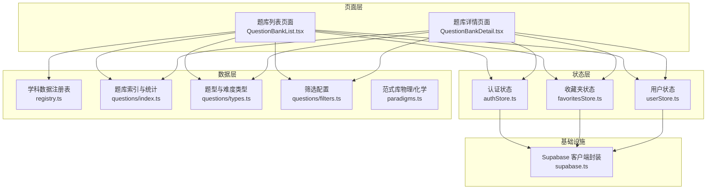
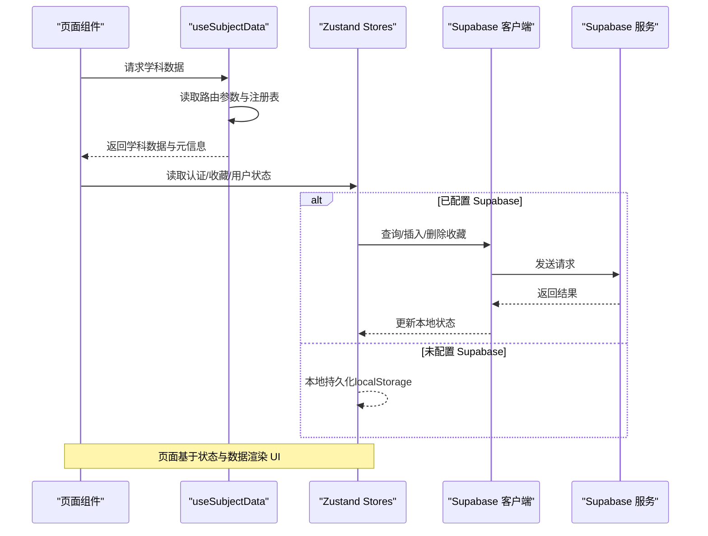
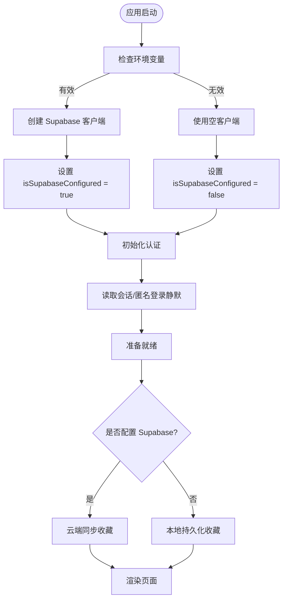
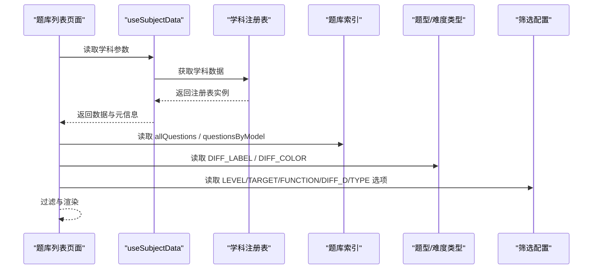
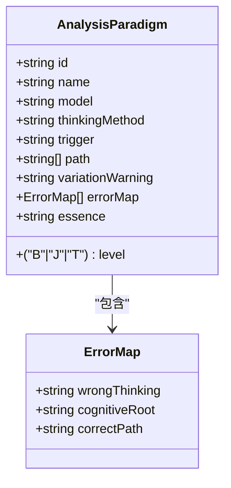
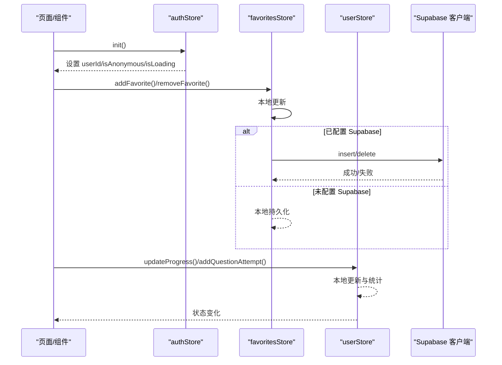
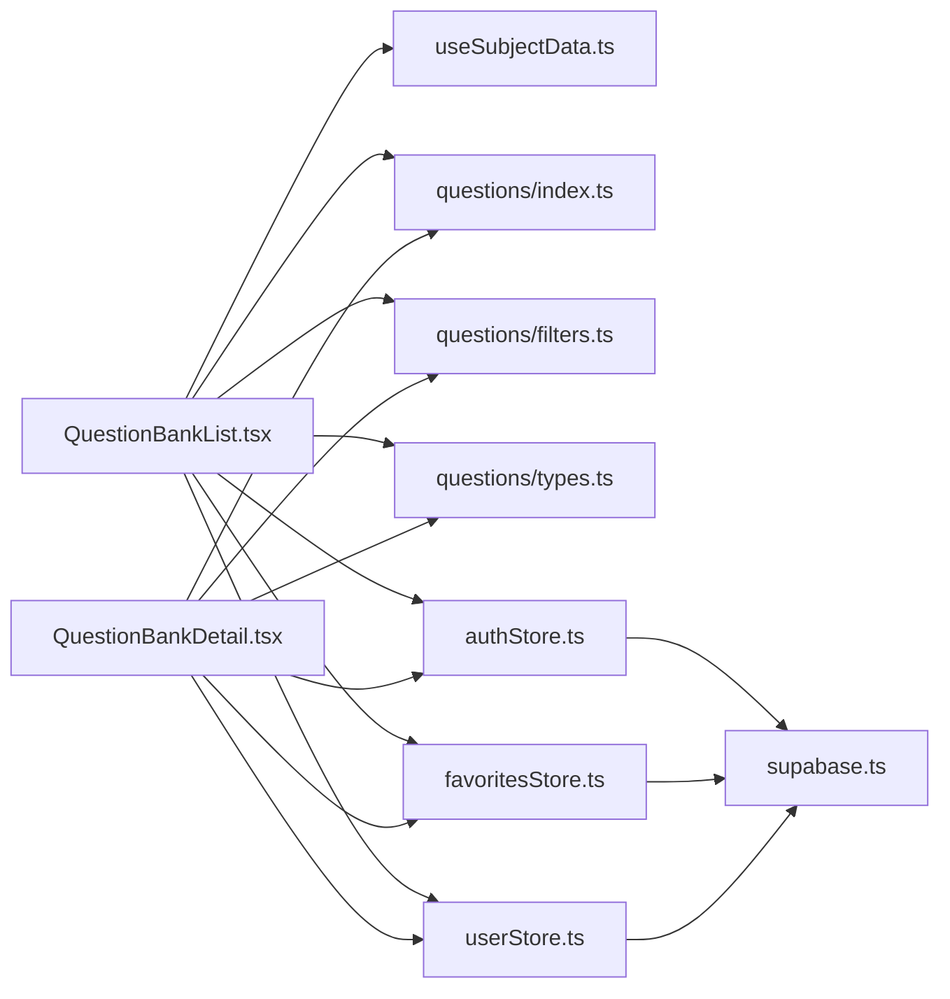

# 数据流架构

<cite>
**本文引用的文件**
- [src/lib/supabase.ts](file://src/lib/supabase.ts)
- [src/stores/authStore.ts](file://src/stores/authStore.ts)
- [src/stores/favoritesStore.ts](file://src/stores/favoritesStore.ts)
- [src/stores/userStore.ts](file://src/stores/userStore.ts)
- [src/stores/index.ts](file://src/stores/index.ts)
- [src/hooks/useSubjectData.ts](file://src/hooks/useSubjectData.ts)
- [src/data/registry.ts](file://src/data/registry.ts)
- [src/data/physics/questions/index.ts](file://src/data/physics/questions/index.ts)
- [src/data/physics/questions/types.ts](file://src/data/physics/questions/types.ts)
- [src/data/physics/questions/filters.ts](file://src/data/physics/questions/filters.ts)
- [src/data/physics/paradigms.ts](file://src/data/physics/paradigms.ts)
- [src/data/chemistry/paradigms.ts](file://src/data/chemistry/paradigms.ts)
- [src/sections/QuestionBankList.tsx](file://src/sections/QuestionBankList.tsx)
- [src/sections/QuestionBankDetail.tsx](file://src/sections/QuestionBankDetail.tsx)
</cite>

## 目录
1. [引言](#引言)
2. [项目结构](#项目结构)
3. [核心组件](#核心组件)
4. [架构总览](#架构总览)
5. [详细组件分析](#详细组件分析)
6. [依赖分析](#依赖分析)
7. [性能考量](#性能考量)
8. [故障排查指南](#故障排查指南)
9. [结论](#结论)
10. [附录](#附录)

## 引言
本文件面向“星耀平台”的前端数据流架构，聚焦以下目标：
- 解释数据驱动渲染的设计理念与实现机制
- 文档化 Supabase 保护原则与 isSupabaseConfigured 检查、优雅降级策略
- 完整梳理题库数据流：从静态数据到组件渲染
- 说明 paradigms.ts 的数据结构设计与模块化组织
- 描述状态管理的数据流向：用户数据、收藏夹数据与认证状态的同步
- 提供缓存策略、错误处理与性能优化建议
- 给出调试技巧与常见问题排查方法

## 项目结构
本项目采用“按领域/学科划分”的数据与页面组织方式：
- 数据层：按学科（物理、化学、数学等）组织概念、模型、公式、题库与范式
- 状态层：使用 Zustand 管理认证、用户学习进度、收藏夹等状态，并持久化
- 页面层：以章节（sections）组织路由页面，通过 hooks 与 stores 获取数据
- 基础设施：Supabase 客户端封装与环境变量保护

图表来源
- [src/sections/QuestionBankList.tsx:28-412](file://src/sections/QuestionBankList.tsx#L28-L412)
- [src/sections/QuestionBankDetail.tsx:92-185](file://src/sections/QuestionBankDetail.tsx#L92-L185)
- [src/data/registry.ts:4-38](file://src/data/registry.ts#L4-L38)
- [src/data/physics/questions/index.ts:1-45](file://src/data/physics/questions/index.ts#L1-L45)
- [src/data/physics/questions/types.ts:1-35](file://src/data/physics/questions/types.ts#L1-L35)
- [src/data/physics/questions/filters.ts:1-56](file://src/data/physics/questions/filters.ts#L1-L56)
- [src/data/physics/paradigms.ts:1-800](file://src/data/physics/paradigms.ts#L1-L800)
- [src/data/chemistry/paradigms.ts:1-25](file://src/data/chemistry/paradigms.ts#L1-L25)
- [src/stores/authStore.ts:1-63](file://src/stores/authStore.ts#L1-L63)
- [src/stores/userStore.ts:1-236](file://src/stores/userStore.ts#L1-L236)
- [src/stores/favoritesStore.ts:1-172](file://src/stores/favoritesStore.ts#L1-L172)
- [src/lib/supabase.ts:1-18](file://src/lib/supabase.ts#L1-L18)

章节来源
- [src/sections/QuestionBankList.tsx:28-412](file://src/sections/QuestionBankList.tsx#L28-L412)
- [src/sections/QuestionBankDetail.tsx:92-185](file://src/sections/QuestionBankDetail.tsx#L92-L185)
- [src/data/registry.ts:4-38](file://src/data/registry.ts#L4-L38)
- [src/data/physics/questions/index.ts:1-45](file://src/data/physics/questions/index.ts#L1-L45)
- [src/data/physics/questions/types.ts:1-35](file://src/data/physics/questions/types.ts#L1-L35)
- [src/data/physics/questions/filters.ts:1-56](file://src/data/physics/questions/filters.ts#L1-L56)
- [src/data/physics/paradigms.ts:1-800](file://src/data/physics/paradigms.ts#L1-L800)
- [src/data/chemistry/paradigms.ts:1-25](file://src/data/chemistry/paradigms.ts#L1-L25)
- [src/stores/authStore.ts:1-63](file://src/stores/authStore.ts#L1-L63)
- [src/stores/userStore.ts:1-236](file://src/stores/userStore.ts#L1-L236)
- [src/stores/favoritesStore.ts:1-172](file://src/stores/favoritesStore.ts#L1-L172)
- [src/lib/supabase.ts:1-18](file://src/lib/supabase.ts#L1-L18)

## 核心组件
- Supabase 客户端封装与保护
  - 通过环境变量初始化客户端，仅在 URL 与密钥均有效时创建实例
  - 提供 isSupabaseConfigured 标志，用于条件启用/降级
- 认证状态管理（Zustand）
  - 初始化会话，支持匿名登录与登出
  - 在未配置 Supabase 时静默降级
- 收藏夹状态管理（Zustand + Supabase）
  - 本地持久化与云端同步双向流动
  - 监听认证状态变化，自动触发云端同步
- 用户学习状态管理（Zustand）
  - 用户进度、错题、答题记录与学习统计
  - 按学科维度聚合统计，支持持久化
- 学科数据注册表与题库数据
  - 注册表抽象学科数据接口，统一获取概念、模型、公式、题库与范式
  - 物理题库按模型分组与统计，支持五维筛选

章节来源
- [src/lib/supabase.ts:1-18](file://src/lib/supabase.ts#L1-L18)
- [src/stores/authStore.ts:1-63](file://src/stores/authStore.ts#L1-L63)
- [src/stores/favoritesStore.ts:1-172](file://src/stores/favoritesStore.ts#L1-L172)
- [src/stores/userStore.ts:1-236](file://src/stores/userStore.ts#L1-L236)
- [src/data/registry.ts:4-38](file://src/data/registry.ts#L4-L38)
- [src/data/physics/questions/index.ts:1-45](file://src/data/physics/questions/index.ts#L1-L45)

## 架构总览
星耀平台采用“数据驱动渲染”：页面组件通过 hooks 与 stores 获取数据，数据来自本地静态模块与 Supabase 后端。认证状态作为全局开关，决定是否启用云端能力与同步。

图表来源
- [src/hooks/useSubjectData.ts:1-19](file://src/hooks/useSubjectData.ts#L1-L19)
- [src/stores/authStore.ts:1-63](file://src/stores/authStore.ts#L1-L63)
- [src/stores/favoritesStore.ts:1-172](file://src/stores/favoritesStore.ts#L1-L172)
- [src/lib/supabase.ts:1-18](file://src/lib/supabase.ts#L1-L18)

## 详细组件分析

### Supabase 保护原则与优雅降级
- 客户端创建保护
  - 仅当 VITE_SUPABASE_URL 与 VITE_SUPABASE_ANON_KEY 均存在时创建客户端实例
  - 否则返回空客户端并设置 isSupababseConfigured 为 false
- 优雅降级策略
  - 认证：init 中静默失败，不强制匿名登录，避免 422
  - 收藏：未配置时跳过云端同步，仅本地持久化
  - 初始化：在认证初始化完成后，再触发云端收藏同步

图表来源
- [src/lib/supabase.ts:1-18](file://src/lib/supabase.ts#L1-L18)
- [src/stores/authStore.ts:20-37](file://src/stores/authStore.ts#L20-L37)
- [src/stores/favoritesStore.ts:37-63](file://src/stores/favoritesStore.ts#L37-L63)
- [src/stores/favoritesStore.ts:154-171](file://src/stores/favoritesStore.ts#L154-L171)

章节来源
- [src/lib/supabase.ts:1-18](file://src/lib/supabase.ts#L1-L18)
- [src/stores/authStore.ts:20-37](file://src/stores/authStore.ts#L20-L37)
- [src/stores/favoritesStore.ts:37-63](file://src/stores/favoritesStore.ts#L37-L63)
- [src/stores/favoritesStore.ts:154-171](file://src/stores/favoritesStore.ts#L154-L171)

### 题库数据流：从静态数据到组件渲染
- 数据来源
  - 静态模块：questions/index.ts 汇总模型题库、按模型分组与统计
  - 类型定义：questions/types.ts 统一题型与难度字段
  - 筛选配置：questions/filters.ts 定义五维筛选枚举与默认值
  - 注册表：registry.ts 提供学科数据接口，供页面按学科获取
- 页面消费
  - QuestionBankList.tsx 使用 useSubjectData 获取学科数据，渲染题库列表与筛选
  - QuestionBankDetail.tsx 按模型过滤题目，按难度分组展示

图表来源
- [src/hooks/useSubjectData.ts:1-19](file://src/hooks/useSubjectData.ts#L1-L19)
- [src/data/registry.ts:4-38](file://src/data/registry.ts#L4-L38)
- [src/data/physics/questions/index.ts:1-45](file://src/data/physics/questions/index.ts#L1-L45)
- [src/data/physics/questions/types.ts:1-35](file://src/data/physics/questions/types.ts#L1-L35)
- [src/data/physics/questions/filters.ts:1-56](file://src/data/physics/questions/filters.ts#L1-L56)
- [src/sections/QuestionBankList.tsx:28-412](file://src/sections/QuestionBankList.tsx#L28-L412)

章节来源
- [src/data/physics/questions/index.ts:1-45](file://src/data/physics/questions/index.ts#L1-L45)
- [src/data/physics/questions/types.ts:1-35](file://src/data/physics/questions/types.ts#L1-L35)
- [src/data/physics/questions/filters.ts:1-56](file://src/data/physics/questions/filters.ts#L1-L56)
- [src/sections/QuestionBankList.tsx:28-412](file://src/sections/QuestionBankList.tsx#L28-L412)
- [src/sections/QuestionBankDetail.tsx:92-185](file://src/sections/QuestionBankDetail.tsx#L92-L185)

### paradigms.ts 的数据结构设计与模块化组织
- 设计要点
  - AnalysisParadigm 接口统一范式字段：id、name、model、thinkingMethod、level、trigger、path、errorMap、essence
  - level 映射：将数值难度映射为 B/J/T
  - errorMap 迁移：将旧版 commonMistakes 迁移到新的结构，并保留 essence 作为正确路径
  - 模块化：物理与化学分别维护各自的 paradigms.ts，物理版本内容丰富，化学版本为占位框架
- 组织方式
  - 按范式编号（如 PHY-R01~R90）组织，便于检索与导航
  - 与 strategies.ts 字段迁移对齐，保证接口一致性

图表来源
- [src/data/physics/paradigms.ts:15-30](file://src/data/physics/paradigms.ts#L15-L30)
- [src/data/physics/paradigms.ts:24-28](file://src/data/physics/paradigms.ts#L24-L28)
- [src/data/chemistry/paradigms.ts:6-21](file://src/data/chemistry/paradigms.ts#L6-L21)

章节来源
- [src/data/physics/paradigms.ts:1-800](file://src/data/physics/paradigms.ts#L1-L800)
- [src/data/chemistry/paradigms.ts:1-25](file://src/data/chemistry/paradigms.ts#L1-L25)

### 状态管理的数据流向与同步机制
- 认证状态
  - 初始化：读取会话，静默失败不强制匿名登录
  - 登录/登出：通过 Supabase auth 控制，更新本地状态
- 收藏夹状态
  - 本地优先：未配置 Supabase 时，持久化到 localStorage
  - 云端同步：配置后监听认证变化，自动拉取/推送收藏
  - 本地变更：先更新本地，再异步写入云端
- 用户学习状态
  - 进度、错题、答题记录与学习统计按学科维度聚合
  - 持久化策略：仅持久化必要字段，避免冗余

图表来源
- [src/stores/authStore.ts:20-37](file://src/stores/authStore.ts#L20-L37)
- [src/stores/favoritesStore.ts:65-94](file://src/stores/favoritesStore.ts#L65-L94)
- [src/stores/favoritesStore.ts:103-114](file://src/stores/favoritesStore.ts#L103-L114)
- [src/stores/userStore.ts:90-102](file://src/stores/userStore.ts#L90-L102)
- [src/stores/userStore.ts:173-177](file://src/stores/userStore.ts#L173-L177)

章节来源
- [src/stores/authStore.ts:1-63](file://src/stores/authStore.ts#L1-L63)
- [src/stores/favoritesStore.ts:1-172](file://src/stores/favoritesStore.ts#L1-L172)
- [src/stores/userStore.ts:1-236](file://src/stores/userStore.ts#L1-L236)

## 依赖分析
- 组件与数据层
  - QuestionBankList/Detail 依赖 useSubjectData 与学科注册表
  - 依赖题库索引与筛选配置，实现动态过滤
- 组件与状态层
  - 页面读取认证、收藏与用户状态，驱动 UI 交互
- 状态层与 Supabase
  - 认证与收藏依赖 Supabase 客户端
  - 未配置时，状态层走本地持久化路径

图表来源
- [src/sections/QuestionBankList.tsx:28-412](file://src/sections/QuestionBankList.tsx#L28-L412)
- [src/sections/QuestionBankDetail.tsx:92-185](file://src/sections/QuestionBankDetail.tsx#L92-L185)
- [src/hooks/useSubjectData.ts:1-19](file://src/hooks/useSubjectData.ts#L1-L19)
- [src/data/physics/questions/index.ts:1-45](file://src/data/physics/questions/index.ts#L1-L45)
- [src/data/physics/questions/filters.ts:1-56](file://src/data/physics/questions/filters.ts#L1-L56)
- [src/data/physics/questions/types.ts:1-35](file://src/data/physics/questions/types.ts#L1-L35)
- [src/stores/authStore.ts:1-63](file://src/stores/authStore.ts#L1-L63)
- [src/stores/favoritesStore.ts:1-172](file://src/stores/favoritesStore.ts#L1-L172)
- [src/stores/userStore.ts:1-236](file://src/stores/userStore.ts#L1-L236)
- [src/lib/supabase.ts:1-18](file://src/lib/supabase.ts#L1-L18)

章节来源
- [src/sections/QuestionBankList.tsx:28-412](file://src/sections/QuestionBankList.tsx#L28-L412)
- [src/sections/QuestionBankDetail.tsx:92-185](file://src/sections/QuestionBankDetail.tsx#L92-L185)
- [src/stores/index.ts:1-3](file://src/stores/index.ts#L1-L3)

## 性能考量
- 题库筛选
  - 将 allQuestions 与筛选条件组合过滤，建议在数据量增长时引入虚拟列表与分页
  - 对高频筛选项（难度、题型）使用索引或预计算统计
- 状态持久化
  - favorites 与 user 仅持久化必要字段，减少存储与序列化开销
  - 在未配置 Supabase 时避免云端往返
- 渲染优化
  - 使用 React.memo 与 useMemo 缓存筛选结果与统计
  - 列表渲染使用稳定 key，避免不必要的重排

## 故障排查指南
- Supabase 未配置
  - 现象：收藏无法同步、匿名登录不可用
  - 排查：检查环境变量是否正确注入
  - 处理：确认 isSupabaseConfigured 标志与初始化流程
- 认证初始化失败
  - 现象：用户状态加载长期处于 loading
  - 排查：查看 getSession 是否报错，确认网络与会话有效性
- 收藏同步异常
  - 现象：添加/删除收藏后云端不一致
  - 排查：检查 authStore.userId 是否存在，云端查询/插入/删除是否返回错误
- 题库筛选无结果
  - 现象：按筛选条件后题目为空
  - 排查：确认筛选枚举与题库字段是否一致，检查过滤逻辑

章节来源
- [src/lib/supabase.ts:1-18](file://src/lib/supabase.ts#L1-L18)
- [src/stores/authStore.ts:20-37](file://src/stores/authStore.ts#L20-L37)
- [src/stores/favoritesStore.ts:37-63](file://src/stores/favoritesStore.ts#L37-L63)
- [src/sections/QuestionBankList.tsx:57-71](file://src/sections/QuestionBankList.tsx#L57-L71)

## 结论
星耀平台通过“静态数据 + 状态管理 + Supabase 后端”的组合，实现了可扩展、可降级的数据驱动渲染。Supabase 保护与优雅降级确保在不同部署环境下稳定运行；题库数据流与范式库结构清晰，便于持续扩展；状态管理以 Zusta nd 为核心，围绕认证、收藏与用户学习状态形成闭环，支持本地与云端协同。

## 附录
- 关键接口与类型
  - AnalysisParadigm：范式统一结构
  - Question：题库统一结构
  - SubjectDataRegistry：学科数据注册表接口
- 常用枚举与选项
  - LEVEL_OPTIONS、TARGET_OPTIONS、FUNCTION_OPTIONS、DIFFICULTY_D_OPTIONS、PHYSICS_TYPE_OPTIONS