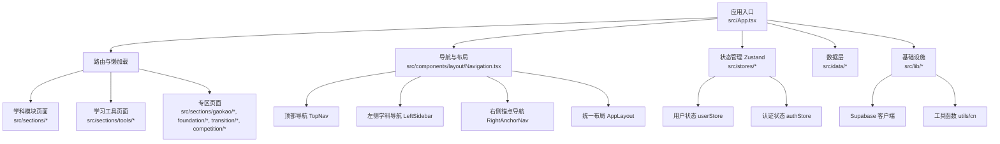
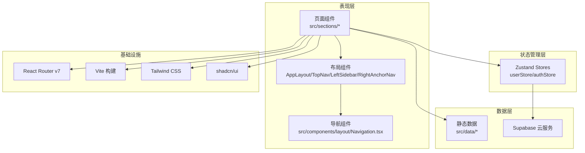
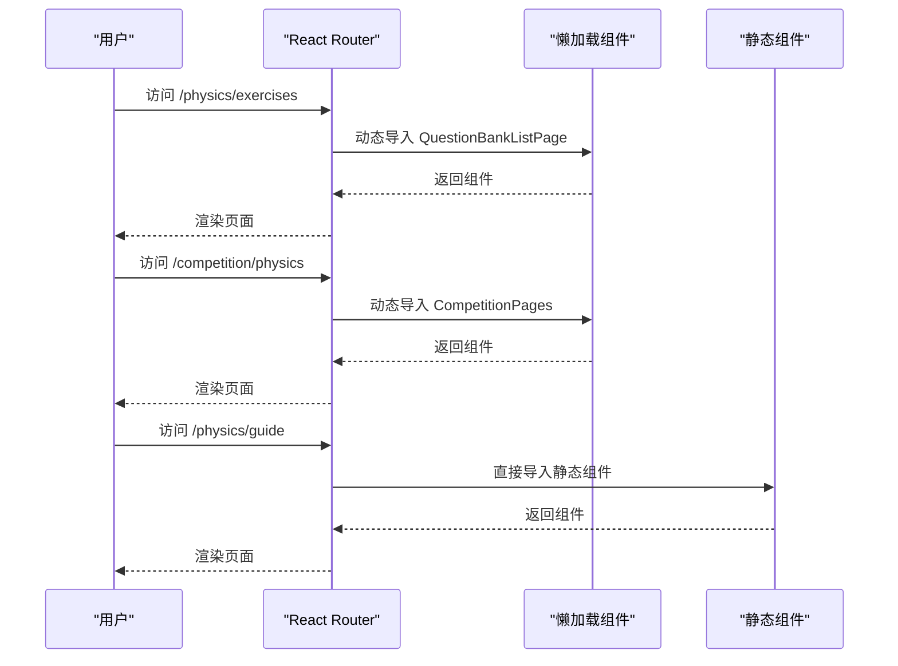
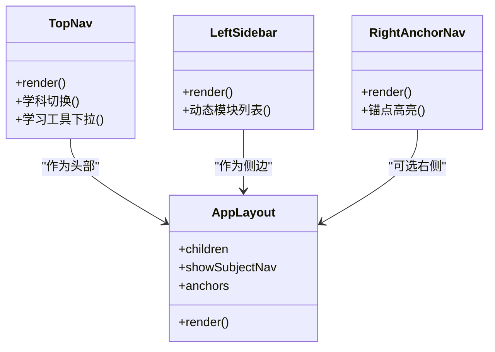
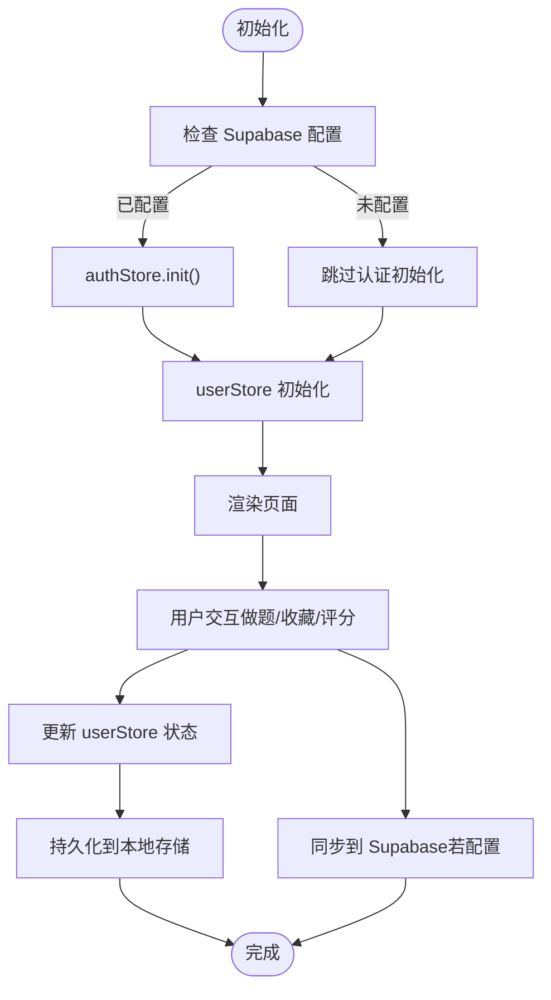
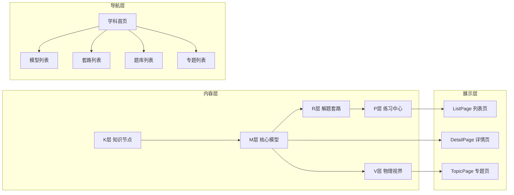
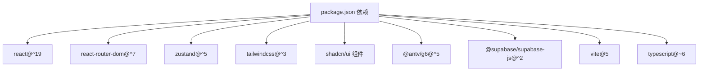

# 整体架构设计

<cite>
**本文档引用的文件**
- [ARCHITECTURE.md](file://ARCHITECTURE.md)
- [TECH_ARCHITECTURE.md](file://TECH_ARCHITECTURE.md)
- [SPEC.md](file://SPEC.md)
- [package.json](file://package.json)
- [vite.config.ts](file://vite.config.ts)
- [src/App.tsx](file://src/App.tsx)
- [src/components/layout/Navigation.tsx](file://src/components/layout/Navigation.tsx)
- [src/lib/supabase.ts](file://src/lib/supabase.ts)
- [src/stores/authStore.ts](file://src/stores/authStore.ts)
- [src/stores/userStore.ts](file://src/stores/userStore.ts)
- [src/data/subjects.ts](file://src/data/subjects.ts)
- [src/lib/utils.ts](file://src/lib/utils.ts)
</cite>

## 目录
1. [引言](#引言)
2. [项目结构](#项目结构)
3. [核心组件](#核心组件)
4. [架构总览](#架构总览)
5. [详细组件分析](#详细组件分析)
6. [依赖分析](#依赖分析)
7. [性能考量](#性能考量)
8. [故障排查指南](#故障排查指南)
9. [结论](#结论)
10. [附录](#附录)

## 引言
本架构设计文档面向“星耀高中教育平台”的整体实现，聚焦于模块化与组件化架构、多学科知识体系支撑、数据驱动渲染与可扩展性设计。文档基于实现层与方案层资料，系统阐述技术选型、路由与导航体系、状态管理、数据流与持久化、部署策略，并提供架构图与组件关系图，帮助开发者快速理解平台的设计思路与落地实践。

## 项目结构
星耀平台采用前端单页应用（SPA）架构，围绕“学科 + 模块”组织内容与功能，通过懒加载与统一布局骨架实现首屏优化与一致体验。核心目录与职责如下：
- src/components/layout：导航与页面骨架（TopNav、LeftSidebar、RightAnchorNav、AppLayout）
- src/sections：页面级组件（学科模块、工具页、专区页）
- src/data：学科数据与内容（模型、套路、题库、专题等）
- src/stores：状态管理（Zustand）
- src/lib：基础设施（Supabase、工具函数）
- public/dist：构建产物与字体资源

图表来源
- [src/App.tsx:1-214](file://src/App.tsx#L1-L214)
- [src/components/layout/Navigation.tsx:1-719](file://src/components/layout/Navigation.tsx#L1-L719)
- [src/stores/userStore.ts:1-236](file://src/stores/userStore.ts#L1-L236)
- [src/stores/authStore.ts:1-63](file://src/stores/authStore.ts#L1-L63)
- [src/lib/supabase.ts:1-18](file://src/lib/supabase.ts#L1-L18)
- [src/lib/utils.ts:1-7](file://src/lib/utils.ts#L1-L7)

章节来源
- [ARCHITECTURE.md:27-84](file://ARCHITECTURE.md#L27-L84)
- [src/App.tsx:1-214](file://src/App.tsx#L1-L214)
- [src/components/layout/Navigation.tsx:1-719](file://src/components/layout/Navigation.tsx#L1-L719)

## 核心组件
- 导航与布局系统：TopNav（学科切换与学习工具）、LeftSidebar（学科模块导航）、RightAnchorNav（详情页章节锚点）、AppLayout（统一骨架）
- 页面组件：学科模块（指南、图谱、模型、知识节点、公式库、套路、思维方法、视界、练习、错题、收藏、报告）、学习工具（诊断、规划、方法）、专区（高考/强基/衔接/竞赛）
- 状态管理：Zustand（用户进度、错题、学习统计、认证状态）
- 数据层：TypeScript 静态数据文件（模型、套路、题库、专题），配合 Supabase 实现云端同步
- 基础设施：Vite 构建、Tailwind CSS 样式、shadcn/ui 组件库、KaTeX（可选）、AntV G6（认知图谱）

章节来源
- [ARCHITECTURE.md:121-172](file://ARCHITECTURE.md#L121-L172)
- [TECH_ARCHITECTURE.md:295-320](file://TECH_ARCHITECTURE.md#L295-L320)
- [src/stores/userStore.ts:1-236](file://src/stores/userStore.ts#L1-L236)
- [src/stores/authStore.ts:1-63](file://src/stores/authStore.ts#L1-L63)

## 架构总览
星耀平台采用“内容即数据 + 组件即页面 + 状态即服务”的架构模式：
- 内容即数据：学科数据以 TypeScript 文件组织，静态导入，便于版本管理与变更追踪
- 组件即页面：页面组件复用统一骨架（AppLayout），通过路由懒加载与静态导入实现性能与可维护性的平衡
- 状态即服务：Zustand 管理用户状态与学习数据，Supabase 提供云端同步与匿名认证
- 数据驱动渲染：Markdown + KaTeX 内容渲染，认知图谱（G6）可视化展示知识网络

图表来源
- [src/App.tsx:1-214](file://src/App.tsx#L1-L214)
- [src/components/layout/Navigation.tsx:1-719](file://src/components/layout/Navigation.tsx#L1-L719)
- [src/stores/userStore.ts:1-236](file://src/stores/userStore.ts#L1-L236)
- [src/stores/authStore.ts:1-63](file://src/stores/authStore.ts#L1-L63)
- [src/lib/supabase.ts:1-18](file://src/lib/supabase.ts#L1-L18)
- [package.json:14-67](file://package.json#L14-L67)

## 详细组件分析

### 路由与懒加载
- 题库与竞赛专区采用懒加载，减少首屏体积与崩溃链风险
- 旧路由统一通过 PracticeRedirect 处理，保持路由表简洁
- 基于 basename 与静态导入结合，满足 GitHub Pages 部署要求

图表来源
- [src/App.tsx:7-50](file://src/App.tsx#L7-L50)
- [ARCHITECTURE.md:29-44](file://ARCHITECTURE.md#L29-L44)

章节来源
- [ARCHITECTURE.md:27-84](file://ARCHITECTURE.md#L27-L84)
- [src/App.tsx:1-214](file://src/App.tsx#L1-L214)

### 导航与布局系统
- TopNav：学科切换、学习工具下拉、移动端抽屉菜单
- LeftSidebar：按学科动态生成模块导航，支持桌面/移动端自适应
- RightAnchorNav：详情页章节锚点导航，基于 IntersectionObserver 实现
- AppLayout：统一骨架，支持左侧学科导航与右侧锚点导航

图表来源
- [src/components/layout/Navigation.tsx:369-719](file://src/components/layout/Navigation.tsx#L369-L719)

章节来源
- [ARCHITECTURE.md:87-119](file://ARCHITECTURE.md#L87-L119)
- [src/components/layout/Navigation.tsx:1-719](file://src/components/layout/Navigation.tsx#L1-L719)

### 状态管理与数据流
- 用户状态：Zustand userStore 管理进度、错题、学习统计与本地持久化
- 认证状态：Zustand authStore 管理匿名登录与会话
- Supabase 保护：isSupabaseConfigured 控制云端功能开关，未配置时安静降级
- 题库数据流：静态数据按模型分组，做题页按索引读取，避免网络请求

图表来源
- [src/stores/authStore.ts:20-37](file://src/stores/authStore.ts#L20-L37)
- [src/stores/userStore.ts:46-236](file://src/stores/userStore.ts#L46-L236)
- [src/lib/supabase.ts:17-18](file://src/lib/supabase.ts#L17-L18)
- [ARCHITECTURE.md:205-236](file://ARCHITECTURE.md#L205-L236)

章节来源
- [ARCHITECTURE.md:205-236](file://ARCHITECTURE.md#L205-L236)
- [src/stores/authStore.ts:1-63](file://src/stores/authStore.ts#L1-L63)
- [src/stores/userStore.ts:1-236](file://src/stores/userStore.ts#L1-L236)
- [src/lib/supabase.ts:1-18](file://src/lib/supabase.ts#L1-L18)

### 多学科知识体系与模块化设计
- 内容三层结构：K层（知识节点）、M层（核心模型）、R层（解题套路），配合 V层（视界）与 P层（练习）
- 模块分类：A类（静态内容）、B类（内容+练习+状态）、C类（学习记录）
- 扩展路径：复制既有模块结构，替换数据源与路由，即可快速扩展新学科

图表来源
- [SPEC.md:9-61](file://SPEC.md#L9-L61)
- [TECH_ARCHITECTURE.md:322-377](file://TECH_ARCHITECTURE.md#L322-L377)

章节来源
- [SPEC.md:9-61](file://SPEC.md#L9-L61)
- [TECH_ARCHITECTURE.md:322-377](file://TECH_ARCHITECTURE.md#L322-L377)

### 数据驱动渲染与可扩展性
- Markdown + KaTeX：统一内容渲染，支持公式与富文本
- 认知图谱（AntV G6）：基于 M层模型构建知识网络
- 组件复用：AppLayout、SharedDetail、MarkdownRenderer 等组件在多模块复用
- 路由与导航：SubjectMeta 与 SUBJECTS 统一管理学科元数据与路由前缀，便于扩展

章节来源
- [TECH_ARCHITECTURE.md:64-84](file://TECH_ARCHITECTURE.md#L64-L84)
- [src/data/subjects.ts:1-30](file://src/data/subjects.ts#L1-L30)

## 依赖分析
- 技术栈：React 19、Vite 5、TypeScript、React Router v7、Zustand、Tailwind CSS、shadcn/ui、KaTeX、AntV G6、Supabase
- 构建与别名：Vite 配置 @ 别名与 base 路径，适配 GitHub Pages
- 组件库：Radix UI 组合、Lucide 图标、Recharts 图表、Sonner 通知等

图表来源
- [package.json:14-67](file://package.json#L14-L67)
- [vite.config.ts:1-14](file://vite.config.ts#L1-L14)

章节来源
- [package.json:14-67](file://package.json#L14-L67)
- [vite.config.ts:1-14](file://vite.config.ts#L1-L14)

## 性能考量
- 首屏优化：路由懒加载、静态导入、Suspense 占位
- 体积控制：按需加载题库与竞赛专区，避免 bundle 过大
- 渲染优化：MarkdownRenderer + KaTeX 渲染，组件复用与最小重绘
- 构建优化：Vite 构建、TypeScript 类型检查、Tailwind CSS 按需样式

章节来源
- [ARCHITECTURE.md:29-44](file://ARCHITECTURE.md#L29-L44)
- [vite.config.ts:1-14](file://vite.config.ts#L1-L14)

## 故障排查指南
- Supabase 未配置：isSupabaseConfigured 为 false 时，认证与云端功能将安静降级
- KaTeX CDN 问题：ENABLE_KATEX 当前禁用，需解决 CDN 后再启用
- 导航高亮问题：useCurrentModule 与 LeftSidebar 存在已知 Bug，需修复模块高亮错位
- 题库与专区内容缺失：部分学科题库与强基专区内容为空，需补齐数据

章节来源
- [ARCHITECTURE.md:207-223](file://ARCHITECTURE.md#L207-L223)
- [ARCHITECTURE.md:321-332](file://ARCHITECTURE.md#L321-L332)

## 结论
星耀平台通过模块化与组件化设计，实现了多学科知识体系的可扩展与可维护；借助数据驱动渲染与状态管理，提升了用户体验与学习效果；结合懒加载与统一布局，兼顾性能与一致性。未来可在全局搜索、跨学科关联、题库分层加载等方面持续优化，逐步完善平台能力。

## 附录
- 部署：GitHub Pages + GitHub Actions，无需额外 SPA 路由配置
- 环境变量：VITE_SUPABASE_URL 与 VITE_SUPABASE_ANON_KEY
- 构建命令：TypeScript 检查 + Vite 构建

章节来源
- [ARCHITECTURE.md:264-318](file://ARCHITECTURE.md#L264-L318)
- [package.json:6-13](file://package.json#L6-L13)