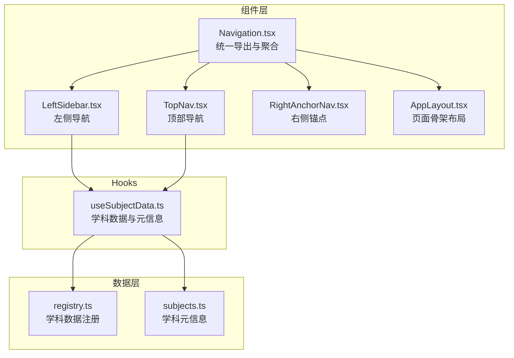
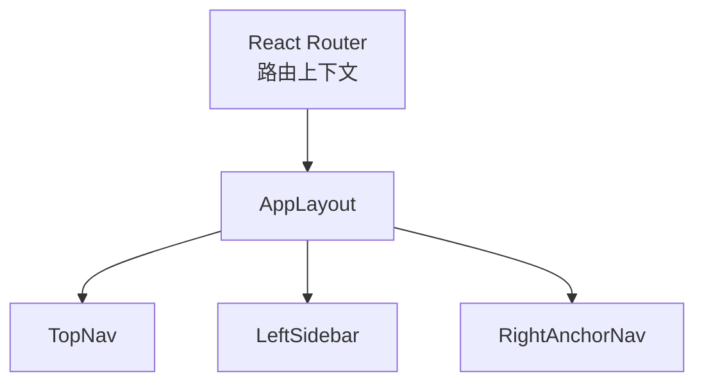
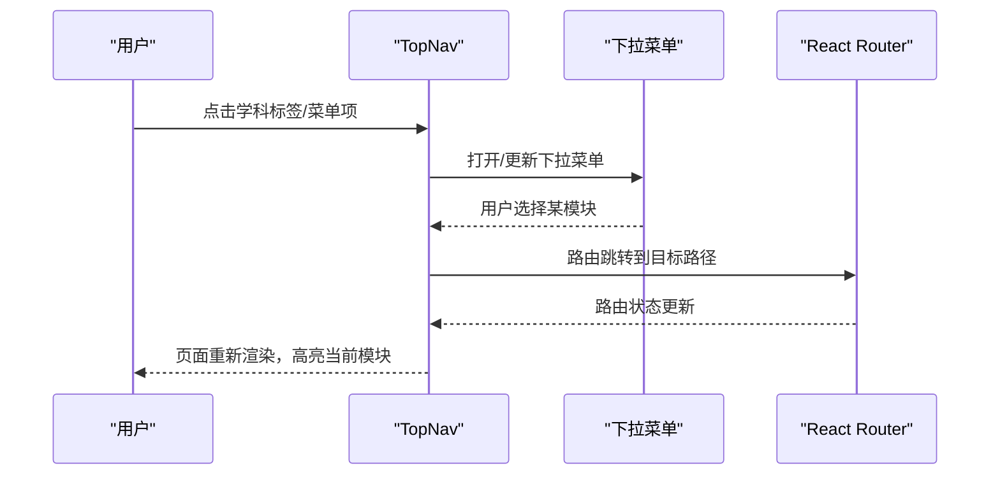
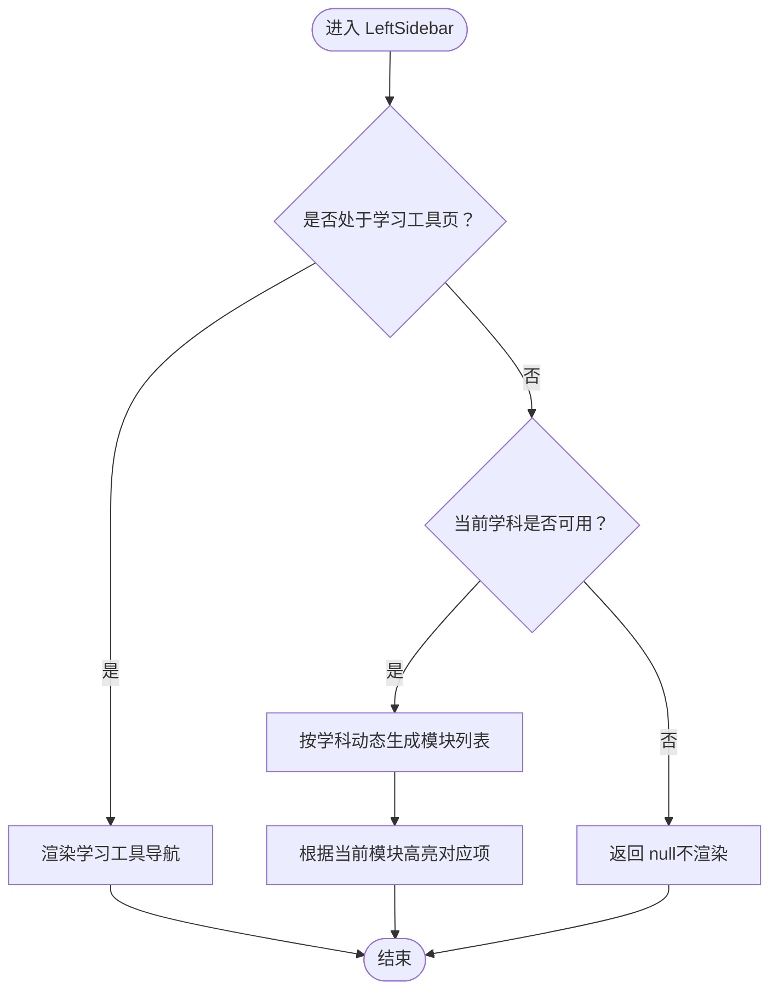
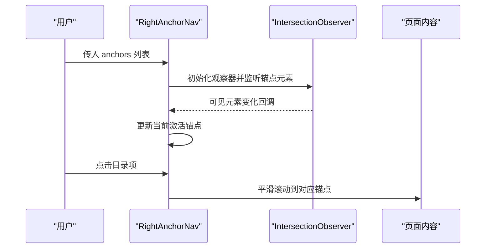
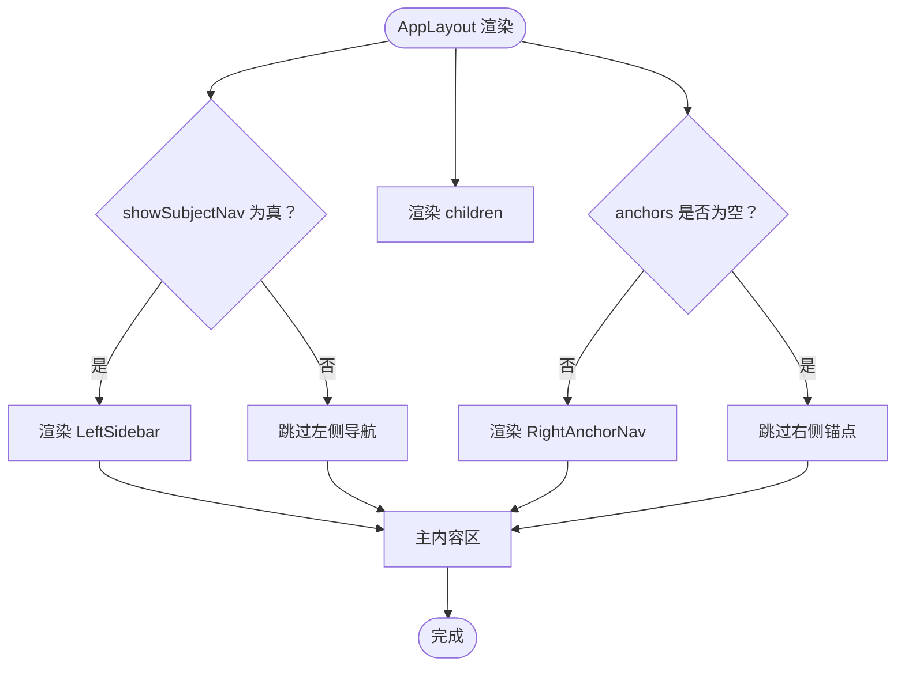
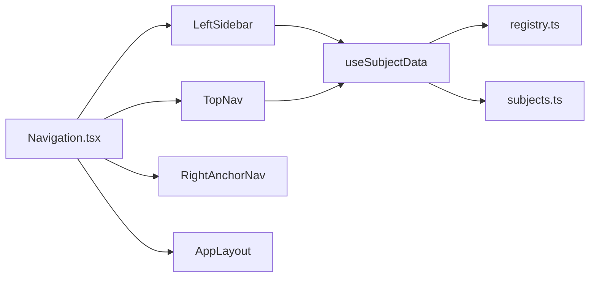

# 组件系统

<cite>
**本文引用的文件**
- [Navigation.tsx](file://src/components/layout/Navigation.tsx)
- [useSubjectData.ts](file://src/hooks/useSubjectData.ts)
- [ARCHITECTURE.md](file://ARCHITECTURE.md)
- [UI_NAVIGATION.md](file://UI_NAVIGATION.md)
</cite>

## 目录
1. [引言](#引言)
2. [项目结构](#项目结构)
3. [核心组件](#核心组件)
4. [架构总览](#架构总览)
5. [详细组件分析](#详细组件分析)
6. [依赖分析](#依赖分析)
7. [性能考虑](#性能考虑)
8. [故障排查指南](#故障排查指南)
9. [结论](#结论)
10. [附录](#附录)

## 引言
本文件面向“星耀平台”的组件系统，聚焦导航与布局子系统，系统化解析组件化架构的设计理念与实现方式。重点说明 Navigation 组件的拆分策略与职责分工，涵盖 nav-data.ts、nav-hooks.ts、TopNav.tsx、LeftSidebar.tsx、RightAnchorNav.tsx、AppLayout.tsx 的角色与协作；文档化 AppLayout 的布局规则与使用方式，包括 showSubjectNav 属性与 anchors 参数；解释组件间的通信机制、props 传递与事件处理；总结组件复用策略、扩展方式与定制化选项，并提供开发最佳实践与性能优化建议。

## 项目结构
星耀平台采用“按功能域与层级混合”的组织方式：页面级组件位于 sections 下，业务组件位于 components 下，数据与工具位于 data 与 hooks 下。导航与布局相关的核心代码集中在 components/layout/Navigation.tsx，同时配合 hooks/useSubjectData.ts 提供路由参数到学科数据的映射。

图表来源
- [Navigation.tsx:369-718](file://src/components/layout/Navigation.tsx#L369-L718)
- [useSubjectData.ts:1-19](file://src/hooks/useSubjectData.ts#L1-L19)

章节来源
- [ARCHITECTURE.md:84-119](file://ARCHITECTURE.md#L84-L119)
- [UI_NAVIGATION.md:10-43](file://UI_NAVIGATION.md#L10-L43)

## 核心组件
本节从职责、输入输出与交互行为三个维度，对 Navigation 体系的关键组件进行概览式说明。

- TopNav（顶部导航）
  - 职责：展示平台 Logo、学科切换按钮、当前学科下拉菜单、学习工具下拉菜单；移动端汉堡菜单触发抽屉式导航。
  - 输入：无外部 props；通过路由上下文与学科配置决定高亮与可用项。
  - 输出：点击跳转至目标路由；移动端打开/关闭侧边栏。
- LeftSidebar（左侧导航）
  - 职责：根据当前学科或工具页，渲染对应的模块导航列表；桌面端固定宽度侧栏，移动端隐藏。
  - 输入：当前学科、当前模块、是否处于工具页。
  - 输出：点击跳转至模块详情页；高亮当前模块。
- RightAnchorNav（右侧锚点导航）
  - 职责：基于传入的锚点列表生成右侧目录索引；通过 IntersectionObserver 实时更新当前激活锚点。
  - 输入：anchors（id、label）数组。
  - 输出：点击跳转到对应锚点；高亮当前可见锚点。
- AppLayout（页面骨架布局）
  - 职责：统一承载 TopNav、LeftSidebar、主内容区与可选右侧内容；支持右侧锚点导航的条件渲染。
  - 输入：children、showSubjectNav、anchors、rightContent。
  - 输出：按布局规则组织页面结构。
- useSubjectData（学科数据钩子）
  - 职责：从路由参数解析学科标识，查询学科数据与元信息。
  - 输入：路由 params（subject）。
  - 输出：data、subject、subjectMeta。

章节来源
- [Navigation.tsx:369-718](file://src/components/layout/Navigation.tsx#L369-L718)
- [useSubjectData.ts:1-19](file://src/hooks/useSubjectData.ts#L1-L19)

## 架构总览
Navigation 体系遵循“关注点分离”原则，将数据、逻辑与 UI 分层，形成可测试、可复用、可扩展的组件族。组件间通过 props 与路由上下文进行松耦合通信，布局通过 AppLayout 统一编排。

图表来源
- [Navigation.tsx:690-718](file://src/components/layout/Navigation.tsx#L690-L718)

章节来源
- [ARCHITECTURE.md:121-132](file://ARCHITECTURE.md#L121-L132)
- [UI_NAVIGATION.md:10-21](file://UI_NAVIGATION.md#L10-L21)

## 详细组件分析

### TopNav（顶部导航）
- 设计要点
  - 桌面端：学科标签云 + 当前学科下拉菜单 + 学习工具下拉菜单。
  - 移动端：汉堡菜单抽屉，包含学习工具、学科选择与模块导航。
  - 交互：点击标签或菜单项触发路由跳转；移动端点击后自动关闭抽屉。
- 数据与逻辑
  - 学科列表与模块配置集中于组件内部，便于快速迭代与维护。
  - 通过 useLocation 与路径前缀判断当前学科与模块，驱动高亮与下拉项生成。
- 可定制性
  - 支持为每个学科配置颜色、可用性与链接；模块项可增删改描述与图标。
- 性能注意
  - 下拉菜单项按需渲染；移动端抽屉按需挂载，避免不必要的初始开销。

图表来源
- [Navigation.tsx:369-547](file://src/components/layout/Navigation.tsx#L369-L547)

章节来源
- [Navigation.tsx:369-547](file://src/components/layout/Navigation.tsx#L369-L547)

### LeftSidebar（左侧导航）
- 设计要点
  - 桌面端固定宽度侧栏，滚动区域承载模块列表；移动端隐藏。
  - 高亮当前模块，使用箭头指示当前项；图标与文字结合提升可读性。
- 逻辑与数据
  - 优先判定是否处于学习工具页，若是则渲染工具导航；否则根据当前学科动态生成模块列表。
  - 通过 useCurrentModule 与 useCurrentSubject 判定高亮项。
- 可扩展性
  - 新增学科时，只需在模块配置中添加对应项即可；无需修改组件内部逻辑。
- 注意事项
  - 文档指出存在“所有科目桌面板用物理模块”的硬编码问题，应在后续版本中改为按学科动态生成。

图表来源
- [Navigation.tsx:550-631](file://src/components/layout/Navigation.tsx#L550-L631)

章节来源
- [Navigation.tsx:550-631](file://src/components/layout/Navigation.tsx#L550-L631)
- [ARCHITECTURE.md:112-118](file://ARCHITECTURE.md#L112-L118)

### RightAnchorNav（右侧锚点导航）
- 设计要点
  - 仅在桌面端（xl及以上）显示；基于传入 anchors 渲染目录索引。
  - 通过 IntersectionObserver 实时检测当前可见锚点，保持滚动与目录同步。
- 交互与状态
  - 点击目录项跳转到对应锚点；激活态高亮并带有背景强调。
- 性能优化
  - 仅在 anchors 非空时渲染；观察器在依赖变更时重建，避免重复监听无效元素。

图表来源
- [Navigation.tsx:634-687](file://src/components/layout/Navigation.tsx#L634-L687)

章节来源
- [Navigation.tsx:634-687](file://src/components/layout/Navigation.tsx#L634-L687)

### AppLayout（页面骨架布局）
- 设计要点
  - 统一承载顶部导航、左侧导航、主内容区与可选右侧内容；支持右侧锚点导航的条件渲染。
  - 通过 showSubjectNav 控制是否渲染左侧导航；通过 anchors 控制右侧锚点导航的显示与内容。
- 使用方式
  - 在章节详情页（如模型详情、套路详情、视觉视界详情）中启用 showSubjectNav 与 anchors。
  - 在首页、模块网格页等场景禁用左侧导航与锚点导航。
- 布局规则
  - 主内容区最大宽度约束与居中；右侧锚点导航仅在特定页面启用。

图表来源
- [Navigation.tsx:690-718](file://src/components/layout/Navigation.tsx#L690-L718)
- [UI_NAVIGATION.md:10-37](file://UI_NAVIGATION.md#L10-L37)

章节来源
- [Navigation.tsx:690-718](file://src/components/layout/Navigation.tsx#L690-L718)
- [UI_NAVIGATION.md:10-37](file://UI_NAVIGATION.md#L10-L37)

### 组件间通信与事件处理
- 路由与上下文
  - TopNav 与 LeftSidebar 均依赖 useLocation 获取当前路径，据此判断学科与模块高亮。
  - 点击菜单项触发 Link 跳转，路由状态变化后组件重新渲染。
- Props 传递
  - AppLayout 将 anchors 作为 RightAnchorNav 的输入；通过 showSubjectNav 控制 LeftSidebar 的显示。
  - RightAnchorNav 通过 a[href] 实现锚点跳转，无需额外事件处理。
- 事件处理
  - 移动端抽屉通过 Sheet 的 open/onOpenChange 管理开关状态；点击菜单项后自动关闭抽屉。
  - IntersectionObserver 在右侧锚点导航中用于实时更新激活状态。

章节来源
- [Navigation.tsx:369-718](file://src/components/layout/Navigation.tsx#L369-L718)

### 复用策略、扩展方式与定制化选项
- 复用策略
  - AppLayout 作为页面骨架，统一承载导航与内容，减少重复布局代码。
  - TopNav 与 LeftSidebar 通过学科配置与钩子函数实现跨页面复用。
- 扩展方式
  - 新增学科：在模块配置中添加学科项，即可自动生成桌面端下拉与移动端侧栏内容。
  - 新增模块：在对应学科模块列表中添加新项，即可在导航中自动出现。
- 定制化选项
  - 每个学科可配置颜色、可用性与链接；模块项可自定义图标与描述。
  - AppLayout 支持 rightContent 插槽，满足特殊页面的右侧辅助内容需求。

章节来源
- [Navigation.tsx:48-59](file://src/components/layout/Navigation.tsx#L48-L59)
- [Navigation.tsx:188-295](file://src/components/layout/Navigation.tsx#L188-L295)
- [ARCHITECTURE.md:91-102](file://ARCHITECTURE.md#L91-L102)

## 依赖分析
- 组件依赖
  - Navigation.tsx 聚合 TopNav、LeftSidebar、RightAnchorNav、AppLayout。
  - LeftSidebar 与 TopNav 依赖 useSubjectData 获取学科数据与元信息。
- 外部依赖
  - React Router（Link、useLocation）用于路由跳转与路径判断。
  - UI 组件库（Sheet、DropdownMenu、Button、ScrollArea 等）提供交互与布局能力。
- 数据依赖
  - useSubjectData 依赖 data/registry 与 data/subjects 提供学科数据与元信息。

图表来源
- [Navigation.tsx:1-16](file://src/components/layout/Navigation.tsx#L1-L16)
- [useSubjectData.ts:1-19](file://src/hooks/useSubjectData.ts#L1-L19)

章节来源
- [Navigation.tsx:1-16](file://src/components/layout/Navigation.tsx#L1-L16)
- [useSubjectData.ts:1-19](file://src/hooks/useSubjectData.ts#L1-L19)

## 性能考虑
- 渲染优化
  - 移动端抽屉按需挂载，避免初始渲染负担；桌面端侧栏固定宽度，减少布局抖动。
  - IntersectionObserver 仅在 anchors 非空时初始化，降低无关监听成本。
- 事件与状态
  - 高亮逻辑基于路径匹配，避免复杂状态管理；移动端抽屉状态通过受控属性管理，保证交互一致性。
- 可维护性
  - 数据与逻辑分离，模块配置集中管理，便于性能回归与功能扩展。

## 故障排查指南
- 已知问题
  - useCurrentModule 高亮错位：物理子路径可能提前返回“guide”，导致当前模块高亮不准确。
  - 桌面端硬编码：所有科目桌面板使用物理模块列表，应改为按学科动态生成。
- 排查步骤
  - 检查路径匹配逻辑与模块映射，确认当前模块识别是否符合预期。
  - 对照学科模块配置，确认模块 id 与路径规则一致。
  - 在移动端抽屉中逐一验证菜单项是否正确跳转与关闭。
- 临时规避
  - 在模块映射尚未完善前，可通过调整路径规则或增加更精确的匹配分支来缓解高亮错位问题。

章节来源
- [ARCHITECTURE.md:112-118](file://ARCHITECTURE.md#L112-L118)

## 结论
星耀平台的 Navigation 体系通过组件化与分层设计，实现了导航与布局的高度复用与灵活扩展。TopNav、LeftSidebar、RightAnchorNav、AppLayout 各司其职，配合 useSubjectData 与路由上下文，形成清晰的职责边界与稳定的交互体验。未来可在模块映射与动态生成方面进一步完善，以消除已知问题并提升可维护性与性能表现。

## 附录
- AppLayout 使用示例（概念性说明）
  - 在章节详情页启用学科导航与锚点导航：showSubjectNav=true，anchors 传入章节标题锚点数组。
  - 在首页与网格页禁用导航：showSubjectNav=false，anchors 留空。
- UI 与导航规范
  - 主内容区最大宽度与居中；右侧锚点导航仅在特定页面启用；移动端交互与尺寸规范详见 UI 导航规范文档。

章节来源
- [UI_NAVIGATION.md:10-43](file://UI_NAVIGATION.md#L10-L43)