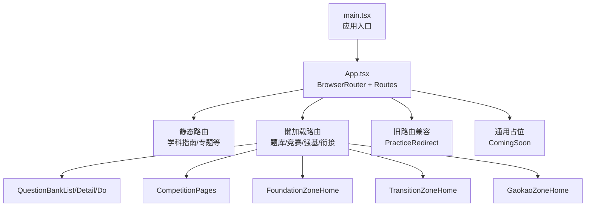
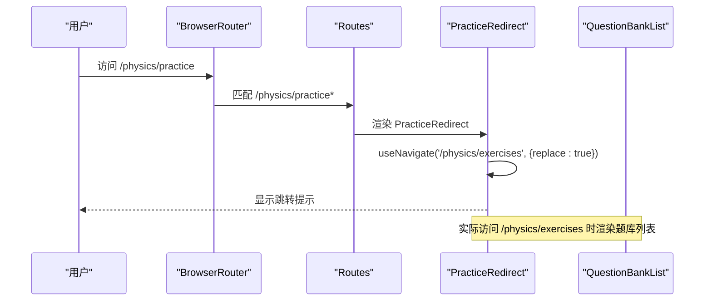
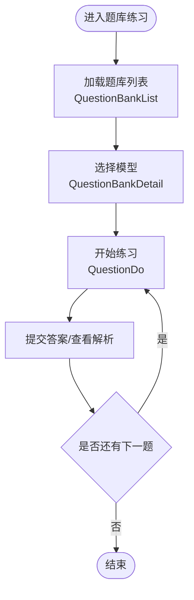
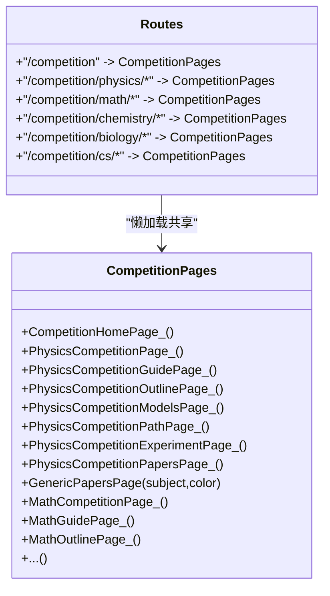
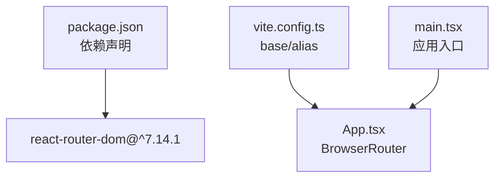

# 路由架构

<cite>
**本文档引用的文件**
- [App.tsx](file://src/App.tsx)
- [main.tsx](file://src/main.tsx)
- [vite.config.ts](file://vite.config.ts)
- [PracticeRedirect.tsx](file://src/sections/PracticeRedirect.tsx)
- [CompetitionPages.tsx](file://src/sections/CompetitionPages.tsx)
- [FoundationZoneHome.tsx](file://src/sections/foundation/FoundationZoneHome.tsx)
- [TransitionZoneHome.tsx](file://src/sections/transition/TransitionZoneHome.tsx)
- [GaokaoZoneHome.tsx](file://src/sections/gaokao/GaokaoZoneHome.tsx)
- [QuestionBankList.tsx](file://src/sections/QuestionBankList.tsx)
- [QuestionBankDetail.tsx](file://src/sections/QuestionBankDetail.tsx)
- [QuestionDo.tsx](file://src/sections/QuestionDo.tsx)
- [Navigation.tsx](file://src/components/layout/Navigation.tsx)
- [authStore.ts](file://src/stores/authStore.ts)
- [package.json](file://package.json)
- [ARCHITECTURE.md](file://ARCHITECTURE.md)
</cite>

## 目录
1. [引言](#引言)
2. [项目结构](#项目结构)
3. [核心组件](#核心组件)
4. [架构总览](#架构总览)
5. [详细组件分析](#详细组件分析)
6. [依赖分析](#依赖分析)
7. [性能考虑](#性能考虑)
8. [故障排除指南](#故障排除指南)
9. [结论](#结论)

## 引言
本文件系统性梳理星耀平台的路由架构，基于 React Router v7 的配置与懒加载实践，覆盖题库路由、竞赛路由、强基计划路由等模块的分离策略；文档化静态路由与动态路由的定义方式，解释旧路由兼容机制（PracticeRedirect），说明路由参数传递、嵌套路由与路由守卫的使用，并提供性能优化与调试建议。

## 项目结构
- 路由入口位于应用根组件，通过 BrowserRouter 包裹 Routes 并声明所有路由规则。
- 采用按需懒加载策略，将大型页面组件（题库、竞赛、强基、衔接等）以 lazy 方式导入，减少首屏包体。
- 通过 Vite 的别名与 base 配置，支持子路径部署（basename="/stellar-glory/"）。
- 导航组件与路由联动，提供学科模块导航与页面骨架布局。

图表来源
- [main.tsx:14-18](file://src/main.tsx#L14-L18)
- [App.tsx:77-211](file://src/App.tsx#L77-L211)

章节来源
- [main.tsx:14-18](file://src/main.tsx#L14-L18)
- [vite.config.ts:5-13](file://vite.config.ts#L5-L13)
- [App.tsx:77-211](file://src/App.tsx#L77-L211)

## 核心组件
- 路由容器与懒加载
  - 在 App.tsx 中集中声明路由，使用 lazy 导入大型页面组件，配合 Suspense 提供加载占位。
  - 题库相关路由采用独立的懒加载组件，确保首屏不加载。
  - 竞赛专区路由共用同一懒加载组件，实现代码共享与下载复用。
- 旧路由兼容
  - PracticeRedirect 将旧 practice 路径自动跳转至新的题库路径，保证历史链接可用。
- 页面骨架与导航
  - AppLayout 作为统一布局容器，结合 Navigation.tsx 的 TopNav/LeftSidebar/RightAnchorNav 提供导航与锚点。
- 认证与路由初始化
  - 应用启动时初始化主题与认证状态，为路由守卫与用户态功能提供基础。

章节来源
- [App.tsx:7-22](file://src/App.tsx#L7-L22)
- [App.tsx:96-104](file://src/App.tsx#L96-L104)
- [PracticeRedirect.tsx:6-18](file://src/sections/PracticeRedirect.tsx#L6-L18)
- [Navigation.tsx:698-718](file://src/components/layout/Navigation.tsx#L698-L718)
- [authStore.ts:20-37](file://src/stores/authStore.ts#L20-L37)

## 架构总览
星耀平台路由采用“静态路由 + 懒加载路由”的混合策略：
- 静态路由：学科指南、专题页面、学习工具等轻量组件直接导入。
- 懒加载路由：题库、竞赛、强基、衔接等大型页面按需加载，降低首屏体积。
- 旧路由兼容：通过 PracticeRedirect 将旧路径重定向到新题库路径。
- 嵌套路由：竞赛专区路由多处挂载同一懒加载组件，形成共享 chunk。
- 参数传递：题库练习页通过查询参数携带题目 ID，实现精准定位。

图表来源
- [App.tsx:100-104](file://src/App.tsx#L100-L104)
- [PracticeRedirect.tsx:7-10](file://src/sections/PracticeRedirect.tsx#L7-L10)

章节来源
- [App.tsx:96-104](file://src/App.tsx#L96-L104)
- [PracticeRedirect.tsx:6-18](file://src/sections/PracticeRedirect.tsx#L6-L18)

## 详细组件分析

### 题库路由与懒加载
- 路由表
  - /physics/exercises → QuestionBankListPage（懒加载）
  - /physics/exercises/:modelId → QuestionBankDetailPage（懒加载）
  - /physics/exercises/:modelId/do → QuestionDoPage（懒加载）
- 参数传递与导航
  - 列表页通过 Link 传入查询参数 ?q=questionId，进入练习页后根据参数定位题目。
  - 练习页支持上一题/下一题翻页，以及返回题库列表。
- 数据与筛选
  - QuestionBankListPage 提供难度、层级、目标、功能、题型等多维筛选，支持搜索与清除筛选。
  - QuestionBankDetailPage 按难度分组展示题目卡片，支持按题型过滤。
- 练习交互
  - QuestionDoPage 支持计时、提示、答案提交与解析展示，记录错题与答题尝试。

图表来源
- [QuestionBankList.tsx:376-412](file://src/sections/QuestionBankList.tsx#L376-L412)
- [QuestionBankDetail.tsx:138-184](file://src/sections/QuestionBankDetail.tsx#L138-L184)
- [QuestionDo.tsx:277-348](file://src/sections/QuestionDo.tsx#L277-L348)

章节来源
- [App.tsx:96-98](file://src/App.tsx#L96-L98)
- [QuestionBankList.tsx:28-412](file://src/sections/QuestionBankList.tsx#L28-L412)
- [QuestionBankDetail.tsx:92-185](file://src/sections/QuestionBankDetail.tsx#L92-L185)
- [QuestionDo.tsx:277-348](file://src/sections/QuestionDo.tsx#L277-L348)

### 竞赛路由与懒加载
- 路由表
  - /competition → CompetitionPages（懒加载，共享 chunk）
  - /competition/physics → CompetitionPages（懒加载）
  - /competition/physics/guide → CompetitionPages（懒加载）
  - /competition/physics/outline → CompetitionPages（懒加载）
  - /competition/physics/models → CompetitionPages（懒加载）
  - /competition/physics/papers → CompetitionPages（懒加载）
  - /competition/physics/experiment → CompetitionPages（懒加载）
  - /competition/physics/path → CompetitionPages（懒加载）
  - /competition/math → CompetitionPages（懒加载）
  - /competition/chemistry → CompetitionPages（懒加载）
  - /competition/biology → CompetitionPages（懒加载）
  - /competition/cs → CompetitionPages（懒加载）
- 设计特点
  - 竞赛专区路由全部指向同一懒加载组件，实现代码共享与缓存复用。
  - 组件内部根据路径动态渲染不同模块（政策指南、知识大纲、核心模型、真题训练、实验专题、备考路径等）。

图表来源
- [App.tsx:186-199](file://src/App.tsx#L186-L199)
- [CompetitionPages.tsx:1-800](file://src/sections/CompetitionPages.tsx#L1-L800)

章节来源
- [App.tsx:186-199](file://src/App.tsx#L186-L199)
- [CompetitionPages.tsx:1-800](file://src/sections/CompetitionPages.tsx#L1-L800)

### 强基计划路由与懒加载
- 路由表
  - /foundation → FoundationZoneHome（懒加载）
  - /foundation/policy/:id → FoundationPolicyDetail（动态路由）
- 功能特性
  - FoundationZoneHome 提供强基政策、面试准备、备考时间线等模块切换。
  - 政策详情页通过 useParams 获取 id 参数，实现动态内容渲染。

章节来源
- [App.tsx:178-184](file://src/App.tsx#L178-L184)
- [FoundationZoneHome.tsx:8-111](file://src/sections/foundation/FoundationZoneHome.tsx#L8-L111)

### 衔接专区路由与懒加载
- 路由表
  - /transition → TransitionZoneHome（懒加载）
- 功能特性
  - TransitionZoneHome 提供暑假计划、六科衔接、高中适应、容错方案等 Tab 切换。
  - 内置多种数据与交互，支持学科选择与内容展开。

章节来源
- [App.tsx:184](file://src/App.tsx#L184)
- [TransitionZoneHome.tsx:43-384](file://src/sections/transition/TransitionZoneHome.tsx#L43-L384)

### 高考专区路由与懒加载
- 路由表
  - /gaokao → GaokaoZoneHome（懒加载）
  - /gaokao/policy/:id → GaokaoPolicyDetail（动态路由）
  - /gaokao/admission/:id → GaokaoAdmissionDetail（动态路由）
  - /gaokao/path → GaokaoZoneHome（路径入口）
- 功能特性
  - GaokaoZoneHome 提供政策、升学参考、备考时间线等模块切换。
  - 详情页通过 useParams 获取 id 参数，实现动态内容渲染。

章节来源
- [App.tsx:178-184](file://src/App.tsx#L178-L184)
- [GaokaoZoneHome.tsx:11-316](file://src/sections/gaokao/GaokaoZoneHome.tsx#L11-L316)

### 旧路由兼容机制
- PracticeRedirect
  - 将 /physics/practice、/physics/practice/bank、/physics/practice/do、/physics/practice/knowledge 等旧路径重定向到 /physics/exercises。
  - 使用 useNavigate 并设置 replace: true，避免历史栈污染。
  - 在 AppLayout 中提供简洁的跳转提示。

章节来源
- [App.tsx:100-104](file://src/App.tsx#L100-L104)
- [PracticeRedirect.tsx:6-18](file://src/sections/PracticeRedirect.tsx#L6-L18)

### 路由参数传递、嵌套路由与导航
- 参数传递
  - 题库练习页通过查询参数 ?q=questionId 实现题目定位。
  - 动态路由通过 useParams 获取 id 参数（如 /foundation/policy/:id）。
- 嵌套路由
  - 竞赛专区路由多处挂载同一懒加载组件，形成共享 chunk，便于维护与缓存。
- 导航联动
  - Navigation.tsx 的 AppLayout 与 TopNav/LeftSidebar/RightAnchorNav 提供导航与锚点，与路由路径保持一致。

章节来源
- [QuestionDo.tsx:279-280](file://src/sections/QuestionDo.tsx#L279-L280)
- [FoundationZoneHome.tsx:85-110](file://src/sections/foundation/FoundationZoneHome.tsx#L85-L110)
- [Navigation.tsx:698-718](file://src/components/layout/Navigation.tsx#L698-L718)

## 依赖分析
- React Router v7
  - 版本：^7.14.1
  - 用于声明式路由、懒加载与导航控制。
- Vite 配置
  - base: "/stellar-glory/" 支持子路径部署。
  - alias: "@/*" 指向 src 目录，简化导入路径。
- 应用初始化
  - main.tsx 注册学科数据，App.tsx 初始化主题与认证状态。

图表来源
- [package.json:58](file://package.json#L58)
- [vite.config.ts:5-13](file://vite.config.ts#L5-L13)
- [main.tsx:14-18](file://src/main.tsx#L14-L18)
- [App.tsx:77-79](file://src/App.tsx#L77-L79)

章节来源
- [package.json:58](file://package.json#L58)
- [vite.config.ts:5-13](file://vite.config.ts#L5-L13)
- [main.tsx:14-18](file://src/main.tsx#L14-L18)
- [App.tsx:77-79](file://src/App.tsx#L77-L79)

## 性能考虑
- 代码分割与懒加载
  - 题库、竞赛、强基、衔接等大型页面均采用 lazy 导入，显著降低首屏体积。
  - 竞赛路由共享同一懒加载组件，减少重复下载与内存占用。
- Suspense 占位
  - 使用 Suspense 提供加载提示，改善用户体验。
- 路由预加载建议
  - 对用户可能快速访问的相邻路由（如题库列表与详情页）可考虑在交互前触发 preload，进一步缩短首次渲染时间。
- 资源优化
  - 结合 Vite 的 base 配置与浏览器缓存策略，确保静态资源与懒加载 chunk 的高效缓存。

章节来源
- [App.tsx:7-22](file://src/App.tsx#L7-L22)
- [App.tsx:186-199](file://src/App.tsx#L186-L199)
- [vite.config.ts:5-13](file://vite.config.ts#L5-L13)

## 故障排除指南
- 路由跳转异常
  - 检查 PracticeRedirect 是否正确执行 useNavigate 与 replace: true。
  - 确认 /physics/practice* 路由是否被正确匹配。
- 懒加载组件空白
  - 确认 lazy 导入路径正确，且 Suspense fallback 正常显示。
  - 检查网络请求与 chunk 加载状态。
- 动态路由参数丢失
  - 确保 useParams 正确获取参数，检查路由定义与 Link 导航是否包含参数。
- 子路径部署问题
  - 确认 Vite base 与 BrowserRouter basename 一致，避免资源 404。
- 导航高亮错位
  - Navigation.tsx 中 useCurrentModule 的路径匹配逻辑可能需要修正，避免物理子路径提前返回 'guide'。

章节来源
- [PracticeRedirect.tsx:7-10](file://src/sections/PracticeRedirect.tsx#L7-L10)
- [App.tsx:100-104](file://src/App.tsx#L100-L104)
- [vite.config.ts:5-13](file://vite.config.ts#L5-L13)
- [Navigation.tsx:344-366](file://src/components/layout/Navigation.tsx#L344-L366)

## 结论
星耀平台的路由架构以 React Router v7 为基础，采用“静态路由 + 懒加载”的混合策略，有效控制首屏体积并提升交互体验。题库、竞赛、强基、衔接等模块通过懒加载与共享 chunk 实现代码分离与复用；旧路由兼容机制保障历史链接可用；导航组件与路由联动提供一致的用户体验。建议持续优化动态路由参数传递与导航高亮逻辑，并结合预加载策略进一步提升性能与稳定性。