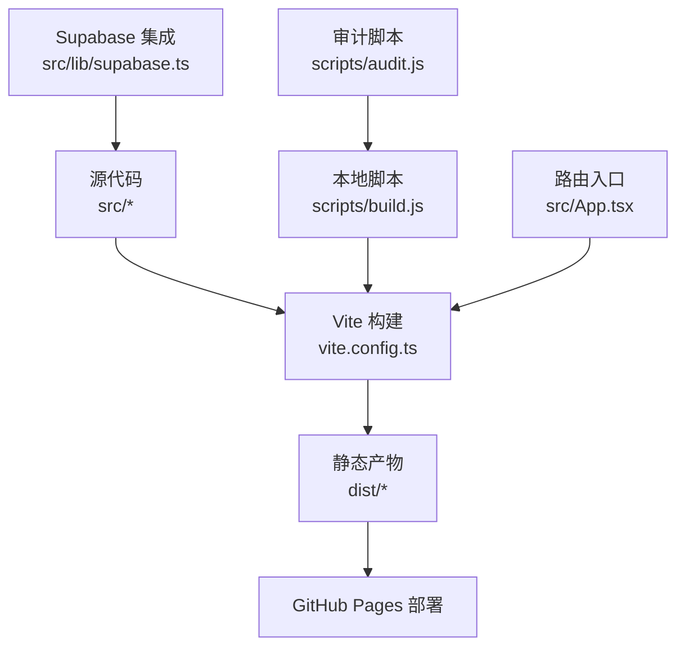
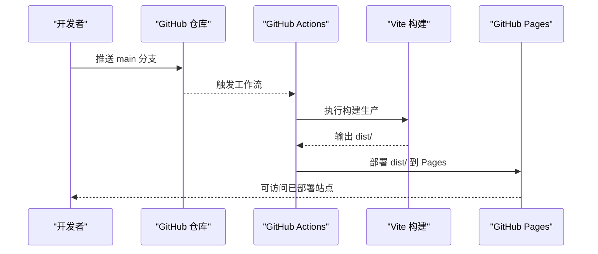
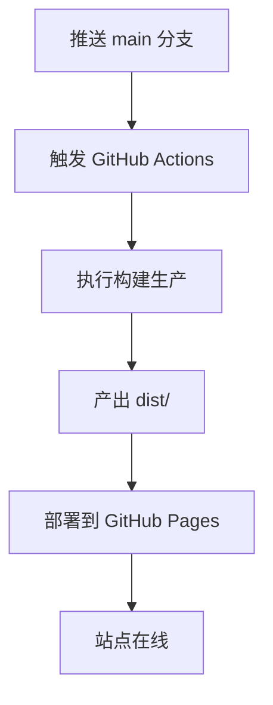
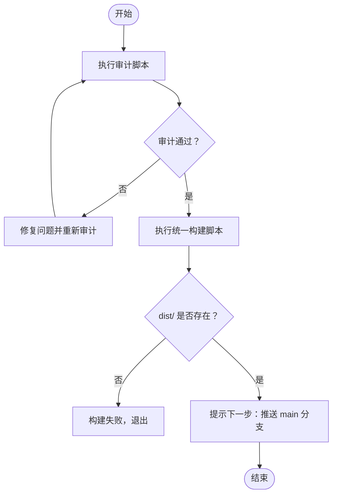
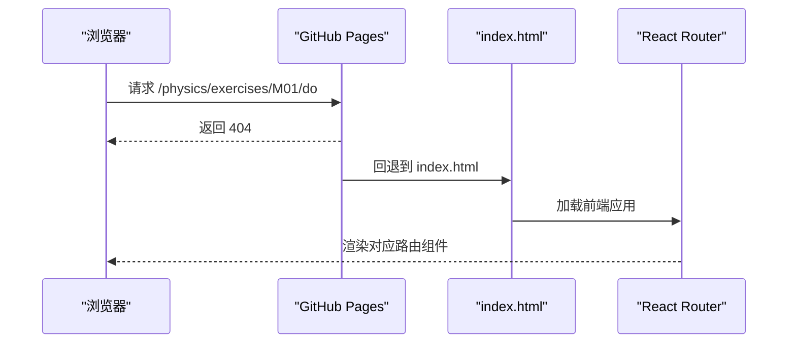
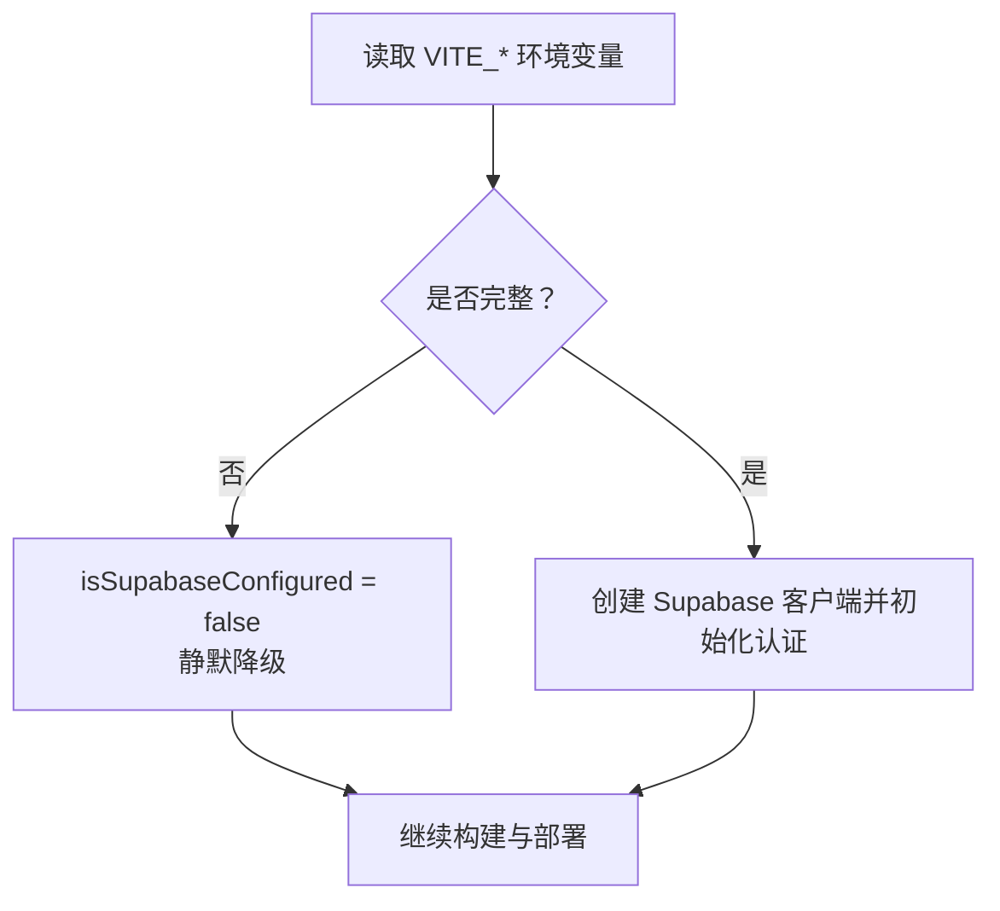
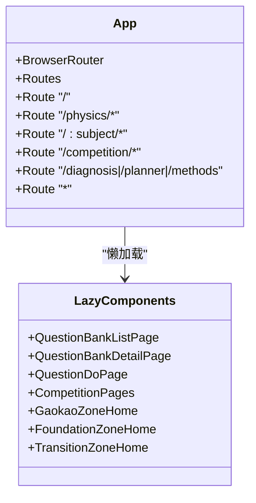
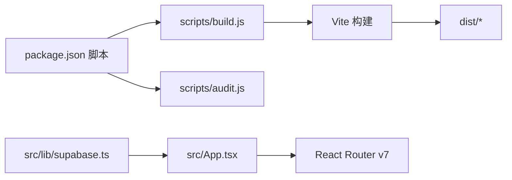

# 部署架构

<cite>
**本文引用的文件**
- [package.json](file://package.json)
- [ARCHITECTURE.md](file://ARCHITECTURE.md)
- [TECH_ARCHITECTURE.md](file://TECH_ARCHITECTURE.md)
- [vite.config.ts](file://vite.config.ts)
- [netlify.toml](file://netlify.toml)
- [scripts/build.js](file://scripts/build.js)
- [scripts/audit.js](file://scripts/audit.js)
- [src/App.tsx](file://src/App.tsx)
- [src/lib/supabase.ts](file://src/lib/supabase.ts)
</cite>

## 目录
1. [简介](#简介)
2. [项目结构](#项目结构)
3. [核心组件](#核心组件)
4. [架构总览](#架构总览)
5. [详细组件分析](#详细组件分析)
6. [依赖分析](#依赖分析)
7. [性能考虑](#性能考虑)
8. [故障排除指南](#故障排除指南)
9. [结论](#结论)
10. [附录](#附录)

## 简介
本文件系统化阐述星耀平台的部署架构与实践，聚焦于 GitHub Pages + GitHub Actions 的部署策略与配置方式，覆盖从代码推送自动构建到部署完成的完整流程；文档化 GitHub Pages 的 SPA 路由处理机制（无需额外配置即可支持客户端路由）；说明本地部署脚本的使用方法（构建检查、审计与部署命令）；解释环境变量配置与 Supabase 集成的部署注意事项；并提供部署故障排除指南、性能监控建议与版本管理策略，以及 CI/CD 最佳实践与安全配置建议。

## 项目结构
星耀平台采用前端单页应用（SPA）架构，基于 React 19 + Vite 5 + TypeScript 技术栈，配合 React Router v7 实现客户端路由。项目通过 Vite 进行生产构建，输出静态资源至 dist 目录，用于 GitHub Pages 静态托管。

- 关键目录与文件
  - 构建与脚本：scripts/build.js、scripts/audit.js
  - 构建配置：vite.config.ts
  - 路由与入口：src/App.tsx
  - Supabase 集成：src/lib/supabase.ts
  - 项目脚本与依赖：package.json
  - 架构与部署说明：ARCHITECTURE.md、TECH_ARCHITECTURE.md
  - Netlify 配置（历史/对比参考）：netlify.toml

图表来源
- [vite.config.ts:1-14](file://vite.config.ts#L1-L14)
- [scripts/build.js:1-96](file://scripts/build.js#L1-L96)
- [src/App.tsx:1-174](file://src/App.tsx#L1-L174)
- [src/lib/supabase.ts:1-18](file://src/lib/supabase.ts#L1-L18)

章节来源
- [ARCHITECTURE.md:264-319](file://ARCHITECTURE.md#L264-L319)
- [vite.config.ts:1-14](file://vite.config.ts#L1-L14)
- [package.json:1-86](file://package.json#L1-L86)

## 核心组件
- Vite 构建配置
  - base 路径设置为“/”，确保静态资源与路由匹配。
  - 路径别名 @ 指向 src，便于模块导入。
- 本地构建脚本
  - 统一执行 TypeScript 类型检查与 Vite 生产构建，输出 dist。
  - 构建完成后提示下一步：推送 main 分支以触发 GitHub Actions 自动部署。
- 审计脚本
  - 执行 10 项质量与一致性检查，确保部署前代码质量与结构稳定。
- 路由与 SPA
  - React Router v7 在 BrowserRouter 下运行，结合 GitHub Pages 的 404 回退至 index.html，实现客户端路由。
- Supabase 集成
  - 通过环境变量注入 Supabase URL 与匿名密钥；未配置时静默降级，不影响前端构建与部署。

章节来源
- [vite.config.ts:5-13](file://vite.config.ts#L5-L13)
- [scripts/build.js:58-95](file://scripts/build.js#L58-L95)
- [scripts/audit.js:280-317](file://scripts/audit.js#L280-L317)
- [src/App.tsx:78-170](file://src/App.tsx#L78-L170)
- [src/lib/supabase.ts:3-17](file://src/lib/supabase.ts#L3-L17)

## 架构总览
星耀平台采用“本地构建 + GitHub Pages 静态托管 + GitHub Actions 自动化”的部署架构。核心要点如下：
- GitHub Pages + GitHub Actions：推送 main 分支自动触发工作流，完成构建与部署。
- SPA 路由：无需额外配置，GitHub Pages 将 404 请求回退到 index.html，由 React Router 接管。
- 本地脚本：提供构建检查、审计与一键构建能力，保障发布质量。
- 环境变量：通过 VITE_* 前缀注入 Supabase 配置；未配置时前端静默降级。
- 基础路径：Vite base 设置为“/”以适配 GitHub Pages 子路径部署场景。

图表来源
- [ARCHITECTURE.md:270-279](file://ARCHITECTURE.md#L270-L279)
- [vite.config.ts:6](file://vite.config.ts#L6)
- [scripts/build.js:79-82](file://scripts/build.js#L79-L82)

章节来源
- [ARCHITECTURE.md:264-319](file://ARCHITECTURE.md#L264-L319)
- [vite.config.ts:6](file://vite.config.ts#L6)

## 详细组件分析

### GitHub Pages + GitHub Actions 部署策略
- 触发与流程
  - 推送 main 分支 → 自动触发 GitHub Actions 工作流 → 执行构建 → 部署到 GitHub Pages。
- Pages 激活
  - 仓库 Settings → Pages → Source 选择 “GitHub Actions”（非 Branch）。
- 安全令牌
  - 需在仓库 Settings → Secrets 中配置 GH_TOKEN，用于 Actions 访问仓库权限。
- SPA 路由处理
  - 无需额外配置，GitHub Pages 将 404 请求回退到 index.html，由 React Router 接管。

图表来源
- [ARCHITECTURE.md:270-279](file://ARCHITECTURE.md#L270-L279)

章节来源
- [ARCHITECTURE.md:268-283](file://ARCHITECTURE.md#L268-L283)

### 本地部署脚本使用方法
- 构建检查
  - 本地先执行审计脚本，确保 10 项检查全部通过后再进行构建。
- 构建命令
  - 统一构建脚本会先进行 TypeScript 类型检查，再执行 Vite 生产构建。
  - 构建完成后提示下一步：推送 main 分支以触发 GitHub Actions 自动部署。
- 审计命令
  - 提供 10 项质量与一致性检查，涵盖中文引号、内嵌引号、结构合理性、导入来源、路由一致性等。

图表来源
- [scripts/audit.js:350-360](file://scripts/audit.js#L350-L360)
- [scripts/build.js:84-95](file://scripts/build.js#L84-L95)

章节来源
- [scripts/audit.js:280-317](file://scripts/audit.js#L280-L317)
- [scripts/build.js:58-95](file://scripts/build.js#L58-L95)
- [ARCHITECTURE.md:284-303](file://ARCHITECTURE.md#L284-L303)

### GitHub Pages SPA 路由处理机制
- 无需额外配置
  - GitHub Pages 默认将 404 请求回退到 index.html，结合 React Router 的客户端路由，实现单页应用的深度链接与刷新。
- 路由入口
  - BrowserRouter 的 basename 与 Vite 的 base 配置共同保证路径一致性，避免资源 404 与路由错位。

图表来源
- [ARCHITECTURE.md:280-283](file://ARCHITECTURE.md#L280-L283)
- [src/App.tsx:78](file://src/App.tsx#L78)
- [vite.config.ts:6](file://vite.config.ts#L6)

章节来源
- [ARCHITECTURE.md:280-283](file://ARCHITECTURE.md#L280-L283)
- [src/App.tsx:78](file://src/App.tsx#L78)

### 环境变量与 Supabase 集成
- 环境变量
  - 通过 VITE_SUPABASE_URL 与 VITE_SUPABASE_ANON_KEY 注入 Supabase 配置。
  - 未配置时 isSupabaseConfigured 为 false，前端静默降级，不影响构建与部署。
- 集成方式
  - 在应用初始化时检测配置状态，仅在已配置时初始化认证与相关功能。
- 部署注意事项
  - 在 GitHub Actions 中配置 Secret（如 GH_TOKEN），并在 Pages 设置中启用 GitHub Actions 作为源。
  - 若使用自定义域名，需在 Pages 设置中配置并确保 SSL 证书生效。

图表来源
- [src/lib/supabase.ts:3-17](file://src/lib/supabase.ts#L3-L17)
- [ARCHITECTURE.md:305-309](file://ARCHITECTURE.md#L305-L309)

章节来源
- [src/lib/supabase.ts:3-17](file://src/lib/supabase.ts#L3-L17)
- [ARCHITECTURE.md:305-309](file://ARCHITECTURE.md#L305-L309)

### Vite 配置与基础路径
- base 设置
  - vite.config.ts 中 base 为“/”，适配 GitHub Pages 子路径部署场景，避免资源加载 404。
- 路径别名
  - @ 指向 src，简化导入路径，提升可维护性。

章节来源
- [vite.config.ts:6](file://vite.config.ts#L6)
- [vite.config.ts:8-12](file://vite.config.ts#L8-L12)

### 路由与 SPA 组件关系
- 路由注册
  - App.tsx 中集中注册所有路由，包含学科模块、题库、竞赛专区、学习工具等。
- 懒加载
  - 题库与竞赛专区等大型模块采用懒加载，减少首屏体积与加载时间。
- 旧路由处理
  - 旧路由统一由 PracticeRedirect 处理，避免污染主路由逻辑。

图表来源
- [src/App.tsx:7-50](file://src/App.tsx#L7-L50)
- [src/App.tsx:78-170](file://src/App.tsx#L78-L170)

章节来源
- [src/App.tsx:7-50](file://src/App.tsx#L7-L50)
- [src/App.tsx:78-170](file://src/App.tsx#L78-L170)

## 依赖分析
- 构建链路
  - scripts/build.js 依赖 Vite 与 TypeScript，负责类型检查与生产构建。
  - package.json 中的 scripts 定义了 dev、build、preview、lint、audit 等命令。
- 运行时依赖
  - React Router v7、Supabase JS SDK、Tailwind CSS、AntV G6 等。
- 开发依赖
  - Vite、@vitejs/plugin-react、TypeScript、ESLint 等。

图表来源
- [package.json:6-12](file://package.json#L6-L12)
- [scripts/build.js:79-82](file://scripts/build.js#L79-L82)
- [src/App.tsx:1-5](file://src/App.tsx#L1-L5)
- [src/lib/supabase.ts:1-1](file://src/lib/supabase.ts#L1-L1)

章节来源
- [package.json:6-12](file://package.json#L6-L12)
- [scripts/build.js:79-82](file://scripts/build.js#L79-L82)
- [src/App.tsx:1-5](file://src/App.tsx#L1-L5)
- [src/lib/supabase.ts:1-1](file://src/lib/supabase.ts#L1-L1)

## 性能考虑
- 懒加载与代码分割
  - 题库与竞赛专区等模块采用懒加载，降低首屏体积与首次渲染时间。
- 资源体积监控
  - 构建脚本输出 dist 目录大小，可用于容量趋势监控。
- 路由与基础路径
  - base 设置为“/”并保持 BrowserRouter basename 一致，避免二次请求与资源路径错误导致的性能损耗。
- CDN 与缓存
  - GitHub Pages 本身具备全球分发能力；建议在自定义域名场景下启用 HTTPS 与缓存策略。

章节来源
- [ARCHITECTURE.md:29-44](file://ARCHITECTURE.md#L29-L44)
- [vite.config.ts:6](file://vite.config.ts#L6)
- [scripts/build.js:84-91](file://scripts/build.js#L84-L91)

## 故障排除指南
- 构建失败
  - 现象：scripts/build.js 输出“Vite 构建失败”或 dist/ 不存在。
  - 排查：先执行审计脚本，修复问题；检查 Vite 与 TypeScript 版本兼容性；确认 node_modules 安装完整。
- SPA 路由 404
  - 现象：刷新或直接访问深层路由出现 404。
  - 排查：确认 GitHub Pages 设置为“GitHub Actions”而非 Branch；检查 Vite base 与 BrowserRouter basename 是否一致。
- Supabase 未生效
  - 现象：前端未初始化认证或功能异常。
  - 排查：确认 VITE_SUPABASE_URL 与 VITE_SUPABASE_ANON_KEY 已正确注入；未配置时前端将静默降级。
- 审计不通过
  - 现象：scripts/audit.js 返回问题清单。
  - 排查：逐项修复中文引号、内嵌引号、结构合理性、导入来源、路由一致性等问题。

章节来源
- [scripts/build.js:79-95](file://scripts/build.js#L79-L95)
- [ARCHITECTURE.md:280-283](file://ARCHITECTURE.md#L280-L283)
- [src/lib/supabase.ts:3-17](file://src/lib/supabase.ts#L3-L17)
- [scripts/audit.js:350-360](file://scripts/audit.js#L350-L360)

## 结论
星耀平台采用简洁可靠的 GitHub Pages + GitHub Actions 部署方案，结合 Vite 生产构建与 React Router 客户端路由，实现了无需额外配置的 SPA 路由支持。通过本地审计与统一构建脚本，确保发布质量；通过环境变量与 Supabase 集成，实现可选的云端能力。建议在自定义域名场景下完善安全与缓存策略，并持续利用审计脚本与性能监控维持发布质量与用户体验。

## 附录
- 术语
  - SPA：单页应用，通过客户端路由实现页面切换。
  - 基础路径（base）：Vite 构建输出的静态资源基础路径。
  - 懒加载：按需加载模块，减少首屏体积。
- 参考
  - 架构与部署说明：见 ARCHITECTURE.md
  - 技术方案与模块规范：见 TECH_ARCHITECTURE.md
  - Netlify 配置（历史/对比参考）：见 netlify.toml

章节来源
- [ARCHITECTURE.md:1-369](file://ARCHITECTURE.md#L1-L369)
- [TECH_ARCHITECTURE.md:1-380](file://TECH_ARCHITECTURE.md#L1-L380)
- [netlify.toml:1-13](file://netlify.toml#L1-L13)