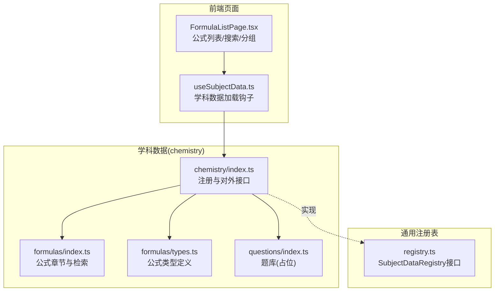
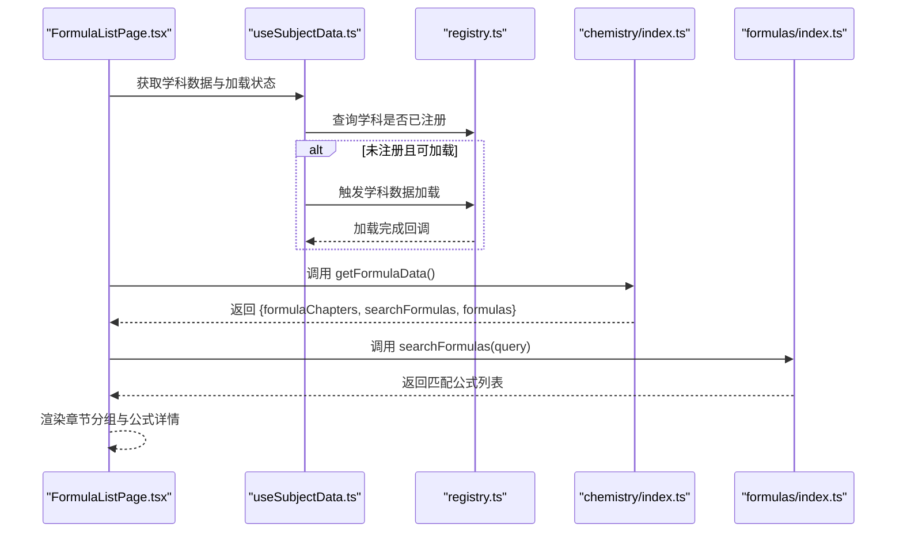
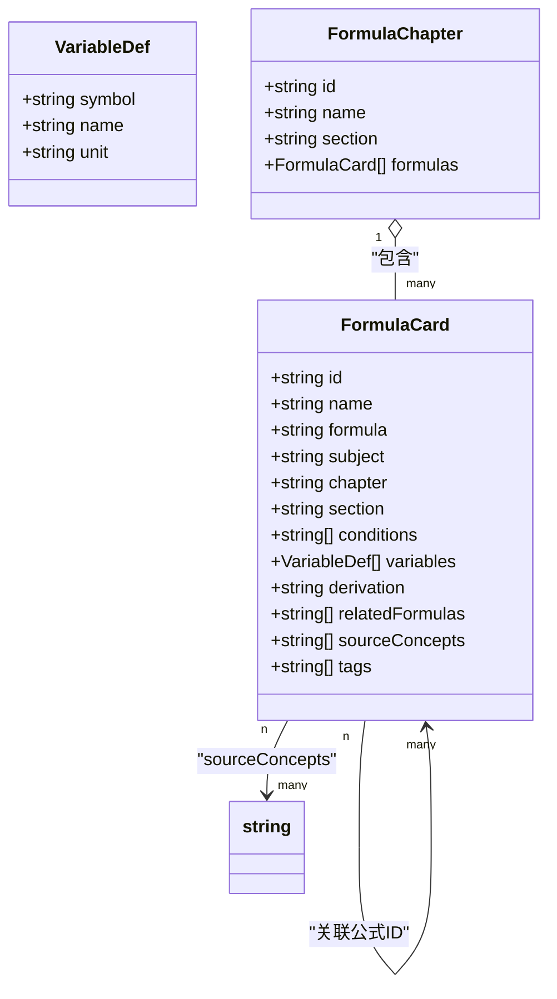
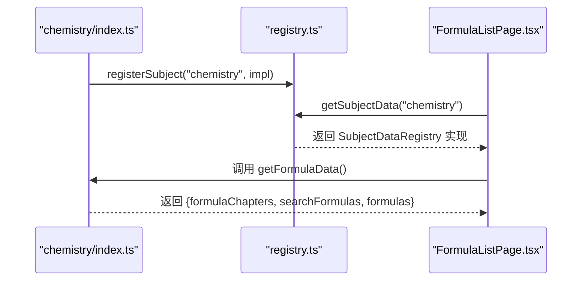
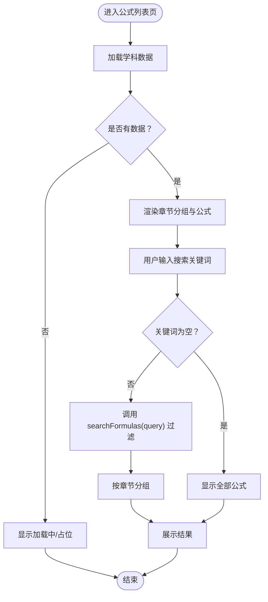
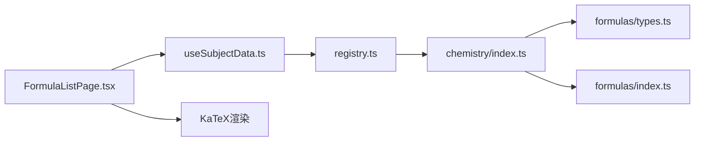

# 化学公式层(F层)

<cite>
**本文引用的文件**
- [src/data/chemistry/formulas/index.ts](file://src/data/chemistry/formulas/index.ts)
- [src/data/chemistry/formulas/types.ts](file://src/data/chemistry/formulas/types.ts)
- [src/data/chemistry/index.ts](file://src/data/chemistry/index.ts)
- [src/sections/FormulaListPage.tsx](file://src/sections/FormulaListPage.tsx)
- [src/hooks/useSubjectData.ts](file://src/hooks/useSubjectData.ts)
- [src/data/registry.ts](file://src/data/registry.ts)
- [src/data/chemistry/questions/index.ts](file://src/data/chemistry/questions/index.ts)
</cite>

## 目录
1. [引言](#引言)
2. [项目结构](#项目结构)
3. [核心组件](#核心组件)
4. [架构总览](#架构总览)
5. [详细组件分析](#详细组件分析)
6. [依赖分析](#依赖分析)
7. [性能考虑](#性能考虑)
8. [故障排查指南](#故障排查指南)
9. [结论](#结论)
10. [附录](#附录)

## 引言
本文件系统性阐述“化学公式层(F层)”的设计与实现，覆盖公式组织结构、ID命名规则、元数据模型、内容格式与分类体系；说明按模块/章节的公式组织方式、搜索实现、显示格式与管理机制；并给出数学表达式、化学方程式、物理量关系等不同类型的处理思路。同时，文档化增删改查、关联关系、版本控制与质量保证建议，以及导入导出、批量管理与公式库维护更新策略。

## 项目结构
化学公式层位于学科数据子目录下，采用“学科/子域/索引”的层次化组织：
- 数据入口：学科注册与对外接口暴露
- 公式数据：公式卡片与章节聚合
- 展示页面：公式列表页，集成搜索与分组
- 通用注册表：统一学科数据注册与访问

**图示来源**
- [src/data/chemistry/index.ts:135-183](file://src/data/chemistry/index.ts#L135-L183)
- [src/data/chemistry/formulas/index.ts:1-19](file://src/data/chemistry/formulas/index.ts#L1-L19)
- [src/data/chemistry/formulas/types.ts:1-31](file://src/data/chemistry/formulas/types.ts#L1-L31)
- [src/sections/FormulaListPage.tsx:20-261](file://src/sections/FormulaListPage.tsx#L20-L261)
- [src/hooks/useSubjectData.ts:1-46](file://src/hooks/useSubjectData.ts#L1-L46)
- [src/data/registry.ts:4-52](file://src/data/registry.ts#L4-L52)

**章节来源**
- [src/data/chemistry/index.ts:1-186](file://src/data/chemistry/index.ts#L1-L186)
- [src/data/chemistry/formulas/index.ts:1-19](file://src/data/chemistry/formulas/index.ts#L1-L19)
- [src/data/chemistry/formulas/types.ts:1-31](file://src/data/chemistry/formulas/types.ts#L1-L31)
- [src/sections/FormulaListPage.tsx:1-261](file://src/sections/FormulaListPage.tsx#L1-L261)
- [src/hooks/useSubjectData.ts:1-46](file://src/hooks/useSubjectData.ts#L1-L46)
- [src/data/registry.ts:1-52](file://src/data/registry.ts#L1-L52)

## 核心组件
- 公式类型定义：描述公式卡片与章节的数据结构，包括唯一ID、名称、LaTeX表达式、学科标识、章节/板块归属、适用条件、变量说明、推导过程、关联公式ID、来源知识节点ID、标签等。
- 公式数据入口：暴露公式章节数组、公式数组与搜索函数，并通过注册表向页面层提供统一访问。
- 页面组件：公式列表页负责渲染章节分组、搜索过滤、折叠展开详情、LaTeX渲染与导航到来源概念。
- 学科注册与加载：通过注册表统一注册学科数据，页面使用钩子按需加载并获取数据。

**章节来源**
- [src/data/chemistry/formulas/types.ts:10-31](file://src/data/chemistry/formulas/types.ts#L10-L31)
- [src/data/chemistry/formulas/index.ts:4-19](file://src/data/chemistry/formulas/index.ts#L4-L19)
- [src/data/chemistry/index.ts:135-183](file://src/data/chemistry/index.ts#L135-L183)
- [src/sections/FormulaListPage.tsx:20-261](file://src/sections/FormulaListPage.tsx#L20-L261)
- [src/hooks/useSubjectData.ts:1-46](file://src/hooks/useSubjectData.ts#L1-L46)
- [src/data/registry.ts:4-38](file://src/data/registry.ts#L4-L38)

## 架构总览
化学公式层遵循“数据层-注册表-页面层”的分层架构：
- 数据层：定义类型、提供数据与检索能力
- 注册表：以学科为单位注册统一接口，供页面层调用
- 页面层：通过钩子加载学科数据，渲染公式列表与详情

**图示来源**
- [src/sections/FormulaListPage.tsx:20-81](file://src/sections/FormulaListPage.tsx#L20-L81)
- [src/hooks/useSubjectData.ts:12-43](file://src/hooks/useSubjectData.ts#L12-L43)
- [src/data/registry.ts:40-52](file://src/data/registry.ts#L40-L52)
- [src/data/chemistry/index.ts:155-162](file://src/data/chemistry/index.ts#L155-L162)
- [src/data/chemistry/formulas/index.ts:10-18](file://src/data/chemistry/formulas/index.ts#L10-L18)

## 详细组件分析

### 组件A：公式类型与数据模型
- 类型定义要点
  - 公式卡片字段：唯一ID、名称、LaTeX表达式、学科标识、章节/板块、适用条件、变量说明、推导过程、关联公式ID、来源知识节点ID、标签
  - 章节模型：章节ID、名称、所属板块、包含的公式集合
- 设计原则
  - 字段覆盖“展示、检索、关联、溯源”四大维度
  - 变量说明支持符号、名称、单位，便于LaTeX渲染与解释
  - 关联公式ID与来源知识节点ID为知识网络与交叉引用提供基础

**图示来源**
- [src/data/chemistry/formulas/types.ts:4-31](file://src/data/chemistry/formulas/types.ts#L4-L31)

**章节来源**
- [src/data/chemistry/formulas/types.ts:10-31](file://src/data/chemistry/formulas/types.ts#L10-L31)

### 组件B：公式数据入口与注册
- 暴露接口
  - getFormulaChapters：返回章节数组
  - getAllFormulas：返回全部公式
  - searchFormulas：按名称/LaTeX/标签检索
  - getFormulaData：返回章节、检索函数与公式集合
- 注册机制
  - 通过注册表统一注册学科数据，页面通过钩子按需加载
  - 与模型、题库、范式等其他子域保持一致的注册模式

**图示来源**
- [src/data/chemistry/index.ts:135-183](file://src/data/chemistry/index.ts#L135-L183)
- [src/data/registry.ts:40-48](file://src/data/registry.ts#L40-L48)

**章节来源**
- [src/data/chemistry/index.ts:135-183](file://src/data/chemistry/index.ts#L135-L183)
- [src/data/registry.ts:4-38](file://src/data/registry.ts#L4-L38)

### 组件C：公式搜索与显示
- 搜索实现
  - 支持按名称、LaTeX表达式、标签检索
  - 忽略大小写，空查询返回全部
- 页面渲染
  - 按章节分组展示
  - 折叠面板展示变量说明、适用条件、来源知识节点与标签
  - 使用KaTeX渲染LaTeX，支持行内公式显示
  - 提供章节筛选与关键词搜索

**图示来源**
- [src/sections/FormulaListPage.tsx:20-81](file://src/sections/FormulaListPage.tsx#L20-L81)
- [src/data/chemistry/formulas/index.ts:10-18](file://src/data/chemistry/formulas/index.ts#L10-L18)

**章节来源**
- [src/sections/FormulaListPage.tsx:20-261](file://src/sections/FormulaListPage.tsx#L20-L261)
- [src/data/chemistry/formulas/index.ts:10-18](file://src/data/chemistry/formulas/index.ts#L10-L18)

### 组件D：公式ID命名规则与分类体系
- ID命名规则
  - 建议采用“学科缩写-层级-编号”结构，例如“CHE-F-001”
  - 体现学科、层级（公式）与顺序编号，便于检索与版本管理
- 分类体系
  - 章节/板块：与教材模块/主题对应，形成“章节-公式”的树形结构
  - 标签：用于快速检索与二次分组
  - 来源知识节点ID：建立与知识点的溯源关系
  - 关联公式ID：建立公式间的逻辑关联，支撑知识网络

**章节来源**
- [src/data/chemistry/formulas/types.ts:10-23](file://src/data/chemistry/formulas/types.ts#L10-L23)
- [src/data/chemistry/index.ts:27-93](file://src/data/chemistry/index.ts#L27-L93)

### 组件E：公式内容格式与类型处理
- 数学表达式与LaTeX
  - 公式字段存储LaTeX字符串，页面使用KaTeX渲染
  - 行内公式通过行模式渲染，确保排版一致
- 化学方程式
  - 建议在LaTeX中使用标准环境或宏包，保持与化学教科书一致的排版风格
  - 可在标签中增加“方程式”等关键词，便于检索
- 物理量关系
  - 通过变量说明字段明确符号、名称与单位，提升可读性与教学价值
  - 在推导过程中可链接到来源知识节点，形成学习闭环

**章节来源**
- [src/data/chemistry/formulas/types.ts:13-18](file://src/data/chemistry/formulas/types.ts#L13-L18)
- [src/sections/FormulaListPage.tsx:133-141](file://src/sections/FormulaListPage.tsx#L133-L141)

### 组件F：公式管理机制（增删改查、关联、版本与质量）
- 增删改查
  - 增：在公式数组/章节中新增条目，设置ID、名称、LaTeX、变量、条件、标签与来源
  - 删：移除数组中的条目，同步清理关联关系
  - 改：更新字段，必要时重建索引（如标签、章节）
  - 查：通过ID直接索引，或通过搜索函数模糊匹配
- 关联关系管理
  - 关联公式ID：用于建立公式间的逻辑关系（如推导链）
  - 来源知识节点ID：建立与知识点的溯源关系
- 版本控制与质量保证
  - 建议引入版本号字段与变更日志，记录修改者、时间与原因
  - 质量检查：LaTeX语法校验、变量单位一致性检查、标签完整性检查
  - 审批流程：重大修改需经审核后发布

**章节来源**
- [src/data/chemistry/formulas/types.ts:10-23](file://src/data/chemistry/formulas/types.ts#L10-L23)
- [src/data/chemistry/formulas/index.ts:6-8](file://src/data/chemistry/formulas/index.ts#L6-L8)

### 组件G：导入导出与批量管理
- 导入
  - JSON/CSV：标准化格式导入，字段映射到类型定义
  - 批量校验：ID去重、LaTeX语法检查、变量单位一致性检查
- 导出
  - 导出为JSON/CSV，包含ID、名称、LaTeX、变量、条件、标签、来源与关联
- 批量管理
  - 批量更新标签、章节、条件
  - 批量修复LaTeX错误或变量缺失

**章节来源**
- [src/data/chemistry/formulas/types.ts:10-23](file://src/data/chemistry/formulas/types.ts#L10-L23)

### 组件H：公式库维护与更新
- 维护策略
  - 建立定期审查机制，结合教学反馈与考情变化更新公式
  - 与模型、题库联动，确保公式与知识点、题型的一致性
- 更新流程
  - 需求收集 → 内容修订 → 质量检查 → 审批发布 → 用户通知

**章节来源**
- [src/data/chemistry/index.ts:135-183](file://src/data/chemistry/index.ts#L135-L183)

## 依赖分析
- 组件耦合
  - 页面层仅依赖注册表提供的统一接口，降低对具体实现的耦合
  - 公式数据入口与注册表双向协作，保证数据可用性与一致性
- 外部依赖
  - KaTeX：LaTeX渲染
  - React Router：路由与导航
  - UI组件库：输入框、徽章、折叠面板等

**图示来源**
- [src/sections/FormulaListPage.tsx:13-18](file://src/sections/FormulaListPage.tsx#L13-L18)
- [src/hooks/useSubjectData.ts:1-6](file://src/hooks/useSubjectData.ts#L1-L6)
- [src/data/registry.ts:40-48](file://src/data/registry.ts#L40-L48)
- [src/data/chemistry/index.ts:12-13](file://src/data/chemistry/index.ts#L12-L13)
- [src/data/chemistry/formulas/types.ts:4-8](file://src/data/chemistry/formulas/types.ts#L4-L8)
- [src/data/chemistry/formulas/index.ts:4-8](file://src/data/chemistry/formulas/index.ts#L4-L8)

**章节来源**
- [src/sections/FormulaListPage.tsx:1-261](file://src/sections/FormulaListPage.tsx#L1-L261)
- [src/hooks/useSubjectData.ts:1-46](file://src/hooks/useSubjectData.ts#L1-L46)
- [src/data/registry.ts:1-52](file://src/data/registry.ts#L1-L52)
- [src/data/chemistry/index.ts:1-186](file://src/data/chemistry/index.ts#L1-L186)
- [src/data/chemistry/formulas/types.ts:1-31](file://src/data/chemistry/formulas/types.ts#L1-L31)
- [src/data/chemistry/formulas/index.ts:1-19](file://src/data/chemistry/formulas/index.ts#L1-L19)

## 性能考虑
- 搜索性能
  - 当前实现为线性过滤，适合中小规模数据；大规模时建议引入倒排索引或专用检索库
- 渲染性能
  - 折叠面板懒加载详情，减少一次性渲染开销
  - KaTeX渲染按需触发，避免重复计算
- 数据加载
  - 通过注册表按需加载学科数据，避免首屏阻塞

[本节为通用指导，不直接分析具体文件]

## 故障排查指南
- 页面空白或长时间加载
  - 检查学科是否已注册与可加载
  - 确认注册表中是否存在学科实现
- 搜索无结果
  - 确认关键词大小写不影响匹配
  - 检查公式是否包含目标关键词（名称、LaTeX、标签）
- 公式显示异常
  - 检查LaTeX语法是否正确
  - 确认KaTeX资源是否正常加载

**章节来源**
- [src/hooks/useSubjectData.ts:19-43](file://src/hooks/useSubjectData.ts#L19-L43)
- [src/data/registry.ts:40-52](file://src/data/registry.ts#L40-L52)
- [src/data/chemistry/formulas/index.ts:10-18](file://src/data/chemistry/formulas/index.ts#L10-L18)
- [src/sections/FormulaListPage.tsx:133-141](file://src/sections/FormulaListPage.tsx#L133-L141)

## 结论
化学公式层(F层)以清晰的类型定义与注册表接口为核心，配合页面层的搜索与分组展示，实现了从数据到呈现的完整闭环。建议在现有基础上完善ID命名规范、引入版本与质量控制机制，并在数据规模扩大后优化检索与渲染性能，以支撑更大范围的教学与学习场景。

## 附录
- 术语
  - 公式卡片：单条公式的完整元数据
  - 章节：与教材模块对应的公式集合
  - 来源知识节点ID：公式所依据的知识点标识
  - 关联公式ID：与其他公式的逻辑关系标识
- 参考实现位置
  - 类型定义：[src/data/chemistry/formulas/types.ts:1-31](file://src/data/chemistry/formulas/types.ts#L1-L31)
  - 数据入口与注册：[src/data/chemistry/index.ts:135-183](file://src/data/chemistry/index.ts#L135-L183)
  - 搜索与列表页：[src/data/chemistry/formulas/index.ts:10-18](file://src/data/chemistry/formulas/index.ts#L10-L18), [src/sections/FormulaListPage.tsx:20-261](file://src/sections/FormulaListPage.tsx#L20-L261)
  - 注册表接口：[src/data/registry.ts:4-38](file://src/data/registry.ts#L4-L38)
  - 题库占位：[src/data/chemistry/questions/index.ts:1-19](file://src/data/chemistry/questions/index.ts#L1-L19)