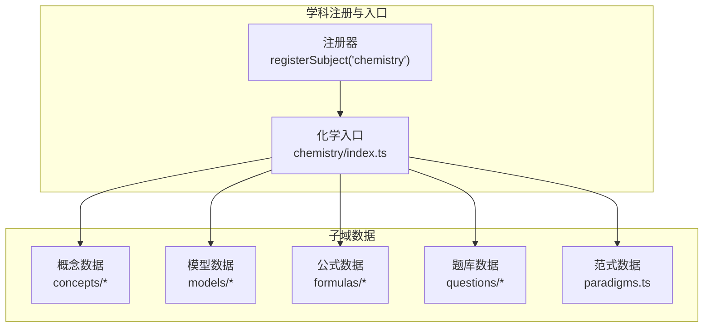
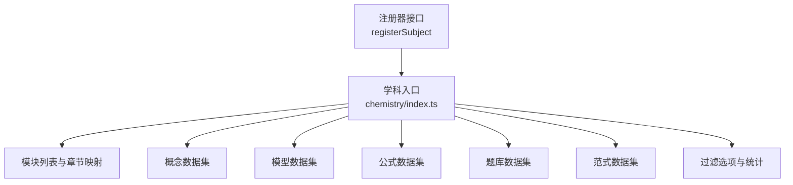
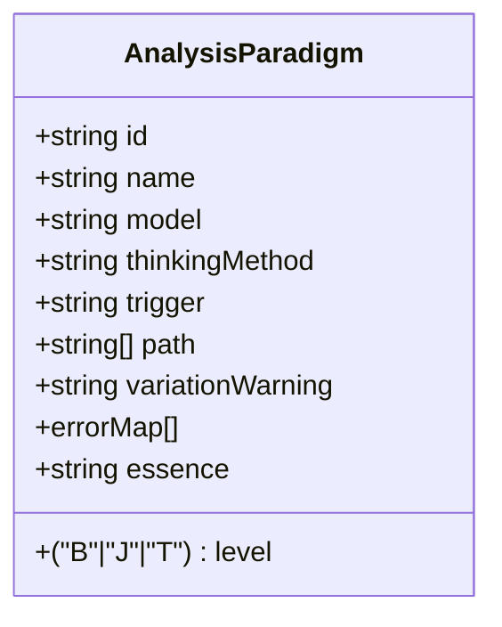
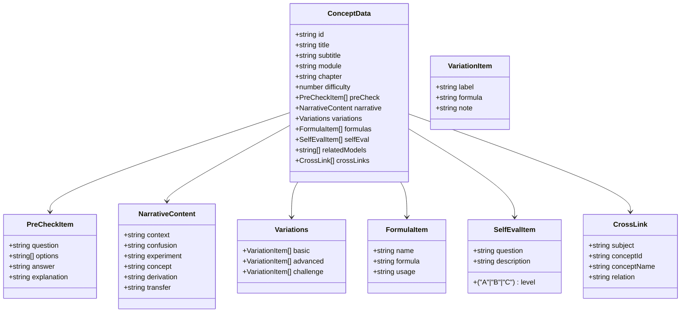
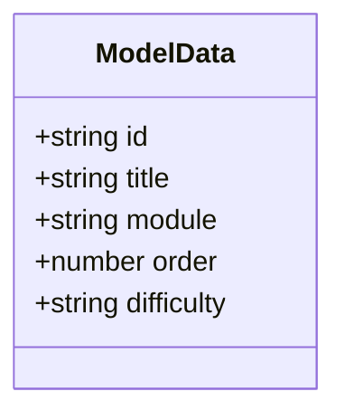
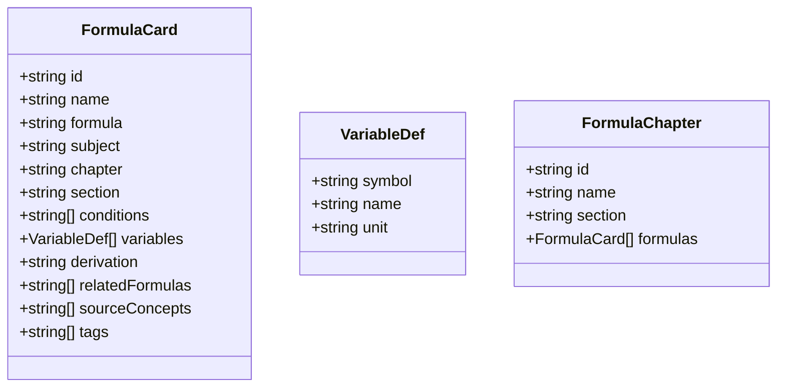
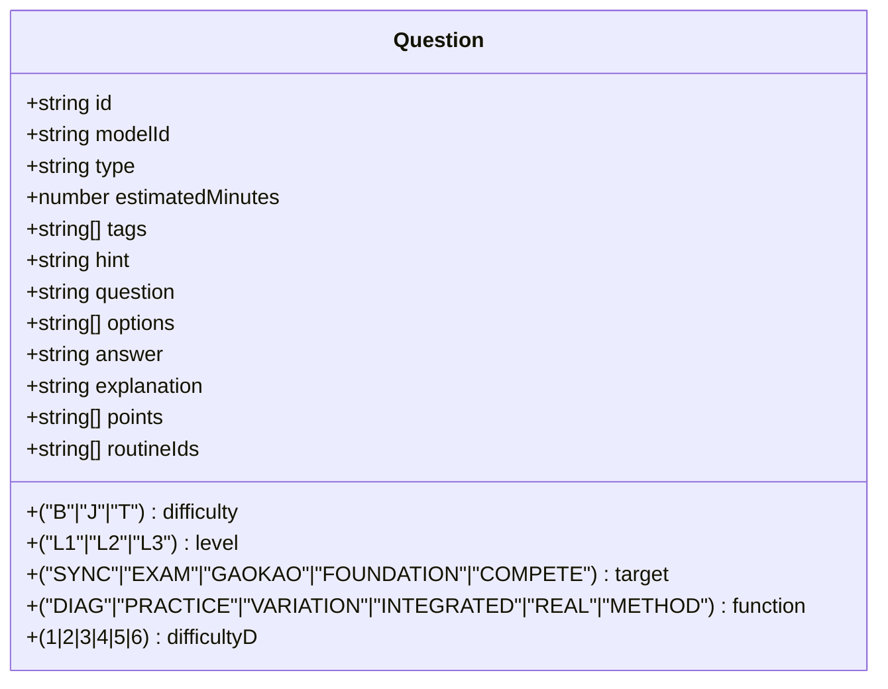
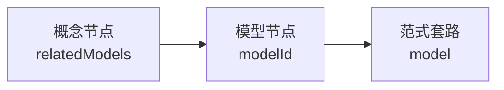
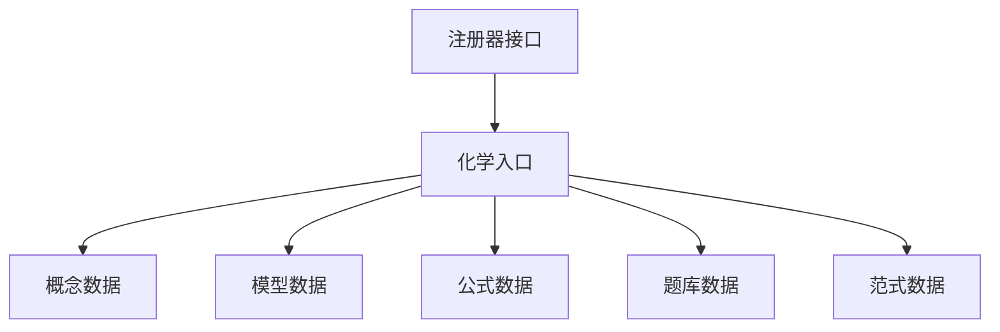
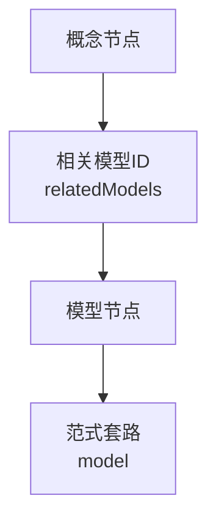

# 化学套路层(R层)

<cite>
**本文引用的文件**   
- [src/data/chemistry/paradigms.ts](file://src/data/chemistry/paradigms.ts)
- [src/data/chemistry/index.ts](file://src/data/chemistry/index.ts)
- [src/data/chemistry/concepts/types.ts](file://src/data/chemistry/concepts/types.ts)
- [src/data/chemistry/questions/types.ts](file://src/data/chemistry/questions/types.ts)
- [src/data/chemistry/formulas/types.ts](file://src/data/chemistry/formulas/types.ts)
- [src/data/chemistry/models/index.ts](file://src/data/chemistry/models/index.ts)
- [src/data/chemistry/models/types.ts](file://src/data/chemistry/models/types.ts)
- [src/data/chemistry/questions/index.ts](file://src/data/chemistry/questions/index.ts)
- [src/data/chemistry/questions/filters.ts](file://src/data/chemistry/questions/filters.ts)
- [src/data/chemistry/formulas/index.ts](file://src/data/chemistry/formulas/index.ts)
- [src/data/registry.ts](file://src/data/registry.ts)
- [src/types/index.ts](file://src/types/index.ts)
</cite>

## 目录
1. [引言](#引言)
2. [项目结构](#项目结构)
3. [核心组件](#核心组件)
4. [架构总览](#架构总览)
5. [详细组件分析](#详细组件分析)
6. [依赖分析](#依赖分析)
7. [性能考虑](#性能考虑)
8. [故障排查指南](#故障排查指南)
9. [结论](#结论)
10. [附录](#附录)

## 引言
本文件面向“化学套路层（R层）”的数据结构与实现，系统化阐述化学学科解题套路与思维方法的组织方式，覆盖以下主题：
- 套路ID命名规则与编号体系
- 套路元数据结构与内容格式
- 套路分类体系与与知识、模型的关联
- 核心套路模块：反应原理、物质结构与元素周期律、无机元素化学、有机化学、电化学、实验基础
- 解题步骤、思维方法、适用题型与注意事项
- 套路与概念、模型的关联关系、难度等级与学习路径设计
- 套路数据的导入导出机制与质量控制措施

本文件严格基于仓库现有代码与类型定义进行分析与说明。

## 项目结构
化学R层采用“学科入口 + 模块化子域”的组织方式：
- 学科入口：在学科注册器中注册化学数据，统一对外暴露概念、模型、公式、题库、范式等能力
- 子域划分：按知识网络模块划分（物质的分类与计量、离子反应与氧化还原、物质结构与元素周期律、化学反应原理、无机元素化学、有机化学、电化学、化学实验基础）
- 数据类型：概念、模型、公式、题库、范式均有明确的类型定义与章节/板块映射

图表来源
- [src/data/chemistry/index.ts:135-183](file://src/data/chemistry/index.ts#L135-L183)
- [src/data/registry.ts](file://src/data/registry.ts)

章节来源
- [src/data/chemistry/index.ts:22-93](file://src/data/chemistry/index.ts#L22-L93)

## 核心组件
- 分析范式（Paradigms）：定义“套路”的元数据结构，包括ID、名称、所属模型、思维方法维度、难度层级、触发信号、思考路径、变式预警、错误映射、本质回溯等字段
- 概念（Concepts）：以知识节点为核心，包含前置检测、叙事正文、分层变形、公式卡片、理解自评、关联模型与跨学科链接等
- 模型（Models）：以“模型”为载体承载知识点的结构化呈现与应用路径
- 公式（Formulas）：公式卡片的结构化定义，含章节、板块、适用条件、变量说明、推导过程、来源概念等
- 题库（Questions）：题目的结构化定义，含难度、题型、标签、提示、解析、评分点、关联模型与题型维度等

章节来源
- [src/data/chemistry/paradigms.ts:6-21](file://src/data/chemistry/paradigms.ts#L6-L21)
- [src/data/chemistry/concepts/types.ts:52-79](file://src/data/chemistry/concepts/types.ts#L52-L79)
- [src/data/chemistry/formulas/types.ts:10-23](file://src/data/chemistry/formulas/types.ts#L10-L23)
- [src/data/chemistry/questions/types.ts:4-27](file://src/data/chemistry/questions/types.ts#L4-L27)

## 架构总览
化学R层通过学科入口集中暴露能力，并与注册器对接，形成统一的数据访问接口。模块化子域分别维护各自的数据与类型，最终由入口聚合并导出。

图表来源
- [src/data/chemistry/index.ts:135-183](file://src/data/chemistry/index.ts#L135-L183)
- [src/data/registry.ts](file://src/data/registry.ts)

## 详细组件分析

### 分析范式（套路）数据结构与命名规则
- ID命名规则：CHE-Rxx（xx为01~70的序号），用于唯一标识一个“套路”
- 核心字段
  - id：套路编号（如 CHE-R01）
  - name：套路名称
  - model：所属模型编号（与模型数据关联）
  - thinkingMethod：核心思维方法维度（来自“分析范式”7个维度）
  - level：难度层级（B=知识掌握，J=思维运用，T=迁移创新）
  - trigger：触发信号（题型/情境关键词）
  - path：思考路径（3-7步的步骤序列）
  - variationWarning：变式预警（常见陷阱与易错点）
  - errorMap：错误映射（错误思维、认知根源、正确路径）
  - essence：本质回溯（回归本源的解题依据）

图表来源
- [src/data/chemistry/paradigms.ts:6-21](file://src/data/chemistry/paradigms.ts#L6-L21)

章节来源
- [src/data/chemistry/paradigms.ts:1-25](file://src/data/chemistry/paradigms.ts#L1-L25)

### 概念数据结构（与套路的关联）
- 概念节点包含：前置检测、叙事正文（情境锚定、困惑预设、实验/现象、概念涌现、反应机理/结构分析、新情境运用）、分层变形（基础/进阶/挑战）、公式卡片、理解自评、关联模型与跨学科链接
- 与套路的关联：概念节点可标注 relatedModels（关联模型ID），从而与“模型-套路”建立映射；同时可通过 crossLinks 进行跨学科关联

图表来源
- [src/data/chemistry/concepts/types.ts:52-79](file://src/data/chemistry/concepts/types.ts#L52-L79)
- [src/data/chemistry/concepts/types.ts:5-10](file://src/data/chemistry/concepts/types.ts#L5-L10)
- [src/data/chemistry/concepts/types.ts:12-19](file://src/data/chemistry/concepts/types.ts#L12-L19)
- [src/data/chemistry/concepts/types.ts:21-31](file://src/data/chemistry/concepts/types.ts#L21-L31)
- [src/data/chemistry/concepts/types.ts:33-43](file://src/data/chemistry/concepts/types.ts#L33-L43)
- [src/data/chemistry/concepts/types.ts:45-50](file://src/data/chemistry/concepts/types.ts#L45-L50)

章节来源
- [src/data/chemistry/concepts/types.ts:1-79](file://src/data/chemistry/concepts/types.ts#L1-L79)

### 模型数据结构与章节映射
- 模型数据包含：模型ID、标题、模块、顺序、难度等
- 章节映射：通过模块名到章节模型的映射，形成“模块 -> 章节模型 -> 模型列表”的层次结构
- 颜色分类：为不同模块设置颜色类别，便于界面展示

图表来源
- [src/data/chemistry/models/types.ts](file://src/data/chemistry/models/types.ts)

章节来源
- [src/data/chemistry/index.ts:118-133](file://src/data/chemistry/index.ts#L118-L133)
- [src/data/chemistry/index.ts:95-116](file://src/data/chemistry/index.ts#L95-L116)

### 公式卡片数据结构
- 公式卡片包含：唯一ID、名称、LaTeX表达式、学科、章节、板块、适用条件、变量说明、推导过程、关联公式ID、来源概念ID、标签等
- 章节组织：以“章节 -> 公式列表”的结构组织，便于检索与教学使用

图表来源
- [src/data/chemistry/formulas/types.ts:10-23](file://src/data/chemistry/formulas/types.ts#L10-L23)
- [src/data/chemistry/formulas/types.ts:4-8](file://src/data/chemistry/formulas/types.ts#L4-L8)
- [src/data/chemistry/formulas/types.ts:25-30](file://src/data/chemistry/formulas/types.ts#L25-L30)

章节来源
- [src/data/chemistry/formulas/types.ts:1-31](file://src/data/chemistry/formulas/types.ts#L1-L31)

### 题库数据结构与过滤维度
- 题目结构：包含ID、模型ID、难度、题型、估计时长、标签、提示、题干、选项、答案、解析、评分点、关联routineIds、层级/目标/功能/难度D等
- 过滤维度：提供难度、目标、功能、难度D、题型等选项，便于题库筛选与练习设计

图表来源
- [src/data/chemistry/questions/types.ts:4-27](file://src/data/chemistry/questions/types.ts#L4-L27)

章节来源
- [src/data/chemistry/questions/types.ts:1-28](file://src/data/chemistry/questions/types.ts#L1-L28)
- [src/data/chemistry/questions/filters.ts](file://src/data/chemistry/questions/filters.ts)

### 套路与概念、模型的关联关系
- 概念到模型：概念节点通过 relatedModels 字段关联模型ID，形成“概念 -> 模型”的映射
- 模型到套路：范式（套路）通过 model 字段指向模型ID，形成“模型 -> 套路”的映射
- 跨学科关联：概念节点通过 crossLinks 提供跨学科链接，便于知识迁移

图表来源
- [src/data/chemistry/concepts/types.ts:76-78](file://src/data/chemistry/concepts/types.ts#L76-L78)
- [src/data/chemistry/paradigms.ts:9](file://src/data/chemistry/paradigms.ts#L9)

章节来源
- [src/data/chemistry/concepts/types.ts:52-79](file://src/data/chemistry/concepts/types.ts#L52-L79)
- [src/data/chemistry/paradigms.ts:6-21](file://src/data/chemistry/paradigms.ts#L6-L21)

### 套路的解题步骤、思维方法、适用题型与注意事项
- 解题步骤：由范式的 path 字段给出（3-7步），体现“触发信号 -> 思考路径 -> 正确路径”的闭环
- 思维方法：由 thinkingMethod 字段标注，对应“分析范式”7个维度之一
- 适用题型：由 trigger 字段与题型过滤维度结合，识别适合该套路的题型集合
- 注意事项：由 variationWarning 字段提示常见陷阱与易错点；errorMap 提供错误思维与正确路径对照

章节来源
- [src/data/chemistry/paradigms.ts:11-21](file://src/data/chemistry/paradigms.ts#L11-L21)

### 套路分类体系与难度等级
- 分类体系：以模块为一级分类（物质的分类与计量、离子反应与氧化还原、物质结构与元素周期律、化学反应原理、无机元素化学、有机化学、电化学、化学实验基础）
- 难度等级：B（知识掌握）、J（思维运用）、T（迁移创新），贯穿于范式、模型与题目中
- 学习路径设计：建议以模块为单位推进，先掌握模型（M01~Mxx），再应用套路（R01~Rxx），最后通过题库进行巩固与迁移

章节来源
- [src/data/chemistry/index.ts:27-92](file://src/data/chemistry/index.ts#L27-L92)
- [src/data/chemistry/index.ts:95-116](file://src/data/chemistry/index.ts#L95-L116)
- [src/data/chemistry/paradigms.ts:11](file://src/data/chemistry/paradigms.ts#L11)
- [src/data/chemistry/questions/types.ts:7](file://src/data/chemistry/questions/types.ts#L7)

### 核心套路模块的数据结构要点
- 化学反应原理：对应模块“化学反应原理”，包含热力学、动力学、平衡、电离、水解、沉淀溶解平衡等
- 物质结构与元素周期律：对应模块“物质结构与元素周期律”，包含原子结构、元素周期表、化学键、分子结构、晶体结构等
- 无机元素化学：对应模块“无机元素化学”，涵盖Na、Al、Fe、Cu、Cl、S、N、Si等元素及其化合物
- 有机化学：对应模块“有机化学”，涵盖烷、烯、炔、芳香烃、卤代烃、醇酚、醛酮、羧酸酯、糖、氨基酸、蛋白质、高分子等
- 电化学：对应模块“电化学”，包含原电池、电解池、电化学计算、金属腐蚀与防护
- 化学实验基础：对应模块“化学实验基础”，包含仪器与操作、分离与提纯、气体制备与收集、检验与鉴别、实验设计与评价、综合探究

章节来源
- [src/data/chemistry/index.ts:27-92](file://src/data/chemistry/index.ts#L27-L92)

## 依赖分析
- 学科入口依赖：注册器、概念、模型、公式、题库、范式等模块
- 模块内部依赖：各子域内部类型与数据相互引用（如概念 -> 模型、模型 -> 套路）
- 外部依赖：注册器接口与通用类型定义

图表来源
- [src/data/chemistry/index.ts:135-183](file://src/data/chemistry/index.ts#L135-L183)
- [src/data/registry.ts](file://src/data/registry.ts)

章节来源
- [src/data/chemistry/index.ts:135-183](file://src/data/chemistry/index.ts#L135-L183)

## 性能考虑
- 数据聚合：学科入口通过 Map 快速索引范式与模型，提升查询效率
- 模块化加载：按需加载模块数据，避免一次性加载全部数据
- 类型约束：严格的类型定义有助于在编译期发现潜在性能问题与数据不一致

## 故障排查指南
- 套路缺失：若 allParadigms 为空数组，需检查范式数据是否正确填充
- 概念-模型不匹配：检查概念节点的 relatedModels 与模型ID是否一致
- 题型不匹配：检查题目的 type 与范式 trigger 的匹配关系
- 难度标注异常：确认题目与范式的难度层级标注是否一致

章节来源
- [src/data/chemistry/paradigms.ts:23-24](file://src/data/chemistry/paradigms.ts#L23-L24)
- [src/data/chemistry/concepts/types.ts:76-78](file://src/data/chemistry/concepts/types.ts#L76-L78)
- [src/data/chemistry/questions/types.ts:8](file://src/data/chemistry/questions/types.ts#L8)

## 结论
化学R层以“范式（套路）+ 模型 + 概念 + 题库 + 公式”的结构化数据体系，支撑起从知识到方法再到实践的完整学习闭环。通过模块化的章节映射与难度层级标注，能够有效组织核心套路，并为学习路径设计与质量控制提供坚实基础。当前范式数据仍为空框架，建议按模块逐步填充，确保与模型与概念的映射关系清晰、路径描述准确、错误映射完备。

## 附录

### 套路ID命名规则与编号范围
- 命名规则：CHE-Rxx（xx为01~70）
- 适用范围：分析范式（套路）的唯一标识

章节来源
- [src/data/chemistry/paradigms.ts:2](file://src/data/chemistry/paradigms.ts#L2)

### 套路元数据结构字段说明
- id：套路编号
- name：套路名称
- model：所属模型编号
- thinkingMethod：核心思维方法维度
- level：难度层级（B/J/T）
- trigger：触发信号
- path：思考路径（3-7步）
- variationWarning：变式预警
- errorMap：错误映射（错误思维、认知根源、正确路径）
- essence：本质回溯

章节来源
- [src/data/chemistry/paradigms.ts:6-21](file://src/data/chemistry/paradigms.ts#L6-L21)

### 套路内容格式与适用题型
- 内容格式：以“触发信号 -> 思考路径 -> 正确路径 -> 本质回溯”的结构化形式呈现
- 适用题型：通过 trigger 与题型过滤维度结合确定

章节来源
- [src/data/chemistry/paradigms.ts:11-21](file://src/data/chemistry/paradigms.ts#L11-L21)
- [src/data/chemistry/questions/filters.ts](file://src/data/chemistry/questions/filters.ts)

### 套路与概念、模型的关联关系图

图表来源
- [src/data/chemistry/concepts/types.ts:76-78](file://src/data/chemistry/concepts/types.ts#L76-L78)
- [src/data/chemistry/paradigms.ts:9](file://src/data/chemistry/paradigms.ts#L9)

### 导入导出机制与质量控制
- 导入机制：通过学科入口注册，将范式、模型、概念、公式、题库等数据聚合到统一接口
- 导出机制：提供 getParadigmList、getModelDataMap、getAllFormulas、getAllQuestions 等方法，便于前端或外部系统消费
- 质量控制：严格的类型定义与模块化结构，确保数据一致性；建议在CI中增加类型检查与单元测试覆盖率

章节来源
- [src/data/chemistry/index.ts:164-179](file://src/data/chemistry/index.ts#L164-L179)
- [src/data/registry.ts](file://src/data/registry.ts)