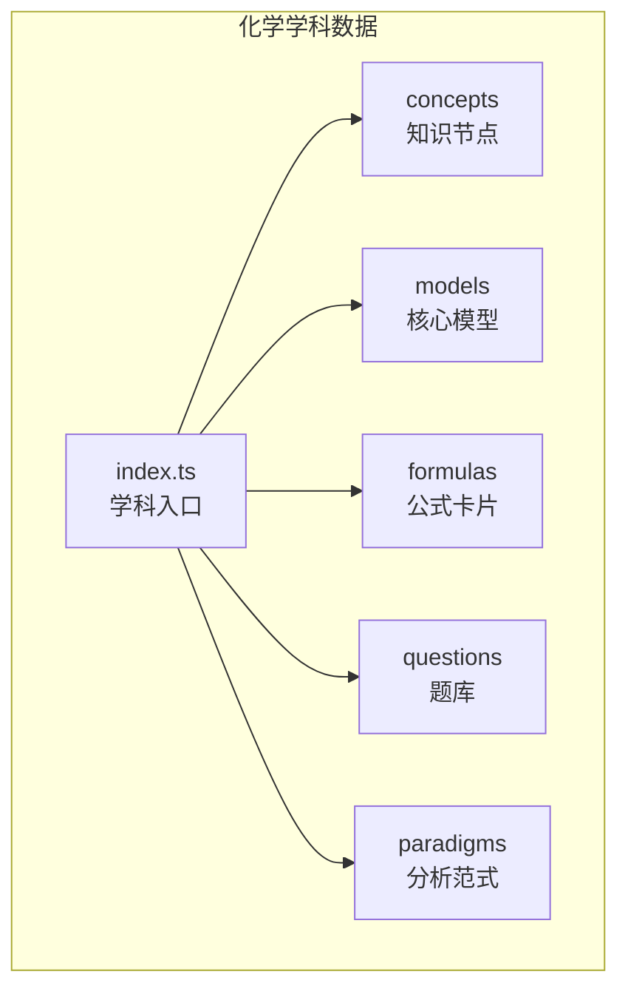
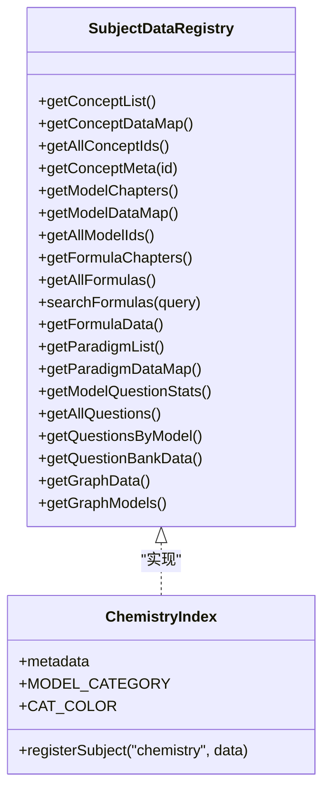
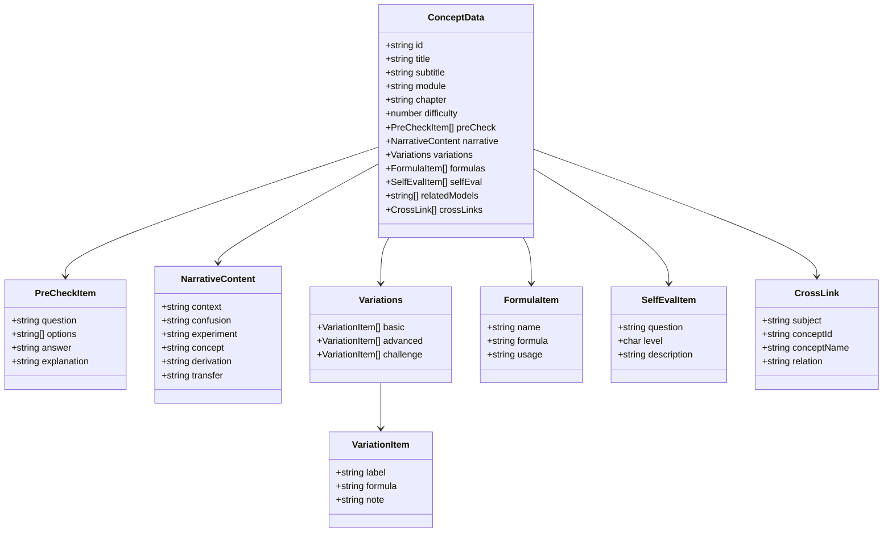
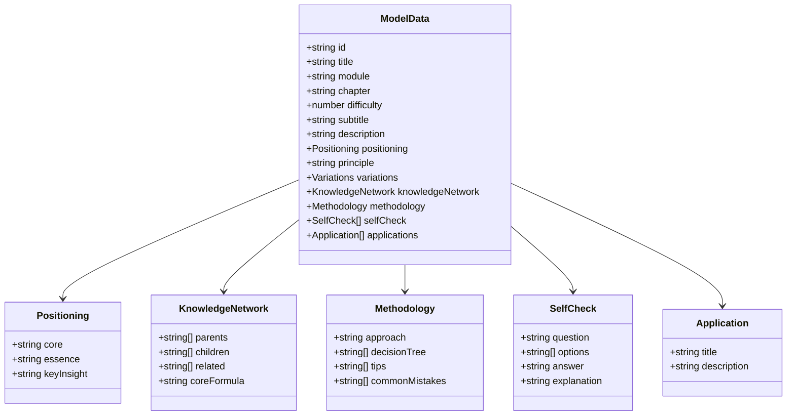
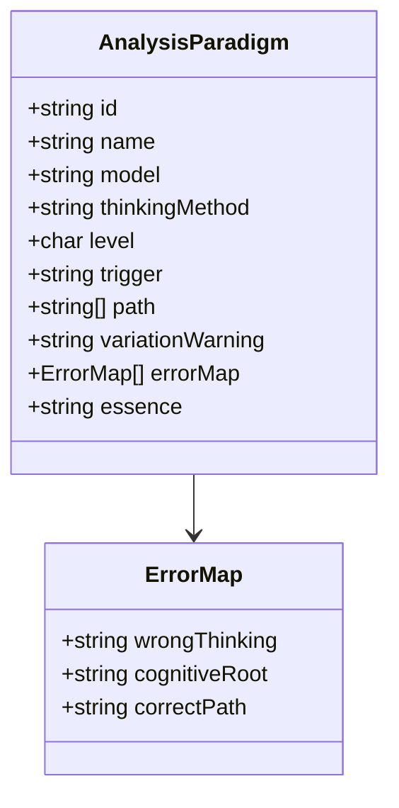
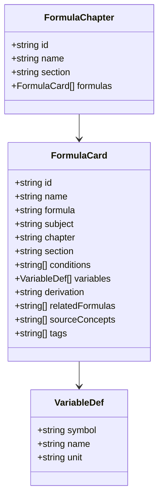
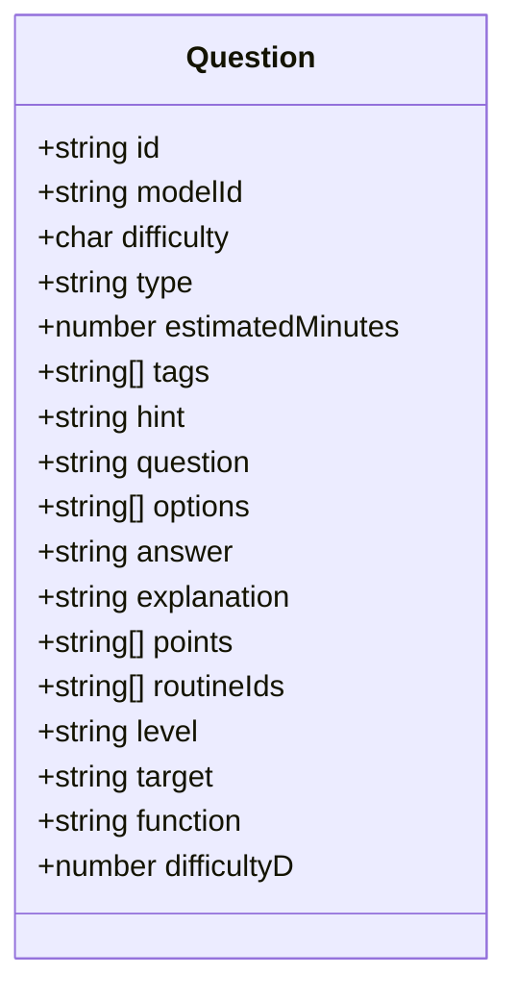
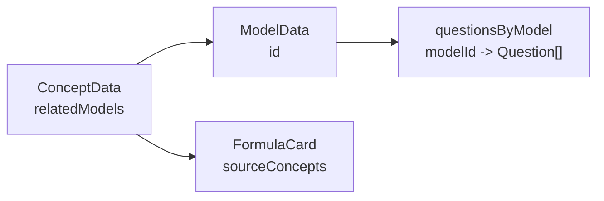

# 化学学科数据结构

<cite>
**本文引用的文件**
- [src/data/chemistry/index.ts](file://src/data/chemistry/index.ts)
- [src/data/chemistry/concepts/index.ts](file://src/data/chemistry/concepts/index.ts)
- [src/data/chemistry/concepts/types.ts](file://src/data/chemistry/concepts/types.ts)
- [src/data/chemistry/models/index.ts](file://src/data/chemistry/models/index.ts)
- [src/data/chemistry/models/M01_物质分类树模型.ts](file://src/data/chemistry/models/M01_物质分类树模型.ts)
- [src/data/chemistry/formulas/index.ts](file://src/data/chemistry/formulas/index.ts)
- [src/data/chemistry/formulas/types.ts](file://src/data/chemistry/formulas/types.ts)
- [src/data/chemistry/questions/index.ts](file://src/data/chemistry/questions/index.ts)
- [src/data/chemistry/questions/types.ts](file://src/data/chemistry/questions/types.ts)
- [src/data/chemistry/questions/filters.ts](file://src/data/chemistry/questions/filters.ts)
- [src/data/chemistry/paradigms.ts](file://src/data/chemistry/paradigms.ts)
- [src/data/registry.ts](file://src/data/registry.ts)
</cite>

## 目录
1. [简介](#简介)
2. [项目结构](#项目结构)
3. [核心组件](#核心组件)
4. [架构总览](#架构总览)
5. [详细组件分析](#详细组件分析)
6. [依赖分析](#依赖分析)
7. [性能考虑](#性能考虑)
8. [故障排查指南](#故障排查指南)
9. [结论](#结论)
10. [附录](#附录)

## 简介
本文件系统化梳理化学学科在该代码库中的数据结构与实现，覆盖K层（知识节点）、M层（核心模型）、R层（分析范式）、P层（题库）四层数据组织方式，以及化学模块（物质的量、化学反应、元素周期律、有机化学、电化学、实验基础等）的知识组织与数据模型。文档同时说明公式卡片、题库的筛选与检索机制，以及增删改查与数据完整性保障建议。

## 项目结构
化学数据位于 src/data/chemistry 目录，采用“按主题域分层”的组织方式：
- concepts：K层知识节点，按8大模块组织，每个概念包含前置检测、叙事正文、分层变形、公式卡片、自评等结构化字段
- models：M层核心模型，48个模型按模块与难度排序，提供“定位—原理—变式—知识网络—方法论—自检—应用”七模块
- formulas：公式卡片，支持章节化、变量说明、来源概念、标签等
- questions：题库，按模型聚合，支持五维筛选（层级、目标、功能、难度D、题型）
- paradigms：R层分析范式，按思维方法维度组织
- index.ts：学科入口，注册到统一的 SubjectDataRegistry，提供查询与统计接口

图表来源
- [src/data/chemistry/index.ts:1-186](file://src/data/chemistry/index.ts#L1-L186)
- [src/data/chemistry/concepts/index.ts:1-244](file://src/data/chemistry/concepts/index.ts#L1-L244)
- [src/data/chemistry/models/index.ts:1-209](file://src/data/chemistry/models/index.ts#L1-L209)
- [src/data/chemistry/formulas/index.ts:1-19](file://src/data/chemistry/formulas/index.ts#L1-L19)
- [src/data/chemistry/questions/index.ts:1-19](file://src/data/chemistry/questions/index.ts#L1-L19)
- [src/data/chemistry/paradigms.ts:1-25](file://src/data/chemistry/paradigms.ts#L1-L25)

章节来源
- [src/data/chemistry/index.ts:22-93](file://src/data/chemistry/index.ts#L22-L93)
- [src/data/chemistry/concepts/index.ts:125-232](file://src/data/chemistry/concepts/index.ts#L125-L232)

## 核心组件
- 学科元数据与模块划分：通过 metadata 描述8个模块与章节，提供模块到颜色、模型分组等映射
- 知识节点（K层）：ConceptData 定义了前置检测、叙事正文、分层变形、公式卡片、自评、跨学科链接等字段
- 核心模型（M层）：48个模型按模块与难度排序，提供“定位—原理—变式—知识网络—方法论—自检—应用”
- 公式卡片（F层）：FormulaCard 支持章节、板块、变量、推导、来源概念、标签等
- 题库（P层）：Question 支持难度等级、题型、五维属性；questions/index 提供按模型聚合与统计
- 分析范式（R层）：AnalysisParadigm 定义触发信号、思考路径、错误映射、本质回溯等

章节来源
- [src/data/chemistry/index.ts:22-186](file://src/data/chemistry/index.ts#L22-L186)
- [src/data/chemistry/concepts/types.ts:52-79](file://src/data/chemistry/concepts/types.ts#L52-L79)
- [src/data/chemistry/models/index.ts:57-209](file://src/data/chemistry/models/index.ts#L57-L209)
- [src/data/chemistry/formulas/types.ts:10-31](file://src/data/chemistry/formulas/types.ts#L10-L31)
- [src/data/chemistry/questions/types.ts:4-28](file://src/data/chemistry/questions/types.ts#L4-L28)
- [src/data/chemistry/paradigms.ts:6-25](file://src/data/chemistry/paradigms.ts#L6-L25)

## 架构总览
化学数据通过统一注册表 SubjectDataRegistry 对外暴露查询能力，index.ts 将概念、模型、公式、题库、范式整合为学科数据入口。

图表来源
- [src/data/registry.ts:4-52](file://src/data/registry.ts#L4-L52)
- [src/data/chemistry/index.ts:135-183](file://src/data/chemistry/index.ts#L135-L183)

章节来源
- [src/data/registry.ts:4-52](file://src/data/registry.ts#L4-L52)
- [src/data/chemistry/index.ts:135-183](file://src/data/chemistry/index.ts#L135-L183)

## 详细组件分析

### K层：知识节点（ConceptData）
- 数据结构要点
  - 基本信息：id、title、subtitle、module、chapter、difficulty
  - 前置检测：PreCheckItem 数组，用于学习前测
  - 叙事正文：NarrativeContent，包含情境锚定、困惑预设、实验现象、概念涌现、机理/结构分析、新情境运用
  - 分层变形：Variations，含基础(B)、进阶(J)、挑战(T)三档
  - 公式卡片：FormulaItem 数组
  - 自评：SelfEvalItem 数组
  - 关联：relatedModels（模型ID）、crossLinks（跨学科链接）

图表来源
- [src/data/chemistry/concepts/types.ts:5-79](file://src/data/chemistry/concepts/types.ts#L5-L79)

章节来源
- [src/data/chemistry/concepts/types.ts:52-79](file://src/data/chemistry/concepts/types.ts#L52-L79)
- [src/data/chemistry/concepts/index.ts:65-123](file://src/data/chemistry/concepts/index.ts#L65-L123)

### M层：核心模型（ModelData）
- 模型组织
  - 48个模型，按模块与难度排序，提供“定位—原理—变式—知识网络—方法论—自检—应用”七模块
  - 模型数据通过 index.ts 导出并注册到 modelDataMap 与 ALL_MODEL_IDS
- 模块映射
  - MODEL_CATEGORY 将模块名映射为分类标签
  - CAT_COLOR 提供模块对应的视觉样式

图表来源
- [src/data/chemistry/models/M01_物质分类树模型.ts:4-50](file://src/data/chemistry/models/M01_物质分类树模型.ts#L4-L50)

章节来源
- [src/data/chemistry/models/index.ts:57-209](file://src/data/chemistry/models/index.ts#L57-L209)
- [src/data/chemistry/models/M01_物质分类树模型.ts:4-50](file://src/data/chemistry/models/M01_物质分类树模型.ts#L4-L50)

### R层：分析范式（Paradigm）
- AnalysisParadigm 定义范式编号、名称、所属模型、思维方法维度、难度等级、触发信号、思考路径、变式预警、错误映射、本质回溯等
- 当前为空框架，待逐步填充

图表来源
- [src/data/chemistry/paradigms.ts:6-25](file://src/data/chemistry/paradigms.ts#L6-L25)

章节来源
- [src/data/chemistry/paradigms.ts:1-25](file://src/data/chemistry/paradigms.ts#L1-L25)

### F层：公式卡片（FormulaCard）
- FormulaCard 支持章节、板块、变量、推导、来源概念、标签等
- 公式搜索基于名称、LaTeX 表达式、标签进行模糊匹配

图表来源
- [src/data/chemistry/formulas/types.ts:10-31](file://src/data/chemistry/formulas/types.ts#L10-L31)

章节来源
- [src/data/chemistry/formulas/index.ts:1-19](file://src/data/chemistry/formulas/index.ts#L1-L19)
- [src/data/chemistry/formulas/types.ts:1-31](file://src/data/chemistry/formulas/types.ts#L1-L31)

### P层：题库（Question）
- Question 支持难度等级（B/J/T）、题型（选择、填空、计算、多选、图像分析、实验设计、无机/有机推断、流程分析）、五维属性（层级、目标、功能、难度D、题型）
- questions/index 提供 allQuestions、questionsByModel、modelQuestionStats
- filters.ts 定义五维筛选选项

图表来源
- [src/data/chemistry/questions/types.ts:4-28](file://src/data/chemistry/questions/types.ts#L4-L28)

章节来源
- [src/data/chemistry/questions/index.ts:1-19](file://src/data/chemistry/questions/index.ts#L1-L19)
- [src/data/chemistry/questions/types.ts:1-28](file://src/data/chemistry/questions/types.ts#L1-L28)
- [src/data/chemistry/questions/filters.ts:1-47](file://src/data/chemistry/questions/filters.ts#L1-L47)

## 依赖分析
- 概念到模型的关联：ConceptData 中的 relatedModels 字段用于建立概念与模型的双向关联
- 模型到题目的聚合：questions/index.ts 的 questionsByModel 以模型ID为键聚合题目
- 模块到模型的映射：index.ts 的 getModelChapters 依据模型 module 字段分组
- 公式到概念的来源：FormulaCard.sourceConcepts 指向来源知识节点ID

图表来源
- [src/data/chemistry/concepts/types.ts:76-78](file://src/data/chemistry/concepts/types.ts#L76-L78)
- [src/data/chemistry/questions/index.ts:8](file://src/data/chemistry/questions/index.ts#L8)
- [src/data/chemistry/formulas/types.ts:21](file://src/data/chemistry/formulas/types.ts#L21)

章节来源
- [src/data/chemistry/concepts/types.ts:76-78](file://src/data/chemistry/concepts/types.ts#L76-L78)
- [src/data/chemistry/questions/index.ts:8](file://src/data/chemistry/questions/index.ts#L8)
- [src/data/chemistry/formulas/types.ts:21](file://src/data/chemistry/formulas/types.ts#L21)

## 性能考虑
- 搜索与过滤
  - 公式搜索为 O(N) 线性过滤，建议在数据量增大时引入倒排索引或全文检索
  - 题目五维筛选可先按模型过滤再细分，减少不必要的遍历
- 内存占用
  - 模型与概念均为静态数据，建议按需懒加载或分包加载
- 查询优化
  - 建议为 frequently-accessed 字段（如 id、module、chapter）建立索引映射（当前已通过 Map 实现）

## 故障排查指南
- 注册失败
  - 确认 registerSubject("chemistry", data) 已正确调用且返回可用
- 查询不到数据
  - 检查 getAllConceptIds、getAllModelIds、ALL_MODEL_IDS 是否为空
  - 确认 getConceptMeta/getConceptDataMap 返回 null 的边界情况
- 题目统计异常
  - 检查 modelQuestionStats 的初始化与更新逻辑
  - 确认 questionsByModel 的键是否与模型ID一致
- 公式搜索无结果
  - 确认 formulas 非空且 searchFormulas 的查询字符串不为空
  - 检查 tags、name、formula 的大小写处理

章节来源
- [src/data/registry.ts:42-48](file://src/data/registry.ts#L42-L48)
- [src/data/chemistry/index.ts:135-183](file://src/data/chemistry/index.ts#L135-L183)
- [src/data/chemistry/questions/index.ts:10](file://src/data/chemistry/questions/index.ts#L10)
- [src/data/chemistry/formulas/index.ts:10-18](file://src/data/chemistry/formulas/index.ts#L10-L18)

## 结论
该化学数据结构遵循“K-M-R-P”四层设计，概念与模型采用模块化组织，公式与题库提供检索与筛选能力。通过统一注册表对外暴露查询接口，便于前端按模块/模型/知识点/题型进行导航与学习。建议后续完善内容填充、引入索引与缓存、增强数据校验与版本管理，以提升性能与可维护性。

## 附录

### 增删改查操作示例（路径指引）
- 获取所有概念列表
  - [src/data/chemistry/index.ts](file://src/data/chemistry/index.ts#L136)
- 获取指定概念元数据
  - [src/data/chemistry/index.ts:139-149](file://src/data/chemistry/index.ts#L139-L149)
- 获取模型分组（按模块）
  - [src/data/chemistry/index.ts:151-153](file://src/data/chemistry/index.ts#L151-L153)
- 获取全部模型ID
  - [src/data/chemistry/index.ts](file://src/data/chemistry/index.ts#L153)
- 搜索公式
  - [src/data/chemistry/index.ts](file://src/data/chemistry/index.ts#L157)
  - [src/data/chemistry/formulas/index.ts:10-18](file://src/data/chemistry/formulas/index.ts#L10-L18)
- 获取题库五维筛选配置
  - [src/data/chemistry/index.ts:170-179](file://src/data/chemistry/index.ts#L170-L179)
  - [src/data/chemistry/questions/filters.ts:1-47](file://src/data/chemistry/questions/filters.ts#L1-L47)

### 数据完整性保证措施（建议）
- 类型约束：严格使用 TypeScript 接口与只读类型，避免运行时字段缺失
- 校验规则：新增数据时执行必填字段检查与枚举值校验
- 版本化：为重要数据结构增加版本号，支持迁移与回滚
- 单元测试：针对搜索、聚合、映射函数编写测试用例
- 文档同步：保持 types.ts 与实际数据结构一致，避免注释与实现脱节