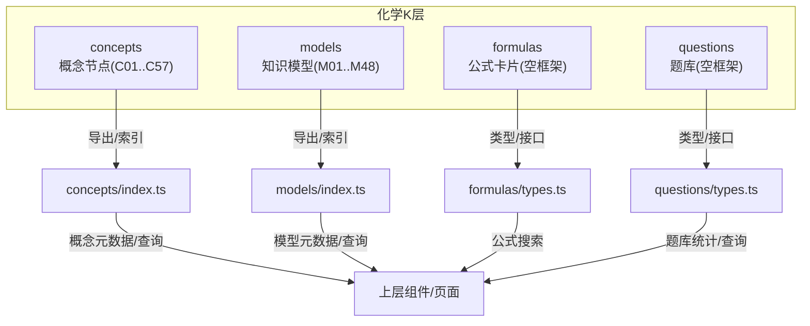
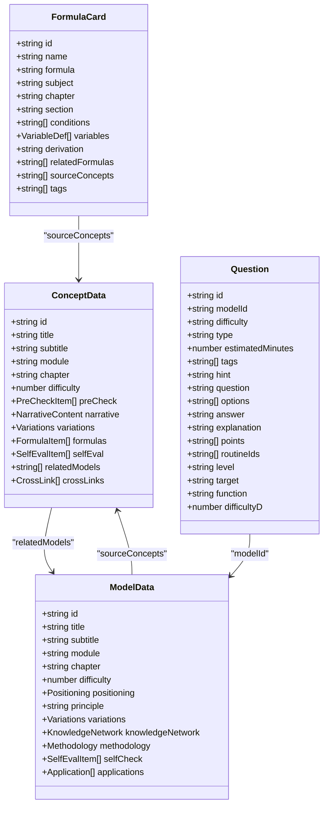
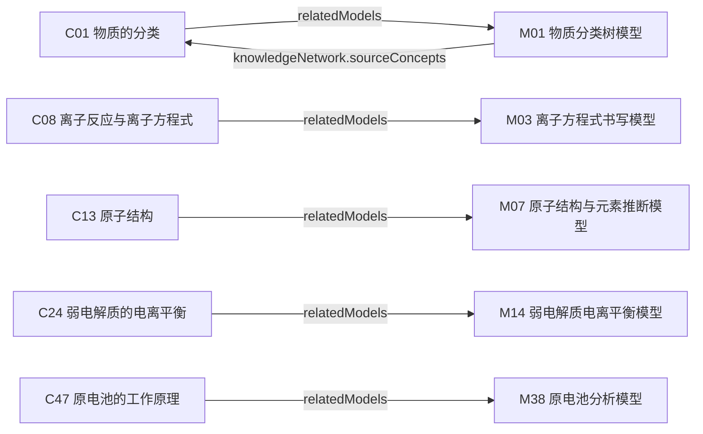

# 化学概念层(K层)

<cite>
**本文引用的文件**
- [src/data/chemistry/concepts/types.ts](file://src/data/chemistry/concepts/types.ts)
- [src/data/chemistry/concepts/index.ts](file://src/data/chemistry/concepts/index.ts)
- [src/data/chemistry/concepts/C01_物质的分类.ts](file://src/data/chemistry/concepts/C01_物质的分类.ts)
- [src/data/chemistry/concepts/C08_离子反应与离子方程式.ts](file://src/data/chemistry/concepts/C08_离子反应与离子方程式.ts)
- [src/data/chemistry/concepts/C13_原子结构.ts](file://src/data/chemistry/concepts/C13_原子结构.ts)
- [src/data/chemistry/concepts/C24_弱电解质的电离平衡.ts](file://src/data/chemistry/concepts/C24_弱电解质的电离平衡.ts)
- [src/data/chemistry/concepts/C47_原电池的工作原理.ts](file://src/data/chemistry/concepts/C47_原电池的工作原理.ts)
- [src/data/chemistry/formulas/types.ts](file://src/data/chemistry/formulas/types.ts)
- [src/data/chemistry/formulas/index.ts](file://src/data/chemistry/formulas/index.ts)
- [src/data/chemistry/models/M01_物质分类树模型.ts](file://src/data/chemistry/models/M01_物质分类树模型.ts)
- [src/data/chemistry/models/index.ts](file://src/data/chemistry/models/index.ts)
- [src/data/chemistry/questions/types.ts](file://src/data/chemistry/questions/types.ts)
- [src/data/chemistry/questions/index.ts](file://src/data/chemistry/questions/index.ts)
</cite>

## 目录
1. [简介](#简介)
2. [项目结构](#项目结构)
3. [核心组件](#核心组件)
4. [架构总览](#架构总览)
5. [详细组件分析](#详细组件分析)
6. [依赖分析](#依赖分析)
7. [性能考虑](#性能考虑)
8. [故障排查指南](#故障排查指南)
9. [结论](#结论)
10. [附录](#附录)

## 简介
本文件系统化梳理“化学概念层(K层)”的数据组织与实现方式，覆盖概念ID命名规则、概念元数据结构、概念内容格式、知识节点层级关系、核心概念数据结构、增删改查与关联关系、难度等级标记、模块化组织、以及导入导出与数据完整性验证机制。目标是帮助开发者与内容编辑者高效理解并维护化学K层知识数据。

## 项目结构
化学K层数据位于 src/data/chemistry 下，采用“按学科分目录 + 按主题分文件”的模块化组织方式：
- concepts：概念节点数据（C01-C57），每个概念一个独立TS文件，统一导出到 index.ts 并汇总为 conceptDataMap 与 conceptList
- models：知识模型（M01-M48），每个模型一个独立TS文件，统一导出到 index.ts 并汇总为 modelDataMap 与 chemistryModels
- formulas：公式卡片（空框架），提供类型定义与搜索接口
- questions：题库（空框架），提供类型定义与统计接口

图表来源
- [src/data/chemistry/concepts/index.ts:1-244](file://src/data/chemistry/concepts/index.ts#L1-L244)
- [src/data/chemistry/models/index.ts:1-209](file://src/data/chemistry/models/index.ts#L1-L209)
- [src/data/chemistry/formulas/types.ts:1-31](file://src/data/chemistry/formulas/types.ts#L1-L31)
- [src/data/chemistry/questions/types.ts:1-28](file://src/data/chemistry/questions/types.ts#L1-L28)

章节来源
- [src/data/chemistry/concepts/index.ts:1-244](file://src/data/chemistry/concepts/index.ts#L1-L244)
- [src/data/chemistry/models/index.ts:1-209](file://src/data/chemistry/models/index.ts#L1-L209)
- [src/data/chemistry/formulas/types.ts:1-31](file://src/data/chemistry/formulas/types.ts#L1-L31)
- [src/data/chemistry/questions/types.ts:1-28](file://src/data/chemistry/questions/types.ts#L1-L28)

## 核心组件
- 概念数据类型（ConceptData）：定义概念ID、标题、副标题、所属模块与章节、难度等级，以及前置检测、叙事正文、分层变形、公式卡片、自评、相关模型与跨学科链接等字段
- 概念索引与查询：通过 conceptDataMap 提供O(1)按ID访问；通过 conceptList 提供按模块/章节的分组列表；提供 getConceptMeta 与 getAllConceptIds 查询辅助
- 模型数据类型（ModelData）：定义模型ID、标题、模块、章节、难度、定位要点、原理、分层变形、知识网络、方法论、自检、应用等字段
- 模型索引与查询：通过 modelDataMap 提供O(1)按ID访问；通过 chemistryModels 提供有序列表与模块分组
- 公式卡片类型（FormulaCard）：定义公式ID、名称、LaTeX表达式、学科、章节、板块、适用条件、变量说明、推导过程、关联公式、来源概念、标签等字段
- 题库类型（Question）：定义题型、难度、估计时长、标签、提示、题干、选项、答案、解析、得分点、模型ID、目标用途、能力函数、难度D级等字段

章节来源
- [src/data/chemistry/concepts/types.ts:52-79](file://src/data/chemistry/concepts/types.ts#L52-L79)
- [src/data/chemistry/concepts/index.ts:234-244](file://src/data/chemistry/concepts/index.ts#L234-L244)
- [src/data/chemistry/models/index.ts:57-106](file://src/data/chemistry/models/index.ts#L57-L106)
- [src/data/chemistry/formulas/types.ts:10-23](file://src/data/chemistry/formulas/types.ts#L10-L23)
- [src/data/chemistry/questions/types.ts:4-27](file://src/data/chemistry/questions/types.ts#L4-L27)

## 架构总览
K层采用“数据即代码”的组织方式，概念与模型均以TS模块形式存在，统一由 index.ts 导出，便于静态分析、IDE智能提示与打包优化。概念与模型之间通过ID建立松耦合关联，支持跨学科链接与来源概念标注。

图表来源
- [src/data/chemistry/concepts/types.ts:52-79](file://src/data/chemistry/concepts/types.ts#L52-L79)
- [src/data/chemistry/models/index.ts:57-106](file://src/data/chemistry/models/index.ts#L57-L106)
- [src/data/chemistry/formulas/types.ts:10-23](file://src/data/chemistry/formulas/types.ts#L10-L23)
- [src/data/chemistry/questions/types.ts:4-27](file://src/data/chemistry/questions/types.ts#L4-L27)

## 详细组件分析

### 概念ID命名规则与元数据
- 命名规则：Cxx（C+两位十进制序号，范围C01..C57）
- 元数据字段：id、title、subtitle、module、chapter、difficulty（1-3）
- 分组组织：按8大板块组织，每板块含若干概念，形成 conceptList 的分组结构
- 查询接口：getConceptMeta 提供按ID查询概念元数据；getAllConceptIds 返回全部概念ID

章节来源
- [src/data/chemistry/concepts/index.ts:126-232](file://src/data/chemistry/concepts/index.ts#L126-L232)
- [src/data/chemistry/concepts/index.ts:234-244](file://src/data/chemistry/concepts/index.ts#L234-L244)

### 概念内容格式与叙事结构
- 前置检测（preCheck）：用于学习前测，包含题目、选项、答案与解析
- 叙事正文（narrative）：包含情境锚定、困惑预设、实验/现象、概念涌现、机理/结构分析、新情境运用六个维度
- 分层变形（variations）：按B/J/T三个层级提供不同难度的变式与注释
- 公式卡片（formulas）：提供公式名称、LaTeX表达式与使用说明
- 自评（selfEval）：按A/B/C等级进行理解度自评
- 关联关系：relatedModels（关联模型ID）、crossLinks（跨学科链接）

章节来源
- [src/data/chemistry/concepts/types.ts:5-79](file://src/data/chemistry/concepts/types.ts#L5-L79)
- [src/data/chemistry/concepts/C01_物质的分类.ts:4-42](file://src/data/chemistry/concepts/C01_物质的分类.ts#L4-L42)
- [src/data/chemistry/concepts/C08_离子反应与离子方程式.ts:4-42](file://src/data/chemistry/concepts/C08_离子反应与离子方程式.ts#L4-L42)
- [src/data/chemistry/concepts/C13_原子结构.ts:4-42](file://src/data/chemistry/concepts/C13_原子结构.ts#L4-L42)
- [src/data/chemistry/concepts/C24_弱电解质的电离平衡.ts:4-42](file://src/data/chemistry/concepts/C24_弱电解质的电离平衡.ts#L4-L42)
- [src/data/chemistry/concepts/C47_原电池的工作原理.ts:4-42](file://src/data/chemistry/concepts/C47_原电池的工作原理.ts#L4-L42)

### 核心概念数据结构（示例）
以下核心概念均遵循统一的数据结构，字段含义与组织方式一致：
- 物质的分类（C01）
- 离子反应与离子方程式（C08）
- 原子结构（C13）
- 弱电解质的电离平衡（C24）
- 原电池的工作原理（C47）

章节来源
- [src/data/chemistry/concepts/C01_物质的分类.ts:4-42](file://src/data/chemistry/concepts/C01_物质的分类.ts#L4-L42)
- [src/data/chemistry/concepts/C08_离子反应与离子方程式.ts:4-42](file://src/data/chemistry/concepts/C08_离子反应与离子方程式.ts#L4-L42)
- [src/data/chemistry/concepts/C13_原子结构.ts:4-42](file://src/data/chemistry/concepts/C13_原子结构.ts#L4-L42)
- [src/data/chemistry/concepts/C24_弱电解质的电离平衡.ts:4-42](file://src/data/chemistry/concepts/C24_弱电解质的电离平衡.ts#L4-L42)
- [src/data/chemistry/concepts/C47_原电池的工作原理.ts:4-42](file://src/data/chemistry/concepts/C47_原电池的工作原理.ts#L4-L42)

### 模型与公式卡片
- 模型（M01..M48）：每个模型包含定位要点、原理、分层变形、知识网络、方法论、自检、应用等字段，并通过 modelDataMap 与 chemistryModels 提供统一访问与分组
- 公式卡片（空框架）：提供 FormulaCard 类型定义与 searchFormulas 搜索接口，当前为空数据，待填充

章节来源
- [src/data/chemistry/models/index.ts:57-106](file://src/data/chemistry/models/index.ts#L57-L106)
- [src/data/chemistry/models/index.ts:159-209](file://src/data/chemistry/models/index.ts#L159-L209)
- [src/data/chemistry/models/M01_物质分类树模型.ts:4-50](file://src/data/chemistry/models/M01_物质分类树模型.ts#L4-L50)
- [src/data/chemistry/formulas/types.ts:10-23](file://src/data/chemistry/formulas/types.ts#L10-L23)
- [src/data/chemistry/formulas/index.ts:10-18](file://src/data/chemistry/formulas/index.ts#L10-L18)

### 题库与难度等级
- 题型覆盖：选择题、填空题、计算题、多选题、图像分析题、实验设计题、无机推断题、有机推断题、流程分析题
- 难度标签：B（基础）、J（进阶）、T（挑战）；同时提供难度D级（1-6）与目标用途（同步/考试/高考/强基/竞赛）、能力函数等字段
- 统计接口：questionsByModel 与 modelQuestionStats 提供按模型的题目统计

章节来源
- [src/data/chemistry/questions/types.ts:4-27](file://src/data/chemistry/questions/types.ts#L4-L27)
- [src/data/chemistry/questions/index.ts:10-18](file://src/data/chemistry/questions/index.ts#L10-L18)

### 概念数据的增删改查与模块化组织
- 增：新增概念文件后，在 concepts/index.ts 中导入并加入 conceptDataMap 与 conceptList 对应模块分组
- 删：移除概念文件并在索引中删除对应导出与分组条目
- 改：修改概念文件中的字段或新增字段时，需同步更新 types.ts 中的 ConceptData 接口定义
- 查：通过 conceptDataMap 按ID快速访问；通过 getConceptMeta 获取元数据；通过 getAllConceptIds 获取全量ID；通过 conceptList 获取模块分组

章节来源
- [src/data/chemistry/concepts/index.ts:6-123](file://src/data/chemistry/concepts/index.ts#L6-L123)
- [src/data/chemistry/concepts/index.ts:234-244](file://src/data/chemistry/concepts/index.ts#L234-L244)

### 概念间的关联关系
- 概念与模型：通过 relatedModels 字段建立一对多关联，支持多个模型与同一概念关联
- 模型与概念：通过 knowledgeNetwork.sourceConcepts 建立反向关联
- 跨学科链接：通过 crossLinks 字段标注其他学科的概念ID与关系描述

章节来源
- [src/data/chemistry/concepts/types.ts:75-78](file://src/data/chemistry/concepts/types.ts#L75-L78)
- [src/data/chemistry/models/M01_物质分类树模型.ts:28-33](file://src/data/chemistry/models/M01_物质分类树模型.ts#L28-L33)

### 数据导入导出机制与数据完整性验证
- 导入机制：通过在 concepts/index.ts 与 models/index.ts 中集中导出，实现静态导入与打包优化；公式与题库提供空框架与搜索/统计接口，便于后续填充
- 完整性验证：建议在CI中增加以下检查（可作为实施指引）：
  - ID唯一性：校验 conceptDataMap 与 modelDataMap 的键唯一
  - 模块一致性：校验 conceptList 与 models 的 module/chapter 字段与实际概念/模型一致
  - 关联完整性：校验 relatedModels 与 crossLinks 的ID在概念/模型集合中存在
  - 类型一致性：确保所有概念/模型文件符合 types.ts 的接口定义

章节来源
- [src/data/chemistry/concepts/index.ts:65-123](file://src/data/chemistry/concepts/index.ts#L65-L123)
- [src/data/chemistry/models/index.ts:57-106](file://src/data/chemistry/models/index.ts#L57-L106)
- [src/data/chemistry/formulas/index.ts:6-18](file://src/data/chemistry/formulas/index.ts#L6-L18)
- [src/data/chemistry/questions/index.ts:6-10](file://src/data/chemistry/questions/index.ts#L6-L10)

## 依赖分析
概念与模型之间通过ID建立松耦合关联，避免直接代码依赖，降低耦合度与维护成本。

图表来源
- [src/data/chemistry/concepts/C01_物质的分类.ts:39-40](file://src/data/chemistry/concepts/C01_物质的分类.ts#L39-L40)
- [src/data/chemistry/concepts/C08_离子反应与离子方程式.ts:39-40](file://src/data/chemistry/concepts/C08_离子反应与离子方程式.ts#L39-L40)
- [src/data/chemistry/concepts/C13_原子结构.ts:39-40](file://src/data/chemistry/concepts/C13_原子结构.ts#L39-L40)
- [src/data/chemistry/concepts/C24_弱电解质的电离平衡.ts:39-40](file://src/data/chemistry/concepts/C24_弱电解质的电离平衡.ts#L39-L40)
- [src/data/chemistry/concepts/C47_原电池的工作原理.ts:39-40](file://src/data/chemistry/concepts/C47_原电池的工作原理.ts#L39-L40)
- [src/data/chemistry/models/M01_物质分类树模型.ts:28-33](file://src/data/chemistry/models/M01_物质分类树模型.ts#L28-L33)

## 性能考虑
- 静态导入与索引：通过 conceptDataMap 与 modelDataMap 提供O(1)访问，减少运行时查找开销
- 分组列表：conceptList 与 chemistryModels 提供按模块分组，利于前端渲染与懒加载
- 公式与题库：当前为空框架，建议采用分页/分章节加载策略，避免一次性加载大量数据

## 故障排查指南
- 概念缺失：若 getConceptMeta 返回null，检查 concepts/index.ts 中是否正确导出并加入 conceptDataMap
- 模块不匹配：若 conceptList 或 chemistryModels 的模块/章节显示异常，检查对应概念/模型的 module/chapter 字段
- 关联错误：若 relatedModels 或 crossLinks 引用不存在的ID，需修正ID或补全对应概念/模型
- 类型不一致：若编译报错，检查概念/模型文件是否符合 types.ts 的接口定义

章节来源
- [src/data/chemistry/concepts/index.ts:234-244](file://src/data/chemistry/concepts/index.ts#L234-L244)
- [src/data/chemistry/models/index.ts:57-106](file://src/data/chemistry/models/index.ts#L57-L106)
- [src/data/chemistry/concepts/types.ts:52-79](file://src/data/chemistry/concepts/types.ts#L52-L79)

## 结论
化学K层采用清晰的模块化与类型化组织，结合静态索引与查询接口，实现了概念、模型、公式与题库的统一管理。通过ID驱动的松耦合关联与完善的元数据结构，为后续内容填充、教学应用与系统扩展提供了坚实基础。

## 附录
- 概念ID范围：C01..C57
- 模型ID范围：CHE-M01..CHE-M48
- 模块分组：物质的分类与计量、离子反应与氧化还原、物质结构与元素周期律、化学反应原理、无机元素化学、有机化学、电化学、化学实验基础