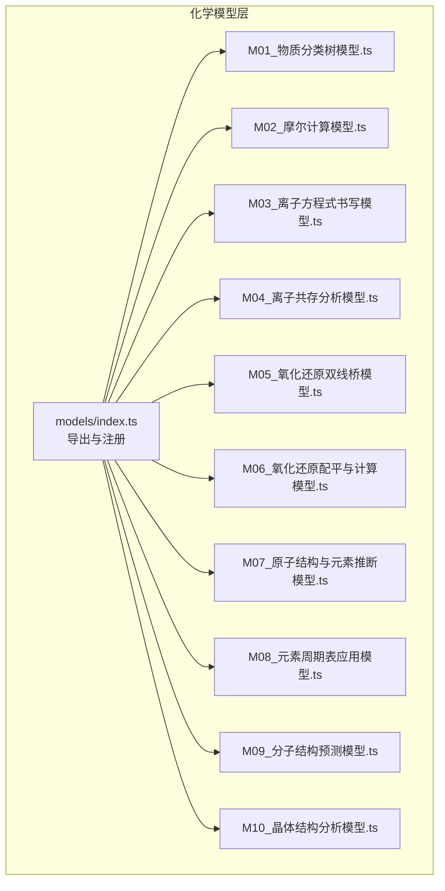
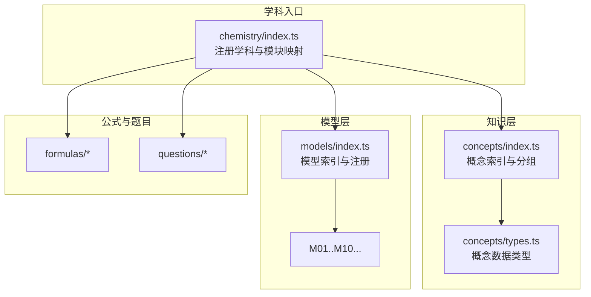
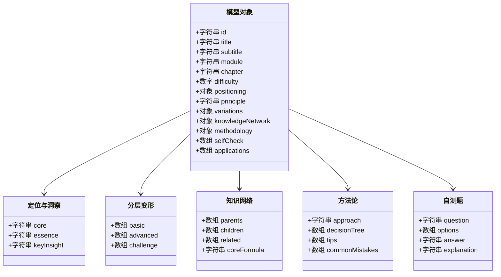
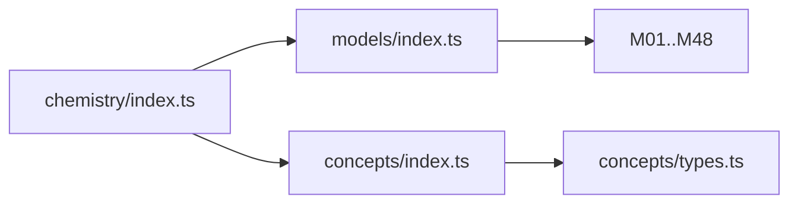

# 化学模型层(M层)

<cite>
**本文引用的文件**
- [src/data/chemistry/models/index.ts](file://src/data/chemistry/models/index.ts)
- [src/data/chemistry/concepts/index.ts](file://src/data/chemistry/concepts/index.ts)
- [src/data/chemistry/concepts/types.ts](file://src/data/chemistry/concepts/types.ts)
- [src/data/chemistry/index.ts](file://src/data/chemistry/index.ts)
- [src/data/chemistry/models/M01_物质分类树模型.ts](file://src/data/chemistry/models/M01_物质分类树模型.ts)
- [src/data/chemistry/models/M02_摩尔计算模型.ts](file://src/data/chemistry/models/M02_摩尔计算模型.ts)
- [src/data/chemistry/models/M03_离子方程式书写模型.ts](file://src/data/chemistry/models/M03_离子方程式书写模型.ts)
- [src/data/chemistry/models/M04_离子共存分析模型.ts](file://src/data/chemistry/models/M04_离子共存分析模型.ts)
- [src/data/chemistry/models/M05_氧化还原双线桥模型.ts](file://src/data/chemistry/models/M05_氧化还原双线桥模型.ts)
- [src/data/chemistry/models/M06_氧化还原配平与计算模型.ts](file://src/data/chemistry/models/M06_氧化还原配平与计算模型.ts)
- [src/data/chemistry/models/M07_原子结构与元素推断模型.ts](file://src/data/chemistry/models/M07_原子结构与元素推断模型.ts)
- [src/data/chemistry/models/M08_元素周期表应用模型.ts](file://src/data/chemistry/models/M08_元素周期表应用模型.ts)
- [src/data/chemistry/models/M09_分子结构预测模型.ts](file://src/data/chemistry/models/M09_分子结构预测模型.ts)
- [src/data/chemistry/models/M10_晶体结构分析模型.ts](file://src/data/chemistry/models/M10_晶体结构分析模型.ts)
</cite>

## 目录
1. [简介](#简介)
2. [项目结构](#项目结构)
3. [核心组件](#核心组件)
4. [架构总览](#架构总览)
5. [详细组件分析](#详细组件分析)
6. [依赖分析](#依赖分析)
7. [性能考虑](#性能考虑)
8. [故障排查指南](#故障排查指南)
9. [结论](#结论)
10. [附录](#附录)

## 简介
本文件系统化梳理“化学模型层(M层)”的设计与实现，覆盖模型ID命名规则、模型元数据结构、模型内容格式、模型分类体系，以及48个核心模型的数据结构与组织方式。面向教师、教研员与平台开发者，提供可落地的模型使用指南、解题步骤与注意事项，并给出版本管理与更新机制建议。

## 项目结构
化学模型层位于学科数据目录下，采用“按模型编号命名”的文件组织方式，每个模型以独立TS文件形式存在，统一通过索引文件集中导出与注册。

图表来源
- [src/data/chemistry/models/index.ts](file://src/data/chemistry/models/index.ts)
- [src/data/chemistry/models/M01_物质分类树模型.ts](file://src/data/chemistry/models/M01_物质分类树模型.ts)
- [src/data/chemistry/models/M02_摩尔计算模型.ts](file://src/data/chemistry/models/M02_摩尔计算模型.ts)
- [src/data/chemistry/models/M03_离子方程式书写模型.ts](file://src/data/chemistry/models/M03_离子方程式书写模型.ts)
- [src/data/chemistry/models/M04_离子共存分析模型.ts](file://src/data/chemistry/models/M04_离子共存分析模型.ts)
- [src/data/chemistry/models/M05_氧化还原双线桥模型.ts](file://src/data/chemistry/models/M05_氧化还原双线桥模型.ts)
- [src/data/chemistry/models/M06_氧化还原配平与计算模型.ts](file://src/data/chemistry/models/M06_氧化还原配平与计算模型.ts)
- [src/data/chemistry/models/M07_原子结构与元素推断模型.ts](file://src/data/chemistry/models/M07_原子结构与元素推断模型.ts)
- [src/data/chemistry/models/M08_元素周期表应用模型.ts](file://src/data/chemistry/models/M08_元素周期表应用模型.ts)
- [src/data/chemistry/models/M09_分子结构预测模型.ts](file://src/data/chemistry/models/M09_分子结构预测模型.ts)
- [src/data/chemistry/models/M10_晶体结构分析模型.ts](file://src/data/chemistry/models/M10_晶体结构分析模型.ts)

章节来源
- [src/data/chemistry/models/index.ts](file://src/data/chemistry/models/index.ts)

## 核心组件
- 模型索引与注册
  - 统一导出所有模型对象，建立“模型ID到模型对象”的映射，维护全部模型ID列表。
  - 提供按模块分组的模型清单，便于前端展示与导航。
- 模型数据结构
  - 每个模型对象包含：标识、标题、模块、章节、难度、副标题、描述、定位与洞察、原理、分层变形、知识网络、方法论、自测题、应用场景等字段。
- 分类体系
  - 模型按“物质分类与计量”“离子反应与氧化还原”“物质结构与元素周期律”“化学反应原理”“无机元素化学”“有机化学”“电化学”“化学实验基础”八大板块组织。
- 关联关系
  - 模型与知识点之间通过ID建立关联；知识点侧可反向指向相关模型。

章节来源
- [src/data/chemistry/models/index.ts](file://src/data/chemistry/models/index.ts)
- [src/data/chemistry/concepts/index.ts](file://src/data/chemistry/concepts/index.ts)
- [src/data/chemistry/concepts/types.ts](file://src/data/chemistry/concepts/types.ts)
- [src/data/chemistry/index.ts](file://src/data/chemistry/index.ts)

## 架构总览
化学模型层与知识层协同工作，形成“知识—模型—题目—范式”的完整闭环。

图表来源
- [src/data/chemistry/index.ts](file://src/data/chemistry/index.ts)
- [src/data/chemistry/concepts/index.ts](file://src/data/chemistry/concepts/index.ts)
- [src/data/chemistry/concepts/types.ts](file://src/data/chemistry/concepts/types.ts)
- [src/data/chemistry/models/index.ts](file://src/data/chemistry/models/index.ts)

## 详细组件分析

### 模型ID命名规则与分类体系
- 命名规则
  - 统一采用“CHE-Mxx”格式，xx为两位序号，范围M01–M48。
- 分类体系
  - 按模块划分：物质分类与计量、离子反应与氧化还原、物质结构与元素周期律、化学反应原理、无机元素化学、有机化学、电化学、化学实验基础。
- 模块到颜色映射
  - 通过颜色类别标识不同模块，便于UI渲染与主题化展示。

章节来源
- [src/data/chemistry/models/index.ts](file://src/data/chemistry/models/index.ts)
- [src/data/chemistry/index.ts](file://src/data/chemistry/index.ts)

### 模型元数据结构
- 字段概览
  - 基础信息：id、title、subtitle、module、chapter、difficulty。
  - 内容结构：positioning（定位）、principle（原理）、variations（分层变形）、knowledgeNetwork（知识网络）、methodology（方法论）、selfCheck（自测）、applications（应用场景）。
- 类型定义参考
  - 概念数据类型与模型数据类型结构相似，便于复用与扩展。

章节来源
- [src/data/chemistry/models/index.ts](file://src/data/chemistry/models/index.ts)
- [src/data/chemistry/concepts/types.ts](file://src/data/chemistry/concepts/types.ts)

### 模型内容格式
- 通用七模块内容
  - 定位与洞察：核心要点、本质提炼、关键洞察。
  - 原理：模型依据的科学原理或规律。
  - 分层变形：基础、进阶、挑战三个层级的变式与要点。
  - 知识网络：父节点、子节点、相关节点与核心公式。
  - 方法论：解题思路、决策树、技巧与易错点。
  - 自测题：单选或多选题，含答案与解析。
  - 应用场景：典型题型或实际应用示例。

章节来源
- [src/data/chemistry/models/M01_物质分类树模型.ts](file://src/data/chemistry/models/M01_物质分类树模型.ts)
- [src/data/chemistry/models/M02_摩尔计算模型.ts](file://src/data/chemistry/models/M02_摩尔计算模型.ts)
- [src/data/chemistry/models/M03_离子方程式书写模型.ts](file://src/data/chemistry/models/M03_离子方程式书写模型.ts)
- [src/data/chemistry/models/M04_离子共存分析模型.ts](file://src/data/chemistry/models/M04_离子共存分析模型.ts)
- [src/data/chemistry/models/M05_氧化还原双线桥模型.ts](file://src/data/chemistry/models/M05_氧化还原双线桥模型.ts)
- [src/data/chemistry/models/M06_氧化还原配平与计算模型.ts](file://src/data/chemistry/models/M06_氧化还原配平与计算模型.ts)
- [src/data/chemistry/models/M07_原子结构与元素推断模型.ts](file://src/data/chemistry/models/M07_原子结构与元素推断模型.ts)
- [src/data/chemistry/models/M08_元素周期表应用模型.ts](file://src/data/chemistry/models/M08_元素周期表应用模型.ts)
- [src/data/chemistry/models/M09_分子结构预测模型.ts](file://src/data/chemistry/models/M09_分子结构预测模型.ts)
- [src/data/chemistry/models/M10_晶体结构分析模型.ts](file://src/data/chemistry/models/M10_晶体结构分析模型.ts)

### 核心模型数据结构（以部分模型为例）

图表来源
- [src/data/chemistry/models/M01_物质分类树模型.ts](file://src/data/chemistry/models/M01_物质分类树模型.ts)
- [src/data/chemistry/models/M02_摩尔计算模型.ts](file://src/data/chemistry/models/M02_摩尔计算模型.ts)
- [src/data/chemistry/models/M03_离子方程式书写模型.ts](file://src/data/chemistry/models/M03_离子方程式书写模型.ts)
- [src/data/chemistry/models/M04_离子共存分析模型.ts](file://src/data/chemistry/models/M04_离子共存分析模型.ts)
- [src/data/chemistry/models/M05_氧化还原双线桥模型.ts](file://src/data/chemistry/models/M05_氧化还原双线桥模型.ts)
- [src/data/chemistry/models/M06_氧化还原配平与计算模型.ts](file://src/data/chemistry/models/M06_氧化还原配平与计算模型.ts)
- [src/data/chemistry/models/M07_原子结构与元素推断模型.ts](file://src/data/chemistry/models/M07_原子结构与元素推断模型.ts)
- [src/data/chemistry/models/M08_元素周期表应用模型.ts](file://src/data/chemistry/models/M08_元素周期表应用模型.ts)
- [src/data/chemistry/models/M09_分子结构预测模型.ts](file://src/data/chemistry/models/M09_分子结构预测模型.ts)
- [src/data/chemistry/models/M10_晶体结构分析模型.ts](file://src/data/chemistry/models/M10_晶体结构分析模型.ts)

### 模型分类与模块映射
- 模块到章节映射
  - 将模型按所属模块进行分组，用于前端“按模块浏览”与“按章节学习”。
- 颜色标识
  - 不同模块使用不同颜色类别，便于视觉识别与主题化展示。

章节来源
- [src/data/chemistry/index.ts](file://src/data/chemistry/index.ts)

### 模型与知识点的关联
- 关联方式
  - 概念侧维护“relatedModels”字段，记录与之相关的模型ID列表。
- 查询接口
  - 提供按ID查询概念元数据的函数，返回名称、模块、章节与难度。

章节来源
- [src/data/chemistry/concepts/index.ts](file://src/data/chemistry/concepts/index.ts)
- [src/data/chemistry/concepts/types.ts](file://src/data/chemistry/concepts/types.ts)

## 依赖分析
- 模块内依赖
  - 模型索引文件集中导入并导出所有模型对象，形成单一入口。
- 学科入口依赖
  - 化学学科入口注册模型索引、模块映射、公式与题目数据，形成完整学科数据集。
- 知识与模型耦合
  - 概念与模型通过ID双向关联，提升检索效率与教学闭环。

图表来源
- [src/data/chemistry/models/index.ts](file://src/data/chemistry/models/index.ts)
- [src/data/chemistry/index.ts](file://src/data/chemistry/index.ts)
- [src/data/chemistry/concepts/index.ts](file://src/data/chemistry/concepts/index.ts)
- [src/data/chemistry/concepts/types.ts](file://src/data/chemistry/concepts/types.ts)

章节来源
- [src/data/chemistry/models/index.ts](file://src/data/chemistry/models/index.ts)
- [src/data/chemistry/index.ts](file://src/data/chemistry/index.ts)
- [src/data/chemistry/concepts/index.ts](file://src/data/chemistry/concepts/index.ts)
- [src/data/chemistry/concepts/types.ts](file://src/data/chemistry/concepts/types.ts)

## 性能考虑
- 数据加载
  - 模型与概念均为静态TS文件，打包后以模块形式加载，避免运行时解析开销。
- 查询效率
  - 通过ID映射与分组列表快速定位模块与模型，适合高频查询场景。
- 渲染优化
  - 模块颜色映射与章节分组减少前端重复计算，提升页面渲染性能。

## 故障排查指南
- 模型缺失或ID错误
  - 症状：模型ID不在索引中或无法渲染。
  - 排查：检查模型文件是否存在、ID是否与文件名一致、索引导出是否正确。
- 模块映射不一致
  - 症状：模型显示模块错误或颜色异常。
  - 排查：核对模块名称与颜色映射配置，确保与模型声明一致。
- 知识点与模型未关联
  - 症状：概念页未显示相关模型。
  - 排查：确认概念侧的“relatedModels”字段包含目标模型ID，且模型ID大小写与索引一致。

章节来源
- [src/data/chemistry/models/index.ts](file://src/data/chemistry/models/index.ts)
- [src/data/chemistry/index.ts](file://src/data/chemistry/index.ts)
- [src/data/chemistry/concepts/index.ts](file://src/data/chemistry/concepts/index.ts)

## 结论
化学模型层(M层)以清晰的命名规则、稳定的元数据结构与模块化组织，构建了覆盖高中化学核心知识的模型体系。通过与知识层、公式与题目层的协同，形成“教—学—练—评”的完整闭环。建议在内容建设过程中严格遵循现有结构，确保模型ID、模块与难度标注的一致性，保障平台的可维护性与扩展性。

## 附录
- 模型ID清单（CHE-M01–CHE-M48）
  - 已在索引文件中集中维护，便于统一管理与校验。
- 更新机制建议
  - 新增模型：新增TS文件并同步更新索引导出与ID清单。
  - 修改模型：保持字段兼容，必要时增加版本号或迁移脚本。
  - 删除模型：先清理关联关系，再移除索引与清单条目。

章节来源
- [src/data/chemistry/models/index.ts](file://src/data/chemistry/models/index.ts)