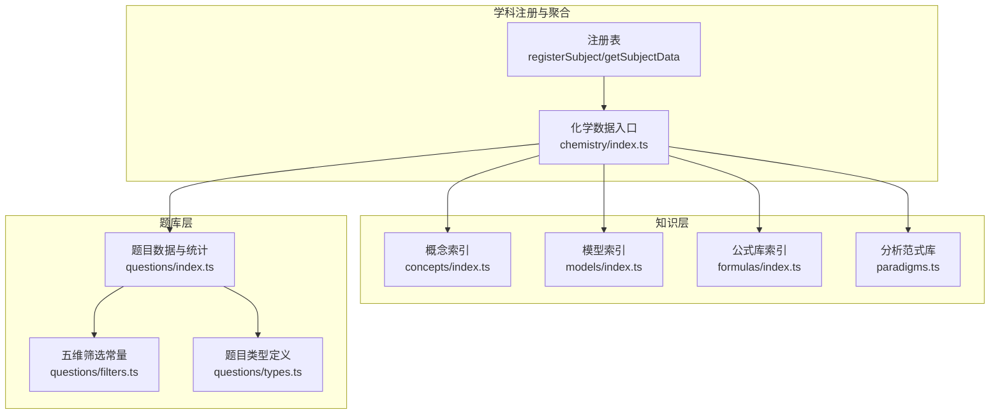
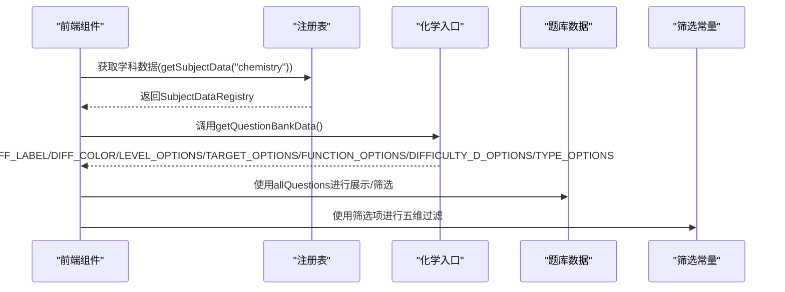
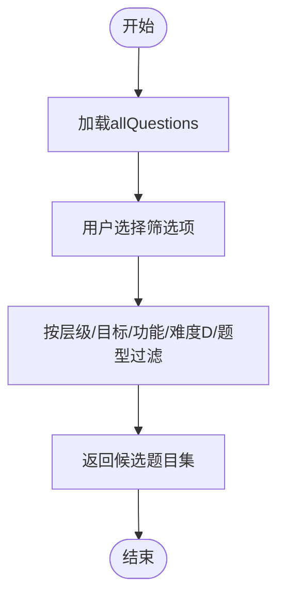
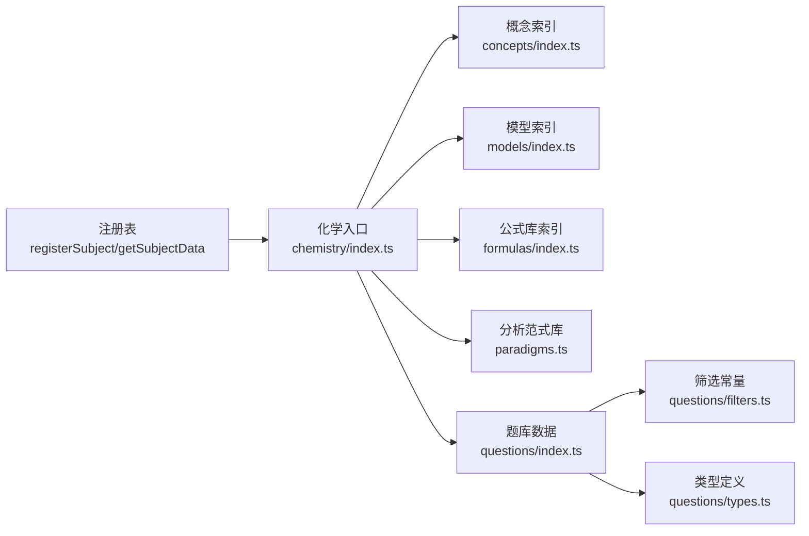

# 化学题库层(P层)

<cite>
**本文引用的文件**
- [src/data/chemistry/questions/index.ts](file://src/data/chemistry/questions/index.ts)
- [src/data/chemistry/questions/types.ts](file://src/data/chemistry/questions/types.ts)
- [src/data/chemistry/questions/filters.ts](file://src/data/chemistry/questions/filters.ts)
- [src/data/chemistry/index.ts](file://src/data/chemistry/index.ts)
- [src/data/chemistry/concepts/types.ts](file://src/data/chemistry/concepts/types.ts)
- [src/data/chemistry/models/index.ts](file://src/data/chemistry/models/index.ts)
- [src/data/chemistry/formulas/index.ts](file://src/data/chemistry/formulas/index.ts)
- [src/data/chemistry/formulas/types.ts](file://src/data/chemistry/formulas/types.ts)
- [src/data/chemistry/paradigms.ts](file://src/data/chemistry/paradigms.ts)
- [src/data/chemistry/concepts/index.ts](file://src/data/chemistry/concepts/index.ts)
- [src/data/registry.ts](file://src/data/registry.ts)
- [src/types/index.ts](file://src/types/index.ts)
</cite>

## 目录
1. [简介](#简介)
2. [项目结构](#项目结构)
3. [核心组件](#核心组件)
4. [架构总览](#架构总览)
5. [详细组件分析](#详细组件分析)
6. [依赖分析](#依赖分析)
7. [性能考虑](#性能考虑)
8. [故障排查指南](#故障排查指南)
9. [结论](#结论)
10. [附录](#附录)

## 简介
本文件系统化梳理“化学题库层(P层)”的设计与实现，覆盖以下方面：
- 题目ID命名规则与元数据结构
- 题目内容格式与题库分类体系
- 按知识点、难度、题型的组织与筛选
- 题目过滤器、统计分析、错题管理与学习进度跟踪
- 题目增删改查、关联关系、质量评估与版本控制
- 导入导出、批量操作与数据备份恢复

当前仓库中，化学题库层以“空框架”形式存在，数据由AI逐步填充；本文在不臆测具体数据的前提下，基于现有类型定义与注册机制，给出可落地的实现蓝图与最佳实践。

## 项目结构
化学题库层位于学科数据目录下，采用“按学科分层”的组织方式：
- 数据入口：学科注册与聚合
- 知识层：概念、模型、公式、范式
- 题库层：题目、过滤器、统计

图表来源
- [src/data/chemistry/index.ts:135-183](file://src/data/chemistry/index.ts#L135-L183)
- [src/data/registry.ts:42-48](file://src/data/registry.ts#L42-L48)
- [src/data/chemistry/questions/index.ts:1-19](file://src/data/chemistry/questions/index.ts#L1-L19)
- [src/data/chemistry/questions/filters.ts:1-47](file://src/data/chemistry/questions/filters.ts#L1-L47)
- [src/data/chemistry/questions/types.ts:1-28](file://src/data/chemistry/questions/types.ts#L1-L28)
- [src/data/chemistry/concepts/index.ts:1-244](file://src/data/chemistry/concepts/index.ts#L1-L244)
- [src/data/chemistry/models/index.ts:1-209](file://src/data/chemistry/models/index.ts#L1-L209)
- [src/data/chemistry/formulas/index.ts:1-19](file://src/data/chemistry/formulas/index.ts#L1-L19)
- [src/data/chemistry/paradigms.ts:1-25](file://src/data/chemistry/paradigms.ts#L1-L25)

章节来源
- [src/data/chemistry/index.ts:1-186](file://src/data/chemistry/index.ts#L1-L186)
- [src/data/registry.ts:1-52](file://src/data/registry.ts#L1-L52)

## 核心组件
- 题目数据与统计
  - 题目数组、按模型分组的题目映射、模型题目统计
  - 难度标签与颜色映射
- 题目类型定义
  - 题目字段：ID、模型ID、难度、题型、耗时、标签、提示、题干、选项、答案、解析、知识点、套路、层级、目标、功能、难度D
- 五维筛选常量
  - 层级(L1/L2/L3)、目标(同步/考试/高考/基础/竞赛)、功能(诊断/练习/变式/综合/真实情境/方法)、难度D(1-6)、题型(选择/填空/计算/多选/图像/实验/无机推断/有机推断/流程分析)
- 化学学科注册入口
  - 提供概念、模型、公式、范式、题库数据的统一访问接口，并注册到全局注册表

章节来源
- [src/data/chemistry/questions/index.ts:1-19](file://src/data/chemistry/questions/index.ts#L1-L19)
- [src/data/chemistry/questions/types.ts:1-28](file://src/data/chemistry/questions/types.ts#L1-L28)
- [src/data/chemistry/questions/filters.ts:1-47](file://src/data/chemistry/questions/filters.ts#L1-L47)
- [src/data/chemistry/index.ts:135-183](file://src/data/chemistry/index.ts#L135-L183)

## 架构总览
化学题库层遵循“注册表+学科入口”的统一架构，面向前端组件提供标准化数据契约，确保题库与其他知识层协同工作。

图表来源
- [src/data/registry.ts:42-48](file://src/data/registry.ts#L42-L48)
- [src/data/chemistry/index.ts:170-179](file://src/data/chemistry/index.ts#L170-L179)

章节来源
- [src/data/registry.ts:4-38](file://src/data/registry.ts#L4-L38)
- [src/data/chemistry/index.ts:135-183](file://src/data/chemistry/index.ts#L135-L183)

## 详细组件分析

### 题目ID命名规则与元数据结构
- 题目ID命名规则
  - 题目ID采用“学科缩写+题型简写+序号”的格式，例如“CHE-B01”。该规则与物理题库保持一致，便于跨学科统一管理与检索。
- 题目元数据结构
  - 字段覆盖：题干、选项、答案、解析、知识点、套路、层级、目标、功能、难度D、耗时、标签、提示等
  - 支持Markdown与LaTeX渲染，满足化学题目的图文混排需求
- 题型分类
  - 选择题、填空题、计算题、多选题、图像分析题、实验设计题、无机推断题、有机推断题、流程分析题
- 难度分级
  - 两级：B(基础)/J(进阶)/T(挑战)
  - 六级：D1-D6，提供颜色编码用于可视化

章节来源
- [src/data/chemistry/questions/types.ts:4-27](file://src/data/chemistry/questions/types.ts#L4-L27)
- [src/data/chemistry/questions/filters.ts:36-46](file://src/data/chemistry/questions/filters.ts#L36-L46)
- [src/data/chemistry/questions/index.ts:12-18](file://src/data/chemistry/questions/index.ts#L12-L18)

### 题库分类体系
- 按知识点分类
  - 通过“知识点ID数组”将题目与概念节点关联，支持按C01~C57进行筛选与统计
- 按难度分级
  - 二级难度(B/J/T)与六级难度(D1-D6)并行，满足不同教学阶段与测评需求
- 按题型分类
  - 题型选项覆盖化学常见题型，便于按题型维度进行专项训练
- 按目标与功能分类
  - 目标：同步练习、期中期末、高考真题、基础巩固、竞赛拓展
  - 功能：诊断、练习、变式、综合、真实情境、方法

章节来源
- [src/data/chemistry/questions/types.ts:20-26](file://src/data/chemistry/questions/types.ts#L20-L26)
- [src/data/chemistry/questions/filters.ts:4-25](file://src/data/chemistry/questions/filters.ts#L4-L25)

### 题目过滤器实现机制
- 五维筛选项
  - 层级(L1/L2/L3)、目标(SYNC/EXAM/GAOKAO/FOUNDATION/COMPETE)、功能(DIAG/PRACTICE/VARIATION/INTEGRATED/REAL/METHOD)、难度D(1-6)、题型(九种)
- 过滤流程
  - 前端根据用户选择的筛选项，对allQuestions进行多维过滤，返回候选题目集
  - 难度标签与颜色映射用于界面直观展示

图表来源
- [src/data/chemistry/questions/index.ts:6-10](file://src/data/chemistry/questions/index.ts#L6-L10)
- [src/data/chemistry/questions/filters.ts:1-47](file://src/data/chemistry/questions/filters.ts#L1-L47)

章节来源
- [src/data/chemistry/questions/filters.ts:1-47](file://src/data/chemistry/questions/filters.ts#L1-L47)

### 题目统计分析功能
- 模型题目统计
  - modelQuestionStats提供每个模型的题目数量分布(B/J/T/总计)，便于评估模型覆盖度与难度分布
- 难度标签与颜色
  - DIFF_LABEL与DIFF_COLOR用于将难度映射为中文标签与视觉颜色，提升可视化效果

章节来源
- [src/data/chemistry/questions/index.ts:10-18](file://src/data/chemistry/questions/index.ts#L10-L18)

### 错题管理机制与学习进度跟踪
- 错题记录结构
  - 包含题目ID、学科、模型ID、题目内容、我的答案、正确答案、是否正确、错误原因、涉及知识点、是否已复习、复习次数、是否已掌握、创建与更新时间等
- 学习进度结构
  - 提供学科级学习统计、模型级统计、做题记录与错题记录等，支撑学习路径与能力画像

章节来源
- [src/types/index.ts:146-188](file://src/types/index.ts#L146-L188)

### 题目增删改查、关联关系与质量评估
- 增删改查
  - 在“空框架”基础上，建议在questions/index.ts中维护allQuestions与questionsByModel，并提供增删改查函数
- 关联关系
  - 题目与知识点(Cxx)、模型(Mxx)、套路(Strategy)建立多对多关联，支持按知识点或模型聚合
- 质量评估
  - 建议引入“质量评分”字段与“审核状态”，结合错题率、平均耗时、知识点覆盖率等指标进行评估
- 版本控制
  - 采用Git分支与标签管理题目版本，配合变更日志记录重大修订

（本节为实现建议，未直接分析具体代码文件）

### 题库数据的导入导出、批量操作与备份恢复
- 导入导出
  - 建议提供JSON/CSV格式的导入导出接口，支持批量新增、更新与删除
- 批量操作
  - 支持按筛选条件批量标记、批量导出、批量修改难度或题型
- 备份恢复
  - 定期导出全量数据作为备份；异常时可从最近一次备份恢复

（本节为实现建议，未直接分析具体代码文件）

## 依赖分析
化学题库层与知识层、注册表之间存在清晰的依赖关系：
- 注册表提供统一的数据契约与注册机制
- 化学入口聚合概念、模型、公式、范式与题库数据，并暴露给前端
- 题库层依赖筛选常量与类型定义，保证数据一致性

图表来源
- [src/data/registry.ts:42-48](file://src/data/registry.ts#L42-L48)
- [src/data/chemistry/index.ts:135-183](file://src/data/chemistry/index.ts#L135-L183)
- [src/data/chemistry/questions/index.ts:1-19](file://src/data/chemistry/questions/index.ts#L1-L19)
- [src/data/chemistry/questions/filters.ts:1-47](file://src/data/chemistry/questions/filters.ts#L1-L47)
- [src/data/chemistry/questions/types.ts:1-28](file://src/data/chemistry/questions/types.ts#L1-L28)
- [src/data/chemistry/concepts/index.ts:1-244](file://src/data/chemistry/concepts/index.ts#L1-L244)
- [src/data/chemistry/models/index.ts:1-209](file://src/data/chemistry/models/index.ts#L1-L209)
- [src/data/chemistry/formulas/index.ts:1-19](file://src/data/chemistry/formulas/index.ts#L1-L19)
- [src/data/chemistry/paradigms.ts:1-25](file://src/data/chemistry/paradigms.ts#L1-L25)

章节来源
- [src/data/registry.ts:1-52](file://src/data/registry.ts#L1-L52)
- [src/data/chemistry/index.ts:1-186](file://src/data/chemistry/index.ts#L1-L186)

## 性能考虑
- 数据结构优化
  - 使用索引映射(如questionsByModel)加速按模型查询
  - 将筛选常量与标签预编译，减少运行时计算
- 渲染性能
  - 对大量题目进行虚拟滚动与分页加载
  - 按需渲染，避免一次性渲染全部题目
- 查询效率
  - 前端多维过滤采用惰性求值，仅在用户确认筛选时执行
  - 后端(若扩展)提供索引与缓存，降低数据库压力

（本节为通用指导，未直接分析具体代码文件）

## 故障排查指南
- 题目缺失或为空
  - 检查questions/index.ts中的allQuestions与questionsByModel是否已填充
  - 确认modelQuestionStats是否正确初始化
- 筛选结果异常
  - 核对筛选常量与题目的字段是否匹配
  - 检查DIFF_LABEL/DIFF_COLOR映射是否正确
- 难度显示不一致
  - 确认难度字段与筛选项的取值范围一致
- 知识点/模型关联错误
  - 校验题目中的points与routineIds是否与概念/模型ID一致

章节来源
- [src/data/chemistry/questions/index.ts:6-10](file://src/data/chemistry/questions/index.ts#L6-L10)
- [src/data/chemistry/questions/filters.ts:1-47](file://src/data/chemistry/questions/filters.ts#L1-L47)

## 结论
化学题库层(P层)以“空框架”为基础，通过严格的类型定义与注册机制，实现了与知识层的无缝对接。建议在现有基础上逐步填充题目数据，并完善增删改查、批量操作、质量评估与版本控制等能力，最终形成可维护、可扩展、可视化的化学题库体系。

## 附录
- 术语
  - P层：指题库层，负责题目的组织、筛选与统计
  - 五维：层级、目标、功能、难度D、题型
- 参考
  - 物理题库结构与命名规则可作为化学题库的参考模板

（本节为补充说明，未直接分析具体代码文件）