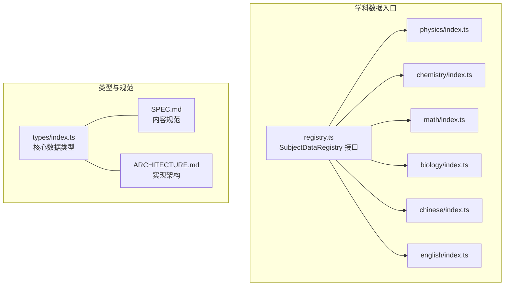
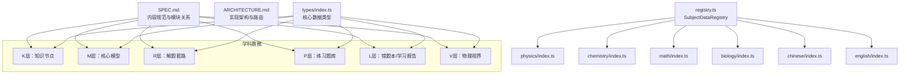
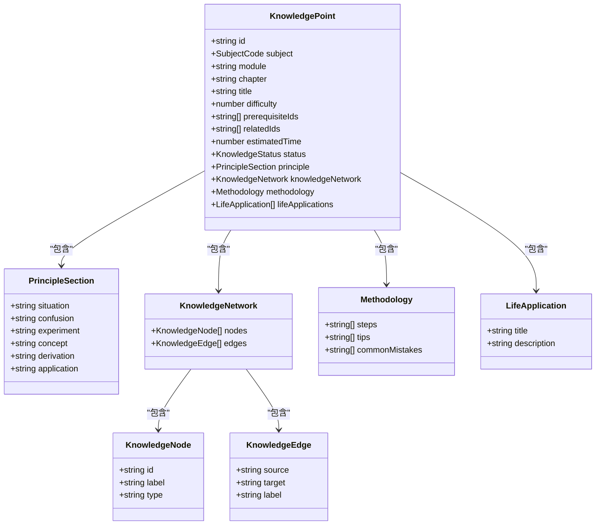
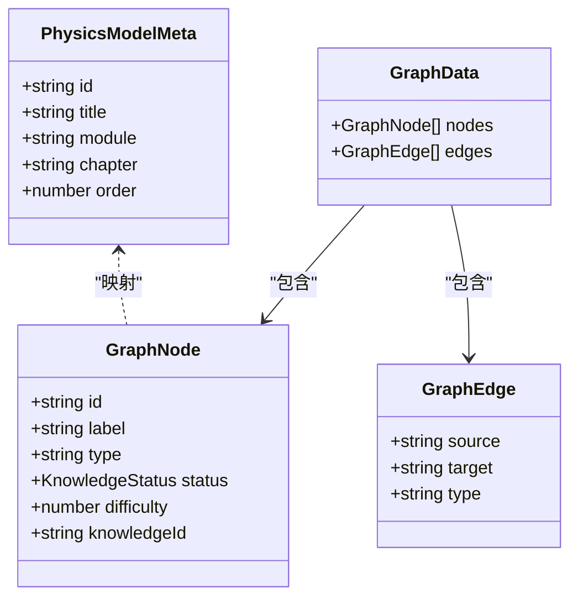
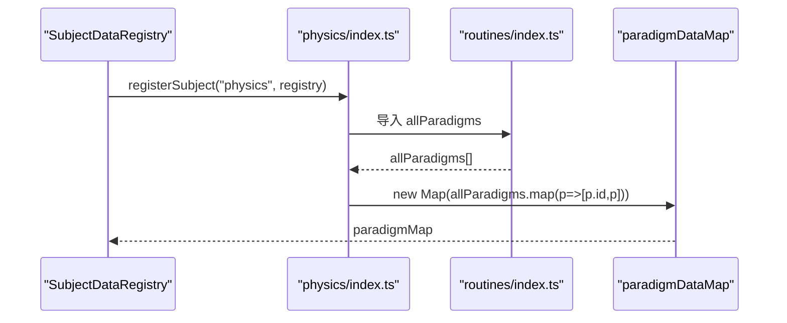
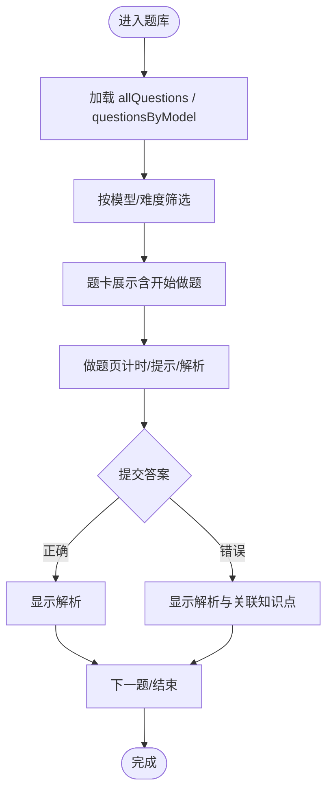
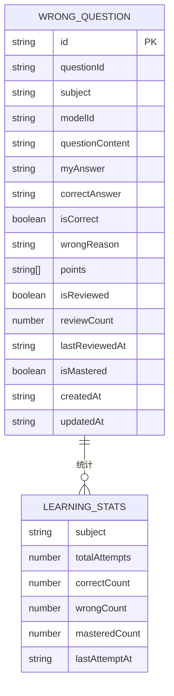
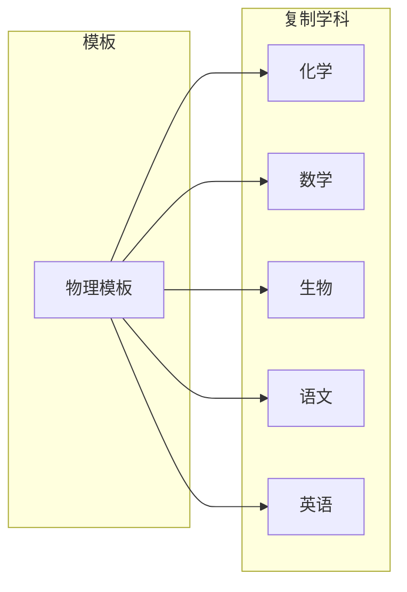
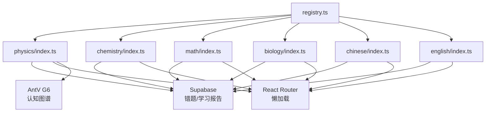

# 学科数据结构

<cite>
**本文档引用的文件**
- [SPEC.md](file://SPEC.md)
- [ARCHITECTURE.md](file://ARCHITECTURE.md)
- [src/data/registry.ts](file://src/data/registry.ts)
- [src/types/index.ts](file://src/types/index.ts)
- [src/data/physics/index.ts](file://src/data/physics/index.ts)
- [src/data/physics/physicsData.ts](file://src/data/physics/physicsData.ts)
- [src/data/physics/physicsModels.ts](file://src/data/physics/physicsModels.ts)
- [src/data/chemistry/index.ts](file://src/data/chemistry/index.ts)
- [src/data/math/index.ts](file://src/data/math/index.ts)
- [src/data/biology/index.ts](file://src/data/biology/index.ts)
- [src/data/chinese/index.ts](file://src/data/chinese/index.ts)
- [src/data/english/index.ts](file://src/data/english/index.ts)
</cite>

## 目录
1. [简介](#简介)
2. [项目结构](#项目结构)
3. [核心组件](#核心组件)
4. [架构总览](#架构总览)
5. [详细组件分析](#详细组件分析)
6. [依赖分析](#依赖分析)
7. [性能考虑](#性能考虑)
8. [故障排查指南](#故障排查指南)
9. [结论](#结论)
10. [附录](#附录)

## 简介
本文件系统化阐述“星耀”平台的学科数据结构与实现，聚焦物理、化学、数学、生物、语文、英语六大学科。文档围绕五层数据架构展开：K层（知识节点）、M层（核心模型）、R层（解题套路）、P层（练习题库）、L层（错题本/学习报告）。同时，结合内容规范与实现架构，说明各学科数据的组织方式、导入机制、数据格式、存储结构以及增删改查与一致性保障。

## 项目结构
- 学科数据入口统一通过 SubjectDataRegistry 接口注册，实现“物理/化学/数学/生物/语文/英语”六科的统一访问协议。
- 物理作为完整模板，其 K/M/R/P/L/V 数据与路由、组件、图谱均已落地；其他学科按统一模板逐步复制落地。
- 数据类型与接口定义集中在 src/types/index.ts，确保各学科数据结构一致、可扩展。

图表来源
- [src/data/registry.ts:4-38](file://src/data/registry.ts#L4-L38)
- [src/data/physics/index.ts:1-433](file://src/data/physics/index.ts#L1-L433)
- [src/data/chemistry/index.ts:1-186](file://src/data/chemistry/index.ts#L1-L186)
- [src/data/math/index.ts:1-166](file://src/data/math/index.ts#L1-L166)
- [src/data/biology/index.ts:1-150](file://src/data/biology/index.ts#L1-L150)
- [src/data/chinese/index.ts:1-150](file://src/data/chinese/index.ts#L1-L150)
- [src/data/english/index.ts:1-150](file://src/data/english/index.ts#L1-L150)
- [src/types/index.ts:1-209](file://src/types/index.ts#L1-L209)
- [SPEC.md:1-1075](file://SPEC.md#L1-L1075)
- [ARCHITECTURE.md:1-369](file://ARCHITECTURE.md#L1-L369)

章节来源
- [SPEC.md:9-72](file://SPEC.md#L9-L72)
- [ARCHITECTURE.md:27-84](file://ARCHITECTURE.md#L27-L84)
- [src/data/registry.ts:4-38](file://src/data/registry.ts#L4-L38)

## 核心组件
- SubjectDataRegistry 接口：定义学科数据的统一访问契约，包括概念、模型、公式、套路、题库、统计、图谱等查询方法。
- 物理学科入口：提供 K/M/R/P/L/V 的完整实现，支持模块化、可扩展的注册与查询。
- 其他学科入口：按物理模板复制，逐步完善 K/M/R/P/L/V 的数据与路由。

章节来源
- [src/data/registry.ts:4-38](file://src/data/registry.ts#L4-L38)
- [src/data/physics/index.ts:383-431](file://src/data/physics/index.ts#L383-L431)
- [src/data/chemistry/index.ts:135-183](file://src/data/chemistry/index.ts#L135-L183)
- [src/data/math/index.ts:126-151](file://src/data/math/index.ts#L126-L151)
- [src/data/biology/index.ts:125-150](file://src/data/biology/index.ts#L125-L150)
- [src/data/chinese/index.ts:125-150](file://src/data/chinese/index.ts#L125-L150)
- [src/data/english/index.ts:125-150](file://src/data/english/index.ts#L125-L150)

## 架构总览
- 数据层：K/M/R/P/L/V 五层数据以静态文件为主，配合 registry 注册与查询。
- 类型层：src/types/index.ts 统一定义 Subject、KnowledgePoint、Strategy、Question、GraphData 等核心类型。
- 规范层：SPEC.md 明确内容规范、模块关系、难度层级、数据流转与一致性要求。
- 实现层：ARCHITECTURE.md 描述路由、组件、图谱、题库数据流与部署方式。

图表来源
- [SPEC.md:9-72](file://SPEC.md#L9-L72)
- [ARCHITECTURE.md:27-84](file://ARCHITECTURE.md#L27-L84)
- [src/types/index.ts:1-209](file://src/types/index.ts#L1-L209)
- [src/data/registry.ts:4-38](file://src/data/registry.ts#L4-L38)
- [src/data/physics/index.ts:1-433](file://src/data/physics/index.ts#L1-L433)
- [src/data/chemistry/index.ts:1-186](file://src/data/chemistry/index.ts#L1-L186)
- [src/data/math/index.ts:1-166](file://src/data/math/index.ts#L1-L166)
- [src/data/biology/index.ts:1-150](file://src/data/biology/index.ts#L1-L150)
- [src/data/chinese/index.ts:1-150](file://src/data/chinese/index.ts#L1-L150)
- [src/data/english/index.ts:1-150](file://src/data/english/index.ts#L1-L150)

## 详细组件分析

### K层（知识节点）数据结构与实现
- 设计理念：K层是认知网络的底层节点，粒度最小，强调“概念/规律”的原子化表达，服务于模型与题目的支撑。
- 数据组织：物理 K 层以 K01-K56 的编号体系划分七大板块（运动学、力学、曲线运动与万有引力、能量与动量、电磁学、热学·光学·机械波、近代物理），每个节点包含定义、核心公式、前置/后续/相关节点、常见误解、关键词等。
- 存储与查询：通过 physics/index.ts 的概念数据映射与元数据查询接口，统一暴露给上层组件与路由。
- 一致性保障：双向引用校验（prerequisites ↔ successors）、无环依赖、K→M 关联约束。

图表来源
- [src/types/index.ts:35-87](file://src/types/index.ts#L35-L87)
- [src/types/index.ts:52-76](file://src/types/index.ts#L52-L76)
- [src/types/index.ts:78-82](file://src/types/index.ts#L78-L82)
- [src/types/index.ts:84-87](file://src/types/index.ts#L84-L87)

章节来源
- [SPEC.md:523-583](file://SPEC.md#L523-L583)
- [src/data/physics/index.ts:78-196](file://src/data/physics/index.ts#L78-L196)
- [src/types/index.ts:35-87](file://src/types/index.ts#L35-L87)

### M层（核心模型）数据结构与实现
- 设计理念：M层是连接知识与题目的能力单元，包含七模块（定位与本质、核心原理、分层变形、知识网络、方法论、自我检测、生活应用）。
- 数据组织：物理 M 层包含 42 个模型，按模块/章节组织；化学/数学按统一模板复制，学科前缀替换为 CHE/MAT。
- 存储与查询：通过 physics/index.ts/chemistry/index.ts 等入口导出模型数据与映射，支持按模块分组与难度排序。
- 一致性保障：模块字段齐全、难度对应、数量限制、命名规范、序列化格式统一。

图表来源
- [src/data/physics/physicsModels.ts:12-65](file://src/data/physics/physicsModels.ts#L12-L65)
- [src/types/index.ts:190-209](file://src/types/index.ts#L190-L209)
- [src/data/physics/physicsData.ts:80-120](file://src/data/physics/physicsData.ts#L80-L120)

章节来源
- [SPEC.md:372-462](file://SPEC.md#L372-L462)
- [src/data/physics/physicsModels.ts:22-65](file://src/data/physics/physicsModels.ts#L22-L65)
- [src/data/physics/physicsData.ts:4-39](file://src/data/physics/physicsData.ts#L4-L39)
- [src/data/physics/physicsData.ts:80-120](file://src/data/physics/physicsData.ts#L80-L120)

### R层（解题套路）数据结构与实现
- 设计理念：R层是跨模型的通用/特定解题方法，提供“步骤/题型/错误/口诀/讲解”的标准化范式。
- 数据组织：物理 R 层已拆分为 90 个独立文件，通过 routines/index.ts 统一导出 allParadigms 与 paradigmMap。
- 存储与查询：通过 physics/index.ts 注册 paradigmDataMap，支持按模型主关联、难度、分类筛选。
- 一致性保障：范式数量、字段数量、难度层级、ID 唯一性等规范。

图表来源
- [src/data/physics/index.ts:8-8](file://src/data/physics/index.ts#L8-L8)
- [src/data/physics/index.ts:383-431](file://src/data/physics/index.ts#L383-L431)

章节来源
- [SPEC.md:118-161](file://SPEC.md#L118-L161)
- [src/data/physics/index.ts:8-8](file://src/data/physics/index.ts#L8-L8)
- [src/data/physics/index.ts:383-431](file://src/data/physics/index.ts#L383-L431)

### P层（练习题库）数据结构与实现
- 设计理念：P层为实战训练，按模型配套题（B/J/T三层），支持难度筛选、题型分类、标签标注。
- 数据组织：物理题库示例展示 B/J/T 分布与做题页交互；其他学科按模板复制。
- 存储与查询：通过 physics/index.ts/chemistry/index.ts 等导出 allQuestions、questionsByModel、统计与筛选选项。
- 一致性保障：难度层级定义、题型字段、答案解析、标签与知识点关联。

图表来源
- [SPEC.md:190-236](file://SPEC.md#L190-L236)
- [src/data/physics/index.ts:415-427](file://src/data/physics/index.ts#L415-L427)

章节来源
- [SPEC.md:190-236](file://SPEC.md#L190-L236)
- [src/data/physics/index.ts:415-427](file://src/data/physics/index.ts#L415-L427)

### L层（错题本/学习报告）数据结构与实现
- 设计理念：L层由练习记录自动聚合，无需手动填充，支持错题本与学习报告的自动生成。
- 数据组织：WrongQuestionRecord 与 LearningReport 由 Supabase 聚合，前端通过 Store 与服务端交互。
- 一致性保障：提交记录与聚合统计的原子性、时间戳与状态字段的完整性。

图表来源
- [src/types/index.ts:146-188](file://src/types/index.ts#L146-L188)

章节来源
- [SPEC.md:239-263](file://SPEC.md#L239-L263)
- [src/types/index.ts:146-188](file://src/types/index.ts#L146-L188)

### V层（物理视界）数据结构与实现
- 设计理念：V层为拓展视野，提供物理主题故事，按分类（溯源/群星/察微/前沿/思辨/迷思/谜题/幻想/趣玩/跨学科）组织。
- 数据组织：physics/index.ts 提供视界故事数据与路由；其他学科可按模板复制。
- 一致性保障：分类统一、ID 唯一、内容结构化（标题/副标题/时长/正文）。

章节来源
- [SPEC.md:164-187](file://SPEC.md#L164-L187)
- [src/data/physics/physicsData.ts:122-137](file://src/data/physics/physicsData.ts#L122-L137)

### 六大学科数据导入机制与格式
- 物理：K/M/R/P/L/V 全量落地，模块化注册，路由与组件复用。
- 化学/数学：按物理模板复制，学科前缀替换，模块/模型/套路/题库/公式/视界按模板迁移。
- 生物/语文/英语：按模板复制，题库/视界等内容待完善。

图表来源
- [SPEC.md:664-677](file://SPEC.md#L664-L677)
- [src/data/physics/index.ts:19-76](file://src/data/physics/index.ts#L19-L76)
- [src/data/chemistry/index.ts:22-93](file://src/data/chemistry/index.ts#L22-L93)
- [src/data/math/index.ts:1-166](file://src/data/math/index.ts#L1-L166)
- [src/data/biology/index.ts:1-150](file://src/data/biology/index.ts#L1-L150)
- [src/data/chinese/index.ts:1-150](file://src/data/chinese/index.ts#L1-L150)
- [src/data/english/index.ts:1-150](file://src/data/english/index.ts#L1-L150)

章节来源
- [SPEC.md:630-677](file://SPEC.md#L630-L677)
- [src/data/physics/index.ts:19-76](file://src/data/physics/index.ts#L19-L76)
- [src/data/chemistry/index.ts:22-93](file://src/data/chemistry/index.ts#L22-L93)
- [src/data/math/index.ts:1-166](file://src/data/math/index.ts#L1-L166)
- [src/data/biology/index.ts:1-150](file://src/data/biology/index.ts#L1-L150)
- [src/data/chinese/index.ts:1-150](file://src/data/chinese/index.ts#L1-L150)
- [src/data/english/index.ts:1-150](file://src/data/english/index.ts#L1-L150)

## 依赖分析
- 组件耦合：学科入口通过 registry 注册 SubjectDataRegistry，向上层组件与路由提供统一查询接口。
- 数据耦合：K/M/R/P/L/V 数据以静态文件为主，通过 index.ts 汇总与映射，降低跨模块耦合。
- 外部依赖：Supabase 用于错题本与学习报告的聚合；路由懒加载减少首屏压力；AntV G6 用于认知图谱渲染。

图表来源
- [src/data/registry.ts:40-48](file://src/data/registry.ts#L40-L48)
- [src/data/physics/index.ts:383-431](file://src/data/physics/index.ts#L383-L431)
- [src/data/chemistry/index.ts:135-183](file://src/data/chemistry/index.ts#L135-L183)
- [src/data/math/index.ts:126-151](file://src/data/math/index.ts#L126-L151)
- [src/data/biology/index.ts:125-150](file://src/data/biology/index.ts#L125-L150)
- [src/data/chinese/index.ts:125-150](file://src/data/chinese/index.ts#L125-L150)
- [src/data/english/index.ts:125-150](file://src/data/english/index.ts#L125-L150)
- [ARCHITECTURE.md:27-84](file://ARCHITECTURE.md#L27-L84)
- [ARCHITECTURE.md:205-247](file://ARCHITECTURE.md#L205-L247)

章节来源
- [ARCHITECTURE.md:27-84](file://ARCHITECTURE.md#L27-L84)
- [ARCHITECTURE.md:205-247](file://ARCHITECTURE.md#L205-L247)

## 性能考虑
- 懒加载：题库与专区路由采用懒加载，避免首屏膨胀。
- 静态数据：K/M/R/P/L/V 以静态文件为主，减少网络请求与数据库压力。
- 图谱渲染：认知图谱按需渲染，节点/边数据结构清晰，便于增量更新。
- 缓存与索引：paradigmDataMap 等映射结构提升查询效率。

章节来源
- [ARCHITECTURE.md:29-44](file://ARCHITECTURE.md#L29-L44)
- [src/data/physics/index.ts:8-8](file://src/data/physics/index.ts#L8-L8)

## 故障排查指南
- 数据不一致：检查 K 节点的 prerequisites/successors 双向引用是否一致，避免循环依赖；检查 M 层 knowledgeNetwork 的 parents/children 对应关系。
- 路由与导航：确认学科路由已在 App.tsx 注册，导航组件按学科动态生成模块列表。
- Supabase 保护：调用 Supabase 前检查 isSupabaseConfigured，未配置时优雅降级。
- 题库加载：确认 questionsByModel 与 allQuestions 的分组与汇总逻辑正确。

章节来源
- [SPEC.md:575-583](file://SPEC.md#L575-L583)
- [SPEC.md:482-502](file://SPEC.md#L482-L502)
- [ARCHITECTURE.md:207-223](file://ARCHITECTURE.md#L207-L223)
- [src/data/physics/index.ts:415-427](file://src/data/physics/index.ts#L415-L427)

## 结论
本文件基于 SPEC 与 ARCHITECTURE 的规范与实现，系统化梳理了六大学科的 K/M/R/P/L/V 数据结构与实现方式。物理作为完整模板，提供了可复用的模块化数据组织与注册机制；其他学科按统一模板复制落地，逐步完善题库与视界等内容。通过统一的数据类型、严格的规范与一致性保障，平台实现了从知识到题目的高效贯通与可扩展的学科体系。

## 附录
- 数据导入流程（以新增学科为例）：
  1) 在 src/data/{subject}/ 下创建数据文件（concepts/models/paradigms/questions/formulas 等）。
  2) 在 src/data/{subject}/index.ts 中实现 SubjectDataRegistry 接口并注册。
  3) 在路由与导航中增加学科入口与模块列表。
  4) 复用现有组件（ListPage/DetailPage/QuestionBank 等）实现展示与交互。

章节来源
- [SPEC.md:352-371](file://SPEC.md#L352-L371)
- [SPEC.md:664-677](file://SPEC.md#L664-L677)
- [ARCHITECTURE.md:47-84](file://ARCHITECTURE.md#L47-L84)