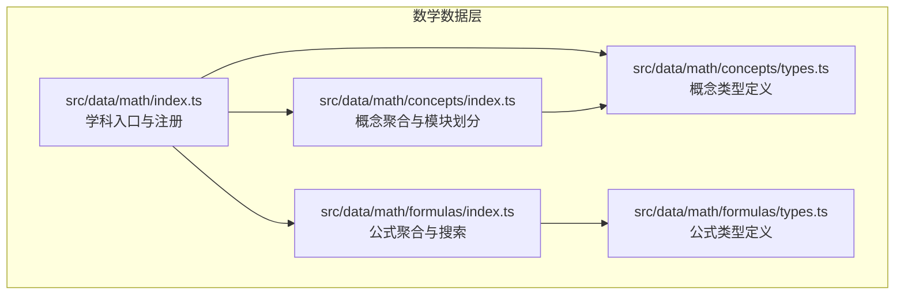
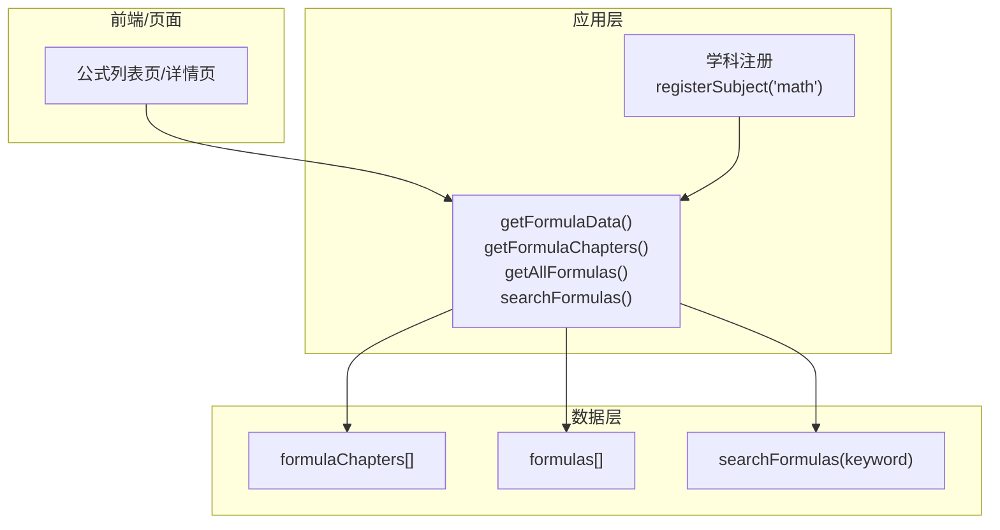
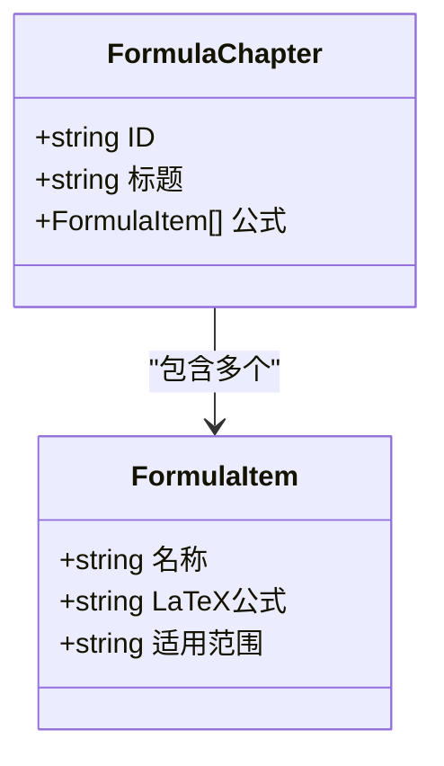
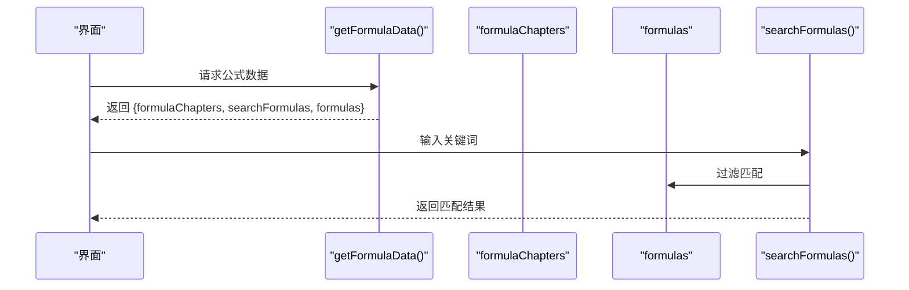
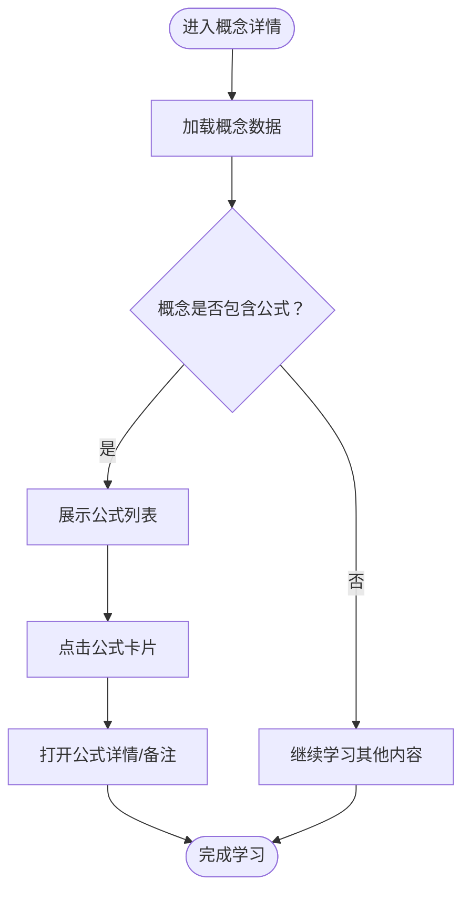
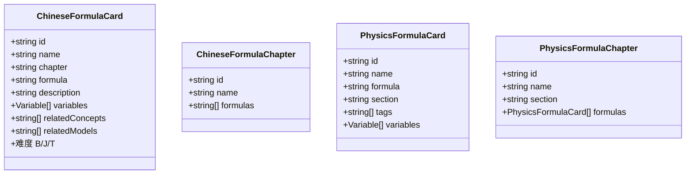
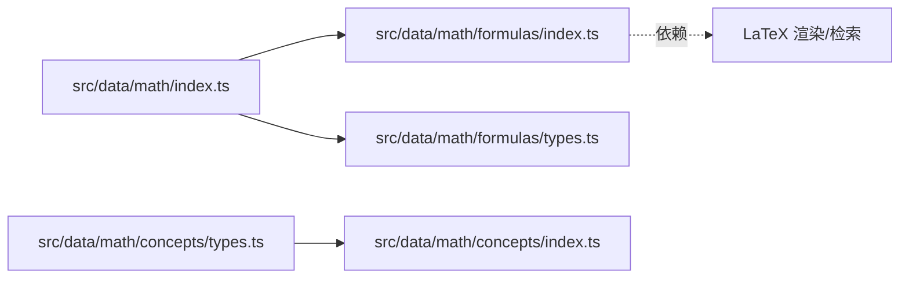

# 数学公式层（F层）

<cite>
**本文引用的文件**
- [src/data/math/formulas/index.ts](file://src/data/math/formulas/index.ts)
- [src/data/math/formulas/types.ts](file://src/data/math/formulas/types.ts)
- [src/data/math/index.ts](file://src/data/math/index.ts)
- [src/data/math/concepts/types.ts](file://src/data/math/concepts/types.ts)
- [src/data/math/concepts/index.ts](file://src/data/math/concepts/index.ts)
- [src/data/math/concepts/K01_集合的概念与表示.ts](file://src/data/math/concepts/K01_集合的概念与表示.ts)
- [src/data/math/concepts/K24_任意角和弧度制.ts](file://src/data/math/concepts/K24_任意角和弧度制.ts)
- [src/data/chinese/formulas/types.ts](file://src/data/chinese/formulas/types.ts)
- [src/data/chinese/formulas/index.ts](file://src/data/chinese/formulas/index.ts)
- [src/data/physics/formulas/index.ts](file://src/data/physics/formulas/index.ts)
</cite>

## 目录
1. [引言](#引言)
2. [项目结构](#项目结构)
3. [核心组件](#核心组件)
4. [架构总览](#架构总览)
5. [详细组件分析](#详细组件分析)
6. [依赖分析](#依赖分析)
7. [性能考虑](#性能考虑)
8. [故障排查指南](#故障排查指南)
9. [结论](#结论)
10. [附录](#附录)

## 引言
本文件系统化梳理“数学公式层（F层）”的设计与实现，覆盖数学公式的分类与组织、结构化数据格式、章节组织与搜索机制、应用场景与使用条件、标准化格式与LaTeX编码规范，以及版本管理与检索优化建议。当前仓库中数学公式层仍处于骨架阶段，本文在现有代码基础上给出可落地的扩展蓝图，确保与物理、语文等学科公式层保持一致的工程化标准。

## 项目结构
数学公式层位于数学学科数据目录下，采用“按学科分层 + 模块化文件”的组织方式：
- 数据入口与注册：通过数学学科入口统一导出公式相关能力
- 类型定义：定义公式卡片与章节的数据结构
- 章节与搜索：提供章节聚合与关键词检索接口
- 与概念层协同：概念节点内嵌公式条目，形成“概念-公式-模型”的知识闭环

**图表来源**
- [src/data/math/index.ts:126-151](file://src/data/math/index.ts#L126-L151)
- [src/data/math/formulas/index.ts:1-13](file://src/data/math/formulas/index.ts#L1-L13)
- [src/data/math/formulas/types.ts:1-15](file://src/data/math/formulas/types.ts#L1-L15)
- [src/data/math/concepts/types.ts:1-73](file://src/data/math/concepts/types.ts#L1-L73)
- [src/data/math/concepts/index.ts:109-118](file://src/data/math/concepts/index.ts#L109-L118)

**章节来源**
- [src/data/math/index.ts:126-151](file://src/data/math/index.ts#L126-L151)
- [src/data/math/formulas/index.ts:1-13](file://src/data/math/formulas/index.ts#L1-L13)
- [src/data/math/formulas/types.ts:1-15](file://src/data/math/formulas/types.ts#L1-L15)
- [src/data/math/concepts/types.ts:1-73](file://src/data/math/concepts/types.ts#L1-L73)
- [src/data/math/concepts/index.ts:109-118](file://src/data/math/concepts/index.ts#L109-L118)

## 核心组件
- 公式章节与公式列表
  - 公式章节：用于按主题或模块组织公式集合
  - 公式列表：承载具体公式条目
- 搜索接口
  - 提供关键词检索，返回匹配的公式章节
- 类型定义
  - 公式条目：名称、LaTeX公式、适用范围
  - 章节条目：ID、标题、公式数组
- 与概念层的协作
  - 概念节点内嵌公式条目，便于“先理解概念，再查阅公式”的学习路径

**章节来源**
- [src/data/math/formulas/types.ts:4-14](file://src/data/math/formulas/types.ts#L4-L14)
- [src/data/math/formulas/index.ts:6-12](file://src/data/math/formulas/index.ts#L6-L12)
- [src/data/math/concepts/types.ts:33-66](file://src/data/math/concepts/types.ts#L33-L66)

## 架构总览
数学公式层通过学科入口统一注册，暴露公式章节、公式列表与搜索能力，并与概念层、模型层、题库层协同工作，形成“概念-公式-模型-题目”的知识网络。

**图表来源**
- [src/data/math/index.ts:58-64](file://src/data/math/index.ts#L58-L64)
- [src/data/math/index.ts:126-151](file://src/data/math/index.ts#L126-L151)
- [src/data/math/formulas/index.ts:6-12](file://src/data/math/formulas/index.ts#L6-L12)

**章节来源**
- [src/data/math/index.ts:58-64](file://src/data/math/index.ts#L58-L64)
- [src/data/math/index.ts:126-151](file://src/data/math/index.ts#L126-L151)

## 详细组件分析

### 组件A：公式类型与章节结构
- 公式条目（FormulaItem）
  - 字段：名称、LaTeX公式、适用范围
  - 用途：承载单条公式的标准化描述
- 章节条目（FormulaChapter）
  - 字段：ID、标题、公式数组
  - 用途：按主题/模块组织公式集合
- 设计要点
  - 与物理/语文等学科保持一致的类型结构，便于跨学科对比与迁移
  - 公式字段采用LaTeX字符串，便于渲染与检索

**图表来源**
- [src/data/math/formulas/types.ts:4-14](file://src/data/math/formulas/types.ts#L4-L14)

**章节来源**
- [src/data/math/formulas/types.ts:4-14](file://src/data/math/formulas/types.ts#L4-L14)

### 组件B：公式章节与搜索机制
- 章节组织
  - 当前骨架中章节数组为空，需按数学学科模块（如集合与逻辑、函数与导数、三角与向量等）填充
- 搜索接口
  - 当前骨架返回空结果，需实现关键词匹配逻辑
  - 可参考物理公式层的搜索策略：对名称、公式、标签、变量名进行大小写无关匹配

**图表来源**
- [src/data/math/index.ts:58-64](file://src/data/math/index.ts#L58-L64)
- [src/data/math/formulas/index.ts:10-12](file://src/data/math/formulas/index.ts#L10-L12)
- [src/data/physics/formulas/index.ts:1047-1055](file://src/data/physics/formulas/index.ts#L1047-L1055)

**章节来源**
- [src/data/math/formulas/index.ts:6-12](file://src/data/math/formulas/index.ts#L6-L12)
- [src/data/physics/formulas/index.ts:1047-1055](file://src/data/physics/formulas/index.ts#L1047-L1055)

### 组件C：与概念层的公式集成
- 概念节点内嵌公式条目
  - 在概念类型中定义公式数组，便于在概念讲解后直接跳转到相关公式
- 示例
  - 集合的概念与表示：包含“元素与集合关系”公式
  - 任意角和弧度制：包含“角度弧度换算”公式

**章节来源**
- [src/data/math/concepts/types.ts:33-66](file://src/data/math/concepts/types.ts#L33-L66)
- [src/data/math/concepts/K01_集合的概念与表示.ts:45-47](file://src/data/math/concepts/K01_集合的概念与表示.ts#L45-L47)
- [src/data/math/concepts/K24_任意角和弧度制.ts:44-46](file://src/data/math/concepts/K24_任意角和弧度制.ts#L44-L46)

### 组件D：跨学科对比与借鉴
- 语文公式层
  - 类型：公式卡片含ID、名称、章节、公式、变量、难度等
  - 章节：章节含ID、名称、公式ID数组
- 物理公式层
  - 章节：按主题分组（运动学、力学、电磁学等）
  - 搜索：支持名称、公式、标签、变量名检索

**图表来源**
- [src/data/chinese/formulas/types.ts:1-17](file://src/data/chinese/formulas/types.ts#L1-L17)
- [src/data/chinese/formulas/index.ts:1-13](file://src/data/chinese/formulas/index.ts#L1-L13)
- [src/data/physics/formulas/index.ts:984-1040](file://src/data/physics/formulas/index.ts#L984-L1040)

**章节来源**
- [src/data/chinese/formulas/types.ts:1-17](file://src/data/chinese/formulas/types.ts#L1-L17)
- [src/data/chinese/formulas/index.ts:1-13](file://src/data/chinese/formulas/index.ts#L1-L13)
- [src/data/physics/formulas/index.ts:984-1040](file://src/data/physics/formulas/index.ts#L984-L1040)

## 依赖分析
- 入口依赖
  - 数学入口依赖公式索引与类型定义
- 概念与公式耦合
  - 概念类型内嵌公式条目，形成“概念-公式”的紧耦合
- 搜索依赖
  - 搜索接口依赖公式列表，当前骨架返回空列表，需完善数据

**图表来源**
- [src/data/math/index.ts:1-7](file://src/data/math/index.ts#L1-L7)
- [src/data/math/formulas/index.ts:1-5](file://src/data/math/formulas/index.ts#L1-L5)
- [src/data/math/concepts/types.ts:33-66](file://src/data/math/concepts/types.ts#L33-L66)

**章节来源**
- [src/data/math/index.ts:1-7](file://src/data/math/index.ts#L1-L7)
- [src/data/math/formulas/index.ts:1-5](file://src/data/math/formulas/index.ts#L1-L5)
- [src/data/math/concepts/types.ts:33-66](file://src/data/math/concepts/types.ts#L33-L66)

## 性能考虑
- 检索性能
  - 当前骨架搜索返回空列表，建议在公式列表较大时引入索引或缓存
  - 可参考物理公式层的多字段匹配策略，避免全量扫描
- 渲染性能
  - 使用LaTeX渲染时，建议按需加载渲染库，减少首屏开销
- 数据规模
  - 随着公式数量增长，建议分章节懒加载与虚拟滚动

[本节为通用指导，无需列出章节来源]

## 故障排查指南
- 搜索无结果
  - 检查公式列表是否已填充
  - 确认搜索关键词大小写处理逻辑
- 章节为空
  - 检查章节数组初始化与模块划分
- 类型不匹配
  - 确保公式条目与章节条目字段与类型定义一致

**章节来源**
- [src/data/math/formulas/index.ts:6-12](file://src/data/math/formulas/index.ts#L6-L12)
- [src/data/math/formulas/types.ts:4-14](file://src/data/math/formulas/types.ts#L4-L14)

## 结论
数学公式层目前处于骨架阶段，具备清晰的类型定义与入口注册结构。建议尽快完成以下工作：
- 填充公式数据与章节组织
- 实现搜索接口与检索优化
- 与概念层紧密集成，完善“概念-公式-模型”的知识闭环
- 参考物理/语文公式层的最佳实践，统一格式与交互体验

[本节为总结性内容，无需列出章节来源]

## 附录

### A. 数学公式章节组织建议
- 模块划分（参考数学概念模块）
  - 集合与逻辑
  - 函数与导数
  - 三角与向量
  - 数列与归纳
  - 立体几何
  - 解析几何
  - 概率与统计
  - 复数
- 章节命名与ID规范
  - ID：CXX（两位序号）
  - 标题：与模块名称一致或更细化的主题

**章节来源**
- [src/data/math/concepts/index.ts:109-118](file://src/data/math/concepts/index.ts#L109-L118)

### B. 公式数据结构与字段说明
- 公式条目（FormulaItem）
  - 名称：公式名称（如“二次函数求根公式”）
  - LaTeX公式：LaTeX字符串（如“x = \frac{-b \pm \sqrt{b^2-4ac}}{2a}”）
  - 适用范围：适用场景与前提条件
- 章节条目（FormulaChapter）
  - ID：章节唯一标识
  - 标题：章节名称
  - 公式：公式条目数组

**章节来源**
- [src/data/math/formulas/types.ts:4-14](file://src/data/math/formulas/types.ts#L4-L14)

### C. 搜索机制与检索优化建议
- 检索字段
  - 名称、LaTeX公式、适用范围
- 优化策略
  - 建立关键词索引与前缀索引
  - 分词与模糊匹配（可选）
  - 结果排序：相关度优先

**章节来源**
- [src/data/physics/formulas/index.ts:1047-1055](file://src/data/physics/formulas/index.ts#L1047-L1055)

### D. LaTeX编码规范与渲染
- 编码规范
  - 使用标准LaTeX语法
  - 变量使用斜体，函数名使用正体（如 \sin x）
  - 分数、根号、上下标等遵循LaTeX标准
- 渲染建议
  - 按需加载渲染库，避免全量引入
  - 支持公式高亮与点击跳转

[本节为通用指导，无需列出章节来源]