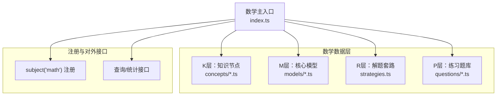
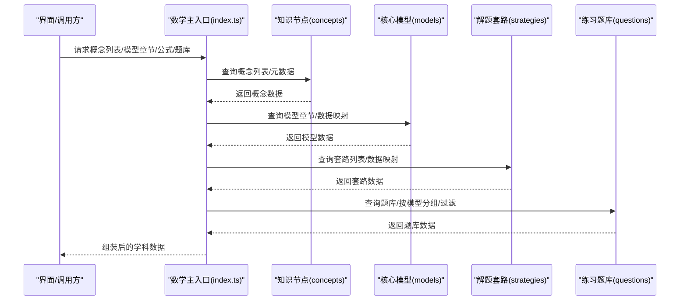
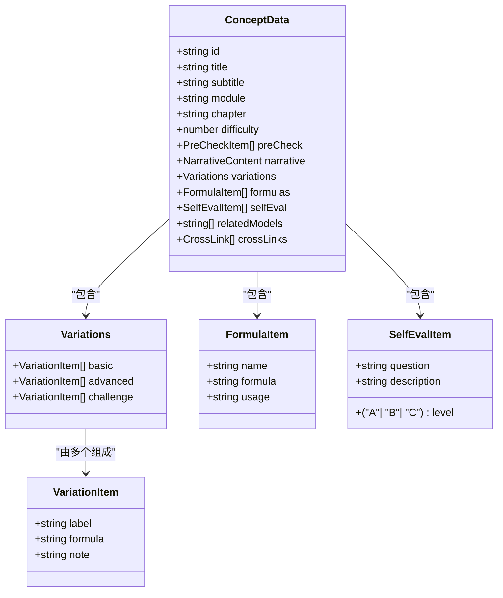
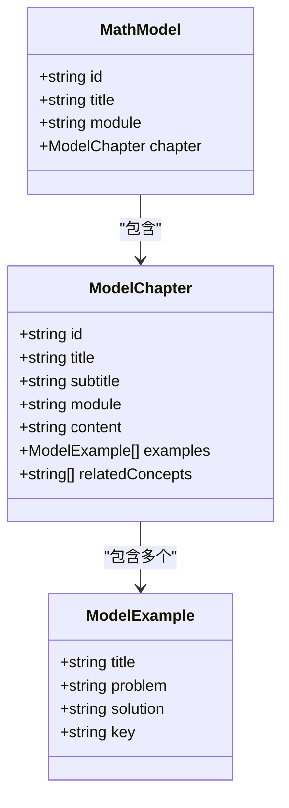
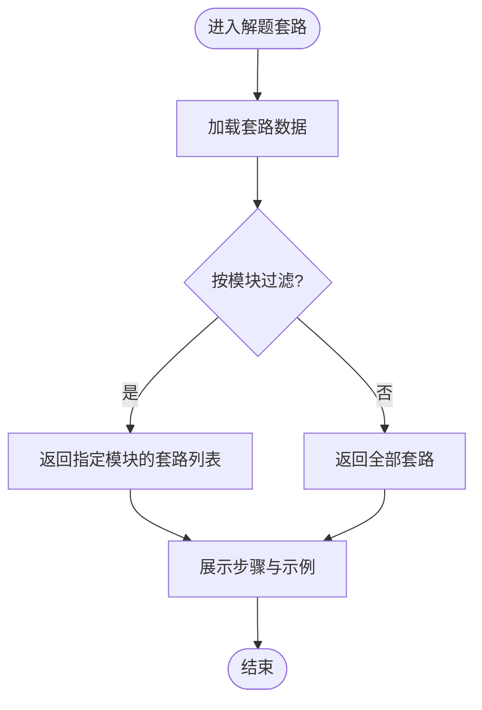
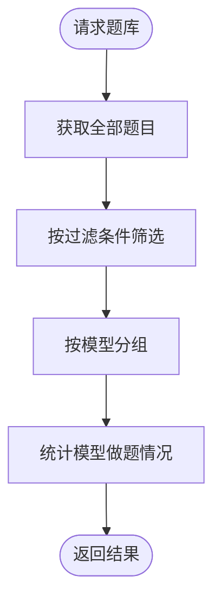
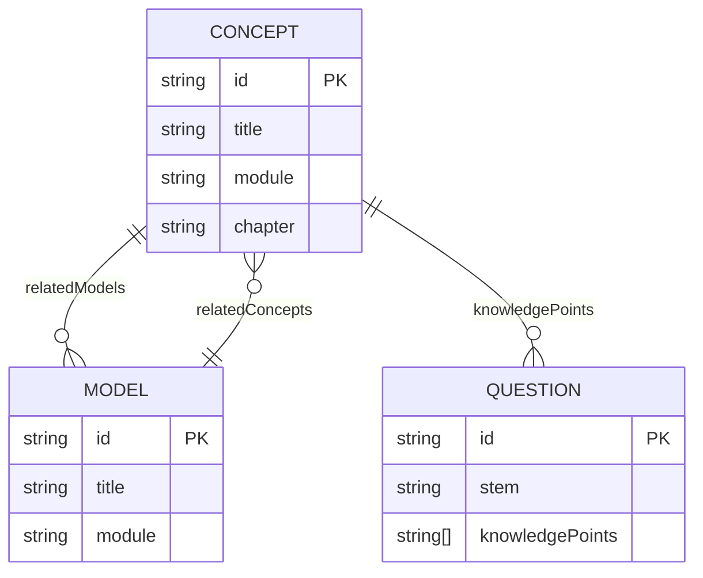
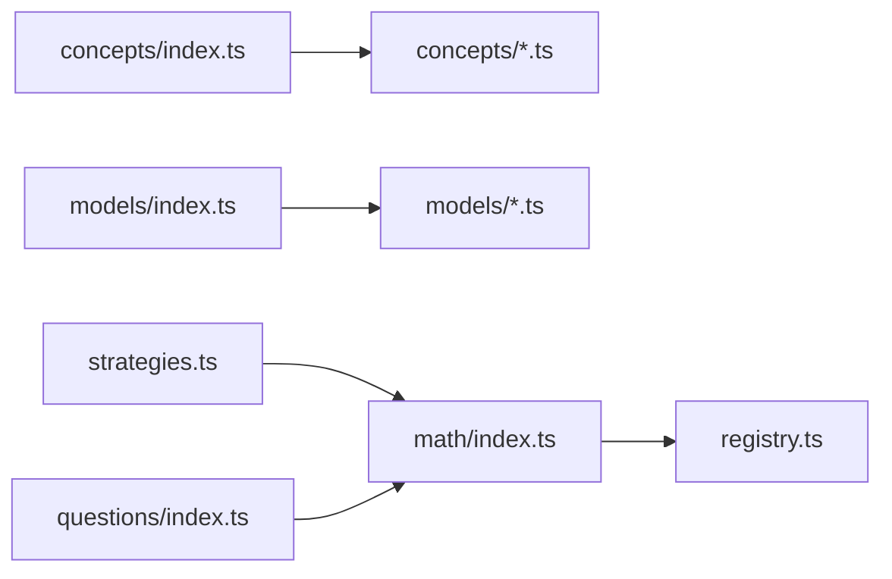

# 数学学科数据结构

<cite>
**本文引用的文件**
- [src/data/math/index.ts](file://src/data/math/index.ts)
- [src/data/math/concepts/index.ts](file://src/data/math/concepts/index.ts)
- [src/data/math/concepts/types.ts](file://src/data/math/concepts/types.ts)
- [src/data/math/models/index.ts](file://src/data/math/models/index.ts)
- [src/data/math/models/types.ts](file://src/data/math/models/types.ts)
- [src/data/math/questions/index.ts](file://src/data/math/questions/index.ts)
- [src/data/math/questions/types.ts](file://src/data/math/questions/types.ts)
- [src/data/math/strategies.ts](file://src/data/math/strategies.ts)
- [src/data/math/concepts/K01_集合的概念与表示.ts](file://src/data/math/concepts/K01_集合的概念与表示.ts)
- [src/data/math/models/MATHL01_集合与逻辑.ts](file://src/data/math/models/MATHL01_集合与逻辑.ts)
- [src/data/math/models/MATHF01_函数的基本性质.ts](file://src/data/math/models/MATHF01_函数的基本性质.ts)
- [src/data/math/models/MATHT01_三角函数基础.ts](file://src/data/math/models/MATHT01_三角函数基础.ts)
- [src/data/math/models/MATHS01_数列基础.ts](file://src/data/math/models/MATHS01_数列基础.ts)
</cite>

## 目录
1. [引言](#引言)
2. [项目结构](#项目结构)
3. [核心组件](#核心组件)
4. [架构总览](#架构总览)
5. [详细组件分析](#详细组件分析)
6. [依赖分析](#依赖分析)
7. [性能考虑](#性能考虑)
8. [故障排查指南](#故障排查指南)
9. [结论](#结论)
10. [附录](#附录)

## 引言
本文件系统化梳理数学学科在该代码库中的数据结构与组织方式，覆盖K层（知识节点）、M层（核心模型）、R层（解题套路）、P层（练习题库）等数据层次，并对数学模块（集合与逻辑、函数、数列、立体几何、概率统计、解析几何、三角与向量、复数等）的知识组织、章节划分、概念-模型-题目的关系网络进行深入说明。同时给出题库多维筛选字段、公式库检索接口、以及标准化与质量控制建议，帮助开发者与内容建设者高效维护与扩展数学数据。

## 项目结构
数学数据位于 src/data/math 目录下，采用“按主题域分层 + 骨架聚合”的组织方式：
- K层（知识节点）：concepts 下的 Kxx_*.ts 文件，每个文件代表一个知识节点，统一导出到 concepts/index.ts 聚合。
- M层（核心模型）：models 下的 MATH[字母][编号]_*.ts 文件，每个文件包含若干模型章节，统一导出到 models/index.ts 聚合。
- R层（解题套路）：strategies.ts 定义套路结构与骨架，按模块分段组织。
- P层（练习题库）：questions 下的 index.ts/types.ts 定义题库数据结构与过滤接口，当前题库数组为空，待填充。
- 主入口：src/data/math/index.ts 将上述模块注册为 subject(math)，提供查询与统计接口。

图表来源
- [src/data/math/index.ts:126-151](file://src/data/math/index.ts#L126-L151)
- [src/data/math/concepts/index.ts:82-91](file://src/data/math/concepts/index.ts#L82-L91)
- [src/data/math/models/index.ts:25-33](file://src/data/math/models/index.ts#L25-L33)
- [src/data/math/strategies.ts:18-53](file://src/data/math/strategies.ts#L18-L53)
- [src/data/math/questions/index.ts:6-12](file://src/data/math/questions/index.ts#L6-L12)

章节来源
- [src/data/math/index.ts:1-166](file://src/data/math/index.ts#L1-L166)
- [src/data/math/concepts/index.ts:1-119](file://src/data/math/concepts/index.ts#L1-L119)
- [src/data/math/models/index.ts:1-56](file://src/data/math/models/index.ts#L1-L56)
- [src/data/math/questions/index.ts:1-13](file://src/data/math/questions/index.ts#L1-L13)
- [src/data/math/strategies.ts:1-66](file://src/data/math/strategies.ts#L1-L66)

## 核心组件
- 数学主入口与注册
  - 提供概念列表、概念元数据、模型章节、公式数据、套路列表、题库数据与统计等统一访问接口。
  - 通过 registerSubject('math', ...) 将数学学科数据注册到全局主题注册表。
- 知识节点（K层）
  - 每个 Kxx_*.ts 导出单个 ConceptData 实例，concepts/index.ts 聚合并提供按模块/章节查询。
  - 支持难度、预检、叙事、变式、公式、自测、关联模型、跨学科链接等字段。
- 核心模型（M层）
  - 每个 MATH[字母][编号]_*.ts 导出多个 MathModel，models/index.ts 聚合。
  - MathModel 包含 id、title、module、chapter（含示例与相关概念）。
- 解题套路（R层）
  - Strategy 接口包含 id、title、subtitle、module、content、steps、examples、relatedConcepts。
  - 按模块分段组织，便于按模块检索与教学。
- 练习题库（P层）
  - Question 接口包含题干、选项、答案、解析、层级、类型、知识点标签、难度等级等。
  - 当前 allQuestions 为空，提供 getQuestionsByFilter 骨架接口。

章节来源
- [src/data/math/index.ts:126-151](file://src/data/math/index.ts#L126-L151)
- [src/data/math/concepts/types.ts:52-72](file://src/data/math/concepts/types.ts#L52-L72)
- [src/data/math/models/types.ts:21-27](file://src/data/math/models/types.ts#L21-L27)
- [src/data/math/questions/types.ts:4-14](file://src/data/math/questions/types.ts#L4-L14)
- [src/data/math/strategies.ts:7-16](file://src/data/math/strategies.ts#L7-L16)

## 架构总览
数学数据的运行时交互流程如下：

图表来源
- [src/data/math/index.ts:126-151](file://src/data/math/index.ts#L126-L151)
- [src/data/math/concepts/index.ts:101-107](file://src/data/math/concepts/index.ts#L101-L107)
- [src/data/math/models/index.ts:50-56](file://src/data/math/models/index.ts#L50-L56)
- [src/data/math/strategies.ts:59-65](file://src/data/math/strategies.ts#L59-L65)
- [src/data/math/questions/index.ts:10-12](file://src/data/math/questions/index.ts#L10-L12)

## 详细组件分析

### K层：知识节点（概念）数据结构
- 数据模型
  - ConceptData 字段涵盖：id、title、subtitle、module、chapter、difficulty、preCheck、narrative、variations、formulas、selfEval、relatedModels、crossLinks。
  - 变式（Variations）分为 basic/advanced/challenge 三个层级，支持不同难度梯度的学习。
  - 自测（SelfEval）支持 A/B/C 三级难度标注与描述。
- 聚合与查询
  - concepts/index.ts 聚合所有 Kxx_*.ts，提供按模块/章节查询与 id->对象映射。
  - 提供 getConceptById、getConceptsByModule、getConceptsByChapter 等便捷查询。
- 示例
  - K01_集合的概念与表示.ts 展示了完整的 ConceptData 结构，包含预检、叙事、变式、公式、自测与关联模型。

图表来源
- [src/data/math/concepts/types.ts:52-72](file://src/data/math/concepts/types.ts#L52-L72)
- [src/data/math/concepts/types.ts:27-31](file://src/data/math/concepts/types.ts#L27-L31)
- [src/data/math/concepts/types.ts:33-37](file://src/data/math/concepts/types.ts#L33-L37)
- [src/data/math/concepts/types.ts:39-43](file://src/data/math/concepts/types.ts#L39-L43)

章节来源
- [src/data/math/concepts/index.ts:82-91](file://src/data/math/concepts/index.ts#L82-L91)
- [src/data/math/concepts/types.ts:1-73](file://src/data/math/concepts/types.ts#L1-L73)
- [src/data/math/concepts/K01_集合的概念与表示.ts:4-56](file://src/data/math/concepts/K01_集合的概念与表示.ts#L4-L56)

### M层：核心模型（数学模型）数据结构
- 数据模型
  - MathModel 包含 id、title、module、chapter（含 examples 与 relatedConcepts）。
  - ModelChapter 描述模型章节的标题、副标题、模块、内容、示例与相关概念。
- 聚合与模块划分
  - models/index.ts 聚合所有 MATH[字母][编号]_*.ts，按模块组织（如函数与导数、三角与向量、数列与归纳、立体几何、解析几何、概率与统计、集合与逻辑、复数）。
- 示例
  - MATHL01_集合与逻辑.ts 展示了集合与逻辑相关的多个模型章节（L01-L08、B01-B04、C01-C04），每个章节包含示例与相关概念。
  - MATHF01_函数的基本性质.ts 展示了函数基本性质的模型章节。
  - MATHT01_三角函数基础.ts 展示了三角函数基础的多个模型章节。
  - MATHS01_数列基础.ts 展示了数列基础的多个模型章节。

图表来源
- [src/data/math/models/types.ts:21-27](file://src/data/math/models/types.ts#L21-L27)
- [src/data/math/models/types.ts:4-12](file://src/data/math/models/types.ts#L4-L12)
- [src/data/math/models/types.ts:14-19](file://src/data/math/models/types.ts#L14-L19)

章节来源
- [src/data/math/models/index.ts:25-33](file://src/data/math/models/index.ts#L25-L33)
- [src/data/math/models/types.ts:1-27](file://src/data/math/models/types.ts#L1-L27)
- [src/data/math/models/MATHL01_集合与逻辑.ts:4-24](file://src/data/math/models/MATHL01_集合与逻辑.ts#L4-L24)
- [src/data/math/models/MATHF01_函数的基本性质.ts:4-24](file://src/data/math/models/MATHF01_函数的基本性质.ts#L4-L24)
- [src/data/math/models/MATHT01_三角函数基础.ts:4-24](file://src/data/math/models/MATHT01_三角函数基础.ts#L4-L24)
- [src/data/math/models/MATHS01_数列基础.ts:4-24](file://src/data/math/models/MATHS01_数列基础.ts#L4-L24)

### R层：解题套路（策略）数据结构
- 数据模型
  - Strategy 包含 id、title、subtitle、module、content、steps、examples、relatedConcepts。
- 组织方式
  - 按模块分段组织（函数与导数、三角与向量、数列与归纳、立体几何、解析几何、概率与统计、集合与逻辑、不等式、复数与平面向量）。
  - 每个套路包含步骤与示例，便于教学与训练。
- 示例
  - R01：函数定义域求解；R02：函数单调性判断等。

图表来源
- [src/data/math/strategies.ts:18-53](file://src/data/math/strategies.ts#L18-L53)
- [src/data/math/strategies.ts:59-65](file://src/data/math/strategies.ts#L59-L65)

章节来源
- [src/data/math/strategies.ts:1-66](file://src/data/math/strategies.ts#L1-L66)

### P层：练习题库（题库）数据结构
- 数据模型
  - Question 包含 id、stem、options、answer、analysis、level、type、knowledgePoints、difficultyD 等。
  - QuestionFilter 定义过滤项结构。
- 当前状态
  - allQuestions 为空数组，questionsByModel 为空映射，getQuestionsByFilter 返回全量（骨架实现）。
- 多维筛选字段（来自主入口）
  - DIFF_LABEL、DIFF_COLOR、LEVEL_OPTIONS、TARGET_OPTIONS、FUNCTION_OPTIONS、DIFFICULTY_D_OPTIONS、TYPE_OPTIONS。
- 示例
  - 可基于 knowledgePoints、type、level、difficultyD 等字段进行筛选与分组。

图表来源
- [src/data/math/questions/index.ts:6-12](file://src/data/math/questions/index.ts#L6-L12)
- [src/data/math/questions/types.ts:4-14](file://src/data/math/questions/types.ts#L4-L14)
- [src/data/math/index.ts:66-100](file://src/data/math/index.ts#L66-L100)
- [src/data/math/index.ts:106-124](file://src/data/math/index.ts#L106-L124)

章节来源
- [src/data/math/questions/index.ts:1-13](file://src/data/math/questions/index.ts#L1-L13)
- [src/data/math/questions/types.ts:1-21](file://src/data/math/questions/types.ts#L1-L21)
- [src/data/math/index.ts:66-124](file://src/data/math/index.ts#L66-L124)

### 数学模块与章节划分
- 模块划分（K层概念）
  - 集合与逻辑、函数与导数、三角与向量、数列与归纳、立体几何、解析几何、概率与统计、复数。
- 模块划分（M层模型）
  - 函数与导数、三角与向量、数列与归纳、立体几何、解析几何、概率与统计、集合与逻辑、复数。
- 章节组织
  - K层：每个概念文件对应一个具体知识点。
  - M层：每个模型文件包含若干章节，章节内含示例与相关概念。

章节来源
- [src/data/math/concepts/index.ts:109-118](file://src/data/math/concepts/index.ts#L109-L118)
- [src/data/math/models/index.ts:39-48](file://src/data/math/models/index.ts#L39-L48)

### 概念-模型-题目的关系网络
- 关联关系
  - 概念（ConceptData.relatedModels）指向模型 id 列表。
  - 模型（ModelChapter.relatedConcepts）指向概念 id 列表。
  - 题目（Question.knowledgePoints）指向概念 id 列表。
- 统计与分组
  - 主入口提供按模型分组题目与统计接口，便于教学与练习安排。

图表来源
- [src/data/math/concepts/types.ts:70](file://src/data/math/concepts/types.ts#L70)
- [src/data/math/models/types.ts:10](file://src/data/math/models/types.ts#L10)
- [src/data/math/questions/types.ts:12](file://src/data/math/questions/types.ts#L12)

章节来源
- [src/data/math/concepts/types.ts:70-71](file://src/data/math/concepts/types.ts#L70-L71)
- [src/data/math/models/types.ts:10-11](file://src/data/math/models/types.ts#L10-L11)
- [src/data/math/questions/types.ts:12](file://src/data/math/questions/types.ts#L12)

## 依赖分析
- 内聚与耦合
  - concepts/index.ts、models/index.ts、strategies.ts、questions/index.ts 分别负责各自领域的聚合与查询，内聚性良好。
  - math/index.ts 作为门面，统一导出与注册，降低上层依赖复杂度。
- 外部依赖
  - 通过 registry.ts 的 registerSubject 接口注册学科数据，形成统一的主题数据访问层。
- 潜在环依赖
  - 当前文件未见直接环依赖；概念与模型的双向关联通过字符串 id 维护，避免编译期环依赖。

图表来源
- [src/data/math/concepts/index.ts:82-91](file://src/data/math/concepts/index.ts#L82-L91)
- [src/data/math/models/index.ts:25-33](file://src/data/math/models/index.ts#L25-L33)
- [src/data/math/strategies.ts:18-53](file://src/data/math/strategies.ts#L18-L53)
- [src/data/math/questions/index.ts:6-12](file://src/data/math/questions/index.ts#L6-L12)
- [src/data/math/index.ts:126-151](file://src/data/math/index.ts#L126-L151)

章节来源
- [src/data/math/index.ts:126-151](file://src/data/math/index.ts#L126-L151)

## 性能考虑
- 数据规模
  - 当前 allQuestions 为空，查询开销低；随着题库增长，建议在前端缓存常用查询结果（如按模块/难度/类型的分组）。
- 查询优化
  - 使用 Map 结构（如 conceptDataMap、modelDataMap、strategyDataMap）进行 O(1) 快速查找。
  - 对大列表过滤建议使用索引字段（如 module、chapter、knowledgePoints）建立二级索引。
- 渲染优化
  - 分页/虚拟滚动用于长列表渲染；按需加载模型与套路详情。
- 计算优化
  - 统计接口（如 getModelQuestionStats）可缓存至会话存储，减少重复计算。

## 故障排查指南
- 常见问题
  - 概念/模型/套路 id 缺失或重复：检查各文件导出的 id 是否唯一且与引用一致。
  - relatedConcepts/relatedModels 未对齐：确保字符串 id 与目标实体 id 一致。
  - 题目过滤无效：确认 getQuestionsByFilter 的过滤逻辑与 QuestionFilter 定义一致。
- 调试建议
  - 在主入口增加日志输出，打印关键查询参数与返回条数。
  - 对空数组（如 allQuestions）进行边界检查，避免渲染异常。
  - 使用 TypeScript 类型约束防止字段缺失。

章节来源
- [src/data/math/index.ts:106-124](file://src/data/math/index.ts#L106-L124)
- [src/data/math/questions/index.ts:10-12](file://src/data/math/questions/index.ts#L10-L12)

## 结论
该数学数据结构以 K-M-R-P 四层为核心，通过 concepts、models、strategies、questions 的清晰分层与统一注册，实现了知识、模型、套路与题目的有机联动。模块化组织与类型安全设计便于扩展与维护。建议后续完善题库数据填充、建立多维索引与缓存策略，并持续完善标准化与质量控制流程，以支撑大规模教学与练习场景。

## 附录
- 数学模块清单（K层）
  - 集合与逻辑、函数与导数、三角与向量、数列与归纳、立体几何、解析几何、概率与统计、复数。
- 数学模块清单（M层）
  - 函数与导数、三角与向量、数列与归纳、立体几何、解析几何、概率与统计、集合与逻辑、复数。
- 题库多维筛选字段
  - LEVEL_OPTIONS、TARGET_OPTIONS、FUNCTION_OPTIONS、DIFFICULTY_D_OPTIONS、TYPE_OPTIONS。
- 公式库检索
  - 提供 formulaChapters、searchFormulas、formulas 的统一访问接口。

章节来源
- [src/data/math/concepts/index.ts:109-118](file://src/data/math/concepts/index.ts#L109-L118)
- [src/data/math/models/index.ts:39-48](file://src/data/math/models/index.ts#L39-L48)
- [src/data/math/index.ts:66-100](file://src/data/math/index.ts#L66-L100)