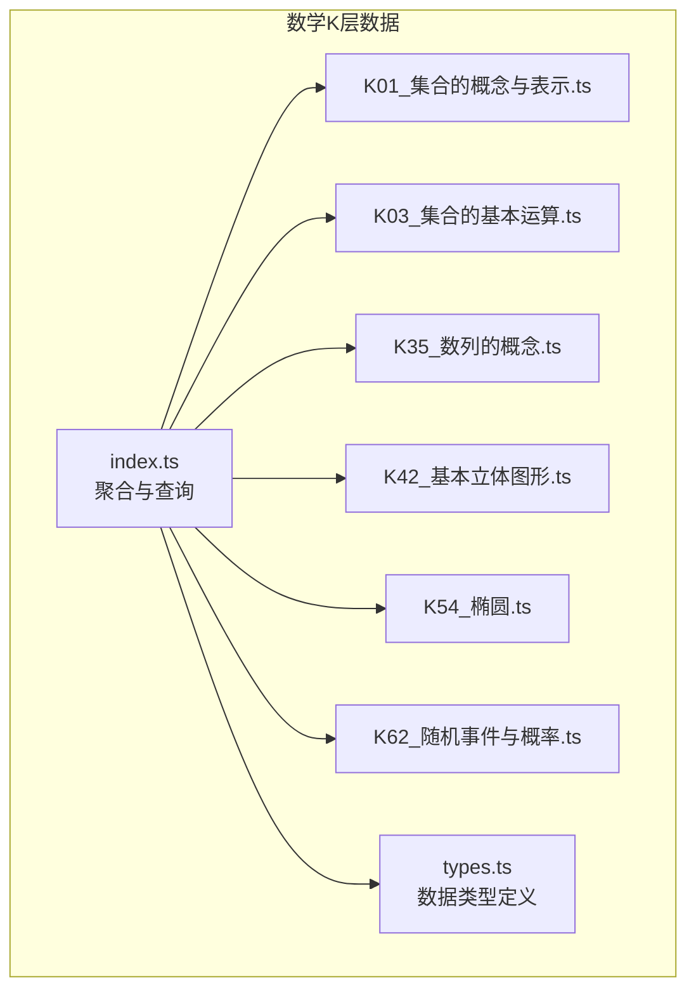
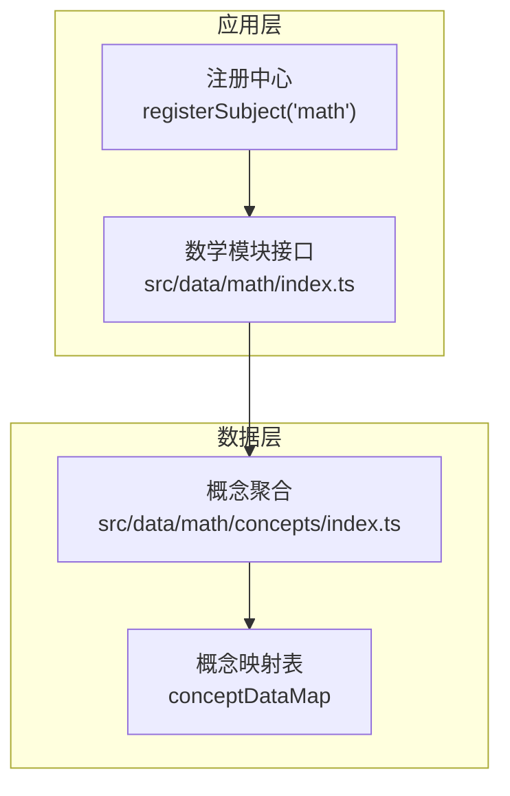
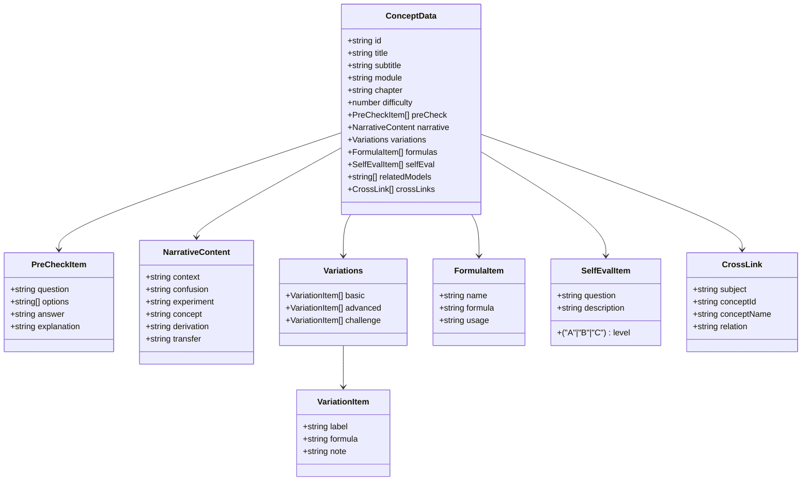
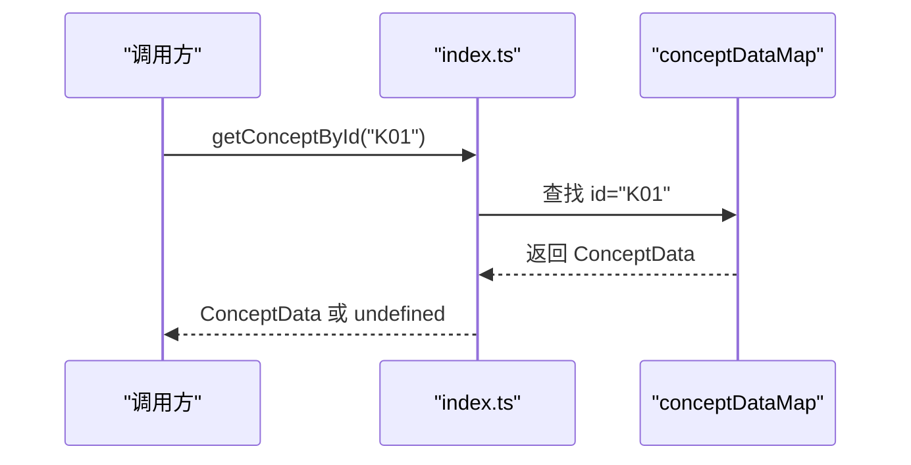
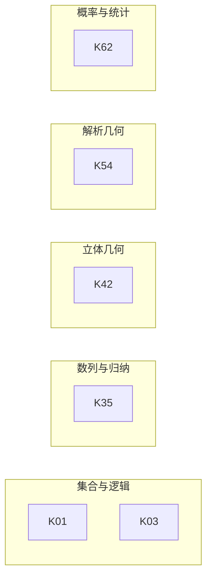
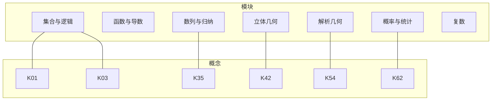

# 数学概念层（K层）

<cite>
**本文档引用的文件**
- [src/data/math/concepts/index.ts](file://src/data/math/concepts/index.ts)
- [src/data/math/concepts/types.ts](file://src/data/math/concepts/types.ts)
- [src/data/math/concepts/K01_集合的概念与表示.ts](file://src/data/math/concepts/K01_集合的概念与表示.ts)
- [src/data/math/concepts/K03_集合的基本运算.ts](file://src/data/math/concepts/K03_集合的基本运算.ts)
- [src/data/math/concepts/K35_数列的概念.ts](file://src/data/math/concepts/K35_数列的概念.ts)
- [src/data/math/concepts/K42_基本立体图形.ts](file://src/data/math/concepts/K42_基本立体图形.ts)
- [src/data/math/concepts/K54_椭圆.ts](file://src/data/math/concepts/K54_椭圆.ts)
- [src/data/math/concepts/K62_随机事件与概率.ts](file://src/data/math/concepts/K62_随机事件与概率.ts)
- [src/data/math/index.ts](file://src/data/math/index.ts)
- [src/data/math/strategies.ts](file://src/data/math/strategies.ts)
- [SPEC.md](file://SPEC.md)
- [package.json](file://package.json)
</cite>

## 目录
1. [简介](#简介)
2. [项目结构](#项目结构)
3. [核心组件](#核心组件)
4. [架构总览](#架构总览)
5. [详细组件分析](#详细组件分析)
6. [依赖关系分析](#依赖关系分析)
7. [性能考虑](#性能考虑)
8. [故障排查指南](#故障排查指南)
9. [结论](#结论)
10. [附录](#附录)

## 简介
本文件系统化阐述数学概念层（K层）的数据组织与分类体系，覆盖集合与逻辑、函数与导数、三角与向量、数列与归纳、立体几何、解析几何、概率与统计、复数等八大模块。文档重点说明：
- 概念数据的结构化字段与标准化命名规范
- 概念数据映射表的构建与查询机制
- 概念间的层级关系与依赖关系
- 概念数据的增删改查与批量处理机制
- 概念难度等级与模块/章节划分规则

## 项目结构
数学K层数据位于 `src/data/math/concepts` 目录，采用“按模块聚合 + 统一索引”的组织方式：
- 每个概念以独立TS文件导出，文件名采用Kxx_模块名.ts的命名规范
- `index.ts` 聚合所有概念并导出：
  - `allConcepts`: 概念数组
  - `conceptDataMap`: 以概念ID为键的映射表
  - 查询函数：按ID、按模块、按章节检索
  - 模块常量：MATH_MODULES
- `types.ts` 定义概念数据接口与相关嵌套结构

**图表来源**
- [src/data/math/concepts/index.ts:1-119](file://src/data/math/concepts/index.ts#L1-L119)
- [src/data/math/concepts/types.ts:1-73](file://src/data/math/concepts/types.ts#L1-L73)

**章节来源**
- [src/data/math/concepts/index.ts:1-119](file://src/data/math/concepts/index.ts#L1-L119)
- [src/data/math/concepts/types.ts:1-73](file://src/data/math/concepts/types.ts#L1-L73)

## 核心组件
- 概念数据接口（ConceptData）
  - 标识：id（Kxx格式）、title（概念名称）、subtitle（学科本质/一句话说明）
  - 归属：module（模块）、chapter（章节）
  - 难度：difficulty（数值，1=基础，2=中等，3=高阶）
  - 内容区块：preCheck（前置检测）、narrative（叙事正文）、variations（分层变形）、formulas（公式卡片）、selfEval（理解度自评）
  - 关联：relatedModels（相关模型ID）、crossLinks（跨学科关联）
- 概念映射与查询
  - conceptDataMap：基于ID的O(1)查询
  - getConceptById：按ID检索
  - getConceptsByModule：按模块过滤
  - getConceptsByChapter：按章节过滤
  - MATH_MODULES：模块清单

**章节来源**
- [src/data/math/concepts/types.ts:52-72](file://src/data/math/concepts/types.ts#L52-L72)
- [src/data/math/concepts/index.ts:93-119](file://src/data/math/concepts/index.ts#L93-L119)

## 架构总览
K层数据在应用中的角色与交互：
- 数据层：概念TS文件 → index.ts聚合 → conceptDataMap映射
- 业务层：通过注册的subject接口访问概念数据（如数学模块）
- 展示层：概念列表、详情页、搜索与筛选

**图表来源**
- [src/data/math/index.ts:126-151](file://src/data/math/index.ts#L126-L151)
- [src/data/math/concepts/index.ts:93-119](file://src/data/math/concepts/index.ts#L93-L119)

**章节来源**
- [src/data/math/index.ts:126-151](file://src/data/math/index.ts#L126-L151)

## 详细组件分析

### 概念数据结构与字段规范
- 必填字段
  - id：唯一标识（Kxx）
  - title：概念名称
  - module：所属模块（如“集合与逻辑”）
  - chapter：所属章节（如“集合的概念与表示”）
  - difficulty：难度等级（1/2/3）
- 内容字段
  - preCheck：前置知识检测（数组）
  - narrative：叙事正文（上下文、困惑、实验、概念、推导、迁移）
  - variations：分层变形（basic/advanced/challenge）
  - formulas：公式卡片（name/formula/usage）
  - selfEval：理解度自评（level/question/description）
  - relatedModels/crossLinks：关联模型与跨学科链接

**图表来源**
- [src/data/math/concepts/types.ts:5-72](file://src/data/math/concepts/types.ts#L5-L72)

**章节来源**
- [src/data/math/concepts/types.ts:52-72](file://src/data/math/concepts/types.ts#L52-L72)

### 概念映射表与查询机制
- 构建映射表：遍历allConcepts，以id为键构造conceptDataMap
- 查询接口
  - getConceptById(id)：O(1)查找
  - getConceptsByModule(module)：按模块过滤
  - getConceptsByChapter(chapter)：按章节过滤
- 模块清单：MATH_MODULES提供八大模块名称

**图表来源**
- [src/data/math/concepts/index.ts:93-107](file://src/data/math/concepts/index.ts#L93-L107)

**章节来源**
- [src/data/math/concepts/index.ts:93-119](file://src/data/math/concepts/index.ts#L93-L119)

### 概念数据示例与模块覆盖
- 集合与逻辑
  - K01：集合的概念与表示
  - K03：集合的基本运算
- 数列与归纳
  - K35：数列的概念
- 立体几何
  - K42：基本立体图形
- 解析几何
  - K54：椭圆
- 概率与统计
  - K62：随机事件与概率

**图表来源**
- [src/data/math/concepts/K01_集合的概念与表示.ts:4-56](file://src/data/math/concepts/K01_集合的概念与表示.ts#L4-L56)
- [src/data/math/concepts/K03_集合的基本运算.ts:4-57](file://src/data/math/concepts/K03_集合的基本运算.ts#L4-L57)
- [src/data/math/concepts/K35_数列的概念.ts:4-53](file://src/data/math/concepts/K35_数列的概念.ts#L4-L53)
- [src/data/math/concepts/K42_基本立体图形.ts:4-54](file://src/data/math/concepts/K42_基本立体图形.ts#L4-L54)
- [src/data/math/concepts/K54_椭圆.ts:4-56](file://src/data/math/concepts/K54_椭圆.ts#L4-L56)
- [src/data/math/concepts/K62_随机事件与概率.ts:4-53](file://src/data/math/concepts/K62_随机事件与概率.ts#L4-L53)

**章节来源**
- [src/data/math/concepts/K01_集合的概念与表示.ts:4-56](file://src/data/math/concepts/K01_集合的概念与表示.ts#L4-L56)
- [src/data/math/concepts/K03_集合的基本运算.ts:4-57](file://src/data/math/concepts/K03_集合的基本运算.ts#L4-L57)
- [src/data/math/concepts/K35_数列的概念.ts:4-53](file://src/data/math/concepts/K35_数列的概念.ts#L4-L53)
- [src/data/math/concepts/K42_基本立体图形.ts:4-54](file://src/data/math/concepts/K42_基本立体图形.ts#L4-L54)
- [src/data/math/concepts/K54_椭圆.ts:4-56](file://src/data/math/concepts/K54_椭圆.ts#L4-L56)
- [src/data/math/concepts/K62_随机事件与概率.ts:4-53](file://src/data/math/concepts/K62_随机事件与概率.ts#L4-L53)

### 概念难度与模块/章节结构化
- 难度等级
  - 1：基础（如K01、K03、K35、K42、K62）
  - 2：中等（如K54椭圆）
  - 3：高阶（在variations或selfEval中体现）
- 模块与章节
  - 模块：集合与逻辑、函数与导数、三角与向量、数列与归纳、立体几何、解析几何、概率与统计、复数
  - 章节：每个概念对应具体章节名称（如“集合的概念与表示”、“椭圆”等）

**章节来源**
- [src/data/math/concepts/K01_集合的概念与表示.ts:8-10](file://src/data/math/concepts/K01_集合的概念与表示.ts#L8-L10)
- [src/data/math/concepts/K03_集合的基本运算.ts:8-10](file://src/data/math/concepts/K03_集合的基本运算.ts#L8-L10)
- [src/data/math/concepts/K35_数列的概念.ts:8-10](file://src/data/math/concepts/K35_数列的概念.ts#L8-L10)
- [src/data/math/concepts/K42_基本立体图形.ts:8-10](file://src/data/math/concepts/K42_基本立体图形.ts#L8-L10)
- [src/data/math/concepts/K54_椭圆.ts:8-10](file://src/data/math/concepts/K54_椭圆.ts#L8-L10)
- [src/data/math/concepts/K62_随机事件与概率.ts:8-10](file://src/data/math/concepts/K62_随机事件与概率.ts#L8-L10)
- [src/data/math/concepts/index.ts:109-118](file://src/data/math/concepts/index.ts#L109-L118)

### 标准化命名规范与数据验证规则
- 文件命名规范
  - Kxx_模块名.ts（如K01_集合的概念与表示.ts）
- 字段命名与取值
  - id：Kxx（两位序号）
  - module：限定于MATH_MODULES
  - chapter：章节名称
  - difficulty：1/2/3
  - level：A/B/C（自评等级）
- 数据验证要点
  - 所有必填字段不得为空
  - relatedModels与crossLinks中的ID需在概念或模型数据中存在
  - narrative、variations、formulas、selfEval等数组长度合理
  - preCheck的options与answer、explanation匹配

**章节来源**
- [SPEC.md:465-480](file://SPEC.md#L465-L480)
- [src/data/math/concepts/types.ts:40-43](file://src/data/math/concepts/types.ts#L40-L43)
- [src/data/math/concepts/index.ts:109-118](file://src/data/math/concepts/index.ts#L109-L118)

### 概念数据的增删改查与批量处理
- 增（新增概念）
  - 新建TS文件，按types.ts定义字段编写
  - 在index.ts中导入并加入allConcepts数组
  - 重新构建应用以加载新概念
- 删（删除概念）
  - 从index.ts移除导入与allConcepts条目
  - 删除对应TS文件
- 改（修改概念）
  - 修改TS文件中的字段值
  - 如变更module/chapter，确保MATH_MODULES与章节一致
- 查（查询）
  - 使用getConceptById/getConceptsByModule/getConceptsByChapter
  - 通过conceptDataMap进行O(1)查找
- 批量处理
  - 可通过脚本扫描src/data/math/concepts目录，动态生成导入与聚合
  - 与物理/化学学科的批量生成脚本思路一致（参见scripts目录）

**章节来源**
- [src/data/math/concepts/index.ts:4-95](file://src/data/math/concepts/index.ts#L4-L95)
- [SPEC.md:664-677](file://SPEC.md#L664-L677)

## 依赖关系分析
- 概念与模块/章节
  - 每个概念明确归属module与chapter
  - MATH_MODULES提供模块清单，确保概念分类一致性
- 概念与模型/套路
  - relatedModels：指向相关模型ID
  - crossLinks：跨学科关联（如与物理/化学概念的联系）
  - 数学策略（R层）与概念的关联通过relatedConcepts体现
- 查询依赖
  - conceptDataMap依赖allConcepts的完整性
  - getConceptsByModule/Chapter依赖module/chapter字段正确性

**图表来源**
- [src/data/math/concepts/index.ts:109-118](file://src/data/math/concepts/index.ts#L109-L118)
- [src/data/math/concepts/K01_集合的概念与表示.ts](file://src/data/math/concepts/K01_集合的概念与表示.ts#L8)
- [src/data/math/concepts/K03_集合的基本运算.ts](file://src/data/math/concepts/K03_集合的基本运算.ts#L8)
- [src/data/math/concepts/K35_数列的概念.ts](file://src/data/math/concepts/K35_数列的概念.ts#L8)
- [src/data/math/concepts/K42_基本立体图形.ts](file://src/data/math/concepts/K42_基本立体图形.ts#L8)
- [src/data/math/concepts/K54_椭圆.ts](file://src/data/math/concepts/K54_椭圆.ts#L8)
- [src/data/math/concepts/K62_随机事件与概率.ts](file://src/data/math/concepts/K62_随机事件与概率.ts#L8)

**章节来源**
- [src/data/math/concepts/index.ts:109-118](file://src/data/math/concepts/index.ts#L109-L118)

## 性能考虑
- O(1)查询：conceptDataMap提供基于ID的快速查找
- 过滤查询：getConceptsByModule/Chapter使用数组filter，复杂度O(n)
- 建议
  - 对高频过滤场景可维护额外索引（如按module/chapter的Map）
  - 控制概念总数，避免单次渲染压力过大

[本节为通用指导，无需特定文件来源]

## 故障排查指南
- 查询不到概念
  - 检查id是否正确（Kxx格式）
  - 确认index.ts已导入并加入allConcepts
- 模块/章节显示异常
  - 核对module/chapter字段是否在MATH_MODULES与预期范围内
- 相关模型/跨学科链接无效
  - 检查relatedModels与crossLinks中的ID是否存在
- 难度标注不一致
  - 根据variations/selfEval调整difficulty（1/2/3）

**章节来源**
- [src/data/math/concepts/index.ts:93-119](file://src/data/math/concepts/index.ts#L93-L119)
- [SPEC.md:465-480](file://SPEC.md#L465-L480)

## 结论
数学K层通过清晰的数据结构、稳定的映射表与查询接口，实现了概念数据的规范化管理与高效检索。配合模块/章节的分类体系与难度标注，为上层模型、套路与题库提供了坚实的知识基础。建议持续完善跨学科关联与模型映射，提升知识网络的完整性与可导航性。

[本节为总结，无需特定文件来源]

## 附录

### 概念数据字段对照表
- 基本信息：id、title、subtitle、module、chapter、difficulty
- 内容区块：preCheck、narrative、variations、formulas、selfEval
- 关联：relatedModels、crossLinks

**章节来源**
- [src/data/math/concepts/types.ts:52-72](file://src/data/math/concepts/types.ts#L52-L72)

### 模块与章节清单（示例）
- 集合与逻辑：集合的概念与表示、集合的基本运算
- 数列与归纳：数列的概念
- 立体几何：基本立体图形
- 解析几何：椭圆
- 概率与统计：随机事件与概率

**章节来源**
- [src/data/math/concepts/index.ts:109-118](file://src/data/math/concepts/index.ts#L109-L118)
- [src/data/math/concepts/K01_集合的概念与表示.ts](file://src/data/math/concepts/K01_集合的概念与表示.ts#L8)
- [src/data/math/concepts/K35_数列的概念.ts](file://src/data/math/concepts/K35_数列的概念.ts#L8)
- [src/data/math/concepts/K42_基本立体图形.ts](file://src/data/math/concepts/K42_基本立体图形.ts#L8)
- [src/data/math/concepts/K54_椭圆.ts](file://src/data/math/concepts/K54_椭圆.ts#L8)
- [src/data/math/concepts/K62_随机事件与概率.ts](file://src/data/math/concepts/K62_随机事件与概率.ts#L8)