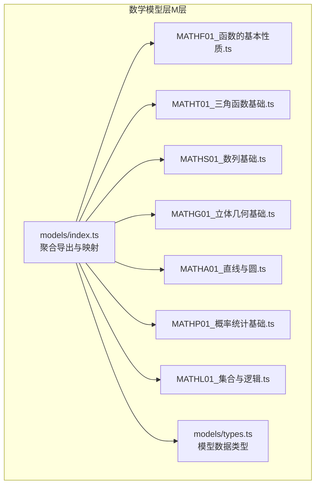
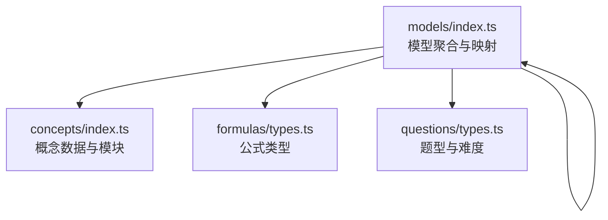
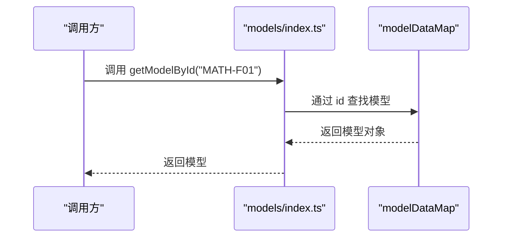
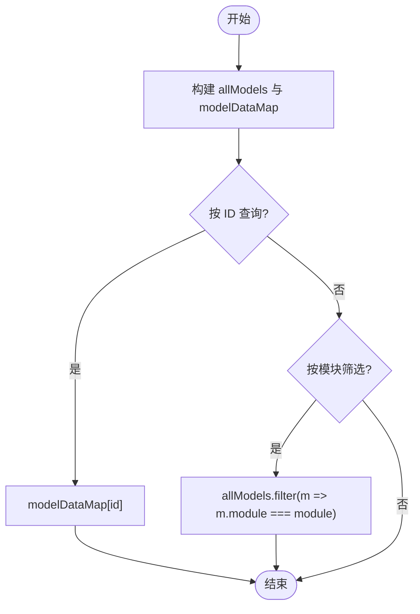
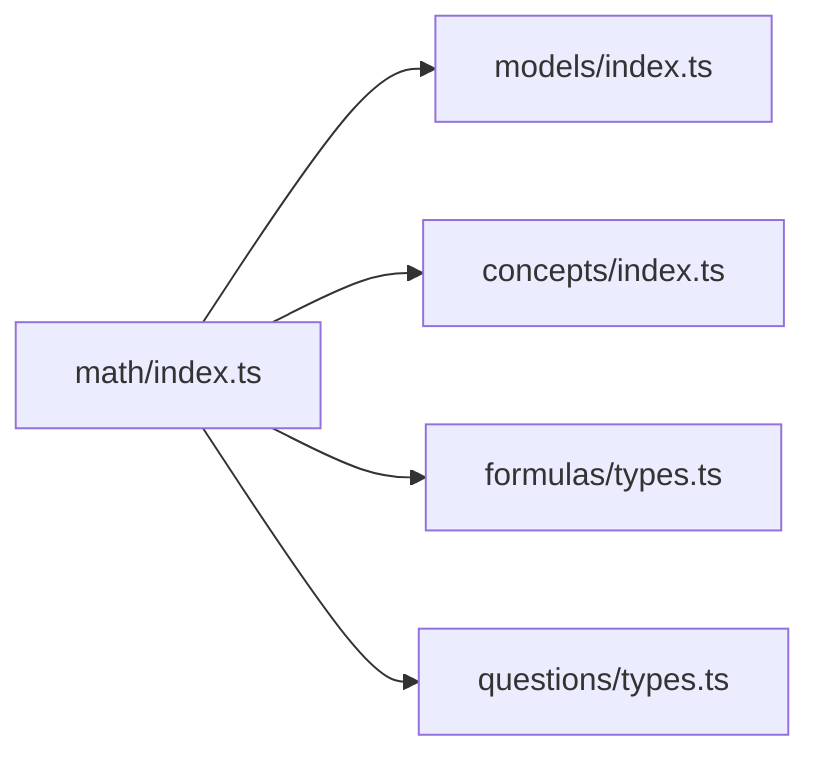

# 数学模型层（M层）

<cite>
**本文引用的文件**
- [src/data/math/models/index.ts](file://src/data/math/models/index.ts)
- [src/data/math/models/types.ts](file://src/data/math/models/types.ts)
- [src/data/math/models/MATHF01_函数的基本性质.ts](file://src/data/math/models/MATHF01_函数的基本性质.ts)
- [src/data/math/models/MATHT01_三角函数基础.ts](file://src/data/math/models/MATHT01_三角函数基础.ts)
- [src/data/math/models/MATHS01_数列基础.ts](file://src/data/math/models/MATHS01_数列基础.ts)
- [src/data/math/models/MATHG01_立体几何基础.ts](file://src/data/math/models/MATHG01_立体几何基础.ts)
- [src/data/math/models/MATHA01_直线与圆.ts](file://src/data/math/models/MATHA01_直线与圆.ts)
- [src/data/math/models/MATHP01_概率统计基础.ts](file://src/data/math/models/MATHP01_概率统计基础.ts)
- [src/data/math/models/MATHL01_集合与逻辑.ts](file://src/data/math/models/MATHL01_集合与逻辑.ts)
- [src/data/math/index.ts](file://src/data/math/index.ts)
- [src/data/math/concepts/index.ts](file://src/data/math/concepts/index.ts)
- [src/data/math/questions/types.ts](file://src/data/math/questions/types.ts)
- [src/data/math/formulas/types.ts](file://src/data/math/formulas/types.ts)
- [src/types/index.ts](file://src/types/index.ts)
</cite>

## 目录
1. [引言](#引言)
2. [项目结构](#项目结构)
3. [核心组件](#核心组件)
4. [架构总览](#架构总览)
5. [详细组件分析](#详细组件分析)
6. [依赖分析](#依赖分析)
7. [性能考虑](#性能考虑)
8. [故障排查指南](#故障排查指南)
9. [结论](#结论)
10. [附录](#附录)

## 引言
本文件系统化梳理“数学模型层（M层）”的设计与实现，覆盖数学核心模型的分类与组织、数据结构与映射机制、查询与筛选能力、适用场景与应用范围、标准化描述模板与质量评估标准，以及版本管理与兼容性处理建议。目标是帮助开发者与内容建设者高效理解与维护数学模型数据，支撑上层教学、题库与认知图谱等模块。

## 项目结构
数学模型层位于 src/data/math/models 下，采用“按主题模块化”的组织方式，每个文件聚焦一类数学模型（如函数、三角、数列、立体几何、解析几何、概率统计、集合与逻辑、复数），并通过 barrel 文件统一导出与聚合。

图表来源
- [src/data/math/models/index.ts:1-56](file://src/data/math/models/index.ts#L1-L56)
- [src/data/math/models/types.ts:1-27](file://src/data/math/models/types.ts#L1-L27)

章节来源
- [src/data/math/models/index.ts:1-56](file://src/data/math/models/index.ts#L1-L56)
- [src/data/math/models/types.ts:1-27](file://src/data/math/models/types.ts#L1-L27)

## 核心组件
- 模型数据类型定义：MathModel、ModelChapter、ModelExample，明确模型的标识、标题、模块、章节与示例结构。
- 模型聚合与映射：通过 barrel 文件导出单个模型对象，并构建 allModels 数组与 modelDataMap（id -> 模型）索引。
- 模块清单与查询：提供 MATH_MODEL_MODULES 列表与按模块过滤的查询函数。
- 上层注册与暴露：在数学学科入口文件中注册模型数据，供全局使用。

章节来源
- [src/data/math/models/types.ts:21-27](file://src/data/math/models/types.ts#L21-L27)
- [src/data/math/models/index.ts:25-56](file://src/data/math/models/index.ts#L25-L56)
- [src/data/math/index.ts:126-151](file://src/data/math/index.ts#L126-L151)

## 架构总览
数学模型层与概念层、公式层、题库层协同工作，形成“概念—模型—公式—题目”的知识闭环。模型层通过统一的数据结构与查询接口，向上提供模型列表、按模块聚合、按 ID 查询等能力。

图表来源
- [src/data/math/index.ts:1-166](file://src/data/math/index.ts#L1-L166)
- [src/data/math/models/index.ts:1-56](file://src/data/math/models/index.ts#L1-L56)
- [src/data/math/concepts/index.ts:1-119](file://src/data/math/concepts/index.ts#L1-L119)
- [src/data/math/formulas/types.ts:1-15](file://src/data/math/formulas/types.ts#L1-L15)
- [src/data/math/questions/types.ts:1-21](file://src/data/math/questions/types.ts#L1-L21)

## 详细组件分析

### 数据结构与标准化模板
- 模型对象（MathModel）
  - 字段：id、title、module、chapter
  - 用途：承载一个模型的完整描述与章节内容
- 章节对象（ModelChapter）
  - 字段：id、title、subtitle、module、content、examples、relatedConcepts
  - 用途：描述模型下的具体章节，包含标题、副标题、内容、示例与关联知识点
- 示例对象（ModelExample）
  - 字段：title、problem、solution、key
  - 用途：提供典型例题的题目、解答与要点

章节来源
- [src/data/math/models/types.ts:4-27](file://src/data/math/models/types.ts#L4-L27)

### 模型聚合与查询机制
- 聚合导出：barrel 文件集中导出各模型对象，并构建 allModels 数组与 modelDataMap（基于 id 的字典索引）
- 模块清单：MATH_MODEL_MODULES 定义了模型所属的模块集合
- 查询接口：
  - getModelById(id)：按 ID 快速检索模型
  - getModelsByModule(module)：按模块筛选模型集合

图表来源
- [src/data/math/models/index.ts:50-52](file://src/data/math/models/index.ts#L50-L52)

章节来源
- [src/data/math/models/index.ts:25-56](file://src/data/math/models/index.ts#L25-L56)

### 典型模型示例与适用场景

#### 函数模型（函数与导数）
- 示例模型：函数的基本性质（定义域、值域、单调性、奇偶性）
- 适用场景：函数概念与性质的系统梳理，配合题库中的函数题型进行训练
- 关联知识点：K07-K16（函数概念、表示法、单调性、奇偶性、导数等）

章节来源
- [src/data/math/models/MATHF01_函数的基本性质.ts:4-24](file://src/data/math/models/MATHF01_函数的基本性质.ts#L4-L24)
- [src/data/math/concepts/index.ts:10-24](file://src/data/math/concepts/index.ts#L10-L24)

#### 三角函数与向量模型（三角与向量）
- 示例模型：三角函数基础、三角恒等变换、正弦/余弦定理、平面向量的概念与数量积、向量应用
- 适用场景：解三角形、向量运算与几何应用
- 关联知识点：K24-K34（弧度制、三角函数、恒等变换、向量概念与运算）

章节来源
- [src/data/math/models/MATHT01_三角函数基础.ts:4-135](file://src/data/math/models/MATHT01_三角函数基础.ts#L4-L135)
- [src/data/math/concepts/index.ts:27-37](file://src/data/math/concepts/index.ts#L27-L37)

#### 数列模型（数列与归纳）
- 示例模型：数列基础、等差/等比数列、数列求和、递推数列、数学归纳法、数列不等式、数列综合
- 适用场景：数列通项与求和、递推关系、归纳证明、不等式放缩
- 关联知识点：K35-K41（数列概念、等差/等比、求和、递推、归纳、不等式）

章节来源
- [src/data/math/models/MATHS01_数列基础.ts:4-179](file://src/data/math/models/MATHS01_数列基础.ts#L4-L179)
- [src/data/math/concepts/index.ts:38-41](file://src/data/math/concepts/index.ts#L38-L41)

#### 立体几何模型（立体几何）
- 示例模型：立体几何基础、几何体体积、空间位置关系、线面平行/垂直、空间向量、向量应用
- 适用场景：空间图形的性质与计算、平行/垂直判定与证明、向量法求角与距离
- 关联知识点：K42-K49（基本立体图形、体积、位置关系、向量）

章节来源
- [src/data/math/models/MATHG01_立体几何基础.ts:4-157](file://src/data/math/models/MATHG01_立体几何基础.ts#L4-L157)
- [src/data/math/concepts/index.ts:45-52](file://src/data/math/concepts/index.ts#L45-L52)

#### 解析几何模型（解析几何）
- 示例模型：直线与圆、圆与圆的位置关系、直线与圆的位置关系、椭圆/双曲线/抛物线、直线与圆锥曲线、参数方程
- 适用场景：坐标法解几何、圆锥曲线性质与位置关系、弦长与中点弦
- 关联知识点：K50-K58（直线、圆、圆锥曲线、参数方程）

章节来源
- [src/data/math/models/MATHA01_直线与圆.ts:4-179](file://src/data/math/models/MATHA01_直线与圆.ts#L4-L179)
- [src/data/math/concepts/index.ts:53-61](file://src/data/math/concepts/index.ts#L53-L61)

#### 概率统计模型（概率与统计）
- 示例模型：概率统计基础、随机事件与概率、条件概率与独立性、离散型随机变量、二项分布、正态分布、排列组合与二项式定理
- 适用场景：样本估计、古典/几何概型、离散分布、正态分布、计数原理
- 关联知识点：K59-K72（抽样、概率、分布、计数）

章节来源
- [src/data/math/models/MATHP01_概率统计基础.ts:4-157](file://src/data/math/models/MATHP01_概率统计基础.ts#L4-L157)
- [src/data/math/concepts/index.ts:62-75](file://src/data/math/concepts/index.ts#L62-L75)

#### 集合与逻辑模型（集合与逻辑）
- 示例模型：集合运算、充要条件与量词、不等式基础、基本不等式、线性规划、推理与证明、复数基础与三角形式、复数运算与方程、复数与向量
- 适用场景：基础语言与推理、不等式与最值、复数运算与几何
- 关联知识点：K01-K06、K73-K75（集合、逻辑、不等式、复数）

章节来源
- [src/data/math/models/MATHL01_集合与逻辑.ts:4-355](file://src/data/math/models/MATHL01_集合与逻辑.ts#L4-L355)
- [src/data/math/concepts/index.ts:4-7](file://src/data/math/concepts/index.ts#L4-L7)

### 模型数据映射表与查询机制
- 映射表构建：allModels 数组 + modelDataMap（id -> 模型）实现 O(1) 检索
- 查询能力：
  - 按 ID：getModelById
  - 按模块：getModelsByModule
  - 模块聚合：MATH_MODEL_MODULES 提供模块清单，配合 getModelChapters 输出按模块聚合的模型列表

图表来源
- [src/data/math/models/index.ts:25-56](file://src/data/math/models/index.ts#L25-L56)

章节来源
- [src/data/math/models/index.ts:25-56](file://src/data/math/models/index.ts#L25-L56)

### 与题库、公式、概念的协同
- 题库类型：数学题库采用通用题型与难度字段，便于与模型进行关联与统计
- 公式类型：公式层提供公式章节与条目，可与模型章节内容互补
- 概念关联：模型章节中的 relatedConcepts 字段用于标注关联的知识点，便于构建知识网络

章节来源
- [src/data/math/questions/types.ts:4-21](file://src/data/math/questions/types.ts#L4-L21)
- [src/data/math/formulas/types.ts:4-15](file://src/data/math/formulas/types.ts#L4-L15)
- [src/data/math/models/MATHF01_函数的基本性质.ts:22-22](file://src/data/math/models/MATHF01_函数的基本性质.ts#L22-L22)

## 依赖分析
- 模型层依赖概念层（用于关联知识点）、公式层（用于补充公式）、题库层（用于统计与筛选）
- 数学学科入口通过 registerSubject 将模型数据暴露给上层组件使用

图表来源
- [src/data/math/index.ts:1-166](file://src/data/math/index.ts#L1-L166)
- [src/data/math/models/index.ts:1-56](file://src/data/math/models/index.ts#L1-L56)
- [src/data/math/concepts/index.ts:1-119](file://src/data/math/concepts/index.ts#L1-L119)
- [src/data/math/formulas/types.ts:1-15](file://src/data/math/formulas/types.ts#L1-L15)
- [src/data/math/questions/types.ts:1-21](file://src/data/math/questions/types.ts#L1-L21)

章节来源
- [src/data/math/index.ts:126-151](file://src/data/math/index.ts#L126-L151)

## 性能考虑
- 模型检索：modelDataMap 使用对象映射实现 O(1) 查找，适合高频查询场景
- 模块筛选：getModelsByModule 基于数组 filter，复杂度 O(n)，在模型规模可控时性能可接受
- 扩展建议：
  - 若模型规模扩大，可考虑为模块建立二级索引（如 Record<string, Set<string>>）
  - 对 frequently-used 模块可做缓存或懒加载
  - 在 UI 层对模型列表进行虚拟滚动与分页

## 故障排查指南
- 模型缺失或 ID 冲突
  - 现象：getModelById 返回 undefined 或映射错误
  - 排查：检查 models/index.ts 中 allModels 与 modelDataMap 的构建是否一致
- 模块筛选异常
  - 现象：getModelsByModule 返回空或结果不完整
  - 排查：确认模型对象的 module 字段与 MATH_MODEL_MODULES 一致
- 关联知识点缺失
  - 现象：relatedConcepts 为空或指向不存在的概念 ID
  - 排查：核对概念层的 ID 与引用一致性

章节来源
- [src/data/math/models/index.ts:25-56](file://src/data/math/models/index.ts#L25-L56)
- [src/data/math/models/MATHF01_函数的基本性质.ts:22-22](file://src/data/math/models/MATHF01_函数的基本性质.ts#L22-L22)
- [src/data/math/concepts/index.ts:93-95](file://src/data/math/concepts/index.ts#L93-L95)

## 结论
数学模型层以清晰的数据结构与高效的查询机制为核心，围绕函数、三角、数列、立体几何、解析几何、概率统计、集合与逻辑、复数等模块构建了完整的模型体系。通过与概念、公式、题库的协同，形成了可扩展、可维护的知识组织与应用框架。建议在保持现有结构稳定的基础上，持续完善模型描述模板与质量评估标准，强化版本管理与兼容性策略，以支撑更大规模的内容建设与产品迭代。

## 附录

### 标准化描述模板（建议）
- 模型对象（MathModel）
  - id：唯一标识符（建议使用“MATH-{模块代码}{序号}”）
  - title：模型名称
  - module：所属模块（需与 MATH_MODEL_MODULES 一致）
  - chapter：章节对象（见下）
- 章节对象（ModelChapter）
  - id/title/subtitle/module：章节标识与标题
  - content：章节内容概述
  - examples：示例数组（至少包含 1 个典型例题）
  - relatedConcepts：关联知识点 ID 列表
- 示例对象（ModelExample）
  - title：示例标题
  - problem：题目描述
  - solution：解题思路与步骤
  - key：关键知识点或方法要点

章节来源
- [src/data/math/models/types.ts:4-27](file://src/data/math/models/types.ts#L4-L27)

### 质量评估标准（建议）
- 完整性：每个模块至少包含 1 个代表性模型；每个模型至少包含 1 个示例
- 一致性：module 字段与模块清单一致；relatedConcepts 指向存在的概念 ID
- 可读性：content 清晰、examples 逻辑完整、key 突出重点
- 可扩展性：新增模型遵循统一模板，避免破坏现有索引与查询逻辑

### 版本管理与兼容性处理（建议）
- 版本号：采用语义化版本（如 M1.0.0），在模型对象中增加 version 字段
- 兼容策略：
  - 新增字段：默认值或空值，保证旧解析器可用
  - 删除字段：保留但标记废弃，逐步迁移
  - 结构变更：提供迁移脚本与映射函数，确保查询接口稳定
- 发布流程：变更前更新 barrel 导出与映射，变更后进行全量校验