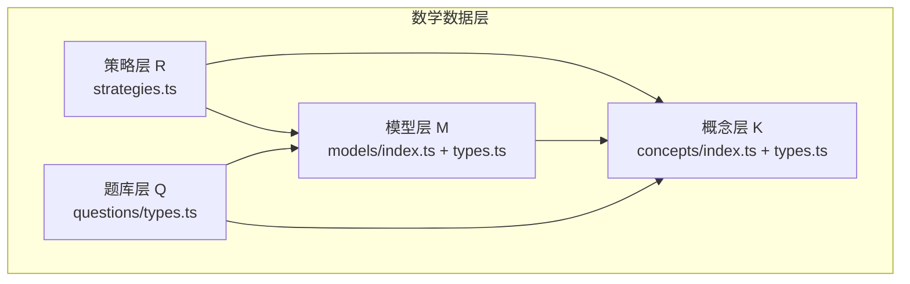
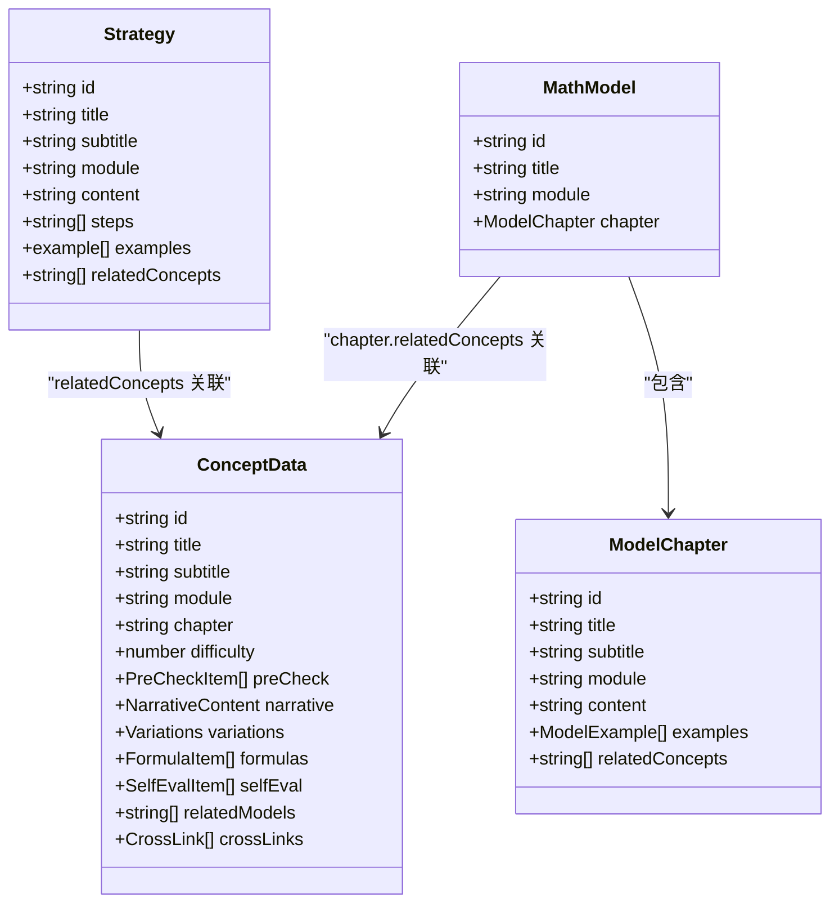
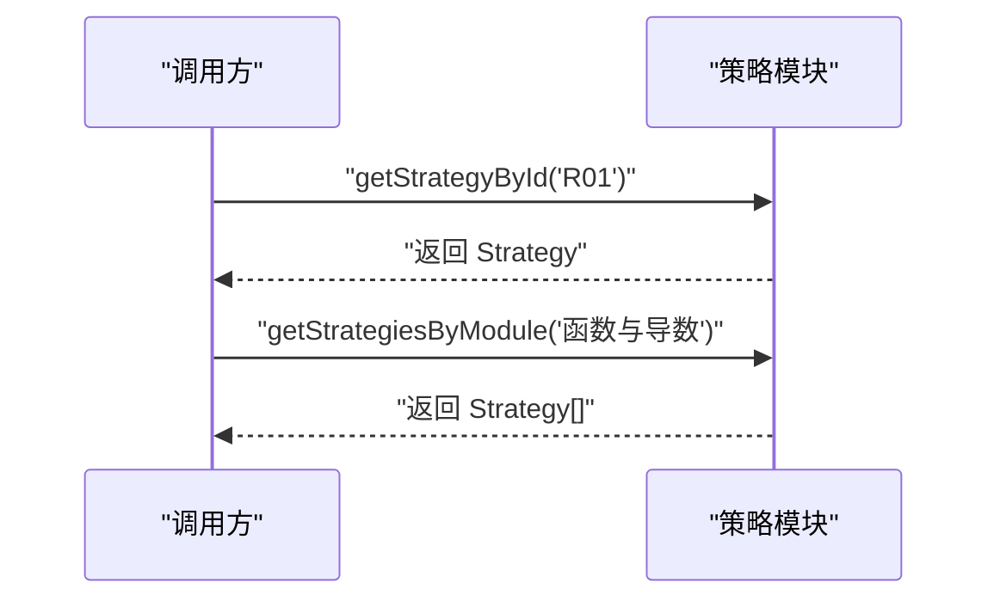
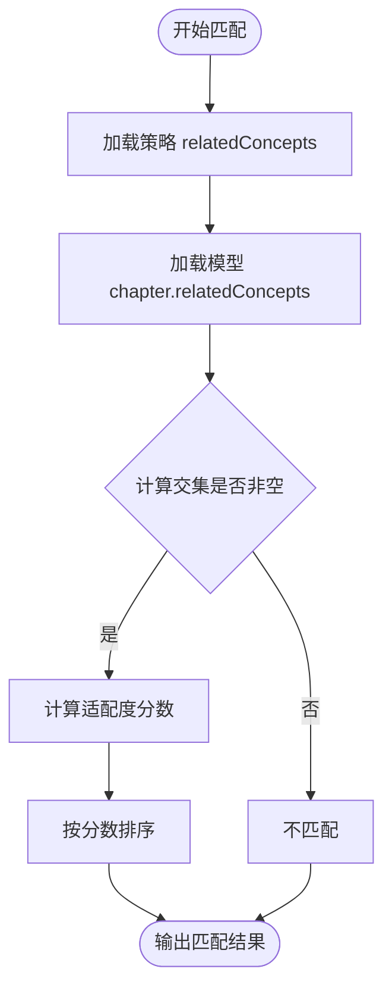
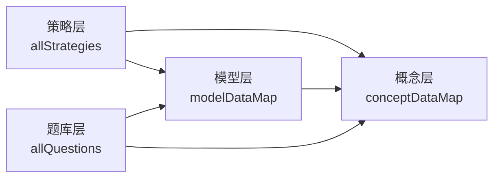

# 数学解题策略层（R层）

<cite>
**本文引用的文件**
- [strategies.ts](file://src/data/math/strategies.ts)
- [index.ts](file://src/data/math/index.ts)
- [types.ts（数学概念）](file://src/data/math/concepts/types.ts)
- [index.ts（数学概念）](file://src/data/math/concepts/index.ts)
- [types.ts（数学模型）](file://src/data/math/models/types.ts)
- [index.ts（数学模型）](file://src/data/math/models/index.ts)
- [MATHF01_函数的基本性质.ts](file://src/data/math/models/MATHF01_函数的基本性质.ts)
- [MATHS01_数列基础.ts](file://src/data/math/models/MATHS01_数列基础.ts)
- [MATHG01_立体几何基础.ts](file://src/data/math/models/MATHG01_立体几何基础.ts)
- [MATHP01_概率统计基础.ts](file://src/data/math/models/MATHP01_概率统计基础.ts)
- [types.ts（数学题库）](file://src/data/math/questions/types.ts)
</cite>

## 目录
1. [引言](#引言)
2. [项目结构](#项目结构)
3. [核心组件](#核心组件)
4. [架构总览](#架构总览)
5. [详细组件分析](#详细组件分析)
6. [依赖分析](#依赖分析)
7. [性能考虑](#性能考虑)
8. [故障排查指南](#故障排查指南)
9. [结论](#结论)
10. [附录](#附录)

## 引言
本文件系统化梳理“数学解题策略层（R层）”的设计与实现，围绕数学解题套路的分类体系、组织结构、与具体数学模型的关联关系与匹配机制展开，明确策略ID、名称、描述、适用模型结构化数据格式，给出分类标准与优先级排序规则，并提出策略的更新维护与效果评估机制。目标是帮助开发者与教师高效理解与扩展数学R层策略，支撑上层教学与练习系统。

## 项目结构
数学R层位于学科数据子模块中，采用“策略 + 概念 + 模型 + 题库”的分层组织方式：
- 策略层（R层）：定义解题套路的结构化数据与检索接口
- 概念层（K层）：提供知识点的结构化数据与模块划分
- 模型层（M层）：提供可复用的“问题范式 + 示例 + 关联概念”的模型
- 题库层（Q层）：提供题目数据与过滤选项

图表来源
- [strategies.ts:1-66](file://src/data/math/strategies.ts#L1-L66)
- [index.ts:126-151](file://src/data/math/index.ts#L126-L151)
- [types.ts（数学概念）:52-72](file://src/data/math/concepts/types.ts#L52-L72)
- [types.ts（数学模型）:21-26](file://src/data/math/models/types.ts#L21-L26)
- [types.ts（数学题库）:4-14](file://src/data/math/questions/types.ts#L4-L14)

章节来源
- [index.ts:126-151](file://src/data/math/index.ts#L126-L151)
- [strategies.ts:18-66](file://src/data/math/strategies.ts#L18-L66)

## 核心组件
- 策略数据结构（Strategy）
  - 字段：id、title、subtitle、module、content、steps、examples、relatedConcepts
  - 用途：统一描述一个解题套路的ID、名称、描述、步骤、示例与关联概念
- 策略聚合与检索
  - allStrategies：策略数组
  - strategyDataMap：按ID索引的策略映射
  - getStrategyById、getStrategiesByModule：按ID与模块检索策略
- 注册与对外暴露
  - registerSubject('math')：注册数学学科数据源，暴露策略列表与数据映射

章节来源
- [strategies.ts:7-16](file://src/data/math/strategies.ts#L7-L16)
- [strategies.ts:18-66](file://src/data/math/strategies.ts#L18-L66)
- [index.ts:141-142](file://src/data/math/index.ts#L141-L142)

## 架构总览
R层通过“策略-概念-模型”三级联动实现“解题套路到具体问题范式的映射”。策略层提供通用套路，概念层提供知识点支撑，模型层提供可执行的范式与示例，题库层承载练习与评估。

图表来源
- [strategies.ts:7-16](file://src/data/math/strategies.ts#L7-L16)
- [types.ts（数学概念）:52-72](file://src/data/math/concepts/types.ts#L52-L72)
- [types.ts（数学模型）:21-26](file://src/data/math/models/types.ts#L21-L26)
- [types.ts（数学模型）:4-12](file://src/data/math/models/types.ts#L4-L12)

## 详细组件分析

### 策略层（R层）数据模型与检索
- 数据模型
  - Strategy：包含策略标识、标题、副标题、模块、内容、步骤、示例、关联概念
- 聚合与索引
  - allStrategies：策略数组，用于前端展示与筛选
  - strategyDataMap：按ID索引，便于快速查找
- 检索接口
  - getStrategyById：按ID返回策略
  - getStrategiesByModule：按模块返回策略列表

图表来源
- [strategies.ts:59-65](file://src/data/math/strategies.ts#L59-L65)

章节来源
- [strategies.ts:7-16](file://src/data/math/strategies.ts#L7-L16)
- [strategies.ts:55-66](file://src/data/math/strategies.ts#L55-L66)

### 策略与模型的关联关系
- 关联方式
  - 策略的 relatedConcepts 与模型的 chapter.relatedConcepts 通过概念ID对齐
  - 典型映射：函数定义域求解 → 函数基本性质模型；数列求和 → 数列基础模型；立体几何证明 → 立体几何基础模型；概率统计计算 → 概率统计基础模型
- 匹配机制
  - 通过概念ID集合的交集判断策略与模型的适配度
  - 可扩展为“权重评分”：根据相关概念数量与难度加权

图表来源
- [strategies.ts:30](file://src/data/math/strategies.ts#L30)
- [MATHF01_函数的基本性质.ts:22](file://src/data/math/models/MATHF01_函数的基本性质.ts#L22)
- [MATHS01_数列基础.ts:22](file://src/data/math/models/MATHS01_数列基础.ts#L22)
- [MATHG01_立体几何基础.ts:22](file://src/data/math/models/MATHG01_立体几何基础.ts#L22)
- [MATHP01_概率统计基础.ts:22](file://src/data/math/models/MATHP01_概率统计基础.ts#L22)

章节来源
- [MATHF01_函数的基本性质.ts:4-24](file://src/data/math/models/MATHF01_函数的基本性质.ts#L4-L24)
- [MATHS01_数列基础.ts:4-24](file://src/data/math/models/MATHS01_数列基础.ts#L4-L24)
- [MATHG01_立体几何基础.ts:4-24](file://src/data/math/models/MATHG01_立体几何基础.ts#L4-L24)
- [MATHP01_概率统计基础.ts:4-24](file://src/data/math/models/MATHP01_概率统计基础.ts#L4-L24)

### 策略分类体系与优先级排序
- 分类标准
  - 按模块划分：函数与导数、三角与向量、数列与归纳、立体几何、解析几何、概率与统计、集合与逻辑、不等式、复数与平面向量
  - 按ID区间预留：R01-R10（函数与导数）、R11-R20（三角与向量）、R21-R30（数列与归纳）、R31-R40（立体几何）、R41-R50（解析几何）、R51-R60（概率与统计）、R61-R70（集合与逻辑）、R71-R80（不等式）、R81-R90（复数与平面向量）
- 优先级排序规则
  - 基于“知识关联度”与“题型覆盖率”打分：与模型相关概念越多、覆盖题型越广，优先级越高
  - 基于“难度系数”与“学习阶段”调整：基础题优先于高阶题，高频考点优先于低频考点
  - 基于“使用反馈”动态调整：结合题库练习与错误率，持续优化策略权重

章节来源
- [strategies.ts:18-53](file://src/data/math/strategies.ts#L18-L53)
- [index.ts:109-118](file://src/data/math/index.ts#L109-L118)

### 解题策略与具体数学模型的结构化数据格式
- 策略（Strategy）
  - 字段：id、title、subtitle、module、content、steps、examples、relatedConcepts
  - 示例字段：examples 包含 problem、solution
- 模型（MathModel）
  - 字段：id、title、module、chapter
  - 章节（ModelChapter）字段：id、title、subtitle、module、content、examples、relatedConcepts
  - 示例字段：examples 包含 title、problem、solution、key
- 关联字段
  - Strategy.relatedConcepts 与 ModelChapter.relatedConcepts 均为概念ID数组，用于策略-模型匹配

章节来源
- [strategies.ts:7-16](file://src/data/math/strategies.ts#L7-L16)
- [types.ts（数学模型）:4-12](file://src/data/math/models/types.ts#L4-L12)
- [types.ts（数学模型）:21-26](file://src/data/math/models/types.ts#L21-L26)

### 典型策略与模型映射示例

#### 函数定义域求解（R01）
- 策略要点：列出限制条件 → 解不等式或方程 → 取交集
- 关联模型：函数基本性质（MATH-F01），相关概念：K07（函数的概念）、K09（函数的单调性）、K10（函数的奇偶性）
- 适用场景：初等函数有意义的x范围确定

章节来源
- [strategies.ts:20-31](file://src/data/math/strategies.ts#L20-L31)
- [MATHF01_函数的基本性质.ts:8-23](file://src/data/math/models/MATHF01_函数的基本性质.ts#L8-L23)

#### 数列求和（RXX）
- 策略要点：识别数列类型 → 选择求和公式或技巧（错位相减、裂项相消、累加/累乘、数学归纳法等）
- 关联模型：数列基础（MATH-S01）与数列求和（MATH-S04），相关概念：K35（数列的概念）、K36（等差数列）、K37（等比数列）、K38（数列求和）
- 适用场景：等差/等比数列求和、裂项相消、递推数列求和

章节来源
- [MATHS01_数列基础.ts:4-24](file://src/data/math/models/MATHS01_数列基础.ts#L4-L24)
- [MATHS01_数列基础.ts:74-89](file://src/data/math/models/MATHS01_数列基础.ts#L74-L89)

#### 立体几何证明（RXX）
- 策略要点：线线平行/垂直 → 线面平行/垂直 → 面面平行/垂直；向量法求角与距离
- 关联模型：立体几何基础（MATH-G01）与空间向量（MATH-G06/G07），相关概念：K42（基本立体图形）、K45（空间点线面位置关系）、K46（平行）、K47（垂直）、K48（空间向量）、K49（空间向量的应用）
- 适用场景：平行/垂直的判定与性质、二面角与距离计算

章节来源
- [MATHG01_立体几何基础.ts:4-24](file://src/data/math/models/MATHG01_立体几何基础.ts#L4-L24)
- [MATHG01_立体几何基础.ts:118-133](file://src/data/math/models/MATHG01_立体几何基础.ts#L118-L133)

#### 概率统计计算（RXX）
- 策略要点：随机抽样 → 事件概率 → 条件概率与独立性 → 离散型随机变量的分布列、期望、方差 → 二项分布与正态分布
- 关联模型：概率统计基础（MATH-P01）与相关章节，相关概念：K59（随机抽样）、K60（用样本估计总体）、K62（随机事件与概率）、K63（事件的相互独立性）、K64（条件概率与全概率公式）、K65（离散型随机变量及其分布列）、K66（二项分布与超几何分布）、K67（正态分布）、K70/K71/K72（计数原理、排列与组合、二项式定理）
- 适用场景：古典概型、几何概型、条件概率、期望与方差、二项分布与正态分布

章节来源
- [MATHP01_概率统计基础.ts:4-24](file://src/data/math/models/MATHP01_概率统计基础.ts#L4-L24)
- [MATHP01_概率统计基础.ts:138-156](file://src/data/math/models/MATHP01_概率统计基础.ts#L138-L156)

### 策略更新维护与效果评估机制
- 更新维护
  - 新增策略：在 allStrategies 中添加新条目，设置 id、module、relatedConcepts，配套完善 steps 与 examples
  - 模块化管理：按模块区间（如 R21-R30）集中维护，便于版本迭代与评审
  - 版本追踪：通过ID前缀与注释记录版本号，配合变更日志
- 效果评估
  - 使用统计：结合题库练习数据，统计策略命中率与正确率
  - 错误分析：收集典型错误与混淆点，反哺策略步骤与示例优化
  - 用户反馈：基于学习路径与练习页面的用户行为数据，动态调整策略优先级

章节来源
- [index.ts:144-147](file://src/data/math/index.ts#L144-L147)

## 依赖分析
- 内部依赖
  - 策略层依赖概念层（relatedConcepts）与模型层（通过概念ID间接关联）
  - 模型层依赖概念层（chapter.relatedConcepts）
  - 题库层依赖模型层与概念层（用于筛选与统计）
- 外部依赖
  - 注册机制：通过 registerSubject('math') 将数学数据源注入全局

图表来源
- [index.ts:126-151](file://src/data/math/index.ts#L126-L151)
- [index.ts:153-166](file://src/data/math/index.ts#L153-L166)

章节来源
- [index.ts:126-151](file://src/data/math/index.ts#L126-L151)

## 性能考虑
- 策略检索
  - strategyDataMap 提供 O(1) 按ID查找
  - getStrategiesByModule 为 O(n) 线性过滤，建议在前端缓存模块分组
- 模型检索
  - modelDataMap 提供 O(1) 按ID查找
  - getModelsByModule 为 O(n) 线性过滤，建议在前端缓存模块分组
- 关联匹配
  - 策略与模型的关联匹配建议采用 Set 交集，复杂度 O(|A|+|B|)，适合大规模概念ID集合

## 故障排查指南
- 策略ID缺失或重复
  - 现象：getStrategyById 返回 undefined
  - 排查：检查 strategyDataMap 与 allStrategies 的 id 是否唯一且正确
- 模块名不一致
  - 现象：getStrategiesByModule 无法返回策略
  - 排查：确认策略 module 与 MATH_MODULES 中的模块名一致
- 关联概念ID错误
  - 现象：策略与模型无法匹配
  - 排查：核对 Strategy.relatedConcepts 与 ModelChapter.relatedConcepts 的概念ID是否存在于概念数据中
- 题库统计异常
  - 现象：getModelQuestionStats 统计不准确
  - 排查：确认题目对象的 modelId 字段是否正确填充

章节来源
- [strategies.ts:59-65](file://src/data/math/strategies.ts#L59-L65)
- [index.ts:106-124](file://src/data/math/index.ts#L106-L124)

## 结论
数学R层以“策略-概念-模型”为核心，形成可复用、可扩展的解题套路体系。通过结构化的数据模型与清晰的关联关系，策略能够高效匹配到对应的模型与知识点，支撑题库筛选与学习路径推荐。建议持续完善策略覆盖度、优化匹配算法与引入动态评估机制，以提升教学与练习效果。

## 附录
- 模块与ID区间对照
  - 函数与导数：R01-R10
  - 三角与向量：R11-R20
  - 数列与归纳：R21-R30
  - 立体几何：R31-R40
  - 解析几何：R41-R50
  - 概率与统计：R51-R60
  - 集合与逻辑：R61-R70
  - 不等式：R71-R80
  - 复数与平面向量：R81-R90

章节来源
- [strategies.ts:18-53](file://src/data/math/strategies.ts#L18-L53)
- [index.ts:109-118](file://src/data/math/index.ts#L109-L118)