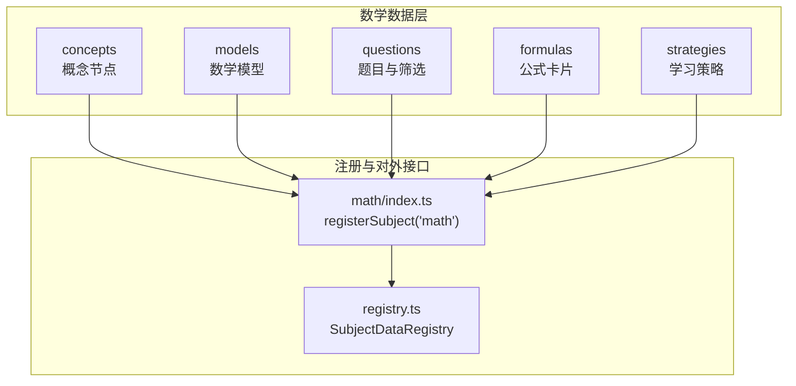
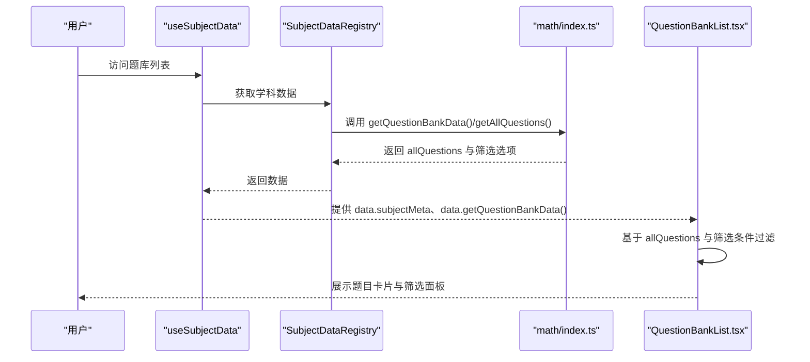
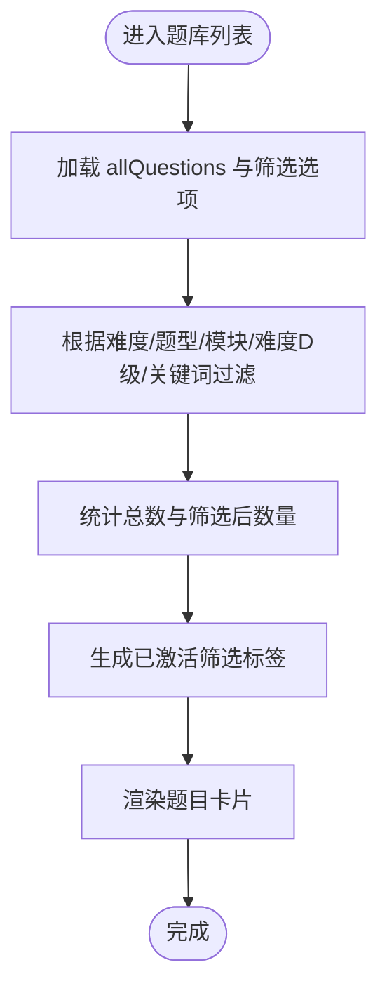
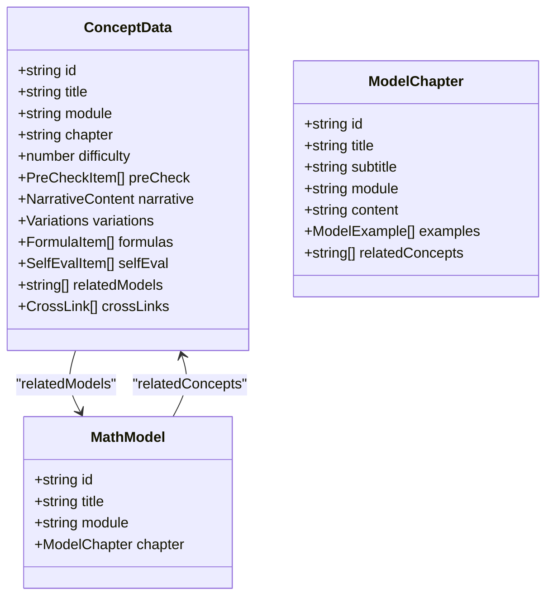
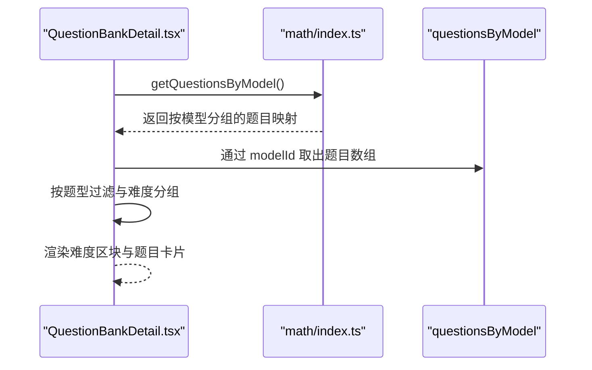
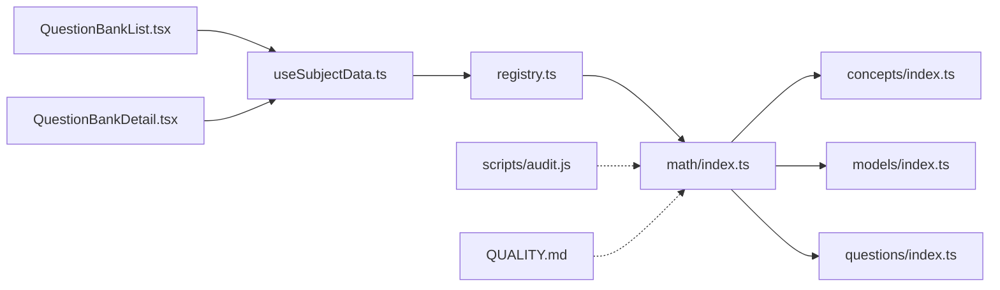

# 数学题库层（P层）

<cite>
**本文引用的文件**   
- [src/data/math/questions/types.ts](file://src/data/math/questions/types.ts)
- [src/data/math/questions/filters.ts](file://src/data/math/questions/filters.ts)
- [src/data/math/questions/index.ts](file://src/data/math/questions/index.ts)
- [src/data/math/models/types.ts](file://src/data/math/models/types.ts)
- [src/data/math/models/index.ts](file://src/data/math/models/index.ts)
- [src/data/math/concepts/index.ts](file://src/data/math/concepts/index.ts)
- [src/data/math/concepts/types.ts](file://src/data/math/concepts/types.ts)
- [src/data/math/index.ts](file://src/data/math/index.ts)
- [src/data/registry.ts](file://src/data/registry.ts)
- [src/hooks/useSubjectData.ts](file://src/hooks/useSubjectData.ts)
- [src/sections/QuestionBankList.tsx](file://src/sections/QuestionBankList.tsx)
- [src/sections/QuestionBankDetail.tsx](file://src/sections/QuestionBankDetail.tsx)
- [scripts/audit.js](file://scripts/audit.js)
- [QUALITY.md](file://QUALITY.md)
</cite>

## 目录
1. [简介](#简介)
2. [项目结构](#项目结构)
3. [核心组件](#核心组件)
4. [架构总览](#架构总览)
5. [详细组件分析](#详细组件分析)
6. [依赖分析](#依赖分析)
7. [性能考量](#性能考量)
8. [故障排查指南](#故障排查指南)
9. [结论](#结论)
10. [附录](#附录)

## 简介
本文件系统化梳理“数学题库层（P层）”的设计与实现，覆盖题型分类、题目结构化字段、筛选与排序机制、标签与关联关系、以及质量控制与更新维护流程。文档以“可读性优先”的方式呈现，既适合开发者深入实现，也便于产品与运营人员理解与使用。

## 项目结构
数学题库层位于 src/data/math 下，采用“学科-主题-数据”的层次化组织：
- concepts：数学概念节点，包含模块、章节、难度、公式、自测题、交叉链接等
- models：数学模型（范式），描述“如何解某类题”的结构化模板
- questions：题目数据与筛选常量
- index.ts：学科注册入口，统一暴露概念、模型、公式、题库等接口

**图表来源**
- [src/data/math/index.ts:126-151](file://src/data/math/index.ts#L126-L151)
- [src/data/registry.ts:4-38](file://src/data/registry.ts#L4-L38)

**章节来源**
- [src/data/math/index.ts:1-166](file://src/data/math/index.ts#L1-L166)
- [src/data/math/concepts/index.ts:1-119](file://src/data/math/concepts/index.ts#L1-L119)
- [src/data/math/models/index.ts:1-56](file://src/data/math/models/index.ts#L1-L56)
- [src/data/math/questions/index.ts:1-13](file://src/data/math/questions/index.ts#L1-L13)

## 核心组件
- 题目数据类型与筛选
  - 题目字段：ID、题干、选项（可选）、答案、解析、难度等级、题型、知识点标签、难度D级（可选）
  - 筛选维度：难度等级、题型、模块（函数与导数/三角与向量/数列与归纳/立体几何/解析几何/概率与统计/集合与逻辑/复数）、难度D级
- 概念与模型
  - 概念节点：模块、章节、难度、预检、叙述内容、变式、公式、自测、相关模型、跨学科链接
  - 数学模型：模型章节、示例、相关概念
- 注册与对外接口
  - 通过 registerSubject('math') 将数学数据注册到全局 SubjectDataRegistry，提供题库数据、模型统计、按模型分组题目等统一接口

**章节来源**
- [src/data/math/questions/types.ts:4-14](file://src/data/math/questions/types.ts#L4-L14)
- [src/data/math/questions/filters.ts:3-24](file://src/data/math/questions/filters.ts#L3-L24)
- [src/data/math/concepts/types.ts:52-72](file://src/data/math/concepts/types.ts#L52-L72)
- [src/data/math/models/types.ts:21-26](file://src/data/math/models/types.ts#L21-L26)
- [src/data/math/index.ts:66-100](file://src/data/math/index.ts#L66-L100)

## 架构总览
前端页面通过 useSubjectData 钩子获取数学学科数据，再在题库列表页与详情页中进行筛选、排序与展示。题库数据来源于 math/index.ts 的注册对象，内部聚合了 allQuestions、按模型分组的 questionsByModel、以及筛选选项常量。

**图表来源**
- [src/hooks/useSubjectData.ts:7-46](file://src/hooks/useSubjectData.ts#L7-L46)
- [src/data/registry.ts:25-34](file://src/data/registry.ts#L25-L34)
- [src/data/math/index.ts:66-100](file://src/data/math/index.ts#L66-L100)
- [src/sections/QuestionBankList.tsx:29-100](file://src/sections/QuestionBankList.tsx#L29-L100)

## 详细组件分析

### 题目数据结构与字段
- 字段说明
  - id：唯一标识
  - stem：题干
  - options：可选（选择题）
  - answer：答案
  - analysis：解析
  - level：难度等级（A/B/C）
  - type：题型（choice/fill/解答）
  - knowledgePoints：知识点标签数组
  - difficultyD：难度D级（数值，可选）
- 设计要点
  - 与物理题库保持一致的字段风格，便于跨学科统一处理
  - 通过 knowledgePoints 实现多维标签化，支持按知识点过滤

**章节来源**
- [src/data/math/questions/types.ts:4-14](file://src/data/math/questions/types.ts#L4-L14)

### 题型与难度体系
- 题型
  - choice：选择题
  - fill：填空题
  - 解答：解答题
- 难度等级
  - A：基础
  - B：中等
  - C：较难
- 模块划分
  - 集合与逻辑、函数与导数、三角与向量、数列与归纳、立体几何、解析几何、概率与统计、复数

**章节来源**
- [src/data/math/questions/filters.ts:9-24](file://src/data/math/questions/filters.ts#L9-L24)

### 筛选与排序机制
- 页面端筛选
  - 题库列表页支持：难度等级、题型、模块、难度D级、关键词搜索
  - 通过多条件 AND 组合实现精确过滤
- 数据端聚合
  - math/index.ts 提供 getQuestionBankData，统一输出 allQuestions 与筛选选项
  - 提供按模型分组的题目映射（getQuestionsByModel），用于详情页按模型查看

**图表来源**
- [src/sections/QuestionBankList.tsx:69-83](file://src/sections/QuestionBankList.tsx#L69-L83)
- [src/data/math/index.ts:66-100](file://src/data/math/index.ts#L66-L100)

**章节来源**
- [src/sections/QuestionBankList.tsx:29-100](file://src/sections/QuestionBankList.tsx#L29-L100)
- [src/data/math/index.ts:106-124](file://src/data/math/index.ts#L106-L124)

### 标签系统与关联关系
- 标签
  - knowledgePoints：题目与知识点的多对多关联
  - 页面展示 tags（来自题目数据），支持按标签快速检索
- 关联关系
  - 概念节点 relatedModels：指向相关模型 ID
  - 概念 crossLinks：跨学科链接（subject、conceptId、relation）
  - 模型 chapter.relatedConcepts：模型所涉及的概念 ID 列表

**章节来源**
- [src/data/math/questions/types.ts:12](file://src/data/math/questions/types.ts#L12)
- [src/data/math/concepts/types.ts:70-71](file://src/data/math/concepts/types.ts#L70-L71)
- [src/data/math/models/types.ts:11](file://src/data/math/models/types.ts#L11)

### 概念与模型的数据结构
- 概念节点 ConceptData
  - 基本信息：id、title、subtitle、module、chapter、difficulty
  - 教学内容：preCheck、narrative、variations、formulas、selfEval
  - 关联：relatedModels、crossLinks
- 数学模型 MathModel
  - 基本信息：id、title、module、chapter（含 examples、relatedConcepts）

**图表来源**
- [src/data/math/concepts/types.ts:52-72](file://src/data/math/concepts/types.ts#L52-L72)
- [src/data/math/models/types.ts:21-26](file://src/data/math/models/types.ts#L21-L26)

**章节来源**
- [src/data/math/concepts/types.ts:1-73](file://src/data/math/concepts/types.ts#L1-L73)
- [src/data/math/models/types.ts:1-27](file://src/data/math/models/types.ts#L1-L27)

### 注册与对外接口
- 注册
  - registerSubject('math') 将数学数据注册到全局 registry
- 对外接口
  - getQuestionBankData：返回 allQuestions 与筛选选项
  - getAllQuestions / getQuestionsByModel：提供题目数据与按模型分组
  - getModelQuestionStats：统计各模型题目数量

**章节来源**
- [src/data/math/index.ts:126-151](file://src/data/math/index.ts#L126-L151)
- [src/data/registry.ts:4-38](file://src/data/registry.ts#L4-L38)

### 页面交互与数据流
- 题库列表页
  - 使用 useSubjectData 获取学科数据
  - 基于 allQuestions 与筛选条件进行过滤与展示
  - 支持关键词搜索、难度标签、题型与模块筛选、难度D级筛选
- 题库详情页
  - 按 modelId 从 questionsByModel 获取题目
  - 支持按题型过滤与难度分组展示

**图表来源**
- [src/sections/QuestionBankDetail.tsx:92-117](file://src/sections/QuestionBankDetail.tsx#L92-L117)
- [src/data/math/index.ts:116-124](file://src/data/math/index.ts#L116-L124)

**章节来源**
- [src/sections/QuestionBankList.tsx:29-100](file://src/sections/QuestionBankList.tsx#L29-L100)
- [src/sections/QuestionBankDetail.tsx:92-117](file://src/sections/QuestionBankDetail.tsx#L92-L117)

## 依赖分析
- 组件耦合
  - 页面层依赖 useSubjectData 与 SubjectDataRegistry，间接依赖 math/index.ts 的注册对象
  - math/index.ts 作为“门面”，聚合 concepts、models、questions、formulas、strategies，并统一暴露接口
- 外部依赖
  - registry.ts 定义统一接口契约，保证不同学科的一致性
  - scripts/audit.js 与 QUALITY.md 提供质量控制与发布标准

**图表来源**
- [src/sections/QuestionBankList.tsx:33-59](file://src/sections/QuestionBankList.tsx#L33-L59)
- [src/sections/QuestionBankDetail.tsx:92-117](file://src/sections/QuestionBankDetail.tsx#L92-L117)
- [src/hooks/useSubjectData.ts:7-46](file://src/hooks/useSubjectData.ts#L7-L46)
- [src/data/registry.ts:4-38](file://src/data/registry.ts#L4-L38)
- [src/data/math/index.ts:126-151](file://src/data/math/index.ts#L126-L151)

**章节来源**
- [src/data/registry.ts:4-38](file://src/data/registry.ts#L4-L38)
- [src/data/math/index.ts:126-151](file://src/data/math/index.ts#L126-L151)

## 性能考量
- 数据加载
  - 通过 useSubjectData 在首次访问时触发学科数据加载，避免重复加载
- 过滤策略
  - 页面端一次性过滤 allQuestions，复杂度 O(n)，n 为题目总数
  - 建议在数据量增大时引入服务端分页与缓存
- 渲染优化
  - 使用虚拟滚动（如需）减少 DOM 节点数量
  - 避免在渲染过程中进行昂贵计算，将结果缓存

## 故障排查指南
- 常见问题
  - 题库为空：确认 math/index.ts 的 allQuestions 是否已填充，questions/index.ts 的 getQuestionsByFilter 是否返回有效数据
  - 筛选无效：检查页面筛选逻辑是否与 getQuestionBankData 输出的选项一致
  - 模型题库为空：确认 questionsByModel 是否按 modelId 正确分组
- 质量检查
  - 使用 scripts/audit.js 运行项目审计，确保无编码规范问题
  - 参考 QUALITY.md 的发布标准与题库内容质量标准，确保题干、解析、标签、题型结构符合要求

**章节来源**
- [src/data/math/questions/index.ts:10-12](file://src/data/math/questions/index.ts#L10-L12)
- [src/data/math/index.ts:116-124](file://src/data/math/index.ts#L116-L124)
- [scripts/audit.js:28-44](file://scripts/audit.js#L28-L44)
- [QUALITY.md:8-21](file://QUALITY.md#L8-L21)

## 结论
数学题库层通过清晰的数据结构、统一的注册接口与灵活的筛选机制，实现了题型、知识点、难度与模型的多维组织。配合质量标准与审计脚本，能够持续保障题库数据的准确性与可用性。建议在后续迭代中完善题目填充、引入服务端分页与缓存，并扩展跨学科关联与标签体系。

## 附录
- 术语
  - 题型：选择题、填空题、判断题、解答题
  - 难度等级：A（基础）、B（中等）、C（较难）
  - 难度D级：数值化难度（1/2/3）
  - 模块：函数与导数、三角与向量、数列与归纳、立体几何、解析几何、概率与统计、集合与逻辑、复数
- 参考文件
  - [src/data/math/questions/types.ts](file://src/data/math/questions/types.ts)
  - [src/data/math/questions/filters.ts](file://src/data/math/questions/filters.ts)
  - [src/data/math/questions/index.ts](file://src/data/math/questions/index.ts)
  - [src/data/math/models/types.ts](file://src/data/math/models/types.ts)
  - [src/data/math/models/index.ts](file://src/data/math/models/index.ts)
  - [src/data/math/concepts/index.ts](file://src/data/math/concepts/index.ts)
  - [src/data/math/concepts/types.ts](file://src/data/math/concepts/types.ts)
  - [src/data/math/index.ts](file://src/data/math/index.ts)
  - [src/data/registry.ts](file://src/data/registry.ts)
  - [src/hooks/useSubjectData.ts](file://src/hooks/useSubjectData.ts)
  - [src/sections/QuestionBankList.tsx](file://src/sections/QuestionBankList.tsx)
  - [src/sections/QuestionBankDetail.tsx](file://src/sections/QuestionBankDetail.tsx)
  - [scripts/audit.js](file://scripts/audit.js)
  - [QUALITY.md](file://QUALITY.md)