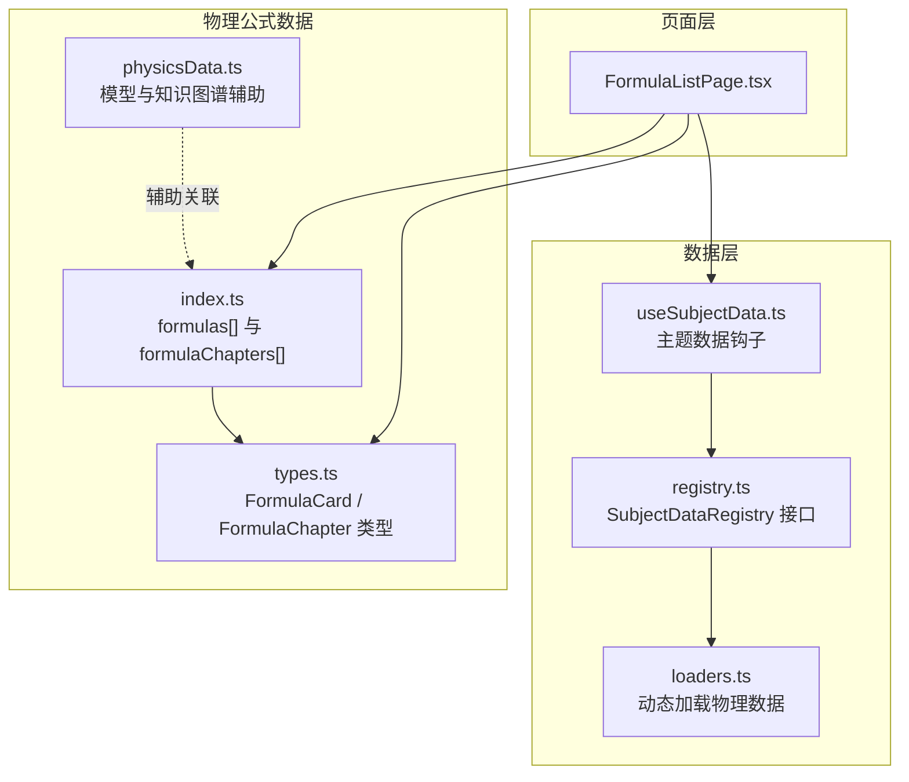
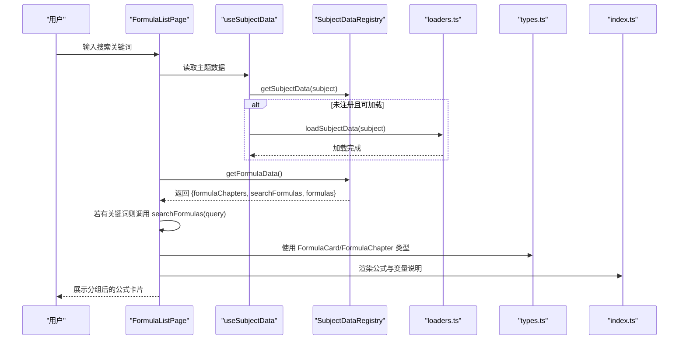
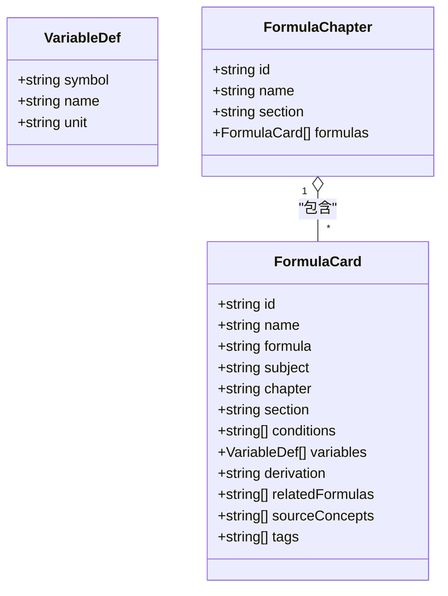
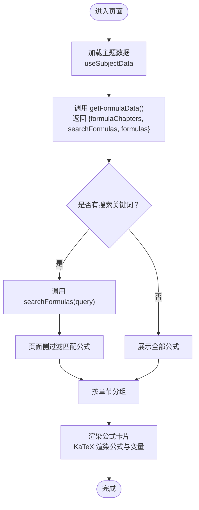
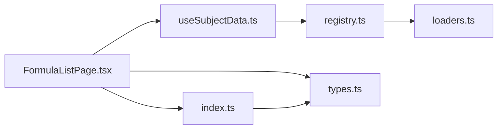

# 物理公式数据结构

<cite>
**本文引用的文件**
- [src/data/physics/formulas/index.ts](file://src/data/physics/formulas/index.ts)
- [src/data/physics/formulas/types.ts](file://src/data/physics/formulas/types.ts)
- [src/sections/FormulaListPage.tsx](file://src/sections/FormulaListPage.tsx)
- [src/hooks/useSubjectData.ts](file://src/hooks/useSubjectData.ts)
- [src/data/registry.ts](file://src/data/registry.ts)
- [src/data/loaders.ts](file://src/data/loaders.ts)
- [src/data/physics/physicsData.ts](file://src/data/physics/physicsData.ts)
</cite>

## 目录
1. [引言](#引言)
2. [项目结构](#项目结构)
3. [核心组件](#核心组件)
4. [架构总览](#架构总览)
5. [详细组件分析](#详细组件分析)
6. [依赖分析](#依赖分析)
7. [性能考虑](#性能考虑)
8. [故障排查指南](#故障排查指南)
9. [结论](#结论)
10. [附录](#附录)

## 引言
本文件系统化梳理物理公式数据结构的设计与实现，聚焦以下目标：
- 公式章节（formulaChapters）的分类体系与章节结构
- 公式数据（formulas）的字段定义与语义
- 公式搜索功能的实现机制（关键词匹配、公式渲染、结果过滤）
- 公式数据的分类管理（力学、热学、电学、光学等）
- 查询、过滤、搜索操作示例与公式与知识点的关联关系
- 版本管理策略与数据加载流程

## 项目结构
物理公式数据位于物理学科的数据层，采用“按主题分模块”的组织方式：
- 数据定义与类型：src/data/physics/formulas/types.ts
- 公式数据聚合：src/data/physics/formulas/index.ts
- 页面级展示与搜索：src/sections/FormulaListPage.tsx
- 主题数据加载与注册：src/data/registry.ts、src/data/loaders.ts、src/hooks/useSubjectData.ts
- 物理模型与知识图谱（辅助理解公式来源与关联）：src/data/physics/physicsData.ts

图表来源
- [src/sections/FormulaListPage.tsx:1-261](file://src/sections/FormulaListPage.tsx#L1-L261)
- [src/data/registry.ts:1-52](file://src/data/registry.ts#L1-L52)
- [src/data/loaders.ts:1-27](file://src/data/loaders.ts#L1-L27)
- [src/hooks/useSubjectData.ts:1-46](file://src/hooks/useSubjectData.ts#L1-L46)
- [src/data/physics/formulas/types.ts:1-30](file://src/data/physics/formulas/types.ts#L1-L30)
- [src/data/physics/formulas/index.ts:1-1055](file://src/data/physics/formulas/index.ts#L1-L1055)
- [src/data/physics/physicsData.ts:1-138](file://src/data/physics/physicsData.ts#L1-L138)

章节来源
- [src/data/physics/formulas/types.ts:1-30](file://src/data/physics/formulas/types.ts#L1-L30)
- [src/data/physics/formulas/index.ts:1-1055](file://src/data/physics/formulas/index.ts#L1-L1055)
- [src/sections/FormulaListPage.tsx:1-261](file://src/sections/FormulaListPage.tsx#L1-L261)
- [src/data/registry.ts:1-52](file://src/data/registry.ts#L1-L52)
- [src/data/loaders.ts:1-27](file://src/data/loaders.ts#L1-L27)
- [src/hooks/useSubjectData.ts:1-46](file://src/hooks/useSubjectData.ts#L1-L46)
- [src/data/physics/physicsData.ts:1-138](file://src/data/physics/physicsData.ts#L1-L138)

## 核心组件
- FormulaCard：单条公式的数据载体，包含唯一ID、名称、LaTeX公式、学科、所属章节与小节、适用条件、变量定义、推导过程、关联公式、来源知识节点、标签等。
- FormulaChapter：章节容器，包含章节ID、名称、所属板块（section）、以及该章节下的所有公式列表。
- 公式数据聚合：在 index.ts 中以数组形式维护 formulas[]，并通过章节字段自动分组形成 formulaChapters[]。
- 页面组件：FormulaListPage 负责搜索输入、章节筛选、公式渲染与折叠展开。

章节来源
- [src/data/physics/formulas/types.ts:10-30](file://src/data/physics/formulas/types.ts#L10-L30)
- [src/data/physics/formulas/index.ts:7-1055](file://src/data/physics/formulas/index.ts#L7-L1055)
- [src/sections/FormulaListPage.tsx:40-97](file://src/sections/FormulaListPage.tsx#L40-L97)

## 架构总览
物理公式数据的前端架构遵循“页面组件 → 数据钩子 → 注册表接口 → 动态加载”的分层设计。页面通过 useSubjectData 获取 SubjectDataRegistry，再调用 getFormulaData 获取公式章节、原始公式列表与搜索函数；搜索由页面本地执行，基于关键词匹配与过滤。

图表来源
- [src/sections/FormulaListPage.tsx:20-97](file://src/sections/FormulaListPage.tsx#L20-L97)
- [src/hooks/useSubjectData.ts:7-46](file://src/hooks/useSubjectData.ts#L7-L46)
- [src/data/registry.ts:4-18](file://src/data/registry.ts#L4-L18)
- [src/data/loaders.ts:11-22](file://src/data/loaders.ts#L11-L22)
- [src/data/physics/formulas/types.ts:10-30](file://src/data/physics/formulas/types.ts#L10-L30)
- [src/data/physics/formulas/index.ts:1-1055](file://src/data/physics/formulas/index.ts#L1-L1055)

## 详细组件分析

### 组件A：FormulaCard 与 FormulaChapter 数据模型
- 字段定义与职责
  - id：唯一标识符，便于跳转与关联
  - name：公式名称，用于展示与索引
  - formula：LaTeX 表达式字符串，用于渲染
  - subject：学科标识（预留扩展至六科）
  - chapter：所属章节（如“匀变速直线运动”）
  - section：所属板块（如“运动学”、“力学”、“曲线运动”、“能量与动量”、“电磁学”、“万有引力”）
  - conditions：适用条件数组（如“匀变速直线运动”、“加速度恒定”、“纯电阻电路”等）
  - variables：变量定义数组，包含 symbol、name、unit
  - derivation：可选的推导过程（关键步骤）
  - relatedFormulas：可选的关联公式ID数组
  - sourceConcepts：来源知识节点ID数组（如["P03","P04","P05"]），用于建立公式与知识点的双向关联
  - tags：搜索标签数组（如["速度","运动学","匀变速"等）

- 分类体系与章节结构
  - 章节（chapter）与板块（section）共同构成两级分类：
    - section 示例：运动学、力学、曲线运动、能量与动量、电磁学、万有引力
    - chapter 示例：运动与力的关系、力学常见力、抛体运动、圆周运动、天体运动、动能定理、动量守恒定律、静电场、恒定电流、闭合电路欧姆定律、磁场、洛伦兹力、带电粒子在磁场中的运动等
  - 公式数据在 index.ts 中按章节字段进行自然分组，形成 formulaChapters[]，每个章节包含其下所有公式

- 字段复杂度与存储
  - 单条 FormulaCard 的字段数量适中，适合前端直接渲染与检索
  - variables 数组规模通常较小（多数为2-4个），便于表格化展示
  - sourceConcepts 与 relatedFormulas 支持双向关联，利于知识网络构建

图表来源
- [src/data/physics/formulas/types.ts:4-30](file://src/data/physics/formulas/types.ts#L4-L30)

章节来源
- [src/data/physics/formulas/types.ts:10-30](file://src/data/physics/formulas/types.ts#L10-L30)
- [src/data/physics/formulas/index.ts:7-1055](file://src/data/physics/formulas/index.ts#L7-L1055)

### 组件B：公式搜索与过滤机制
- 关键流程
  - 页面组件维护 searchQuery 状态与 activeSection（当前激活的章节）
  - 若存在搜索关键词，则调用 searchFormulas(query)；否则回退到全部公式列表
  - 过滤逻辑：页面侧对 formulaChapters 中的公式进行二次过滤，仅保留与搜索结果匹配的公式
  - 渲染：使用 KaTeX 将 LaTeX 公式与变量符号安全渲染为 HTML

- 匹配范围
  - 公式名称（name）
  - LaTeX 表达式（formula）
  - 变量符号（variables[].symbol）
  - 标签（tags）
  - 适用条件（conditions）

- 结果排序
  - 当前实现未显式声明排序规则；若需排序，可在 searchFormulas 内部按关键词匹配度或历史使用频次进行排序

图表来源
- [src/sections/FormulaListPage.tsx:20-97](file://src/sections/FormulaListPage.tsx#L20-L97)
- [src/data/registry.ts:14-17](file://src/data/registry.ts#L14-L17)

章节来源
- [src/sections/FormulaListPage.tsx:44-56](file://src/sections/FormulaListPage.tsx#L44-L56)
- [src/sections/FormulaListPage.tsx:133-141](file://src/sections/FormulaListPage.tsx#L133-L141)
- [src/data/registry.ts:14-17](file://src/data/registry.ts#L14-L17)

### 组件C：页面渲染与交互
- 搜索输入与章节筛选
  - 搜索框支持关键词输入，实时触发过滤
  - 章节按钮支持“全部”与各章节切换，点击切换 activeSection
- 卡片展开
  - 每条公式卡片支持折叠/展开，展开后显示变量说明、适用条件、来源知识节点、标签等
- 公式渲染
  - 使用 KaTeX 将 LaTeX 表达式与变量符号渲染为 HTML，确保数学符号正确显示

章节来源
- [src/sections/FormulaListPage.tsx:73-97](file://src/sections/FormulaListPage.tsx#L73-L97)
- [src/sections/FormulaListPage.tsx:115-238](file://src/sections/FormulaListPage.tsx#L115-L238)

### 组件D：数据加载与注册
- 主题注册与加载
  - registry.ts 定义 SubjectDataRegistry 接口，统一暴露 getFormulaData、searchFormulas 等方法
  - loaders.ts 提供按学科动态导入的能力，避免一次性加载所有学科数据
  - useSubjectData.ts 在路由参数 subject 变化时，检查是否已注册；若不可加载或未注册，则尝试异步加载
- 物理模型与知识图谱
  - physicsData.ts 提供物理模型列表与前置关系，辅助理解公式来源与知识网络

章节来源
- [src/data/registry.ts:4-38](file://src/data/registry.ts#L4-L38)
- [src/data/loaders.ts:1-27](file://src/data/loaders.ts#L1-L27)
- [src/hooks/useSubjectData.ts:1-46](file://src/hooks/useSubjectData.ts#L1-L46)
- [src/data/physics/physicsData.ts:1-138](file://src/data/physics/physicsData.ts#L1-L138)

## 依赖分析
- 组件耦合
  - FormulaListPage 依赖 useSubjectData 与 SubjectDataRegistry，间接依赖 loaders.ts 的动态加载能力
  - types.ts 的类型定义被 index.ts 与页面组件共同使用，保持数据契约稳定
- 外部依赖
  - KaTeX 用于公式渲染
  - React Router 用于导航到知识点详情页（基于 sourceConcepts）

图表来源
- [src/sections/FormulaListPage.tsx:13](file://src/sections/FormulaListPage.tsx#L13)
- [src/hooks/useSubjectData.ts:3-5](file://src/hooks/useSubjectData.ts#L3-L5)
- [src/data/registry.ts:40-52](file://src/data/registry.ts#L40-L52)
- [src/data/loaders.ts:11-22](file://src/data/loaders.ts#L11-L22)
- [src/data/physics/formulas/types.ts:1-30](file://src/data/physics/formulas/types.ts#L1-L30)
- [src/data/physics/formulas/index.ts:1-1055](file://src/data/physics/formulas/index.ts#L1-L1055)

章节来源
- [src/sections/FormulaListPage.tsx:13](file://src/sections/FormulaListPage.tsx#L13)
- [src/hooks/useSubjectData.ts:3-5](file://src/hooks/useSubjectData.ts#L3-L5)
- [src/data/registry.ts:40-52](file://src/data/registry.ts#L40-L52)
- [src/data/loaders.ts:11-22](file://src/data/loaders.ts#L11-L22)
- [src/data/physics/formulas/types.ts:1-30](file://src/data/physics/formulas/types.ts#L1-L30)
- [src/data/physics/formulas/index.ts:1-1055](file://src/data/physics/formulas/index.ts#L1-L1055)

## 性能考虑
- 搜索性能
  - 当前 searchFormulas 在页面侧对 formulas[] 进行过滤，建议在数据层实现更高效的关键词索引（如倒排索引）以降低 O(n) 搜索成本
- 渲染性能
  - 公式渲染使用 KaTeX，建议启用懒加载与虚拟滚动，减少大量公式同时渲染带来的卡顿
- 数据加载
  - 使用动态导入按需加载物理数据，避免首屏过大；可结合缓存策略提升重复访问体验

## 故障排查指南
- 页面空白或加载中
  - 检查 useSubjectData 是否成功注册主题数据；若未注册且不可加载，将显示“即将上线”占位
- 搜索无结果
  - 确认关键词是否覆盖 name、formula、variables.symbol、tags、conditions 中任一字段
  - 若 searchFormulas 未实现，请确认 registry.ts 中 getFormulaData 返回的 searchFormulas 是否可用
- 导航到知识点失败
  - 确认 sourceConcepts 中的知识点ID格式与路由约定一致

章节来源
- [src/sections/FormulaListPage.tsx:25-39](file://src/sections/FormulaListPage.tsx#L25-L39)
- [src/sections/FormulaListPage.tsx:248-256](file://src/sections/FormulaListPage.tsx#L248-L256)
- [src/data/registry.ts:14-17](file://src/data/registry.ts#L14-L17)

## 结论
本项目以清晰的数据模型与分层架构实现了物理公式库的展示与搜索。FormulaCard 与 FormulaChapter 的两级分类满足了从“章节”到“公式”的浏览需求；页面侧的搜索与过滤提供了灵活的检索体验。未来可在数据层引入更高效的搜索索引、增强排序策略，并优化渲染性能，以进一步提升用户体验。

## 附录

### A. 公式数据字段定义一览
- id：唯一ID
- name：公式名称
- formula：LaTeX 表达式
- subject：学科标识
- chapter：所属章节
- section：所属板块
- conditions：适用条件数组
- variables：变量定义数组（symbol、name、unit）
- derivation：可选推导过程
- relatedFormulas：可选关联公式ID数组
- sourceConcepts：来源知识节点ID数组
- tags：搜索标签数组

章节来源
- [src/data/physics/formulas/types.ts:10-23](file://src/data/physics/formulas/types.ts#L10-L23)

### B. 公式分类管理示例（节选）
- 运动学：描述运动的语言、匀变速直线运动、自由落体与竖直上抛
- 力学：运动与力的关系、力学常见力
- 曲线运动与万有引力：抛体运动、圆周运动、天体运动、万有引力定律
- 能量与动量：功与功率、动能定理、重力势能·弹性势能、机械能守恒定律、动量与冲量、动量定理、动量守恒定律
- 电磁学：电荷与库仑定律、静电场、电容器、恒定电流、电功·电功率、闭合电路欧姆定律、磁场、安培力、洛伦兹力、带电粒子在磁场中的运动

章节来源
- [src/data/physics/formulas/index.ts:6-1055](file://src/data/physics/formulas/index.ts#L6-L1055)

### C. 查询、过滤、搜索操作示例
- 查询全部公式
  - 通过 getFormulaData 获取 { formulas, formulaChapters, searchFormulas }
- 按关键词过滤
  - 若 searchQuery 非空：调用 searchFormulas(searchQuery)，再在页面侧对 formulaChapters.formulas 进行二次过滤
- 按章节筛选
  - 切换 activeSection，仅展示对应章节的公式
- 公式渲染
  - 使用 KaTeX 将 formula 与 variables[].symbol 渲染为 HTML

章节来源
- [src/sections/FormulaListPage.tsx:40-56](file://src/sections/FormulaListPage.tsx#L40-L56)
- [src/sections/FormulaListPage.tsx:133-141](file://src/sections/FormulaListPage.tsx#L133-L141)
- [src/data/registry.ts:14-17](file://src/data/registry.ts#L14-L17)

### D. 公式与知识点的关联关系
- sourceConcepts：公式来源于哪些知识点（如["P03","P04","P05"]）
- relatedFormulas：公式之间的关联（如推导链）
- 知识图谱：physicsData.ts 提供模型与前置关系，辅助理解知识网络

章节来源
- [src/data/physics/formulas/types.ts:19-22](file://src/data/physics/formulas/types.ts#L19-L22)
- [src/data/physics/physicsData.ts:42-78](file://src/data/physics/physicsData.ts#L42-L78)

### E. 版本管理策略建议
- 数据版本号：在 FormulaCard 中增加 version 字段，用于标记数据版本
- 变更日志：在 derivation 或 tags 中记录重要变更摘要
- 迁移策略：当字段结构变更时，通过适配器在 getFormulaData 中进行兼容转换
- 缓存与增量更新：结合 loaders.ts 的动态加载，实现按需更新与缓存失效