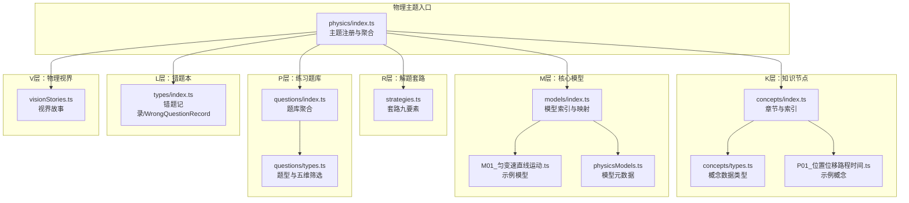
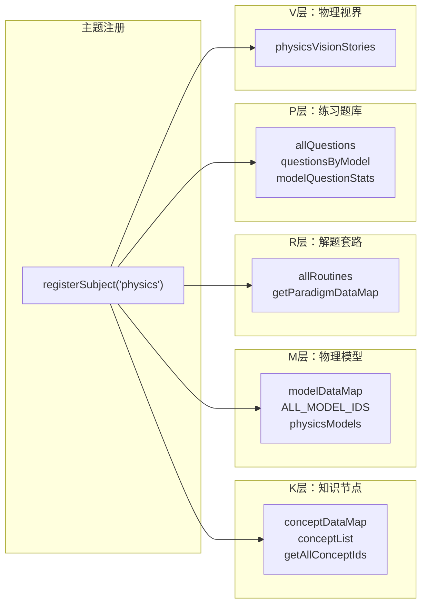
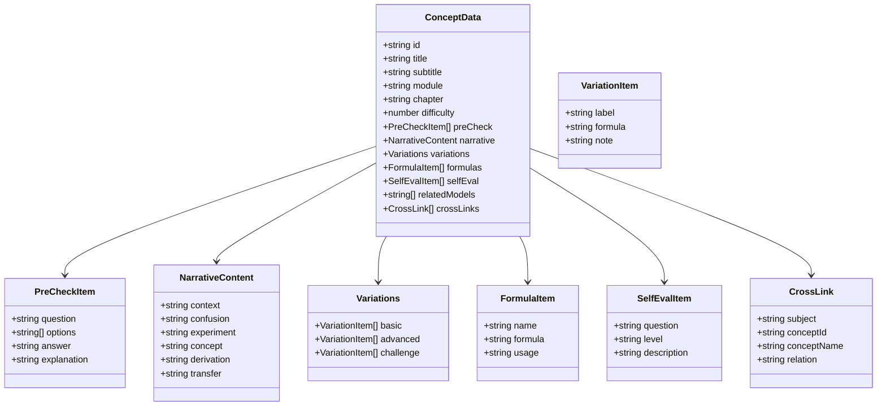
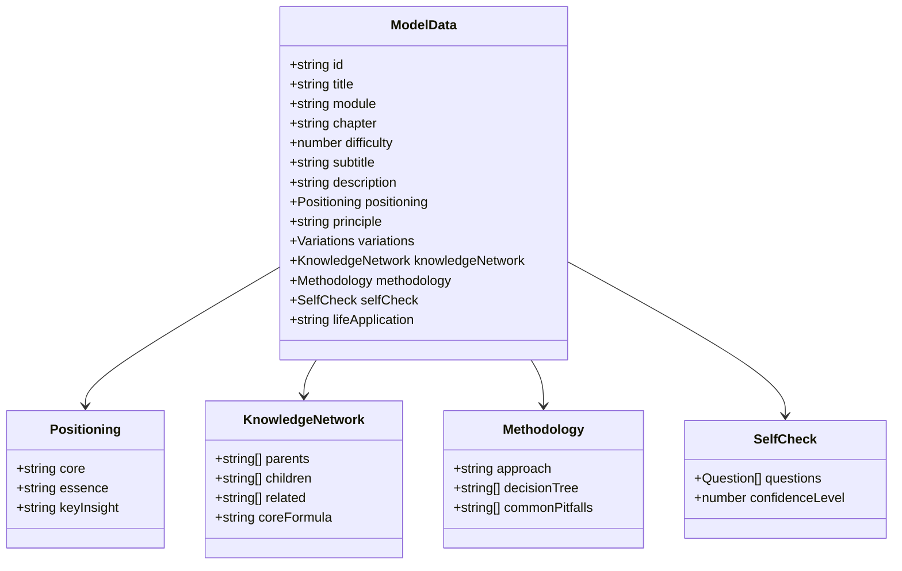
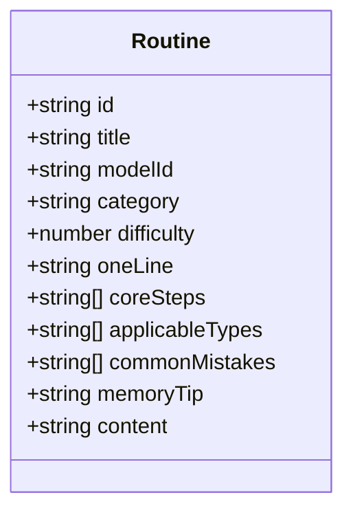
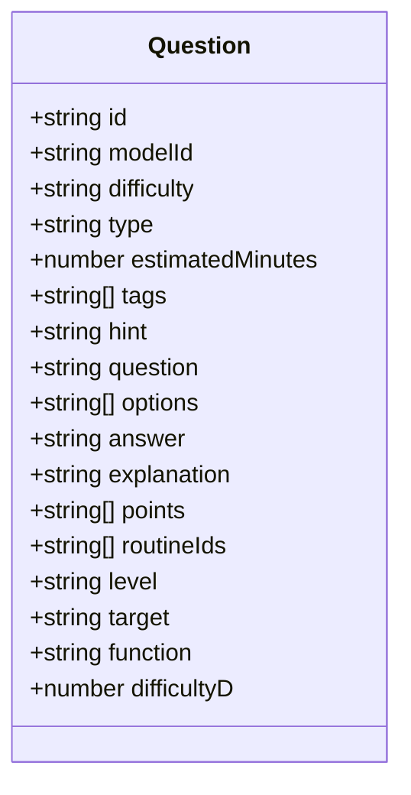
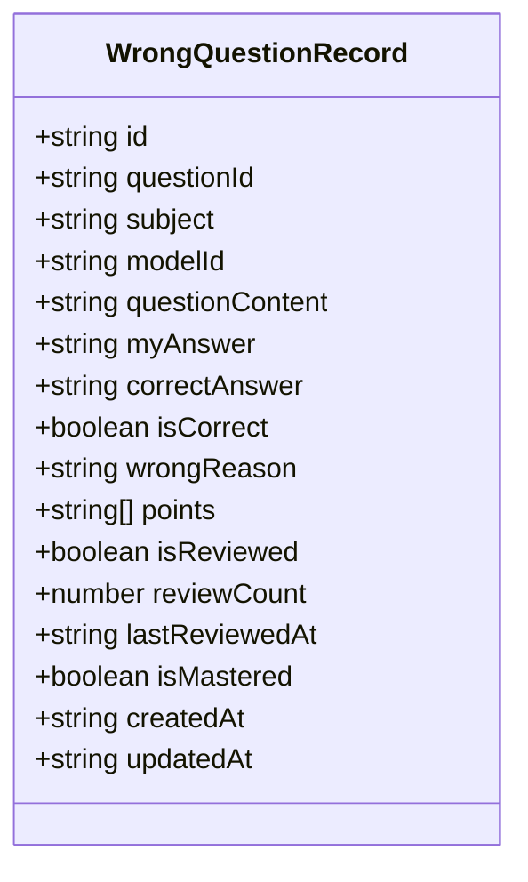
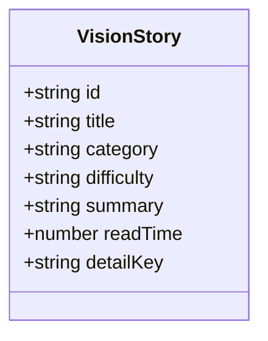
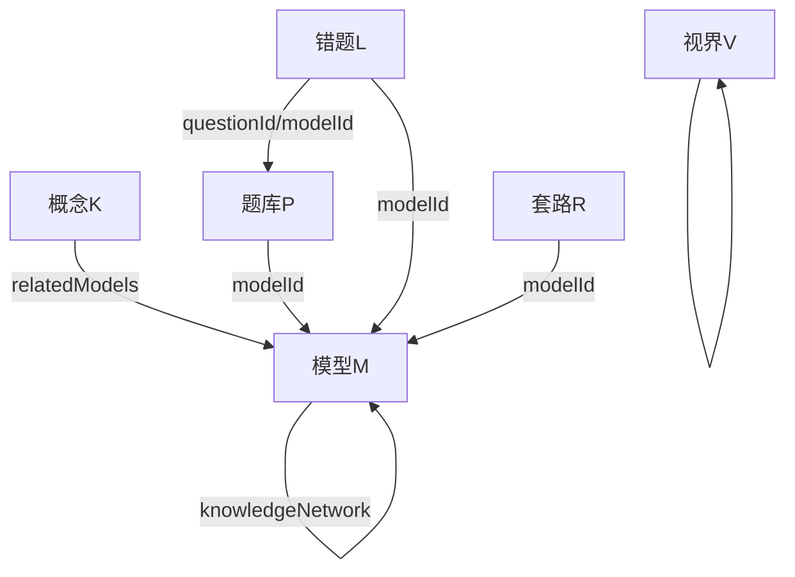
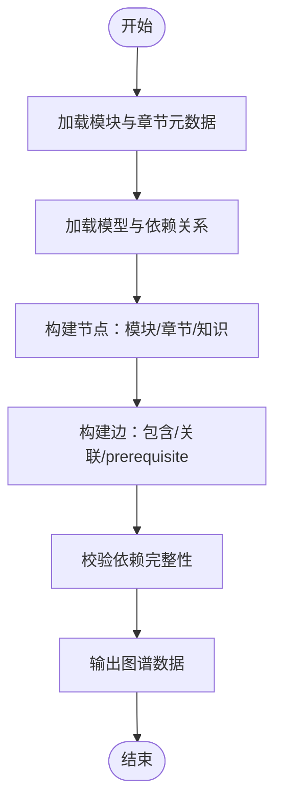

# 物理学科数据结构

<cite>
**本文引用的文件**
- [src/data/physics/index.ts](file://src/data/physics/index.ts)
- [src/data/physics/physicsData.ts](file://src/data/physics/physicsData.ts)
- [src/data/physics/physicsModels.ts](file://src/data/physics/physicsModels.ts)
- [src/data/physics/strategies.ts](file://src/data/physics/strategies.ts)
- [src/data/physics/thinkingMethods.ts](file://src/data/physics/thinkingMethods.ts)
- [src/data/physics/visionStories.ts](file://src/data/physics/visionStories.ts)
- [src/data/physics/concepts/index.ts](file://src/data/physics/concepts/index.ts)
- [src/data/physics/concepts/types.ts](file://src/data/physics/concepts/types.ts)
- [src/data/physics/concepts/P01_位置位移路程时间.ts](file://src/data/physics/concepts/P01_位置位移路程时间.ts)
- [src/data/physics/models/index.ts](file://src/data/physics/models/index.ts)
- [src/data/physics/models/M01_匀变速直线运动.ts](file://src/data/physics/models/M01_匀变速直线运动.ts)
- [src/data/physics/questions/index.ts](file://src/data/physics/questions/index.ts)
- [src/data/physics/questions/types.ts](file://src/data/physics/questions/types.ts)
- [src/types/index.ts](file://src/types/index.ts)
- [docs/architecture/高中物理·知识网络与内容体系.md](file://docs/architecture/高中物理·知识网络与内容体系.md)
</cite>

## 目录
1. [引言](#引言)
2. [项目结构](#项目结构)
3. [核心组件](#核心组件)
4. [架构总览](#架构总览)
5. [详细组件分析](#详细组件分析)
6. [依赖分析](#依赖分析)
7. [性能考量](#性能考量)
8. [故障排查指南](#故障排查指南)
9. [结论](#结论)
10. [附录](#附录)

## 引言
本文件系统化梳理物理学科的数据结构与组织方式，围绕“K层（知识节点）、M层（核心模型）、R层（解题套路）、P层（练习题库）、L层（错题本）、V层（物理视界）”六层数据体系，结合模块化组织（力学、机械振动与机械波、热学、电学、磁学、光学、原子物理）与章节划分，阐明概念、模型、题目、学习状态与知识网络的字段定义、关系与处理流程。文档还提供导入、查询、更新操作示例，以及数据一致性与性能优化策略。

## 项目结构
物理数据采用“主题域 + 多层级数据”的组织方式：
- 主题注册与聚合：在物理主题入口集中导出模块、模型、题库、图谱等数据，统一注册到全局主题注册器，供前端页面与路由使用。
- 知识层（K）：概念节点（concepts）按章节组织，每个节点包含前置检测、叙事正文、分层变形、公式卡片、自评等模块。
- 模型层（M）：物理模型（models）以“模型七模块”结构组织，涵盖定位与本质、核心原理、分层变形、知识网络、方法论、自我检测、生活应用。
- 套路层（R）：解题套路（strategies）以“套路九要素”组织，覆盖适用类型、难度、核心步骤、技巧、常见误区、关联知识与模型等。
- 题库层（P）：题库按模型分组，提供难度标签、筛选维度（五维：能力层级、学习目标、题目功能、难度D、类型）。
- 错题层（L）：学习状态与错题记录（WrongQuestionRecord）支持错题标注、原因、复习与掌握状态。
- 视界层（V）：物理视界故事（visionStories）以故事卡片形式承载学科史、人物、前沿、趣味等主题内容。

图表来源
- [src/data/physics/index.ts:1-433](file://src/data/physics/index.ts#L1-L433)
- [src/data/physics/concepts/index.ts:1-196](file://src/data/physics/concepts/index.ts#L1-L196)
- [src/data/physics/concepts/types.ts:1-78](file://src/data/physics/concepts/types.ts#L1-L78)
- [src/data/physics/concepts/P01_位置位移路程时间.ts:1-144](file://src/data/physics/concepts/P01_位置位移路程时间.ts#L1-L144)
- [src/data/physics/models/index.ts:1-98](file://src/data/physics/models/index.ts#L1-L98)
- [src/data/physics/models/M01_匀变速直线运动.ts:1-85](file://src/data/physics/models/M01_匀变速直线运动.ts#L1-L85)
- [src/data/physics/physicsModels.ts:1-66](file://src/data/physics/physicsModels.ts#L1-L66)
- [src/data/physics/strategies.ts:1-800](file://src/data/physics/strategies.ts#L1-L800)
- [src/data/physics/questions/index.ts:1-45](file://src/data/physics/questions/index.ts#L1-L45)
- [src/data/physics/questions/types.ts:1-35](file://src/data/physics/questions/types.ts#L1-L35)
- [src/data/physics/visionStories.ts:1-23](file://src/data/physics/visionStories.ts#L1-L23)
- [src/types/index.ts:1-209](file://src/types/index.ts#L1-L209)

章节来源
- [src/data/physics/index.ts:1-433](file://src/data/physics/index.ts#L1-L433)
- [src/data/physics/concepts/index.ts:1-196](file://src/data/physics/concepts/index.ts#L1-L196)
- [src/data/physics/models/index.ts:1-98](file://src/data/physics/models/index.ts#L1-L98)
- [src/data/physics/strategies.ts:1-800](file://src/data/physics/strategies.ts#L1-L800)
- [src/data/physics/questions/index.ts:1-45](file://src/data/physics/questions/index.ts#L1-L45)
- [src/data/physics/questions/types.ts:1-35](file://src/data/physics/questions/types.ts#L1-L35)
- [src/data/physics/visionStories.ts:1-23](file://src/data/physics/visionStories.ts#L1-L23)
- [src/types/index.ts:1-209](file://src/types/index.ts#L1-L209)

## 核心组件
- 物理主题元数据与模块章节
  - 物理主题元数据包含学科标识、名称、颜色与模块章节划分，模块下包含若干章节，章节进一步挂载知识节点ID。
  - 示例字段：主题ID、名称、模块数组（含模块ID、标题、顺序、章节数组）。
- 知识节点（K）
  - 字段：id、subject、module、chapter、title、difficulty、prerequisiteIds、relatedIds、estimatedTime、status、principle、knowledgeNetwork、methodology、lifeApplications。
  - 知识网络：nodes（核心/前置/扩展节点）、edges（依赖关系标签）。
- 物理模型（M）
  - 字段：id、title、module、chapter、difficulty、subtitle、description、positioning、principle、variations、knowledgeNetwork、methodology、selfCheck、lifeApplication。
  - 模型元数据（physicsModels.ts）：静态基础字段（id、title、module、chapter、order）。
- 解题套路（R）
  - 字段：id、title、modelId、category、difficulty、oneLine、coreSteps、applicableTypes、commonMistakes、memoryTip、content。
- 练习题库（P）
  - 字段：id、modelId、difficulty、type、estimatedMinutes、tags、hint、question、options、answer、explanation、points、routineIds、level、target、function、difficultyD。
  - 聚合：allQuestions、questionsByModel、modelQuestionStats。
- 错题本（L）
  - 字段：id、questionId、subject、modelId、questionContent、myAnswer、correctAnswer、isCorrect、wrongReason、points、isReviewed、reviewCount、lastReviewedAt、isMastered、createdAt、updatedAt。
- 物理视界（V）
  - 字段：id、title、category、difficulty、summary、readTime、detailKey。

章节来源
- [src/data/physics/index.ts:19-76](file://src/data/physics/index.ts#L19-L76)
- [src/types/index.ts:35-87](file://src/types/index.ts#L35-L87)
- [src/types/index.ts:190-209](file://src/types/index.ts#L190-L209)
- [src/data/physics/concepts/types.ts:51-77](file://src/data/physics/concepts/types.ts#L51-L77)
- [src/data/physics/models/M01_匀变速直线运动.ts:1-85](file://src/data/physics/models/M01_匀变速直线运动.ts#L1-L85)
- [src/data/physics/physicsModels.ts:11-65](file://src/data/physics/physicsModels.ts#L11-L65)
- [src/data/physics/strategies.ts:5-17](file://src/data/physics/strategies.ts#L5-L17)
- [src/data/physics/questions/types.ts:4-35](file://src/data/physics/questions/types.ts#L4-L35)
- [src/data/physics/questions/index.ts:1-45](file://src/data/physics/questions/index.ts#L1-L45)
- [src/data/physics/visionStories.ts:1-23](file://src/data/physics/visionStories.ts#L1-L23)

## 架构总览
物理数据通过主题入口统一注册，形成“模块—章节—知识节点—模型—套路—题库—视界”的完整闭环。前端页面通过主题注册器获取数据，实现概念学习、模型详解、套路训练、题库练习与视界拓展。

图表来源
- [src/data/physics/index.ts:383-431](file://src/data/physics/index.ts#L383-L431)

章节来源
- [src/data/physics/index.ts:383-431](file://src/data/physics/index.ts#L383-L431)

## 详细组件分析

### 知识节点（K）数据结构与关系
- 数据来源：concepts/index.ts 汇总各概念文件，生成 conceptDataMap 与 conceptList（章节化组织）。
- 字段要点：前置检测（preCheck）、叙事正文（narrative）、分层变形（variations）、公式卡片（formulas）、自评（selfEval）、关联模型与跨学科链接。
- 关系：prerequisiteIds/relatedIds 与 knowledgeNetwork.edges 构成知识依赖图；与模型（M）通过 relatedModels 关联。

图表来源
- [src/data/physics/concepts/types.ts:4-77](file://src/data/physics/concepts/types.ts#L4-L77)
- [src/data/physics/concepts/P01_位置位移路程时间.ts:6-144](file://src/data/physics/concepts/P01_位置位移路程时间.ts#L6-L144)

章节来源
- [src/data/physics/concepts/index.ts:1-196](file://src/data/physics/concepts/index.ts#L1-L196)
- [src/data/physics/concepts/types.ts:1-78](file://src/data/physics/concepts/types.ts#L1-L78)
- [src/data/physics/concepts/P01_位置位移路程时间.ts:1-144](file://src/data/physics/concepts/P01_位置位移路程时间.ts#L1-L144)

### 物理模型（M）数据结构与关系
- 数据来源：models/index.ts 汇总 M01~M42 模型文件，生成 modelDataMap；physicsModels.ts 提供静态模型元数据。
- 字段要点：positioning（定位与本质）、principle（核心原理）、variations（分层变形）、knowledgeNetwork（知识网络）、methodology（方法论）、selfCheck（自我检测）、lifeApplication（生活应用）。
- 关系：模型间通过 knowledgeNetwork.children/parents/related 建立依赖；与知识节点（K）通过 relatedModels 关联。

图表来源
- [src/data/physics/models/M01_匀变速直线运动.ts:1-85](file://src/data/physics/models/M01_匀变速直线运动.ts#L1-L85)
- [src/data/physics/physicsModels.ts:11-65](file://src/data/physics/physicsModels.ts#L11-L65)

章节来源
- [src/data/physics/models/index.ts:1-98](file://src/data/physics/models/index.ts#L1-L98)
- [src/data/physics/models/M01_匀变速直线运动.ts:1-85](file://src/data/physics/models/M01_匀变速直线运动.ts#L1-L85)
- [src/data/physics/physicsModels.ts:1-66](file://src/data/physics/physicsModels.ts#L1-L66)

### 解题套路（R）数据结构与关系
- 数据来源：strategies.ts 定义 Routine 接口与 allRoutines 列表。
- 字段要点：id、title、modelId、category、difficulty、oneLine、coreSteps、applicableTypes、commonMistakes、memoryTip、content。
- 关系：与模型（M）通过 modelId 关联；与知识节点（K）通过 relatedKnowledge 关联（在主题入口中体现）。

图表来源
- [src/data/physics/strategies.ts:5-17](file://src/data/physics/strategies.ts#L5-L17)

章节来源
- [src/data/physics/strategies.ts:1-800](file://src/data/physics/strategies.ts#L1-L800)

### 练习题库（P）数据结构与关系
- 数据来源：questions/index.ts 聚合各模型题库；questions/types.ts 定义题型与五维筛选字段。
- 字段要点：id、modelId、difficulty、type、estimatedMinutes、tags、hint、question、options、answer、explanation、points、routineIds、level、target、function、difficultyD。
- 关系：questionsByModel 以模型ID分组；modelQuestionStats 提供模型题库概览（B/J/T/总计）。

图表来源
- [src/data/physics/questions/types.ts:4-35](file://src/data/physics/questions/types.ts#L4-L35)
- [src/data/physics/questions/index.ts:1-45](file://src/data/physics/questions/index.ts#L1-L45)

章节来源
- [src/data/physics/questions/index.ts:1-45](file://src/data/physics/questions/index.ts#L1-L45)
- [src/data/physics/questions/types.ts:1-35](file://src/data/physics/questions/types.ts#L1-L35)

### 错题本（L）数据结构与关系
- 数据来源：types/index.ts 定义 WrongQuestionRecord。
- 字段要点：id、questionId、subject、modelId、questionContent、myAnswer、correctAnswer、isCorrect、wrongReason、points、isReviewed、reviewCount、lastReviewedAt、isMastered、createdAt、updatedAt。
- 关系：与题库（P）通过 questionId 关联；与模型（M）通过 modelId 关联。

图表来源
- [src/types/index.ts:146-163](file://src/types/index.ts#L146-L163)

章节来源
- [src/types/index.ts:138-163](file://src/types/index.ts#L138-L163)

### 物理视界（V）数据结构与关系
- 数据来源：visionStories.ts 定义 VisionStory。
- 字段要点：id、title、category、difficulty、summary、readTime、detailKey。
- 关系：与主题入口统一注册，供视界页面展示。

图表来源
- [src/data/physics/visionStories.ts:1-23](file://src/data/physics/visionStories.ts#L1-L23)

章节来源
- [src/data/physics/visionStories.ts:1-23](file://src/data/physics/visionStories.ts#L1-L23)

### 物理模块与章节划分
- 模块组织：力学、机械振动与机械波、热学、电学、磁学、光学、原子物理。
- 章节划分：每个模块包含若干章节，章节挂载知识节点ID；主题入口提供模块章节元数据与知识网络图数据。

章节来源
- [src/data/physics/index.ts:24-76](file://src/data/physics/index.ts#L24-L76)
- [docs/architecture/高中物理·知识网络与内容体系.md:247-478](file://docs/architecture/高中物理·知识网络与内容体系.md#L247-L478)

## 依赖分析
- 主题入口依赖：concepts、models、strategies、questions、visionStories 通过 registerSubject 注册，统一暴露给前端。
- 概念与模型：概念（K）与模型（M）通过 relatedModels 建立关联；模型内部 knowledgeNetwork.children/parents/related 描述模型间依赖。
- 题库与模型：questionsByModel 以模型ID分组；modelQuestionStats 提供统计概览。
- 错题与题库：WrongQuestionRecord 通过 questionId 关联题库；通过 modelId 关联模型。
- 知识网络：主题入口提供物理图谱（physicsGraphData）与自动生成图谱（generatePhysicsGraphData）。

图表来源
- [src/data/physics/index.ts:383-431](file://src/data/physics/index.ts#L383-L431)
- [src/data/physics/models/M01_匀变速直线运动.ts:48-53](file://src/data/physics/models/M01_匀变速直线运动.ts#L48-L53)
- [src/data/physics/questions/index.ts:14-17](file://src/data/physics/questions/index.ts#L14-L17)
- [src/types/index.ts:146-163](file://src/types/index.ts#L146-L163)

章节来源
- [src/data/physics/index.ts:383-431](file://src/data/physics/index.ts#L383-L431)
- [src/data/physics/models/M01_匀变速直线运动.ts:48-53](file://src/data/physics/models/M01_匀变速直线运动.ts#L48-L53)
- [src/data/physics/questions/index.ts:1-45](file://src/data/physics/questions/index.ts#L1-L45)
- [src/types/index.ts:146-163](file://src/types/index.ts#L146-L163)

## 性能考量
- 数据聚合与缓存
  - 概念与模型通过 Map/Record 结构（conceptDataMap、modelDataMap）提供 O(1) 查找；questionsByModel 按模型ID分组，避免全量扫描。
- 查询优化
  - getAllConceptIds 返回有序ID列表，便于分页与导航；modelQuestionStats 提供按难度的快速统计。
- 图谱构建
  - generatePhysicsGraphData 一次性生成节点与边，避免运行时重复计算；主题入口提供预构建图谱（physicsGraphData）。
- 前端渲染
  - 将静态数据打包到主题入口，减少运行时解析成本；按需加载模型与套路详情。

[本节为通用指导，不直接分析具体文件]

## 故障排查指南
- 概念缺失
  - 现象：概念ID不在 conceptList 或 conceptDataMap 中。
  - 排查：确认 concepts/index.ts 是否导入对应概念文件；检查 getConceptMeta 与 getAllConceptIds 的实现。
- 模型缺失
  - 现象：模型ID不在 modelDataMap 或 ALL_MODEL_IDS 中。
  - 排查：确认 models/index.ts 是否导出对应模型文件；检查 physicsModels.ts 是否包含该模型元数据。
- 题库分组错误
  - 现象：questionsByModel[modelId] 为空或不完整。
  - 排查：确认 questions/index.ts 中是否正确导入对应模型题库文件。
- 错题记录异常
  - 现象：WrongQuestionRecord 无法匹配题库或模型。
  - 排查：核对 questionId 与 modelId 的一致性；检查 createdAt/updatedAt 更新逻辑。
- 图谱不完整
  - 现象：生成的图谱缺少模块/模型/依赖边。
  - 排查：检查 generatePhysicsGraphData 与主题入口的图谱数据；核对模型 knowledgeNetwork 的 children/parents/related。

章节来源
- [src/data/physics/concepts/index.ts:177-196](file://src/data/physics/concepts/index.ts#L177-L196)
- [src/data/physics/models/index.ts:52-98](file://src/data/physics/models/index.ts#L52-L98)
- [src/data/physics/questions/index.ts:1-45](file://src/data/physics/questions/index.ts#L1-L45)
- [src/types/index.ts:146-163](file://src/types/index.ts#L146-L163)
- [src/data/physics/physicsData.ts:80-120](file://src/data/physics/physicsData.ts#L80-L120)

## 结论
本物理学科数据结构以“K-M-R-P-L-V”六层为核心，通过主题入口统一注册与聚合，形成从知识节点到物理模型、解题套路、题库、错题与视界的完整学习闭环。模块化组织与章节划分确保内容体系清晰，图谱与统计指标支撑学习路径与能力评估。通过 Map/Record 结构与聚合数据，前端可高效查询与渲染；同时提供导入、查询、更新与一致性保障机制，满足大规模内容管理与个性化学习需求。

[本节为总结性内容，不直接分析具体文件]

## 附录

### 物理知识网络图构建原理
- 节点类型：module（模块）、chapter（章节）、knowledge（知识节点）。
- 边类型：包含（模块→章节）、关联（模块→章节/知识）、prerequisite（前置依赖）。
- 生成流程：从主题入口的模块章节元数据与模型依赖关系生成节点与边；也可通过 generatePhysicsGraphData 自动汇总模型与前置关系。

图表来源
- [src/data/physics/index.ts:300-326](file://src/data/physics/index.ts#L300-L326)
- [src/data/physics/physicsData.ts:80-120](file://src/data/physics/physicsData.ts#L80-L120)

章节来源
- [src/data/physics/index.ts:300-326](file://src/data/physics/index.ts#L300-L326)
- [src/data/physics/physicsData.ts:80-120](file://src/data/physics/physicsData.ts#L80-L120)

### 数据导入、查询与更新示例（路径指引）
- 导入概念
  - 在 concepts/index.ts 中导入新增概念文件，并将其加入 conceptDataMap 与 conceptList。
  - 参考：[src/data/physics/concepts/index.ts:7-85](file://src/data/physics/concepts/index.ts#L7-L85)
- 导入模型
  - 在 models/index.ts 中导入新增模型文件，并将其加入 modelDataMap；在 physicsModels.ts 中补充模型元数据。
  - 参考：[src/data/physics/models/index.ts:1-50](file://src/data/physics/models/index.ts#L1-L50)、[src/data/physics/physicsModels.ts:22-65](file://src/data/physics/physicsModels.ts#L22-L65)
- 导入题库
  - 在 questions/index.ts 中导入新增模型题库文件，并更新 questionsByModel 与 modelQuestionStats。
  - 参考：[src/data/physics/questions/index.ts:5-37](file://src/data/physics/questions/index.ts#L5-L37)
- 查询与更新
  - 查询概念：通过 getConceptMeta/getAllConceptIds 获取元信息与ID列表。
  - 查询模型：通过 getAllModelIds/getModelDataMap 获取模型数据。
  - 查询题库：通过 getQuestionsByModel/getAllQuestions 获取题库。
  - 更新错题：通过 WrongQuestionRecord 字段更新状态与复习记录。
  - 参考：[src/data/physics/index.ts:383-431](file://src/data/physics/index.ts#L383-L431)、[src/types/index.ts:146-163](file://src/types/index.ts#L146-L163)

章节来源
- [src/data/physics/concepts/index.ts:7-85](file://src/data/physics/concepts/index.ts#L7-L85)
- [src/data/physics/models/index.ts:1-50](file://src/data/physics/models/index.ts#L1-L50)
- [src/data/physics/physicsModels.ts:22-65](file://src/data/physics/physicsModels.ts#L22-L65)
- [src/data/physics/questions/index.ts:5-37](file://src/data/physics/questions/index.ts#L5-L37)
- [src/data/physics/index.ts:383-431](file://src/data/physics/index.ts#L383-L431)
- [src/types/index.ts:146-163](file://src/types/index.ts#L146-L163)

### 数据一致性保证机制
- 类型约束：通过 types/index.ts 的接口定义确保字段类型与结构一致。
- 注册校验：主题入口 registerSubject 将各模块数据统一注册，避免遗漏。
- 聚合校验：questions/index.ts 与 concepts/index.ts 的聚合逻辑确保数据完整性。
- 图谱校验：generatePhysicsGraphData 与主题入口图谱数据保持一致。

章节来源
- [src/types/index.ts:1-209](file://src/types/index.ts#L1-L209)
- [src/data/physics/index.ts:383-431](file://src/data/physics/index.ts#L383-L431)
- [src/data/physics/questions/index.ts:1-45](file://src/data/physics/questions/index.ts#L1-L45)
- [src/data/physics/concepts/index.ts:1-196](file://src/data/physics/concepts/index.ts#L1-L196)